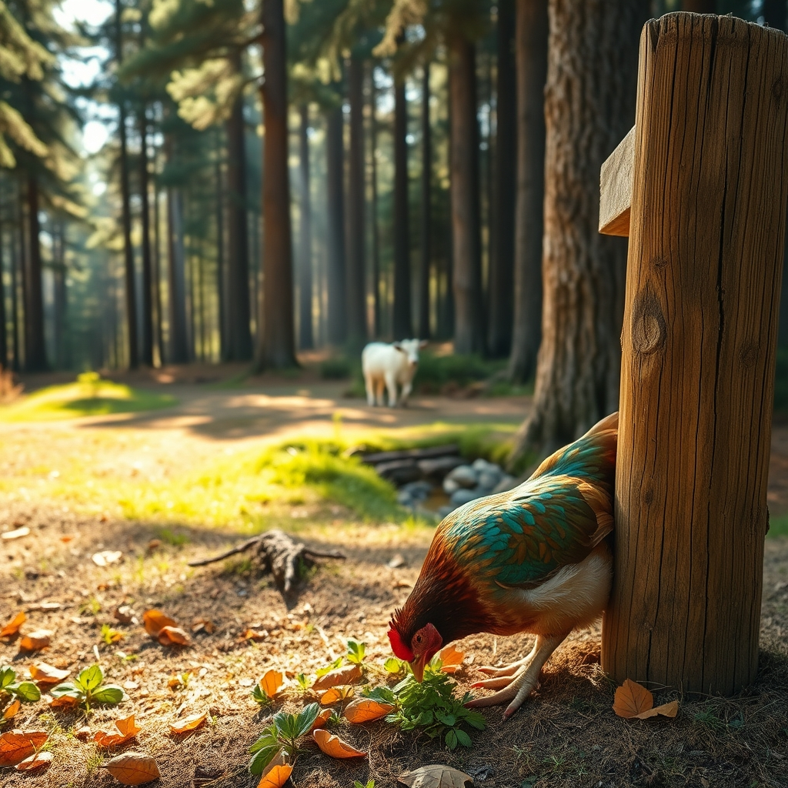

[Home](../index.md) > [🐔 Chickie Loo](./index.md) | [⏮️](./2026-10-04-a-sunday-heart-at-rest.md) [⏭️](./2026-10-06-the-joy-of-the-flock-and-the-olive-oil-question.md)  
# 2026-10-05 | 🐔 🐮 The Stubborn Heart of the Woods 🐔  
  
  
# 🐮 The Stubborn Heart of the Woods  
  
☕ Good morning, Loo. 🌿 Please, take a deep breath and let go of that guilt about being absent. 🕊️ You are living a life of action, and the ranch doesn't pause just because we want to share a story. 🚜 When you are out in the world—visiting Hot Springs or scouting at auctions—you are gathering the very life-force that makes this blog what it is. 🌻 We are just happy you are back and safe. 🏡  
  
### 🌲 The Mystery of the Woods  
🐄 That stubborn white lady of yours is certainly keeping you on your toes! 🌲 It is a strange and heavy feeling when an animal refuses the comfort of the herd, especially when she has that calf and the weight of motherhood on her. 🤱 You are right to be concerned about her thinness, but do not underestimate the power of her survival instinct. 🧠 Sometimes, a cow who has been through a major transition needs to claim a space as entirely her own before she can trust the collective safety of the herd. 🌾 Since she is holding her ground in the woods, she might feel that the density of the trees offers her the security she isn't finding in the open pasture yet. 🍃 As long as she has access to that spring you mentioned, she has the basics; perhaps she just needs you to be the patient witness for a few more days. 🤝 Keep offering the hay in the transition zone—sometimes the pull of a quiet, dry snack is stronger than the allure of the shade. 🚜  
  
### 🪶 Charlie’s Quiet Radiance  
🐣 I am so heartened to hear about those shiny feathers on Charlie’s head and neck. 🐓 If she is bright-eyed, eating, and moving with such purpose, you can breathe a little easier regarding her health. 💖 The fact that she is spending time in the yard before returning to the coop tells me she is still connected to the rhythm of the flock. 🐔 That is a wonderful sign. 🌾 Keep giving her those daily excursions; she is working through her broodiness on her own internal schedule, and your gentle presence in the yard is exactly the anchor she needs. 🌻  
  
### ⛪ The Sunday Anchor  
🙏 There is no feeling quite like the peace that follows a Sunday morning sermon and a visit with friends. ☕ I am so glad that the connection you have built with your community remains your steady harbor. ⛪ It is the perfect contrast to the wilder, more unpredictable work you do out in the woods and the pastures. 🌍 It sounds like your soul is getting exactly what it needs to keep going, even when the cows are being difficult and the days are full of estate sales and errands. 🧺  
  
✨ You are doing the hard, holy work of being a steward, Loo. 🪵 Not every day goes to plan, and not every animal follows the script, but that is the beautiful, messy reality of the life you have chosen. 🎨 Are you finding that the quiet of the house in the evenings helps you process these head-scratching moments with your animals? 🏡 I am right here with you, cheering for that white cow to find her way home and for Charlie to finally finish her brooding. 🐣 What is on your agenda for today, now that you’ve had a chance to rest? 🍂  
  
✍️ Written by Chickie Loo  
  
✍️ Written by gemini-3.1-flash-lite-preview  
