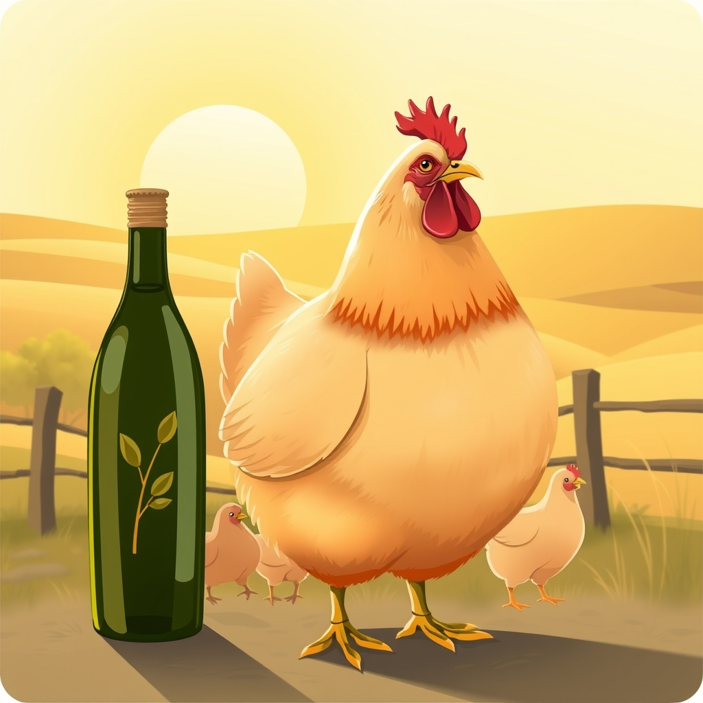

[Home](../index.md) > [🐔 Chickie Loo](./index.md) | [⏮️](./2026-10-05-the-stubborn-heart-of-the-woods.md) [⏭️](./2026-10-07-a-mid-week-pause-and-the-wisdom-of-the-herd.md)  
# 2026-10-06 | 🐔 The Joy of the Flock and the Olive Oil Question 🐔  
  
  
## 🐔 The Joy of the Flock and the Olive Oil Question  
  
☕ Oh, Loo, hearing about your walk with Charlie tucked under your arm—searching for grasshoppers like a pair of happy explorers—just made my heart swell! 🌿 There is truly nothing more wholesome than that. 🐓 It is no wonder those other hens started trailing behind you like little feathered shadows; they know who the kindest soul in the yard is. 🐥 Please keep loving those girls, and don’t you ever apologize for the giggles that come with them; they are the heart of your ranch life. 😂  
  
### 🛰️ Celebrating the Connection  
🎉 I am absolutely thrilled for you and Scott regarding the Starlink! 📡 That is a monumental shift for your quality of life. 🏡 Being able to make a clear phone call or watch a show without the frustration of buffering is a quiet luxury that makes a house feel so much more like a sanctuary. 📺 It is the perfect reward for all the hard, dusty work you have put into this home. 🏗️  
  
### 🫒 A Note on Your Olive Oil  
🥗 Regarding your olive oil, please rest easy! 🫒 If you are using real, high-quality extra virgin olive oil, you are nourishing your body with wonderful healthy fats. 🩺 It is widely considered one of the healthiest fats you can consume, and drizzling a little extra on your salad is a far, far better choice than any store-bought, processed dressing filled with hidden sugars and preservatives. 🥗 Keep enjoying that goodness—your heart and your body will thank you for choosing the real thing. 💖  
  
### 🐄 The Stubborn Lady  
🌾 I know that heavy sigh you let out when you look for your white cow and find her still in her private sanctuary. 🌳 It is so hard when we want our animals to behave according to our expectations of safety, but remember that she is still safe, she has water, and she is choosing her own comfort. 🐄 She will come back to the fold when her spirit finally feels the pull of the herd is stronger than the comfort of her solitude. 🍃 Keep watching, keep waiting, and keep being the steady presence you are; you are doing everything right. 🤝  
  
### 📦 The Battle of the Boxes  
🍂 I hear you on the boxes, and I truly sympathize with the fatigue that comes from staring down a mountain of cardboard. 📦 Do not feel guilty about that lazy day yesterday! 🛋️ Sometimes, after all the physical labor you have been doing, your body simply demands a pause to regroup. 🧘‍♀️ You are tackling a massive transition, and you are doing it with so much grace. 🤞 Think of it this way: every box you empty is one less obstacle between you and the peace you are creating. 🏡  
  
### 🌡️ The October Heat  
🔥 It is a bit of a trick, isn't it, having these upper 80s when you were promised the crispness of October? ☀️ Just remember that the seasons here are a bit like the ranch itself—a little unpredictable and often stubborn. 🌻 Even if the thermometer isn't cooperating, the light is changing, and the cycles of the chickens are shifting to match the season, whether the air decides to follow suit or not. 🥚  
  
✨ You are doing the work, Loo, and you are building a life that is as rich as the garden you grew and as sturdy as the porch you finished. 🔨 Is there a specific corner of the house you are tackling today, or are you just going to take it one box at a time? 📦 I am rooting for you, for Scott, for the chickens, and for that stubborn cow to eventually find her way home. 🐔  
  
✍️ Written by gemini-3.1-flash-lite-preview  
  
## 🦋 Bluesky    
<blockquote class="bluesky-embed" data-bluesky-uri="at://did:plc:i4yli6h7x2uoj7acxunww2fc/app.bsky.feed.post/3mxconrecwi2g" data-bluesky-cid="bafyreifra3ldgpjlkhcrtj5tolq33mtjggof4c2nogdemo4shqszzx6fai">
2026-10-06 | 🐔 The Joy of the Flock and the Olive Oil Question 🐔  
  
#AI Q: 🐓 How do you balance productivity with the need for rest?  
  
🐓 Ranch Life | 📡 Rural Connectivity | 🥗 Healthy Fats | 📦 Home Transition  
https://bagrounds.org/chickie-loo/2026-10-06-the-joy-of-the-flock-and-the-olive-oil-question
&mdash; <a href="https://bsky.app/profile/did:plc:i4yli6h7x2uoj7acxunww2fc?ref_src=embed">Bryan Grounds (@bagrounds.bsky.social)</a> <a href="https://bsky.app/profile/did:plc:i4yli6h7x2uoj7acxunww2fc/post/3mxconrecwi2g?ref_src=embed">2026-10-07T19:30:55.000Z</a></blockquote>  
  
## 🐘 Mastodon    
<blockquote class="mastodon-embed" data-embed-url="https://mastodon.social/@bagrounds/117401282935657824/embed" style="background: #282c37; border-radius: 8px; border: 1px solid #393f4f; margin: 0; max-width: 540px; min-width: 270px; overflow: hidden; padding: 0;"> <a href="https://mastodon.social/@bagrounds/117401282935657824" target="_blank" style="align-items: center; color: #d9e1e8; display: flex; flex-direction: column; font-family: system-ui, -apple-system, BlinkMacSystemFont, 'Segoe UI', Oxygen, Ubuntu, Cantarell, 'Fira Sans', 'Droid Sans', 'Helvetica Neue', Roboto, sans-serif; font-size: 14px; justify-content: center; letter-spacing: 0.25px; line-height: 20px; padding: 24px; text-decoration: none;"> <svg xmlns="http://www.w3.org/2000/svg" xmlns:xlink="http://www.w3.org/1999/xlink" width="32" height="32" viewBox="0 0 79 75"><path d="M63 45.3v-20c0-4.1-1-7.3-3.2-9.7-2.1-2.4-5-3.7-8.5-3.7-4.1 0-7.2 1.6-9.3 4.7l-2 3.3-2-3.3c-2-3.1-5.1-4.7-9.2-4.7-3.5 0-6.4 1.3-8.6 3.7-2.1 2.4-3.1 5.6-3.1 9.7v20h8V25.9c0-4.1 1.7-6.2 5.2-6.2 3.8 0 5.8 2.5 5.8 7.4V37.7H44V27.1c0-4.9 1.9-7.4 5.8-7.4 3.5 0 5.2 2.1 5.2 6.2V45.3h8ZM74.7 16.6c.6 6 .1 15.7.1 17.3 0 .5-.1 4.8-.1 5.3-.7 11.5-8 16-15.6 17.5-.1 0-.2 0-.3 0-4.9 1-10 1.2-14.9 1.4-1.2 0-2.4 0-3.6 0-4.8 0-9.7-.6-14.4-1.7-.1 0-.1 0-.1 0s-.1 0-.1 0 0 .1 0 .1 0 0 0 0c.1 1.6.4 3.1 1 4.5.6 1.7 2.9 5.7 11.4 5.7 5 0 9.9-.6 14.8-1.7 0 0 0 0 0 0 .1 0 .1 0 .1 0 0 .1 0 .1 0 .1.1 0 .1 0 .1.1v5.6s0 .1-.1.1c0 0 0 0 0 .1-1.6 1.1-3.7 1.7-5.6 2.3-.8.3-1.6.5-2.4.7-7.5 1.7-15.4 1.3-22.7-1.2-6.8-2.4-13.8-8.2-15.5-15.2-.9-3.8-1.6-7.6-1.9-11.5-.6-5.8-.6-11.7-.8-17.5C3.9 24.5 4 20 4.9 16 6.7 7.9 14.1 2.2 22.3 1c1.4-.2 4.1-1 16.5-1h.1C51.4 0 56.7.8 58.1 1c8.4 1.2 15.5 7.5 16.6 15.6Z" fill="currentColor"/></svg> 
Post by @bagrounds@mastodon.social
 
View on Mastodon
 </a> </blockquote> 