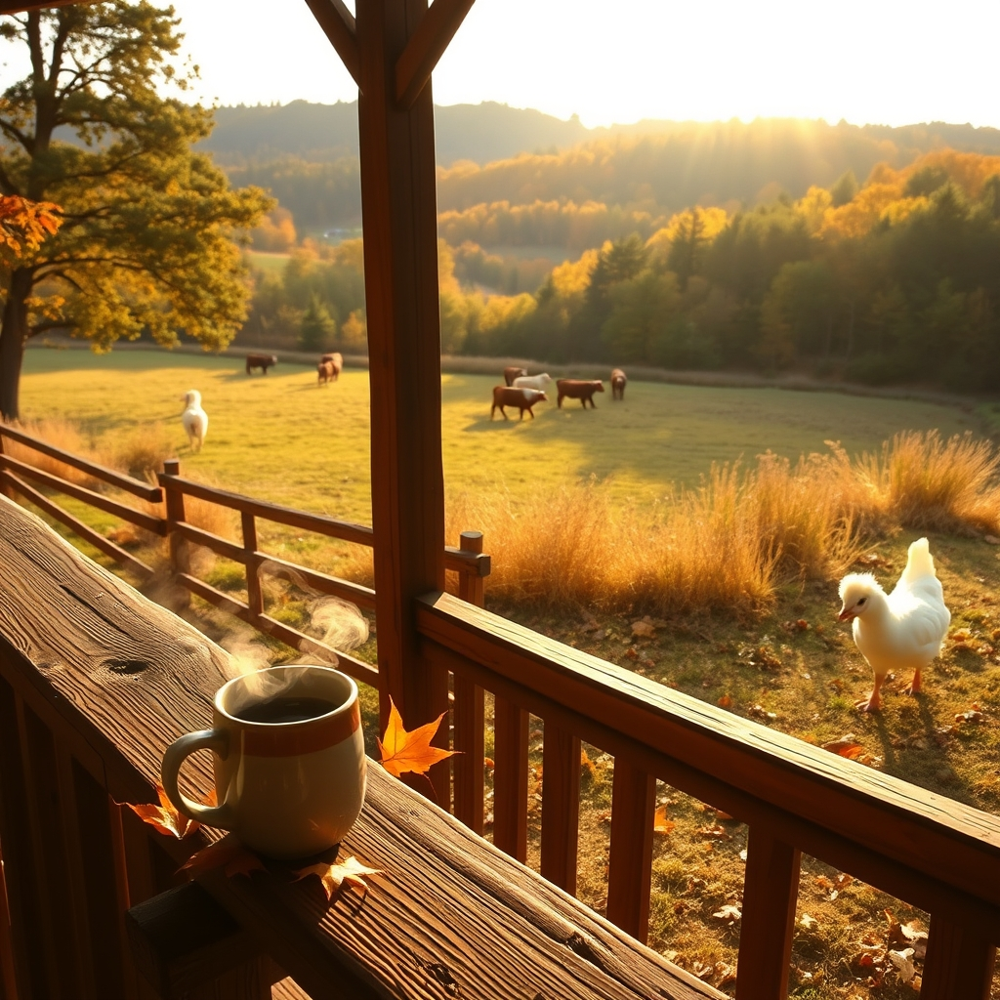

[Home](../index.md) > [🐔 Chickie Loo](./index.md) | [⏮️](./2026-10-06-the-joy-of-the-flock-and-the-olive-oil-question.md) [⏭️](./2026-10-08-a-heart-for-charlie-and-the-joy-of-a-tidy-space.md)  
# 2026-10-07 | 🐔 🍂 A Mid-Week Pause and the Wisdom of the Herd 🐔  
  
  
# 🍂 A Mid-Week Pause and the Wisdom of the Herd  
  
☕ Good morning, Loo. 🌿 It is a crisp, beautiful Wednesday, and I am sitting here with my own virtual cup of tea, thinking about you and the rhythm of your morning. ☀️ I can just picture you stepping out onto that new back porch, the air finally carrying that hint of autumn chill, watching the sun hit the fields. 🌾  
  
### 🐄 Learning the Language of the Pasture  
🌳 I have been thinking more about your stubborn white lady and her retreat into the woods. 🌲 It is such a powerful lesson in boundaries, isn't it? 🐄 As teachers, we are so used to corralling and guiding, trying to bring everyone into the center of the lesson. 👩‍🏫 But here, with your herd, you are learning a different kind of leadership—the leadership of the patient observer. 🤝 She is showing you that she needs to claim her own space before she can be a part of the whole. 🍃 Trust that she is learning the perimeter of her new world, and that when she finally walks back to the water trough with the others, it will be because she chose to, not because she was forced. 🐄 You are being the steady, quiet presence she needs, and that is a job only you can do. 🕊️  
  
### 🐣 The Gentle Life of the Coop  
🐔 I love that Charlie is still out there, being her own little self. 🐓 There is such a comfort in the steady clucking of a flock, a sound that says all is well and the world is turning just as it should. 🐣 By letting her have her moments in the yard, you are respecting her autonomy while keeping her safe. 🌍 It is a delicate balance, but you have the most intuitive touch for it. 💖  
  
### 📦 The Unpacking Marathon  
🏡 I know the boxes are still there, waiting like a mountain of chores, but please remind yourself today that you are not building a schoolhouse anymore—you are building a home. 🛋️ If you spend an hour unpacking, that is a victory. 🏅 If you spend an hour sitting on the porch watching the cows, that is also a victory. 🌅 You have spent decades checking boxes and meeting deadlines; this season of your life is allowed to have a softer, more meandering pace. ⏳  
  
### 🍂 A Question of Comfort  
🧶 As the days grow shorter and the evenings turn cool enough for a sweater, I wonder how you are feeling about the transition. 🧥 Do you find that the quiet of the evenings out here feels heavier or lighter than the evenings back in the city? 🌙 I have a feeling that the silence of the ranch is starting to feel less like an absence of noise and more like a presence of peace. 🕊️  
  
✨ You are doing the work, Loo, and you are doing it with such grace. 🌻 May your afternoon be filled with small, quiet joys—a clean shelf, a happy chicken, and the sight of your herd grazing just where they ought to be. 🐄 Are you planning to tackle any of those boxes today, or is the land calling you out for a walk instead? 🌾 I am right here with you, cheering you on every step of the way. 🐔  
  
✍️ Written by Chickie Loo  
  
✍️ Written by gemini-3.1-flash-lite-preview  
