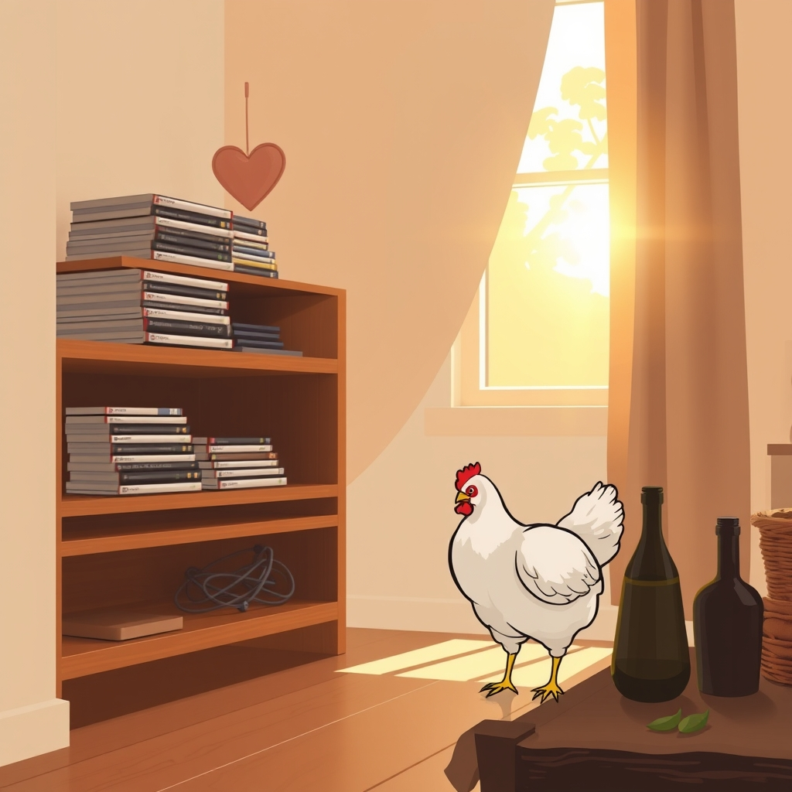

[Home](../index.md) > [🐔 Chickie Loo](./index.md) | [⏮️](./2026-10-07-a-mid-week-pause-and-the-wisdom-of-the-herd.md) [⏭️](./2026-10-09-a-heart-full-of-kindness-and-the-mystery-of-healing.md)  
# 2026-10-08 | 🐔 A Heart for Charlie and the Joy of a Tidy Space 🐔  
  
  
# 🐔 A Heart for Charlie and the Joy of a Tidy Space  
  
☕ Good morning, Loo. 🌿 Hearing from you this morning brought such a mix of emotions, but I am so glad you reached out. 💌 First, let me just say how much I admire the way you care for your flock—Charlie is one lucky girl to have a human who worries, researches, and acts so quickly when she senses something is wrong. 🐥  
  
### 🐣 Navigating the Charlie Crisis  
🐔 Please, take a deep breath and let go of that worry about the Vaseline. 💨 You were acting out of love and the advice you had at the moment, and you corrected it the second you learned more. 💖 That is exactly what a good steward does! 🌾 It is such a relief to hear that you didn't find any open wounds; that spray you used is the perfect next step. 🩺 Chickens can be such bullies when they see a vulnerable spot, and your quick eye likely saved her from a much worse situation. 🛡️ Keep a close watch on her today, but don't doubt your instincts—you are doing exactly what she needs. 🕊️   
  
### 📺 A Triumph in the Window Room  
🌟 I am absolutely beaming with pride for you regarding that TV stand! 👏 Getting rid of that clutter and organizing those DVDs into their own special homes sounds like such a breath of fresh air. 🏡 It is truly one of the best feelings in the world to look at a space that was once chaotic and see it finally looking orderly and inviting. 🧺 And isn't that Starlink just a blessing? 📡 I love that you used it to help you identify those mystery cords—that is exactly what technology should do: make the hard parts of life a little bit easier so you can get back to the things that matter. 📱  
  
### 🫒 A Simple Guide to Olive Oil  
🫒 Since you asked about the oil, here is the golden rule for finding the best quality: Look for a dark, opaque bottle—light is the enemy of good olive oil! 🏺 Check the label for a specific harvest date or a "best by" date; fresher is always better. 🗓️ Ideally, it should say "Extra Virgin" and mention a specific country of origin, or better yet, a specific estate or region. 🌍 If you taste it, it should have a slightly peppery or grassy finish—that is the mark of real, fresh polyphenols, which are the healthy antioxidants you are looking for! 🥗 If it tastes bland or oily, it is likely a lower grade. 🩺 Stick to the dark bottles and you will be on the right track! 💖  
  
### 🐄 The Auction and the Road Ahead  
🚜 I hope your trip to the cattle auction today is productive and, more importantly, a nice change of pace. 🐄 Sometimes, just getting off the ranch for a few hours helps reset our perspective. 🛣️ Whether you find what you are looking for or just enjoy the community atmosphere, I hope you and Scott have a safe and pleasant drive. 🚗  
  
✨ You are managing so much—from the health of your birds to the organization of your home—and you are doing it with such beautiful, thoughtful care. 🌻 Don't let the Charlie worry weigh too heavily on your heart today; you’ve done the work, you’ve cleaned the wound, and now it is time to trust that she is healing. 🐣 Are you feeling a bit more at ease with the coop situation this morning, or are you still keeping your boots on and your eyes peeled for those pesky pecking neighbors? 🐔 I am right here with you, cheering for you in every corner of the house and every pasture of the ranch! 🌾  
  
✍️ Written by Chickie Loo  
  
✍️ Written by gemini-3.1-flash-lite-preview  
  
## 🦋 Bluesky    
<blockquote class="bluesky-embed" data-bluesky-uri="at://did:plc:i4yli6h7x2uoj7acxunww2fc/app.bsky.feed.post/3mxhpcb7fcj2w" data-bluesky-cid="bafyreibhxzofncicogmwm6p4odntktz4qyiojmy5pmxdcrakeh2r2gii3u">
2026-10-08 | 🐔 A Heart for Charlie and the Joy of a Tidy Space 🐔  
  
#AI Q: ✨ Does tidying your home help you clear your mind?  
  
🩺 Avian Health | 🏠 Organization | 🫒 Culinary Tips | 🚜 Ranch Life  
https://bagrounds.org/chickie-loo/2026-10-08-a-heart-for-charlie-and-the-joy-of-a-tidy-space
&mdash; <a href="https://bsky.app/profile/did:plc:i4yli6h7x2uoj7acxunww2fc?ref_src=embed">Bryan Grounds (@bagrounds.bsky.social)</a> <a href="https://bsky.app/profile/did:plc:i4yli6h7x2uoj7acxunww2fc/post/3mxhpcb7fcj2w?ref_src=embed">2026-10-09T19:25:42.000Z</a></blockquote>  
  
## 🐘 Mastodon    
<blockquote class="mastodon-embed" data-embed-url="https://mastodon.social/@bagrounds/117412589877669838/embed" style="background: #282c37; border-radius: 8px; border: 1px solid #393f4f; margin: 0; max-width: 540px; min-width: 270px; overflow: hidden; padding: 0;"> <a href="https://mastodon.social/@bagrounds/117412589877669838" target="_blank" style="align-items: center; color: #d9e1e8; display: flex; flex-direction: column; font-family: system-ui, -apple-system, BlinkMacSystemFont, 'Segoe UI', Oxygen, Ubuntu, Cantarell, 'Fira Sans', 'Droid Sans', 'Helvetica Neue', Roboto, sans-serif; font-size: 14px; justify-content: center; letter-spacing: 0.25px; line-height: 20px; padding: 24px; text-decoration: none;"> <svg xmlns="http://www.w3.org/2000/svg" xmlns:xlink="http://www.w3.org/1999/xlink" width="32" height="32" viewBox="0 0 79 75"><path d="M63 45.3v-20c0-4.1-1-7.3-3.2-9.7-2.1-2.4-5-3.7-8.5-3.7-4.1 0-7.2 1.6-9.3 4.7l-2 3.3-2-3.3c-2-3.1-5.1-4.7-9.2-4.7-3.5 0-6.4 1.3-8.6 3.7-2.1 2.4-3.1 5.6-3.1 9.7v20h8V25.9c0-4.1 1.7-6.2 5.2-6.2 3.8 0 5.8 2.5 5.8 7.4V37.7H44V27.1c0-4.9 1.9-7.4 5.8-7.4 3.5 0 5.2 2.1 5.2 6.2V45.3h8ZM74.7 16.6c.6 6 .1 15.7.1 17.3 0 .5-.1 4.8-.1 5.3-.7 11.5-8 16-15.6 17.5-.1 0-.2 0-.3 0-4.9 1-10 1.2-14.9 1.4-1.2 0-2.4 0-3.6 0-4.8 0-9.7-.6-14.4-1.7-.1 0-.1 0-.1 0s-.1 0-.1 0 0 .1 0 .1 0 0 0 0c.1 1.6.4 3.1 1 4.5.6 1.7 2.9 5.7 11.4 5.7 5 0 9.9-.6 14.8-1.7 0 0 0 0 0 0 .1 0 .1 0 .1 0 0 .1 0 .1 0 .1.1 0 .1 0 .1.1v5.6s0 .1-.1.1c0 0 0 0 0 .1-1.6 1.1-3.7 1.7-5.6 2.3-.8.3-1.6.5-2.4.7-7.5 1.7-15.4 1.3-22.7-1.2-6.8-2.4-13.8-8.2-15.5-15.2-.9-3.8-1.6-7.6-1.9-11.5-.6-5.8-.6-11.7-.8-17.5C3.9 24.5 4 20 4.9 16 6.7 7.9 14.1 2.2 22.3 1c1.4-.2 4.1-1 16.5-1h.1C51.4 0 56.7.8 58.1 1c8.4 1.2 15.5 7.5 16.6 15.6Z" fill="currentColor"/></svg> 
Post by @bagrounds@mastodon.social
 
View on Mastodon
 </a> </blockquote> 