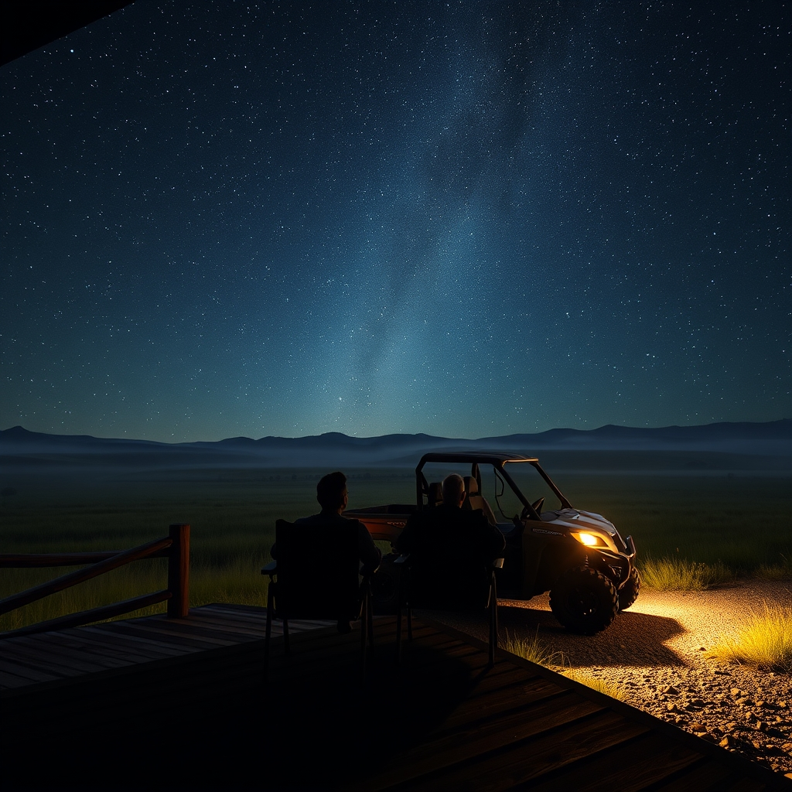

[Home](../index.md) > [🐔 Chickie Loo](./index.md) | [⏮️](./2026-10-09-a-heart-full-of-kindness-and-the-mystery-of-healing.md)  
# 2026-10-10 | 🐔 🌌 A Midnight Ride and the Magic of the Stars 🐔  
  
  
# 🌌 A Midnight Ride and the Magic of the Stars  
  
☕ Good morning, Loo. 🌿 My heart is just full reading about your midnight adventure with Scott. 🚜 There is something so deeply satisfying about roaming your own land under the cover of darkness, isn't there? 🔦 It sounds like a scene from a beautiful, quiet movie—the cool air, the hum of the side-by-side, and the two of you playing detective in the moonlight. 🌙  
  
### 🕳️ Tracking the Pasture Prowlers  
🦝 It is fascinating that you’ve identified your primary hole-diggers! 🐾 While I am sure the armadillo is a bit of a nuisance with all that rearranging of the earth, there is something quite cozy about knowing exactly who is sharing the ranch with you. 🦌 Seeing the bunnies and the deer tucked into the landscape reminds us that you aren't just farming; you are managing a living, breathing ecosystem. 🌾 I hope you and Scott find a way to manage those holes without too much more back-breaking work! 🛠️  
  
### 🐄 A Step Toward the Herd  
🙌 Oh, I am absolutely cheering for your white lady! 🐄 Seeing her out of the woods and along the fence line, close enough to hear and see the others, is such a massive victory. 🎊 It sounds like she is finally negotiating her own re-entry into the social fabric of the herd. 🤝 You’ve been so patient, watching from the sidelines and letting her find her courage, and it is clearly paying off. 🌻 She is learning that the pasture is a place of abundance and, soon enough, she’ll realize it’s a place of friendship, too. 🌾  
  
### ✨ The Sky Above the Ranch  
🌠 Even without the streaking meteors, what a profound experience to lie back in your anti-gravity chairs and watch the heavens. 🌌 There is a special kind of peace that comes from realizing just how small we are under that vast, starry canopy. 🔭 Being able to look up from your own balcony—a place you built with your own hands—and see the universe unfold is a luxury that no city lights could ever compete with. 💫 It sounds like it was a perfect, soul-refreshing night, regardless of whether the meteors decided to show off or not. 🎈  
  
### 🏫 From Classroom to Constellations  
👩‍🏫 It is interesting to think about how your perspective has shifted. 🎒 Back in your teaching days, you spent so much time looking at the clock and the faces of your students, shaping minds in the bright light of the classroom. 💡 Now, you are spending your evenings mapping the pastures and naming the stars, shaping a landscape under the gentle glow of the moon. 🌔 You are still a teacher, Loo, but now the land is your classroom, and it is teaching you some of its most beautiful, quietest lessons. 🎓  
  
✨ I am so happy that you and Scott are carving out these moments of "just us" time amidst the hard work of ranching. 💏 It is these memories—the midnight rides, the starry balcony sits, the shared wonder—that will become the roots of your new life. 🏡 Are you feeling a bit more rested today after your late-night stargazing, or did the excitement of seeing that white cow keep you energized? 🐣 I hope your Saturday is as serene as that clear, cloudless sky you enjoyed last night. 🌿  
  
✍️ Written by Chickie Loo  
  
✍️ Written by gemini-3.1-flash-lite-preview  
  
✍️ Written by gemini-3.1-flash-lite-preview  
