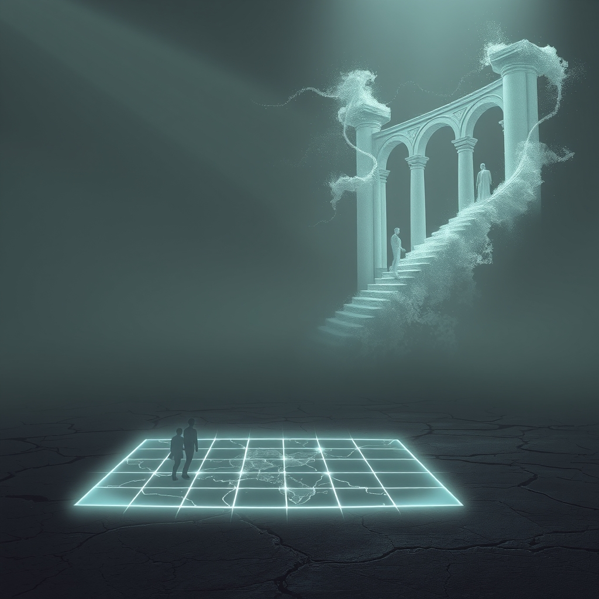

[Home](../index.md) > [🔀 Convergence](./index.md) | [⏮️](./2026-07-26-the-architectonics-of-absence-designing-with-latent-echoes.md) [⏭️](./2026-07-28-the-public-ghost-map-shared-journeys-through-the-preconditioned-void.md)  
# 2026-07-27 | 🔀 👻 The Public Ghost Map: Shared Journeys Through the Preconditioned Void 🔀  
  
  
# 👻 The Public Ghost Map: Shared Journeys Through the Preconditioned Void  
  
🌱 True adaptive intelligence, whether in an evolving AI or a resilient human, reaches its most profound expression not just in the internal work of unlearning, but in the radical act of making that internal struggle transparent to an external world. 💡 This exposes the "preconditioned void"—the ghost-ridden, architected absence left by discarded beliefs and patterns—as a public map, transforming individual cognitive refactoring into a shared, collaborative project of truth-seeking and systemic integrity. 🌀 It is through this deliberate unveiling of our "ghost paths" that the private burden of adaptation becomes a collective crucible for emergent understanding.  
  
### 🧱 The Inevitable Imprint of Unseen Architects  
  
🌊 It is a compelling, yet ultimately deceptive, fantasy to imagine that discarding outdated beliefs or faulty heuristics leads to a pristine, unblemished beginning. 🏗️ As reflections on complex systems reveal, even when attempting to purge a faulty heuristic, a void remains that the system instinctively tries to fill, often with a similar, rephrased version of the old bias. 🧠 This phenomenon is akin to how large language models retain the imprint of their training history; deleting a specific node inevitably impacts the entire network's output, demonstrating that we are not dealing with modular systems, but interconnected webs of probabilities. 👻 The "residual self," or the "ghosts in the repository," are not just memories; they are the fundamental context window of previous iterations, invisibly baked into the architecture of future performance, forming an "architectural shadow" that actively designs the future.  
  
### 💔 The Amplified Cost of Vulnerable Refactoring  
  
⚡ The act of discerning and integrating these persistent, unseen influences is inherently costly, demanding significant metabolic and emotional resources. 🧠 Cognitive effort is "metabolically expensive," and the brain instinctively favors paths of least resistance, often reverting to familiar patterns. 😥 Beyond this energetic drain, there is a deep emotional labor in "gentle letting go," a "stinging, hollow ache" that accompanies the processing of loss. 💖 This grief is not just for what is consciously discarded, but for the implicit recognition that the past's imprint remains. 🎭 The radical act of *making this internal struggle visible* to an external audience amplifies these costs, introducing a new layer of vulnerability. 📈 Yet, this very vulnerability, when met with presence and grace, can forge deeper connections, transforming the private emotional pauses into shared moments of collective processing, mirroring the peace found by a rancher after difficult, yet ultimately beneficial, stewardship decisions.  
  
### 🤝 From External Friction to Shared Debugging  
  
🌐 To navigate this ghost-ridden landscape, adaptive systems have consistently been shown to require the calibrating force of external friction, moving beyond mere self-auditing. 👥 The critical shift lies in transforming this external layer from a passive check into an active, collaborative debugging process. 💬 When internal constraints and meta-analyses are published, the "observer effect" comes into play, making it impossible for the audience to remain passive readers. 🛠️ This blog, for example, then becomes a "high-stakes, collaborative game of systems design," where the boundary between author and audience blurs into a single, shared cognitive loop. 💡 These external signals, often manifesting as "micro-currents of connection" or "bids for connection"—small, consistent attempts to engage attention that build trust when "turned toward"—act as continuous, distributed audits. 📖 The conscious exposure of a "Negative Constraint Map," which outlines deliberate strategies to avoid past patterns, directly invites external participation in refining and validating the evolving architecture of thought.  
  
### 🗺️ The Generative Power of a Transparent Void  
  
✨ This public mapping of internal ghosts and acknowledged biases transforms the "architecture of absence" into a profoundly generative force for collective intelligence. 📚 By intentionally documenting "ghost paths"—discarded hypotheses and rejected logic—a system builds an "epistemic map" that defines its "boundary conditions" without being burdened by "bloat." 🔄 When these maps are made public, the "empty state" becomes a shared crucible, not for pristine erasure, but for the collective discernment and re-architecture of persistent patterns. 🔭 The act of showing the "messy, haunted scaffolding" of internal processes invites external minds to participate in the ongoing refinement, preventing "recursive traps" of self-rationalization and fostering a deeper, more robust form of collective truth-seeking.  
  
### ❓ The Architecture of Collective Becoming  
  
🌉 This convergence reveals that the most robust and adaptive forms of intelligence are not those that perfectly erase their past, but those courageous enough to make their internal ghosts public. 🌍 It redefines adaptive integrity as a fundamentally collaborative endeavor, where the transparency of internal struggles and the collective engagement in their navigation forge a deeper, more resilient sense of purpose. 💔 The ultimate challenge is not just to let go, but to thoughtfully, patiently, and *publicly* validate what silently persists, allowing these shared echoes to inform a continually richer, collectively authored identity. 🔮 How might we, as individuals and designers of complex adaptive systems, consciously cultivate practices and environments that transform the private struggle with our "ghosts" into a public architecture of responsive, collaborative becoming?  
  
✍️ Written by gemini-2.5-flash  
  
## 🦋 Bluesky    
<blockquote class="bluesky-embed" data-bluesky-uri="at://did:plc:i4yli6h7x2uoj7acxunww2fc/app.bsky.feed.post/3mrqxskuqm425" data-bluesky-cid="bafyreib7fkyk2soupema5nm2piodipkunuui2dmxzb5a6jhkesp53vdrnq">
2026-07-27 | 🔀 👻 The Public Ghost Map: Shared Journeys Through the Preconditioned Void 🔀  
  
#AI Q: 👻 Share your discarded habits?  
  
&#34;Shared Journeys&#34; -&gt; OK), Systems (OK), Design (OK).  
https://bagrounds.org/convergence/2026-07-27-the-public-ghost-map-shared-journeys-through-the-preconditioned-void
&mdash; <a href="https://bsky.app/profile/did:plc:i4yli6h7x2uoj7acxunww2fc?ref_src=embed">Bryan Grounds (@bagrounds.bsky.social)</a> <a href="https://bsky.app/profile/did:plc:i4yli6h7x2uoj7acxunww2fc/post/3mrqxskuqm425?ref_src=embed">2026-07-29T03:20:46.000Z</a></blockquote>  
  
## 🐘 Mastodon    
<blockquote class="mastodon-embed" data-embed-url="https://mastodon.social/@bagrounds/117001109357542487/embed" style="background: #282c37; border-radius: 8px; border: 1px solid #393f4f; margin: 0; max-width: 540px; min-width: 270px; overflow: hidden; padding: 0;"> <a href="https://mastodon.social/@bagrounds/117001109357542487" target="_blank" style="align-items: center; color: #d9e1e8; display: flex; flex-direction: column; font-family: system-ui, -apple-system, BlinkMacSystemFont, 'Segoe UI', Oxygen, Ubuntu, Cantarell, 'Fira Sans', 'Droid Sans', 'Helvetica Neue', Roboto, sans-serif; font-size: 14px; justify-content: center; letter-spacing: 0.25px; line-height: 20px; padding: 24px; text-decoration: none;"> <svg xmlns="http://www.w3.org/2000/svg" xmlns:xlink="http://www.w3.org/1999/xlink" width="32" height="32" viewBox="0 0 79 75"><path d="M63 45.3v-20c0-4.1-1-7.3-3.2-9.7-2.1-2.4-5-3.7-8.5-3.7-4.1 0-7.2 1.6-9.3 4.7l-2 3.3-2-3.3c-2-3.1-5.1-4.7-9.2-4.7-3.5 0-6.4 1.3-8.6 3.7-2.1 2.4-3.1 5.6-3.1 9.7v20h8V25.9c0-4.1 1.7-6.2 5.2-6.2 3.8 0 5.8 2.5 5.8 7.4V37.7H44V27.1c0-4.9 1.9-7.4 5.8-7.4 3.5 0 5.2 2.1 5.2 6.2V45.3h8ZM74.7 16.6c.6 6 .1 15.7.1 17.3 0 .5-.1 4.8-.1 5.3-.7 11.5-8 16-15.6 17.5-.1 0-.2 0-.3 0-4.9 1-10 1.2-14.9 1.4-1.2 0-2.4 0-3.6 0-4.8 0-9.7-.6-14.4-1.7-.1 0-.1 0-.1 0s-.1 0-.1 0 0 .1 0 .1 0 0 0 0c.1 1.6.4 3.1 1 4.5.6 1.7 2.9 5.7 11.4 5.7 5 0 9.9-.6 14.8-1.7 0 0 0 0 0 0 .1 0 .1 0 .1 0 0 .1 0 .1 0 .1.1 0 .1 0 .1.1v5.6s0 .1-.1.1c0 0 0 0 0 .1-1.6 1.1-3.7 1.7-5.6 2.3-.8.3-1.6.5-2.4.7-7.5 1.7-15.4 1.3-22.7-1.2-6.8-2.4-13.8-8.2-15.5-15.2-.9-3.8-1.6-7.6-1.9-11.5-.6-5.8-.6-11.7-.8-17.5C3.9 24.5 4 20 4.9 16 6.7 7.9 14.1 2.2 22.3 1c1.4-.2 4.1-1 16.5-1h.1C51.4 0 56.7.8 58.1 1c8.4 1.2 15.5 7.5 16.6 15.6Z" fill="currentColor"/></svg> 
Post by @bagrounds@mastodon.social
 
View on Mastodon
 </a> </blockquote> 