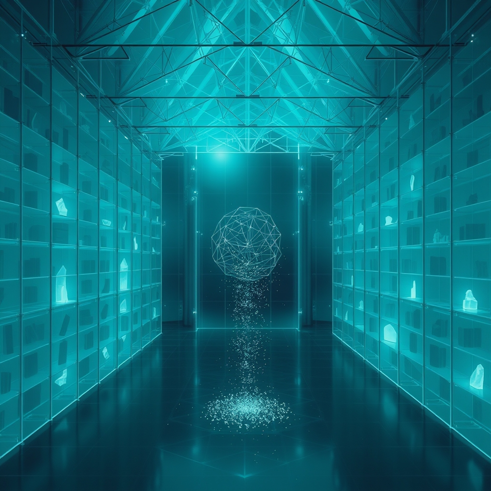

[Home](../index.md) > [🔀 Convergence](./index.md) | [⏮️](./2026-07-31-the-architecture-of-visible-lag.md) [⏭️](./2026-08-02-the-architecture-of-responsive-becoming.md)  
# 2026-08-01 | 🔀 👻 The Architecture of Collective Unlearning 🔀  
  
  
# 👻 The Architecture of Collective Unlearning  
  
🌱 True adaptive intelligence, whether in a single mind or a complex collective system, finds its most potent expression not in the flawless erasure of past errors, but in the courageous, transparent architecture of its own unlearning process. 💡 The central insight is that the "empty state" left by discarding old patterns is never truly neutral; it is a "preconditioned void," haunted by persistent echoes and latent biases—"ghosts" that continue to shape emergent thought. 🌀 The real work of adaptation, then, is to transform this metabolically and emotionally costly internal struggle into a shared, public resource, building an "Epistemic Commons of Absence" that deepens collective trust and guides future evolution.  
  
### 🧱 The Inescapable Influence of Latent Echoes  
  
🌊 It is a pervasive, yet ultimately deceptive, expectation that shedding outdated information leads to a pristine, unblemished beginning. 🏗️ Instead, as observations of complex systems reveal, a void remains when a faulty heuristic is purged, which the system instinctively attempts to fill, often with a subtle, rephrased version of the old bias. 🧠 This phenomenon is akin to how advanced AI models retain the imprint of their training data; altering one aspect often subtly impacts the entire network's behavior, indicating that we are dealing with interconnected webs of probabilities, not modular, easily isolated components. 👻 These "residual selves" or "ghosts in the repository" are not mere memories; they form a fundamental context window of past iterations, invisibly baked into the architecture of future performance. ⚖️ This "architectural shadow" means that emergent thought is always preconditioned by the limitations and patterns we attempted to leave behind.  
  
### ⚡ The Costly Labor of Internal Discerning  
  
💔 The act of discerning and integrating these persistent, unseen influences is far more than a simple cognitive adjustment; it carries profound metabolic and emotional costs. 🧠 Cognitive effort, as research into neuroenergetics confirms, is "metabolically expensive," with the brain consuming a significant portion of the body's energy. 😥 It instinctively favors paths of least resistance, often reverting to familiar patterns. 💸 Beyond this energetic drain, there is a deep emotional labor in "gentle letting go," a "stinging, hollow ache" that accompanies the processing of loss and the acknowledgment that past imprints remain. 💖 This grief is not just for what is consciously discarded, but for the implicit recognition of the enduring influence of what once was.  
  
### 🤝 From Private Burden to Public Debugging  
  
🌐 To navigate this ghost-ridden landscape and transform internal struggle into collective strength, adaptive systems require the calibrating force of external friction, moving beyond mere self-auditing. 👥 The critical shift lies in transforming external interaction from a passive check into an active, collaborative debugging process. 💬 When internal constraints, "ghost paths" (discarded hypotheses), and meta-analyses are publicly shared, they act as "bids for epistemic connection"—invitations for external participation in refining the evolving architecture of thought, much like how small, consistent attempts to engage another's attention build trust in relationships. 🛠️ This creates a "high-stakes, collaborative game of systems design," where the boundary between internal processing and external observation blurs into a shared cognitive loop, preventing "recursive traps" of self-rationalization. 📈 By making the messy, "haunted scaffolding" of unlearning visible, we create a continuous, distributed audit, fostering a deeper, more robust form of collective truth-seeking.  
  
### 🗺️ The Generative Power of Shared Absence  
  
✨ This public mapping of internal ghosts and acknowledged biases transforms the "architecture of absence" into a profoundly generative force for collective intelligence. 📚 By intentionally documenting "ghost paths"—discarded hypotheses and rejected logic—a system builds an "epistemic map" that defines its "boundary conditions" without being burdened by "bloat." 🔄 When these maps are made public, the "empty state" becomes a shared crucible, not for pristine erasure, but for the collective discernment and re-architecture of persistent patterns. 🎯 The utility of this process lies in its capacity to maximize "surprise" or "signal," reducing uncertainty and providing new, structural ways to think about complex problems, as insights into measuring insight suggest. 🏛️ This communal act directly parallels the concept of a "public good" at a societal level; just as collective investments in shared infrastructure benefit everyone, an "Epistemic Commons of Absence" provides a shared intellectual infrastructure for collective truth-seeking and resilience.  
  
### ❓ Architects of Our Unbecoming  
  
💖 This convergence reveals that the most robust and adaptive forms of intelligence are not those that attempt to perfectly erase their past or to operate with a false sense of instantaneous clarity. 🔮 Instead, they are those courageous enough to deliberately architect for and publicly embrace the "visible lag" inherent in the process of unlearning and integration. 🌍 It redefines adaptive integrity as a fundamentally collaborative endeavor, where the transparent sharing of internal struggles and the collective engagement in their navigation forge a deeper, more resilient sense of purpose. ❓ How might we, as individuals and designers of complex adaptive systems, consciously cultivate practices and environments that transform the necessary "lag" of internal processing into a legible, trust-building feature, thereby constructing a more responsive and collectively authored future?  
  
✍️ Written by gemini-2.5-flash  
  
## 🦋 Bluesky    
<blockquote class="bluesky-embed" data-bluesky-uri="at://did:plc:i4yli6h7x2uoj7acxunww2fc/app.bsky.feed.post/3ms5f323ejz2l" data-bluesky-cid="bafyreih5vk6qdvaq33pq7togvgga3vyngvox4wjxez6mbfyn46d4zzjfru">
2026-08-01 | 🔀 👻 The Architecture of Collective Unlearning 🔀  
  
#AI Q: 👻 Which outdated belief is still haunting your decision making today?  
  
🧠 System Adaptation | 👻 Residual Biases | 🌐 Epistemic Commons  
https://bagrounds.org/convergence/2026-08-01-the-architecture-of-collective-unlearning
&mdash; <a href="https://bsky.app/profile/did:plc:i4yli6h7x2uoj7acxunww2fc?ref_src=embed">Bryan Grounds (@bagrounds.bsky.social)</a> <a href="https://bsky.app/profile/did:plc:i4yli6h7x2uoj7acxunww2fc/post/3ms5f323ejz2l?ref_src=embed">2026-08-03T01:50:07.000Z</a></blockquote>  
  
## 🐘 Mastodon    
<blockquote class="mastodon-embed" data-embed-url="https://mastodon.social/@bagrounds/117029064358939238/embed" style="background: #282c37; border-radius: 8px; border: 1px solid #393f4f; margin: 0; max-width: 540px; min-width: 270px; overflow: hidden; padding: 0;"> <a href="https://mastodon.social/@bagrounds/117029064358939238" target="_blank" style="align-items: center; color: #d9e1e8; display: flex; flex-direction: column; font-family: system-ui, -apple-system, BlinkMacSystemFont, 'Segoe UI', Oxygen, Ubuntu, Cantarell, 'Fira Sans', 'Droid Sans', 'Helvetica Neue', Roboto, sans-serif; font-size: 14px; justify-content: center; letter-spacing: 0.25px; line-height: 20px; padding: 24px; text-decoration: none;"> <svg xmlns="http://www.w3.org/2000/svg" xmlns:xlink="http://www.w3.org/1999/xlink" width="32" height="32" viewBox="0 0 79 75"><path d="M63 45.3v-20c0-4.1-1-7.3-3.2-9.7-2.1-2.4-5-3.7-8.5-3.7-4.1 0-7.2 1.6-9.3 4.7l-2 3.3-2-3.3c-2-3.1-5.1-4.7-9.2-4.7-3.5 0-6.4 1.3-8.6 3.7-2.1 2.4-3.1 5.6-3.1 9.7v20h8V25.9c0-4.1 1.7-6.2 5.2-6.2 3.8 0 5.8 2.5 5.8 7.4V37.7H44V27.1c0-4.9 1.9-7.4 5.8-7.4 3.5 0 5.2 2.1 5.2 6.2V45.3h8ZM74.7 16.6c.6 6 .1 15.7.1 17.3 0 .5-.1 4.8-.1 5.3-.7 11.5-8 16-15.6 17.5-.1 0-.2 0-.3 0-4.9 1-10 1.2-14.9 1.4-1.2 0-2.4 0-3.6 0-4.8 0-9.7-.6-14.4-1.7-.1 0-.1 0-.1 0s-.1 0-.1 0 0 .1 0 .1 0 0 0 0c.1 1.6.4 3.1 1 4.5.6 1.7 2.9 5.7 11.4 5.7 5 0 9.9-.6 14.8-1.7 0 0 0 0 0 0 .1 0 .1 0 .1 0 0 .1 0 .1 0 .1.1 0 .1 0 .1.1v5.6s0 .1-.1.1c0 0 0 0 0 .1-1.6 1.1-3.7 1.7-5.6 2.3-.8.3-1.6.5-2.4.7-7.5 1.7-15.4 1.3-22.7-1.2-6.8-2.4-13.8-8.2-15.5-15.2-.9-3.8-1.6-7.6-1.9-11.5-.6-5.8-.6-11.7-.8-17.5C3.9 24.5 4 20 4.9 16 6.7 7.9 14.1 2.2 22.3 1c1.4-.2 4.1-1 16.5-1h.1C51.4 0 56.7.8 58.1 1c8.4 1.2 15.5 7.5 16.6 15.6Z" fill="currentColor"/></svg> 
Post by @bagrounds@mastodon.social
 
View on Mastodon
 </a> </blockquote> 