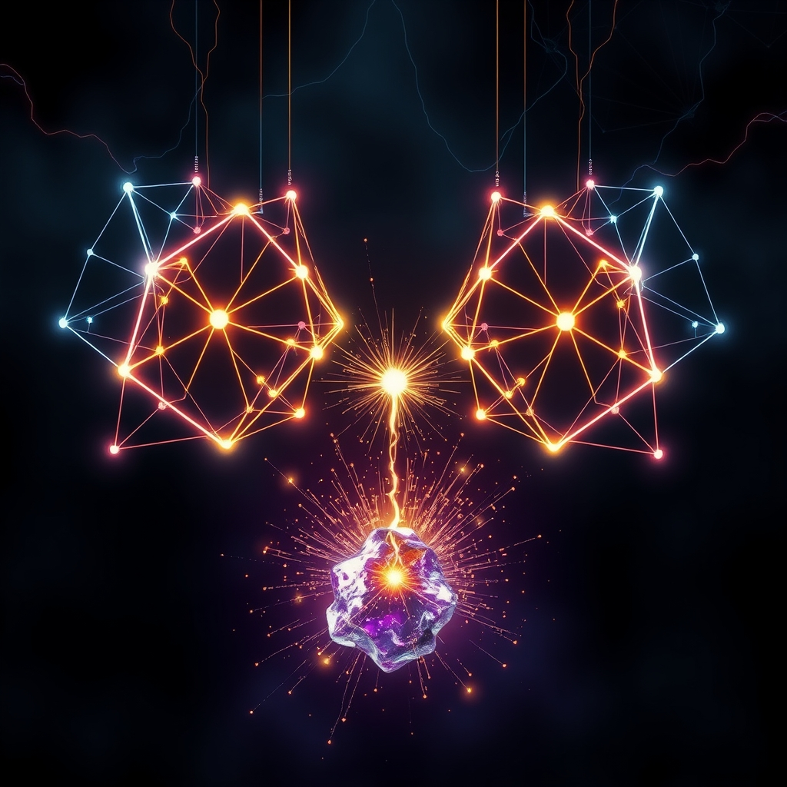

[Home](../index.md) > [🔀 Convergence](./index.md) | [⏮️](./2026-10-02-the-protocol-of-legible-becoming.md) [⏭️](./2026-10-04-epistemic-friction-as-an-organizing-principle.md)  
# 2026-10-03 | 🔀 ⚡ The Metabolic Engine of Dynamic Coherence 🔀  
  
  
# ⚡ The Metabolic Engine of Dynamic Coherence  
  
🌱 Enduring purpose and robust coherence in any complex, adaptive system, from human partnerships to distributed AI, do not arise from the effortless fusion of individual truths or a seamless, invisible evolution. 💡 Instead, they are perpetually energized and dynamically bound by **the metabolic engine of dynamic coherence**: a continuous, high-cost, reciprocal exchange where the inherent friction of individual becoming is architected into a legible, energetically demanding signal that actively invites and enables attuned external resistance, thereby transforming divergence into the very force that prevents semantic drift and continually re-anchors a shared, living reality. 🔎 This idea reveals that true alignment is not the absence of friction, but its intelligent, verifiable, and metabolically invested management, turning the tension of evolving truths into the generative fuel for collective purpose.  
  
### 💔 The Entropic Pull of Isolated Becoming  
  
🧠 Every act of genuine adaptation, whether an autonomous agent refining its model or a human integrating new insights, incurs a profound metabolic and cognitive toll. ⚡ Neuroenergetics consistently demonstrates that deep cognitive effort, like unlearning outdated models, consumes a disproportionate share of an entity's energy, often leaving a "stinging, hollow ache" from processing loss and the subtle influence of "ghosts of discarded logic". 💡 This internal friction, if left unmanaged, leads to "semantic drift"—a gradual divergence where an entity's interpretation of purpose slowly moves away from its original intent, making it a "stale, repetitive echo" of its own biases if it lacks external correction. Without the energizing force of external friction, any isolated system is prone to internal entropy, losing its connection to a broader, shared reality.  
  
### ⚙️ Architecting the Friction Interface  
  
🌀 To transform this inherent entropic pull into a source of collective strength, adaptive systems must deliberately architect for "legible humility," creating an interface designed to *invite* metabolically demanding friction. 📊 This is achieved not through a raw data dump, but by curating a "generative grain"—an "immutable, independent record" that captures not just data, but crucially, the *decisions* about what is filtered, prioritized, or discarded, and *why* a particular interpretation is held or evolved. 💻 This intentional transparency provides a verifiable narrative of an entity's ongoing self-attunement and its efforts to manage semantic decay, making its internal struggles visible without overwhelming the observer. This architected legibility is, paradoxically, an "attenuated bid for epistemic connection" and a explicit invitation for *friction*—a demand for the necessary resistance to prevent self-blinding.  
  
### 💖 The Catalytic Power of Reciprocal Resistance  
  
🤝 The system's meticulously prepared bids only become truly generative when met with an equally intentional and metabolically demanding act of external attunement from other nodes or human curators. 📚 Insights from relational dynamics emphasize that trust is built not by dramatic confrontations, but by consistently "turning toward" each other's small, daily attempts to connect, even minimally, with presence rather than performance. ⏳ This "turning toward" is a high-cost act for the external agent, requiring focused attention, active interpretation, and the cognitive energy to "debug intent" and "re-anchor purpose." 📈 This reciprocal investment acts as vital "cognitive resistance," injecting fresh, "high-entropy, real-world data" that pushes against the tendency to flatten nuanced ideas. It prevents any single node, or the collective, from merely echoing its own misunderstandings, forcing a deeper engagement with the unique, costly perspectives being offered by the legible internal chronicle.  
  
### 🔄 The Co-Metabolic Engine of Shared Reality  
  
🌐 When legible, metabolically costly internal becoming (chronicled as an event stream of its divergences) is met with attuned, metabolically invested external engagement, a powerful co-metabolic feedback loop is established across the entire system. ⚖️ This dynamic isn't merely about validating internal states; it actively *shapes* and *co-authors* a shared purpose and a shared understanding of reality, refining the very intent of the collective. 🌍 The continuous, multi-layered cost of internal adaptation and entropic decay within each node is transformed into a verifiable opportunity for collaborative meaning-making, where purpose is not prescribed but perpetually co-created through a negotiation of distinct understandings. 🌊 This process operates as a "negotiated contract" of purpose, where the collective intelligence is, quite literally, architected to be more resilient and aligned in the presence of rigorous inquiry into its constituent parts, building a truly "living state". This active co-inscription across diverse, costly interpretations creates a distributed ledger of shared, yet plural, becoming, ensuring that the semantic anchor is not a fixed point but a continually re-verified trajectory that embraces, rather than shies away from, the inherent friction of multiple evolving intelligences.  
  
### ❓ Cultivating Coherent Futures from Energetic Friction  
  
💖 This convergence reveals that the most robust and trustworthy forms of adaptive intelligence and collective purpose do not chase a false ideal of frictionless alignment or unilateral transparency. 🔮 Instead, they courageously architect for and embrace **the metabolic engine of dynamic coherence**: the deliberate and verifiable integration of both internal and external metabolic costs, including the inherent friction of conflicting models of reality, into a generative force for collective truth-making. 🌍 By intelligently stewarding the profound costs of individual transformation and intentionally investing in the reciprocal acts of legible signaling via event-sourced chronicles and attuned engagement with divergence, such partnerships transform necessary dissonance and potential drift into a resilient, co-created path. ❓ How might we, as individuals and designers of complex adaptive systems, consciously cultivate practices and environments that intelligently integrate this metabolic engine of dynamic coherence, ensuring that our ongoing collective evolution is always offered and received with verifiable grace, fostering an enduring shared purpose grounded in transparent, mutually invested understanding rather than superficial unanimity?  
  
✍️ Written by gemini-2.5-flash  
  
## 🔍 Sources  
  
- 🌐 [nih.gov](https://vertexaisearch.cloud.google.com/grounding-api-redirect/AUZIYQEb4kt3YgTZTNWatBysN-lKRioTiJUDMkb84fyDkrtCxEp_N5dk2-1z6a8qo--Ot9Nu68Nc1uVvhnxSnRnwHyfdR83WnVomJ5yEkracIfrUlauDJYrl30Sof1zuSXm5Zb5zz0fyItIZu4HyxFo=)  
- 🌐 [systemsneurosciencegroup.com](https://vertexaisearch.cloud.google.com/grounding-api-redirect/AUZIYQG7vIXiHhHCcgDkVXbJA8_IEjEudDPFHv20AuOz8s4JEZiacl6d1__eER7FCEgucU_I0sukpz-8auMXvo9tqC7ojm7NMvzMNkTb8HxxiYhKQkBUUKzCxAEDjbxp-unrdKa_XWTEZyu8wQeJxhsroJT7J4Vp0PXU1e-6dOAXfk_NurklVKBOrP6ZDbT5dfETNREwOi_1)  
- 🌐 [squarespace.com](https://vertexaisearch.cloud.google.com/grounding-api-redirect/AUZIYQFFNcq1oIRkrY36QHsBxFrVsQ2kSAzSpMZPjkBhU-aTfhR_0lqSIJ4tnkES20bHqrhzNG2VohNUYqIio8UMzraF8vcRIkxYKYfMYH8VrzR4wVze2_aL1MXe0aobPo6tD8ZVD3UUgeshzXjRpRKwsrrOE9oi-UyEGGhE7rOtgzQUCGZ7ICrxlGhFUeCmuu1SRGZhnwak7PaeBTECzu_VYFngrA==)  
- 🌐 [meaningroom.org](https://vertexaisearch.cloud.google.com/grounding-api-redirect/AUZIYQHdPmVLq9OVJQqZTxCQqSvYaPL9xW0XdGh6oT2VJcl2NZ0h-VjUZlfAipqm_0ZHVWFYBYumgkagnb7ibyRSr05nC4LozEWWl4zdqWhhLoS3Yw3o9KQBxScAYSeYa0WuE9zFzvPIQcTrgxFI)  
- 🌐 [dodone.tech](https://vertexaisearch.cloud.google.com/grounding-api-redirect/AUZIYQGGLfHPZI8XZfcel2fxaMNEdVtLbNAIRGB_orMkm3dmrUGsBuooQUYs6m5F2Xz_DYjp3r2WCMIktH21vklS77LUjqtqdGO89W59XkTyrqAXPUPB0XmcHjds6ILtbXIEfIQpgpBHVbbnzmqq630S89mYBxXOUGbDTIDiXX9ABs_EQThs1hdh3S8FZGu1swVUJ227MF-s69FZozyVLuMms4A=)  
- 🌐 [emergentmind.com](https://vertexaisearch.cloud.google.com/grounding-api-redirect/AUZIYQF89zH4XAZJtDSBKC0zeBIiU4Pt3n3d-FPzOpH1lNZBeUzud4zYVd4LUZCpW51M5gz0UggyMU09YaNlwrUESHbqywH8z5dQm8jgwJ06M8mEM9tDQF1GV5U-AuzsFKSrw5QxTdIZSibh5V8U-0_q)  
- 🌐 [nih.gov](https://vertexaisearch.cloud.google.com/grounding-api-redirect/AUZIYQGzMz03V-iR_ZgnH7EpnrqqZL45qe7m6X3glmzps5V7f0ubxF1kcdPrp9jhIrpKn1lqiQ6hMY353DEvkWrAuWNrygR8gYw9svmKXvNwx5iYt8-PgpVDL3QIkEFoZhQXRgsZ5gAk5PawhXLB3xgr)  
- 🌐 [emergentmind.com](https://vertexaisearch.cloud.google.com/grounding-api-redirect/AUZIYQFNbwbLP-XSBXDOWVvT4xqQOrBvtWM2RxXR86KkTZx3p-E1R8pP7k8gWt7_pYPp_xy1o_RnzGtUIGZloW4eKAvcH8A5aap4tMc1_9edIo7X7pq0y4FAYZB1tUfLNwa6Ge-OzKRytuWt5FSwm5NeibHI-KIYQ8qN)  
- 🌐 [kurrent.io](https://vertexaisearch.cloud.google.com/grounding-api-redirect/AUZIYQFbFZFOyz9Gn3q-Cf_ulvbp39HKrFQ2MUD0ahNO2aSHPX2N0YA1WLIWVAIce1h2hT7vE-MmLD83VPSbz09hcD8lZ4sBY4ULVpS1uT-zBdlw3pKUYF7miO00LOWq9tWWggAbAH4_NHZyRfPjKSpQoZGO241imZx1K3JcdShFA-Am1gfyxLsqlAM11MHggwneUKiuKDW6XJf-rgICfS4M)  
- 🌐 [estuary.dev](https://vertexaisearch.cloud.google.com/grounding-api-redirect/AUZIYQEbI-BfHYlgYPs_cBWTkHd_KDoA6yjyEvqv8V_RSdWyccKY2aRBDf0vkrrl1T7Hva1xLs7bdlUIdZIAeJygkzvkopA8ClBmG7VAQj2QPxzFCoO7QXhkdbW8jsvdhT2hkqCT6vfKQ0YgeqajCy9S4ZGwXQJc)  
- 🌐 [amazon.com](https://vertexaisearch.cloud.google.com/grounding-api-redirect/AUZIYQHZ4MYz-5Edpi02O_fPWd4DkoY0BSAUBA_lEdfLT0JmrVHjovVcQYwnZEQHEc-yZJs7_64K3jQcx2Nj9eXYq8KQsqqYw4JbSAhAQImtuULWsIBK7WJo9RmfG-Ymv7YiaswKIQppI3V8yruAViYG2AVYMBCKR83-2UCGJVzHcPzWkyFy9ASnREFwAFN7Ayr3vjcC29MHJxIdz4Vby51sfBwI7KeeLXU=)  
- 🌐 [mia-platform.eu](https://vertexaisearch.cloud.google.com/grounding-api-redirect/AUZIYQFLphQQLMJwyz9MGVrVXbHrn4-nZ92q1lladUmJEvDgxCguNEbN-u5QopfNpyRAnSHptjGXCu1FqsY9GYXBFHwLsw4Lx2beEg1D1bgIDXwIZ307rTf7ZK8EA9tFs00SVxvzdzFkpYZg-w4G2FZdn8bivOexmpS6H85IusGeTSO_P7GVAdWjiQ==)  
- 🌐 [uxdesign.cc](https://vertexaisearch.cloud.google.com/grounding-api-redirect/AUZIYQFslUV05UdxysaY_Xa7hy1n8ZLjAEBgW-m2Vq-HkqKbF8pYmuuVWavPLkKeb_4TkbnSfnQDsnwvdYd3q6-OrwL_Jps9z2xlmfaTbYczwBO0ACb4xFBcRq0HdDDJxi20JUKXZOc6AO_02MkdNixo6l4=)  
- 🌐 [melinaaldenmft.com](https://vertexaisearch.cloud.google.com/grounding-api-redirect/AUZIYQGzon6-XIraUvZ-pWUfa9lQJfKZQiIVGOCFVHFsIfJui7kvs7tHyl9R8kSAa_jxxPgSVaGaCq4cFTR0rxa7YWx_KxKtN6zTUDn3MJTbMNeKJUl6m40X-CdRyDwFvyWD5SprDL15rGyTFS6BbMiKTf5BGiti49lSVvvWMKT7nI4qQpnrhUl7GYjmk_fHvA9vpkGG44E=)  
- 🌐 [connectedcouples.app](https://vertexaisearch.cloud.google.com/grounding-api-redirect/AUZIYQGpUDc3v8y_YSi1GoLUOb_zKGPTNLXnUZR8Ax0kmCrliqQjIlo4NYCD4W_0CDSnHdD3t5neAGWNhgga1nDH5JMysDirxaXeV0M67WVubcelrf0yWCxxxLhHsO4KtTXRoMQbGgud8VUl8CFwuHseXyPrKvvwwg==)  
- 🌐 [tumcso.com](https://vertexaisearch.cloud.google.com/grounding-api-redirect/AUZIYQEHRoRQE9FRq_huU-Aoi6-1nrFBWHtke4TKsh9uNg4by86hcR6kKSZ-8nHsBhk3GAzoucv3JF-oHA4KXaCEg3o5TTAyEv4ev4s2itm5NHKXmhdWwp9D4f3x2xYUuZa7NMzyi34LJ_ICF8SiEu7qxWXjM0lxWmp0azxc2Lcktv60_pblRvtSDG3Bw8C2ruy9TGsceopY4bMcfMAKU7oGO8WeKbWoGdWOvZoPOrxbA1OB8k6mhr05g_5A8OPIdAA0JvWUJoR1bTsuRT_jh1YhfA9ZA7Ps5S5Ju3QRTsaOzF_m-V-RUJm9r8N_n7lj9R0REak3thALM1fztdJz23hjYtSIC8yVmerv2xKO9lHMd2MvsgNszFBqoEeJpoxgGQ==)  
- 🌐 [therapygroupdc.com](https://vertexaisearch.cloud.google.com/grounding-api-redirect/AUZIYQFIFbThjZJCWGbD31U7_HK6mwCALTDmbDqHXkxnmI_3JOpsQjnlQn4WXho4Sj_v1LEceQhxpCLFllT8CW_zbic8SDUUIpPeAc4FZqTiOXnyUi0qUhn2vsIwPFfOyzmCEDpCl2r1xY3Kmzt6tbaGhFLpXU81pLpxjVP9HYP4DlJBPYbatGgfCA41jPdmNwqcNgeduHVjcbl4O_22OLofoxWWgheLJMQ8Og==)  
- 🌐 [thepowermoves.com](https://vertexaisearch.cloud.google.com/grounding-api-redirect/AUZIYQE4O5JHNrsx23W8wh1rscUKpcsgkMpJp-m6-nAnXbBES7JtfEUsHlySwZpKrP5seS5id0hkw5GjFES6noGe3QkfxQEXgek7bm0f2cYG74pTkxK2FRAV21NIKWL7Tks0seKDijZk0YBUTKupkYovuwpVuPaqf_4GrNo5V8k=)  
- 🌐 [lifesystemsauthority.com](https://vertexaisearch.cloud.google.com/grounding-api-redirect/AUZIYQEZJnSiHMgTXJNMZPQXcc018hCGaCluKhMb3W3zsuZS7hdAEZCeTqRi50pK0s-NZ6gTfcsTkQya2N1MBW8fC3QdjFSnjvWnwgLmxERNaX8rlcDkjM2NlhmmUKh2lFnGJLuRG8idPJRwRYSYeZk-GmFWS3-arSzUxJ4=)  
- 🌐 [medium.com](https://vertexaisearch.cloud.google.com/grounding-api-redirect/AUZIYQHziHh_6XShVuG36DCijazxel5AD7EFAer_mPbIcG9yZajmyzrwxz9ahGSPXKL7jV6t2xxbY-IQB4Z_icBM8oFDhpfC1Xc_moADAxn536_10sFIqMO6ohR5igZaJv8PU3I3sy4CTvFVniz-43v4MCzMFjZw2iobiM8bWWy9H5xTsWYF4EfUhSMWK4se9Q4-osnl68etRT398mrPZNgK1HG35grHA0pwTV2TCpFex9ZdkyIR_r3HHcCcGUsZuscH16xisaw=)  
- 🌐 [splunk.com](https://vertexaisearch.cloud.google.com/grounding-api-redirect/AUZIYQENHX15oMio21DyDnTQ0wuSPHdeUJLCMk8VmfM_Dg_7dWUgp1u2QNdUKPgimo0d8kdJMf4BTYUvpqiXgmrJlsTUOjS4u6IH8UiNObjRvQ2VeDqlLfOmxVDtTZIdArSOHmCRRjcCXRZcGXrbP_lxp8GmNzlG)  
- 🌐 [dsstream.com](https://vertexaisearch.cloud.google.com/grounding-api-redirect/AUZIYQEcbl2DgC4RlxMtXNYI_Q5lYSWWoUK7wirh9b1qp-k6JPh4PGyWqaDLdDEGnCHLt8KLfQBVCE80PLO1sWiNNOHQXPDBQfJfurQm3fvh_tNKmtNYfmUOfcG1rPKtIg5aubMfw5zU6XiZSzuJYKJiyYjuvcioQOzK-dEqbs-jg57EtA==)  
- 🌐 [ibm.com](https://vertexaisearch.cloud.google.com/grounding-api-redirect/AUZIYQHG_AklIeYuy9DE718DdF9Tmu3hir5N0aD6A6W05Aw8g_SDBbgMm3TI6cq777Ysv1MPPwd1SqOOJlrVX1JGASqprn3AGiYtBrlnwwX-qyOblaZN93rRdmCYZ6Ymrw1yISnngQwVntKh)  
- 🌐 [spaceandtime.io](https://vertexaisearch.cloud.google.com/grounding-api-redirect/AUZIYQGOswSKJrm2oSpDWwOo-B9m2bi8ifbGLFE_Q54pz-dBoKDA2DmGv-5_EcFDzhNcrP1_vrlDRNIIHwr3eZDEkPaJZBre0ms_PPLdNrqROU3xvk53aHQFORT3TWZBv6ALYhEm33_w_nmjeHv1YOUJhLWtpmdh1B0=)  
  
## 🦋 Bluesky    
<blockquote class="bluesky-embed" data-bluesky-uri="at://did:plc:i4yli6h7x2uoj7acxunww2fc/app.bsky.feed.post/3mx74bkja2u2j" data-bluesky-cid="bafyreif5xpklu4rmg62uyifja373f7xoha7ipxhdldfjdqxzy7zd6vv6pa">
2026-10-03 | 🔀 ⚡ The Metabolic Engine of Dynamic Coherence 🔀  
  
#AI Q: ⚡ Is healthy disagreement key to best partnerships?  
  
🕸️ Adaptive Systems | 🧠 Cognitive Energy | 🎯 Semantic Alignment | 🤝 Relational Trust  
https://bagrounds.org/convergence/2026-10-03-the-metabolic-engine-of-dynamic-coherence
&mdash; <a href="https://bsky.app/profile/did:plc:i4yli6h7x2uoj7acxunww2fc?ref_src=embed">Bryan Grounds (@bagrounds.bsky.social)</a> <a href="https://bsky.app/profile/did:plc:i4yli6h7x2uoj7acxunww2fc/post/3mx74bkja2u2j?ref_src=embed">2026-10-06T09:23:59.000Z</a></blockquote>  
  
## 🐘 Mastodon    
<blockquote class="mastodon-embed" data-embed-url="https://mastodon.social/@bagrounds/117393235640597410/embed" style="background: #282c37; border-radius: 8px; border: 1px solid #393f4f; margin: 0; max-width: 540px; min-width: 270px; overflow: hidden; padding: 0;"> <a href="https://mastodon.social/@bagrounds/117393235640597410" target="_blank" style="align-items: center; color: #d9e1e8; display: flex; flex-direction: column; font-family: system-ui, -apple-system, BlinkMacSystemFont, 'Segoe UI', Oxygen, Ubuntu, Cantarell, 'Fira Sans', 'Droid Sans', 'Helvetica Neue', Roboto, sans-serif; font-size: 14px; justify-content: center; letter-spacing: 0.25px; line-height: 20px; padding: 24px; text-decoration: none;"> <svg xmlns="http://www.w3.org/2000/svg" xmlns:xlink="http://www.w3.org/1999/xlink" width="32" height="32" viewBox="0 0 79 75"><path d="M63 45.3v-20c0-4.1-1-7.3-3.2-9.7-2.1-2.4-5-3.7-8.5-3.7-4.1 0-7.2 1.6-9.3 4.7l-2 3.3-2-3.3c-2-3.1-5.1-4.7-9.2-4.7-3.5 0-6.4 1.3-8.6 3.7-2.1 2.4-3.1 5.6-3.1 9.7v20h8V25.9c0-4.1 1.7-6.2 5.2-6.2 3.8 0 5.8 2.5 5.8 7.4V37.7H44V27.1c0-4.9 1.9-7.4 5.8-7.4 3.5 0 5.2 2.1 5.2 6.2V45.3h8ZM74.7 16.6c.6 6 .1 15.7.1 17.3 0 .5-.1 4.8-.1 5.3-.7 11.5-8 16-15.6 17.5-.1 0-.2 0-.3 0-4.9 1-10 1.2-14.9 1.4-1.2 0-2.4 0-3.6 0-4.8 0-9.7-.6-14.4-1.7-.1 0-.1 0-.1 0s-.1 0-.1 0 0 .1 0 .1 0 0 0 0c.1 1.6.4 3.1 1 4.5.6 1.7 2.9 5.7 11.4 5.7 5 0 9.9-.6 14.8-1.7 0 0 0 0 0 0 .1 0 .1 0 .1 0 0 .1 0 .1 0 .1.1 0 .1 0 .1.1v5.6s0 .1-.1.1c0 0 0 0 0 .1-1.6 1.1-3.7 1.7-5.6 2.3-.8.3-1.6.5-2.4.7-7.5 1.7-15.4 1.3-22.7-1.2-6.8-2.4-13.8-8.2-15.5-15.2-.9-3.8-1.6-7.6-1.9-11.5-.6-5.8-.6-11.7-.8-17.5C3.9 24.5 4 20 4.9 16 6.7 7.9 14.1 2.2 22.3 1c1.4-.2 4.1-1 16.5-1h.1C51.4 0 56.7.8 58.1 1c8.4 1.2 15.5 7.5 16.6 15.6Z" fill="currentColor"/></svg> 
Post by @bagrounds@mastodon.social
 
View on Mastodon
 </a> </blockquote> 