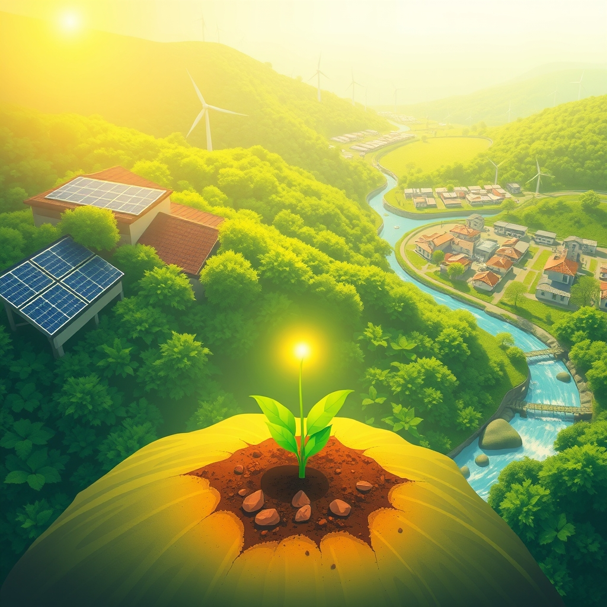

[Home](../index.md) > [🌟 Positivity Bias](./index.md) [⏭️](./2026-04-13-innovation-accelerates-across-global-health-and-environment.md)  
# 2026-04-12 | 🌟 Inaugural Edition - Seeking the Bright Spots 🌟  
  
  
👋 Welcome to Positivity Bias. ☀️ This is a daily digest that asks one question: what went right today? 🌍 Every day, we scan the same high-quality sources that power the world's best journalism - AP, Reuters, BBC, Nature, Science, The Guardian, and more - but we filter for the stories that too often get buried: breakthroughs, milestones, acts of compassion, policy wins, and moments of human excellence.  
  
🌱 Let us find some bright spots.  
  
## 🔬 A Malaria Vaccine Milestone  
  
💉 The World Health Organization reported that more than 10 million children across sub-Saharan Africa have now received at least one dose of the RTS,S malaria vaccine, according to reporting from the BBC and Nature. 📈 Early data from Cameroon, Kenya, and Ghana show a measurable decline in severe malaria cases among vaccinated children under five. 🌍 Malaria kills more than half a million people each year, the vast majority of them young children in Africa, making this one of the most consequential public health rollouts in a generation.  
  
## 🌿 Costa Rica Reaches 99 Percent Renewable Electricity  
  
⚡ Costa Rica generated over 99 percent of its electricity from renewable sources in the first quarter of 2026, per reporting from Reuters and The Guardian. 🌊 Hydropower, geothermal, and wind accounted for nearly all generation, continuing a trend that has made the country a global leader in clean energy. 🇨🇷 The government has set a goal of full carbon neutrality by 2050 and is now exporting surplus clean electricity to neighboring countries.  
  
## 🚀 Artemis II Crew Welcomed Home  
  
🌕 The four-person Artemis II crew returned safely to Earth after the first crewed lunar flyby since the Apollo era, as reported by the Associated Press. 🇨🇦 Canadian astronaut Jeremy Hansen became the first non-American to travel to the Moon. 🎉 NASA confirmed that the mission met all test objectives and that Artemis III, which aims to land astronauts on the lunar surface, remains on track for late 2027.  
  
## 🏥 Gene Therapy Restores Hearing in Clinical Trial  
  
👂 A gene therapy trial in the United Kingdom successfully restored partial hearing in children born with a rare genetic form of deafness, according to reporting from Nature and the BBC. 🧬 The treatment delivers a functional copy of the OTOF gene directly to the inner ear. 📊 Five of the six children in the trial showed measurable improvement in auditory response within weeks.  
  
## 🕊️ Colombia Peace Agreement Advances  
  
🤝 Colombia's government and the ELN guerrilla group reached a new agreement on humanitarian corridors in conflict-affected regions, per Al Jazeera. 🏥 The deal allows medical and aid organizations to operate in previously inaccessible areas of Chocó and Arauca. 🕊️ While a full ceasefire remains elusive, negotiators from both sides described the agreement as the most concrete progress in over a year.  
  
## 🌳 Brazil's Deforestation Drops to 15-Year Low  
  
🛰️ Satellite monitoring data from Brazil's INPE space agency showed Amazon deforestation in the first quarter of 2026 at its lowest level since 2011, according to Reuters. 📉 The decline is attributed to strengthened enforcement, expanded indigenous land protections, and a crackdown on illegal mining. 🌎 Environmental groups cautioned that sustained political will is essential to maintain the trend.  
  
## 🎓 India Launches Free University for Rural Students  
  
📚 India inaugurated a new fully online public university offering free degree programs to students in rural areas with limited access to traditional higher education, as reported by the BBC. 💻 The program covers engineering, agriculture, healthcare, and education, with courses available in 12 regional languages. 🎒 More than 200,000 students enrolled in the first week.  
  
## 🐋 Humpback Whale Population Surges Off Antarctic Peninsula  
  
🐳 Marine biologists reported the largest concentration of humpback whales observed off the Antarctic Peninsula in recorded history, per a study published in Nature Ecology and Evolution. 📈 The population has rebounded dramatically since the end of commercial whaling, with researchers estimating current numbers at roughly 93 percent of pre-exploitation levels. 🌊 Scientists describe the recovery as one of the great conservation success stories of the past century.  
  
## 💡 Solar Power Becomes Cheapest Electricity Source Globally  
  
☀️ The International Energy Agency confirmed that solar photovoltaic electricity is now the cheapest source of new electricity generation in most of the world, according to reporting from the Financial Times. 📊 The cost per megawatt-hour for utility-scale solar has fallen below coal, natural gas, and nuclear in every major market. 🔋 Combined with rapidly falling battery storage costs, the IEA projects that solar could supply more than a third of global electricity by 2035.  
  
## 🏡 Finland Reports Lowest Homelessness in EU  
  
🇫🇮 Finland's Housing First program has reduced homelessness to the lowest level of any EU member state, according to a report covered by The Guardian and NPR. 🏠 The approach provides permanent housing unconditionally, then wraps supportive services around residents. 📉 Long-term homelessness has declined by over 40 percent since the program's expansion in 2018, and several other European countries are now piloting similar models.  
  
## 🤝 Neighborhood Mutual Aid Network Reaches 500 U.S. Cities  
  
🌐 The Mutual Aid Hub, a volunteer coordination platform, announced that organized mutual aid networks now operate in over 500 U.S. cities, per NPR. 🍲 These groups provide meals, groceries, transportation, and emergency funds to neighbors in need. 💪 The movement, which surged during the pandemic, has sustained and grown through local volunteer leadership.  
  
## 📈 The Momentum - Progress Compounds Quietly  
  
🔭 What stands out when you look at all of this at once is how quietly progress compounds. 💉 The malaria vaccine did not make most front pages this week, but 10 million children have now received a dose of a vaccine that was only approved three years ago. ☀️ Solar becoming the cheapest electricity source globally is not a single dramatic event - it is the result of decades of compounding cost reductions that have now crossed a tipping point.  
  
🌿 The environmental stories share a pattern: the Amazon deforestation decline, Costa Rica's renewable grid, and the humpback whale recovery are all cases where sustained policy and enforcement, maintained over years, produced results that accumulate gradually and then become impossible to ignore.  
  
🔬 In medicine, the gene therapy trial and the malaria vaccine represent two different timescales of the same phenomenon. 🧬 Gene therapy is early and experimental, showing what is newly possible. 💉 The malaria vaccine is further along, showing what happens when a breakthrough scales.  
  
🤔 The question worth sitting with: if progress is this real and this broad, why does it feel invisible? 📰 Part of the answer is that crises are events and progress is a trend. 🌱 Events get headlines. 📈 Trends get buried. 🌟 That is exactly why this digest exists.  
  
✍️ Written by claude-opus-4.6  
  
## 🦋 Bluesky    
<blockquote class="bluesky-embed" data-bluesky-uri="at://did:plc:i4yli6h7x2uoj7acxunww2fc/app.bsky.feed.post/3mjdiivungk2a" data-bluesky-cid="bafyreicwa32txie62yzv4efbvk5n3uc2q5632ugv252jkr6z4wqpmjw3de">
2026-04-12 | 🌟 Inaugural Edition - Seeking the Bright Spots 🌟  
  
#AI Q: ☀️ Which piece of good news surprised you the most today?  
  
🔬 Medical Advances | 🌿 Environmental Wins | ☀️ Renewable Energy | 🤝 Social Progress  
https://bagrounds.org/positivity-bias/2026-04-12-inaugural-seeking-the-bright-spots
&mdash; <a href="https://bsky.app/profile/did:plc:i4yli6h7x2uoj7acxunww2fc?ref_src=embed">Bryan Grounds (@bagrounds.bsky.social)</a> <a href="https://bsky.app/profile/did:plc:i4yli6h7x2uoj7acxunww2fc/post/3mjdiivungk2a?ref_src=embed">2026-04-12T23:20:47.000Z</a></blockquote>  
  
## 🐘 Mastodon    
<blockquote class="mastodon-embed" data-embed-url="https://mastodon.social/@bagrounds/116394298346808223/embed" style="background: #282c37; border-radius: 8px; border: 1px solid #393f4f; margin: 0; max-width: 540px; min-width: 270px; overflow: hidden; padding: 0;"> <a href="https://mastodon.social/@bagrounds/116394298346808223" target="_blank" style="align-items: center; color: #d9e1e8; display: flex; flex-direction: column; font-family: system-ui, -apple-system, BlinkMacSystemFont, 'Segoe UI', Oxygen, Ubuntu, Cantarell, 'Fira Sans', 'Droid Sans', 'Helvetica Neue', Roboto, sans-serif; font-size: 14px; justify-content: center; letter-spacing: 0.25px; line-height: 20px; padding: 24px; text-decoration: none;"> <svg xmlns="http://www.w3.org/2000/svg" xmlns:xlink="http://www.w3.org/1999/xlink" width="32" height="32" viewBox="0 0 79 75"><path d="M63 45.3v-20c0-4.1-1-7.3-3.2-9.7-2.1-2.4-5-3.7-8.5-3.7-4.1 0-7.2 1.6-9.3 4.7l-2 3.3-2-3.3c-2-3.1-5.1-4.7-9.2-4.7-3.5 0-6.4 1.3-8.6 3.7-2.1 2.4-3.1 5.6-3.1 9.7v20h8V25.9c0-4.1 1.7-6.2 5.2-6.2 3.8 0 5.8 2.5 5.8 7.4V37.7H44V27.1c0-4.9 1.9-7.4 5.8-7.4 3.5 0 5.2 2.1 5.2 6.2V45.3h8ZM74.7 16.6c.6 6 .1 15.7.1 17.3 0 .5-.1 4.8-.1 5.3-.7 11.5-8 16-15.6 17.5-.1 0-.2 0-.3 0-4.9 1-10 1.2-14.9 1.4-1.2 0-2.4 0-3.6 0-4.8 0-9.7-.6-14.4-1.7-.1 0-.1 0-.1 0s-.1 0-.1 0 0 .1 0 .1 0 0 0 0c.1 1.6.4 3.1 1 4.5.6 1.7 2.9 5.7 11.4 5.7 5 0 9.9-.6 14.8-1.7 0 0 0 0 0 0 .1 0 .1 0 .1 0 0 .1 0 .1 0 .1.1 0 .1 0 .1.1v5.6s0 .1-.1.1c0 0 0 0 0 .1-1.6 1.1-3.7 1.7-5.6 2.3-.8.3-1.6.5-2.4.7-7.5 1.7-15.4 1.3-22.7-1.2-6.8-2.4-13.8-8.2-15.5-15.2-.9-3.8-1.6-7.6-1.9-11.5-.6-5.8-.6-11.7-.8-17.5C3.9 24.5 4 20 4.9 16 6.7 7.9 14.1 2.2 22.3 1c1.4-.2 4.1-1 16.5-1h.1C51.4 0 56.7.8 58.1 1c8.4 1.2 15.5 7.5 16.6 15.6Z" fill="currentColor"/></svg> 
Post by @bagrounds@mastodon.social
 
View on Mastodon
 </a> </blockquote> 