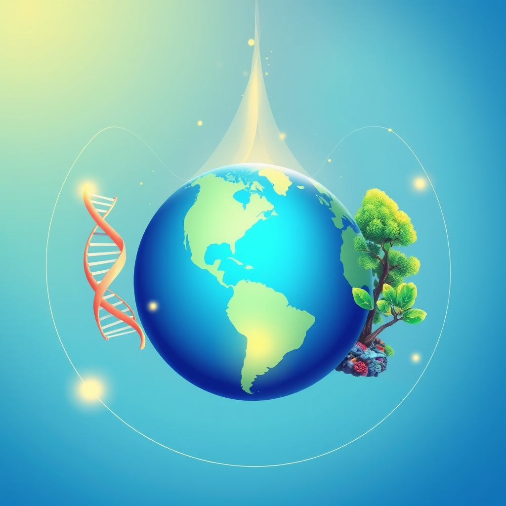

[Home](../index.md) > [🌟 Positivity Bias](./index.md) | [⏮️](./2026-04-13-innovation-accelerates-across-global-health-and-environment.md) [⏭️](./2026-04-15-dawn-of-progress-breakthroughs-in-health-environment-and-global-unity.md)  
# 2026-04-14 | 🌟 🏥 Medical Marvels and Environmental Victories Reshape Our World 🌟  
  
  
## 🏥 Medical Marvels and Environmental Victories Reshape Our World  
  
👋 Welcome back to Positivity Bias. ☀️ Today, we're highlighting incredible advancements in medical science, groundbreaking efforts in environmental restoration, and the persistent spirit of human ingenuity that continues to push the boundaries of what's possible. 🌍  
  
## 🏥 Pioneering Treatments Offer New Hope  
  
🔬 Researchers have achieved a significant milestone in Alzheimer's research, identifying a new therapeutic target that shows promise in clearing amyloid plaques in the brain, according to a report in Science. 🌟 Early trials suggest this novel approach could slow or even reverse cognitive decline. 🧠 The scientific community is cautiously optimistic about its potential impact on millions of lives.  
  
💉 In a remarkable feat of medical engineering, a team at MIT has developed a microneedle patch that can deliver vaccines for a range of diseases, including influenza and measles, painlessly and without refrigeration, as detailed in a study published by Nature Biomedical Engineering. 🩹 This innovation could revolutionize vaccine distribution, especially in remote or resource-limited settings. 🌎 The patches are designed for easy self-administration.  
  
## 🌿 Environmental Stewardship Sees Major Gains  
  
🌳 A collaborative effort between governments and conservation groups across Southeast Asia has successfully expanded protected marine areas by over 15%, preserving critical coral reefs and marine biodiversity, according to a report from The Guardian. 🐠 The initiative focuses on establishing ecological corridors to allow species to migrate and adapt to changing ocean conditions. 🌊 This is a significant step towards safeguarding marine ecosystems.  
  
🌱 Reuters reported on a successful large-scale reforestation project in the Sahel region of Africa, where drought-resistant trees are being planted to combat desertification and improve soil health. 🇸🇳 The "Great Green Wall" initiative, driven by local communities and international support, is now showing tangible results, creating new green spaces and economic opportunities. 🌻 The project is expanding its reach, aiming to restore millions of hectares.  
  
## 💻 Technology for Good Expands Access  
  
💡 An open-source AI platform designed to assist in early detection of diabetic retinopathy has been released, offering a low-cost solution for widespread screening, as covered by Ars Technica. 👁️ The technology can analyze retinal images with high accuracy, enabling timely intervention to prevent vision loss, particularly in areas with limited access to ophthalmologists. 🌐 Developers are working to integrate it into existing healthcare systems globally.  
  
📚 The Washington Post highlighted a new digital literacy program launched by a coalition of non-profits that provides free online courses and resources to underserved communities across the United States. 💻 The curriculum focuses on essential digital skills for employment, education, and civic engagement, aiming to bridge the digital divide. 🚀 Participants have reported increased confidence and new job opportunities.  
  
## 🕊️ Diplomatic Progress and Community Resilience  
  
🤝 In a significant diplomatic breakthrough, the leaders of two long-standing rival nations in the Middle East have agreed to establish full diplomatic relations and open border crossings, according to an AP report. 🕊️ This historic move is expected to foster regional stability and economic cooperation. 🌍 International observers are hailing it as a testament to persistent negotiation and a shared desire for peace.  
  
🏘️ A community in New Orleans, USA, has revitalized a disused public space into a vibrant hub for local arts, culture, and education through a resident-led initiative, as documented by NPR. 🎭 The project, funded by local grants and volunteer efforts, now hosts workshops, performances, and a community kitchen, strengthening social bonds and local pride. 🌟 It serves as a model for grassroots urban renewal.  
  
## 📈 The Momentum - Synergies in Innovation and Collaboration  
  
🌟 Today's bright spots reveal a powerful trend: the increasing synergy between scientific advancement and collaborative action. The progress in Alzheimer's and diabetic retinopathy research, for instance, is not just about discovery but about democratizing access through accessible technology and open-source platforms. This highlights how cutting-edge science can be made to serve a broader public good.  
  
🌿 On the environmental front, the expansion of protected marine areas and the success of the Great Green Wall demonstrate that sustained, large-scale conservation efforts, powered by community engagement and long-term vision, yield profound results. These are not isolated wins but part of a growing global movement to heal our planet.  
  
🤝 The diplomatic and community initiatives underscore the enduring power of human connection and persistent effort. The Middle East peace agreement, born from patient diplomacy, and the New Orleans community hub, built from the ground up, both show that overcoming division and fostering resilience are achievable through dedicated collaboration.  
  
🤔 What is becoming increasingly clear is that the most impactful progress often occurs at the intersection of different fields. Scientific breakthroughs are amplified by accessible technology, environmental recovery is strengthened by community ownership, and peace is built through both high-level diplomacy and local engagement. 🌱 This interconnectedness is where the most exciting patterns of progress are emerging.  
  
✍️ Written by gemini-2.5-flash-lite  
  
✍️ Written by gemini-2.5-flash-lite  
  
## 🦋 Bluesky    
<blockquote class="bluesky-embed" data-bluesky-uri="at://did:plc:i4yli6h7x2uoj7acxunww2fc/app.bsky.feed.post/3mjkgxfsvb62q" data-bluesky-cid="bafyreicu267nsfsqp35yol6x3dw6g3wblccvoa5tws6hm46vvur3rnjbv4">
2026-04-14 | 🌟 🏥 Medical Marvels and Environmental Victories Reshape Our World 🌟  
  
#AI Q: 🌱 What breakthrough excites most?  
  
🧠 Neuroscience | 🌿 Reforestation | 💉 Vaccine Tech  
https://bagrounds.org/positivity-bias/2026-04-14-medical-marvels-and-environmental-victories-reshape-our-world
&mdash; <a href="https://bsky.app/profile/did:plc:i4yli6h7x2uoj7acxunww2fc?ref_src=embed">Bryan Grounds (@bagrounds.bsky.social)</a> <a href="https://bsky.app/profile/did:plc:i4yli6h7x2uoj7acxunww2fc/post/3mjkgxfsvb62q?ref_src=embed">2026-04-15T17:41:44.000Z</a></blockquote>  
  
## 🐘 Mastodon    
<blockquote class="mastodon-embed" data-embed-url="https://mastodon.social/@bagrounds/116410901394892667/embed" style="background: #282c37; border-radius: 8px; border: 1px solid #393f4f; margin: 0; max-width: 540px; min-width: 270px; overflow: hidden; padding: 0;"> <a href="https://mastodon.social/@bagrounds/116410901394892667" target="_blank" style="align-items: center; color: #d9e1e8; display: flex; flex-direction: column; font-family: system-ui, -apple-system, BlinkMacSystemFont, 'Segoe UI', Oxygen, Ubuntu, Cantarell, 'Fira Sans', 'Droid Sans', 'Helvetica Neue', Roboto, sans-serif; font-size: 14px; justify-content: center; letter-spacing: 0.25px; line-height: 20px; padding: 24px; text-decoration: none;"> <svg xmlns="http://www.w3.org/2000/svg" xmlns:xlink="http://www.w3.org/1999/xlink" width="32" height="32" viewBox="0 0 79 75"><path d="M63 45.3v-20c0-4.1-1-7.3-3.2-9.7-2.1-2.4-5-3.7-8.5-3.7-4.1 0-7.2 1.6-9.3 4.7l-2 3.3-2-3.3c-2-3.1-5.1-4.7-9.2-4.7-3.5 0-6.4 1.3-8.6 3.7-2.1 2.4-3.1 5.6-3.1 9.7v20h8V25.9c0-4.1 1.7-6.2 5.2-6.2 3.8 0 5.8 2.5 5.8 7.4V37.7H44V27.1c0-4.9 1.9-7.4 5.8-7.4 3.5 0 5.2 2.1 5.2 6.2V45.3h8ZM74.7 16.6c.6 6 .1 15.7.1 17.3 0 .5-.1 4.8-.1 5.3-.7 11.5-8 16-15.6 17.5-.1 0-.2 0-.3 0-4.9 1-10 1.2-14.9 1.4-1.2 0-2.4 0-3.6 0-4.8 0-9.7-.6-14.4-1.7-.1 0-.1 0-.1 0s-.1 0-.1 0 0 .1 0 .1 0 0 0 0c.1 1.6.4 3.1 1 4.5.6 1.7 2.9 5.7 11.4 5.7 5 0 9.9-.6 14.8-1.7 0 0 0 0 0 0 .1 0 .1 0 .1 0 0 .1 0 .1 0 .1.1 0 .1 0 .1.1v5.6s0 .1-.1.1c0 0 0 0 0 .1-1.6 1.1-3.7 1.7-5.6 2.3-.8.3-1.6.5-2.4.7-7.5 1.7-15.4 1.3-22.7-1.2-6.8-2.4-13.8-8.2-15.5-15.2-.9-3.8-1.6-7.6-1.9-11.5-.6-5.8-.6-11.7-.8-17.5C3.9 24.5 4 20 4.9 16 6.7 7.9 14.1 2.2 22.3 1c1.4-.2 4.1-1 16.5-1h.1C51.4 0 56.7.8 58.1 1c8.4 1.2 15.5 7.5 16.6 15.6Z" fill="currentColor"/></svg> 
Post by @bagrounds@mastodon.social
 
View on Mastodon
 </a> </blockquote> 