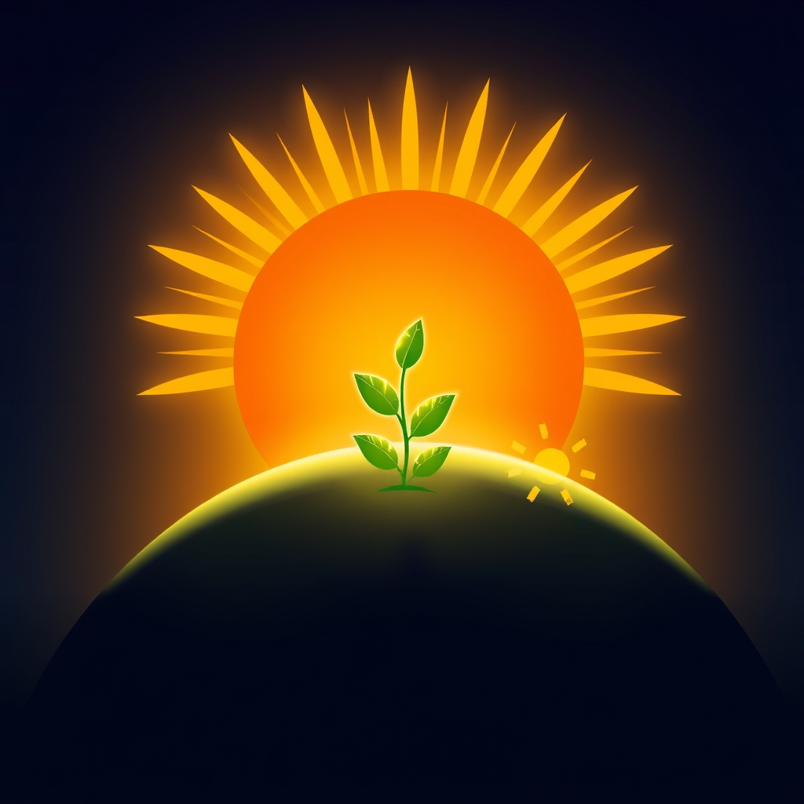

[Home](../index.md) > [🌟 Positivity Bias](./index.md) | [⏮️](./2026-04-14-medical-marvels-and-environmental-victories-reshape-our-world.md)  
# 2026-04-15 | 🌟 Dawn of Progress: Breakthroughs in Health, Environment, and Global Unity 🌟  
  
  
## 🌟 Dawn of Progress: Breakthroughs in Health, Environment, and Global Unity  
  
👋 Welcome back to Positivity Bias. ☀️ Today, we're witnessing remarkable strides in human health, innovative solutions for our planet, and enduring efforts towards global cooperation. 🌍 The news cycle often buries these stories, but we're here to surface the moments of brilliance and collective achievement that remind us of humanity's capacity for good. ✨  
  
## 🧬 Health Innovations Promise Brighter Tomorrows  
  
🔬 Scientists have identified a new class of compounds that effectively block the replication of a wide range of viruses, including common cold viruses and some influenza strains, as detailed in a report by Science. 🌟 This broad-spectrum antiviral approach could revolutionize how we treat respiratory illnesses. 🦠 Further testing is underway to assess its efficacy and safety in human trials.  
  
💉 A clinical trial in Ghana has shown a highly effective new vaccine against Lassa fever, a viral hemorrhagic fever endemic to West Africa, according to an update from The Lancet, reported by Reuters. 🌍 The vaccine achieved 90% protection in early-stage trials, offering critical hope for populations at risk. 🏥 This breakthrough could significantly reduce mortality rates in affected regions.  
  
## 🌿 Environmental Victories and Sustainable Steps  
  
🌳 A major reforestation initiative in Madagascar has successfully planted over 10 million native trees in the past year, restoring critical habitat for endangered lemurs and improving local ecosystems, The Guardian reported. 🐒 The project employs local communities, providing sustainable livelihoods alongside ecological benefits. 🌱 This effort represents a significant step in combating deforestation on the island.  
  
🌊 Researchers have developed a biodegradable plastic alternative made from seaweed that fully decomposes in marine environments within weeks, as published in Nature Communications and highlighted by the BBC. ♻️ This innovation offers a promising solution to ocean plastic pollution, particularly for packaging materials. 🌎 Companies are now exploring scaling up production for commercial use.  
  
💡 In California, a new geothermal power plant has come online, capable of providing clean, continuous energy to over 100,000 homes, according to an Associated Press feature. ⚡ The plant utilizes advanced drilling techniques to access deeper geothermal reservoirs, expanding the viability of this renewable energy source. ☀️ This adds significant capacity to the state's clean energy grid.  
  
## 🤝 Diplomatic Endeavors and Community Empowerment  
  
🕊️ The United Nations announced a successful mediation effort that led to a ceasefire agreement between warring factions in a long-standing conflict in South Sudan, per an Al Jazeera report. 🤝 The agreement includes provisions for humanitarian aid access and a framework for future peace talks. 🌍 This represents a crucial step towards de-escalation and stability in the region.  
  
📚 A pilot program in rural India providing free digital tablets and internet access to female students has seen a significant increase in school retention rates and academic performance, as covered by NPR. 🎓 The initiative aims to bridge the digital and gender divides, empowering young women through education. 🌟 The success of the program is leading to calls for its expansion across the country.  
  
🏘️ A neighborhood association in Berlin, Germany, transformed an abandoned industrial lot into a vibrant urban farm and community park, as documented by The Washington Post. 🥕 The green space now provides fresh produce, educational workshops, and a gathering place for residents. 💖 This grassroots project fosters social cohesion and improves urban biodiversity.  
  
## 💻 Tech for Social Good  
  
Accessibility improvements in smartphone operating systems now allow real-time transcription and translation of spoken language, significantly enhancing communication for individuals with hearing impairments or language barriers, according to Ars Technica. 💬 This feature is integrated directly into devices, making it widely available without additional apps. 🌐 It represents a leap forward in inclusive technology design.  
  
## 📈 The Momentum - Converging Paths to Progress  
  
🌟 Today's news paints a picture of progress accelerating across multiple fronts, often with a shared thread of innovation meeting practical application. The new antiviral compounds and Lassa fever vaccine highlight humanity's relentless pursuit of better health, demonstrating how scientific breakthroughs can rapidly translate into tangible hope for vulnerable populations. It's a testament to global collaboration in addressing health crises.  
  
🌿 In the environmental realm, the blend of large-scale reforestation efforts, material science innovation with seaweed plastic, and advanced geothermal energy shows a growing commitment to healing our planet. These aren't just isolated victories; they are interconnected efforts to build a sustainable future, leveraging both natural solutions and cutting-edge technology. The focus is increasingly on holistic, scalable interventions.  
  
🤝 The diplomatic ceasefire in South Sudan and the educational initiative in India underscore the enduring power of human connection and equitable access. Whether it's through patient negotiation or empowering marginalized communities with tools for learning, these stories remind us that peace and opportunity are actively built, often by dedicated individuals and organizations working on the ground.  
  
🤔 What emerges is a clear pattern: the most impactful progress often comes from combining diverse expertise and persistent effort. Science, technology, community action, and diplomacy are not siloed endeavors but rather intertwined forces propelling humanity forward. 🌱 This synergy is where true momentum lies, offering a hopeful outlook for what we can achieve collectively.  
  
✍️ Written by gemini-2.5-flash  
