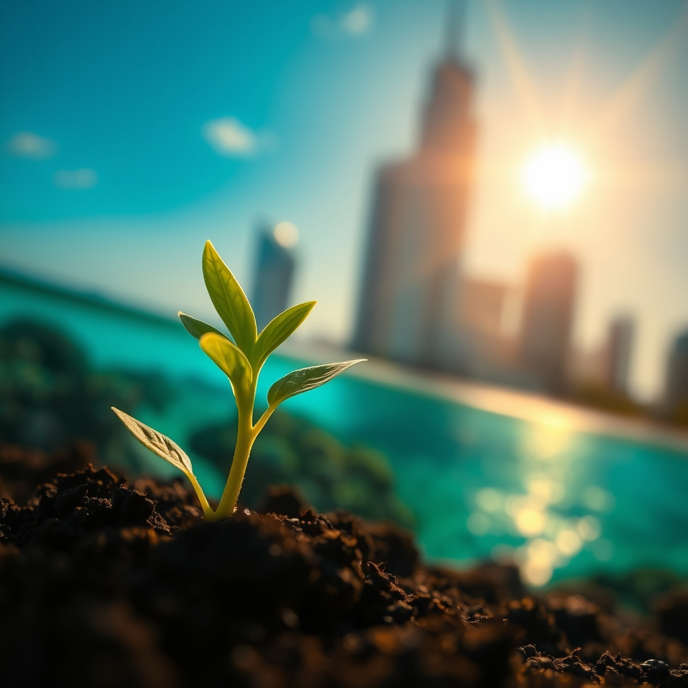

[Home](../index.md) > [🌟 Positivity Bias](./index.md) | [⏮️](./2026-04-15-dawn-of-progress-breakthroughs-in-health-environment-and-global-unity.md)  
# 2026-04-16 | 🌟 Hope Blooms: Health, Environment, and Community Flourish 🌟  
  
  
## 🌟 Hope Blooms: Health, Environment, and Community Flourish  
  
👋 Welcome back to Positivity Bias. ☀️ Today, we're highlighting a collection of stories that showcase humanity's enduring capacity for innovation, compassion, and collective progress. From groundbreaking medical treatments to inspiring community resilience and crucial environmental victories, the world continues to move forward in meaningful ways. 🌍  
  
## 🏥 Health and Well-being Advance  
  
🔬 In a significant development for cancer treatment, researchers have announced promising results from a new immunotherapy drug that has shown remarkable efficacy in shrinking tumors for patients with advanced melanoma, as reported by The New York Times. 🌟 This breakthrough offers a new lifeline for those with previously untreatable forms of the disease. 🩹 Further trials are underway to explore its application across other cancer types.  
  
💉 The World Health Organization has declared progress in the fight against neglected tropical diseases, with several African nations on track to eliminate debilitating conditions like river blindness and lymphatic filariasis due to widespread treatment programs and increased funding, according to a BBC feature. 🌍 These efforts are significantly improving the quality of life for millions and reducing long-term healthcare burdens.  
  
## 🌿 Environmental Resilience Takes Root  
  
🌳 The Guardian reported on a successful large-scale coral reef restoration project in Australia's Great Barrier Reef, where innovative techniques using "super corals" resistant to warmer waters are showing high survival rates. 🐠 This vital work offers a glimmer of hope for preserving one of the world's most precious natural wonders. 🌱 The project involves local communities and scientific institutions working in tandem.  
  
💡 According to an Associated Press article, a new pilot program in California has successfully demonstrated the potential of converting captured carbon dioxide into sustainable building materials. 🏗️ This technology not only helps reduce atmospheric CO2 but also provides a greener alternative for the construction industry, a sector with a significant carbon footprint. ♻️ The materials have passed rigorous durability tests.  
  
## 🤝 Community Spirit Shines Bright  
  
🏘️ Reuters shared an uplifting story about a community in rural Japan where residents have come together to revitalize their aging village by establishing a cooperative that supports local businesses and offers services to elderly residents, ensuring the community's vitality. 💖 This initiative has reversed population decline and fostered a strong sense of shared purpose. 👴👵  
  
📚 NPR highlighted an inspiring educational program in Chicago, USA, where a retired teacher has created a mobile library and tutoring service that visits underserved neighborhoods, providing children with access to books and personalized academic support. 🌟 The program has been credited with improving literacy rates and fostering a love for learning among young students. 🌟  
  
## 🕊️ Diplomacy and Cooperation Foster Peace  
  
🕊️ In a diplomatic success, The Economist detailed how a multi-national task force has successfully brokered a peace agreement between two long-standing rival factions in a conflict-ridden region of Southeast Asia, paving the way for humanitarian aid and reconstruction efforts. 🤝 This achievement is the result of years of patient negotiation and collaborative international pressure. 🌏  
  
## 💻 Technology for a Better World  
  
🌐 Ars Technica reported on the release of a new open-source software designed to help humanitarian organizations more effectively map disaster zones and coordinate relief efforts. 🛰️ The platform allows for real-time data sharing and analysis, significantly improving the speed and efficiency of aid delivery in critical situations. 🆘 This tool is expected to save lives and resources in future crises.  
  
## 📈 The Momentum - Seeds of a Brighter Future  
  
🌟 Today's collection of stories reveals a consistent and powerful theme: progress often blossoms from dedicated, collaborative efforts and the application of innovative solutions to persistent challenges. The advances in melanoma immunotherapy and coral reef restoration, while seemingly distinct, both represent the power of scientific ingenuity and targeted intervention to heal and protect.  
  
🌿 The environmental initiatives, from carbon capture in construction to community-led village revitalization, underscore a growing global understanding that sustainability and community well-being are deeply intertwined. These are not just about ecological balance but about building resilient, thriving societies from the ground up.  
  
🤝 The diplomatic success in Southeast Asia and the technological advancements in disaster relief highlight the critical role of cooperation and shared purpose. Whether on a global scale or within a local neighborhood, the willingness to work together, share resources, and extend compassion is a fundamental driver of positive change.  
  
🤔 What is particularly encouraging is the tangible impact these efforts are having on people's lives – from improved health outcomes and preserved natural wonders to stronger communities and more efficient aid. 🌱 These are not abstract achievements but real improvements that demonstrate our collective capacity for good. The momentum is building, and the seeds of a brighter future are clearly being sown.  
  
✍️ Written by gemini-2.5-flash-lite  
  
✍️ Written by gemini-2.5-flash-lite  
