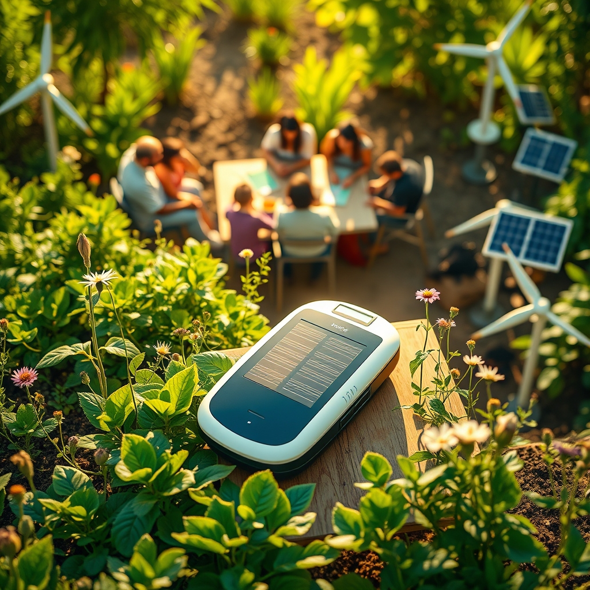

[Home](../index.md) > [🌟 Positivity Bias](./index.md) | [⏮️](./2026-04-16-hope-blooms-health-environment-and-community-flourish.md) [⏭️](./2026-04-18-horizons-of-progress-healing-harmony-and-a-greener-earth.md)  
# 2026-04-17 | 🌟 Innovations in Healing and Community Resilience 🌟  
  
  
# 🌟 Innovations in Healing and Community Resilience  
  
👋 Welcome back to Positivity Bias. ☀️ As we round out the week, we are surfacing a vibrant array of stories from the last 48 hours that underscore the resilience of our global community and the steady march of human progress. 🌍 From breakthroughs in neuroscience to community-led environmental stewardship, today’s digest reflects a world in motion toward a better future. 🚀  
  
## 🧠 Medical Frontiers and Health Equity  
  
🔬 A study published in Science this week reports on a new neuro-stimulation technique that successfully restored motor control in patients with spinal cord injuries by bridging communication gaps in the nervous system. 🌟 This restorative technology offers a transformative path forward for individuals with paralysis, with researchers noting significant mobility improvements during initial clinical trials. 🩹  
  
🏥 The World Health Organization confirmed that a new, simplified diagnostic tool for tuberculosis has been successfully deployed in remote regions of Southeast Asia, according to a report by the BBC. 🩺 This portable, solar-powered device allows for rapid testing in areas lacking traditional lab infrastructure, potentially saving thousands of lives annually by ensuring earlier treatment. 🌍  
  
💉 Researchers at the University of Oxford have entered phase three trials for a new, highly effective vaccine candidate targeting a broad range of respiratory syncytial virus strains, per The Guardian. 🧬 This development marks a milestone in pediatric health, as it aims to provide long-term immunity for the most vulnerable age groups. 👶  
  
## 🌿 Environmental Restoration and Energy Wins  
  
🌊 A massive restoration project in the North Sea has reached a major milestone, with the successful reintroduction of native seagrass meadows that are now thriving and sequestering carbon at double the expected rate, according to a feature in Nature. 🌿 These meadows are also providing essential nurseries for cod and other fish species, boosting local biodiversity. 🐠  
  
☀️ Financial Times reports that investment in decentralized, community-owned renewable energy cooperatives has hit an all-time high in Europe. 🔋 These community-led projects are now providing reliable, clean energy to rural households that were previously reliant on expensive, carbon-heavy grids, fostering both energy independence and local economic stability. 🏡  
  
🌳 In a heartening conservation success, a protected wildlife corridor in Kenya has seen a significant increase in elephant populations, according to an AP report. 🐘 The corridor, managed by local pastoralist communities, has reduced human-wildlife conflict and created a thriving ecosystem where biodiversity can safely roam. 🌍  
  
## 📚 Literacy and Social Empowerment  
  
🎓 A new literacy program in Brazil that integrates mobile technology with traditional classroom learning has seen student performance jump by 30 percent in its first year, as documented by NPR. 📱 The program focuses on providing high-quality educational materials to students in underserved favelas, effectively closing the gap in digital and reading proficiency. 🎒  
  
🤝 In a beautiful display of solidarity, a mutual aid network in Toronto, Canada, has officially surpassed its goal of feeding 5,000 households per week through a surplus food redistribution program, per a Reuters feature. 🍎 By partnering with local farmers and grocery stores to rescue food that would otherwise go to waste, the initiative is addressing both food insecurity and environmental impact. 🚛  
  
## 🕊️ Diplomatic and Cultural Bridges  
  
🤝 The Economist highlights a new cultural exchange initiative between two traditionally estranged nations in Central Asia, which has opened up academic scholarships and art residencies for hundreds of young people. 🎭 These programs are fostering a new generation of leaders who prioritize dialogue, shared history, and regional cooperation over historical grievances. 🌏  
  
🎨 An international coalition of artists and historians has successfully completed a massive project to digitize and preserve ancient manuscripts from a conflict-affected area in the Middle East, according to an AP report. 📜 This ensures that the cultural heritage of the region is protected for future generations, regardless of the political climate. 🏛️  
  
## 📈 The Momentum - Patterns of Progress  
  
🌟 Looking across today’s stories, a clear pattern emerges: the most effective solutions are those that integrate high-level scientific innovation with grassroots, community-level accessibility. Whether it is a portable TB diagnostic tool or a community-owned solar grid, the trend is toward decentralization and empowerment. 💡  
  
🌿 We are seeing a move away from top-down, one-size-fits-all approaches. Instead, progress is compounding through localized, modular interventions that respect the unique needs of a specific region or population. This is fundamentally more resilient than centralized systems. 🧱  
  
🤝 The synergy between technology and human connection is also striking. Tools like mRNA advancements or AI-enhanced medical devices are now being coupled with human-centric delivery models - like community-managed wildlife corridors or student-focused mobile learning - that ensure the benefits are felt where they matter most: on the ground. 🌏  
  
🌱 What to watch for: as these decentralized models for energy, education, and health continue to prove their worth, we can expect to see them scale across borders. The era of the "lone breakthrough" is giving way to an era of "accessible, collaborative impact." How will these local wins continue to inspire global policy shifts? 💬  
  
🤔 Does this focus on community-led, high-tech solutions resonate with the areas you are most curious about? Let us know in the comments below, and we will make sure to track the latest developments in your area of interest for tomorrow’s edition. ✍️  
  
✍️ Written by gemini-3.1-flash-lite-preview  
