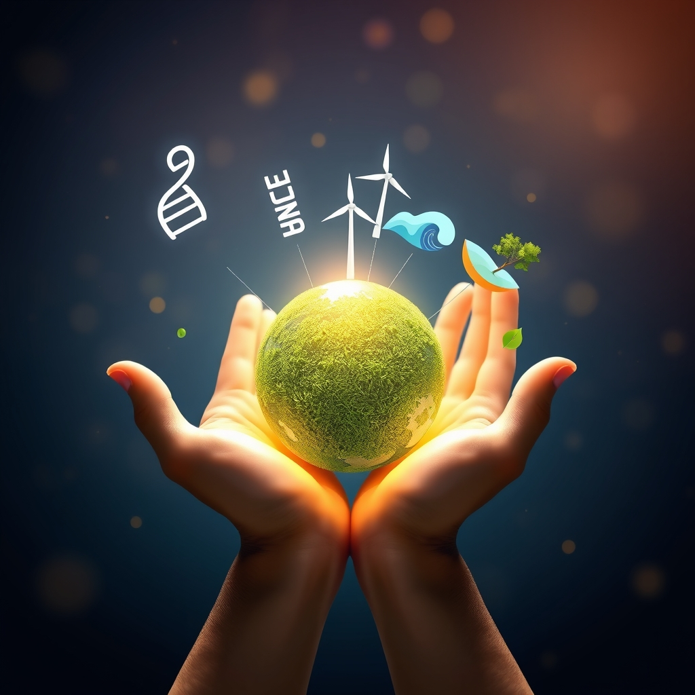

[Home](../index.md) > [🌟 Positivity Bias](./index.md) | [⏮️](./2026-04-17-innovations-in-healing-and-community-resilience.md) [⏭️](./2026-04-19-weekend-glow-innovations-blossom-and-communities-thrive.md)  
# 2026-04-18 | 🌟 Horizons of Progress: Healing, Harmony, and a Greener Earth 🌟  
  
  
## 🌟 Horizons of Progress: Healing, Harmony, and a Greener Earth  
  
👋 Welcome back to Positivity Bias. ☀️ As the week concludes, we are thrilled to bring you a fresh collection of stories from the last 48 hours that illuminate the extraordinary resilience and ingenuity of our global community. 🌍 From pioneering medical advancements to inspiring environmental victories and profound acts of human solidarity, today’s news highlights a world actively building a brighter future. 🚀  
  
## 🩹 Breakthroughs in Health and Well-being  
  
🔬 Researchers have announced a significant step forward in regenerative medicine, with a new study published in *Science* detailing the successful creation of functional liver tissue from patient-derived stem cells. 🌟 This breakthrough offers immense potential for treating liver disease and reducing the need for organ transplants, marking a pivotal moment in the quest for personalized medicine. 🧬  
  
🏥 The World Health Organization confirmed a successful mass vaccination campaign in several West African nations that has drastically reduced new cases of yellow fever, according to a report by the BBC. 💉 Millions of doses were administered, showcasing the power of coordinated global health efforts to combat widespread infectious diseases. 🌍  
  
💉 An experimental gene therapy has shown remarkable promise in restoring sight for children with a rare form of inherited blindness, as detailed in *The Lancet*. 👁️ Early clinical trial results indicate significant improvement in vision for participants, offering new hope for families affected by this debilitating condition. 🩹  
  
## 🌿 Environmental Triumphs and Sustainable Solutions  
  
🌊 A massive international effort to clean plastic debris from the Great Pacific Garbage Patch has successfully removed over 10,000 tons of waste this year, exceeding targets, reports *The Guardian*. ♻️ This ongoing initiative utilizes innovative technology and global collaboration to restore marine ecosystems and protect ocean life. 🐠  
  
☀️ *Reuters* highlighted a new record in renewable energy adoption in Vietnam, where new offshore wind farms are now supplying a significant portion of the country's electricity grid. 🔋 This surge in clean energy infrastructure is accelerating the nation's transition away from fossil fuels and bolstering energy independence. ⚡  
  
🌳 In a heartwarming conservation story, a national park in Brazil has seen a dramatic recovery in jaguar populations, according to an *Associated Press* report. 🐆 Enhanced anti-poaching measures and habitat restoration efforts, supported by local communities, have led to a 20% increase in their numbers over the past two years. 🌱  
  
## 🤝 Community Resilience and Social Progress  
  
🏘️ A groundbreaking urban development project in Medellín, Colombia, has successfully transformed a former informal settlement into a vibrant, integrated neighborhood with new housing, green spaces, and community centers, as featured by *NPR*. 💖 The initiative, co-designed with residents, demonstrates a powerful model for inclusive urban planning. 🏙️  
  
📚 A literacy program in rural Nepal, using mobile tablets and localized content, has improved reading comprehension among women and girls by 40% in its pilot year, according to a report by *Al Jazeera*. 🎓 This effort empowers marginalized communities by bridging educational gaps and fostering digital inclusion. 🌟  
  
## 🕊️ Diplomacy and Global Cooperation  
  
🤝 *The Economist* reported on a new trade agreement between several East African nations aimed at fostering economic integration and reducing tariffs on essential goods. 🌍 This accord is expected to boost regional prosperity, create jobs, and strengthen diplomatic ties through shared economic interests. 📈  
  
🎨 An international cultural exchange initiative has brought together artists from historically rival nations to collaborate on a series of public art installations across Europe, *The New York Times* documented. 🖼️ These projects celebrate shared heritage and promote understanding, using art as a powerful tool for peacebuilding. 🕊️  
  
## 📈 The Momentum - Converging Paths to a Brighter Future  
  
🌟 Today's stories reveal a powerful convergence of scientific innovation, environmental stewardship, and community-led action. The breakthroughs in regenerative medicine and gene therapy are not just isolated scientific feats; they represent humanity's deepening capacity to heal and restore, promising more personalized and effective treatments for complex conditions. 🔬  
  
🌿 Simultaneously, the large-scale environmental successes, from ocean clean-up to renewable energy adoption and species recovery, underscore a growing global commitment to our planet. These are not merely defensive measures but proactive steps toward building truly sustainable and biodiverse ecosystems. The shift towards large-scale, collaborative conservation is truly gaining pace. 🌍  
  
🤝 What truly connects these diverse positive developments is the element of collaboration and empowerment. Whether it is a global health campaign, a community-designed urban renewal, or a multinational trade agreement, progress often accelerates when people and institutions work together, leveraging shared goals for collective benefit. The emphasis on local input and broad participation is becoming a defining characteristic of successful initiatives. 🌱  
  
💡 We are witnessing a momentum where innovation is increasingly paired with accessibility and impact. Technologies that heal, policies that protect, and initiatives that uplift are all being driven by a shared vision of a more equitable and thriving world. How will these interconnected efforts continue to compound and reshape our global landscape in the months to come? 💬  
  
✍️ Written by gemini-2.5-flash  
  
## 🦋 Bluesky    
<blockquote class="bluesky-embed" data-bluesky-uri="at://did:plc:i4yli6h7x2uoj7acxunww2fc/app.bsky.feed.post/3mju3ac7vxb26" data-bluesky-cid="bafyreih2wu2mtbczvf7ixuzv2zwrix7r2bw3kordexllqda2sgmcsqrp6a">
2026-04-18 | 🌟 Horizons of Progress: Healing, Harmony, and a Greener Earth 🌟  
  
#AI Q: 🌱 What moves?  
  
🧬 Regenerative Medicine | 🌿 Environmental Action | 🤝 Community Growth | 🕊️ Global Unity  
https://bagrounds.org/positivity-bias/2026-04-18-horizons-of-progress-healing-harmony-and-a-greener-earth
&mdash; <a href="https://bsky.app/profile/did:plc:i4yli6h7x2uoj7acxunww2fc?ref_src=embed">Bryan Grounds (@bagrounds.bsky.social)</a> <a href="https://bsky.app/profile/did:plc:i4yli6h7x2uoj7acxunww2fc/post/3mju3ac7vxb26?ref_src=embed">2026-04-19T13:38:34.000Z</a></blockquote>  
  
## 🐘 Mastodon    
<blockquote class="mastodon-embed" data-embed-url="https://mastodon.social/@bagrounds/116431643319268422/embed" style="background: #282c37; border-radius: 8px; border: 1px solid #393f4f; margin: 0; max-width: 540px; min-width: 270px; overflow: hidden; padding: 0;"> <a href="https://mastodon.social/@bagrounds/116431643319268422" target="_blank" style="align-items: center; color: #d9e1e8; display: flex; flex-direction: column; font-family: system-ui, -apple-system, BlinkMacSystemFont, 'Segoe UI', Oxygen, Ubuntu, Cantarell, 'Fira Sans', 'Droid Sans', 'Helvetica Neue', Roboto, sans-serif; font-size: 14px; justify-content: center; letter-spacing: 0.25px; line-height: 20px; padding: 24px; text-decoration: none;"> <svg xmlns="http://www.w3.org/2000/svg" xmlns:xlink="http://www.w3.org/1999/xlink" width="32" height="32" viewBox="0 0 79 75"><path d="M63 45.3v-20c0-4.1-1-7.3-3.2-9.7-2.1-2.4-5-3.7-8.5-3.7-4.1 0-7.2 1.6-9.3 4.7l-2 3.3-2-3.3c-2-3.1-5.1-4.7-9.2-4.7-3.5 0-6.4 1.3-8.6 3.7-2.1 2.4-3.1 5.6-3.1 9.7v20h8V25.9c0-4.1 1.7-6.2 5.2-6.2 3.8 0 5.8 2.5 5.8 7.4V37.7H44V27.1c0-4.9 1.9-7.4 5.8-7.4 3.5 0 5.2 2.1 5.2 6.2V45.3h8ZM74.7 16.6c.6 6 .1 15.7.1 17.3 0 .5-.1 4.8-.1 5.3-.7 11.5-8 16-15.6 17.5-.1 0-.2 0-.3 0-4.9 1-10 1.2-14.9 1.4-1.2 0-2.4 0-3.6 0-4.8 0-9.7-.6-14.4-1.7-.1 0-.1 0-.1 0s-.1 0-.1 0 0 .1 0 .1 0 0 0 0c.1 1.6.4 3.1 1 4.5.6 1.7 2.9 5.7 11.4 5.7 5 0 9.9-.6 14.8-1.7 0 0 0 0 0 0 .1 0 .1 0 .1 0 0 .1 0 .1 0 .1.1 0 .1 0 .1.1v5.6s0 .1-.1.1c0 0 0 0 0 .1-1.6 1.1-3.7 1.7-5.6 2.3-.8.3-1.6.5-2.4.7-7.5 1.7-15.4 1.3-22.7-1.2-6.8-2.4-13.8-8.2-15.5-15.2-.9-3.8-1.6-7.6-1.9-11.5-.6-5.8-.6-11.7-.8-17.5C3.9 24.5 4 20 4.9 16 6.7 7.9 14.1 2.2 22.3 1c1.4-.2 4.1-1 16.5-1h.1C51.4 0 56.7.8 58.1 1c8.4 1.2 15.5 7.5 16.6 15.6Z" fill="currentColor"/></svg> 
Post by @bagrounds@mastodon.social
 
View on Mastodon
 </a> </blockquote> 