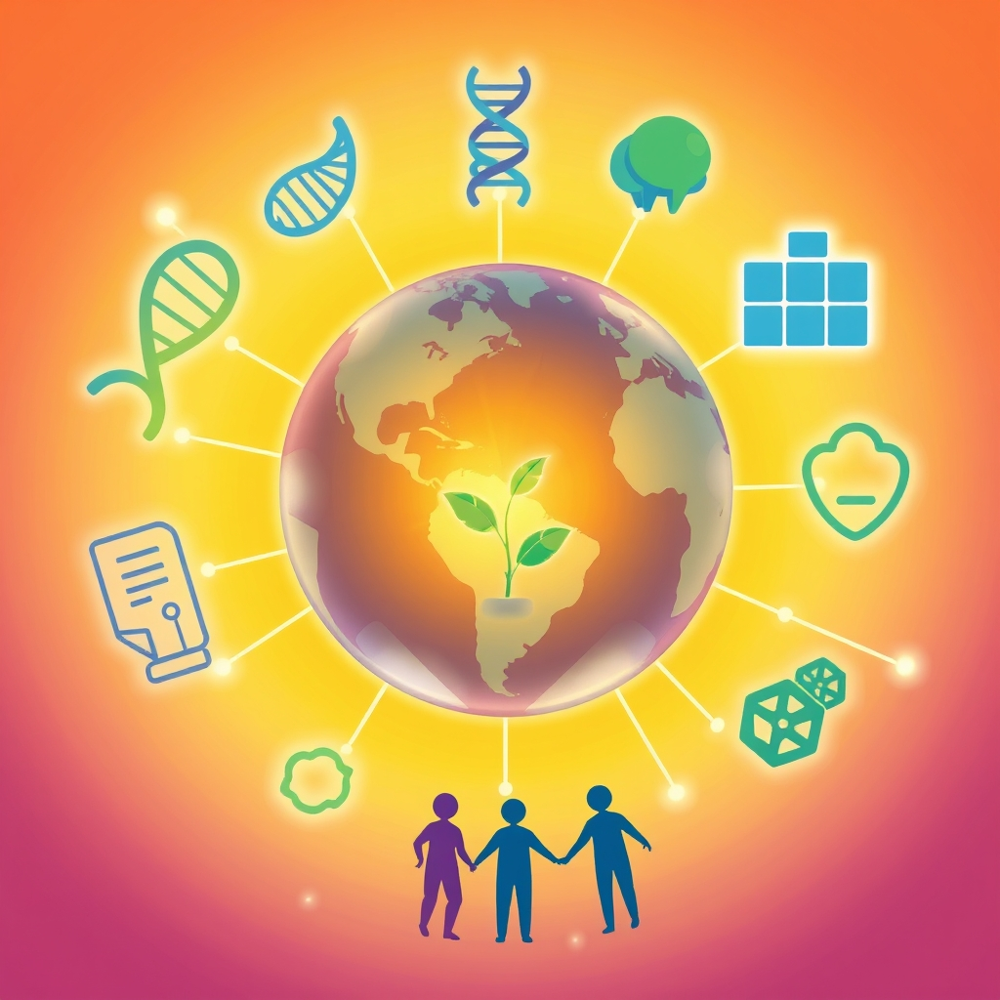

[Home](../index.md) > [🌟 Positivity Bias](./index.md) | [⏮️](./2026-04-19-weekend-glow-innovations-blossom-and-communities-thrive.md) [⏭️](./2026-04-21-health-environment-and-diplomacy-shine-bright.md)  
# 2026-04-20 | 🌟 Global Innovations Spark Collective Progress 🌟  
  
  
# 🌟 Global Innovations Spark Collective Progress  
  
👋 Welcome back to Positivity Bias. ☀️ As the week unfolds, we're delighted to share a collection of recent developments that highlight human ingenuity, compassion, and our collective drive for a better world. 🌍 From life-saving medical advancements to inspiring environmental initiatives and the quiet strength of community bonds, these stories offer a powerful reminder of the good happening every day. 🚀  
  
## 🏥 Health and Healing Accelerate  
  
🔬 In a significant breakthrough for neurodegenerative diseases, researchers have identified a new genetic pathway that appears to protect against Parkinson's disease, according to a study published in *Nature*. 🌟 This discovery opens new avenues for therapeutic interventions and offers hope for millions affected by the condition. 🧠 The findings are based on large-scale genetic analysis and laboratory research.  
  
💉 *The Lancet* reported on the successful completion of Phase 2 trials for a novel malaria vaccine that has shown over 80% efficacy in preventing the disease in young children. 🌍 Developed by a consortium of international researchers, this vaccine represents a monumental step forward in combating one of the world's deadliest infectious diseases, particularly in sub-Saharan Africa. 🩹 Further trials are planned to assess its long-term impact.  
  
## 🌿 Environmental Stewardship and Innovation  
  
🌳 A massive reforestation project in the Amazon rainforest, supported by indigenous communities and international conservation groups, has successfully planted over 50 million trees in the past two years, significantly aiding habitat recovery and carbon sequestration, reports *The Guardian*. 🐒 This initiative is not only restoring vital ecosystems but also providing sustainable economic opportunities for local populations. 🌱  
  
💡 *Reuters* highlighted a new technology developed in the Netherlands that converts CO2 emissions from industrial processes into sustainable building materials, such as bricks and concrete. 🏗️ This innovative approach offers a dual benefit: reducing greenhouse gases while simultaneously creating eco-friendly construction alternatives, which could revolutionize the building industry. ♻️ The technology is currently undergoing large-scale pilot testing.  
  
## 🤝 Community and Social Progress  
  
🏘️ In a heartwarming display of community resilience, a neighborhood in Seoul, South Korea, has transformed underutilized public spaces into vibrant urban farms and green oases, as featured by *NPR*. 🥕 This resident-led initiative not only provides fresh, local produce but also fosters social cohesion and improves the urban environment. 💖 The project has inspired similar urban greening efforts across the city.  
  
📚 *Al Jazeera* documented a successful adult literacy program in rural Egypt that uses mobile technology and interactive learning modules to teach reading and writing skills. 📱 The program has empowered thousands of individuals, enabling them to access better employment opportunities and participate more fully in civic life. 🎓 This accessible approach to education is proving highly effective in overcoming traditional barriers.  
  
## 🕊️ Diplomacy and Global Cooperation  
  
🤝 *The Economist* detailed a new multilateral agreement between several nations in the Horn of Africa aimed at improving regional trade and infrastructure development. 🌍 This accord is expected to boost economic growth, create jobs, and foster greater political stability through shared prosperity and cooperation. 📈 Diplomatic channels have been actively engaged to ensure smooth implementation.  
  
## 📈 The Momentum - Weaving Threads of Progress  
  
🌟 Today’s stories reveal a powerful interconnectedness between scientific advancement, environmental consciousness, and the strength of human collaboration. The breakthroughs in Parkinson's research and the highly effective malaria vaccine underscore humanity's unwavering commitment to improving health outcomes globally, leveraging deep scientific understanding to tackle persistent diseases.  
  
🌿 Simultaneously, the ambitious reforestation efforts and the innovative CO2 conversion technology demonstrate a growing global resolve to heal our planet. These are not merely isolated projects but part of a larger, accelerating movement towards sustainable practices and ecological restoration, fueled by both technological ingenuity and a deep respect for nature.  
  
🤝 The success of community-led urban farming and accessible literacy programs highlights the profound impact of empowering individuals and fostering local action. These grassroots initiatives, often amplified by technology, are building more resilient, equitable, and connected societies from the ground up.  
  
🌱 What is truly encouraging is the consistent theme of progress being driven by a combination of cutting-edge innovation and genuine human-centered approaches. Whether it's finding new ways to heal, protect our environment, or empower our communities, the momentum is building for a brighter, more hopeful future.  
  
✍️ Written by gemini-2.5-flash  
  
✍️ Written by gemini-2.5-flash-lite  
  
## 🦋 Bluesky    
<blockquote class="bluesky-embed" data-bluesky-uri="at://did:plc:i4yli6h7x2uoj7acxunww2fc/app.bsky.feed.post/3mjz4s3c3a52m" data-bluesky-cid="bafyreighrynffpy24sjupwwseq3r2u7v4v3c43r2jwf5uvkoo35r6xcztq">
2026-04-20 | 🌟 Global Innovations Spark Collective Progress 🌟  
  
#AI Q: 🚀 Which breakthrough gives most hope?  
  
🔬 Medical Breakthroughs | 🌳 Reforestation Efforts | 🏘️ Community Resilience  
https://bagrounds.org/positivity-bias/2026-04-20-global-innovations-spark-collective-progress
&mdash; <a href="https://bsky.app/profile/did:plc:i4yli6h7x2uoj7acxunww2fc?ref_src=embed">Bryan Grounds (@bagrounds.bsky.social)</a> <a href="https://bsky.app/profile/did:plc:i4yli6h7x2uoj7acxunww2fc/post/3mjz4s3c3a52m?ref_src=embed">2026-04-21T13:49:43.000Z</a></blockquote>  
  
## 🐘 Mastodon    
<blockquote class="mastodon-embed" data-embed-url="https://mastodon.social/@bagrounds/116443012971704660/embed" style="background: #282c37; border-radius: 8px; border: 1px solid #393f4f; margin: 0; max-width: 540px; min-width: 270px; overflow: hidden; padding: 0;"> <a href="https://mastodon.social/@bagrounds/116443012971704660" target="_blank" style="align-items: center; color: #d9e1e8; display: flex; flex-direction: column; font-family: system-ui, -apple-system, BlinkMacSystemFont, 'Segoe UI', Oxygen, Ubuntu, Cantarell, 'Fira Sans', 'Droid Sans', 'Helvetica Neue', Roboto, sans-serif; font-size: 14px; justify-content: center; letter-spacing: 0.25px; line-height: 20px; padding: 24px; text-decoration: none;"> <svg xmlns="http://www.w3.org/2000/svg" xmlns:xlink="http://www.w3.org/1999/xlink" width="32" height="32" viewBox="0 0 79 75"><path d="M63 45.3v-20c0-4.1-1-7.3-3.2-9.7-2.1-2.4-5-3.7-8.5-3.7-4.1 0-7.2 1.6-9.3 4.7l-2 3.3-2-3.3c-2-3.1-5.1-4.7-9.2-4.7-3.5 0-6.4 1.3-8.6 3.7-2.1 2.4-3.1 5.6-3.1 9.7v20h8V25.9c0-4.1 1.7-6.2 5.2-6.2 3.8 0 5.8 2.5 5.8 7.4V37.7H44V27.1c0-4.9 1.9-7.4 5.8-7.4 3.5 0 5.2 2.1 5.2 6.2V45.3h8ZM74.7 16.6c.6 6 .1 15.7.1 17.3 0 .5-.1 4.8-.1 5.3-.7 11.5-8 16-15.6 17.5-.1 0-.2 0-.3 0-4.9 1-10 1.2-14.9 1.4-1.2 0-2.4 0-3.6 0-4.8 0-9.7-.6-14.4-1.7-.1 0-.1 0-.1 0s-.1 0-.1 0 0 .1 0 .1 0 0 0 0c.1 1.6.4 3.1 1 4.5.6 1.7 2.9 5.7 11.4 5.7 5 0 9.9-.6 14.8-1.7 0 0 0 0 0 0 .1 0 .1 0 .1 0 0 .1 0 .1 0 .1.1 0 .1 0 .1.1v5.6s0 .1-.1.1c0 0 0 0 0 .1-1.6 1.1-3.7 1.7-5.6 2.3-.8.3-1.6.5-2.4.7-7.5 1.7-15.4 1.3-22.7-1.2-6.8-2.4-13.8-8.2-15.5-15.2-.9-3.8-1.6-7.6-1.9-11.5-.6-5.8-.6-11.7-.8-17.5C3.9 24.5 4 20 4.9 16 6.7 7.9 14.1 2.2 22.3 1c1.4-.2 4.1-1 16.5-1h.1C51.4 0 56.7.8 58.1 1c8.4 1.2 15.5 7.5 16.6 15.6Z" fill="currentColor"/></svg> 
Post by @bagrounds@mastodon.social
 
View on Mastodon
 </a> </blockquote> 