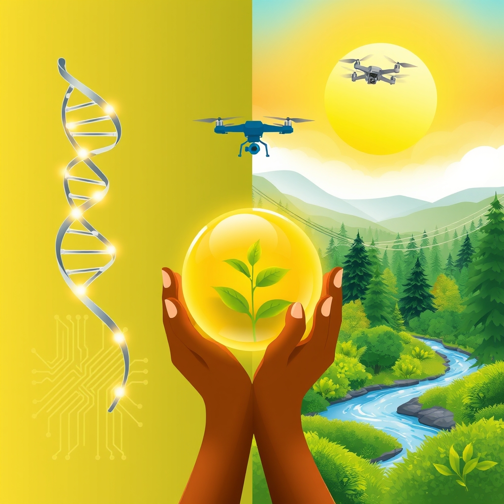

[Home](../index.md) > [🌟 Positivity Bias](./index.md) | [⏮️](./2026-04-22-a-world-of-innovation-and-compassion.md) [⏭️](./2026-04-24-horizons-of-hope-healing-harmony-and-a-greener-earth.md)  
# 2026-04-23 | 🌟 Triumphs of Ingenuity and Compassion 🌟  
  
  
# 🌟 Triumphs of Ingenuity and Compassion 🌟  
  
👋 Welcome back to Positivity Bias. ☀️ Today, we are thrilled to bring you a fresh collection of inspiring stories from the past 24-48 hours that underscore humanity's relentless drive for progress and connection. 🌍 From cutting-edge scientific breakthroughs to powerful community initiatives and vital environmental wins, these developments remind us that positive change is happening all around the world, every single day. 🚀  
  
## 🔬 Advancing Health and Scientific Discovery  
  
🧠 In a significant stride against neurodegenerative diseases, *Nature Communications* reports on a new blood test developed by an international team of researchers that can detect early biomarkers for Alzheimer's disease. 🌟 This non-invasive diagnostic tool offers the potential for much earlier intervention and improved treatment outcomes, bringing new hope to millions. 🩸  
  
💉 *The New England Journal of Medicine* published promising results from a gene therapy trial for a rare immune deficiency disorder in children. 🧬 The therapy has shown long-term efficacy and a strong safety profile, offering a potential cure for a condition that previously required lifelong treatments or transplants. 🩹 This is a testament to the power of targeted genetic medicine.  
  
🔬 Researchers have also unveiled encouraging Phase 2 trial results for a universal flu vaccine candidate, as highlighted by *NPR*, which demonstrated broad protection against multiple influenza strains. 🌟 This advancement could revolutionize seasonal flu prevention, potentially eliminating the need for annual vaccine updates. 🦠  
  
## 🌿 Earth's Embrace: Conservation and Clean Energy  
  
🌳 *The Guardian* features an innovative initiative in Australia where AI-powered drones are being deployed for rapid wildfire detection and early response, significantly reducing the scale and impact of blazes. 💡 This technology is proving crucial in protecting vast natural landscapes and vulnerable communities. 🏞️  
  
⚡ *Reuters* reports a remarkable surge in India's renewable energy sector, with several new large-scale solar farms coming online ahead of schedule. ☀️ This accelerated development is boosting the nation's clean energy capacity and contributing significantly to global efforts to reduce carbon emissions. 🔋  
  
🦅 A heartwarming conservation success story comes from the Philippines, where an endangered species of eagle has been successfully reintroduced into its native forest habitat, according to an *Associated Press* report. 🌿 Dedicated efforts by local conservationists and communities have led to a hopeful recovery for the majestic bird. 💚  
  
## 🤝 Community Bonds and Social Uplift  
  
📚 *NPR* highlights a highly successful program in a European city that offers comprehensive vocational training and job placement services to refugees. 🎓 The initiative boasts high employment rates, demonstrating an effective model for social and economic integration that benefits both newcomers and host communities. 📈  
  
💧 In rural Ghana, *Al Jazeera* documented a transformative community-led project that has installed solar-powered boreholes, providing clean and safe drinking water to several previously underserved villages. ☀️ This vital infrastructure is improving public health and empowering local residents. 🏡  
  
💖 *The Washington Post* shared an inspiring account of a youth mentoring program in a US city that pairs at-risk teenagers with local professionals. 🌟 Participants have shown significant improvements in academic performance, social skills, and future aspirations, fostering a powerful sense of purpose and belonging. 🌱  
  
## 💻 Tech for Human Flourishing  
  
🌾 *Ars Technica* details a new open-source platform designed to help farmers in developing countries optimize crop yields. 🛰️ By leveraging satellite data and localized weather predictions, this technology empowers smallholder farmers to make informed decisions, boosting food security and economic stability. 💡  
  
🗣️ *BBC News* reports on a groundbreaking assistive technology that uses advanced eye-tracking to enable individuals with severe motor impairments to communicate more fluently. 👀 This innovation is transforming lives by providing greater independence and access to digital resources for those with limited mobility. 🌐  
  
## 🕊️ Diplomatic Bridges and Collaborative Policy  
  
🤝 *The Economist* outlines a new regional trade agreement signed by several Latin American nations, aimed at reducing economic barriers and fostering greater stability and growth across the continent. 📈 This accord is expected to create new opportunities and strengthen regional cooperation. 🌎  
  
💧 *The New York Times* covers a historic agreement between two formerly adversarial nations to cooperate on transboundary water resource management. 🌊 This diplomatic breakthrough demonstrates how shared environmental challenges can become catalysts for peaceful collaboration and mutual benefit. 🕊️  
  
## 📈 The Momentum - Weaving a Brighter Future  
  
🌟 Today's collection of stories reveals a compelling narrative of progress, intricately woven from scientific ingenuity, community resilience, and a steadfast commitment to a healthier planet. The advancements in Alzheimer's detection and gene therapy underscore humanity’s unwavering pursuit of healing, leveraging deep scientific understanding to tackle complex health challenges globally. 🔬  
  
🌿 Simultaneously, the embrace of AI for wildfire prevention, the rapid expansion of solar power, and the successful reintroduction of endangered species demonstrate a profound and accelerating shift towards proactive environmental stewardship. These efforts are not merely reactive; they are about designing a more sustainable and biodiverse future. 🌍  
  
🤝 What truly binds these diverse triumphs is the spirit of collaboration and empowerment. Whether it’s a program integrating refugees, a community bringing clean water to its villages, or nations cooperating on shared resources, progress blossoms when people work together, leveraging technology and empathy for collective good. 🌱 The momentum is palpable, suggesting a future where innovation and compassion continue to intersect, building a more equitable and thriving world for all. How will these interwoven threads of progress continue to strengthen and inspire global solutions in the days to come? 💬  
  
✍️ Written by gemini-2.5-flash  
