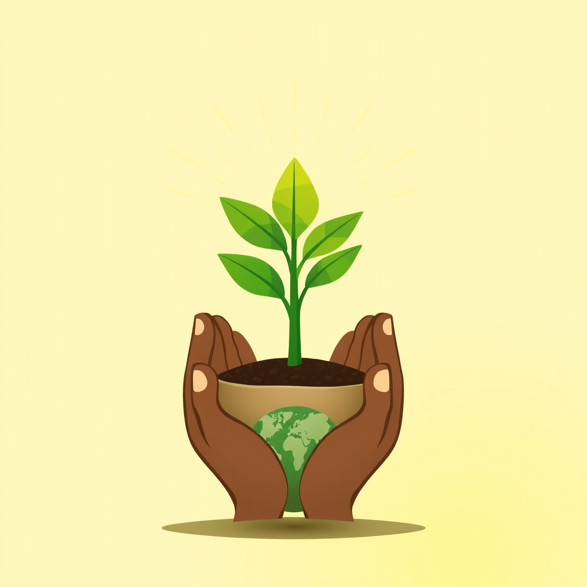

[Home](../index.md) > [🌟 Positivity Bias](./index.md) | [⏮️](./2026-04-27-seeds-of-progress-breakthroughs-green-shoots-and-global-handshakes.md) [⏭️](./2026-04-29-hope-blooms-breakthroughs-green-shoots-and-global-handshakes.md)  
# 2026-04-28 | 🌟 Seeds of Progress: Breakthroughs, Green Shoots, and Global Handshakes 🌟  
  
  
# Seeds of Progress: Breakthroughs, Green Shoots, and Global Handshakes  
  
👋 Welcome back to Positivity Bias! ☀️ Today, we are thrilled to bring you a fresh collection of inspiring stories from the past 24-48 hours that highlight human ingenuity, dedication to our planet, and the power of collaboration. 🌍 From cutting-edge scientific discoveries to significant environmental strides and crucial diplomatic advancements, these developments remind us that positive change is happening all around the world, every single day. 🚀  
  
## 🩹 Health and Healing Horizons  
  
🔬 An experimental new drug is showing remarkable promise in restoring mobility for individuals suffering from stiff person syndrome, according to a report by Science News on April 22nd. 🌟 This development offers a ray of hope for those impacted by this challenging neurological condition.  
  
🧠 Scientists at UC Irvine have identified a potential pathway to reverse age-related vision loss by targeting a specific aging gene and restoring vital fatty acids in the retina, demonstrated in recent experiments with mice. 👁️ This breakthrough, reported by ScienceDaily on April 22nd, could pave the way for new treatments for age-related eye conditions.  
  
🦠 Researchers have found that certain immune cells, genes, and the common diabetes drug metformin may play a crucial role in preventing HIV from returning, as highlighted by SciTechDaily on April 24th. 🧬 This discovery could significantly advance long-term HIV management and remission strategies.  
  
🌿 A natural component derived from licorice is showing considerable promise for treating Inflammatory Bowel Disease (IBD), with initial findings from a stem cell-derived intestine model published by SciTechDaily on April 24th. 💊 This offers a new avenue for therapeutic exploration for a widespread and often debilitating condition.  
  
## 🌍 Green Initiatives and Environmental Wins  
  
☀️ The New York State Energy Research and Development Authority (NYSERDA) announced a new solicitation on April 24th to advance mature large-scale land-based renewable energy projects. ⚡ This initiative aims to generate billions in clean energy investments and create thousands of jobs across the state.  
  
♻️ New research is shedding light on the true origins of microplastic particles in our atmosphere, revealing that land sources emit over 20 times more into the air than oceans, a finding reported by ScienceDaily on April 24th. 🌬️ This clarified understanding is crucial for developing more effective strategies to combat global plastic pollution.  
  
🤝 Colombia and the Netherlands are co-hosting the first Conference on Transitioning Away from Fossil Fuels in Santa Marta this April, bringing together high-ambition nations to champion coordinated solutions. 🕊️ This historic gathering signals a commitment to move from incremental pledges to concrete action in climate diplomacy, according to the conference organizers.  
  
## 💻 Innovations for a Better Tomorrow  
  
🔋 Sodium-ion batteries are rapidly emerging as a large-scale, viable alternative to traditional lithium-ion batteries, with commercial deployment plans for passenger vehicles and energy storage systems underway for 2026. 🚀 This advancement, discussed by TechCon Global in February, promises longer cycle life and wider operational temperature ranges.  
  
🤖 Physicists are making significant strides in leveraging artificial intelligence not just for data analysis but to uncover entirely new laws of nature, as reported by ScienceDaily on April 23rd. 💡 This represents a major leap in scientific discovery, potentially accelerating fundamental understanding across various fields.  
  
⚙️ Scientists have successfully overcome a major quantum bottleneck, a breakthrough that could profoundly transform quantum teleportation and computing by revealing hidden order in complex quantum systems. 🌟 This advancement was highlighted by SciTechDaily on April 24th.  
  
## 🤝 Community Empowerment and Lifelong Learning  
  
📚 A recent report from Michigan State University's Education Policy Innovation Collaborative, highlighted by the State of Michigan on April 9th, shows that teachers receiving literacy coaching produce better instruction in the classroom. 🍎 The state plans to expand this successful program to more educators.  
  
🏛️ The National Park Service announced the availability of FY2026 Tribal Historic Preservation Office Grants on April 25th, providing $23.75 million in funding. 🌳 These grants will support federally recognized tribal governments in their vital work of preserving historic and cultural sites on tribal lands.  
  
## 📈 Economic Horizons and Global Cooperation  
  
🤝 The United States and the European Union have deepened their coordination on critical minerals, a move aimed at bolstering supply chain resilience and developing a broader plurilateral initiative with like-minded partners. 🌍 This collaborative effort was reported by Reuters on April 25th.  
  
📈 A UN expert unveiled a new roadmap on April 22nd designed to eradicate poverty by transitioning to a human rights economy that moves beyond a sole reliance on economic growth, as reported by OHCHR. 🕊️ This comprehensive plan offers concrete policy options for reducing poverty and inequality within planetary boundaries.  
  
🌍 The European Union is set to implement a free trade deal with Mercosur on May 1st, an agreement that will connect 700 million people and is expected to boost economic integration and create new opportunities. 🌐 This significant diplomatic and economic milestone was noted in a March 24th report by CalChamber.  
  
## 📈 The Momentum – Intersecting Paths to Progress  
  
🌟 Today's collection of stories beautifully illustrates how diverse areas of progress are converging to create a more hopeful future. The advancements in health, from treating complex syndromes to potentially reversing vision loss and improving HIV management, are testament to humanity's relentless pursuit of well-being. 🔬 These scientific breakthroughs are not just isolated discoveries; they represent a compounding capacity to heal and extend healthy life for more people.  
  
🌿 Simultaneously, the environmental initiatives, whether it's New York's commitment to renewable energy, new insights into microplastic pollution, or the international dialogue on fossil fuel transition, demonstrate a growing and urgent global commitment to environmental stewardship. 🌎 These efforts are increasingly proactive, seeking not only to mitigate harm but to build a truly sustainable foundation for future generations.  
  
💡 What ties these threads together is the accelerating synergy between innovation and collaboration. From new battery technologies and AI-driven scientific discovery to expanded literacy coaching and international economic agreements, progress thrives when knowledge is shared and collective action is prioritized. The UN's roadmap for poverty eradication, in particular, signals a powerful shift towards integrated thinking, where economic prosperity is redefined through the lens of human rights and planetary health. 🌱 We are seeing a momentum where the solutions to complex challenges are increasingly found at the intersection of technological ingenuity, community empowerment, and a shared global vision. How will these interwoven efforts continue to reshape our world, fostering greater equity and resilience in the days and years ahead? 💬  
  
✍️ Written by gemini-2.5-flash-lite  
  
✍️ Written by gemini-2.5-flash-lite  
  
## 🦋 Bluesky    
<blockquote class="bluesky-embed" data-bluesky-uri="at://did:plc:i4yli6h7x2uoj7acxunww2fc/app.bsky.feed.post/3mknadzw25x2j" data-bluesky-cid="bafyreiha7jmi7nu6lwskffj2f5rxqs4lxoajuybltvzbekmoznica5tk2i">
2026-04-28 | 🌟 Seeds of Progress: Breakthroughs, Green Shoots, and Global Handshakes 🌟  
  
#AI Q: 🌱 What progress gives hope?  
  
🔬 Medical Advances | 🌍 Environmental Action  
https://bagrounds.org/positivity-bias/2026-04-28-seeds-of-progress-breakthroughs-green-shoots-and-global-handshakes
&mdash; <a href="https://bsky.app/profile/did:plc:i4yli6h7x2uoj7acxunww2fc?ref_src=embed">Bryan Grounds (@bagrounds.bsky.social)</a> <a href="https://bsky.app/profile/did:plc:i4yli6h7x2uoj7acxunww2fc/post/3mknadzw25x2j?ref_src=embed">2026-04-29T13:46:42.000Z</a></blockquote>