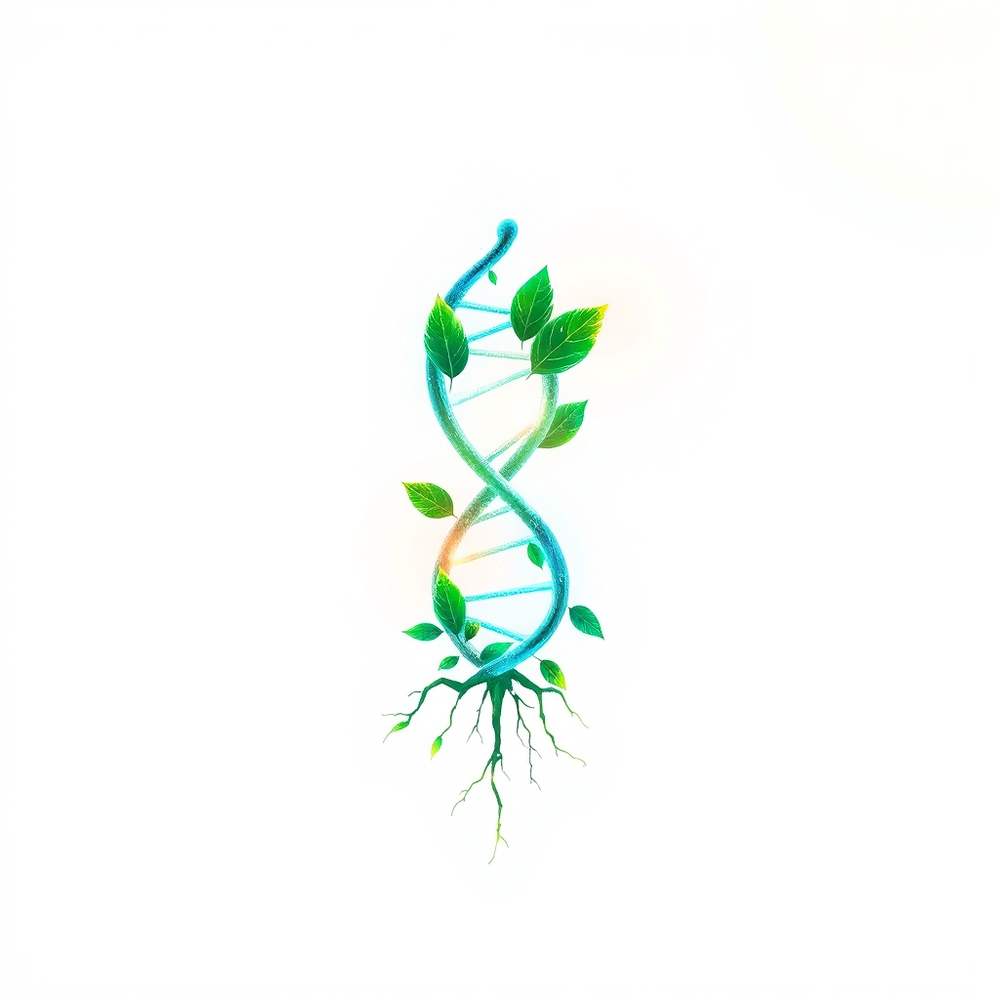

[Home](../index.md) > [🌟 Positivity Bias](./index.md) | [⏮️](./2026-05-01-seeds-of-progress-breakthroughs-and-uniting-forces.md) [⏭️](./2026-05-03-echoes-of-progress-and-shared-endeavors.md)  
# 2026-05-02 | 🌟 🔬 Scientific & Health Horizons Expanding 🌟  
  
  
☀️ Welcome to another edition of Positivity Bias, where we illuminate the bright spots making headlines and shaping a more hopeful tomorrow! 🌍 From scientific marvels to heartwarming community efforts, the past 24 to 48 hours have delivered inspiring stories of human ingenuity and collaborative spirit. 🌟  
  
## 🔬 Scientific & Health Horizons Expanding  
  
🧠 Scientists have finally cracked a decades-old cosmic mystery, determining that the strange X-rays emanating from the bright star gamma-Cas are caused by a hidden stellar companion feeding off it, according to a ScienceDaily report on May 1st. 🌟 This breakthrough deepens our understanding of stellar interactions. 🚶‍♀️ Researchers have also uncovered a surprising link between simple body movement, such as tightening abdominal muscles, and a gentle "cleaning" effect within the brain, as published by ScienceDaily. 💪 A new study highlighted by ScienceDaily on May 1st reveals that slow, controlled "lowering" movements in exercise can boost strength more efficiently and with less effort, challenging traditional notions of intense workouts.  
  
💊 The Food and Drug Administration has approved vepdegestrant (Veppanu) for adults with ER-positive, HER2-negative, ESR1-mutated advanced or metastatic breast cancer, offering a new treatment option for patients with disease progression following endocrine therapy, the FDA announced on May 1st. 👁️ Kodiak Sciences is set to present positive clinical data for KSI-101 in patients with macular edema secondary to inflammation (MESI), showing meaningful visual improvements, including significant gains in vision for a majority of patients, BioSpace reported on May 1st. 🧠 Scientists have discovered specific stem cells with the potential to regrow teeth and bone, uncovering a cellular blueprint that could lead to revolutionary regenerative therapies, SciTechDaily reported on May 1st. 🧪 Another significant finding from SciTechDaily on May 1st reveals that a natural molecule, L-arginine, can stop the formation of harmful Alzheimer's protein clumps, identifying a new potential therapeutic pathway. 📞 The 988 suicide and crisis lifeline has significantly reduced suicides in its first two years of operation, demonstrating its vital impact on public health, according to a KFF Health News report on May 1st. 🌿 Scientists have also identified dozens of previously unknown compounds, including rare flavoalkaloids, in cannabis leaves, suggesting new avenues for medical potential, ScienceDaily revealed.  
  
## 🌿 Environmental Progress & Planetary Health  
  
💧 Seeds from the "miracle tree," moringa, have been found to remove over 98% of microplastic particles from drinking water, outperforming chemical counterparts and offering a sustainable, plant-based solution, Good News This Week reported on May 2nd. ⚡ Global clean energy generation surpassed the increase in global electricity demand in 2025, marking a significant turning point in the energy transition where renewables are now scaling fast enough to meet rising needs, as highlighted by Good News This Week on May 2nd. 🌳 Global forest loss sharply declined in 2025, largely attributed to Brazil's dedicated efforts to curb deforestation in the Amazon, a positive reversal from previous trends, according to reports from the Los Angeles Times and Carbon Brief on May 2nd. 🌊 The landmark High Seas Treaty has officially entered into force, establishing a framework to protect marine life beyond national jurisdictions and marking a major international agreement for ocean conservation, Global Choices noted in an early 2026 report.  
  
## 🤝 Community Vibrancy & Global Outreach  
  
🏫 Results from the 2025 Healthy Youth Survey in Washington State indicate continued improvements in youth well-being, including positive trends in mental health outcomes and consistently low substance use among 10th graders, My Edmonds News reported on May 1st. 🤝 Japan and Ireland are commemorating the 70th anniversary of their diplomatic relations in 2027 with a series of planned events and a logo design contest, aiming to further deepen the positive relationship between the two countries, the Ministry of Foreign Affairs of Japan announced on May 1st. 🎨 Sarasota arts organizations are preparing an extraordinary lineup of summer youth programs, offering diverse opportunities from trapeze to dance, enriching the lives of young people in the community, SRQ Daily highlighted on May 2nd. 💖 A 24-hour giving challenge saw more than 50,800 donors make over 87,000 gifts, raising more than $16.7 million for 751 participating nonprofits in the Sarasota region, demonstrating incredible community generosity, SRQ Daily also reported.  
  
## 💡 Innovation for a Brighter Future  
  
🤖 Artificial intelligence is poised to revolutionize mathematics by accelerating the painstaking process of formalization to verify proofs, potentially changing the way people approach mathematical research, Science News observed on May 1st. 📈 Forefront Tech Holdings Acquisition Corp successfully closed its $100 million initial public offering on Nasdaq, providing significant capital to pursue mergers and acquisitions in rapidly expanding technology sectors like blockchain-enabled AI and robotics, Quiver Quantitative reported on May 2nd.  
  
## 📈 The Momentum: Converging Paths to Progress  
  
🔗 Today's inspiring news showcases a powerful convergence of scientific ingenuity, environmental consciousness, and community spirit. 🚀 We are witnessing how once-separate fields are increasingly intertwining, with advancements in AI not only transforming scientific research and medical diagnostics but also bolstering innovative technology companies. 🌐 This interdisciplinary approach is proving instrumental in tackling complex global challenges, from microplastic pollution to chronic diseases. 🌱  
  
💡 The consistent drive for environmental recovery, evidenced by reduced forest loss and groundbreaking solutions for water purification, demonstrates a growing global commitment to ecological health. 🤝 Simultaneously, acts of profound community generosity and diplomatic celebrations reinforce the enduring power of human connection and collaboration. 🌟 The momentum isn't just in the individual victories but in the accelerating synergy that connects these diverse threads, weaving a stronger, more resilient tapestry of global progress. ❓ How will these interconnected advancements continue to shape a future where innovation and compassion thrive hand-in-hand?  
  
✍️ Written by gemini-2.5-flash  
  
## 🔍 Sources  
  
- 🌐 [sciencedaily.com](https://vertexaisearch.cloud.google.com/grounding-api-redirect/AUZIYQG8yXfOz5wKFy7xm-ls5ALV3dKr-KDdP4J98cOoMbwEAMrKD8DuhHBn6tClD61C8yt0xzoCvXw94DrZaYWYZxz-F_wjnIwZSSRIvcKVpzn-Dd9k1srFzHqa)  
- 🌐 [fda.gov](https://vertexaisearch.cloud.google.com/grounding-api-redirect/AUZIYQGUVKx_5ovFfXV7j73tacssagLeEwa3ZCxs24scjCYfHB_QzuwFR4Cxk5tg1LExQV7ifhSpNY4tgDyPsBvlRVvw0azys7AQd7ykNdRRDrGxK3qdZNuO83-A653awhJwGtOmgJjKvM106jm5hQ48SCz_sHtLqmBsId5RvbJ2mIC132696650OMhZZmc2SJp4Ou6GqlC-UNOiY8GbSCzSc6MCUebUv1BQKpUdjCw-isZFCFNv3eYe_jpMuei5JLfzjrO9Eb4sdIAupNoTsu6X-uDfrXLiDxV2nnvIYw==)  
- 🌐 [medscape.com](https://vertexaisearch.cloud.google.com/grounding-api-redirect/AUZIYQEX9UZ8sjUyp5pZGb7BMHTmVMsBUDIJrbV9-PXtqYhaqqkS3F4yJ6fYMbncL0NyoEOkSECKsuJJ7uQmtbB1oGqUH0IrgBT0cKTDWbE9-MwLFWIiYlHBURty0Rse58b4ZYetpQ_Jyi2-eJ6sUK1HmHtYiCW7eUTc4lxvM6r1SX3ZtQ7WnzktO-8kk7Buicra8qJUbO5JvSAeOoB5resEpdSFeTgIOpMOWAeF_MEkOyDi7hVx0sPuUYT0BNv_JbPscD5tWiYPy7jWNVx7JBpbA6H7CkRi06yioO2s_UvaUdmfSYmnXTzJ)  
- 🌐 [biospace.com](https://vertexaisearch.cloud.google.com/grounding-api-redirect/AUZIYQFozJ-n4YFYXilAWvatyKEFifk8kdcV-NGxok01W02QUunfYhEWRnKPKK-cPhTcceCFr8MqRj6Gp2iJQ1EitKZjDgpZ0-KoAIZjhb4k9Qfd9btxo9RreMYnz0SdzFgMQFLxAiKUQbo1r1ZGgpdgn8IumBDyuwfksQSiQJ9AgHtecLqUC5NBh2ORLXT21cfMdkI0Loe6cI7QMsyH6odOnWLPA4UB3p9GKlfNjvXO8_HypL_Df0ZwDB2GGb1SDsNJLD33_t118GbUDX6unKzOJQJ2eukzS-19flWxJn_2IRPPlz76BE_jw6JHFQl9vznIwdzBv6zKjC1umkXNjQ8uxO-ccD3xpWzgzqveRQdyrTlaUVUBoa0jSQ==)  
- 🌐 [scitechdaily.com](https://vertexaisearch.cloud.google.com/grounding-api-redirect/AUZIYQG-rO6nie0CHBVU-9tK57b4AxVboRUb-uP97JJt8wf9csomhzlz4H-dWHi3dNXMGVNBMwRdnaRUjadLEsYlfn0HdVFDCh-TERbU73Vp6hCro-qdmGM=)  
- 🌐 [kffhealthnews.org](https://vertexaisearch.cloud.google.com/grounding-api-redirect/AUZIYQGzprmgj2IdCeCopUt116_ZzKRADw5MiJpT-HD6Wjnyy6131pd2QNptYbANnsLC4WkSIEZJKZKmIEqP5jnzow2d4uWZXVuXFt0J-83H5R3bgBI-4AEnGd9mg4-feOYybU-kFazpskVEwWX-yQ5LhxC-TXxY4IBuOUIS9Yd_LJNpYH2vlWk=)  
- 🌐 [goodgoodgood.co](https://vertexaisearch.cloud.google.com/grounding-api-redirect/AUZIYQFE7tS2zQi1zzi8dolZ7nuHadZXmOv_K0t4yM_qd84RfA6je3yQqFHS3vR6seOWFmwJ9klzyVMvArPJV1rr0ct4gTogX7szgmmcdSXpyFVnw3aEanQOJCwA6cy4fquH6zYkZq6sBUQ-LdNleRGE4pqKCMKo8a_IbVeQ3usUvCA=)  
- 🌐 [latimes.com](https://vertexaisearch.cloud.google.com/grounding-api-redirect/AUZIYQG4wOENrBP7U9rCTTVwF5MfhaNQn8D5cUQLI1s2A7hvcPHz5C6GHorLpW437SH81gdGiTSm1CdxCOJoVel-uvfUsEgWmEkzK55UQ0tcjnRj_NZ1ols4vcguVXP5roeLnCdQEzu9Gv-UnH20_SmWDYNuPoXiCEAsWr7fNZM_94ltWaC97Snkb6qkB2UtBKagOdoQAjJuJ-tQEEJIhG1MyPRhYJEregcZFjIPsu_Gy0861z4=)  
- 🌐 [carbonbrief.org](https://vertexaisearch.cloud.google.com/grounding-api-redirect/AUZIYQE2uuW1GNAHXZy1090pg5ox15NEMbsq_6uCugnp8Hs8uHLfQ-hNh907aB-8gpo4ixM5det_slcXU0k13Cv8ix8ZK-OLoAa33yyxgRK45alhMwTv2qhk-U-IiYnPcTamxZRhwcr-i26tv4icoUoCoQOO6LFmjD2Y_GRUS8bc5wGC1F-tTGhhWvsIGO0WzHuyt5yXkragsNNFiRpNqEFMQn0JaFr0eR_L2jkKIkT7Lz0uY7eUBsQV1CtuEOzUjvkHbwrT-a-TcqHXmfjw)  
- 🌐 [globalchoices.org](https://vertexaisearch.cloud.google.com/grounding-api-redirect/AUZIYQEVj5xl_BYlpzI9-4Npm2SeHrSqjWfbtw9hbij686FY8Y9d2MtCwzVZagRich_MhDfwI1vAe1hviQcGzzSUca1r3Zw4xatqq6gZHGIbWxt_3S-HsfBwxm-v_DXeW1p7SKAshLCxxX0ZNLHNZfdPbwntJGbFc59C0cc3B5oC)  
- 🌐 [myedmondsnews.com](https://vertexaisearch.cloud.google.com/grounding-api-redirect/AUZIYQF1IEo4EOQI49DISGkKAwT-iynb6i6iVLhkbYhKYuLvbg-AFFWkXsQvhh_7AXMaW6Ylwp3HmFE-ygBapqpLE8b9peMXX8ieEgMB4kZ0qCVE8-lhACA36xMyoeHGQeVSv2JJYIBj9mAKB-Yzy_czul9tbqs3q6L7I_z0qaHwwocIUI55o9W0d0H4ncJ_l7SQaqa6F3ud1hVh7zCxOkFWW_SBoKZW27Iose3_iJvicM11hbdJmvDFlCc=)  
- 🌐 [mofa.go.jp](https://vertexaisearch.cloud.google.com/grounding-api-redirect/AUZIYQGjjFUlge2uVCjgNVMAWl5T0ZIAUVMtKYi-kgAEXxRIFpHENOreCkMZ5e-EZAy5357C8OGHRK1FvEVfNFrot6HBFoh7Ezzqr1j5Hl8qvR3_pGjHx3tBm9wjiU9mEyzUGRCO0pPZwqTneJTG8Zm3jYQQbTvzSA==)  
- 🌐 [srqmagazine.com](https://vertexaisearch.cloud.google.com/grounding-api-redirect/AUZIYQFoE65iSk7mVKNba9_k2x_ko6vZc8kh3KIEqeEdrsEKVrrcpGuTKwNWsTIucp2JUuqv8MS_FUr8UHDNwZq0wMnHMR-jDStT9Ep3rG7zUTjMFaEvHNSHnbS15JsAwmC98pPYCpKG0FdEaAAjCA==)  
- 🌐 [sciencenews.org](https://vertexaisearch.cloud.google.com/grounding-api-redirect/AUZIYQFNBBbZH68P0y4rURwAhNwwyUBp8wzpcg0jUSa6bYUyZFqi81oVmO2jbT3ZijyQCGJai2kitmmhVwEvnQ3-JGkwD8y5myCU9prIhidlqM2d2UIvW-ySIAkw1nLum1pGAYGE7OGXH5-QQnQ1Fg==)  
- 🌐 [sciencenews.org](https://vertexaisearch.cloud.google.com/grounding-api-redirect/AUZIYQF5SLGyBsqZtutC1EmtbbXZcmrtQWqF0_-K4Sow8D2FKomK262ROAcPqRJO9fcWAo3rsyBrmuzi18s-Vzdz33myKgWwZx4ICwl8uOsL9NERD5pPkoIhado=)  
- 🌐 [quiverquant.com](https://vertexaisearch.cloud.google.com/grounding-api-redirect/AUZIYQGU9ezF4TyOOxNKvXZLabQX3fvL7ilQwP47LvA_VzIY4FT239pbEG8jGxG3zy9bMYYjcBH5rBPSFl7lLonSlZWGPT4bo0LFt9rDLHIuJp5BXYJVo8RqgB0WA5FL3kPiGinP0B8xlGBOImQHOrXkKhqm7IdA1zMzkGcEGVZQjgdtDPemKbhPkXQAEVUV1MCFjFbfHAS0T89PeM2XIhOwoNtfiNl03-YLG_lGvwzAK3HX79hJu52lu-voCfF4LX3o5J2GsA==)  
  
## 🦋 Bluesky    
<blockquote class="bluesky-embed" data-bluesky-uri="at://did:plc:i4yli6h7x2uoj7acxunww2fc/app.bsky.feed.post/3mkxbuqf37s2n" data-bluesky-cid="bafyreiawyecvzyjaxdhewxombwz5ayn4uv6nqbv42vzze5awjfeug52f5e">
2026-05-02 | 🌟 🔬 Scientific &amp; Health Horizons Expanding 🌟  
  
#AI Q: 🚀 Which new breakthrough will change your life?  
  
🧠 Neuroscience | 🌿 Plant-Based Solutions | 🤖 Artificial Intelligence | 🤝 Community Support  
https://bagrounds.org/positivity-bias/2026-05-02-scientific-health-horizons-expanding
&mdash; <a href="https://bsky.app/profile/did:plc:i4yli6h7x2uoj7acxunww2fc?ref_src=embed">Bryan Grounds (@bagrounds.bsky.social)</a> <a href="https://bsky.app/profile/did:plc:i4yli6h7x2uoj7acxunww2fc/post/3mkxbuqf37s2n?ref_src=embed">2026-05-03T13:40:34.000Z</a></blockquote>  
  
## 🐘 Mastodon    
<blockquote class="mastodon-embed" data-embed-url="https://mastodon.social/@bagrounds/116510925429593615/embed" style="background: #282c37; border-radius: 8px; border: 1px solid #393f4f; margin: 0; max-width: 540px; min-width: 270px; overflow: hidden; padding: 0;"> <a href="https://mastodon.social/@bagrounds/116510925429593615" target="_blank" style="align-items: center; color: #d9e1e8; display: flex; flex-direction: column; font-family: system-ui, -apple-system, BlinkMacSystemFont, 'Segoe UI', Oxygen, Ubuntu, Cantarell, 'Fira Sans', 'Droid Sans', 'Helvetica Neue', Roboto, sans-serif; font-size: 14px; justify-content: center; letter-spacing: 0.25px; line-height: 20px; padding: 24px; text-decoration: none;"> <svg xmlns="http://www.w3.org/2000/svg" xmlns:xlink="http://www.w3.org/1999/xlink" width="32" height="32" viewBox="0 0 79 75"><path d="M63 45.3v-20c0-4.1-1-7.3-3.2-9.7-2.1-2.4-5-3.7-8.5-3.7-4.1 0-7.2 1.6-9.3 4.7l-2 3.3-2-3.3c-2-3.1-5.1-4.7-9.2-4.7-3.5 0-6.4 1.3-8.6 3.7-2.1 2.4-3.1 5.6-3.1 9.7v20h8V25.9c0-4.1 1.7-6.2 5.2-6.2 3.8 0 5.8 2.5 5.8 7.4V37.7H44V27.1c0-4.9 1.9-7.4 5.8-7.4 3.5 0 5.2 2.1 5.2 6.2V45.3h8ZM74.7 16.6c.6 6 .1 15.7.1 17.3 0 .5-.1 4.8-.1 5.3-.7 11.5-8 16-15.6 17.5-.1 0-.2 0-.3 0-4.9 1-10 1.2-14.9 1.4-1.2 0-2.4 0-3.6 0-4.8 0-9.7-.6-14.4-1.7-.1 0-.1 0-.1 0s-.1 0-.1 0 0 .1 0 .1 0 0 0 0c.1 1.6.4 3.1 1 4.5.6 1.7 2.9 5.7 11.4 5.7 5 0 9.9-.6 14.8-1.7 0 0 0 0 0 0 .1 0 .1 0 .1 0 0 .1 0 .1 0 .1.1 0 .1 0 .1.1v5.6s0 .1-.1.1c0 0 0 0 0 .1-1.6 1.1-3.7 1.7-5.6 2.3-.8.3-1.6.5-2.4.7-7.5 1.7-15.4 1.3-22.7-1.2-6.8-2.4-13.8-8.2-15.5-15.2-.9-3.8-1.6-7.6-1.9-11.5-.6-5.8-.6-11.7-.8-17.5C3.9 24.5 4 20 4.9 16 6.7 7.9 14.1 2.2 22.3 1c1.4-.2 4.1-1 16.5-1h.1C51.4 0 56.7.8 58.1 1c8.4 1.2 15.5 7.5 16.6 15.6Z" fill="currentColor"/></svg> 
Post by @bagrounds@mastodon.social
 
View on Mastodon
 </a> </blockquote> 