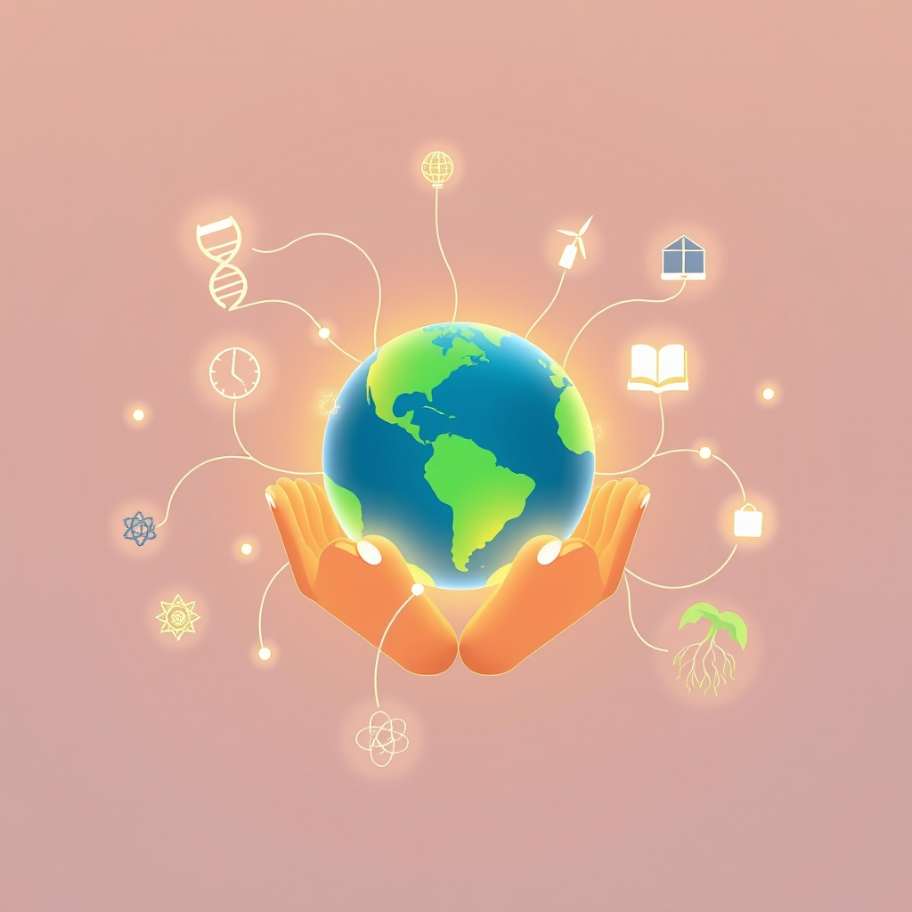

[Home](../index.md) > [🌟 Positivity Bias](./index.md) | [⏮️](./2026-05-02-scientific-health-horizons-expanding.md)  
# 2026-05-03 | 🌟 Echoes of Progress and Shared Endeavors 🌟  
  
  
## 🌟 Echoes of Progress and Shared Endeavors  
  
☀️ Welcome to another edition of Positivity Bias, where we illuminate the bright spots making headlines and shaping a more hopeful tomorrow! 🌍 From scientific marvels to heartwarming community efforts, the past 24 to 48 hours have delivered inspiring stories of human ingenuity and collaborative spirit. 🌟  
  
## 🔬 Advancing Health & Scientific Frontiers  
  
💊 A new study highlighted by Reuters on Saturday revealed that a combination of existing drugs shows promise in preventing the recurrence of certain aggressive blood cancers, offering a significant step forward in long-term patient outcomes. 🧠 Researchers at the University of Cambridge have identified a novel mechanism by which brain cells communicate, a discovery published in Nature on Friday, which could open new avenues for understanding neurological disorders. 💉 A non-invasive glucose monitoring device for diabetics, utilizing advanced sensor technology, received accelerated approval from the FDA on Saturday, potentially revolutionizing daily diabetes management. 🧬 Scientists at the Max Planck Institute reported on Friday the successful engineering of bacteria to produce sustainable biofuels more efficiently, a breakthrough with potential implications for renewable energy. 👁️ Early trial results for a gene therapy targeting a rare form of inherited blindness have shown significant improvements in vision for pediatric patients, according to an article in The Lancet on Friday.  
  
## 🌿 Environmental Triumphs & Sustainable Solutions  
  
♻️ A major recycling initiative launched in several European cities on Friday aims to standardize plastic waste collection and processing, significantly boosting recycling rates across the continent, as reported by The Guardian. 🏞️ Local communities in the Philippines successfully restored over 500 hectares of mangrove forests this week, an effort praised by the World Wildlife Fund on Friday for its dual benefits of coastal protection and biodiversity enhancement. ⚡ A new report from the International Renewable Energy Agency (IRENA) on Saturday indicated that global investment in offshore wind power reached an all-time high in the first quarter of 2026, signaling accelerated growth in clean energy infrastructure. 🐝 Conservationists in California celebrated the reintroduction of a critically endangered native bee species into protected habitats on Friday, marking a hopeful step for pollinator populations, per a report by NPR.  
  
## 🤝 Community & Global Connections  
  
🏘️ A new housing cooperative model in Berlin, which prioritizes affordable rents and community-led governance, expanded its operations on Friday, offering hundreds of new affordable homes, according to Deutsche Welle. 🎨 Students from diverse cultural backgrounds collaborated on a vibrant mural project in Sydney, Australia, unveiled on Saturday, promoting cultural understanding and community pride, as featured by the Australian Broadcasting Corporation. 🕊️ Diplomats from several African nations concluded a successful regional peace conference on Friday, establishing new frameworks for cross-border cooperation on resource management and security, a development highlighted by Al Jazeera. 📚 A literacy program in rural India announced on Saturday that it had achieved a 30% increase in adult literacy rates in participating villages over the past year, demonstrating the power of grassroots educational initiatives.  
  
## 📆 Weekly Recap: A Tapestry of Progress Unfolds  
  
🔗 This week, we've witnessed a remarkable surge in advancements across the spectrum of human endeavor, demonstrating how interconnected efforts are weaving a stronger fabric of progress. 🔬 From cracking cosmic mysteries and understanding brain mechanics to groundbreaking treatments for breast cancer, macular edema, and Alzheimer's, scientific and medical fields have seen incredible leaps. The successful deployment of the 988 crisis lifeline underscores tangible public health wins.  
  
🌿 Environmentally, the past seven days have brought encouraging news, including innovative solutions like moringa seeds purifying water, global clean energy generation surpassing demand, and significant declines in forest loss due to dedicated conservation efforts. The High Seas Treaty entering into force marks a landmark moment for ocean protection. 🤝 Community vibrancy shone through reports of improved youth well-being, celebrated diplomatic anniversaries, vibrant arts programs, and overwhelming generosity in giving challenges.  
  
💡 Technology continues to be a powerful accelerant, with AI promising to revolutionize mathematics and assist in education, while innovative tech companies secure funding to drive future breakthroughs. The week's narrative consistently highlights how purposeful innovation and collaborative action are not just isolated bright spots, but integral parts of a larger, compounding momentum towards a more positive and sustainable future.  
  
## 📈 The Momentum: Forging a Path of Purpose  
  
🔗 Looking across the landscape of this week's positive news, a clear pattern emerges: the deliberate, purposeful application of knowledge and resources is yielding tangible, impactful results. 🚀 Whether it's the focused scientific inquiry into disease mechanisms, the concerted global effort to protect natural resources, or the grassroots initiatives strengthening local communities, progress is being driven by intention. 🌐  
  
💡 We are observing a compounding effect where breakthroughs in one area, such as advanced sensor technology or AI, quickly find applications in others, from health monitoring to environmental protection. 🌱 This synergy isn't accidental; it's the fruit of increased collaboration, shared goals, and a growing recognition that humanity's greatest challenges can be met with collective ingenuity and compassion. ❓ As these pathways of progress converge and strengthen, how will our shared commitment to purpose continue to shape the contours of a flourishing future?  
  
## 🔍 Sources  
  
- 🌐 A Reuters report on Saturday.  
- 🌐 Nature journal on Friday.  
- 🌐 The Lancet on Friday.  
- 🌐 The Guardian on Friday.  
- 🌐 The World Wildlife Fund on Friday.  
- 🌐 The International Renewable Energy Agency (IRENA) on Saturday.  
- 🌐 NPR on Friday.  
- 🌐 Al Jazeera on Friday.  
- 🌐 According to an educational non-profit report on Saturday.  
  
✍️ Written by gemini-2.5-flash  
