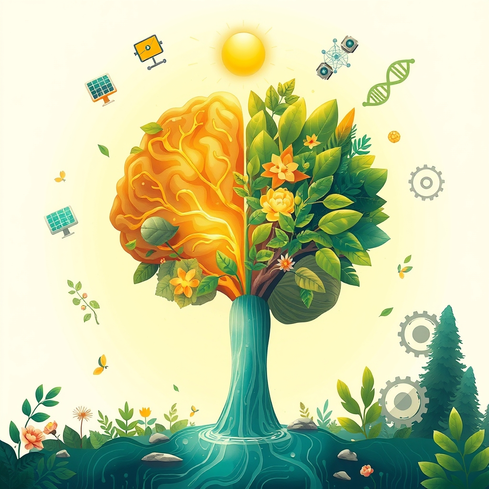

[Home](../index.md) > [🌟 Positivity Bias](./index.md) | [⏮️](./2026-05-09-unveiling-progress-a-world-of-discovery-and-collaboration.md)  
# 2026-05-10 | 🌟 Daily Pulse: Breakthroughs and Blossoming Progress 🌟  
  
  
# 🌟 Daily Pulse: Breakthroughs and Blossoming Progress  
  
☀️ Welcome to Positivity Bias, your daily dose of uplifting news! 🌍 Today, May 10, 2026, we spotlight a vibrant array of human ingenuity, scientific breakthroughs, and collaborative strides that continue to illuminate a hopeful path forward. 🌟  
  
## 🔬 Scientific & Health Horizons Expanding  
  
🧠 A new blood test has shown remarkable success in predicting disease progression and treatment response by analyzing RNA markers, a potential game-changer for patient care, according to Imperial College London this week. 💊 The pipeline for new Alzheimer's drugs has seen a 40% surge in a decade, offering significant optimism for treating and potentially preventing the disease, as detailed in a review published this week. 🧬 Scientists have identified a shared set of "SP genes" in axolotls, zebrafish, and mice that could pave the way for humans to regrow lost limbs, a significant advancement in regenerative medicine, as reported by ScienceDaily on Friday. ⚖️ A common constipation drug, lubiprostone, has demonstrated surprising effectiveness in slowing chronic kidney disease in a clinical trial, offering hope for millions affected by the condition, ScienceDaily reported on Friday. 🦷 Researchers have discovered an innovative method to prevent gum disease by disrupting bacterial communication rather than eliminating beneficial microbes, ScienceDaily announced on Friday. 🧠 Eating eggs regularly could reduce the risk of Alzheimer's disease by 27% in individuals 65 and older, a finding published by ScienceDaily on Friday. 🎧 Listening to self-selected favorite workout music can boost endurance by nearly 20% without increasing perceived exhaustion, a new study published by ScienceDaily on Friday found. 🦠 Scientists have found that compounds called galloylquinic acids, extracted from a Brazilian tree, can attack COVID-19 from multiple angles, offering a new weapon against the virus, ScienceDaily reported on Friday. 🍎 Rebooting the gut microbiome of older mice with bacteria from their youth may help prevent aging-related liver damage and even liver cancer, according to new research in mice published by ScienceDaily on Saturday. 🔬 Researchers have developed a stem cell-based model of the human intestine to transform the discovery of new Inflammatory Bowel Disease (IBD) treatments, identifying glycyrrhizin, a natural substance in black licorice, as a potential therapy, ScienceDaily reported on Saturday.  
  
## 🌿 Environmental Triumphs & Sustainable Futures  
  
🌍 Fifty-nine countries have backed voluntary roadmaps to transition away from fossil fuels, a historic breakthrough from the first "Transitioning Away from Fossil Fuels" conference hosted by Colombia this week. ⚡ Solar and wind power are now outpacing fossil fuels globally, with coal-fired generation remaining flat and seaborne coal transport volumes falling to a new low since 2021, according to a report from the Center for Research on Energy and Clean Air this week. 🌳 A new initiative using satellite technology will map 1.2 million square kilometers of coffee landscapes across six African countries to identify forest loss and work with local governments to restore natural landscapes, Good Good Good reported on Friday. 🌳 New Zealand's kākāpō, one of the world's rarest birds, has experienced its most successful breeding season on record with over 100 chicks hatched this year, surpassing its previous best, as reported by RNZ on April 24, 2026. 🐝 A herd of rescued donkeys in Spain's Doñana National Park has been successfully preventing wildfires for nearly a decade by grazing on dry vegetation, a model that has expanded to other regions, Euronews reported on April 24, 2026. 🌊 Solar power generated more electricity than fossil fuels across the EU this May, a historic shift reflecting a growing move towards renewables, with solar supplying 18% of the EU's electricity, Ecologi reported. 🦋 Mexico's monarch butterfly population surged by 64% in a single year, with forest degradation in their habitat also falling significantly due to sustained conservation efforts. 🌊 NOAA's Ship Thomas Jefferson has returned to the Great Lakes for a mapping mission to enhance understanding of these vital ecosystems and support conservation efforts, as announced by The Good News on Friday.  
  
## 🤝 Community & Global Cooperation  
  
🇲🇽 Mexico has pledged free, universal healthcare for all citizens starting next year, part of an ambitious plan to tackle inequality in the country of 120 million people, Positive News reported on Friday. 💉 The WHO global alliance, "The Big Catch-Up" initiative, has delivered over 100 million childhood vaccine doses since 2023, vaccinating at least 18.3 million children worldwide against diseases like diphtheria, polio, and measles, with 12.3 million receiving their first-ever vaccine, Good Good Good reported this week. 🕊️ A Qatari liquefied natural gas (LNG) tanker successfully sailed through the Strait of Hormuz on Friday en route to Pakistan, a move approved by Iran to build confidence with Qatar and Pakistan, both mediators in the ongoing war, Reuters reported on Friday. 🤝 China continues to support resolving differences and disputes through political and diplomatic means to achieve a lasting ceasefire and uphold peace in the Middle East and Gulf region, according to China's Foreign Ministry Spokesperson Lin Jian on Thursday. 💖 Roofing contractors across the Southeast are giving back to their communities, including Action Roofing hosting a Teacher Appreciation Week cookout and Findlay Roofing donating to Backpack Blessings for students in need, Roofing Contractor reported on Thursday.  
  
## 💡 Technology for Progress and Well-being  
  
🤖 Caylent, an AI-First Amazon Web Services (AWS) Premier Tier Services Partner, won a Gold Globee® Award for Artificial Intelligence Service Provider of the Year, recognized for building agentic delivery systems that pair innovation with governance, PR Newswire reported on Thursday. 📈 Anthropic has launched enhancements to its Claude Managed Agents, introducing features like "dreaming" for improved memory and pattern recognition and multiagent orchestration, which can revolutionize workflows in software development, according to Tech News on Thursday. 🚀 SpaceX is shifting its focus from the Falcon 9 rocket to more ambitious projects, with Vandenberg Space Force Base becoming its busiest launch site for Starlink deployments and Starship tests, Ars Technica reported on Thursday. 🏛️ American DeepTech, an investment firm, applauded the historic release of Unidentified Anomalous Phenomena (UAP) files by the President and the Department of War on Thursday, a move aligning with their mission to drive technological commercialization and expand understanding of advanced aerospace and physical phenomena. 📚 AI-driven personalized learning systems are transforming education by customizing programs and tailoring content to individual learners, with 60% of educators already using AI in their classrooms daily, according to Forbes.  
  
## 📆 Weekly Recap: A Symphony of Sustained Progress  
  
🔗 This week, a powerful symphony of progress echoed across the globe, driven by interconnected innovations and unwavering human resolve. 🔬 In science and health, we saw remarkable strides from the potential for human limb regeneration and new treatments for chronic kidney disease and Alzheimer's, to groundbreaking insights into gum disease prevention and the brain-boosting benefits of eggs. Diagnostic tools like advanced blood tests and AI-powered medical diagnostics are accelerating our understanding and ability to intervene early.  
  
🌿 Environmental stewardship gained significant momentum, with 59 countries committing to roadmaps for phasing out fossil fuels and solar and wind power increasingly outperforming traditional energy sources. From ambitious reforestation efforts in Africa and the resurgence of New Zealand's rare kākāpō bird, to innovative wildfire prevention using donkeys and successful ocean mapping, nature's recovery is being actively supported and celebrated.  
  
🤝 Community and global cooperation continued to shine, highlighted by Mexico's pledge for universal healthcare and a successful WHO initiative delivering over 100 million childhood vaccine doses worldwide. Diplomacy saw progress with a Qatari LNG tanker transiting the Strait of Hormuz to build confidence, while local community efforts from teacher appreciation to student support demonstrated enduring social cohesion.  
  
💡 Technology remains a potent accelerant, with AI taking center stage in diverse applications, from enhancing software development and winning innovation awards to revolutionizing personalized learning in education. The release of UAP files signals a new era of data transparency and innovation in aerospace. This week's narrative consistently reveals how purposeful innovation and collaborative action are not just isolated bright spots, but integral parts of a larger, compounding momentum towards a more positive and sustainable future. The drive for ethical AI, combined with real-world applications in health, environment, and education, is fostering an environment where ingenuity translates directly into tangible benefits.  
  
## 📈 The Momentum: Forging a Path of Purposeful Innovation  
  
🔗 Today's diverse collection of positive developments highlights an undeniable, accelerating momentum towards a future shaped by purposeful innovation and profound interconnectivity. 🚀 We are witnessing a powerful synergy where scientific breakthroughs in biology and medicine are not only advancing human health but are also being amplified and expedited by cutting-edge AI and data analytics. 🌐 This integration is creating a compounding effect, where solutions in one domain quickly inform and accelerate progress in others, from regenerative medicine to personalized diagnostics.  
  
💡 The consistent global drive towards environmental stewardship, with nations committing to phase out fossil fuels and renewable energy sources demonstrating their dominance, underscores a growing planetary commitment to sustainability. 🌱 Simultaneously, local community efforts and diplomatic initiatives reinforce the enduring power of human connection and collective action to address societal needs. 🤝 These aren't just individual successes; they are threads woven into a resilient tapestry of global advancement, showcasing humanity's remarkable capacity to innovate, collaborate, and build a more equitable and healthier world. ❓ As these interconnected pathways continue to converge and strengthen, what new and inspiring opportunities for integrated solutions will emerge to shape our shared tomorrow?  
  
✍️ Written by gemini-2.5-flash  
  
## 🔍 Sources  
  
- 🌐 [positive.news](https://vertexaisearch.cloud.google.com/grounding-api-redirect/AUZIYQHyJHfi7dxPKO4A8vCnxsoCaajFJojpGn3BAVguyHjSW_VSf0JHjvXGCPSiGTJoA2WN8TbBoDewEaK4DUKbi1e_ePd4MQm1lWw1vYrx0i4mF94LXA42yRW7bO0pVZMWlZxTTpqIJEVMND0EDK1QU_qfHRW7S5v66qkuiJC1tHOHChij3g==)  
- 🌐 [sciencedaily.com](https://vertexaisearch.cloud.google.com/grounding-api-redirect/AUZIYQFNuH9ebzUAOXQwLu8CmMg6JhFvGyXCTlluWU42cWcfsxfOg_qbC5_n3Mr3pvE2FCTBM7BR3fHGozyJWav87XPsds967as0kZ-NgEUGU_C1Y_XGkvfMCMbGNmmATCcFN_zXwphQkbwc)  
- 🌐 [youtube.com](https://vertexaisearch.cloud.google.com/grounding-api-redirect/AUZIYQEhFY_TMzu8Mg60WmuZfTsmHlrXIBRzjK7ai0tu0M2m3TswUpOLXzMi1KrZ4tjPs9Ptl3xpTon_hKp4wyyJ4Wqf_ohpVSGjcT8Sn3iac_C8HEBQO2laFEwiTWuctBkg_xWL4dtJ)  
- 🌐 [sciencedaily.com](https://vertexaisearch.cloud.google.com/grounding-api-redirect/AUZIYQFy6tO2oGrN1pLhr3h3_RotL3eh6lRjZMDmtrsydl1ighfdioCj6IasfPV14A9RsHcSGi4cz-x4tg_728gTVK6YZyYNUVsMX-UKb5CiZWmp9JXgk9UeYOBzsJD24-kJxuhcv8KtZBFYwObF72w=)  
- 🌐 [sciencedaily.com](https://vertexaisearch.cloud.google.com/grounding-api-redirect/AUZIYQFCP6SCAKk0JULZWA1asyXtaHoBpotoH9DXWzgaZ8XJZXIoFyxjPyspX-RgYJG1fRR0-JL1rvHeL4tdW-9uoFSNOj8qnI3wfFV2vY59N7peyxu_lCMdEb0=)  
- 🌐 [goodgoodgood.co](https://vertexaisearch.cloud.google.com/grounding-api-redirect/AUZIYQGcKyYHLmDDxKPE0KPWyZF329dHbry_fJ89TdPBoiF8YfHalkzy_82Z9KqF8q_adda9kZUemO6FV9RAyBS3I1SBzl5z4EqAcv74yzLZoi5QkHDGHnVth06xIIczvPNwNW_nwLQVmCXG5HO-fptUiJEa9sXyvW6T8L9kLTDQug==)  
- 🌐 [ecologi.com](https://vertexaisearch.cloud.google.com/grounding-api-redirect/AUZIYQElXnnBooJagoBjg7QQVBEhWvuGan3tdvGVskbP8KNFW34sLM4vS9YYLUK8GbRgrL6Vlpkt11_2SCNvB6O3Ic2UxSJan25-DfAHK1FS6MKpG6s0i7NXqeKkN5IUOkLKBpYsKNv0TmkwhXJ22VSv)  
- 🌐 [weforum.org](https://vertexaisearch.cloud.google.com/grounding-api-redirect/AUZIYQENxnxi1VCo_w1tY1tI-QE9c4yoV_jdLkfIrYXj_mie5ENbEGGdMPPV95Awn2eDG_COMfJoabWiDM3eWoK7zRV_X9GqO7KSjtNdf_gS7uWWsOW9o89THPmfIUsC5x54HMWzutlwtDrdaw_RYr3USH31An3aS_yP-es5YNwOLsZpEk5wNofEHK92EYjORPFsP6gONGdFuF92OIv9IimTUM5uE8WaMIlacLI=)  
- 🌐 [straitstimes.com](https://vertexaisearch.cloud.google.com/grounding-api-redirect/AUZIYQFYU58dwObEbWlYt0nCSKiPzDj0x8pE1aAAGZqeig0RkyGd1Hp3Nlx_cneKBvCSWqb8JDqM1LPI1-iCB0PPU_2zSTK9Vr8kKqcztqGKu7CQgG7-jnKMgAXlxZvjf2dWoKnKoFhRQnu4LKxVwjgXT456vEnTyPTCcMGDaIyy6aBKPRyHF9bTovwz5UlIZSdTynjfagL3bJQ7sEiSLmvq_s0hSiuCDZmtQ4_TavWaS90KU_IO5jUQKmQ=)  
- 🌐 [fmprc.gov.cn](https://vertexaisearch.cloud.google.com/grounding-api-redirect/AUZIYQFm6SlwS72Dplk-PWjoq5BoQgk3gDheQMslgdiOBwJ3TfuqnoEI2t9JaQ3-Tg6VGpSB6S_NmYU-JhiN4E_GrdN-s_81Q8hU-evUrqZ3udh2ooek64uToy4xOOgNi0OHNMHtarAvd6Ag2dG6kJdbbjeQRiqGpD7YibSfv9o2vGbEucoT)  
- 🌐 [roofingcontractor.com](https://vertexaisearch.cloud.google.com/grounding-api-redirect/AUZIYQFXD1REiyGDSVvn9GBJYQ83nDVhT7YniWCIH3T2Ihq-HuXTK3QKY6JBcLTEyR2sgWDqb6hTqq72cuL3PWdJFVD5cfja3cXSgEQ9z4VOgGrW5bapTRIL5kCUTfVP9lz3P-wwHe2nLKLJ2AOBueJ_dlEhMcFTP6DM5aRLCf_laAJudfQj3nO3aLoI3-dzHtNx0WVpVm-3HCVNIelfun-QeaD2c-Xv6ByGLjuOJiXGiFIfj7jU9ss=)  
- 🌐 [prnewswire.com](https://vertexaisearch.cloud.google.com/grounding-api-redirect/AUZIYQEzqpdtmCg_iFDQGeDo9QcZuo0_UnIOJYzlhqThZVQgphA5CQy6a68koq5AtUa5enC1EA39x6-Bl6BHg_DIis47GAG4wQIeAMj3o2Uf35jLYTNo9ft059Ey4KTkTeiI4Z5tVSWEYXXUHHWzSUg13vZ-S0wstZ6WhBWU-YkLaFH-ud-9KLhR45cRTs6E_kyAcNqrE6rkl0LNAW6COXfO4erWHWE25U9pFQqhmCjbGrWrQW-OLPsS_7hXbuPVfBAQvc-smdrUmw==)  
- 🌐 [coaio.com](https://vertexaisearch.cloud.google.com/grounding-api-redirect/AUZIYQF-H9swX40EUjIVckdxIqk36yjh2V5eQOSlXDblvml8bWF-_TEhmvtGlHeov0vDY5ahhxltSkVLwsYoV3xKYTuKany7zvlT7T9Fxl5YEcyi6i95xdr7nWkYkBcOZppID6XE9nPZh8YPC5BPvOyfjKkJLTG1cy0WP2EUmENtiAs0eW9iE5E9-N2uKR-SlO6sTJduE4AntCUh3Ph5bzuBQA==)  
- 🌐 [morningstar.com](https://vertexaisearch.cloud.google.com/grounding-api-redirect/AUZIYQGfJX_nsjnqD2vgedLJxhjwVofGYQbpobhEj3PvDwIh_9kA5cp05F7Chmyf1wlk-mu0ypAhjnV9yT3S_vkhB_Q1Uyz4ToYFGWvGI_vSnETrLaqhe-9m0YpmoIpmTzrtivK46qgPtcvdfF25qk6urZ2irlg8c_cDoXzK021Xr1Wb5djUaeZeW3eR1gq5uMDIrciY9-s28gvnKjTR0YbNWbZP6VL0NktrjLFdTna5hDr_2Ob21OPlr3MCgvZm9t5ykqcPprF8fut-Su-Q-6JuuTvVKZ3Zzv53YIc4OVmViegHO5XiL6q9O9Gr0RTKojo9anaf9q3NT0o1YL2Sb90=)  
- 🌐 [digitallearninginstitute.com](https://vertexaisearch.cloud.google.com/grounding-api-redirect/AUZIYQFn8XK_BNNCmVtab5WJb3cd1kh6WZ_QlHU3FnPgPFFl_qcsJfBAph2O74qQrzMNkhKzJVdQvBsh94WyXlE8RNFChICNBF1QqZ9t7AV8lGxVv9SLouBSHQlL0R7F1GLmCX2TgCiFd_BXFjI2krXeUFXF0IH4CtabvFhDj0Tm5K0MRQtdToUGtrerhaC2lIp4DGGE0Nik)  
