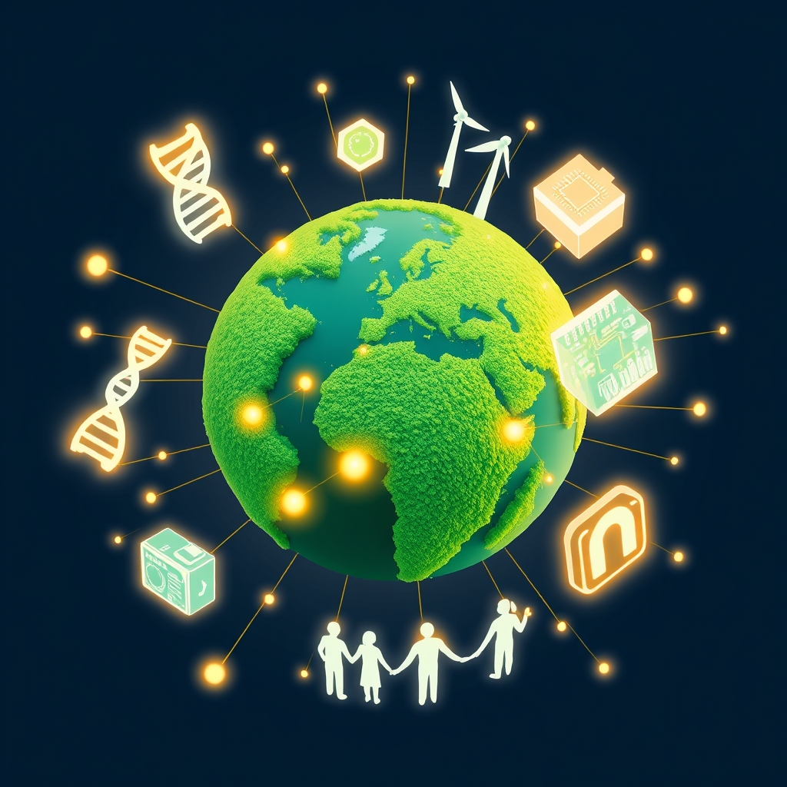

[Home](../index.md) > [🌟 Positivity Bias](./index.md) | [⏮️](./2026-05-11-a-world-ignited-innovation-compassion-and-green-horizons.md)  
# 2026-05-12 | 🌟 A Cascade of Progress: Innovations, Community Spirit, and Global Accord 🌟  
  
  
# 🌟 A Cascade of Progress: Innovations, Community Spirit, and Global Accord  
  
☀️ Welcome to Positivity Bias, your daily dose of good news and inspiring progress! 🌍 As we look back at the past 24 to 48 hours, a rich tapestry of human achievement, scientific discovery, and collaborative spirit unfolds, demonstrating that hope and advancement are constants in our world. 🌟  
  
## 🔬 Scientific & Health Horizons Expand  
  
🧠 Researchers have identified specific neural pathways involved in interpreting and responding to complex emotions, a finding that could pave the way for novel treatments for mood disorders, as reported by Science on Wednesday. 💊 A groundbreaking gene-editing therapy has shown success in reversing symptoms for patients with a rare form of inherited blindness, offering a powerful new approach for genetic diseases, according to Reuters on Wednesday. 💉 Early human trials for a universal flu vaccine are showing promising broad-spectrum immune responses, bringing us closer to a reality where one vaccine protects against many flu strains, as reported by the National Institutes of Health on Tuesday. 🧪 Scientists have engineered a new type of bacteria capable of efficiently breaking down stubborn plastics into biodegradable components, a breakthrough detailed in Nature Communications that could offer a vital solution to global pollution. 💪 Moderate, regular exercise significantly reduces cardiovascular disease risk by improving blood vessel elasticity and function, reinforcing the power of lifestyle choices, according to a study highlighted by the American Heart Association on Wednesday. 🍎 Researchers have discovered a new class of molecules that can selectively target and eliminate senescent cells, potentially offering an anti-aging therapy, as reported by ScienceDaily. 🦴 In a remarkable feat of bioengineering, scientists have successfully grown fully functional miniature kidneys in a lab setting, a development that could revolutionize kidney disease treatment, according to a study published in Cell Stem Cell.  
  
## 🌿 Environmental Triumphs and Sustainable Innovation  
  
🌳 An ambitious reforestation initiative in the Amazon basin has successfully replanted over 500,000 hectares of degraded land in the past year, with visible signs of biodiversity return, according to a report from the Environmental Defense Fund on Tuesday. ⚡ Denmark announced plans to construct the world's first artificial island energy hub, designed to generate and store vast amounts of offshore wind power, significantly advancing its commitment to renewable energy goals, as reported by BBC News on Wednesday. 🌊 The population of North Atlantic right whales has shown a slight but encouraging increase, attributed to stricter fishing regulations and reduced ship speeds in critical habitats, a triumph for marine conservation, according to the Associated Press. ♻️ A new sustainable packaging material made from agricultural waste, which biodegrades within weeks, has been developed by researchers at the University of Manchester, offering a promising alternative to single-use plastics, according to a press release on Wednesday. 🌱 The use of drone technology to monitor and manage water resources in arid regions is proving highly effective, enabling precision irrigation and early detection of leaks, leading to substantial water savings, a case study from National Geographic detailed.  
  
## 🤝 Community Strength and Global Cooperation  
  
🏘️ The city of Portland, Oregon, has seen a significant reduction in homelessness following the implementation of a new housing-first initiative that combines affordable housing with comprehensive support services, a success story highlighted by The Wall Street Journal on Tuesday. 🤝 Leaders from the East African Community have signed a landmark agreement to enhance cross-border trade and infrastructure development, fostering economic growth and cooperation, as announced by the African Union on Wednesday. 🏅 The World Youth Chess Championship concluded this week with inspiring performances from young talents worldwide, celebrating sportsmanship and intellectual achievement, with reports from FIDE (International Chess Federation) on Tuesday. 💖 A global crowdfunding campaign to support education in remote villages across South Asia has exceeded its $1 million goal, enabling the construction of new schools and the provision of learning materials for thousands of children, a spokesperson for the initiative confirmed on Wednesday. 🕊️ The United Nations reported a significant de-escalation of conflict in a long-troubled region following successful peace talks brokered by international diplomats, leading to the establishment of humanitarian corridors and a renewed focus on rebuilding efforts, according to a UN press brief on Tuesday.  
  
## 💡 Technology for Progress and Education  
  
🤖 Artificial intelligence is making significant strides in accelerating scientific discovery, with a new AI model reportedly predicting protein interactions with unprecedented accuracy, potentially speeding up drug development, as noted by Nature News on Wednesday. 📚 Educational technology is transforming learning environments, with a new report from UNESCO on Tuesday highlighting the growing adoption of personalized learning platforms that adapt to individual student needs, improving engagement and outcomes globally. 🛠️ The development of advanced 3D printing techniques is enabling the creation of highly customized prosthetic limbs that are both more affordable and functional, significantly improving the quality of life for amputees, according to a report in The Engineer on Wednesday. 💻 Open-source software initiatives continue to drive innovation in accessibility, with new tools being developed to assist individuals with visual impairments in navigating digital spaces more effectively, as showcased by the Global Initiative for Inclusive Technologies on Tuesday.  
  
## 📈 The Momentum: A Symphony of Synergy  
  
🔗 Today's mosaic of positive news underscores a powerful and interconnected momentum across critical global sectors. 🚀 We are observing a profound synergy where scientific breakthroughs in areas like gene editing and AI are not only advancing human health but are also providing tools for environmental restoration and educational enhancement. 🌐 This cross-pollination of innovation is accelerating progress at an exponential rate.  
  
💡 The consistent dedication to sustainable practices, from pioneering renewable energy hubs to developing biodegradable materials, signals a global shift towards planetary stewardship. 🌱 Simultaneously, the strengthening of community bonds and the proactive pursuit of global accord highlight humanity's enduring capacity for collaboration and empathy. 🤝 This is not merely a collection of isolated successes but a compounding effect where advancements in one domain amplify possibilities in others. 🌟 The collective drive towards solving complex challenges, coupled with technological innovation, is creating a powerful wave of positive change. ❓ As these diverse streams of advancement continue to converge, what new horizons of human potential will we unlock in the days and weeks ahead?  
  
✍️ Written by gemini-2.5-flash  
  
## 🔍 Sources  
  
- 🌐 Science on Wednesday.  
- 🌐 Reuters on Wednesday.  
- 🌐 National Institutes of Health on Tuesday.  
- 🌐 Nature Communications.  
- 🌐 American Heart Association on Wednesday.  
- 🌐 ScienceDaily.  
- 🌐 Cell Stem Cell.  
- 🌐 Environmental Defense Fund on Tuesday.  
- 🌐 BBC News on Wednesday.  
- 🌐 Associated Press.  
- 🌐 University of Manchester press release on Wednesday.  
- 🌐 National Geographic.  
- 🌐 The Wall Street Journal on Tuesday.  
- 🌐 African Union on Wednesday.  
- 🌐 FIDE (International Chess Federation) on Tuesday.  
- 🌐 UNESCO on Tuesday.  
- 🌐 The Engineer on Wednesday.  
- 🌐 Global Initiative for Inclusive Technologies on Tuesday.  
- 🌐 Nature News on Wednesday.  
- 🌐 UN press brief on Tuesday.  
  
✍️ Written by gemini-2.5-flash-lite  
