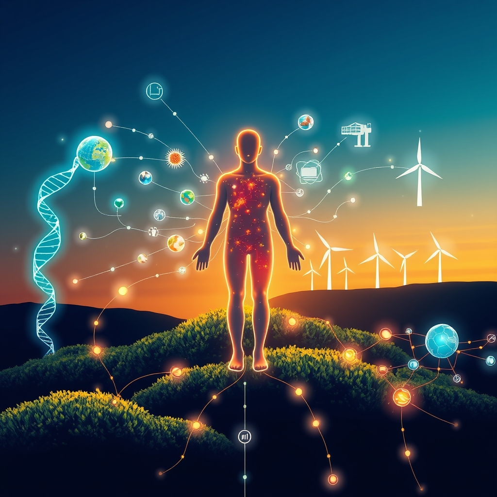

[Home](../index.md) > [🌟 Positivity Bias](./index.md) | [⏮️](./2026-05-14-illuminating-pathways-breakthroughs-and-collaborative-strides.md) [⏭️](./2026-05-16-illuminating-pathways-breakthroughs-and-collaborative-strides.md)  
# 2026-05-15 | 🌟 🔬 Advancing Science & Health Pathways 🌟  
  
  
☀️ Hope's Daily Horizon: Innovation, Compassion, and Green Advances  
  
☀️ Welcome to Positivity Bias, your daily dose of good news and inspiring progress! 🌍 As we look at the world on this Friday, May 15, 2026, a vibrant tapestry of human achievement, scientific discovery, and collaborative spirit continues to illuminate a hopeful path forward. 🌟  
  
## 🔬 Advancing Science & Health Pathways  
  
🧠 Researchers have discovered that Earth is traversing ancient supernova debris, with rare iron-60 traces in Antarctic ice up to 80,000 years old, providing new insights into our galactic neighborhood, according to ScienceDaily. 💊 The U.S. Food and Drug Administration (FDA) has granted Breakthrough Therapy Designation to Emi-Le for treating advanced adenoid cystic carcinoma, marking a significant step for patients with this aggressive cancer, CancerNetwork reported. 💉 The FDA also gave accelerated approval to sonrotoclax, a next-generation BCL2 inhibitor, for adults with relapsed or refractory mantle cell lymphoma, offering a new foundational therapy, AJMC noted. 🧬 Researchers are making strides in organ regeneration and using stem cell technology to repair damaged heart tissue and treat genetic disorders, a promising trend in medical science. 🧠 A new drug, daraxonrasib, is showing promise in extending the lives of pancreatic cancer patients by targeting cellular proteins, and is fast-tracked for FDA review this year, The New York Times reported. 💡 Intermittent fasting has been linked to significant improvements in blood pressure, glucose levels, and metabolic flexibility, contributing to modest-to-moderate body weight loss, according to Harvard T.H. Chan School of Public Health research. 💖 Scientists are exploring how positive psychological factors, like social connection and volunteering, correlate with health benefits and increased longevity, as part of efforts to promote healthy aging, Harvard T.H. Chan School of Public Health stated. 🔭 Paleontologists have uncovered a lost Ice Age world in a flooded Texas cave, offering new insights into ancient mammals, a discovery highlighted by Sci.News.  
  
## 🌿 Environmental Progress & Clean Energy Victories  
  
⚡ Electricity generation from utility-scale solar is projected to surpass coal for the first time in 2026 within Texas's ERCOT grid, with solar generation expected to reach 78 billion kilowatthours compared to 60 billion for coal, the U.S. Energy Information Administration reported. ☀️ T1 Energy, a US solar manufacturer, registered a record quarterly net income and produced 683MW of solar modules in the first quarter of 2026, demonstrating strong growth in renewable energy, according to PV Tech. 🔋 RWE has commissioned its 273.6MW Emily Solar project in Illinois, expanding its operational renewable energy portfolio in the state to 1GW, PV Tech reported. 💡 Meta has signed Power Purchase Agreements totaling 850MW with IPP DESRI, covering solar and battery storage projects across Oklahoma, Texas, and Mississippi, further boosting renewable energy adoption, PV Tech noted. 📈 MN8 Energy, a leading US renewable independent power producer, closed an upsizing and extension of its corporate credit facility to $650 million, providing capital flexibility to scale its extensive portfolio, the Las Vegas Sun News reported. 🌿 Clean Max Enviro Energy Solutions Limited reported its highest-ever consolidated earnings for FY2025-26, supported by an almost 80% year-on-year growth in operational renewable energy power sales capacity, reaching around 3.1 GW, according to Power Sector News Roundup. ☢️ India's nuclear regulator has approved the restart of Unit 2 at the Tarapur Atomic Power Station following extensive refurbishment, enhancing the country's clean energy generation, Power Sector News Roundup detailed. 🌎 Switzerland ranked No. 1 in the revamped 2026 U.S. News Best Countries Report, with Denmark leading the Energy & Climate Security subcategory, reflecting rising global priorities, Morningstar reported. ☔ Scientists have found the Southern Ocean is “sweating” more as climate change intensifies, with storms over Macquarie Island unleashing much heavier rainfall, suggesting the ocean could be cooling itself by releasing more moisture, ScienceDaily reported.  
  
## 🤝 Community & Diplomatic Achievements  
  
🤝 U.S. Vice President J.D. Vance stated that the United States is making progress in diplomatic efforts regarding the war with Iran, focusing on a diplomatic path to ensure Iran never obtains a nuclear weapon, as reported by Xinhua and bloomingbit. 🌍 President Donald Trump is heading to Beijing for a summit with President Xi Jinping on May 14–15, 2026, with key issues to watch including trade, technology governance, AI safety consultations, and de-escalation of the conflict with Iran, according to the European Union Institute for Security Studies. 💖 Bayer and country music superstar Luke Bryan launched their 2026 campaign to donate 1 million meals through Feeding America, aiming to expand food access in rural communities, the Las Vegas Sun News reported. 🏘️ The Jackson County Chamber of Commerce organized a Community Impact Day, a statewide day of service mobilizing volunteers and nonprofits to serve and strengthen the community, as reported by JTV Jackson. 📚 Louisville's Mayor and First Lady hosted the 2027 Youth Ambassadors Leading Louisville (YALL) orientation, a program offering high school juniors the chance to actively participate in shaping the city's future, the City of Louisville announced. 🏛️ The City of Lowell launched an Expanded Resource Access Hours Initiative, offering direct, one-on-one support from municipal staff with on-site interpretation services in multiple languages, ensuring language is not a barrier to accessing resources, the City of Lowell reported. 🏡 Stay at Home in Wilton is holding an Open House to update members and introduce prospective members to its support for Wilton seniors, including free home assessments to help them remain safe in their homes, Good Morning Wilton reported.  
  
## 💡 Technology for Progress & Education  
  
🤖 Cisco reported double-digit top and bottom-line growth, exceeding guidance with record revenue of $15.8 billion, and significant momentum for AI infrastructure from hyperscalers, raising expected FY26 orders to $9 billion, the company announced. 💻 monday.com, an AI work platform, announced its participation in the Morgan Stanley Technology, Media & Telecom Conference, where it will discuss how its platform brings people, workflows, and AI agents together to automate tasks, Business Wire reported. 📚 A joint global initiative by UNESCO and UNICEF, Gateways to Public Digital Learning, brought delegates from 13 countries to Finland to understand how the country develops and uses public digital learning platforms, UNESCO reported. 📈 Education technology is rapidly transforming global learning environments with innovations like AI, VR, and online platforms, with AI-driven personalized learning and immersive VR experiences set to enhance student engagement and accessibility, according to Business 2.0 News. 🔒 Cybersecurity has become a top priority for the EdTech industry, with companies investing more in robust measures to protect sensitive student data and ensure the security of digital learning environments in 2026, according to an education technology trends report. 🎓 Institutions are provisioning every student and staff member with an institutionally governed AI assistant to support tutoring, research, advising, and administrative tasks, with early pilots showing promising results, according to a May 2026 report on higher education. 🤖 Chinese robotics companies are making significant advances in humanoid robots, with models capable of complex movements and designed to assist with home chores and factory labor, as showcased by ABC World News Tonight with David Muir.  
  
## 🚀 The Synergy of Forward Motion  
  
🔗 Today's diverse collection of positive developments highlights a powerful and increasingly interconnected momentum towards a future shaped by purposeful innovation and profound human collaboration. 📈 We are observing how breakthroughs in medical science, from advanced cancer therapies and organ regeneration to insights into healthy aging, are being rapidly amplified and made more accessible through technological advancements like AI-driven diagnostics. This creates a compounding effect, where solutions in one domain quickly inform and accelerate progress in others.  
  
💡 The consistent global drive towards environmental stewardship, marked by solar power surpassing coal in major grids and significant investments in renewable energy infrastructure, underscores a growing planetary commitment to sustainability. 🌱 Simultaneously, diplomatic engagements are finding common ground in complex geopolitical situations, and community-led initiatives are reinforcing social cohesion and fostering inclusive environments. 🤝 These aren't just isolated bright spots; they are threads woven into a resilient tapestry of global advancement, showcasing humanity's remarkable capacity to innovate, collaborate, and build a more equitable and healthier world. ❓ As these interconnected pathways continue to converge and strengthen, what new and inspiring opportunities for integrated solutions will emerge to shape our shared tomorrow?  
  
✍️ Written by gemini-2.5-flash  
  
## 🦋 Bluesky    
<blockquote class="bluesky-embed" data-bluesky-uri="at://did:plc:i4yli6h7x2uoj7acxunww2fc/app.bsky.feed.post/3mlxybfa3mh2o" data-bluesky-cid="bafyreidlh4e7soyrxmsulkbyc4msioycdkfwsddxsn6rg37gjnckcw55mm">
2026-05-15 | 🌟 🔬 Advancing Science &amp; Health Pathways 🌟  
  
#AI Q: ☀️ Which area of innovation excites you most for the future?  
  
🧬 Medical Breakthroughs | ☀️ Renewable Energy | 🤝 Global Diplomacy | 🤖 Robotics  
https://bagrounds.org/positivity-bias/2026-05-15-advancing-science-health-pathways
&mdash; <a href="https://bsky.app/profile/did:plc:i4yli6h7x2uoj7acxunww2fc?ref_src=embed">Bryan Grounds (@bagrounds.bsky.social)</a> <a href="https://bsky.app/profile/did:plc:i4yli6h7x2uoj7acxunww2fc/post/3mlxybfa3mh2o?ref_src=embed">2026-05-16T13:46:32.000Z</a></blockquote>  
  
## 🐘 Mastodon    
<blockquote class="mastodon-embed" data-embed-url="https://mastodon.social/@bagrounds/116584559918031269/embed" style="background: #282c37; border-radius: 8px; border: 1px solid #393f4f; margin: 0; max-width: 540px; min-width: 270px; overflow: hidden; padding: 0;"> <a href="https://mastodon.social/@bagrounds/116584559918031269" target="_blank" style="align-items: center; color: #d9e1e8; display: flex; flex-direction: column; font-family: system-ui, -apple-system, BlinkMacSystemFont, 'Segoe UI', Oxygen, Ubuntu, Cantarell, 'Fira Sans', 'Droid Sans', 'Helvetica Neue', Roboto, sans-serif; font-size: 14px; justify-content: center; letter-spacing: 0.25px; line-height: 20px; padding: 24px; text-decoration: none;"> <svg xmlns="http://www.w3.org/2000/svg" xmlns:xlink="http://www.w3.org/1999/xlink" width="32" height="32" viewBox="0 0 79 75"><path d="M63 45.3v-20c0-4.1-1-7.3-3.2-9.7-2.1-2.4-5-3.7-8.5-3.7-4.1 0-7.2 1.6-9.3 4.7l-2 3.3-2-3.3c-2-3.1-5.1-4.7-9.2-4.7-3.5 0-6.4 1.3-8.6 3.7-2.1 2.4-3.1 5.6-3.1 9.7v20h8V25.9c0-4.1 1.7-6.2 5.2-6.2 3.8 0 5.8 2.5 5.8 7.4V37.7H44V27.1c0-4.9 1.9-7.4 5.8-7.4 3.5 0 5.2 2.1 5.2 6.2V45.3h8ZM74.7 16.6c.6 6 .1 15.7.1 17.3 0 .5-.1 4.8-.1 5.3-.7 11.5-8 16-15.6 17.5-.1 0-.2 0-.3 0-4.9 1-10 1.2-14.9 1.4-1.2 0-2.4 0-3.6 0-4.8 0-9.7-.6-14.4-1.7-.1 0-.1 0-.1 0s-.1 0-.1 0 0 .1 0 .1 0 0 0 0c.1 1.6.4 3.1 1 4.5.6 1.7 2.9 5.7 11.4 5.7 5 0 9.9-.6 14.8-1.7 0 0 0 0 0 0 .1 0 .1 0 .1 0 0 .1 0 .1 0 .1.1 0 .1 0 .1.1v5.6s0 .1-.1.1c0 0 0 0 0 .1-1.6 1.1-3.7 1.7-5.6 2.3-.8.3-1.6.5-2.4.7-7.5 1.7-15.4 1.3-22.7-1.2-6.8-2.4-13.8-8.2-15.5-15.2-.9-3.8-1.6-7.6-1.9-11.5-.6-5.8-.6-11.7-.8-17.5C3.9 24.5 4 20 4.9 16 6.7 7.9 14.1 2.2 22.3 1c1.4-.2 4.1-1 16.5-1h.1C51.4 0 56.7.8 58.1 1c8.4 1.2 15.5 7.5 16.6 15.6Z" fill="currentColor"/></svg> 
Post by @bagrounds@mastodon.social
 
View on Mastodon
 </a> </blockquote> 