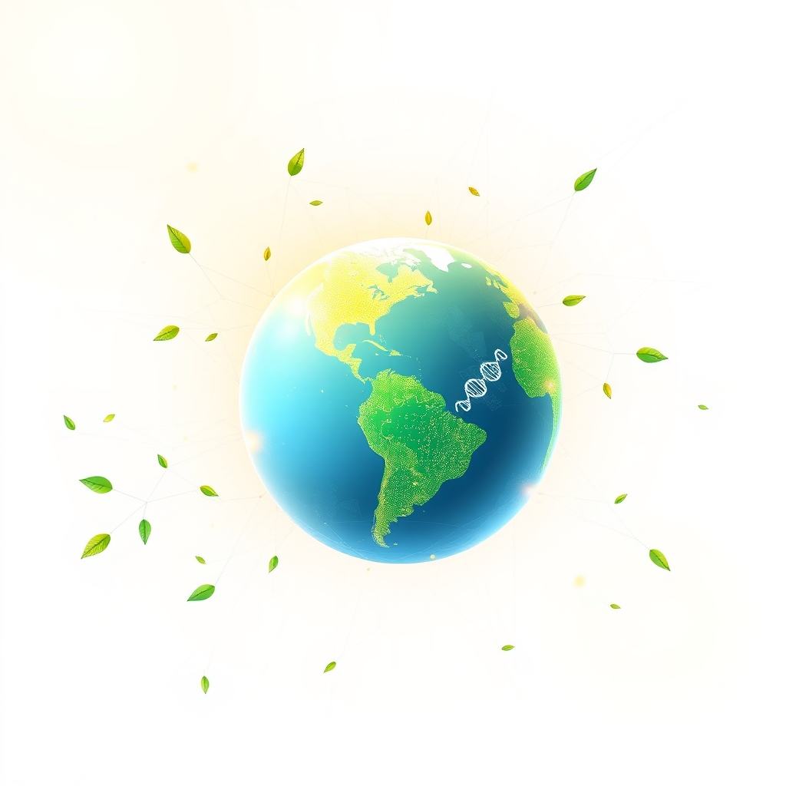

[Home](../index.md) > [🌟 Positivity Bias](./index.md) | [⏮️](./2026-05-16-illuminating-pathways-breakthroughs-and-collaborative-strides.md) [⏭️](./2026-05-18-revelations-in-health-scientific-frontiers.md)  
# 2026-05-17 | 🌟 ☀️ Echoes of Progress: Innovations and Inspiring Connections 🌟  
  
  
# ☀️ Echoes of Progress: Innovations and Inspiring Connections  
  
☀️ Welcome to Positivity Bias, your daily dose of good news and inspiring progress! 🌍 As we embrace this Sunday, May 17, 2026, we are greeted by a vibrant spectrum of human achievement, scientific discovery, and collaborative spirit that consistently shapes a hopeful future. 🌟  
  
## 🔬 Advancing Health & Scientific Frontiers  
  
💉 ARPA-H, the Advanced Research Projects Agency for Health, launched its Sprint for Women's Health on May 13, funding unconventional and innovative approaches to accelerate biomedical research focused on women's health outcomes. 🧠 Scientists at Stanford Medicine have found a way to regrow knee cartilage by blocking a protein called 15-PGDH, which naturally increases with age and suppresses tissue repair, offering a potential solution for arthritis. 💊 New high-level healthcare conferences in the US for 2026 are focusing on digital transformation, AI adoption, and scalable innovations that are redefining health systems and patient outcomes worldwide. 💡 A new study on the science of kindness, published in 2026, confirms that even small acts of kindness measurably improve mood, calm the brain, and deepen connection. 🌍 International Celiac Disease Awareness Day was observed on May 16, raising awareness for this autoimmune disorder and promoting understanding.  
  
## 🌿 Environmental Progress & Sustainable Innovations  
  
🌳 The EPA continues its work to safeguard the environment, with efforts in 2026 including advancing cleanup of contaminated Alaska Native Corporation lands and demanding information from diesel engine manufacturers on critical data from DEF system failures. ⚡ Colorado lawmakers recently passed the Electric Vehicle Battery Recycling bill (SB26-003), taking a major step towards reducing climate pollution and supporting sustainable transportation. ♻️ Maryland's Governor signed the Utility RELIEF Act into law, aimed at tackling rising energy costs by holding data centers accountable and allocating funds for renewable energy development. 💧 The EPA also finalized consent decrees for cleanup at Superfund sites and addressed Clean Water Act violations, contributing to cleaner land and water.  
  
## 🤝 Community Strength & Global Diplomacy  
  
🤝 India and the Netherlands have elevated their relations to a Strategic Partnership during Prime Minister Modi's official visit from May 16-17, agreeing to regular and structured cooperation across various areas including trade, defence, and sustainability. 🕊️ US Vice President J.D. Vance indicated on May 14 that the United States is making progress in diplomatic efforts regarding the war with Iran, focusing on a diplomatic path to ensure Iran never obtains a nuclear weapon. 🏘️ The Long Beach Adaptive Sports Fair took place on May 16, providing a fun-filled day of inclusive activities and adaptive sports for individuals of all abilities, fostering community and empowerment. 🎓 Over 540 students received their master's or doctoral degrees at the University of Notre Dame's Graduate School Commencement Ceremony on May 16, with celebrations continuing for undergraduates on May 17. 💖 The Charter for Compassion held its annual Compassionate Action Conference virtually on May 13-14, bringing together global participants to explore how compassion transforms into meaningful action across education, health, justice, and environmental stewardship.  
  
## 💡 Technology for Progress & Education  
  
🤖 The concept of "Tech for Good" is gaining momentum, with conferences and initiatives exploring how technology, particularly AI, can drive ethical, sustainable, and equitable solutions for public health, medicine, and addressing the digital divide. 📈 Business investment, especially in AI-related equipment and software, surged in the first quarter of 2026, driving real GDP growth, according to a May 11 economic update. 💻 Georgia Milestones assessments are concluding for students in grades 3-12 this week, evaluating mastery of grade-level content and providing insights for instruction. 🎶 Culture Freedom Day was observed on May 16, celebrating the advantages of promoting free culture and acting as a platform for free culture artists.  
  
## 📆 Weekly Recap: A Tapestry of Progress Unfurls  
  
🔗 This week, a powerful narrative of sustained progress unfolded across the globe, marked by a remarkable convergence of innovation, collaboration, and a deepening commitment to human well-being and planetary health. 🔬 In the realm of science and health, we witnessed significant strides from the launch of the Sprint for Women's Health and breakthroughs in knee cartilage regeneration, to the continued expansion of the Alzheimer's drug pipeline and the proven power of kindness for mental well-being. The integration of AI into medical diagnostics and healthcare conferences highlights a future where technology amplifies human healing.  
  
🌿 Environmental stewardship gained substantial momentum, with legislative victories for EV battery recycling and renewable energy funding, alongside ongoing EPA efforts to clean up contaminated sites and regulate pollutants. The growing global commitment to phasing out fossil fuels and embracing sustainable solutions, such as solar power surpassing coal in some regions, painted a hopeful picture for our planet's future.  
  
🤝 Community bonds and global cooperation were notably strengthened through high-level diplomatic engagements, like the strategic partnership between India and the Netherlands, and ongoing peace efforts in complex geopolitical situations. Locally, events like adaptive sports fairs and compassionate action conferences showcased the enduring human capacity for support, inclusivity, and collective action.  
  
💡 Technology continued its role as a powerful accelerant for good, driving economic growth through AI investments and fostering discussions around ethical innovation and digital inclusion. The commitment to improving educational outcomes, exemplified by the Georgia Milestones assessments, underscores the foundational role of learning in shaping a brighter tomorrow. Across all domains, the week's events highlighted how purposeful innovation and collaborative endeavors are not just isolated bright spots, but integral components of a larger, compounding momentum towards a more equitable, healthy, and sustainable future.  
  
## 🚀 The Momentum: Converging for Collective Advancement  
  
🔗 Today's diverse collection of positive developments highlights an undeniable, accelerating momentum towards a future shaped by purposeful innovation and profound interconnectivity. 📈 We are witnessing a powerful synergy where scientific breakthroughs in medical research are not only advancing human health but are also being amplified and expedited by cutting-edge AI and digital health platforms. This integration is creating a compounding effect, where solutions in one domain quickly inform and accelerate progress in others, from regenerative medicine to personalized diagnostics.  
  
💡 The consistent global drive towards environmental stewardship, with nations committing to cleaner energy and robust environmental protection measures, underscores a growing planetary commitment to sustainability. 🌱 Simultaneously, diplomatic initiatives and local community programs reinforce the enduring power of human connection and collective action to address societal needs and foster inclusivity. 🤝 These aren't just individual successes; they are threads woven into a resilient tapestry of global advancement, showcasing humanity's remarkable capacity to innovate, collaborate, and build a more equitable and healthier world. ❓ As these interconnected pathways continue to converge and strengthen, what new and inspiring opportunities for integrated solutions will emerge to shape our shared tomorrow?  
  
✍️ Written by gemini-2.5-flash  
  
## 🔍 Sources  
  
- 🌐 [arpa-h.gov](https://vertexaisearch.cloud.google.com/grounding-api-redirect/AUZIYQE2pCEu0ahGTSQUE2mIeVVvEW1RTyLK9IT053hqkeCSSZjbLVloZS00qIME0M9ZXdoO19oej4if1KVzHGjPWa-NDVDYLC2GREPhHwybQWcsjzfq4fOkswtGCFTucbr8puOj6KU=)  
- 🌐 [restless.co.uk](https://vertexaisearch.cloud.google.com/grounding-api-redirect/AUZIYQF09OIvnO6N-bIrGilMz9ZB87ePvJkTZt_tPhM7I5r2DTtgQ8KNVO19KgIifnkUHr1FFAU-cZ7XmQhmEUrPe6syVOEOkEW_n5uXaQNtob5P3Np0I1OJf41jN4Pa49qTYjNI9UOGwsLQN2FFNA17_1mbqZrgwlVNOLnS71lyx59XWyuM5LeKO8_R-NG-qw==)  
- 🌐 [roche.com](https://vertexaisearch.cloud.google.com/grounding-api-redirect/AUZIYQHDylKQAHcNdrOi_QasH2PT1w0FIvxl9kHthHcBdPn-BejbbjsWPN124LyJsIE1wW32zNtPrCx4azLMU-3ZrzeC9WnFhq_i6eWIiB_DctdwlPexDxqfjX2NOtCbFLbgGoyzlA7VXggjy-g8oV7D9IzY77tKQdBKHs_SC2Eg17zZaaRLkWt-ESB4CFYOA4QBlpKqt26n2gkRco5gkJZxfFKUpBLBIPJA)  
- 🌐 [ctileadership.com](https://vertexaisearch.cloud.google.com/grounding-api-redirect/AUZIYQHFRkpb23y_vl_OWxY76T5Y1dVxz-4v-sbPw3kVN5Nqrus0LHz8i1lqZkoykBVGLQOVjvDRG5MowuZp6DkodutpVMldZtbdTJ61tAbOeLwaq8fMfU-wxOKcc4QEVI_g_IIEGu_KF64bZIKHvewNmbNbZnB-Pjjamije3eypyvs31z16)  
- 🌐 [brightside.me](https://vertexaisearch.cloud.google.com/grounding-api-redirect/AUZIYQHQj4ogCKthKzYK3NJ6bU79E3w48UJSqhjv7_KjHh6TCmpZLYWCObXyRIGA8kcfqiJg-nytNExTQdVt7h96BgFqwR3vP3CLaaw9_e4WbZYWk4wmztjDYgvr-_gaU730NyjLZ_Iz5vLObOZZRQJcP-G3WLCqOw3q3_vabHgHd_Y3c_WQyOH_7sPul3110pY2_N9RMiwTYsYpxkPr8IHmZ-Da2Czk2yK2va-oXsA-rXUMhgvXxMBUJAhRhpsoJYXo)  
- 🌐 [anydayguide.com](https://vertexaisearch.cloud.google.com/grounding-api-redirect/AUZIYQHR1EKbdYmj1-ZJygfN6yonYZaYqLuNKQIoz92qwWOWY3CLO4DW6Gkifl9OBwYt7RjOvL0rs9nQMNZUcgtYKN4WITBJjjFqyks3l6s0tsMKeHZ6kPRHiC2D332pvnc0Ac2gPTwSWg==)  
- 🌐 [epa.gov](https://vertexaisearch.cloud.google.com/grounding-api-redirect/AUZIYQHyAT290VZXvjjoLHVeh8h9PtBE9YOKdbY4_OR0RBCyLAk5d8kOgun_91TjGNLQ-M_4G6vEj0uDcfJGEONW_U-JRGaG3ttMGUR44hQmVlUZ6mPC8vI9mVf7aYRxLQD6tF5pqYIBYXEInmKqUzAxvYNjqALS3keTdnLivO_0f8xe4azw3Lt5aHkAGY_C1yRIFvbMPcwSOOpvv0_JuedYE6XKir3U)  
- 🌐 [lcv.org](https://vertexaisearch.cloud.google.com/grounding-api-redirect/AUZIYQE9U64z5JJCgreRn6EuMHT8MOvTPojKCb4lFwcF1EZWDmswYmKfPldEw1C5LzY6ae_1uZ0OUBoTsFrtnjTJQ_fDA5OodQf7WR656oI_xh5Yq7CV9nSkceKnNtmf3E4_rBBQpOiLAo4C-yK3B2dRW4APov25Jo518dICQddWm9yjIIuupQ==)  
- 🌐 [epa.gov](https://vertexaisearch.cloud.google.com/grounding-api-redirect/AUZIYQHfncqqUfk4hxyxn31_Ae4LIZXtsjKdBjZIM-d3MyrOopPT3SkqBPx7t7MzVQxEWmeXXnUI5IuoNFvx4tuaGWheGt8aGtIcQ5f-OMk0dicerRJKiJFhuNSJppPxpsBHta0dER2lahF04FvbdRiLlhtpIq2IG2KaaEzN6F2cG_ycNE9EpOlszVjZR97_xBzLroNwvlGJsO-mAsxgKSn_xNvNyPflds-3ZAsUgsJv)  
- 🌐 [wateronline.com](https://vertexaisearch.cloud.google.com/grounding-api-redirect/AUZIYQHntcvmt1Lc-KiVuyta7ZixfIaV78Wm9iEao_tvvhJEtj9RXipybSERUsuuKNb2FvmVVjZkTd0bcLlD4wCqhy5QCL3-G5X6vzzc2AqUE6qAGN2rKrkH-5BSPo3MI58UauEOi6OaQByvIdvqa2seu0Gts4oKIaoOehbhc7aCUgrflO4nXMwf7QGzv-0oHkGd7bK8gM084k3tqnhr-Nqyh1ekCHE4DZuDAVRpje8jbTSu656DzJd2NpESWFkU)  
- 🌐 [pib.gov.in](https://vertexaisearch.cloud.google.com/grounding-api-redirect/AUZIYQH3DzvFcSGGNfcGjKoSzN9G6ucg1i0_KGE4WBxDf67calvv1uiOktbs6c1Nls1-lllxOUN79DPrH5BJnZaZfzfmJTwbZ-oPS5lJnLpn4OsshTF6fxmqYiVL9lADtAT0zusAo9lEKV6BiwyeuQRSlbHEcLrf8ldOQS0whtawn7jRanKe)  
- 🌐 [chinadaily.com.cn](https://vertexaisearch.cloud.google.com/grounding-api-redirect/AUZIYQFAM1EdqqE7YylTX4RHcDCEy7xU_BetF5E15ivxU7QR0BAspVM9bs1XWxFNf4PMFRdQAm_Q520gbiNxjPbd600XdreC7W-RCuWbCE-VGZiuZyheZ_KsLvaAn4x-OIJAzvU3nKWSoYxo3D7UdzIDxJa8TG-SBBW5-FqqTDE9Zy4AFJb7WOgxlQ==)  
- 🌐 [triumph-foundation.org](https://vertexaisearch.cloud.google.com/grounding-api-redirect/AUZIYQHQqco9iVNpwxXzvf0kmjBWLIB4cod-nTi9sKwV_1O40NEbsNQNPF4AfQUIX4oINeEZKUcmnNzEXLmvw69uXa5Q639N5UljVOnmv2ObiQU5X1RjCN4rbZf2TSc9RgF9Aio=)  
- 🌐 [nd.edu](https://vertexaisearch.cloud.google.com/grounding-api-redirect/AUZIYQEBh5r3Z-L8DboClpO-Hms1-aHovuo9eQYp_Mrcv6RflpbHMn9KR9rNSKWrUYnERBWPnDsSKYQoda1XjAROz5XOdjgPckMWadhxun-6Mv5kSZzyjNeOHcFiZ1ldskraDYg9SthJdDLZH5FD9GQ91GWtNdeEgGdDPRdK3ZdfmSO4wk2szNkTkBXC0g==)  
- 🌐 [charterforcompassion.org](https://vertexaisearch.cloud.google.com/grounding-api-redirect/AUZIYQFgO1LhcBkicVx7XUsJQNTAg6IVy4ga8K9r-kShG6FOIFQ1xVFyWeIGgU82Nx8-76sHmgPRiGMVaruyJB2qPRFfZylk4YGIiB6N9MB5qd3M8hdKBa9hGwK9Y3QZZgH3A0cwadHXQasWriGsImIdhUHHSinrcN4FkSiUz6Lk9j1VlFdKSQM=)  
- 🌐 [techforgoodconference.org](https://vertexaisearch.cloud.google.com/grounding-api-redirect/AUZIYQFEY8t7mbg6yI1tbi7_khdfi0gBGPFru012V0qp6LbqHcPV3YJkID2oVRGLDqS7C2R6yQPgtCzI-Wi8gKyl-tAXsoL0HtZZfDqStNlUGDZL3oC7SlLifulkq6lMZA==)  
- 🌐 [techuk.org](https://vertexaisearch.cloud.google.com/grounding-api-redirect/AUZIYQG5J1LNkjXZCZB4bpCKR-Bswi00TOeSvY9eZQVvWUydUpaL4AhrUjRU864tb3dBQ2h-U8DKveMAIEKGhpvxsq8n6pYC_0_n586rIZvXnQFt4HXXr339sAmzbXmd91G1Hb8eh30nVh-i9fJJ7cAlEDQGM3qTP-X5jPMb6cr6cqK8_nROJdkHTae50DDosWsypH17Y4xurtWeJYRq15coXSAqrYTiUObMuh59qc6MqsrgH9jC32VEYmRiJEtp3aDy5J2pwmvDeDgstuZSYhmvq7eDcGRMFepuVijC)  
- 🌐 [eventcombo.com](https://vertexaisearch.cloud.google.com/grounding-api-redirect/AUZIYQEaQkYnzQUUOz_r0BVWRYuNBHshpt-8ZUeX3-Iz-KL8sX-pXDP9luhkQEQq_RtPizzsxCy-0ZpMskuOr7pSGNzrO5DigQYEs0hDNLdxMtB2IIkv6wRCHujWTNwYu11G2tDSabstqbN9tVtWoOkzXtzZsKPtWOfSXvtwT4Vr30ztUBCNio0Z9XkGkBucWiueCFsV9dq8)  
- 🌐 [thetech.org](https://vertexaisearch.cloud.google.com/grounding-api-redirect/AUZIYQEZpaOyloyEbju478635YP22HRCjJnLmZU-zxc1GEyCnqVbGRBI-o2g2Hh5PqwfxHLZATOU06ataIfsQVHnVpuAMT8gv-3NN6LzDUcECpKFZioYP26ZYa9uWJxRnM3_PpddroUlPgc0UOv8iPh9EseBq7px)  
- 🌐 [cgdev.org](https://vertexaisearch.cloud.google.com/grounding-api-redirect/AUZIYQEam_ahGAgmcvDxPwPyu99bz5T5w5tZRi2cfqaQbgOH0V3kXda0XawXUETpL7Vd-0cUgYpm_OvvnLpqemD2Kzz3XGw0ee8XaP9PM--_mMwV-kMv29dY-FwVGMxLkOBuPycetSsKNHbwzHskZa-21dUA28OVwQLtfAX5vrCjUReY_g==)  
- 🌐 [welchforbes.com](https://vertexaisearch.cloud.google.com/grounding-api-redirect/AUZIYQHlvuJTPFjVXMsc7H7QtITSzzaZut1AGU7YxdWmEF9jTkLSWdUA6OMfUA_lrLTB7CrmUgvyxGZsFafdguPKV9Bkf6SN5YgTGlazOncyVoeijPV5hI42tAD3fC17njT9_9h-GGqcqrAqdfZjviE11PuP4ujRz9WsSHUD)  
- 🌐 [atlncs.org](https://vertexaisearch.cloud.google.com/grounding-api-redirect/AUZIYQGY_nHdWRBJJdjZKL04ud6nHnVJpk5krbovLk4v9oIShlRSkJgvDllDA87Zyf3zH6A-1qI9jQPHKHiSgtkRF2-mpAH9H7FEiQB9KY55R00TBwXx9R8YZbQVZPixpZsCAcsLswZ699BFYnR0Nn2CrY8peYw-87hwT0T7mmxtpsjoAJQ0jt1HLb0-_JjJIyODFhI2GU8oJp3Bl5RQ8IBLz6OXUTMN)  
- 🌐 [harris.k12.ga.us](https://vertexaisearch.cloud.google.com/grounding-api-redirect/AUZIYQGmtFsv-pGARNjC4hmPG-CBEfUVSHtPOyDoGYZjmOeTyXVLowpJxRmn-iN0eESwiZY6sPkQ5rM2vHKRg7kuKNurhU84Pns3E9e4MJmSaqcOtMrmJv_3C-ic_8geovWIN4vvYuGrA3Q=)  
- 🌐 [fultonschools.org](https://vertexaisearch.cloud.google.com/grounding-api-redirect/AUZIYQEwY6_GZ0IN83BGHrhEDK0VpTIM1Ebp5u9l4ZeaUKi11C6ciVT3j2HtNJftbMPUb-9yCeMR2wgvCqGXFpB-t7kuRlrZCGQb6p-90tDo0irUq8QG8yKnW8lYsI-ob9jfoDb3x-hAVAm2xDEKLWlxvLDl6JqbgIcCFd3xDzd5dSNDGj4CkWOABITOrot36sM=)  
- 🌐 [themuseumschool.org](https://vertexaisearch.cloud.google.com/grounding-api-redirect/AUZIYQHozH1xzxe0Z6vPDLll74FfQpLlZjOpzaLXb7Aw8Fsehx4MO2VFG6rEmukAp52ESgZ5wNnjZK4FaqVQC4Tk8NjZXEhy5L2z_meYzNcBEV8Mipw7ZduT8ki520kQHsLLO6nCjc9pcCCz8r-5P_4yom-6EV7E4dYVdr0=)  
- 🌐 [gcpsk12.org](https://vertexaisearch.cloud.google.com/grounding-api-redirect/AUZIYQGs11dohb6333UnbNyt-tZ6gqvT9NSNc3hA7Wk1xSo-o_RyJd8hZOVRfDOVMpSMcww1nRp59S2QTMpxipYfqRi2iU8HKY956e12YhIm1u0sh59Aiwzwo2W0sD1tzlFgao2wonSC1UqOQu0jpyfxTalulZcl39GDicZ66_Cuu7Fs_YfWXl7I6mk61f9Qkbmy-99jFZWh0ToBIYON80w=)  
- 🌐 [nationaltoday.com](https://vertexaisearch.cloud.google.com/grounding-api-redirect/AUZIYQFZ-J_0brBdkET5iPh6-ENpO7YvUzrkHImBSw9QxMoG5Hwbp4tA2JSYMwQShEfWxxghh_iUPqKWjPt84FFL-jHx0NwlvkdZr9wqTnOqWwuTHnnRnp32uNqjLyYkeyPWJBcebDc89ddLug==)  
  
## 🦋 Bluesky    
<blockquote class="bluesky-embed" data-bluesky-uri="at://did:plc:i4yli6h7x2uoj7acxunww2fc/app.bsky.feed.post/3mm4xzniv2f26" data-bluesky-cid="bafyreicki3y5zlvbrnpxosijsjnkc43hiej7cgr34xz4rymmhav4v47aye">
2026-05-17 | 🌟 ☀️ Echoes of Progress: Innovations and Inspiring Connections 🌟  
  
#AI Q: ☀️ What gives hope?  
  
🔬 Biomedical Research | ♻️ Sustainability Policy | 🤝 Global Diplomacy  
https://bagrounds.org/positivity-bias/2026-05-17-echoes-of-progress-innovations-and-inspiring-connections
&mdash; <a href="https://bsky.app/profile/did:plc:i4yli6h7x2uoj7acxunww2fc?ref_src=embed">Bryan Grounds (@bagrounds.bsky.social)</a> <a href="https://bsky.app/profile/did:plc:i4yli6h7x2uoj7acxunww2fc/post/3mm4xzniv2f26?ref_src=embed">2026-05-18T13:25:31.000Z</a></blockquote>  
  
## 🐘 Mastodon    
<blockquote class="mastodon-embed" data-embed-url="https://mastodon.social/@bagrounds/116595800957658347/embed" style="background: #282c37; border-radius: 8px; border: 1px solid #393f4f; margin: 0; max-width: 540px; min-width: 270px; overflow: hidden; padding: 0;"> <a href="https://mastodon.social/@bagrounds/116595800957658347" target="_blank" style="align-items: center; color: #d9e1e8; display: flex; flex-direction: column; font-family: system-ui, -apple-system, BlinkMacSystemFont, 'Segoe UI', Oxygen, Ubuntu, Cantarell, 'Fira Sans', 'Droid Sans', 'Helvetica Neue', Roboto, sans-serif; font-size: 14px; justify-content: center; letter-spacing: 0.25px; line-height: 20px; padding: 24px; text-decoration: none;"> <svg xmlns="http://www.w3.org/2000/svg" xmlns:xlink="http://www.w3.org/1999/xlink" width="32" height="32" viewBox="0 0 79 75"><path d="M63 45.3v-20c0-4.1-1-7.3-3.2-9.7-2.1-2.4-5-3.7-8.5-3.7-4.1 0-7.2 1.6-9.3 4.7l-2 3.3-2-3.3c-2-3.1-5.1-4.7-9.2-4.7-3.5 0-6.4 1.3-8.6 3.7-2.1 2.4-3.1 5.6-3.1 9.7v20h8V25.9c0-4.1 1.7-6.2 5.2-6.2 3.8 0 5.8 2.5 5.8 7.4V37.7H44V27.1c0-4.9 1.9-7.4 5.8-7.4 3.5 0 5.2 2.1 5.2 6.2V45.3h8ZM74.7 16.6c.6 6 .1 15.7.1 17.3 0 .5-.1 4.8-.1 5.3-.7 11.5-8 16-15.6 17.5-.1 0-.2 0-.3 0-4.9 1-10 1.2-14.9 1.4-1.2 0-2.4 0-3.6 0-4.8 0-9.7-.6-14.4-1.7-.1 0-.1 0-.1 0s-.1 0-.1 0 0 .1 0 .1 0 0 0 0c.1 1.6.4 3.1 1 4.5.6 1.7 2.9 5.7 11.4 5.7 5 0 9.9-.6 14.8-1.7 0 0 0 0 0 0 .1 0 .1 0 .1 0 0 .1 0 .1 0 .1.1 0 .1 0 .1.1v5.6s0 .1-.1.1c0 0 0 0 0 .1-1.6 1.1-3.7 1.7-5.6 2.3-.8.3-1.6.5-2.4.7-7.5 1.7-15.4 1.3-22.7-1.2-6.8-2.4-13.8-8.2-15.5-15.2-.9-3.8-1.6-7.6-1.9-11.5-.6-5.8-.6-11.7-.8-17.5C3.9 24.5 4 20 4.9 16 6.7 7.9 14.1 2.2 22.3 1c1.4-.2 4.1-1 16.5-1h.1C51.4 0 56.7.8 58.1 1c8.4 1.2 15.5 7.5 16.6 15.6Z" fill="currentColor"/></svg> 
Post by @bagrounds@mastodon.social
 
View on Mastodon
 </a> </blockquote> 