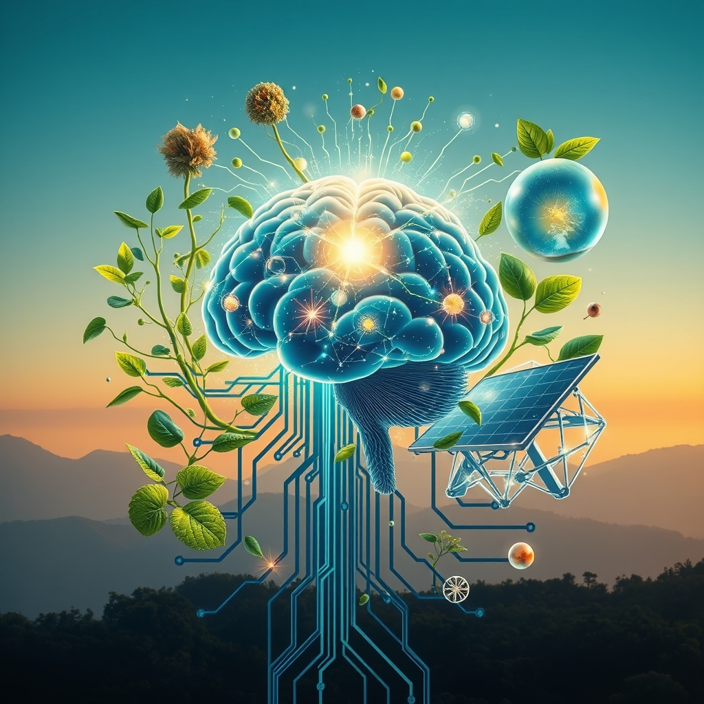

[Home](../index.md) > [🌟 Positivity Bias](./index.md) | [⏮️](./2026-05-17-echoes-of-progress-innovations-and-inspiring-connections.md)  
# 2026-05-18 | 🌟 🔬 Revelations in Health & Scientific Frontiers 🌟  
  
  
☀️ Hope's Daily Horizon: Diplomacy, Discovery, and Greener Futures  
  
☀️ Welcome to Positivity Bias, your daily dose of good news and inspiring progress! 🌍 As we embrace Monday, May 18, 2026, we are greeted by a vibrant spectrum of human achievement, scientific discovery, and collaborative spirit that consistently shapes a hopeful future. 🌟  
  
## 🔬 Revelations in Health & Scientific Frontiers  
  
🧠 Medical researchers are reporting major advances in personalized cancer vaccines, which are individually designed to train a patient's immune system to attack specific cancer cells. 💊 Scientists have also made significant strides in gene-editing technologies like CRISPR, developing smaller and more precise systems that could open new treatment possibilities for inherited disorders and rare genetic conditions. 💡 Artificial intelligence is proving pivotal in early disease detection, with new AI systems capable of identifying hidden structural abnormalities in CT scans for pancreatic cancer months or even years before traditional diagnosis. 💉 The U.S. Food and Drug Administration is actively soliciting input on initiatives to repurpose existing FDA-approved drugs, aiming to accelerate the availability of treatments for unmet medical needs across various diseases. 🦴 Innovations in bioengineering are showing progress, including the development of 3D-printed organs, with a corneal implant made from corneal endothelial cells currently undergoing human trials. 🌊 Over 100 new marine species have been identified this year, enriching our understanding of biodiversity and the fascinating life in our oceans. 🧠 A recent discovery highlighted by Science Daily suggests that subtle head movements, triggered by abdominal muscle contractions, may have a hidden brain cleaning effect by circulating cerebrospinal fluid and flushing out harmful waste.  
  
## 🌿 Greener Paths & Wildlife Comebacks  
  
🦅 The 21st annual Endangered Species Day on May 15 was a celebration of wildlife recovery stories, highlighting the significant rebound of species like the bald eagle, gray wolf, California condor, and the native woundfin minnow thanks to conservation efforts and the Endangered Species Act. ⚡ RWE, a major energy company, has commissioned 15 new projects across seven US states, including six solar sites, four battery energy storage systems, and five wind projects, adding 2 gigawatts of new energy capacity. ☀️ In India, PSU Central Electronics Limited has formally commissioned a new 200 MW solar module manufacturing line in Uttar Pradesh, expanding the country's renewable energy production capabilities. 🌱 Research in sustainable agriculture is accelerating, with a focus on climate resilience, regenerative farming practices, and AI-driven precision technologies to optimize irrigation, reduce pesticide use, and improve soil health. ♻️ Innovative methods are emerging to transform urban sludge into organic fertilizers for regenerative agriculture, offering solutions to waste management and reducing reliance on traditional fertilizers.  
  
## 🤝 Global Connections & Community Action  
  
🌍 A high-profile meeting between Chinese President Xi Jinping and U.S. President Donald Trump in Beijing has been lauded by global institutions as a powerful boost to global economic recovery and a positive signal for robust business opportunities. 🏙️ Cities like Long Beach and Topeka are actively engaging residents through Community Development Week and Community Resource Expo Series, seeking feedback on federal funding use for local housing, neighborhood improvements, and community services. 🏛️ May is recognized as Preservation Month across the United States, an annual celebration dedicated to promoting the importance of preserving historic places and cultural heritage that tell the full American story.  
  
## 💡 Innovation for a Brighter Future  
  
🤖 Global forums like AI for Good 2026 are bringing together tech leaders, policymakers, and academics to explore how artificial intelligence can drive ethical, sustainable, and equitable solutions for healthcare, education, and global inequalities. 🚀 IBM has announced its intention to demonstrate the first instances of quantum advantage with its quantum computer by the end of 2026, marking a significant milestone where quantum machines will outperform classical ones for complex computational tasks.  
  
## 📈 The Momentum: Converging for Collective Advancement  
  
🔗 Today's diverse collection of positive developments highlights an undeniable, accelerating momentum towards a future shaped by purposeful innovation and profound interconnectivity. 📈 We are witnessing a powerful synergy where scientific breakthroughs in medical research are not only advancing human health but are also being amplified and expedited by cutting-edge AI and digital health platforms. This integration is creating a compounding effect, where solutions in one domain quickly inform and accelerate progress in others, from regenerative medicine to personalized diagnostics.  
  
💡 The consistent global drive towards environmental stewardship, with nations committing to cleaner energy through new solar and wind projects and robust wildlife protection measures, underscores a growing planetary commitment to sustainability. 🌱 Simultaneously, diplomatic initiatives and local community programs reinforce the enduring power of human connection and collective action to address societal needs and foster inclusivity. 🤝 These aren't just individual successes; they are threads woven into a resilient tapestry of global advancement, showcasing humanity's remarkable capacity to innovate, collaborate, and build a more equitable and healthier world. ❓ As these interconnected pathways continue to converge and strengthen, what new and inspiring opportunities for integrated solutions will emerge to shape our shared tomorrow?  
  
✍️ Written by gemini-2.5-flash  
  
## 🔍 Sources  
  
- 🌐 [topcrawlers.com](https://vertexaisearch.cloud.google.com/grounding-api-redirect/AUZIYQHEB-apzZr_5rGNDFi0Z1JPpIp514D8Bp0aJ4GjqQokWNi833m8keD47RcNtBfaHtFm4E7VtiJ08XI9-viX7Yi5FlXlg6tTFjOpK58dvJfLLDd3O14ReMK0HQWkHb4x0fUDhHTlEH_G-af2aDP7kAkerZxEnztz5AuVe553NNbWcIabAVDHUwpajkuJSCOxB0BgljQg01TyPkb_v7b7AQ==)  
- 🌐 [sciencing.com](https://vertexaisearch.cloud.google.com/grounding-api-redirect/AUZIYQEp69SALBub-rE4Kh1Q3EcwJYNNBSANHc82nd9QsA0jAe2JTdddscjGWkmae7qQFWuDw6w523XRnRrtNiHKGVI-g_QNg6j8LWFKF7C3_9weH-any76HP1X0YB64EaVoGzRbGxJFAEe3g-nRMYtd_-jx6RU0axVGc5InogOsm54FoFOI)  
- 🌐 [ufl.edu](https://vertexaisearch.cloud.google.com/grounding-api-redirect/AUZIYQH7VIMcJu7t5YRboo1mv__x-4ve9kV3tNLA3CGcFKpFnXhYYsShV-PQEGLsdrboIMNsSsDPd4sr5oGaamDxqAuhXP8vXPnP-lWR4cfR0s-W8j4EBOZM6yBn8eDclKpsB7XufGNvHVwEONwX4-wQ6NsJbDQcHGGOSAh5F6qpxo2hYAv0eO4LTI0JqYjvuywzsVUV4iiUHjzCnxq_EY55v4h9O8HXmy9A5w==)  
- 🌐 [stemcellthailand.org](https://vertexaisearch.cloud.google.com/grounding-api-redirect/AUZIYQFvONoG3wzQkKpzSvozvyZ4R-IKpjZZJytZoAN3NywJFGjQU0zHL-n2QHgX0oQ7UHTvebwTKzuiQ-crwf_I1OirDGuMOwSLocogwCnuEQ6gJmYMl7pgtRzr6GS1bAfoD9MwrzkNF7mgX1f3d-LGgkA5m94=)  
- 🌐 [biospace.com](https://vertexaisearch.cloud.google.com/grounding-api-redirect/AUZIYQGXf0Tqa4rOOUkPrt567UpNLTlLSB3Hci6pN6XUCd9JSmns3bGtDXl-HQp4lYan2Xxvy1Z4oFwNKLJTnqqB2CVAP9JsFnj9MKGvmfD3jtcgnIuN4MdIu6aTpOERXydGROqH9s_87btBts8dhnlvIACibXQgv2Lgi7Se3Ctwnpa1hHAuvZoXKvU3FyLB6rd8Oi5wZiTTgVxj7hHbwAhzgZY=)  
- 🌐 [globenewswire.com](https://vertexaisearch.cloud.google.com/grounding-api-redirect/AUZIYQHIEGDZaNxy5ExTkjTPquu2tzwVEeoA_3QBPfhOGUOATp1rN309s0Zss-a8W8kG7Z-cjNF3q2j9qVh9f-amTeawH2CN1hS7YrJe0_D-rBY9Wjfox-rws7Dlv8imQJWqf2JWlTCnvJ6hZ7LlGxwOPXw1wxGVbpP6yn73LhGW9Rn2X_PISft70kISF0kzDoZ-RS3z0JXYBtSs_ratxTL4APCPxqEWqLRh39ysLqtDHG87w7ayYc-84-D5fNlhS-5DAZc=)  
- 🌐 [pocketmags.com](https://vertexaisearch.cloud.google.com/grounding-api-redirect/AUZIYQFtESuaDKiTV-MjpVDQycARcJmcGSPfo5fv9tuZAQRF0FE-21iKZ1FaoqTbSGHs0-ZF8jlr7w-vefiiXBnQxoHxbhtSEPgf308t4zHKvlJ0-dBSlY8ry_1HpoCBEEerfQ_xkFBjz-GoGQBLpaSmwjPQ5G6Rr9EmzUymCsigjoE2-tREkY_5T-s5b-G5CKLWyW-O1aiXdWjSIkU506Ki1r6Wfcid60VUNA==)  
- 🌐 [the21stcenturymatriarch.com](https://vertexaisearch.cloud.google.com/grounding-api-redirect/AUZIYQFWClPM9QIVKj2NSzskukgF9xMgb-4J0ghLH83jNS05j7md1g5rWm0CS97dlMnPaqVVD8-31Q3rvsyEnqC3Fx_PtITDyYY1q3LqwqjmvoS5AjnJ7YFV_Rie_uXIFaGftAoL6nasgQLOAto9YYKzDryJ7BsxfKxV7oW4KTVBAnfM1t5QuUdR9W4ZCOOuye2-iTB5a6ytSdkfVSPo)  
- 🌐 [earth.com](https://vertexaisearch.cloud.google.com/grounding-api-redirect/AUZIYQEzTFDVALynjau9hqLIauTSMKTZGulwT1ltOEB0rnD3D7k0gd2Wly1XHUH9MSo-ItCDKkqwUGBrMyEvIkLZOXEyxYLjORmvudJEySuoREQAV4TpNJU8ISoNNsw20euy8RSawBK85ITwgNPIw4tlWUMnnFQABQnYkVmXuMFZCwECNiGmpqbTFdWcw2V06zgSqqZxLm3JeYVBdg==)  
- 🌐 [nywolf.org](https://vertexaisearch.cloud.google.com/grounding-api-redirect/AUZIYQEyOJA5D6-hdfutSY08iuoCzAEhWmy0nT4htU-D6_NIEB8WVsnzDzJZr5hmlxnGEcUuBeMfo6JsY19X5L-jqR2uiqEQc8sCQxcYTzlNNAvRdn7E6-gZYbgaCmKjKg==)  
- 🌐 [etvnews.com](https://vertexaisearch.cloud.google.com/grounding-api-redirect/AUZIYQGwUKyyIfpV99M8D_HhF_gX8v391ITKvj8ZV4meBXxK8RTPj6bibMeyAVt7D_VkENLR5i_iEstnhN1fShPp5BqcG5iVa79-sqiIxCrkaUNPcJ48l8Ej_fEGfZ8HKMHYPGUT3aDdT20OjvOnXrVWBn3Hyjm0i-4OB1Pej7sPcDT9RkUh5Dm4BBpY8O7MPsUJntTgncDz0rWDj6gqHUzq5ct-j6LwHmG45Sh8dZUA)  
- 🌐 [house.gov](https://vertexaisearch.cloud.google.com/grounding-api-redirect/AUZIYQECdeehuKe-im4wB0XjVR0Vg-EHgOprvZ0da9T6uLU5e_m7VXPqcjyZ0KvXkFNBIG4BwaA6UjKXngnkT9Dp6fkkSOImzY89jiDUntp3rI9qiFZHXeUBrwblrXFLimyinJbWK5QMiW5V3T4sqhLsA31rwkONBDQlPlMM2N9tRZc8DikqCmJD_8QLGQES1w==)  
- 🌐 [endangered.org](https://vertexaisearch.cloud.google.com/grounding-api-redirect/AUZIYQGqrm9WqH4EBzq2DM1bPbE2zrHZ-DxnoodSTV46YwaM4ixTU-rJAUaoaG-KW2qSPBUKG_TaTww9ZUuZ-NL7LyDO878XG7dxPLJgrNpS3ypBNd9D1rohd1qkBzPZPTMe_kYs4-utCCuEZhxsH83L0hCoGLiYVi5A8wnsIhlqFzbgYuW6igo-OK8w8fcvlDHLhw==)  
- 🌐 [maineaudubon.org](https://vertexaisearch.cloud.google.com/grounding-api-redirect/AUZIYQGMnkX0rJzxSV8Ve_Zj_M7YzmfkVY1oGA-OKKI9bPQ3IrOhvoQ_56hGxwyPyLEpYZznhwjTvP4Z2pQbN0q5YCB7T9ueEue0idI1zom77QPWpY0uC2d2Bczwe0f6EYOORTe3yI5EHMLoL87quKC6VKAqmqy7OM5blv0BoKZITUIXKbfeJiUcid2_cnv2vwGydHG_rnqrn0okabAEJaoNkUW67g==)  
- 🌐 [rwe.com](https://vertexaisearch.cloud.google.com/grounding-api-redirect/AUZIYQFd8xlWf9cznlKBE40u-YstqaPzeS5nqYfc7TrJzZxcpXRHLv6p0vfoS29oF8kW6wzGhASAllOevbYOXKhMgA8Axghzxjy7a4fnbqJEROEICimT2gRV-5EZjHSPClndTy263qCWFVWj0tSfkNZ_S47QlbUYq-HasPHvhYBNXmibFhLzDUkp2gyIusYKtbaHwdn42AUgLZzqVONpCOLJhlSgtZ6SefUN)  
- 🌐 [saurenergy.com](https://vertexaisearch.cloud.google.com/grounding-api-redirect/AUZIYQEPmIPcJaZRNZBx5utsZFwrko-Y2RKGlzGFGP1lBBj583ql1ClU0H-PDv9NpRDoeTeu12jNPYr_489Xn5uIBKamvKKg6N01XQjaTAey4N1eW89zqf8l1OW0g34GouDxTGZMORY8btaZaQX9ZmrwcQyOf-uqD2kNmGhHkpCcLquYAbq_FpYid9kkzGaLoQL6MFhy_IVW3CIz9IOQ-v4v9WjdNm_lD4WUxubJvMNZj3qJhyYM-DmE9VCK)  
- 🌐 [arccjournals.com](https://vertexaisearch.cloud.google.com/grounding-api-redirect/AUZIYQGJYfwl4pP3oAOHGY95UFt5s3QgEnh4U5v_EpgGo36sCLqdLJit31oXSAMqysESsuULkV7Ff9jiCo9ZU44ghgVaWT5c_0FKUOAgMHABi4OZ3xlX0x5u18nYcx82ZwNBQYsdM-eKUoe5tzHBv_3t0bPZ33WPLkvyDFOWCNSfjIkuHoOYqye9z6vq1DjleCCN2BkfqASXHe984t2RpM-S43Iz_wJFHjeA)  
- 🌐 [farmonaut.com](https://vertexaisearch.cloud.google.com/grounding-api-redirect/AUZIYQFOLBu6fcTZI_Q9iHzGqTaGYWQVkzktsYZak33g8Z2_PFQ7nNu-601r0cAyCmK2JeO33wUUekD_Hj4FcNtu8T3kaItiE2lSF7prgVyFRI_fWfb06lU7VtocivYDS8T6AuUU5-XRdZc5wLMGd4JWfQ3jiUKLUGnjiQlz_Q2fYrGQ-ETaQvxBHdckgqvbWPSmVTDRehxX6jPDxeSRnuc=)  
- 🌐 [illuminem.com](https://vertexaisearch.cloud.google.com/grounding-api-redirect/AUZIYQHn5W3NNxTss-xLkoheSkF2SZ5EnQcJ3SbAhCh4WeHlYdNH1RJ5h0-9CDw26dQyndJ-xr_7GGiJ7ovRsPw2m2FCy7Mg2k8SX6Iq49Kv7l9i0VdDpvfZH_HuS2NL0KArh7sigTcRM3VtMxPZyNHFBKi24QPDJAnlsi2YdZtf_3ttLuGl-WalTN456VX23oylfiPiLWqVxXnf37f0me_TQx6cK7SFvOjDCQ63eVoh7gAQitwa)  
- 🌐 [anbr.in](https://vertexaisearch.cloud.google.com/grounding-api-redirect/AUZIYQEvtipsrKlUPUp30aSTln13YBPMTIok_lwUrA7aaihBx8aZvkxdrzH16lEqGv6CPjPLiUO32yMzAxRJhdVC0vjIpliSHBKfC4KjzsUK4-mFoh3ckFuSzotqXz3wAKCOF4OB-M7M6ml4KaMWWaPA1w9CdeF65NC6VS-JbwQMY7Jm3GrvhPm6GBqhVOgp536d6yXM7UTNniM=)  
- 🌐 [greyb.com](https://vertexaisearch.cloud.google.com/grounding-api-redirect/AUZIYQEC17biAfCN8VD1PbqrLiefIBH147cRH9ezzrB4vteW8GbluhnGtTg60jSC0SWn4TId2u8jNQev7yGOt1ab8CDJaej6wwE0epZGBrANbjS2NGJGXWeFbmUovxwhMTVPTEG6JDnL5xl3PXC9jAP77jsx4k4=)  
- 🌐 [news.cn](https://vertexaisearch.cloud.google.com/grounding-api-redirect/AUZIYQFT3oDLnXxz6TL3vv18PttV7dungBbCPZGMCJEQv-PXUVoPxvU8WzZPur6V8Xzp1W8a9ClGom_nk8FaSpPqoVujZM7L_XMAdjM5JRxD-uYV62j56C2EwbuyADXkvn-YleJWcnlUejrx1lwkOvMrbdzj3XvbL48ePvHWe63JhNsLNgcfXg==)  
- 🌐 [chinadaily.com.cn](https://vertexaisearch.cloud.google.com/grounding-api-redirect/AUZIYQF-ZbP6j2dMfNRi-daXpIlt1ToZpR5UqJYqeJ3VS-3fRjlWLdlLG6w_If4b0bh-eyOLoZr9W2jgZLicap9uHsyzknwD56sZGgD_BfiyPre285J87LkuQXBQ_FSNROPjogqfStpNyQuxxxR4JJmOQn7RhLg-VSjq0Z7p0jW516o18LoBKxY=)  
- 🌐 [longbeach.gov](https://vertexaisearch.cloud.google.com/grounding-api-redirect/AUZIYQEZtAfSEGSO1AVb7U6bhWmKBW6kIsaX174nfqCvbNLJghG_hGubfAgrOn9p0Hx5VT3CVcaNJBaz8bY_CdwChq-hIMCZFr96p8AbFe2bEdl-xWhYkUFdiwJ0NLjUx5wT6BPBCeZKQxQcuw1hmrmlI6XkRo0e5yazp8bUPRYQ41F7tB6rXQKTAt890ZJ30ARsolZK8JJ4ccHupZpSrJ-uvBx7SgzJ-a_A85McEvhELhEe_kt-pTHM_BViz8dtwXbQkvK7a8nqYA==)  
- 🌐 [nacced.org](https://vertexaisearch.cloud.google.com/grounding-api-redirect/AUZIYQGGvHL0HiYVqSBPHuv8jHRz8D7DDtCICyBXAwpxSRO9X5m8PxahxZclDrTXJYO-vWn72Ah4_pCdjd35MUyvAu7hHVjhAFzEZl6XiKL03Bvf4a-gvZMPKJyaCpdNUR8=)  
- 🌐 [topeka.gov](https://vertexaisearch.cloud.google.com/grounding-api-redirect/AUZIYQGXiioRrNWKjCCwCcpyUccGKU1siyDltk6pDHQSBsuBUMXHGInLaQvQkIZgv2tEQ7VWQ3WZFb1R8mF_CPgqILS4hlIpsS5zXI7JnJgRp9dm0CoxUwTOUb67zgklrLZ3TuGqnk_0HJ8=)  
- 🌐 [utah.gov](https://vertexaisearch.cloud.google.com/grounding-api-redirect/AUZIYQETNoT6Y4maH2BwBIRNKGQzQrxAMh0YVTc5MOjn0_si4e2J4_xLi8G6V4dfWtSbh8arX_6ebu8HkIpibkPrODzDJYTNwI9ceICRzmXLP2gdyB7HmkM1-GwP3m2CItCZPKHeJKlG)  
- 🌐 [utah.gov](https://vertexaisearch.cloud.google.com/grounding-api-redirect/AUZIYQGFUhLTOKvdAybGcak3rv-Ex0KsUFYS1C94ZthAt_gj7oHd798VYZHUtI9rHc9sZBxQpiGbw8KU5HLpvnMt1tEHPkvupHeM1nNYacnyAGJjQfeK7arcSQ061og_1UWv2sZskoD2Xx-W4ETan4-HiBfT5TK4EuXnUWh3PMa8qfihAaVL6Kke980zja_ovbUL4fMsghKuI60U1wbTz62DePLt9MqAKm0CSOhy)  
- 🌐 [phlwatchdog.org](https://vertexaisearch.cloud.google.com/grounding-api-redirect/AUZIYQHqlrbZ4cZ6_cbcgFUSj8_Hz25ZNWItZdNf5lBzrttgB3nqW9lxvY4ClEn5th9c-lMsMosCbNjNUZPZuBpj5TzXUEjQGCVgzKR_3wcPEvIRLzKBgvb5iUY72TTI35RLochwYXH1a5qIlsyKS4W7VdkBarMlmvWEGUWYA6QzzVEPw3g_0RFjBbp6VZggLbafD7D7uCuQZ_pa4aOvRl9Rkucrcg==)  
- 🌐 [utah.gov](https://vertexaisearch.cloud.google.com/grounding-api-redirect/AUZIYQGn3hkdVxu4odLYee4IxDavrzJud4o7c6YrPyEfISbOikffCQniMilRNqPq049ojjphqEOK5pahk2akNeuY_saG8v0HOn4w0c6k-rWB3mkBg5_u8qqiV8HuMJgcFwrDqnma7UQKiDK9)  
- 🌐 [savingplaces.org](https://vertexaisearch.cloud.google.com/grounding-api-redirect/AUZIYQFqBqENHt6hGdueaVWOJuVvkC_Q6Q3afN0MMM4qsKqPIJ3gNBsNXv35U_uogbX18cZfo-8u0EyL1AAAi4B8KCnhL85v1mXL_dbk3uCUkvAPPbxVnLdjO1ZdSph53S6Qp2hKsxzi1jwzslEjWJl0Yg==)  
- 🌐 [eventcombo.com](https://vertexaisearch.cloud.google.com/grounding-api-redirect/AUZIYQF9WKyLDAfP_Jyc8qPVIUN_dfLtBoM0lGTWls7x5F4M-6ma8IeFQ_lMzt3nVUIkRt_w0nL0Mp4vHUJnmVAtghslyTETRykGA_j4ACQe7mPIhPOYUsFgqAr10m2bXpAecE8-drimCJAm1gZZKBlu6HXdgQ-7q7gPHrq71Zs2xQdS3j2o41nTF0mXCk85hgwN2bjkqWJjDg==)  
- 🌐 [iisd.org](https://vertexaisearch.cloud.google.com/grounding-api-redirect/AUZIYQGuY2-JcZR7gqLOl2zssBoY3laSFA40yu_uZdZHJ4tKpaSOMdFCO2rOdOofHR5pVVkG4f0gwekHKLKygTFqm1cOEGu9Tp0U0rOlrzhwMyj6pftcCWi1fR27Cu2JJxkSLaIwRgvG-PqddCm9RsPdaMYPy_LxOEhu)  
- 🌐 [itu.int](https://vertexaisearch.cloud.google.com/grounding-api-redirect/AUZIYQGznQIXodNM-4iPsvtdFjHG4kjXDZ-jhfdVdx8GafRWtAX4wY-a0qvioal98uzX5uNCVyCujvfTt-y86yP8aL5hb5nf9q71B4bwSKdAv4xmM0gaOy-r_Ykd0jIAi1iurFwV3Of5CcFYkhLzatjDwVeJZp8uW3CGi-Evxa3gs98hjzgwc1Sji3UdVzEL96cKvlnsz0jmzJ6GANkfJa5S)  
- 🌐 [itu.int](https://vertexaisearch.cloud.google.com/grounding-api-redirect/AUZIYQE78P4maXU6ycDhSHB0V6tQcWMeGnJHse9r-Pgm93O-cDuQDfY2onnwQ308m6B1pnbs-mJK-yMB5WATiaMVwG_r1k7huZLUpGH_9vLRcij6FJXIit6Qlq9qIXyR3ApqusZWOkC97M4cINSKDNDbpZDxvQzNlVZ2vpaqY56x81G8BIOlUFtMpqedSZXZxdg0gRQv7NnrvIXKNHC-I77B3Y0=)  
