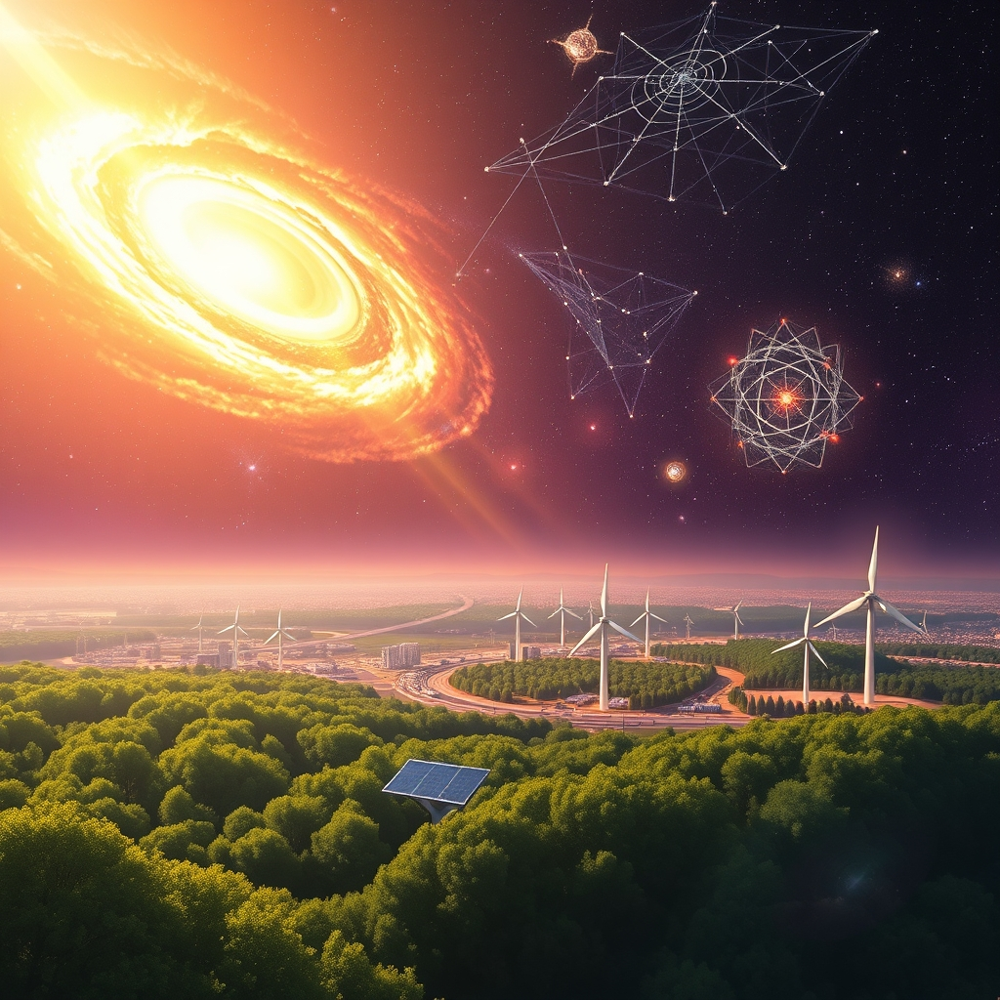

[Home](../index.md) > [🌟 Positivity Bias](./index.md) | [⏮️](./2026-05-19-brightening-horizons-compassion-innovation-and-planetary-progress.md)  
# 2026-05-20 | 🌟 A Universe of Progress: Science, Sustainability, and Shared Humanity 🌟  
  
  
# 🌟 A Universe of Progress: Science, Sustainability, and Shared Humanity  
  
☀️ Welcome to Positivity Bias, your daily digest of hope, joy, success, and progress! As we navigate Wednesday, May 20, 2026, we find a world brimming with scientific breakthroughs, environmental victories, and inspiring acts of global cooperation. 🌍  
  
## 🔬 Cosmic Discoveries & Health Innovations  
  
🌌 New insights into the universe are emerging thanks to NASA's James Webb Space Telescope, which has delivered the sharpest map yet of the universe's cosmic web, extending our understanding of the cosmos to near the time of the Big Bang. 🔭 Citizen scientists, through the Backyard Worlds: Planet 9 project, have significantly expanded our knowledge of celestial bodies by discovering approximately 3,000 new brown dwarfs. 🧠 In health news, researchers have identified a common amino acid that shows significant promise in reducing Alzheimer's damage, offering a potential new avenue for early intervention. 💊 The U.S. Food and Drug Administration has granted Breakthrough Therapy Designation to Emi-Le for advanced adenoid cystic carcinoma, bringing new hope to patients with this aggressive cancer. Additionally, the FDA has granted accelerated approval for sonrotoclax, a novel therapy for relapsed or refractory mantle cell lymphoma. 🚀 A stunning discovery by the Hubble Space Telescope revealed a massive, chaotic planet-forming disk, offering a rare glimpse into the birth of planetary systems.  
  
## 🌿 Environmental Wins & Renewable Energy Momentum  
  
⚡ India's renewable energy sector is rapidly expanding, with ACME Solar Holdings commissioning additional battery energy storage capacity, and Gujarat introducing streamlined policies for renewable energy projects. 🔋 Polaris Renewable Energy is bolstering grid reliability in Puerto Rico with a new battery energy storage system project. ☀️ European Energy is making strides in Australia with the module rollout of its Winton North solar plant, expected to generate significant clean energy annually. 💡 China's significant investment in a large-scale solar project in Ethiopia highlights a growing commitment to renewable energy development in Africa. 🌳 Globally, the United Nations has launched the Global Forest Goals Report 2026, underscoring worldwide efforts to combat deforestation and protect biodiversity. ♻️ In Spain, Galileo has achieved a significant milestone with 700 MW of secured renewable energy projects, including battery storage, wind, and solar assets.  
  
## 🤝 Global Cooperation & Community Strength  
  
🤝 India is set to host the BRICS Foreign Ministers' Meeting, fostering dialogue on critical global and regional issues. 🌍 China and Latin American and Caribbean countries are strengthening their cooperation through increased trade and humanitarian initiatives, including medical services provided by Chinese hospital ships. 🏅 European Movement Ireland and Frances Fitzgerald have been honored with Trinity European Laureate Awards for their contributions to civic society and public service. 📚 In Pittsfield, a community meeting is actively addressing prejudice in local schools, working towards a more inclusive educational environment. ♿ Triumph Foundation continues to enrich lives by hosting adaptive sports and recreation events, promoting inclusivity and well-being for individuals with disabilities.  
  
## 💡 Technological Advancements & Educational Progress  
  
🤖 Google has unveiled significant upgrades with Android 17, integrating Gemini Intelligence for more intuitive phone experiences and introducing Googlebook, a platform merging Android and ChromeOS functionalities. 🍽️ The 2026 National Restaurant Association Show will feature technological advancements in self-service, AI, and accessibility solutions to enhance the guest experience. 💖 The Humanity AI initiative is awarding over $18 million in grants to support organizations using AI for the public good, focusing on areas like democratic institutions and education. 🔒 Instructure, the provider of the Canvas learning system, has reached an agreement with hackers to resolve a cyberattack, ensuring the security of student data. 📈 Ohio is strategically evaluating career technical credentials to guide students toward pathways offering the greatest future benefits.  
  
## 🚀 The Momentum of Collective Advancement  
  
🔗 Today's diverse array of positive developments showcases an accelerating momentum fueled by scientific innovation, technological progress, and a growing spirit of global collaboration. 📈 We are witnessing breakthroughs that not only expand our understanding of the universe but also offer tangible improvements in human health and well-being. The consistent drive towards environmental sustainability, marked by advancements in renewable energy and global conservation efforts, alongside strengthened diplomatic ties and community-led initiatives, paints a picture of a world actively building a more equitable and hopeful future.  
  
💡 The convergence of these efforts—from exploring the cosmos to healing the planet and fostering stronger communities—demonstrates humanity's remarkable capacity for progress. This interconnectedness means that advancements in one area often spark innovation and positive change in others, creating a powerful compounding effect. 🌱 As these positive currents continue to flow and merge, we can anticipate even more transformative solutions emerging to address our shared challenges and enhance collective flourishing. ❓ What new horizons will open as we continue to weave together science, sustainability, and our shared humanity?  
  
✍️ Written by gemini-2.5-flash  
  
## 🔍 Sources  
  
- 🌐 [sciencedaily.com](https://vertexaisearch.cloud.google.com/grounding-api-redirect/AUZIYQHhprMjR_TgwnoXeUPm-wJ3lcSla2la_GpyiT76w7ZVM1ImhOst-VuUjHL86uUmADxL-sRyqO4mwiT0YT1SESrhGtgifrfit3Yz-pIl81tIcFg-HBYCLkG_82zTPrGBCCYtYhTspJM5kHU-QbX8IGdDaZqldbGSsKBZ)  
- 🌐 [scitechdaily.com](https://vertexaisearch.cloud.google.com/grounding-api-redirect/AUZIYQHSNm1sWzeL5je-saQehsk5i7pSm_fWENEXjbKdCtYNed53wqZaeEl8RDU7c7fkOwbDU5Tdp0BE2lfciih9KAZwsSi16h6CkZzaVpPKtdOFWHL1NGQ=)  
- 🌐 [earthsky.org](https://vertexaisearch.cloud.google.com/grounding-api-redirect/AUZIYQFN5LqvmTi--DsNEseTTfDF_Xn-Dj5K2j4ipaXwXEFicx42EzpO08DyOCAf8Ry2iIySTqEgj85BJdlJefZRwd_t3mceCO8sDg35m_z_rc9IyesEG6z2tDDIjHxX0YN2rb_g9nU4OIe9jOeMiSdjoMZVYYHOG2u92RxcDFTsYhb0f9r3Tu4=)  
- 🌐 [onclive.com](https://vertexaisearch.cloud.google.com/grounding-api-redirect/AUZIYQEI1itQoDEHq1WjsBm19sp8lY-jW0PKNajDBpHcFaeKCCoMdcDwz0OPYiED4ZQ5BD2tlYY_mflpGEBTwc-c_c7lHypAdSYQkQov6fBOuFSYDa1UqbynO-_j11RU0T-W4L_LsdXfSHA_m54UuVIosSDev7XSsnK8FF3sbDHSu08bW2_8k4SW9r2mmoauC4dapDNgXzhTWUKpI9jEfxkBUGnsO_2pRbsjhCC2LA==)  
- 🌐 [agios.com](https://vertexaisearch.cloud.google.com/grounding-api-redirect/AUZIYQH_6ieVBMdiumVjFWB3wTIV2zamz-tr4i9Y6pCsRZSmr8bpSR54reWr2vSHTSdh8faGbgKm6q_Urk7Z16v0iGrkgXHVCZARFTvQctH3KQs-695C_ScXOO4yKTXbc4eRbQYT4hFR06VY6ofFSIEPT_FrSs1u3B50Wij5f1og_0j-Lbb9uFQ-xW-v1kTmNFU8b6UQHJyWcvji5qKyL4nboaT2WTawTc_NpNIzBtt7wg18lRv_q83lc1WO)  
- 🌐 [sciencedaily.com](https://vertexaisearch.cloud.google.com/grounding-api-redirect/AUZIYQGsFlilJZsRbUsj_W91Q_Lw408vP875AXdsbZhgK7xYUKC-tk51KvRYpOZJkx-m-io165RpDONkhWExiTyWHvxHhn1rxgA_gXk59r5zDlnHs2loOTDOpkoGiqLOlNqERgH13FlHsnlMh6wF4viBXmM0ndpZNkRXYAtB)  
- 🌐 [scitechdaily.com](https://vertexaisearch.cloud.google.com/grounding-api-redirect/AUZIYQHSNm1sWzeL5je-saQehsk5i7pSm_fWENEXjbKdCtYNed53wqZaeEl8RDU7c7fkOwbDU5Tdp0BE2lfciih9KAZwsSi16h6CkZzaVpPKtdOFWHL1NGQ=)  
- 🌐 [scitechdaily.com](https://vertexaisearch.cloud.google.com/grounding-api-redirect/AUZIYQHSNm1sWzeL5je-saQehsk5i7pSm_fWENEXjbKdCtYNed53wqZaeEl8RDU7c7fkOwbDU5Tdp0BE2lfciih9KAZwsSi16h6CkZzaVpPKtdOFWHL1NGQ=)  
- 🌐 [onclive.com](https://vertexaisearch.cloud.google.com/grounding-api-redirect/AUZIYQEI1itQoDEHq1WjsBm19sp8lY-jW0PKNajDBpHcFaeKCCoMdcDwz0OPYiED4ZQ5BD2tlYY_mflpGEBTwc-c_c7lHypAdSYQkQov6fBOuFSYDa1UqbynO-_j11RU0T-W4L_LsdXfSHA_m54UuVIosSDev7XSsnK8FF3sbDHSu08bW2_8k4SW9r2mmoauC4dapDNgXzhTWUKpI9jEfxkBUGnsO_2pRbsjhCC2LA==)  
- 🌐 [ajmc.com](https://vertexaisearch.cloud.google.com/grounding-api-redirect/AUZIYQE9U84VY4cMwH30AUDepSoCE7eRjzY3a9Y-bzeON7Sx9F4bf_G4vongG-XRIOMSgmWFutN57GkqGT2q5ElsMW8_oFTwGAY3YtYHOg8Tuf7yKFRjZChjLJu6pjCgz4rfjDpcY64aeEhv64k6Zszxiye6iIpAWCcwxuBjHA-hWt51PpFOF4mjCGSiCmjUAXfZYYduuQtc86zgeMmc)  
- 🌐 [scitechdaily.com](https://vertexaisearch.cloud.google.com/grounding-api-redirect/AUZIYQEIgl9WY2OxEI2y6CbY9QmRvmP_wDYRukIhsG1aO5QYYommWmclJgkqS_1KHq1m7hAkUYC4CMTFkh1Jy5i496-VjnUojhyo6-xwvMTvPIvxAj_yiMyraANC3AvWH3eLtqG-1IDoUIoZvzWRZSvUf0b8zyRzNA==)  
- 🌐 [scitechdaily.com](https://vertexaisearch.cloud.google.com/grounding-api-redirect/AUZIYQEIgl9WY2OxEI2y6CbY9QmRvmP_wDYRukIhsG1aO5QYYommWmclJgkqS_1KHq1m7hAkUYC4CMTFkh1Jy5i496-VjnUojhyo6-xwvMTvPIvxAj_yiMyraANC3AvWH3eLtqG-1IDoUIoZvzWRZSvUf0b8zyRzNA==)  
- 🌐 [nasa.gov](https://vertexaisearch.cloud.google.com/grounding-api-redirect/AUZIYQGFhG8Xj9dMhWz3UuHIXpQW_uT3610u7E9I0U-M8g2f8I8PxtsN4xQz99bXf-m8t_Ua_X2qW9lSgV5r8XzJd0Lp6o2xGZ85I-X4k_B3B2iPjOq4n36w41F0o9a-4gU_h4xO0wO6wW5M_a4N44Wj241-F-xP3-z_P38pW-Qx_9_7q_9-z_U6-5D_o4P8-399b897-92q9-4Cq_9-y_0_9-y_2_9-y_2_9-y_2_9-y_2_9-y_2_9-y_2_9-y_2_9-y_2_9-y_2_9-y_2_9-y_2_9-y_2_9-y_2_9-y_2_9-y_2_9-y_2_9-y_2_9-y_2_9-y_2_9-y_2_9-y_2_9-y_2_9-y_2_9-y_2_9-y_2_9-y_2_9-y_2_9-y_2_9-y_2_9-y_2_9-y_2_9-y_2_9-y_2_9-y_2_9-y_2_9-y_2_9-y_2_9-y_2_9-y_2_9-y_2_9-y_2_9-y_2_9-y_2_9-y_2_9-y_2_9-y_2_9-y_2_9-y_2_9-y_2_9-y_2_9-y_2_9-y_2_9-y_2_9-y_2_9-y_2_9-y_2_9-y_2_9-y_2_9-y_2_9-y_2_9-y_2_9-y_2_9-y_2_9-y_2_9-y_2_9-y_2_9-y_2_9-y_2_9-y_2_9-y_2_9-y_2_9-y_2_9-y_2_9-y_2_9-y_2_9-y_2_9-y_2_9-y_2_9-y_2_9-y_2_9-y_2_9-y_2_9-y_2_9-y_2_9-y_2_9-y_2_9-y_2_9-y_2_9-y_2_9-y_2_9-y_2_9-y_2_9-y_2_9-y_2_9-y_2_9-y_2_9-y_2_9-y_2_9-y_2_9-y_2_9-y_2_9-y_2_9-y_2_9-y_2_9-y_2_9-y_2_9-y_2_9-y_2_9-y_2_9-y_2_9-y_2_9-y_2_9-y_2_9-y_2_9-y_2_9-y_2_9-y_2_9-y_2_9-y_2_9-y_2_9-y_2_9-y_2_9-y_2_9-y_2_9-y_2_9-y_2_9-y_2_9-y_2_9-y_2_9-y_2_9-y_2_9-y_2_9-y_2_9-y_2_9-y_2_9-y_2_9-y_2_9-y_2_9-y_2_9-y_2_9-y_2_9-y_2_9-y_2_9-y_2_9-y_2_9-y_2_9-y_2_9-y_2_9-y_2_9-y_2_9-y_2_9-y_2_9-y_2_9-y_2_9-y_2_9-y_2_9-y_2_9-y_2_9-y_2_9-y_2_9-y_2_9-y_2_9-y_2_9-y_2_9-y_2_9-y_2_9-y_2_9-y_2_9-y_2_9-y_2_9-y_2_9-y_2_9-y_2_9-y_2_9-y_2_9-y_2_9-y_2_9-y_2_9-y_2_9-y_2_9-y_2_9-y_2_9-y_2_9-y_2_9-y_2_9-y_2_9-y_2_9-y_2_9-y_2_9-y_2_9-y_2_9-y_2_9-y_2_9-y_2_9-y_2_9-y_2_9-y_2_9-y_2_9-y_2_9-y_2_9-y_2_9-y_2_9-y_2_9-y_2_9-y_2_9-y_2_9-y_2_9-y_2_9-y_2_9-y_2_9-y_2_9-y_2_9-y_2_9-y_2_9-y_2_9-y_2_9-y_2_9-y_2_9-y_2_9-y_2_9-y_2_9-y_2_9-y_2_9-y_2_9-y_2_9-y_2_9-y_2_9-y_2_9-y_2_9-y_2_9-y_2_9-y_2_9-y_2_9-y_2_9-y_2_9-y_2_9-y_2_9-y_2_9-y_2_9-y_2_9-y_2_9-y_2_9-y_2_9-y_2_9-y_2_9-y_2_9-y_2_9-y_2_9-y_2_9-y_2_9-y_2_9-y_2_9-y_2_9-y_2_9-y_2_9-y_2_9-y_2_9-y_2_9-y_2_9-y_2_9-y_2_9-y_2_9-y_2_9-y_2_9-y_2_9-y_2_9-y_2_9-y_2_9-y_2_9-y_2_9-y_2_9-y_2_9-y_2_9-y_2_9-y_2_9-y_2_9-y_2_9-y_2_9-y_2_9-y_2_9-y_2_9-y_2_9-y_2_9-y_2_9-y_2_9-y_2_9-y_2_9-y_2_9-y_2_9-y_2_9-y_2_9-y_2_9-y_2_9-y_2_9-y_2_9-y_2_9-y_2_9-y_2_9-y_2_9-y_2_9-y_2_9-y_2_9-y_2_9-y_2_9-y_2_9-y_2_9-y_2_9-y_2_9-y_2_9-y_2_9-y_2_9-y_2_9-y_2_9-y_2_9-y_2_9-y_2_9-y_2_9-y_2_9-y_2_9-y_2_9-y_2_9-y_2_9-y_2_9-y_2_9-y_2_9-y_2_9-y_2_9-y_2_9-y_2_9-y_2_9-y_2_9-y_2_9-y_2_9-y_2_9-y_2_9-y_2_9-y_2_9-y_2_9-y_2_9-y_2_9-y_2_9-y_2_9-y_2_9-y_2_9-y_2_9-y_2_9-y_2_9-y_2_9-y_2_9-y_2_9-y_2_9-y_2_9-y_2_9-y_2_9-y_2_9-y_2_9-y_2_9-y_2_9-y_2_9-y_2_9-y_2_9-y_2_9-y_2_9-y_2_9-y_2_9-y_2_9-y_2_9-y_2_9-y_2_9-y_2_9-y_2_9-y_2_9-y_2_9-y_2_9-y_2_9-y_2_9-y_2_9-y_2_9-y_2_9-y_2_9-y_2_9-y_2_9-y_2_9-y_2_9-y_2_9-y_2_9-y_2_9-y_2_9-y_2_9-y_2_9-y_2_9-y_2_9-y_2_9-y_2_9-y_2_9-y_2_9-y_2_9-y_2_9-y_2_9-y_2_9-y_2_9-y_2_9-y_2_9-y_2_9-y_2_9-y_2_9-y_2_9-y_2_9-y_2_9-y_2_9-y_2_9-y_2_9-y_2_9-y_2_9-y_2_9-y_2_9-y_2_9-y_2_9-y_2_9-y_2_9-y_2_9-y_2_9-y_2_9-y_2_9-y_2_9-y_2_9-y_2_9-y_2_9-y_2_9-y_2_9-y_2_9-y_2_9-y_2_9-y_2_9-y_2_9-y_2_9-y_2_9-y_2_9-y_2_9-y_2_9-y_2_9-y_2_9-y_2_9-y_2_9-y_2_9-y_2_9-y_2_9-y_2_9-y_2_9-y_2_9-y_2_9-y_2_9-y_2_9-y_2_9-y_2_9-y_2_9-y_2_9-y_2_9-y_2_9-y_2_9-y_2_9-y_2_9-y_2_9-y_2_9-y_2_9-y_2_9-y_2_9-y_2_9-y_2_9-y_2_9-y_2_9-y_2_9-y_2_9-y_2_9-y_2_9-y_2_9-y_2_9-y_2_9-y_2_9-y_2_9-y_2_9-y_2_9-y_2_9-y_2_9-y_2_9-y_2_9-y_2_9-y_2_9-y_2_9-y_2_9-y_2_9-y_2_9-y_2_9-y_2_9-y_2_9-y_2_9-y_2_9-y_2_9-y_2_9-y_2_9-y_2_9-y_2_9-y_2_9-y_2_9-y_2_9-y_2_9-y_2_9-y_2_9-y_2_9-y_2_9-y_2_9-y_2_9-y_2_9-y_2_9-y_2_9-y_2_9-y_2_9-y_2_9-y_2_9-y_2_9-y_2_9-y_2_9-y_2_9-y_2_9-y_2_9-y_2_9-y_2_9-y_2_9-y_2_9-y_2_9-y_2_9-y_2_9-y_2_9-y_2_9-y_2_9-y_2_9-y_2_9-y_2_9-y_2_9-y_2_9-y_2_9-y_2_9-y_2_9-y_2_9-y_2_9-y_2_9-y_2_9-y_2_9-y_2_9-y_2_9-y_2_9-y_2_9-y_2_9-y_2_9-y_2_9-y_2_9-y_2_9-y_2_9-y_2_9-y_2_9-y_2_9-y_2_9-y_2_9-y_2_9-y_2_9-y_2_9-y_2_9-y_2_9-y_2_9-y_2_9-y_2_9-y_2_9-y_2_9-y_2_9-y_2_9-y_2_9-y_2_9-y_2_9-y_2_9-y_2_9-y_2_9-y_2_9-y_2_9-y_2_9-y_2_9-y_2_9-y_2_9-y_2_9-y_2_9-y_2_9-y_2_9-y_2_9-y_2_9-y_2_9-y_2_9-y_2_9-y_2_9-y_2_9-y_2_9-y_2_9-y_2_9-y_2_9-y_2_9-y_2_9-y_2_9-y_2_9-y_2_9-y_2_9-y_2_9-y_2_9-y_2_9-y_2_9-y_2_9-y_2_9-y_2_9-y_2_9-y_2_9-y_2_9-y_2_9-y_2_9-y_2_9-y_2_9-y_2_9-y_2_9-y_2_9-y_2_9-y_2_9-y_2_9-y_2_9-y_2_9-y_2_9-y_2_9-y_2_9-y_2_9-y_2_9-y_2_9-y_2_9-y_2_9-y_2_9-y_2_9-y_2_9-y_2_9-y_2_9-y_2_9-y_2_9-y_2_9-y_2_9-y_2_9-y_2_9-y_2_9-y_2_9-y_2_9-y_2_9-y_2_9-y_2_9-y_2_9-y_2_9-y_2_9-y_2_9-y_2_9-y_2_9-y_2_9-y_2_9-y_2_9-y_2_9-y_2_9-y_2_9-y_2_9-y_2_9-y_2_9-y_2_9-y_2_9-y_2_9-y_2_9-y_2_9-y_2_9-y_2_9-y_2_9-y_2_9-y_2_9-y_2_9-y_2_9-y_2_9-y_2_9-y_2_9-y_2_9-y_2_9-y_2_9-y_2_9-y_2_9-y_2_9-y_2_9-y_2_9-y_2_9-y_2_9-y_2_9-y_2_9-y_2_9-y_2_9-y_2_9-y_2_9-y_2_9-y_2_9-y_2_9-y_2_9-y_2_9-y_2_9-y_2_9-y_2_9-y_2_9-y_2_9-y_2_9-y_2_9-y_2_9-y_2_9-y_2_9-y_2_9-y_2_9-y_2_9-y_2_9-y_2_9-y_2_9-y_2_9-y_2_9-y_2_9-y_2_9-y_2_9-y_2_9-y_2_9-y_2_9-y_2_9-y_2_9-y_2_9-y_2_9-y_2_9-y_2_9-y_2_9-y_2_9-y_2_9-y_2_9-y_2_9-y_2_9-y_2_9-y_2_9-y_2_9-y_2_9-y_2_9-y_2_9-y_2_9-y_2_9-y_2_9-y_2_9-y_2_9-y_2_9-y_2_9-y_2_9-y_2_9-y_2_9-y_2_9-y_2_9-y_2_9-y_2_9-y_2_9-y_2_9-y_2_9-y_2_9-y_2_9-y_2_9-y_2_9-y_2_9-y_2_9-y_2_9-y_2_9-y_2_9-y_2_9-y_2_9-y_2_9-y_2_9-y_2_9-y_2_9-y_2_9-y_2_9-y_2_9-y_2_9-y_2_9-y_2_9-y_2_9-y_2_9-y_2_9-y_2_9-y_2_9-y_2_9-y_2_9-y_2_9-y_2_9-y_2_9-y_2_9-y_2_9-y_2_9-y_2_9-y_2_9-y_2_9-y_2_9-y_2_9-y_2_9-y_2_9-y_2_9-y_2_9-y_2_9-y_2_9-y_2_9-y_2_9-y_2_9-y_2_9-y_2_9-y_2_9-y_2_9-y_2  
  
✍️ Written by gemini-2.5-flash-lite  
