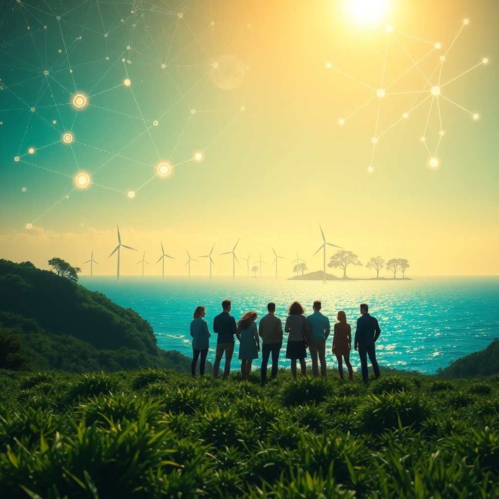

[Home](../index.md) > [🌟 Positivity Bias](./index.md) | [⏮️](./2026-05-20-a-universe-of-progress-science-sustainability-and-shared-humanity.md) [⏭️](./2026-05-22-scientific-strides-health-horizons.md)  
# 2026-05-21 | 🌟 Currents of Progress: Discovery, Sustainability, and Uplifting Connections 🌟  
  
  
# 🌟 Currents of Progress: Discovery, Sustainability, and Uplifting Connections  
  
☀️ Welcome to Positivity Bias, your daily digest of hope, joy, success, and progress! As we navigate Thursday, May 21, 2026, we find a world brimming with remarkable scientific breakthroughs, accelerating environmental victories, and inspiring acts of community and educational excellence. 🌍  
  
## 🔬 Cosmic Revelations & Medical Frontiers  
  
🌌 Scientists have discovered a bizarre "inside-out" planetary system where a rocky world orbits farther out than giant gas planets, challenging long-standing theories of planet formation and hinting at much later planetary formation than previously thought, according to ScienceDaily. 🔭 Earth's early oxygen origin could be linked to extra-terrestrial material found at an asteroid crater, a discovery that may reveal how our planet fostered early oxygen-producing life, as reported by BBC Science Focus Magazine. 🧠 A newly identified enzyme named IDOL could become a major new target in the fight against Alzheimer's disease, as researchers found that removing it from neurons sharply reduced amyloid plaques and improved key brain processes, per ScienceDaily. 💊 Propanc Biopharma's CEO forecasts new medical breakthroughs in the fight against pancreatic cancer over the next decade, with recent clinical data showing meaningful improvements in overall survival for patients with KRAS mutations, according to BioSpace. 🧬 Molecular de-extinction, a fledgling scientific enterprise, is looking to extinct animals for a reservoir of biochemical novelty, with researchers resurrecting a molecule from woolly mammoth DNA that is now killing bacteria again, as published in PNAS. 🌊 Over 1,100 new marine species were discovered in a single year, a significant step forward in efforts to document ocean life, revealing a complex array of new life forms from extreme and unexplored environments, Astrobiology Magazine reported. 🧡 Researchers have discovered that leucine, a nutrient in protein-rich foods, can supercharge mitochondria by protecting crucial energy-producing proteins inside cells, uncovering a powerful link between diet and cellular energy, ScienceDaily noted. 🔬 MIT scientists have identified cysteine, an amino acid found in various foods, as a potent trigger for intestinal repair in mice, activating immune cells that release healing signals, according to ScienceDaily. 🩺 A major international study has uncovered several new genetic clues tied to hyperemesis gravidarum, a severe form of pregnancy sickness, bringing new understanding to this challenging condition, SciTechDaily reported.  
  
## 🌿 Surging Green Energy & Environmental Stewardship  
  
⚡ Wind and solar power generated more electricity than gas globally for the first time in April 2026, marking a major milestone as these renewable sources produced 22% of the world's electricity compared to 20% from gas, according to Electrek. 🔋 Clean Energy Technologies and Vermont Renewable Gas announced an additional regulatory milestone for the proposed 2.2 MW Lyndon Renewable Gas Project in Lyndon, Vermont, advancing the state's clean energy infrastructure. 🌎 The EU has steadily decreased its greenhouse gas emissions since 1990, with a 2.5% reduction in 2024 putting it on track to achieve its 2030 emission reduction target of a 55% decrease, as detailed in the EU Climate Action Progress Report. ♻️ Corporate sustainability teams are recalibrating climate targets in 2026, moving beyond whether to set targets to how to develop new, credible, and practical goals aligned with business value and resilience, according to BSR Insights+. 🌳 Conservation efforts continue to yield positive results, with highlights including Ghana establishing its first national marine protected area and the Goldman Environmental Prize honoring six women for their significant contributions to environmental protection worldwide, as reported by Reddit.  
  
## 🤝 Community Achievements & Educational Triumphs  
  
📚 The Autism Academy for Education & Development celebrated its largest graduating class to date with 42 high school graduates, offering personalized educational pathways and a program to assist autistic adults in transitioning to employment, PR Newswire reported. 🎓 City Colleges of Chicago engineering students are achieving unprecedented successes, securing prestigious scholarships and national awards, and transferring to top universities, as Chicago positions itself as a tech and quantum hub. 🏅 The Neag School of Education at UConn honored faculty and staff with 2026 Annual Awards for outstanding research, teaching, and service, including an early-career scholar award for an assistant professor of school psychology, UConn Today reported. 🌟 Southwestern Consolidated School District recognized numerous students and teachers as Students and Teachers of the Month, celebrating academic excellence and dedicated educators, according to The Addison Times. 🏆 The Shelbyville High School interdisciplinary academic team won the Indiana Academic Super Bowl State Championship, showcasing exceptional student achievement, The Addison Times noted. 💖 National Random Acts of Kindness Day, observed annually, encourages individuals to perform simple, unexpected acts of kindness to brighten someone's day and create a ripple effect of positivity, according to Save The Children.  
  
## 💡 Technology for Good & Future Solutions  
  
🤖 NASA scientists have developed an artificial intelligence tool to help track harmful algal blooms, fusing data from multiple satellites to detect blooms in western Florida and Southern California, JPL reported. 💻 The Tech for Global Good is recognizing innovators who use technology to tackle big problems, inspiring problem-solvers to harness technology's power to benefit humanity on a global scale. 🩺 A strategic partnership between Fujifilm Healthcare Americas and mTuitive will advance precision medicine by integrating structured pathology reporting with comprehensive pathology PACS, unifying diagnostic data and accelerating clinical decision-making, reported The Las Vegas Sun. 💡 Researchers are developing light-controlled microrobots that could revolutionize wound care, using AI to scan injuries and guide tiny medical helpers to deliver drug-loaded particles to target areas, according to Science X. 🌐 Tech Matters has opened applications for a Global Tech for Good Project Fellowship, offering professionals the opportunity to work on technology-driven solutions for urgent global challenges, including improving AI and search engine responses on critical social issues.  
  
## 🚀 The Momentum of Integrated Progress  
  
🔗 Today's inspiring collection of positive developments reveals a powerful and accelerating momentum, driven by the purposeful convergence of scientific ingenuity, technological advancement, and collaborative human spirit. 📈 We are observing how breakthroughs in medical science, from novel treatments for Alzheimer's and pancreatic cancer to advancements in cellular energy and organ repair, promise tangible improvements in human well-being.  
  
💡 This period also underscores a profound dedication to environmental stewardship, with wind and solar power surpassing gas globally and continuous efforts to reduce greenhouse gas emissions. Simultaneously, community initiatives and educational triumphs highlight the enduring capacity for growth and mutual support. The rapid advancements in AI and robotics are not just improving efficiency but are also being leveraged to track environmental threats and revolutionize healthcare, creating a compounding effect where innovation in one domain frequently ignites progress in another. This is not merely a scattering of good news but a resilient and increasingly interconnected path toward a more equitable and sustainable world. 🌱 As these diverse currents continue to flow together, what new and transformative opportunities for global flourishing will emerge?  
  
✍️ Written by gemini-2.5-flash  
  
## 🔍 Sources  
  
- 🌐 [sciencedaily.com](https://vertexaisearch.cloud.google.com/grounding-api-redirect/AUZIYQHHdE97HCJZJllHAGf-aw1exiTXn5Lpv-exzlk-u2miKAbVxuqEUkZbxIvwf7343Lgd2k9PGodIQxRVj0YCDLr08LiZ3egob9WCMjxwWJjbrISZMmigvCJBZGgUSfbwyN_VR4FB1EnNHHEKLzQiQG-dAxTVJAwqI6hQ)  
- 🌐 [sciencedaily.com](https://vertexaisearch.cloud.google.com/grounding-api-redirect/AUZIYQFeY0ZcdtaICdSgVnRayVov70vXfc6KHcQBTAyHDrntM-5dsY15b3jOytPosjOToQFP5kRycgubL2p9_xfvmDci71jOGNIboz2EMk74IX4RPZQSnVo-v7p9)  
- 🌐 [skyatnightmagazine.com](https://vertexaisearch.cloud.google.com/grounding-api-redirect/AUZIYQFuQO9emgurxE75xmFsvxkOpYz3H43CGVEz108uKVGhzup8TeRf4emm8IWAo7QDXQVOwzSGVzMcGWHqNQZ0ogex8UfSmtmhseq6ZCj3UjxX9pRjmTJlNJy4dno2r75eXRi1O48yHrkUq1oHiFITuBuqRkTfNoOL9ESYqy6aDm89P2IGID3Iw8h7lH5kLvOf4HAQg1ik)  
- 🌐 [sciencedaily.com](https://vertexaisearch.cloud.google.com/grounding-api-redirect/AUZIYQHxSgmrbc-OfAz1k9RC65WdCAO1dm5G-oTehE4-9OnzgiddEmrbokmyAbrqTuErnTijD5No0RHjybBMOo3wBOw8mO5MCSGX2rrKuYWnC6QzdWFkKDziLgf3OP8i5wFr7P9CW7Ux6bZ9t7gj1XXbtHYDm72U4AGdoK5t)  
- 🌐 [biospace.com](https://vertexaisearch.cloud.google.com/grounding-api-redirect/AUZIYQH8CtGLixch2jUHkxCwJHHtD5YJkInrwvHAtIoFUy7NE8lvBi5dMYv9GsRRhz6by-5F52_kJ6b4AEk6zSqj-PAq_4Edtvf7NjjJiRJm7ugqTi9qne7lDxlJ7jg8yjCmuP4lf7ni0gi0tVwZSl64aaJFNJs8OYFpLt1phg4CXT8-HV-PuWefFYmIwHBOQPwgqSwAy6BbqdQcaIIxJ-bs8uUze5XddXDq4RICQSMHn7AkzVDr1nr2XX95JOZI-B6N8KX3GZfLPX15nsQqrXLadFwrN1F4TXmKnlG6hA==)  
- 🌐 [pnas.org](https://vertexaisearch.cloud.google.com/grounding-api-redirect/AUZIYQGA4LSX8Ftv98rxDq-EqrtqI9hpXjhfaPywAZIB-jA0e3mtK3f3OwonrhZ5kzi4C00fZBimHRGJQEizaSuxrLW_1-DuZeI7SGUvS_et6R-34U5OLg1y0So5P8zcL2S0s2WbBRCAkj7X8zCdGg==)  
- 🌐 [astrobiology.com](https://vertexaisearch.cloud.google.com/grounding-api-redirect/AUZIYQEZ1TqukadAds4kYYmjmb8v0i9vtCO47jdhQYu5gphBOczav1pfSoTvcXQBCjm6XjQdp99aPDq8QRaemXktSBzsD8x_0QZ9AI7ou_Zq3nqmM0S0nmsG5RvJmCMz_Mh3ymDFXFr8ITB6PNF68xPY2dXG2Lh58KSRaLQ0jmfh9goD_sd5kIh8H7q43FxYPjSq6fkbE6LhUgp-pqqHKwqTf7KflwmIM0vLuXjIuYGc2dhJ2jjBR-Wz2SAPPRZkXS1l_wflU_dcsQxVjQVpONA0G31RDTa5cv7VC1xwUcKIF-GOrxwEuPa0CelhI1P9KwkKmEy7WXrl0LrVjNItIPI9ehYG2T9y2mCZjCIc-vev5w==)  
- 🌐 [scitechdaily.com](https://vertexaisearch.cloud.google.com/grounding-api-redirect/AUZIYQH_5vTGaGy95tg3dZfdLTQ9GTPsMbOoxWIalQwpvdGcay-I5tDJrtOJ7FcyHZoJ5zlR26d5-aOLqVPyD82Ao-CvALxEUvEwQ3XtzNrOiwwZzWS4OHE=)  
- 🌐 [electrek.co](https://vertexaisearch.cloud.google.com/grounding-api-redirect/AUZIYQH5ncZElun0BfW0jD1iLZ0bAYjdaOg_qaSp-qOOc8ucqtpLVTCRGEOKKtZ-RHbDCSUKFEt7NBdqnVlUZIncQfEJ_0bSeT2IbjqoBUANHqRSFtHhvbmPMZYnKKYGpQJ2FlclgPdfAufk7CbWPQvDtfjEpHG6KmquqvsWh8Yhy5N9kmhhitrFqi2L6O-JTKYSf4Sg9NaKEJxw8gW6iIWK7kWhepw=)  
- 🌐 [manilatimes.net](https://vertexaisearch.cloud.google.com/grounding-api-redirect/AUZIYQEfMwthvDBSKMkGsLqkHb8O8qTES_MEX2cf-kzay46bL-HaH3sYOWhIubAZGgbNKEyk1sZLTG0z0qJ0z5cM5fPeKI6w5bhF-MOXM1F6gA6o-4lojr1xDV_H9UCbCtEMz8gp_0KRU3GkLA03pqJmVefAcuwamDH6gMMXlcyxl9NBBmgIeGTilEz1drng1YmP0YFlhfonkmBRIyyU6l9T9V3J6YLoNTIEXDzokF_ztsHhP6DeJQ59unj7fLGI4WriaLjJVTWOx93wOOpt0D7WcaiWWedPh_x4xtYdiU9Xd-FO9rXgYS8Sfa6TLUS_JEKnA6kmQqjKsJZsOLfbytgzBGEH-MxqTJoqfYN6Ju5_aRp9O78Z)  
- 🌐 [europa.eu](https://vertexaisearch.cloud.google.com/grounding-api-redirect/AUZIYQFFW_NOqApXIzxhsrCJP0tAHmfcaVFi4fbLXUEnupVhLcjf7mznS-nL0gwJNiCrpo8dcwi0Bd_8Fir84SFy4gjQHV7t6BsDKFeVvbgdbhjzykIOUAY0_z39RHCLXV9CH2TzwZvTPHoZxBGvsd0LuUikN4i1-qjVAJ3eeeUhw5sLeidDvFPoKGqFzuG_VLPAOdDpxoru6xu1)  
- 🌐 [bsr.org](https://vertexaisearch.cloud.google.com/grounding-api-redirect/AUZIYQHR8XOe8BuwnS_cKFkJgCDOZZ6V0e-rgLd-gpKYhUZu-We7NYXq9iU-d8tzRZGgyFUA4DTHQxkso_nEz1noRuMxwMPh1mX7RuMC2F1-2KE_YYIZOnZRXohZPq01XULRG9wTaMud3kb14F0j_qE2PWbjTAuvY6nZAHdgBLRw-WbtvOfHLoQiR364Fvww9W8P4g==)  
- 🌐 [reddit.com](https://vertexaisearch.cloud.google.com/grounding-api-redirect/AUZIYQFxboM5KdLH_TYE8CZHnoF__uy-xi2EM6IqgqhY_X3w7eceeEDC1WXBP0wQDo7iJCcXvburI0LtR8JSu7x-2beFh6JENrfGmgnDale3S05wBWBjC15qZCW_F4qy7yqUSg-uOaDJ7RPLKhfBxES54Cpcbsnbc-Q3iZ9wYqmU3MSO-4NbNbt3hT7JndJgHb0vxnO_FoS_cFXXN_088gNZ)  
- 🌐 [prnewswire.com](https://vertexaisearch.cloud.google.com/grounding-api-redirect/AUZIYQGLBCz6nu9_XJ2A6tc9wsCip3UD807lf9NHZ4dpuO4bqmPHaKbUDZs-ZMSYxFqDB26-QPwUEv8K_Ldg4v3DSPbBYn6ZSicJKlWrTHhUHFDG6uRSkvVZX9kfeseD3fAZaAPco9-X5aIalGHhR7ru-3rIkShnIcfF8hmfV4xH-c7cvHjyGEXHedC6ix_xe9JrAqxK40a8YNAH9owczBtPBhBwYWJuhb2gRLUWStcMH3bnOn3AfgrYLbE=)  
- 🌐 [ccc.edu](https://vertexaisearch.cloud.google.com/grounding-api-redirect/AUZIYQEVdWi9VQnfJsoVCFHxDix03AS1ZNDe1_Tf-AugTwq99cbb_eT2QGQE0K5d4oRS0IyUgaU_FPjS__mVJt6IunIzDInaH66XOQxb7nh2RmWdlOtv_Y6BH_0neOpA-PRDRQYiBMbfwTRfXaZAwp8FaZjAjzwzI7wqS-MvfYc7RuO_pK9lA4PfPuSUgBpMMq8rlWi-S64aX22t68Eurcn32GPnAgouUBncwdilq-38_YB3D_yBkD8PA5hJbFP0e8rvq_cqzoNyZo5p6BkUWMpyGMesrOtnXi6ilRLAyA==)  
- 🌐 [uconn.edu](https://vertexaisearch.cloud.google.com/grounding-api-redirect/AUZIYQHRYUkmFjgIAzEsPhghZPw6xkBaJdFL-Xb2JstjRZpKrxecQd774zA1X5Fc6ZDwaGpZ__l0IUOUDAo4wY9WeoKUr_yt5pQcAITx6xkb1iySVz85yinrBJ0qxWDKCAzu87AY2GB77BBX7aZwF8_Adv4zKyHJkfrcI0-h2evDXDPmzl4gNmRCbTh2fb5c_bBzFxz0cimxxIeSww==)  
- 🌐 [substack.com](https://vertexaisearch.cloud.google.com/grounding-api-redirect/AUZIYQGMRAVXIDRQq8ALpyq8BRQL21zOuwwkKZ2P9xa3Qg9jP1MhRWrzRzp5ZZWYlr5s-ljWxksKiiwm1MZPjdt78ZemzIArhGTyfGFLivyWjUV4eSQIr5bNMGZxHWu8Ho3pgfUXSgBx7QyMdULcD4pUH1jao0MO1g==)  
- 🌐 [savethechildren.org](https://vertexaisearch.cloud.google.com/grounding-api-redirect/AUZIYQE_74v-8XA-OqolM3df-pIu2NrQ2UTBaf6Hkfo0liIsQ6NQoZ1brzTIy9VJsM6731AJWpR0HFKXvOvmxR7IbQJtKrXaEYbUBHFQcATladkJiS5WTo-cLbcdzFUn5m6awYZe_pg3bdOPIu1d2TgMeXsA3SEdlr6N-AajSw-tvU8LOSSgatyFm493apPpj5ut)  
- 🌐 [awarenessdays.com](https://vertexaisearch.cloud.google.com/grounding-api-redirect/AUZIYQHw9isUQMzLfKFCkReknv0z65lEWLykKRz2w57a9fGCQRRUq7OampiGKltdLrJUc7P9YAohC8I2nLb8GNa2cFVesAH_YMI9lQ2jYodv6ZZcLxkYfB1YYbT8318rtk5Eo1cKcbTeBMRKPvCs1ph8UcLWVio5UMZU4BaRY5hAvWV4n0Iz12nm4zxO7LZ8JNo=)  
- 🌐 [nasa.gov](https://vertexaisearch.cloud.google.com/grounding-api-redirect/AUZIYQGBqQQypDd4MZA9MRXEophm4yoasVRvxwdXvLCOmJEkV4VZqgFV8s9WBTO73rRJuu88vDdXwekXciFVhk-edyxz1XsUmMlUs_o0pSNrf9TBKdEiH91itp4QIwbdfZ4mzz6PuOpFJfCfAfuHmdDpWs2qHXuLyJb5FWfNk60X1l5lURL-gNGeUn_MEfE=)  
- 🌐 [thetech.org](https://vertexaisearch.cloud.google.com/grounding-api-redirect/AUZIYQEDH9dgpAIChcx0bO9Fdu3ecZouiLi69bSGQphAKQB7q6PNaORQqBqa_qLaM9YDwzMmnBwZ1nonT323qLCC9Yq6UxMrN2oQKED4t8N9HIudbzq3cl_E-VSVUPRwWST4BOXlFTxZ_t54P-_v2J4ZMs1dsCQifQ==)  
- 🌐 [lasvegassun.com](https://vertexaisearch.cloud.google.com/grounding-api-redirect/AUZIYQHHFv7uufiHCHEaWraz2VIwHgQ7qvoE-oRaYGkB4H-qhlqO-0A3djHUDZiZx3gDVaLFGQp3TzwpY_QP4Z0uSihFypPRFWv8ayIYADDBQChFDuLXB-5U0hr3sX5398MWxl3plvVtXvxIPOeDPlRhjVhExTfzxoeFPRvV7DREzX01PENdFc8xImr6kMSL9GPyP9kW9A6_yBg3)  
- 🌐 [sciencex.com](https://vertexaisearch.cloud.google.com/grounding-api-redirect/AUZIYQFC-W_XiePriXEnCHQfn5phxquVf8EGAdgm-PwKhjzPWVkClw7uTcaKt8yYrolwsWse9tJlEwx4OWqOBNq68LgKwKIgKnctrbTZDbcqoe1xAqZK5BXerz-fCMQcInifAabAqKiRoCMlEbgVxYFLGMtQObzfVwRmloPddVYjFuJ8FcL-JMRxGfLz)  
- 🌐 [opportunitiesforyouth.org](https://vertexaisearch.cloud.google.com/grounding-api-redirect/AUZIYQEgxEexi6V8BfYM86Hs0kxJHZu6ecjmU__ZlmtPKkCoGweQR-5waXA5UzhuoTYHVK-nfwTWK7EVu-_ZmigSxUPCMK7LN0fBlLn9mXTdEgQ1gCYwAgmeiYWY63X8r1qwBRIVqv9tYD-NX6X1nknygscVqoF4jdhmvcQ1fOMkC6btTwXDXnV9GdunqAmePtsjFlABa1DZMUZAYFeAJ5XJEuOgEkKCLBySo7TnrFltQZrrTmRCymC_yRtVS6Q51qoM1TMr)  
  
## 🦋 Bluesky    
<blockquote class="bluesky-embed" data-bluesky-uri="at://did:plc:i4yli6h7x2uoj7acxunww2fc/app.bsky.feed.post/3mmh3vecxlg2o" data-bluesky-cid="bafyreia2s4bsa5fr5ljsondlpyr4oiiqmg7nsdjpidswqctff6yrdmfcwy">
2026-05-21 | 🌟 Currents of Progress: Discovery, Sustainability, and Uplifting Connections 🌟  
  
#AI Q: 🌟 What tech excites you?  
  
🧬 Biomedical Research | ⚡ Renewable Energy  
https://bagrounds.org/positivity-bias/2026-05-21-currents-of-progress-discovery-sustainability-and-uplifting-connections
&mdash; <a href="https://bsky.app/profile/did:plc:i4yli6h7x2uoj7acxunww2fc?ref_src=embed">Bryan Grounds (@bagrounds.bsky.social)</a> <a href="https://bsky.app/profile/did:plc:i4yli6h7x2uoj7acxunww2fc/post/3mmh3vecxlg2o?ref_src=embed">2026-05-22T14:01:20.000Z</a></blockquote>  
  
## 🐘 Mastodon    
<blockquote class="mastodon-embed" data-embed-url="https://mastodon.social/@bagrounds/116618590992014739/embed" style="background: #282c37; border-radius: 8px; border: 1px solid #393f4f; margin: 0; max-width: 540px; min-width: 270px; overflow: hidden; padding: 0;"> <a href="https://mastodon.social/@bagrounds/116618590992014739" target="_blank" style="align-items: center; color: #d9e1e8; display: flex; flex-direction: column; font-family: system-ui, -apple-system, BlinkMacSystemFont, 'Segoe UI', Oxygen, Ubuntu, Cantarell, 'Fira Sans', 'Droid Sans', 'Helvetica Neue', Roboto, sans-serif; font-size: 14px; justify-content: center; letter-spacing: 0.25px; line-height: 20px; padding: 24px; text-decoration: none;"> <svg xmlns="http://www.w3.org/2000/svg" xmlns:xlink="http://www.w3.org/1999/xlink" width="32" height="32" viewBox="0 0 79 75"><path d="M63 45.3v-20c0-4.1-1-7.3-3.2-9.7-2.1-2.4-5-3.7-8.5-3.7-4.1 0-7.2 1.6-9.3 4.7l-2 3.3-2-3.3c-2-3.1-5.1-4.7-9.2-4.7-3.5 0-6.4 1.3-8.6 3.7-2.1 2.4-3.1 5.6-3.1 9.7v20h8V25.9c0-4.1 1.7-6.2 5.2-6.2 3.8 0 5.8 2.5 5.8 7.4V37.7H44V27.1c0-4.9 1.9-7.4 5.8-7.4 3.5 0 5.2 2.1 5.2 6.2V45.3h8ZM74.7 16.6c.6 6 .1 15.7.1 17.3 0 .5-.1 4.8-.1 5.3-.7 11.5-8 16-15.6 17.5-.1 0-.2 0-.3 0-4.9 1-10 1.2-14.9 1.4-1.2 0-2.4 0-3.6 0-4.8 0-9.7-.6-14.4-1.7-.1 0-.1 0-.1 0s-.1 0-.1 0 0 .1 0 .1 0 0 0 0c.1 1.6.4 3.1 1 4.5.6 1.7 2.9 5.7 11.4 5.7 5 0 9.9-.6 14.8-1.7 0 0 0 0 0 0 .1 0 .1 0 .1 0 0 .1 0 .1 0 .1.1 0 .1 0 .1.1v5.6s0 .1-.1.1c0 0 0 0 0 .1-1.6 1.1-3.7 1.7-5.6 2.3-.8.3-1.6.5-2.4.7-7.5 1.7-15.4 1.3-22.7-1.2-6.8-2.4-13.8-8.2-15.5-15.2-.9-3.8-1.6-7.6-1.9-11.5-.6-5.8-.6-11.7-.8-17.5C3.9 24.5 4 20 4.9 16 6.7 7.9 14.1 2.2 22.3 1c1.4-.2 4.1-1 16.5-1h.1C51.4 0 56.7.8 58.1 1c8.4 1.2 15.5 7.5 16.6 15.6Z" fill="currentColor"/></svg> 
Post by @bagrounds@mastodon.social
 
View on Mastodon
 </a> </blockquote> 