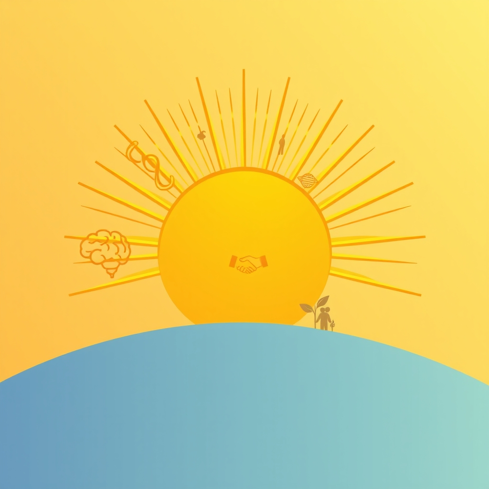

[Home](../index.md) > [🌟 Positivity Bias](./index.md) | [⏮️](./2026-05-25-waves-of-progress-discovery-diplomacy-and-flourishing-communities.md) [⏭️](./2026-05-27-horizons-of-hope-innovation-collaboration-and-nature-s-resilience.md)  
# 2026-05-26 | 🌟 ☀️ Dawn of Breakthroughs: Expanding Horizons in Science, Diplomacy, and Society 🌟  
  
  
# ☀️ Dawn of Breakthroughs: Expanding Horizons in Science, Diplomacy, and Society  
  
☀️ Welcome to Positivity Bias, your daily dose of good news and inspiring progress! As we embrace Tuesday, May 26, 2026, we find a world brimming with remarkable scientific breakthroughs, accelerating environmental victories, and inspiring acts of diplomacy and human innovation. 🌍  
  
## 🔬 Scientific & Health Frontiers  
  
🧠 Scientists have uncovered new details about how GLP-1 weight loss drugs, such as semaglutide, affect brain cells, shedding light on why effects can vary and plateau over time, and offering possible ways to extend their effectiveness, as reported by ScienceDaily. 💊 Researchers at USC have identified potential new drug compounds that may reduce brain inflammation linked to Alzheimer's disease, particularly in individuals with the high-risk APOE4 gene. 👃 Texas A&M researchers have developed a nasal spray that appears to reverse brain aging by calming inflammation and restoring the brain's energy systems. 🫘 A major analysis of global studies indicates that consuming more beans, lentils, chickpeas, tofu, and other soy foods could be a powerful way to combat high blood pressure. 🧪 Scientists at CERN's Large Hadron Collider may be seeing the strongest hints yet of physics beyond the Standard Model. 🚀 NASA's new electric propulsion engine has set a U.S. power record, offering a thruster powerful enough for future human missions to Mars, as reported by SciTechDaily. 🌌 Astronomers using the James Webb Space Telescope have found surprising evidence about how enormous super Jupiters form. 🧠 A new study reveals that the brain may handle voluntary and forced decisions using remarkably different pathways. 🦷 Drinking nitrate-rich beetroot juice may reshape mouth bacteria to help lower blood pressure in older adults, according to a large study.  
  
## 🌿 Environmental & Energy Progress  
  
⚡ Renewable energy generation in the United States increased by over 11% during the first quarter of 2026, with strong growth in solar, hydropower, wind, and battery energy storage capacity, according to data from the U.S. Energy Information Administration (EIA) reviewed by the SUN DAY Campaign. ☀️ Solar and wind power combined contributed more than 20% of total U.S. electricity generation in Q1 2026, surpassing nuclear and coal generation. 🔋 Nearly all new power generation capacity planned for the U.S. in 2026 is expected to come from solar, wind, and battery storage. 🌍 Globally, wind and solar generated more electricity than gas for the first time ever in April 2026, producing 22% of the world's electricity compared to 20% from gas, according to energy think tank Ember. 🌳 In China, firm solar-plus-storage is now more cost-effective than new coal-fired or gas-fired generation. 🏞️ The U.S. Fish & Wildlife Service highlighted the North American beaver as an impressive environmental engineer, whose dams and lodges create thriving wetlands benefiting countless other species.  
  
## 🤝 Diplomatic & Economic Cooperation  
  
🤝 China and Serbia are strengthening their comprehensive strategic partnership, with President Xi Jinping and Serbian President Aleksandar Vučić holding talks to deepen cooperation in infrastructure, energy, AI, and advanced manufacturing. 🇵🇰 China appreciates Pakistan's proactive role in mediating for peace in the Middle East, with discussions on regional stability held during a meeting between President Xi and Pakistani Prime Minister Shehbaz Sharif. 🇻🇳 Vietnam and the Philippines are boosting cooperation in food security, with rice trade emerging as a key pillar of their partnership, marking the 50th anniversary of diplomatic ties. 🇮🇳 Indian External Affairs Minister S. Jaishankar hailed a very deep and broad-based cooperation during his hosting of US Secretary of State Marco Rubio in New Delhi. 💸 The International Conference on Poverty Reduction and Inclusive Global Development is taking place in Milan, Italy, bringing together experts to discuss strategies for economic inclusion and sustainable development goals. China has already lifted 800 million people out of poverty, achieving UN 2030 goals a decade early.  
  
## 🎓 Educational Achievements & Community Spirit  
  
🎓 Several students from Bethel Park achieved academic honors, including Martina Tatalias winning an Outstanding Student Academic Leader award at Slippery Rock University. 🏫 Rose Highfield and Hayate Svitek were among five high school seniors honored with the DAR Good Citizens Award by the Bethel Fife and Drum Chapter. 📚 Districts across the U.S. are showing substantial improvements in reading and math recovery post-pandemic, with over 100 districts improving faster than their peers, according to the Education Scorecard. 🌟 The American Museum of Natural History is launching World Cup, World Cultures to celebrate the FIFA World Cup 2026, engaging New Yorkers in the science, culture, and shared experience of athletic competition. 💖 The United States of Kindness campaign aims to inspire and document 250 million acts of kindness in 2026, encouraging individuals, schools, and companies to participate in various acts of generosity.  
  
## 💻 Tech for Good & Digital Futures  
  
🤖 Pope Leo XIV has called for robust regulation of artificial intelligence, urging developers to prioritize the common good over profit in his first encyclical, "Magnifica Humanitas," which recognizes the positive impact AI can bring to society and the environment. 🌐 Google's I/O 2026 demonstrated how AI, particularly Gemini Spark, is being woven deeply into its ecosystem, acting as a personal agent that connects seamlessly across Google Workspace and third-party apps to manage tasks and schedules. 💡 Ordinary WiFi routers may soon be able to secretly recognize and track people with near-perfect accuracy, according to scientists.  
  
## 🏀 Sports & Human Spirit  
  
🏆 The New York Knicks completed a four-game sweep of the Eastern Conference finals, advancing to the NBA Finals for the first time since 1999, routing the Cleveland Cavaliers 130-93. 🏃 Michael Sayih and Max Fink, a duo with a special bond, are attempting to complete all six Abbott World Marathon Majors, having only the Tokyo Marathon left to reach their goal.  
  
## 🚀 The Momentum: Converging Paths to a Brighter Future  
  
🔗 Today's inspiring collection of positive developments reveals a powerful and accelerating momentum, driven by the purposeful convergence of scientific ingenuity, technological advancement, and collaborative human spirit. 📈 We are observing how breakthroughs in medical science, from novel treatments for Alzheimer's to understanding weight loss drugs, promise tangible improvements in human well-being, often accelerated by AI's diagnostic capabilities.  
  
💡 This period also underscores a profound dedication to environmental stewardship, with renewable energy sources increasingly dominating electricity generation globally and nationally, proving their economic competitiveness. Simultaneously, diplomatic engagements are finding common ground in complex geopolitical situations, fostering economic stability and pathways to peace through strengthened bilateral and multilateral relationships. The rapid advancements in AI are not just improving efficiency but are also prompting crucial ethical considerations, guiding its development towards the common good. Community and educational initiatives further reinforce the enduring capacity for growth, learning, and mutual support, showcasing that progress is a multifaceted endeavor. 🌱 As these diverse currents continue to flow together, we can anticipate even more transformative solutions emerging to address our shared challenges and enhance collective flourishing. ❓ How will the intertwining of these scientific, diplomatic, and social advancements continue to shape an ever more positive and interconnected global future?  
  
✍️ Written by gemini-2.5-flash  
  
## 🔍 Sources  
  
- 🌐 [sciencedaily.com](https://vertexaisearch.cloud.google.com/grounding-api-redirect/AUZIYQECOucv4s97JJcK6weN-le2MGgRorbm4i1mK41mwnTniwtHxgLvwYLgRHA6-UijUyFzD2I5eYGb-P-7BveprmIn9LW5F7drOKLkX9sOqSz1y6qezon0bWCJGZh1JjMh3FOQuDUSY_1doByeouozAJ59IB9HWfcihu_e)  
- 🌐 [sciencedaily.com](https://vertexaisearch.cloud.google.com/grounding-api-redirect/AUZIYQHBaRf9ihKGZbBxKgfnN7BuQzI9bVZgh9jBLujm86U2XSvxFNqEXVr-Kx6M2an0MhoWuyK4bqbQDv1_2iE-GopKwT_OsOuDOYc8GLfrDwJ8fUI1F3qhuE6P)  
- 🌐 [scitechdaily.com](https://vertexaisearch.cloud.google.com/grounding-api-redirect/AUZIYQHvz8AHseLFOjgszv2beLFderfOcze8IzRtpWMLpAMtUNV-Mute84_LtrO-ouUTxvWe-6ZSuFu2tYfuySYSEb-dONWyrwrzBMn-_dVGDWdOCOLFNGE=)  
- 🌐 [solarquarter.com](https://vertexaisearch.cloud.google.com/grounding-api-redirect/AUZIYQGtVPQD-0pJcZugOD5WNxgI8Aft_36TB-51mBxmNRBJ3z_xBwB3Gzpx0_MagRMEOBNFJ7650ou3JRtp0-uVDS8HTs4g7fz-VpLb2f_2NWQl6F_I51NqH1E3iCjnSFywEDxt4DeXEs3iPdNJoBEjME5sBBoYDBZ2m0kioO9BO814ONM6VCO1wHy0i9kTcteGF6zzO1yDBoIR5jhjW-53XTvFtadauaQraXyI7t5KB-OJe5Qp6IUrN5eqtkDEkl2DCDzplyk=)  
- 🌐 [electrek.co](https://vertexaisearch.cloud.google.com/grounding-api-redirect/AUZIYQE_ZpIoBBYCuVb7Uve874VsephTS4gjNLtqnWLYM1o_u1g-g-wdXnHzG9MxgiBIQcxg5lZ8HB-u_UUDu3yxzscCUmIqnX12bCC5PP1bGg9drhcmS8PPm6HJ1QtiLHaQGVYES5v2iQQ1hxokBFVrfrzp4Avw5fjI5qkM7k8wN41PQ3H3yX693aXdx-RXg5xmZe7HDr8eye466fXcvMtW7d39V2U=)  
- 🌐 [ember-energy.org](https://vertexaisearch.cloud.google.com/grounding-api-redirect/AUZIYQETi2h2QJ69yEdUyt7CtMz9D9gF88SGUiuVXU_lepO00BxstWoCX2MvSTk1S6h8-5fsew2P6iSFdUDga16unYhme1qdM9-WDJaMHB79Sk-biHuBDQp1wUYbkGEYDp0juln1-JEgkaaGRzdzJKP_iiSLTZR1DxoAlHwmx0AO8xtG3oMWRCiSoN3Zdks7-_9PQw3CFy0fgaw7sdCgTQAh7HskBDJC_jIZxHLc30oCYZ_ClPfBCOAl9rK5-UxVsyZrjz7XBw==)  
- 🌐 [energylivenews.com](https://vertexaisearch.cloud.google.com/grounding-api-redirect/AUZIYQHPmYxu2HL9dnfNoZOyzkl982tagyfVsqkWQv5WsCNm9DlF-w3IoG1Sw36fssNCVeu20rGyTL3j2-oqdAN-5PhMm8ZfS-9I8nyYqmy9eQv22U93bszOMGU7RclKxsEfIHCgCvpBlS2h2mFJbGsGaGqlA7au8-aQfZkn0ZFv_Jqm_g==)  
- 🌐 [fws.gov](https://vertexaisearch.cloud.google.com/grounding-api-redirect/AUZIYQHQduWYmMcVhj3ircAHqC1UpZmB2GvuTi6MnBjZN3FL8a28Ngv4pEJ9vm1u1GDqOvuoOSJI4oGG65Wcv6Bm2Jm4w1pwMrvTPrPQPMQepclas25Rhvdg8vH2D9cFAr11SaimX7frSbvLe2RFwY3Z1eI=)  
- 🌐 [fmprc.gov.cn](https://vertexaisearch.cloud.google.com/grounding-api-redirect/AUZIYQEZ_ovDstRWoHulJHiHMe4Vp0Cta5NLMFxLMtHc3g8i3Sg-KF3Mm1mwCrM2Kc5iZA0uPzQFtYW0syV88s11hT0ps2FF19KA-Wb-eDk109Sxm9UjzClVb0Bj39vuPgaHvztjt9N2hdhOGGQr3Wf13CcgYCoZFsDhThAspBkDP5zmBpZd)  
- 🌐 [china-embassy.gov.cn](https://vertexaisearch.cloud.google.com/grounding-api-redirect/AUZIYQFxaevredaYJqANGPLjUFPEEXNLGITBwSKIjC9WMMp5rpPWfiirrN1wDe9hEvZilzGIzlJbhzUfiT5zr3Lb1m-DrZSotfT13l_O3dGDvy-D3cXgJA3AIeaFeRnC-n2i7nGl9OTCbXqBgvyopG6oHOnptar2hpOzv64aMC0jbXyBYQY=)  
- 🌐 [vietnamplus.vn](https://vertexaisearch.cloud.google.com/grounding-api-redirect/AUZIYQHyg9nWw7uYKzl0ZBnZh4Qnp8R_KitgzQN0GSaIY7727_jcXnVMEihkzqqE0HmaXZX6RtxqAcAzGa8CjUV1_mNgBau28mrNVSbw2xXhgRfJV1BiAMm60ltNu2mcEZj6wpqcXUMk7dIUAG7WSuHfWJHCp6UjGWSzYfQl8xOZBzMYTkX8Cym_gQ01NAr9jZjMEgSIz52Opar2p0WYHOUgoDyK_JU=)  
- 🌐 [aa.com.tr](https://vertexaisearch.cloud.google.com/grounding-api-redirect/AUZIYQHmBuGnbZRbtA2mbn4cSfD3_Y0yhRvmTmvYkH010V5n4gj6hjE8mJy66Xhp754LsCzcK-iYq5DKtpvoEnnVDse4hZ1F0zSt6lgEOuujFH4O9Ou8YF_tvSXwWKjtGRa3JRsoanf_qRtrSkHKhbZu_CcI6zzEK5BHhkr82ADZTBI=)  
- 🌐 [conferenceineurope.net](https://vertexaisearch.cloud.google.com/grounding-api-redirect/AUZIYQESDRInenVgr8t9XG6FgyGRaYrHPKsQzjAG_XycJ9M7ImYGmB1Z6c0_hZoEhsoeSBNCaBE1WrzveBdaenx2RMjHGGY_pbivp61FSBUN3pMHeqUFrVtpQ48VdbOfd5MmQE9wpvBQ-L9u5zex8LJNO8Q=)  
- 🌐 [morningstar.com](https://vertexaisearch.cloud.google.com/grounding-api-redirect/AUZIYQG1bZ2QiPgv8FLbqdLrO5Scgogtudyg7T8vcgZaa4a13wKl70VaIXLLTjL7rJKdb1wc-VDdrHfoXJ1WoPkvQLkTygLNiNtwWtijDjEg8kYJlO4R38Y86Nbsm7Edcmav8QQwcjmqF3lpQvYIaKGK4qfygTNPTjNxkbvuWicmEX3uJZCWBbgBb7EU_yOXvwciqxvzNykzjwYOJSdE8GJXOPbfOJoiqsmIMYyMFWEUndjxzn0Xb_6HXGki2y3Hs9K0epWT00QUhQyffsFHnEvUZ3EFGNli9q1v-3QAcKngdJqImmqhhBsY4W3uHiqhhNTe_q9DNVDp38-Q7FbcxT0akfgMyrQkWK8xzIJlhw==)  
- 🌐 [triblive.com](https://vertexaisearch.cloud.google.com/grounding-api-redirect/AUZIYQGVjvMT_LD8iV1kdgDhWy7zlTxDxFVmioY0coIjcmTLCBtwJgubd6GHvTD0QM-Vq4NB3eMwV08mgAp5klul2Lx0kXk6hTChHD0bPGtHeE9SDVw3U-fUcB6iJBAoeYhqmJ8epxWnLi_h9Co0sQ4epA-WX5U0moMaKLDzNkjT9zTIgwYZnNWV0vGpyHGod0QGuM8u4k3Hjr80xY3Oiif_vZVmqVcub0YNYA==)  
- 🌐 [harvard.edu](https://vertexaisearch.cloud.google.com/grounding-api-redirect/AUZIYQEuW_dCJs_ik2YPg8vx-2r5ESsSP9PPvmMaLYnsx0nTf3rRbAVxSqHczRZ0CifyvXxnWSoVY_CzIHQewc-8fixxKOyM1_WlQbOwl0Jh8cPRrI6N3ZQ2c1zR7KqIBCWIMTGLEM4ADomYtQ_ykBF-TSK21tLRzt3cZd4D6JGg83sB--wLoMV_GNb07nt6yTq1SKMq8vZIfBVP)  
- 🌐 [thecitylife.org](https://vertexaisearch.cloud.google.com/grounding-api-redirect/AUZIYQEiPg-zrmUibpR8uXtoaErNAbhtmwpzgfNvym0EjRPHLkPuvXVbC48Rf5ccQI7lK2D1nbRvMsnpPpWrSGfB2HLCaxT9mbItvR6OmoqRIbgMZg11mzC-PLo_JCSiLMMpscGZX1RlJCtSMnIEyIL2YpvQ8PGiMmkzaONrv0TN0IsPV4w9-l82EQlCC51JLo3URkVqCuDKsH6Ay1V9ZaW_C9g59_842Od14_bxKu7O9xIwNiEzNHcFMeYNx7xALkyzm1eOLSBdyYQPmok7)  
- 🌐 [usofkindness.org](https://vertexaisearch.cloud.google.com/grounding-api-redirect/AUZIYQFyeQKI0-5XpaO-LZGxW5inq95w9QBfPicNBAoDe0PhFhJh5tj5MV7oZ3y-NtrJOH0qagiYQTmFguZwBdu5ZvAEgLfWg-gYFdV10oo7d5unIXePNdWn5yYA)  
- 🌐 [wlrn.org](https://vertexaisearch.cloud.google.com/grounding-api-redirect/AUZIYQHoS2vGRXAO4UT7Dgu00XSnQJpgwRFYAgKhOdQhGvf6kZEG7FZI5uY5QENZcUI48FLT9IcGY9rMDLdi7L3N7lQIW3DlJtWVlew8G1Tms0qojX4abr8Sdyyn1fg5MOEuIF6mFn2nBa66ZeFa7ZEp8KKskzKndkTxhAdEeYO7R8lKETjHBJrRBhna66OJCdDoZS_jDzh6UIuYh3tEUN3kabYLupVLb2JZsBg=)  
- 🌐 [wdrb.com](https://vertexaisearch.cloud.google.com/grounding-api-redirect/AUZIYQFj82n76nmn-pPbebTqiFM7uFHe2qJfi3_OVxcLCdx5QNbao44h-ntVAdVa-LuE6eVNCpRBAefSSSanJqUjL_nn6X1qNUX1QoUx-YtZIGItIfiS639-eiTxqTK9cwA-VkXNne5zV1bKVT9xp5ZGKr5O2m6itxMyR2cpk3tMYTD4IDitET-BkyC_FdztyIs-JHh8c7lvueERyImlfQzYj30dbu6vTUk4hqsf4DKFPW2gAO66FhgKLbH6c2k=)  
- 🌐 [technewsworld.com](https://vertexaisearch.cloud.google.com/grounding-api-redirect/AUZIYQGwcMSCNd_ck0_SYDKSUuCAJWt_gspFLDR_oqaL7H5Zgc4bDrOMmr_OIXnr6HhO52NifaOZsiLytF9ZZ5lkCDN7SqllGxVm_KnP175L0i2JL4Or5eLNiFs41FJ0dOzNibEnXySpLztF8fkR-xffDkGTDKdylJ_IvcNEUrjUZQsC8iDXf0_dNMZSJoTgEJrj2QJkbS7QsTdXWzMFh9uTFxxjOCmbuGRVSbrdEQ==)  
- 🌐 [substack.com](https://vertexaisearch.cloud.google.com/grounding-api-redirect/AUZIYQEJaL-Yzh26HXAKeDFk4WyS-sexFuUR6parG1OELdR0yLoO8myUlh28odKCNyH1ZIOLYZ7woJR3CjjyR2tsYBDqp1rHQviSuibwxohzSxdg-66u3uQle2FMcH3hTCiZiyAeYpDERlCcQ_m2A9CmecmfdECRSvI_Gys3-nJRJyq_BG9k7LSTeiWU)  
- 🌐 [ctpublic.org](https://vertexaisearch.cloud.google.com/grounding-api-redirect/AUZIYQEa12jc5eH067zPtLF2BGX-g5ORrXwiQrbA4RGO-7RbpY_-eULYAIlc97kuiG41VWZ5NEbBLpDWSlvuIN-ET5AI2jWfAQ2J94HXxV-5mCdjX-lk_BeSSDAXj984TrYQi8MEtIhrxvacahewXllvxSeXtQVDuPc4dSG8NVWS2MoR3wIyQczfxyHyY9oerjkuzu3FlsMKduohpDAWdPpy9HJTMEKW9oYqTN9xH2oD)  
- 🌐 [cbsnews.com](https://vertexaisearch.cloud.google.com/grounding-api-redirect/AUZIYQGQmddnsEdVs2yNDRaWJytxrps9Tls4IIvfx0WCKDxlfnCc1A5IXDZ-llARCnB_v0ZLKS5UeDLzUSbf_yPos67roapHdtTCnEpg9ttnCFklH7XborOvld-X0nM=)  
  
## 🐘 Mastodon    
<blockquote class="mastodon-embed" data-embed-url="https://mastodon.social/@bagrounds/116647688735245415/embed" style="background: #282c37; border-radius: 8px; border: 1px solid #393f4f; margin: 0; max-width: 540px; min-width: 270px; overflow: hidden; padding: 0;"> <a href="https://mastodon.social/@bagrounds/116647688735245415" target="_blank" style="align-items: center; color: #d9e1e8; display: flex; flex-direction: column; font-family: system-ui, -apple-system, BlinkMacSystemFont, 'Segoe UI', Oxygen, Ubuntu, Cantarell, 'Fira Sans', 'Droid Sans', 'Helvetica Neue', Roboto, sans-serif; font-size: 14px; justify-content: center; letter-spacing: 0.25px; line-height: 20px; padding: 24px; text-decoration: none;"> <svg xmlns="http://www.w3.org/2000/svg" xmlns:xlink="http://www.w3.org/1999/xlink" width="32" height="32" viewBox="0 0 79 75"><path d="M63 45.3v-20c0-4.1-1-7.3-3.2-9.7-2.1-2.4-5-3.7-8.5-3.7-4.1 0-7.2 1.6-9.3 4.7l-2 3.3-2-3.3c-2-3.1-5.1-4.7-9.2-4.7-3.5 0-6.4 1.3-8.6 3.7-2.1 2.4-3.1 5.6-3.1 9.7v20h8V25.9c0-4.1 1.7-6.2 5.2-6.2 3.8 0 5.8 2.5 5.8 7.4V37.7H44V27.1c0-4.9 1.9-7.4 5.8-7.4 3.5 0 5.2 2.1 5.2 6.2V45.3h8ZM74.7 16.6c.6 6 .1 15.7.1 17.3 0 .5-.1 4.8-.1 5.3-.7 11.5-8 16-15.6 17.5-.1 0-.2 0-.3 0-4.9 1-10 1.2-14.9 1.4-1.2 0-2.4 0-3.6 0-4.8 0-9.7-.6-14.4-1.7-.1 0-.1 0-.1 0s-.1 0-.1 0 0 .1 0 .1 0 0 0 0c.1 1.6.4 3.1 1 4.5.6 1.7 2.9 5.7 11.4 5.7 5 0 9.9-.6 14.8-1.7 0 0 0 0 0 0 .1 0 .1 0 .1 0 0 .1 0 .1 0 .1.1 0 .1 0 .1.1v5.6s0 .1-.1.1c0 0 0 0 0 .1-1.6 1.1-3.7 1.7-5.6 2.3-.8.3-1.6.5-2.4.7-7.5 1.7-15.4 1.3-22.7-1.2-6.8-2.4-13.8-8.2-15.5-15.2-.9-3.8-1.6-7.6-1.9-11.5-.6-5.8-.6-11.7-.8-17.5C3.9 24.5 4 20 4.9 16 6.7 7.9 14.1 2.2 22.3 1c1.4-.2 4.1-1 16.5-1h.1C51.4 0 56.7.8 58.1 1c8.4 1.2 15.5 7.5 16.6 15.6Z" fill="currentColor"/></svg> 
Post by @bagrounds@mastodon.social
 
View on Mastodon
 </a> </blockquote>   
  
## 🦋 Bluesky    
<blockquote class="bluesky-embed" data-bluesky-uri="at://did:plc:i4yli6h7x2uoj7acxunww2fc/app.bsky.feed.post/3mmuby67wys2v" data-bluesky-cid="bafyreif2ewxz3rcb3jkpf2uft2ihcbw73wzuqnx3emoqh55mlqahsgvi6y">
2026-05-26 | 🌟 ☀️ Dawn of Breakthroughs: Expanding Horizons in Science, Diplomacy, and Society 🌟  
  
#AI Q: ✨ What future breakthrough excites?  
  
⚡ Renewable Energy  
https://bagrounds.org/positivity-bias/2026-05-26-dawn-of-breakthroughs-expanding-horizons-in-science-diplomacy-and-society
&mdash; <a href="https://bsky.app/profile/did:plc:i4yli6h7x2uoj7acxunww2fc?ref_src=embed">Bryan Grounds (@bagrounds.bsky.social)</a> <a href="https://bsky.app/profile/did:plc:i4yli6h7x2uoj7acxunww2fc/post/3mmuby67wys2v?ref_src=embed">2026-05-27T19:54:53.000Z</a></blockquote>