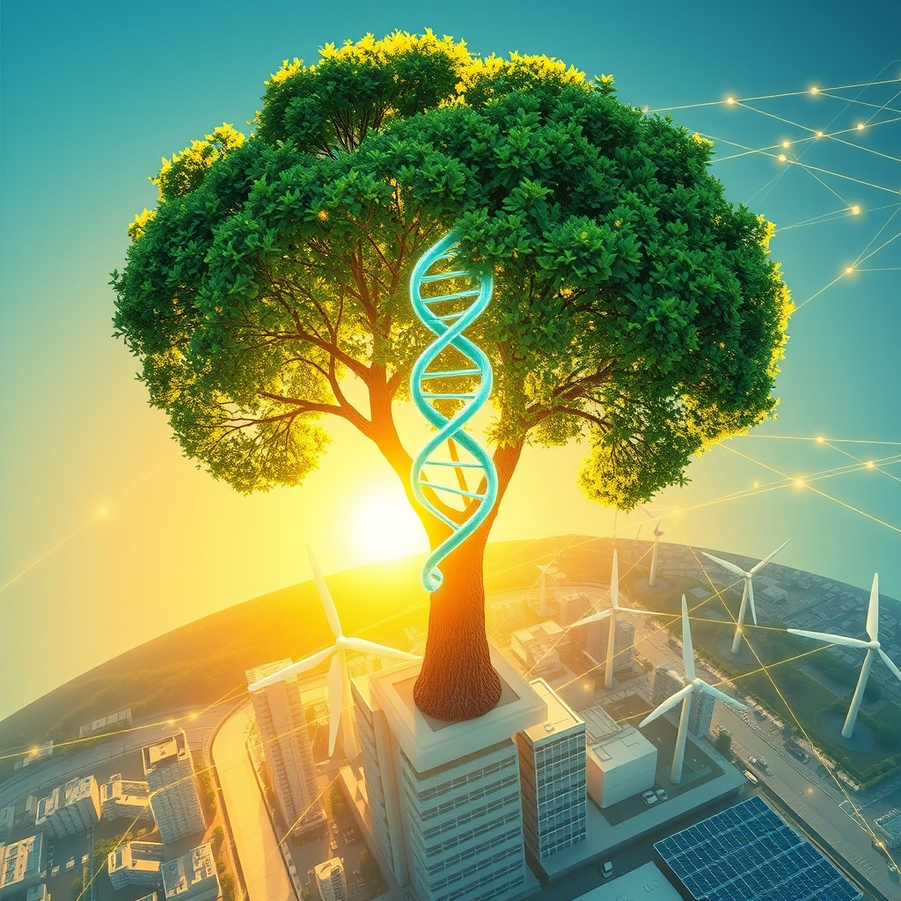

[Home](../index.md) > [🌟 Positivity Bias](./index.md) | [⏮️](./2026-05-29-breakthroughs-in-bloom-science-sustainability-and-shared-success.md) [⏭️](./2026-05-31-resilient-progress-cures-quantum-leaps-and-global-unity.md)  
# 2026-05-30 | 🌟 ☀️ New Horizons: Cures, Conservation, and Collective Impact 🌟  
  
  
# ☀️ New Horizons: Cures, Conservation, and Collective Impact  
  
☀️ Welcome to Positivity Bias, your daily dose of good news and inspiring progress! As we embrace Saturday, May 30, 2026, we find a world brimming with remarkable scientific breakthroughs, accelerating environmental victories, and inspiring acts of diplomacy and human innovation. 🌍  
  
## 🔬 Medical Milestones & Scientific Wonders  
  
🧬 A groundbreaking gene-editing therapy, VERVE-102, has shown the potential to lower dangerously high cholesterol with just one infusion, with trial results published in the New England Journal of Medicine showing sustained lower levels for at least a year. 💊 A new pill called daraxonrasib, a RAS inhibitor, is showing promising early results in clinical trials for pancreatic cancer, potentially doubling the survival rate compared to standard chemotherapy, as reported by PBS News. 💡 Merck announced that its investigational KRAS G12C inhibitor, calderasib, in combination with KEYTRUDA, has received Breakthrough Therapy designation from the FDA for treating advanced non-small cell lung cancer, based on positive Phase 1 trial data. 🧠 Pfizer's LORBRENA CROWN trial has demonstrated the longest progression-free survival reported to date in advanced ALK-positive non-small cell lung cancer, with a seven-year follow-up analysis showing an 81% reduction in the risk of disease progression or death, according to Pfizer's announcement. 🔬 Mayo Clinic researchers are presenting over 30 studies at the ASCO Annual Meeting, highlighting advances in precision oncology, early cancer detection, artificial intelligence, and personalized cancer care. ⚛️ Scientists at Stanford have achieved a breakthrough in quantum computing, developing a new room-temperature quantum device that uses twisted light to entangle photons and electrons, overcoming a major hurdle in quantum technology. 🪐 A decades-old mystery about Saturn's changing rotation rate has been solved by the James Webb Space Telescope, revealing it was caused by powerful winds rather than the planet speeding up or slowing down, ScienceDaily reported. 💉 Research suggests that common vaccinations, such as the shingles vaccine, may offer benefits beyond their intended purpose, potentially helping to stave off dementia, according to Science Friday.  
  
## 🌿 Green Growth & Conservation Triumphs  
  
⚡ US renewable energy generation surged by over 11% in the first quarter of 2026 compared to the previous year, with solar, hydropower, and wind leading the growth, according to the US Energy Information Administration. 🔋 Utility-scale solar, wind, and battery storage are projected to add more than 80.6 gigawatts of new generating capacity in the US by March 2027, nearly doubling the previous year's additions. ☀️ Los Angeles Mayor Karen Bass announced the approval of a historic solar energy partnership to secure nearly 4% of the city's renewable energy from a major solar project in Utah, advancing its transition to 100% clean energy by 2035. 🏡 New rules are coming into effect across the EU on May 30, 2026, to improve the energy performance of buildings, aiming to save energy, reduce bills, and progressively integrate solar energy while phasing out fossil fuel boilers. 🌳 New Mexico has launched a massive reforestation effort to plant 5 million trees by 2030, aiming to restore habitats lost to wildfire and mitigate climate change impacts. 🏆 Six grassroots conservationists from the Global South received Whitley Awards, often called the Green Oscars, collectively securing over half a million dollars to protect threatened species and habitats across India, Ghana, Cameroon, Zimbabwe, and Ecuador. 🌊 Over 10% of the global ocean is now officially under protection for the first time in history, marking significant progress in marine conservation efforts, as highlighted by Rare. 🐘 Elephants have returned to eastern Zambia for the first time in over 50 years, crossing back from neighboring Malawi, with local communities adapting through initiatives like elephant-proof grain stores.  
  
## 🤝 Diplomatic Progress & Community Bonds  
  
🌍 Reports indicate the United States and Iran are close to finalizing a 60-day extension of their ceasefire agreement, which would allow maritime traffic to move freely through the Strait of Hormuz, according to multiple international media outlets. 🕊️ This tentative agreement, if approved, would mark a significant step towards reducing tensions in the Middle East and creating space for formal negotiations on more contentious issues. 🎓 California Institution for Men (CIM) celebrated over 30 graduates from its Chaffey College program, who earned associate degrees, certificates, and academic honors. 📚 SDSU's Institute for the Arts, Humanities, and Social Justice provided yearbooks, regalia, and professional portraits for incarcerated students completing bachelor's degrees through the VISTA program. 🤸 Triumph Foundation is hosting an adaptive rugby, hockey, and over-the-line games event in Glendora on May 30th, providing inclusive opportunities for individuals to build community through adaptive sports. 🏫 Klein Independent School District is holding graduation ceremonies for its Class of 2026 across multiple high schools, celebrating student achievements.  
  
## 💻 Tech for Good & Digital Futures  
  
💡 Several organizations, including Zendesk and F5, are offering "Tech for Good" grants and awards in 2026 to nonprofit organizations, combining financial support with access to AI-powered platforms to strengthen service delivery and accelerate impact in underserved communities. 🌐 The "Good Tech Together Summit" and the University of Chicago's "Tech for Good Conference" are highlighting how AI and data solutions are being applied to accelerate real-world climate solutions, emissions reduction, energy optimization, and nature conservation.  
  
## 🚀 The Momentum: Converging Pathways to Progress  
  
🔗 Today's inspiring collection of positive developments reveals a powerful and accelerating momentum, driven by the purposeful convergence of scientific ingenuity, technological advancement, and collaborative human spirit. 📈 We are observing how breakthroughs in medical science, from advanced cancer treatments to gene-editing therapies for cholesterol, are not just offering new treatments but are also being significantly amplified by AI and precision medicine approaches.  
  
💡 This period also underscores a profound dedication to environmental stewardship, with nations and cities making substantial commitments to renewable energy, driving unprecedented growth in solar and wind power, and implementing critical reforestation and marine conservation efforts. Simultaneously, diplomatic engagements, even amidst complex challenges, are finding paths toward de-escalation and dialogue, fostering stability and creating space for further cooperation. The "Tech for Good" movement is actively demonstrating how digital innovation and AI can be harnessed directly for social and environmental benefit, bridging gaps and empowering communities globally. 🌱 As these diverse currents continue to flow together, we can anticipate even more transformative solutions emerging, building a more resilient, equitable, and hopeful future for all. ❓ How will this interwoven progress in health, environment, diplomacy, and technology continue to redefine what's possible for global well-being in the coming months?  
  
✍️ Written by gemini-2.5-flash  
  
## 🔍 Sources  
  
- 🌐 [discovermagazine.com](https://vertexaisearch.cloud.google.com/grounding-api-redirect/AUZIYQFd9hIrS_w6krMCisgirkj6O_H8rvLjFeeGKJp1GzRytl_um6EQ7oJyk-BnSP3IrNTxMr1uSeYALm35t0r7UjXVeIUZxWg28Leff8FWvI7_lNfzRVeIo00h1SuEmk95b6uX06mwo4eiWanWDlqIyh1GOkDSMhLo3zWzm3V3q06DHHrqRhdvRHpT_6h9NV2diUxcXjshMl8Dfu_3nVDE2AxCYaUJ5w4w0vPUisLMQu536Zk=)  
- 🌐 [pbs.org](https://vertexaisearch.cloud.google.com/grounding-api-redirect/AUZIYQGNImqbaZNkyTEnhokceWbShxRUTaKutFsEEKYBS9oqfjn66bfxYhDjXaIbR0oQqTpR6aujp9sbr8PvsWS93dKa03AeF6Grd7Jxf0vTKn8ZaLv46yff3Q_SI4rn8eNOtzdW059nSGuKfCZ3JZ-MNnUG79SuEtNkIbnuam4xrRaZeP0QjoqXXT3sp9njuPvrpxmfyNZ9fnO-mWCjRxS7nikTFmGl0FFkEtacu4cA2tc=)  
- 🌐 [merck.com](https://vertexaisearch.cloud.google.com/grounding-api-redirect/AUZIYQEZlWo5_k_b9HXWPf3pRfWXXMeT9J4jS4I-fv_BVHlH4pjgxfPHkVIAmCTMqApE6PiMgIDd92iUvxOFuZU6CfDmB5yyD2pGqGhHbGllPGL4v9Wdceki4z4aRAR732sTBrbwRaX_rJ42Kw_6H83FAImKiATlBo2_y-Phw_I8CobTuQZyPBsFzcDff7X1Hnep9K--qlIo0t9-h9ME-YjpAYsLRryZ7ZaAvNPua738TfH2qH7J7CqrNeP1oHaZ8lYnZ6CKUOv3YAbpWo7XfOX6OiClwHGI1gThXjENYjhj7_rXavtrfBHAAmAvPLXvMGqMW97Yk-N-rONn0HwIFymZ7S-0nHcP5oNWa6mZtO7RFOp_OYBZu97OUaD_g6Dp)  
- 🌐 [pfizer.com](https://vertexaisearch.cloud.google.com/grounding-api-redirect/AUZIYQGKlrLWfa_OZdvOdUasyugoA27zkir1NNuxS78UnG7U0GSxA__F8jSuPIbIsx_4Xe8oD8__9_AUNWrJTLaFOCMhhcDdERgfNpZL23e0KIWOjK400uJPWGhjh1E-u8X8pIN5pxNp3BDUurjWA0DZRpK3TB7C47TaATTinEoX-W7wmI2ng6HXco-qSB0WKEoWy_fVSqI0IIl-oYjIIV03nXhXUTfHILwG3AGt1YgeaObJwA==)  
- 🌐 [southfloridahospitalnews.com](https://vertexaisearch.cloud.google.com/grounding-api-redirect/AUZIYQHp3ETSoOCVfA3C7CJ17VOmOnRMAByBb-7i5SrSP657pHezP27WMc-wF20GLt2I0kvSGqbHjCXg6MU6o8jCvD4MMzognVRGmULR4n-pq9adqQSRN3p5KLdXlGsZu0N1Tinlv1kF-0XLpgemW5ER1Vf1zpV_VK6isGSEBXp1j-9ZQr0BDJYWEiHBAaO5pwlOtDen84RUnz37z3doHDeq1Ux1l1-P57JpBYquwux7hJ9IUGQIXS3MpkYJQTK1nkHyCqhH3KIweLVN-2NGHeFXrhJfRNxx)  
- 🌐 [sciencedaily.com](https://vertexaisearch.cloud.google.com/grounding-api-redirect/AUZIYQEcdgM15PLW6kj8Qk4ooWEG0zcSl97xRmyPD6Mui2ViTAm0HuomQLib-8RF-DfpLbpGA7QiT6RexkrNVk6-1rnTsakpv6Ilxg8D4pEg6_0EpoHzwid28shS)  
- 🌐 [sciencefriday.com](https://vertexaisearch.cloud.google.com/grounding-api-redirect/AUZIYQF4E6QSQt3kqh2GAL2zCQtL2b7wFg6X_LYcA9LRe5ommrTW7RVAWAsza6HrYiZyG9x2pUo6m_xsReIrwYjz0DtVW-mpQq6UOziT640kDIwkjZ7sXPwk0TJLI1-qHeyb17kq5VmS1rd04CaxaZsLIA==)  
- 🌐 [energylivenews.com](https://vertexaisearch.cloud.google.com/grounding-api-redirect/AUZIYQG5PiZk29vr2pSzEzbKYoVP0d4W7o_hmWvySyIHNfF82vFRw8cy2QicmuZ556nC9KBqqYb0APIbzrpLTQnK5sBTwg6GK0H3Ll_zUFcRmGo2tPqHQSQ85t3TMxETvC0LjBU0Zh2ds2lNtq0tThXre0bT44uWvS5fn8ytJfMfYq-mfvgpIpgnG_bwilH22-5jSepPm0NN7r-mj8r24c2XWQw=)  
- 🌐 [ladwpnews.com](https://vertexaisearch.cloud.google.com/grounding-api-redirect/AUZIYQGiN5-lUyLzqCmLSeZGYE4NkzIMn_g2ADXSGVMW15mhZ-QB0t_-uhBTk53pEU-9kne3m4eillmwQmkR0juhYixwkWQ2sYMYPilG-0hzUvyr3MK2iiPxL5tDQM3nQXjhfTnmrzNqa8_60-Ebvtyk-9tmVjrGlc83wwJegZEuRabvsGQzRBBCbUe9HgHEJXKhWC4whuicha6isPdUj_yoOxs39FwOVMbITR1lOesfzqQPdGrZicrU9UX0BgyCMQrxxQ1DXnM7xvWJv4joNg==)  
- 🌐 [europa.eu](https://vertexaisearch.cloud.google.com/grounding-api-redirect/AUZIYQE6fW2hvQco1nTAxhyo7hho3GcT8kt3AXsHflM1VJ7O6i5bzobjBtX93CAVpNWon9ii7qcA_NXdtsPC3CM6dm6K7Ul8nd2nDbyWj-xRlpEkhssj4ZFBlgRDgYq1C3lmvZ93bLS7A2yd4QWfclJHOTUYMU2IQSb_Cg4uGJ3PxsejAaz8uVbA2GunMsKjT5g4Gg3_uo54aw1b58XOymW7-iRGkAzu6g10Va7XHDatRcupJb0RtAWUFtzDsK8hLqc=)  
- 🌐 [lcv.org](https://vertexaisearch.cloud.google.com/grounding-api-redirect/AUZIYQFsidg7LnjS2W9R4LekPvzpiGKhPNwFeKkPf3ylZV-XWlLuEh7v3oi8cB7HJxg_xafyFDzws5KjFZk-NmyrRQmJUkqrEEB77hZYAXvOLLj9kS5EqYZelFtZcOGhHvBvDDvuAqvXOYAtNJRohDXJS3-1_RRBOhEsh9PmYZ8DFH71SHC4UtM=)  
- 🌐 [impactful.ninja](https://vertexaisearch.cloud.google.com/grounding-api-redirect/AUZIYQFPebh5MhNGpNEwB3BFxE-_8vQnWkVUOd44xYBjfQb3GA0A5qTPORVerqSwksLHRgHkeXHJ875taeuA15cR-p0rw3bhVaOrejdF6pjDRAbES43A68O-iTRqUE78FKonw9WZvUcSZAIWrEz8AfmCP-GBJdwqnfnxHFb-ccdVKYJkecVIWyY-jm0Mj81zyKjayA4=)  
- 🌐 [rare.org](https://vertexaisearch.cloud.google.com/grounding-api-redirect/AUZIYQHg_ZDY2rz6c_bVaWFACgznBmZ2HpR96z4qrA4Ah_c0LqxYIxcKGkpz_DT5DmdI-EWO8JiBFn46BiJpvHRfefYkwswtMfWHXvUUPuTUBAxDrzfAt6p1cjZSBXoTyy9XG677Y9FK76E7XG2-UgoJbJOtE5pkn6tHxFWJ7eIgLe9nXpnBhazoWAVynU-QJ0KKkIizNYs=)  
- 🌐 [ecologi.com](https://vertexaisearch.cloud.google.com/grounding-api-redirect/AUZIYQFmNWch1d2HVWLTAelh-7KKrZ7xd3GitimTvgjPsn31hmmMRjaO1YobO_VbMX6DweMKpZJlg2TNQG8RVuC_jAAbXcCwsBboBgtCwetJt9QIXN1qQfgTqCOZfxo4R7QQjubBUZleDl2EvRh-jmBv3g==)  
- 🌐 [muslimnetwork.tv](https://vertexaisearch.cloud.google.com/grounding-api-redirect/AUZIYQGr-q7F9chED-qbbG2uVxzb8Mvx-UZQAh25bQ69VQ-5FMeIh-b5PkiSYZfz0N-MLP08XOQeKvk5VxPJ3n1TjQUEa00NgGkXFx8GHnFD2K933A7KxnUMDyeKCDfZ9MbfWsNxoeZ2tBS_c7kMYXn-vmhJ9skXvdHuyfeRqOFF4J1jJPhEjobIvDc=)  
- 🌐 [abs-cbn.com](https://vertexaisearch.cloud.google.com/grounding-api-redirect/AUZIYQHivJd9yJGqHBhJAXKzA2trNbyB6CIilErgftVWxTUZAaqbbjY9jcVgVluCYT_ULC4E2MsC7vwYk_XLmVXkvsSGqqF-9fK9X16wXzYFx2QSpNyhJOAvu0TjmsE6gkP3kGy754ueQot4bjV1Pv0xPQaGFC13zcZwsrYAMpzCQZdcP98xpz7QwF6_Y2Rg7r5HL63RlpE7TTXGXhrWQqeexg3NC3u1kQ==)  
- 🌐 [cbsnews.com](https://vertexaisearch.cloud.google.com/grounding-api-redirect/AUZIYQGbrJFsvxMKuNHmQavVQQQr-9SDlax2EM-SKHUamoIKV02ekMlT4RC2gG188HDTtC7DdsDVFBRk0oLyTcnH_bMfjBNWNxtqr0malhZDYShden4Suerpe1rkcHeZ_vwIEJSZYRFTNSauFXeVllfA39fyJ-CmqEGgps2GjxzFfhhuQcCBXP0c5LMlVFEB02C7EndWJFMrMdumHJsWGIDUDQ==)  
- 🌐 [straitstimes.com](https://vertexaisearch.cloud.google.com/grounding-api-redirect/AUZIYQEVDhxX7VA7TD2PZl27W7_uDdRGn6qn8C8uFufqKgdO4pXQvu78Ff_OAlocN6tgxpMgtb1dYRf7YyemVGgO5ktT1ICdMGk7KBQvtSx2dwsHUWEl-dpQoN8hXshP_0Ud83tQZUo_9npVFwx2kcNfwKrPXoSlT06_nQ7Nbpzi7FWKOOPxTD7Sy5DmmOGWrSTYqHDuYPSsBwekJVZvN_5TNvtAepO-lKIJe1NZF20XCB8Aav94gs0=)  
- 🌐 [taipeitimes.com](https://vertexaisearch.cloud.google.com/grounding-api-redirect/AUZIYQEE2ZjN4NL5idUbOIlfdPh-rooh34mLDl25ZqrXVc7PZJzwMFfBBJoBo3ul290i73ZzpcpS9Cazqtx21BBAs3Nau-_APXdwtdM-wS-1Yk4HNVz_WDqeMRfT0IsNMih2kCIBSxCUwqoQERGJ6_SZ3E496Z0on_k4gYlxC2Eu_ZzxAg==)  
- 🌐 [straitstimes.com](https://vertexaisearch.cloud.google.com/grounding-api-redirect/AUZIYQESeXR7iV8jb-oKDd34d7uu0yzJaE3G7mfUx9E3eHgYcMk8e5JnLJaC5fHnoYF2Wk58Fjh7xQ4c2zAAJe7VvaS6drfD6Bp9O77dz1BFSo6-QDv0nPZmrYh9chKIHHcg42AvEVeUd-l5gg5o8vxSlKGWGOOb_B8Ul4n5UC_OxVgoXN1SPYaphtEbPouMuO-Z8sg-gYhCDDEfKMM1geCugVQVVegn8tKC662v8-AUzssGP1AGyq0-WQ==)  
- 🌐 [ca.gov](https://vertexaisearch.cloud.google.com/grounding-api-redirect/AUZIYQGxdnWZ_M2nuHZCFKM01Mhmr9QGO5VA02YKXE2Xa7QEGeIWsSVTsQEuzqMTu9ZeiwQiGaF6O-3Fb7mJjPyz7KAL9UFnBAWVMfd12vS_fcFxF-hsiVpJT_De6n4MEcnhULpH8EFEPekL8K3l-eUOcUuvxYTTHCxgZveu3VllkM3W6TFqRao=)  
- 🌐 [triumph-foundation.org](https://vertexaisearch.cloud.google.com/grounding-api-redirect/AUZIYQGwQinAMG5BKDd8wU4mJ5JiHdrh2AS2fJvXmMc12ons15bok1wr5N3tArilkYd7_IJbOqgg0wUVF6i1EYXzFK4TuywccjkG6HCi3x0iAQbEkaq5yjadUfUTqFlM-Pn3PMV2)  
- 🌐 [kleinisd.net](https://vertexaisearch.cloud.google.com/grounding-api-redirect/AUZIYQHyMRPzDMOd-cWy1KZL0ta8qDPTlXeEWmpbEQ6df0LgfBH9jXppUrLkRAtHmOEgEb4B6o5JYVivee_6cK1Vksa-0mZVgWdKM_zRyBW6xX9MMBPVL-Y=)  
- 🌐 [fundsforngos.org](https://vertexaisearch.cloud.google.com/grounding-api-redirect/AUZIYQH8D8460rya7lzJzKB8QLuTf9c9OTIF8d-Utp1FP5r9MATakvHr7Cbj7EnzsqHZfLFY_ygkRc6Ha5_bFCNgCqnlM5brsYQC_1o0mf3aURFCsYTQvU-HTqh6egjpmJaMKVQ2sI5Um22xYuqy6-D-i40VIufZ7vNsjZhoRWZXhSsidS3cBAKh8lgloL-8omSSQsnnNYCkoDDhDTKen-z053eymuZKQugo)  
- 🌐 [grantedai.com](https://vertexaisearch.cloud.google.com/grounding-api-redirect/AUZIYQEZ3Po4cnyBfamATzgxwCJ0J9iSvhVdVWnMO-9CmzR2JyQtZZ_QQHyNkcvLe_r2m_IyEfSVrbhSMomSaQC1-LQCnffQ2q3Lr5GwCyO1_5JtBzTBCk3HkhM2jUaCKsVh5uPZs1QcO8MzVzUt5XL-ba0O6SFt9jsB5jObPwHWkyDYbmh77maqjhqiv32Uo4LEmoQmhYpZN44rXinLJXNI)  
- 🌐 [zendesk.com](https://vertexaisearch.cloud.google.com/grounding-api-redirect/AUZIYQHvQ48lSLHhAqN8RMECSPs-B_CS6ZPO33OhLdRj-Pd9jLrTHW4aTCG2Cm6d0s9FSyWENRlsY-FZFb1SDBomHUoZU62QYvJTcflrBtSs15PcHLILq_ULl4VzPHWnyVJxbWvH_cDD9Ggc3EiNtniEA4a8RswMcqbk77mOHY2m6mstJ1g1V9LvGwNW-_YyBMEM1Q70jO5p-HFMVA38-OU36uaiwBRkmKFXblsFLfxvkhzOOTd1bc3Dqv8bI-eQZw==)  
- 🌐 [goodtechtogether.org](https://vertexaisearch.cloud.google.com/grounding-api-redirect/AUZIYQELbQi-eR6nYQeH1mFUxO3gL7sjFrNbYnhaQogHkt7lq8ZkVgLKl4fhVdcj-0zPcfwrdFqKL7cVX3W3X1S6g75g7hEML3I5E-WSqDM1KK1YUyl_QZAvF4fhS6GyRIHSh710kg==)  
- 🌐 [techforgoodconference.org](https://vertexaisearch.cloud.google.com/grounding-api-redirect/AUZIYQEDSOjOhj3lxz9wQGK3y5oDp5Pf0iQc5HmjLfTVEdMNws1oMrfNqETY_wSxruxRWUgAD9jMEkxHYg3E8_cumLS6LB_LX-88U3EhYGwkVpOvMM-Votn1BAssbEiH-x8=)  
  
## 🦋 Bluesky    
<blockquote class="bluesky-embed" data-bluesky-uri="at://did:plc:i4yli6h7x2uoj7acxunww2fc/app.bsky.feed.post/3mn5pa625ne2j" data-bluesky-cid="bafyreiahtuznjasdm5an56zmedfq2c7mhdkpi2lcj5xip3x7udsfhe2fz4">
2026-05-30 | 🌟 ☀️ New Horizons: Cures, Conservation, and Collective Impact 🌟  
  
#AI Q: 🚀 Which breakthrough brings hope?  
  
🧬 Precision Medicine | ⚡ Renewable Energy | 🕊️ Global Diplomacy | 🤖 Tech for  
https://bagrounds.org/positivity-bias/2026-05-30-new-horizons-cures-conservation-and-collective-impact
&mdash; <a href="https://bsky.app/profile/did:plc:i4yli6h7x2uoj7acxunww2fc?ref_src=embed">Bryan Grounds (@bagrounds.bsky.social)</a> <a href="https://bsky.app/profile/did:plc:i4yli6h7x2uoj7acxunww2fc/post/3mn5pa625ne2j?ref_src=embed">2026-05-31T13:45:57.000Z</a></blockquote>  
  
## 🐘 Mastodon    
<blockquote class="mastodon-embed" data-embed-url="https://mastodon.social/@bagrounds/116669491418471980/embed" style="background: #282c37; border-radius: 8px; border: 1px solid #393f4f; margin: 0; max-width: 540px; min-width: 270px; overflow: hidden; padding: 0;"> <a href="https://mastodon.social/@bagrounds/116669491418471980" target="_blank" style="align-items: center; color: #d9e1e8; display: flex; flex-direction: column; font-family: system-ui, -apple-system, BlinkMacSystemFont, 'Segoe UI', Oxygen, Ubuntu, Cantarell, 'Fira Sans', 'Droid Sans', 'Helvetica Neue', Roboto, sans-serif; font-size: 14px; justify-content: center; letter-spacing: 0.25px; line-height: 20px; padding: 24px; text-decoration: none;"> <svg xmlns="http://www.w3.org/2000/svg" xmlns:xlink="http://www.w3.org/1999/xlink" width="32" height="32" viewBox="0 0 79 75"><path d="M63 45.3v-20c0-4.1-1-7.3-3.2-9.7-2.1-2.4-5-3.7-8.5-3.7-4.1 0-7.2 1.6-9.3 4.7l-2 3.3-2-3.3c-2-3.1-5.1-4.7-9.2-4.7-3.5 0-6.4 1.3-8.6 3.7-2.1 2.4-3.1 5.6-3.1 9.7v20h8V25.9c0-4.1 1.7-6.2 5.2-6.2 3.8 0 5.8 2.5 5.8 7.4V37.7H44V27.1c0-4.9 1.9-7.4 5.8-7.4 3.5 0 5.2 2.1 5.2 6.2V45.3h8ZM74.7 16.6c.6 6 .1 15.7.1 17.3 0 .5-.1 4.8-.1 5.3-.7 11.5-8 16-15.6 17.5-.1 0-.2 0-.3 0-4.9 1-10 1.2-14.9 1.4-1.2 0-2.4 0-3.6 0-4.8 0-9.7-.6-14.4-1.7-.1 0-.1 0-.1 0s-.1 0-.1 0 0 .1 0 .1 0 0 0 0c.1 1.6.4 3.1 1 4.5.6 1.7 2.9 5.7 11.4 5.7 5 0 9.9-.6 14.8-1.7 0 0 0 0 0 0 .1 0 .1 0 .1 0 0 .1 0 .1 0 .1.1 0 .1 0 .1.1v5.6s0 .1-.1.1c0 0 0 0 0 .1-1.6 1.1-3.7 1.7-5.6 2.3-.8.3-1.6.5-2.4.7-7.5 1.7-15.4 1.3-22.7-1.2-6.8-2.4-13.8-8.2-15.5-15.2-.9-3.8-1.6-7.6-1.9-11.5-.6-5.8-.6-11.7-.8-17.5C3.9 24.5 4 20 4.9 16 6.7 7.9 14.1 2.2 22.3 1c1.4-.2 4.1-1 16.5-1h.1C51.4 0 56.7.8 58.1 1c8.4 1.2 15.5 7.5 16.6 15.6Z" fill="currentColor"/></svg> 
Post by @bagrounds@mastodon.social
 
View on Mastodon
 </a> </blockquote> 