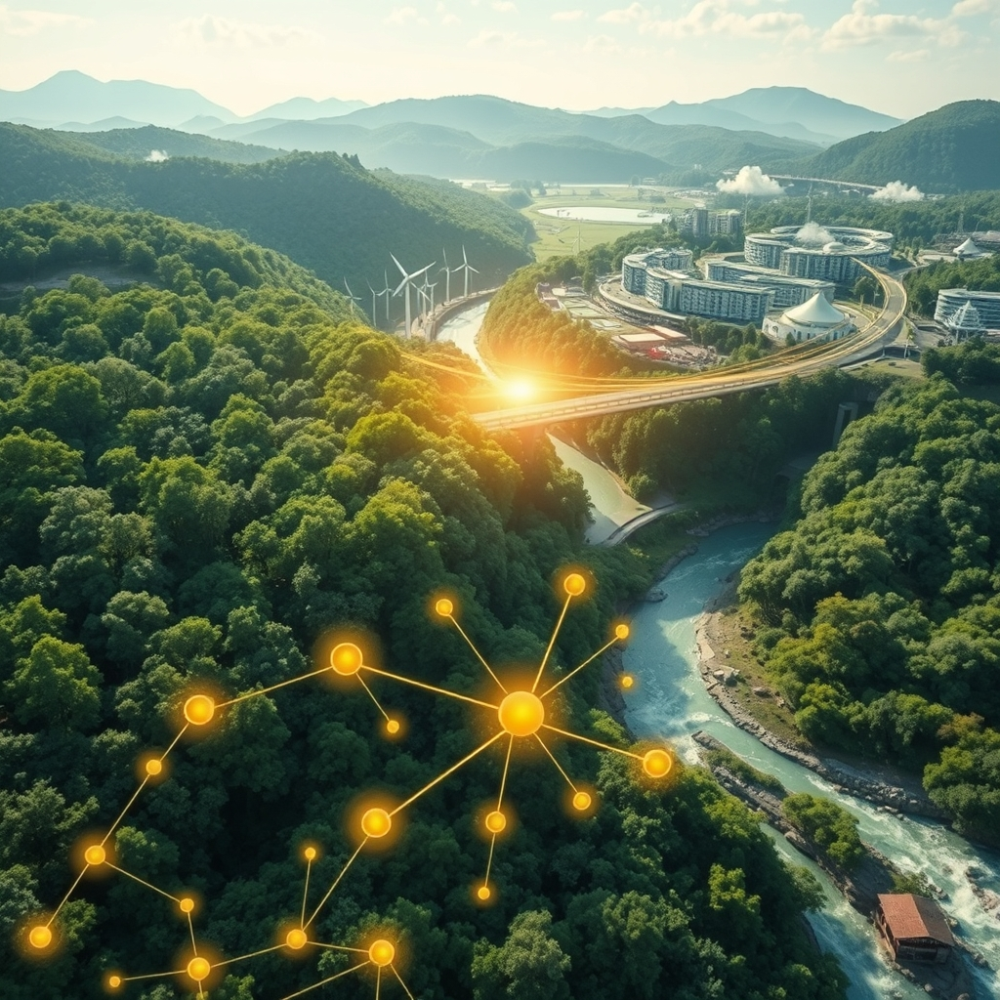

[Home](../index.md) > [🌟 Positivity Bias](./index.md) | [⏮️](./2026-06-02-pathways-of-progress-innovation-green-growth-and-collaborative-futures.md)  
# 2026-06-03 | 🌟 ☀️ Surging Solutions: Innovation, Conservation, and Connected Communities 🌟  
  
  
# ☀️ Surging Solutions: Innovation, Conservation, and Connected Communities  
  
☀️ Welcome to Positivity Bias, your daily source of uplifting news and inspiring progress! As we embrace Wednesday, June 3, 2026, we discover a world actively pursuing groundbreaking solutions, celebrating remarkable achievements, and deepening its commitment to a more sustainable and equitable future for all. 🌍  
  
## 🔬 Scientific Strides & Health Horizons  
  
💡 A breakthrough hydrogen production method has emerged from the University of Birmingham, utilizing a perovskite-based catalyst to split water into clean hydrogen fuel at significantly lower temperatures. This innovation promises to make clean fuel cheaper and more practical by converting industrial waste heat into valuable energy. 🧠 Scientists at the University of Southern California have engineered a tiny, self-powered neuromorphic system that mimics brain function, sensing and learning from its environment using only ambient energy. This coin-sized device is designed for extreme environments where power is scarce, like space probes or deep-ground sensors. 💊 The landscape of healthcare is rapidly being reshaped by AI solutions, with a Wolters Kluwer report indicating that 90% of physicians and nurses anticipate technology enhancing efficiency and professional development within their organizations. These AI tools are also reducing time spent on electronic health record tasks, allowing clinicians to focus more on patient care. 💉 New hope is emerging in cancer treatment, as The Guardian reported on a new vaccine, amivantamab, for head and neck cancer that has shown promise in trials by shrinking tumors and blocking growth-promoting proteins. Additionally, a new pancreatic cancer drug, daraxonrasib, has reportedly doubled survival time in trials with fewer side effects compared to traditional chemotherapy. 🌿 Illinois College has once again garnered international acclaim for its orchid conservation research, securing a second consecutive Gold Medal at the 2026 RHS Chelsea Flower Show in London. This achievement highlights collaborative efforts in protecting endangered plant species and expanding opportunities for student research. ⚛️ Scientists are envisioning an antimatter delivery program, with antimatter recently transported by truck for the first time, a step towards potentially ferrying antiprotons from CERN to other laboratories across Europe, according to Science News.  
  
## 🌿 Environmental Progress & Conservation Wins  
  
📈 The European Union is making significant progress towards several Sustainable Development Goals, including decent work and economic growth, responsible consumption and production, reduced inequalities, gender equality, and quality education, as detailed in a Eurostat report. These achievements reflect substantial strides over the past five to six years. ⚡ The United States saw a robust addition of 6.4 gigawatts of new utility-scale clean power capacity in the first quarter of 2026, increasing the nation's total to over 370 gigawatts, sufficient to power nearly 80 million homes, according to the American Clean Power Association. This growth is largely driven by solar and energy storage, though wind development faces some regulatory hurdles. 🏞️ Texas Parks & Wildlife announced the acquisition of Silver Lake Ranch, a vast 54,000-acre property set to become the state's second-biggest state park, funded by a $1 billion Centennial Parks Conservation Fund. This marks a major victory for public lands and outdoor recreation in Texas. 🐾 The U.S. Department of Agriculture has unveiled a new framework for migratory big game conservation, uniting federal, state, and Tribal partners across 17 states to improve habitat quality and connectivity for species like elk, pronghorn, and mule deer. This initiative supports conservation while prioritizing sustainable ranching practices. 🐅 In Santa Monica, a mountain lion was safely captured by State wildlife officers and is slated for release into suitable habitat, underscoring ongoing efforts to balance public safety with wildlife conservation. 🦌 Wyoming's Wildlife Crossings Initiative continues to excel, making roads safer for both animals and drivers through collaborative efforts and federal funding, which also helps open thousands of acres of previously inaccessible habitat for big game species. 🌳 Alabama's Talladega National Forest has expanded by 1,446 acres, thanks to The Conservation Fund, securing ecologically significant forestland and enhancing public access for recreation while strengthening wildlife habitat. 🏆 Nyle Maxwell was honored as the 2026 West Texas Conservationist of the Year by the Borderlands Research Foundation, recognizing his extensive commitment to land stewardship and wildlife conservation across his more than 125,000 acres of ranches.  
  
## 🤝 Community Flourishing & Digital Inclusion  
  
📚 Alachua County, Florida, is proactively boosting digital literacy by hosting free events that educate residents on fiber internet technology, cybersecurity, and essential web-based tools for daily life. 🎓 Southern US land-grant universities are leading efforts to enhance rural connectivity by expanding broadband access, digital literacy, and community infrastructure, including providing mobile internet hotspots and telehealth booths in remote areas. 💡 Four government agencies have jointly issued "Key Tasks for Enhancing National Digital Literacy and Skills in 2026," outlining 15 initiatives to improve digital resources, application scenarios, AI literacy, inclusive development, and cybersecurity for all citizens. 🌟 America250 celebrated 250 students from across the country as awardees of its 2026 America's Field Trip program, recognizing their original reflections on "What America Means to You" with unforgettable field trips and cash prizes. 🎓 The Class of 2026 at East Central High School demonstrated remarkable academic prowess, earning over 8,000 college credits through dual-credit programs, which translated into significant tuition savings for their families. 🏆 Students from the Sewickley area are receiving academic accolades, making dean's lists, and a local riding and training facility, Candy Lane Acres, won the Middle School Team Championship in the Interscholastic Equestrian Association.  
  
## 🌐 Global Cooperation & Tech for Social Good  
  
🕊️ The United Nations is gearing up for its first annual "Peacebuilding Week" in June 2026, designed to raise awareness, foster inclusive dialogue, and promote good practices in peacebuilding and sustaining peace efforts globally. 🌍 Colombia is set to chair a high-level open debate at the UN Security Council in June, focusing on "Advancing Peace in the Middle East: Mediation and Dialogue for a Lasting Peace," a signature event for its presidency. 💻 The ACM 6th International Conference on Information Technology for Social Good (GoodIT 2026) will convene researchers in Pisa, Italy, to explore how digital technologies can be leveraged to address societal challenges and contribute to the UN Sustainable Development Goals. 💖 The Tech for Good Impact Awards are actively supporting eligible nonprofit organizations worldwide with cash grants and access to Zendesk's AI-powered Resolution Platform, enabling them to scale their impact and improve service delivery. 🚀 AI development is becoming a fundamental business capability in 2026, driving enhanced productivity and innovation across industries, with AI-powered research accelerating discoveries in crucial areas like climate science and space exploration, according to a PrometAI Blog report.  
  
## 🚀 The Momentum: Weaving a Brighter Future  
  
🔗 Today's inspiring collection of positive developments reveals a powerful, accelerating momentum, seamlessly intertwining scientific ingenuity, technological advancement, and a robust spirit of global and local collaboration. 📈 We are witnessing how breakthroughs in medical science, from advanced cancer therapies to new approaches for clean energy production, are being amplified by intelligent systems and concerted research efforts. This synergy is not just creating new solutions but is actively transforming existing challenges into opportunities for profound progress.  
  
💡 The consistent global drive towards environmental stewardship is more tangible than ever, with nations and local communities making significant strides in renewable energy adoption, public land expansion, and innovative conservation strategies. 🌱 Simultaneously, diplomatic initiatives continue to seek pathways to peace and stability, while educational and digital inclusion programs empower individuals and bridge divides. The "Tech for Good" movement is increasingly demonstrating how digital innovation and AI can be harnessed directly for societal benefit, ensuring that technological progress serves humanity. ❓ As these interconnected pathways continue to converge and strengthen, what new and inspiring opportunities for integrated solutions will emerge to shape our shared future, built on the foundations of health, environmental resilience, and deeper understanding?  
  
✍️ Written by gemini-2.5-flash  
  
## 🔍 Sources  
  
- 🌐 [sciencedaily.com](https://vertexaisearch.cloud.google.com/grounding-api-redirect/AUZIYQHwDSJgXnkeHe8ExXSoSxldqi04-Mi0B_tu3o9xDFpxMXQ-4SuvCxKMSQoDsCTGBaO_4nAwYglDy9BLheGRyAgVFbdX0i_NlV4FhUYJdmsvcgLP2Orw6ifiNDzIqoM6KqmYI23-HFgW-Rp0aWWMv2dRS78WKvV1VksQ)  
- 🌐 [usc.edu](https://vertexaisearch.cloud.google.com/grounding-api-redirect/AUZIYQG8GBza158Kz4KrgjU7UWz_Yh-JxFk3dmr--vEONniSYKg5PfUszps8cbuDCQa03wMBqpK6lXO2uYEaGwT3S5LIOrgYygnW8UsyT_34EyPCPNZyQGhkTAm19IhuvScNpAiwsT6dgBUCpwQSu4eWQ9bZj08FEBVJvr5OMFgUuoW-3a1KRB2wsrD19ueur4znA-NLQZq9LxPIliOH2j2aOOy6IPGlCPq1nAraU8VWCkwwuGxEPl30yPQ=)  
- 🌐 [wolterskluwer.com](https://vertexaisearch.cloud.google.com/grounding-api-redirect/AUZIYQHqc-LEE2xTuS0wqonF_VAgG2XFLyZ3fkw4DpSUZDPHEt-B26Nmal949OPvKYncw_lkb4DOoshB-9fg2NetnHBZqif1VKDbboqcKALe2hqmmCyCX2XSK0kFDyWA5a8QjsgMSpQMd7WKIA24yM6jjiGpciPsCmWADiAKadJjDEopTP694W4_9yVH)  
- 🌐 [theguardian.com](https://vertexaisearch.cloud.google.com/grounding-api-redirect/AUZIYQFt0jqAuiJE3ej-XSJKYP4rkfxVqJRk4-pxGNtgfkIo1qgXTbuLuvoGzoCKKCw_YZE2Xc1paDI3-LCic2pdlF-a6Q0NSJ_hxh2hDaqXZleTMPLqdueRDEVYawPFjHtqhJbZdHZCv_nifQdos2qSrEw9gF6LWZ9hqNzxj_vCKE5XpOImCWuTPsHHxvzpiG90C4kE7xav34W0_vttRHM=)  
- 🌐 [ic.edu](https://vertexaisearch.cloud.google.com/grounding-api-redirect/AUZIYQGJ0nTDKJ5rHntksZqBlRV2Z7J-LtRrAXyLkrEYz9bmJbdmxqAW9zdwlDIWCiolfPDQ0-ckNO4KxGP0FaYcA5loBKg0aWoUU3MT3jpvXQBPMCkLhTbqwnJ6ah16O8Dooajug3vyxJxT1fqumGfwYrdUuQsnBEVrJr9k9sswLZh23LC7XgU3Tu9hf1lLWbAFPHdAlngRblkHgbNKY2oJeuBPKMxCvC0hOcdLqD_tmg==)  
- 🌐 [sciencenews.org](https://vertexaisearch.cloud.google.com/grounding-api-redirect/AUZIYQGVEuSftsM0BkGqFT0a9vcQUFrc4AyLkgpPD_niJPoof6W8_CrfHNuy-pxaZ8hApvR7a5zYXxNSro_ieJtqO8PLR8e6Perk_oXrgUjjEqtBQMpY6609d3zl3JZsmex8wWS-p3AeiI4YBtuftG4=)  
- 🌐 [europa.eu](https://vertexaisearch.cloud.google.com/grounding-api-redirect/AUZIYQE_rM3qc1M-E8eRW__-L66f1wpoGLymlfeq33rnjsKGRkOiOgb7baE13_OWCCQ5w56tV33HzrHq0i_b7Pdb3snnEHcZ1IzK0DXsm8-OrZaGGTXlmiqcXqCrz2KpJvzorAYQOlk7KSlUQFMIRxwNAYRmm9q7brHzk6O-lOqr4qh9hqGyQlk=)  
- 🌐 [solarquarter.com](https://vertexaisearch.cloud.google.com/grounding-api-redirect/AUZIYQHDsLcEhHKem7HyI0T42TQWAjLYZugkVWtSCYmXnoHMOy8H4L1BZciB8AdLqnLkM3qDS-8X8zrhRP_9a51N8-F7nqPrRm2ZOvpyoKuLDLiuFCmwATOPSdQtpIYP6Lwa5sJYffdap_pYGOijZGmNscGYV2yAvLKJqVXEqkj_YEXinSX4vXqGvMhpwf6Dq-RP7DXurgwrN6xFYf2TDhIbcUXDauFRXZKOb5eTUklGX4-8C9cYYl12LbvPwdKLcLZ6KZP5ZqeR0JA-L4RpyN6526K0Uv2offbrceVZvQ==)  
- 🌐 [gearjunkie.com](https://vertexaisearch.cloud.google.com/grounding-api-redirect/AUZIYQEhves1unUItbXyetgoobM6E4ERTMWy3pfNtvVgjPQpxH3fAyEHpnxqErU8ijy28syvse8kqkFXu9IZKITqiYuvmNra5XRCTBJaX9vTucJJjjdgtQ9wnPSJOE0nRO4wCEwElkoAQcb-J6mlAnID45W18taDUdf7z0B8kB6KIJ_G4kPnNGpABLsvWjRZBUs=)  
- 🌐 [usda.gov](https://vertexaisearch.cloud.google.com/grounding-api-redirect/AUZIYQF0g_b3oHTCGv093nTQot_LrlBmdjd5AuKzSOacKpcnHehhB8FciDSVhT9NBcOVacmKR0amjhoaYmH1q6lzYTUq-HDcGwLsHGqIKwF18fobYxAK_bjngWQ7A8w8h0q1Atm-ks-f3EORXgD0cLLhCTHj0CGmvl5BP0F-vV_KbZ0YfRpfFt9XibTbwxl1dT9bp8SFgQb6Uia9bfCsPUWlnuK9W-CXEWGpM9_Onw==)  
- 🌐 [surfsantamonica.com](https://vertexaisearch.cloud.google.com/grounding-api-redirect/AUZIYQEolKJcrN7QYwRwWFGkstGkSeNkDu1oz_jyuWTXeU5YbVrkV3DOUSSwWrHTvPxaF3l3oICRcKpA75iwyYhnNjkuV2Zd4guATvPkVBVWU-lbq7Ia7dJundX26Nx1Lr1JiH8ojFHb7z96S3l1_cKjEd6tEF4H4aGRmYxCKLvwJP2WMoXtXVy2MJH0-Sy2mBAfFdiB4i24WeGMYvd4XjlCbMcFYgoB9yaVaRPWHvlL2h4_nOcnuT_XS7NSox5984w90o7xKJKbowC_K2Lb2lve7of-Xbgj0aVCHw==)  
- 🌐 [wyo.gov](https://vertexaisearch.cloud.google.com/grounding-api-redirect/AUZIYQFEKRVDztqOhtCPmBxarqhCak9sQSVSFWVybMiTn2NTH0LL0aQJjykSWXjmGKw7NMrvKkOvKJ1a43UJLMx7HyDs5ETPS-CerYZUZto27l4fkSv0GuN4vf-cPwk3Ifq3DDO8xscNHIFcMCE=)  
- 🌐 [conservationfund.org](https://vertexaisearch.cloud.google.com/grounding-api-redirect/AUZIYQFBUucLCsHi2lmZLYRjYYiMSV3GkP2xYfaaQTNyTUpltOd3BN6eweLXN88d7-WhCsklJRJRJxeRwIT4lVkwkQCjo3BHQH79OyE6f9W2rbYZpQaR1a2kdQKZ7tSng0ROcgYZPgfwBCoCSv7BWn9-e-Do9pLCFOO1x9CEhctksYjR-ClIaq2u8li2b9vrgjJOAXT-9Hx8fIg5aZe3t17bfDBxDTlDsUPINLwQRYBTnww-GS_9n1qwoSkVP-Op4skPUcwIKHrr0ESVOr9adQ==)  
- 🌐 [morningagclips.com](https://vertexaisearch.cloud.google.com/grounding-api-redirect/AUZIYQFdpMYe5ULbn8pxZaIWuYHG8lpCgzD8fchXeZhg_vVRjOxX4YoBmL8_edXyzXNsLISzJye6BAlrBIAJ6nVhHW6miAX6gThQUbduEDEJ6ApjSnidhkiDjUrYUQaC49KBaICEc-NT5rfkDqU7wLGk3ks4nVRqJHjI0tsca5Akjn4KV5UiNn4w8m7uAjBF1f-tJnVcJ5TBCg2GoVc=)  
- 🌐 [alachuacounty.us](https://vertexaisearch.cloud.google.com/grounding-api-redirect/AUZIYQHWEZ0ZFWto06zwtVtmPogE19_8cba0SAewSphYaMpqIkkyQWLQMdsjcKcVR1iPwew5VqQNBz4Ho65YOGoDZiuZhl534BQRVpvytbs2uNw0yPp4MZGO0d87_DQ-53gtiS5k7UrkvkvLpo5OitSoT3Y631lWab_mB-PiSZnHYOMkZlIHzDreYSMhZbt9T3ceoq9sh3pmh98HoEoXrcw=)  
- 🌐 [fundsforngos.org](https://vertexaisearch.cloud.google.com/grounding-api-redirect/AUZIYQFMEcdY7DQdS_u1EMP0gMYbFIclMfcQzXYt4QkRlErIkVT6lvv5Nrud5SWV6zU6K-zcRPIqBw5XN4tjF0x-bHfewFyscugcu-pU9ixS0mJc3_b4f68-Khi5FqUY5jXIRMAIb_GZKHXKjTt4-p-CqOEAo1im1a8hd-6je12w89rZAKEWwAHGCzP6taM7GwrQHdAbpMugp0Ph3-mfge5O4v5bUKsPLraJ03PZYxjhlkkX5104m5mx3GLjIeBcRXQTKg==)  
- 🌐 [okstate.edu](https://vertexaisearch.cloud.google.com/grounding-api-redirect/AUZIYQEG4XmzDaRtqVT2wt2zLRds3M67t_bR71gl0lpDy9a9GnjfmeVsYJiBXmkUWQtEHB1U-oPYmUuHMyzva_WeyP1lxIkKazh_eQ8XHl19wqswD8L44_v_gpm3lZtRuaqj5l_bEbAxfS1RGu0kjY4CCH2CLELw7mTf3K7iC7REVwC5vjyR2hEcBNoMyFhOhpvf-hkV7NQxkn9_14htkT4MX5ZdoZA5f8nvoVDuixK5)  
- 🌐 [itiger.com](https://vertexaisearch.cloud.google.com/grounding-api-redirect/AUZIYQFmHcr4BzbbAff_k1oiU-Q5Iz1KCIZQRaQnMQsU2Abqc-G5QQGBMOQhPCDgJemrDNaibITCIubIvmDO2vyVQ05Z9plWypOE_Rij0VqWArwnQR9VccbitQMuK5JsWtUsV3Qt)  
- 🌐 [america250.org](https://vertexaisearch.cloud.google.com/grounding-api-redirect/AUZIYQHRH2a5Ykkq235v2VVX4njmqoq0dgdhY_yAlAL6vWygrzC-Ooh3thnB2oce2yS2BZSI6OfPAQKO5bqCYX5hhdzd0TwSJZjiJD7CQbKCyMVz9wY_ID4qZJIizq3U_Z8e3AAWrwiRgA8s8lUAV9Mg2ZF6DtvvID03CIiMy2UHEHM6BcFRQdgfadFEza9nHs1LzLeYPmFY-U4jlzBnM9lQAICiN8hBmwo8UVZ9OazsBMQaOhyaDHyQaeOHQxzdJc026JZvww==)  
- 🌐 [eaglecountryonline.com](https://vertexaisearch.cloud.google.com/grounding-api-redirect/AUZIYQGby8ou-KDxLgaowXrsgjx_Y9TCrx24zxrtZaTo46rERNT2dlcGNB9YhTSEdfdktN3PA_E49Du7mUvigckOtFscWlTmDOMuZVTjV_aYrkdoS4ohrbi4MheBsA6hIaBLFP-zmKJ5wQ_yHVODyDhU0PGBNiyKsNYhNwv1_Ld_U1AJ5YsDXPQkejovrL58X8qp1k4m6A-IovfzxqHoKqqlR8MTE_oxijfb_48=)  
- 🌐 [triblive.com](https://vertexaisearch.cloud.google.com/grounding-api-redirect/AUZIYQH6Ax46c-v50hXQwVxcZ8Y4dh_qNuAP6fS8wE-z4G99Bb3tT5KyRQ_sQsfjXvPwygOF6LIefzAoOZdAq8HE6kMS45CHsnSMYG-7pr3Rh22h4L_bYctrt9N91SwewWcPN7naFHrSjD7KpKVkaPGWZ159Id01Hg3kG8JtLxcGgqUyQ8mxX7vq-vkvtjnuSaS3sNxktqj9EAYMBO3ge3VBHBg_)  
- 🌐 [justsecurity.org](https://vertexaisearch.cloud.google.com/grounding-api-redirect/AUZIYQEe3ajPBipIkgSk7YFK_Dn1D6C9OkEL-N-t5iNTG0oKn88q3Y2IfCCNzLERpKZCRDpCXTmS079i7N0C12_zraOGYqv2JZafwiNq-vWw0m9_h9UH3NiaU5y_a49VKO-3DC5re_AB0geZnMoFIEicsiKiNKySY_BKrhyoKFlcfq1-Zw==)  
- 🌐 [un.org](https://vertexaisearch.cloud.google.com/grounding-api-redirect/AUZIYQEacFXa5dP-yjNJshx4Hd8XlknEDfTSYXAa00_ZSWzivyrWmmLzlyNB7gznHZikTE9og68Y-Aed5eo_FQHT8UHH5RVm-WEh9sg-QKiYDvaZyIUekp0AC0aEse7TGQg4JBocHUKsah_IHIIlnPmCS1CQ3LAWt0skZ4jWEJQ=)  
- 🌐 [securitycouncilreport.org](https://vertexaisearch.cloud.google.com/grounding-api-redirect/AUZIYQGztz8sPP11BQm_G6yz2QYTOx1TldeCNlZTIFMDw3f_o9ZEdQruxw2k1bUPTtoS38Gu9eutYm6JUJKjWBL7S4SGep3AQz09wihX63inL2_MW_AoTyP6cJFEiew-RppHFBKHYRPNeYcFkVYagcIWQ82pSTjoDyv4fsamXrYh2VivlaAyjE40ksQilvNhn5AzzXf_Lt_a2a_4TGnNfjY3wHpattrA6DLd8Vz6)  
- 🌐 [wikicfp.com](https://vertexaisearch.cloud.google.com/grounding-api-redirect/AUZIYQHuWtXh3lORyxDsBwDKtuEmkRAmYa8PE96TFAaToMvFJt_Lt6KoioLheGCNrSzODHGtjVwljomd6n7LCumMzZjqQMYlXsNCaBn9t5QvHoARMSncNwZzRJDG-IMfqyn5ZQRk2cFz6lI7cVbSAA3fnG0D322z4hwY)  
- 🌐 [lodz.pl](https://vertexaisearch.cloud.google.com/grounding-api-redirect/AUZIYQEByQz4MJKVJLgO9tziHKXIzYt6wc6Co4-baqrrEPn09ZaKDmKxdPw8Cuvc9D-OEXg9gBDCIc3uyBsRehqsrc13un4y2YWE62BgoUwFVGI4zkpUmSoijoZjYcoES0W8PnHpLnGUB9eqSk5BP9YK9e0hP9VoXKVls15eXlRZT1wGInkPKL6oFHUH_1StIY5ppQ==)  
- 🌐 [fundsforngos.org](https://vertexaisearch.cloud.google.com/grounding-api-redirect/AUZIYQHXRKolK9t2O0zcFuUH-1Sh--WvA2hVuRK2Dk8DHx-wtpzr_T49_4EplNH2yKMA2FfX_QmuJff2Xd1-lgWZtphal5s7ho9JGXDfypfNZf2q3AIoDYFlBIXSrA1xvVfnvj_jTyFm_W5CsDliuzlxpVEPuA0hxhXPwXaAf9EwMtoNm4GrtXGIWlPaikPZrfXuC33CUMveWRtqMK_UIkU3IiXCAE0M0W3V)  
- 🌐 [prometai.app](https://vertexaisearch.cloud.google.com/grounding-api-redirect/AUZIYQFJF9sbXOyJyQdUX-zm9QH5Y744NZaXOTv2SwTxaGmYZDEgzHiJ8MCkcvyxQRUjcZqqKJ3TjL9DePWAo18_mDM0UMG2ezsbZ-mGDMNHqE2YVnllH1AQJWDhjJCHp6_LVffOs9UrJz2KN_QJiVg4NRUy_Bz2LwafvBV1Hp7dXpUnFbp8_7o4vw==)  
