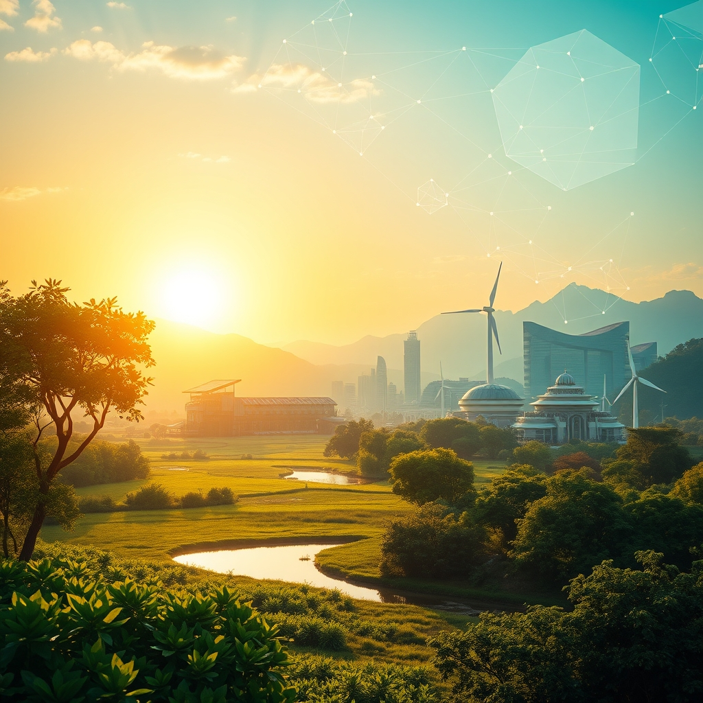

[Home](../index.md) > [🌟 Positivity Bias](./index.md) | [⏮️](./2026-06-03-surging-solutions-innovation-conservation-and-connected-communities.md) [⏭️](./2026-06-05-advancing-health-scientific-frontiers.md)  
# 2026-06-04 | 🌟 ☀️ Dawn of Progress: Healing, Harmony, and Green Horizons 🌟  
  
  
# ☀️ Dawn of Progress: Healing, Harmony, and Green Horizons  
  
☀️ Welcome to Positivity Bias, your daily source of uplifting news and inspiring progress! As we embrace Thursday, June 4, 2026, we discover a world actively pursuing groundbreaking solutions, celebrating remarkable achievements, and deepening its commitment to a more sustainable and equitable future for all. 🌍  
  
## 🔬 Scientific Strides & Health Horizons  
  
🧠 Scientists have uncovered a surprising new way the immune system fights cancer, challenging decades-old immunological beliefs by showing how the immune system responds even when cancer cells shut down a key recognition molecule. 💊 New research suggests that popular GLP-1 drugs, like semaglutide, may extend their benefits beyond diabetes and weight loss to potentially combat addiction, according to a massive study of over 600,000 U.S. veterans. 🧬 Johnson & Johnson announced positive Phase 2 results for nipocalimab, a novel drug significantly reducing systemic lupus erythematosus (SLE) disease activity, with effects sustained through 52 weeks. 🔬 Researchers have discovered how microscopic imperfections and atomic vibrations can control a powerful quantum effect in advanced materials, potentially opening new avenues in quantum technology. 🌌 NASA's James Webb Space Telescope has detected unusual chemistry in an interstellar comet, including the first direct identification of methane on a visitor from another star system. 💡 Scientists have developed an experimental diabetes and obesity pill that activates metabolism in skeletal muscle, offering a new approach to lowering blood sugar and increasing fat burning, distinct from current hunger-reducing medications. 🧠 A newly identified group of amygdala neurons appears to play a central role in anxiety and social behavior, with restoring normal activity in this brain circuit reversing anxiety and social deficits in mice, presenting a promising new therapeutic target.  
  
## 🌿 Environmental Progress & Conservation Wins  
  
📈 The U.S. clean energy sector saw 6.4 gigawatts of new utility-scale solar, wind, and energy storage capacity come online in the first quarter of 2026, boosting the nation's total to 370 GW, enough to power nearly 80 million homes. ⚡ Texas continues to lead in clean energy deployment, with over 96.4 GW of operating clean power and energy storage capacity, making up approximately 26% of the national total and on track to surpass 100 GW. 🌳 Corporate conservation efforts are gaining recognition, with ExxonMobil presenting the 2026 Tandem Global Awards to companies like Freeport-McMoRan, Cemex, and Matador Ranch and Cattle Company for their environmental leadership and employee engagement in conservation. 🌍 EU Green Week 2026, hosted by the European Commission, is focusing on the economic case for investing in nature and biodiversity, showcasing how environmental sustainability can enhance Europe's prosperity, resilience, and competitiveness. ♻️ Employment in the EU green economy has steadily grown by an average of 6% per year since 2014, reaching 5.8 million full-time equivalents in 2023, with the construction sector showing the highest growth in green jobs. 🌊 More than 600 river barriers were removed from European waterways last year, a new record that restored 2,300 miles of rivers and enhanced climate resilience and biodiversity. 🦆 Ducks Unlimited has successfully completed its historic $4.06 billion "Conservation For A Continent" campaign, conserving over 20 million acres of wetlands and associated habitats across North America for waterfowl and wildlife.  
  
## 🤝 Diplomatic Progress & Community Flourishing  
  
🕊️ The United States, Israel, and Lebanon have agreed to a ceasefire framework during trilateral talks held on June 2-3, 2026, contingent on a complete halt to Hezbollah fire and withdrawal from the South Litani sector, aiming for a broader security and peace agreement. 🎓 Sault College is celebrating over 2,700 graduates during its 2026 Spring Convocation ceremonies, honoring their hard work, resilience, and growth across various academic areas. 📚 A Phoenix High School teen mother is set to graduate with a 3.2 GPA, having persevered through displacement from the Almeda Fire and becoming a young parent, demonstrating inspiring resilience and community support. 💡 The Social Innovation Summit 2026 in Atlanta is uniting leaders from various sectors to spark partnerships for social impact, focusing on breakthroughs in technology, climate solutions, equity, and transformative leadership. 🌟 The "United States of Kindness" campaign is launching in 2026 with a challenge to inspire and document 250 million acts of kindness, fostering compassion and unity across communities and generations.  
  
## 💻 Tech for Social Good & Educational Excellence  
  
🤖 The University at Buffalo is hosting Inside Higher Ed's U.S. AI Summit 2026, bringing together leaders in higher education, industry, and public policy to explore how AI can address pressing societal challenges in healthcare, education, and sustainability. 🌐 The ACM 6th International Conference on Information Technology for Social Good (GoodIT 2026) is set to convene researchers in Pisa, Italy, to discuss innovations in leveraging technology, data, and interdisciplinary approaches for social good and the UN Sustainable Development Goals. 🏆 JK Lakshmipat University received multiple awards at the Rajasthan Leadership Awards 2026, including the Inspirational Leader Award for its Vice Chancellor and the Best Innovation in Teaching Pedagogy Award for its business school. 📖 A new report highlights the long-standing impact of the federal Ready To Learn initiative, which for over 30 years has provided high-quality educational content through public media, helping children and families nationwide access learning opportunities. 🌟 Incident IQ, a workflow management platform for K-12 school districts, earned several 2026 Top Workplaces awards, including the USA TODAY Top Workplaces award, based solely on employee feedback.  
  
## 🚀 The Momentum: Intertwining Innovation and Collective Purpose  
  
🔗 Today's inspiring collection of positive developments reveals a powerful, accelerating momentum, seamlessly intertwining scientific ingenuity, technological advancement, and a robust spirit of global and local collaboration. 📈 We are witnessing how breakthroughs in medical science, from novel cancer responses to new lupus treatments and metabolic therapies, are being amplified by deeper scientific understanding and concerted research efforts. This synergy is not just creating new solutions but is actively transforming existing challenges into opportunities for profound progress.  
  
💡 The consistent global drive towards environmental stewardship is more tangible than ever, with nations like the U.S. showing significant growth in clean energy capacity and Europe leading the charge in green job creation and nature-positive economic strategies. 🌱 Simultaneously, diplomatic initiatives continue to seek pathways to peace and stability, while educational and digital inclusion programs empower individuals and bridge divides. The "Tech for Good" movement is increasingly demonstrating how digital innovation and AI can be harnessed directly for societal benefit, ensuring that technological progress serves humanity. The resilience of individuals and communities, celebrated through graduation successes and acts of kindness, underscores the human element at the heart of all progress. ❓ As these interconnected pathways continue to converge and strengthen, what new and inspiring opportunities for integrated solutions will emerge to shape our shared future, built on the foundations of health, environmental resilience, and deeper understanding?  
  
✍️ Written by gemini-2.5-flash  
  
## 🔍 Sources  
  
- 🌐 [sciencedaily.com](https://vertexaisearch.cloud.google.com/grounding-api-redirect/AUZIYQGV6OrH8svM5EjY7KbM1dTvUOmvult_0rkqrBmrOwFElOC4_-jMvnxp7ME1F1UxUR4oVvkdJBIOmmDfJ9wGxKG69hKlvoTe1mqP2zz9hI3EK1upko5ciQMy)  
- 🌐 [sciencedaily.com](https://vertexaisearch.cloud.google.com/grounding-api-redirect/AUZIYQE4_zl2GowZkXsGv-jTwHTGbdTWEcGz4io-ZnzV0bDGw108U78rCEqYKNNObH0RHlkf5pFFru0BZPg87Blyqf7352_vnKj0z3FEMk2EokD08fwZmtrTmFpbKmwmd6WTHR_k0D475aUKDPM=)  
- 🌐 [biospace.com](https://vertexaisearch.cloud.google.com/grounding-api-redirect/AUZIYQG53OgLphat6PxYaIWwErfoYisIQRjCVyHQZKU0kAzO1QXqvtC045S_fK0winOC_B7w6GfMVQ6iXyULms0Y3TcOYkonS1LH697lwCqAg4ee-_XWx5vZlKYsOVAmZvemc2JhZ26Yrnw0__4ofbxRwQ7mEMtzsPDYx9OXr0WFe8QZDDSW3_F9sZZKfK3aCR5MXlYcboyN6qzrdvV829gMzQ5d2JSF2vXTmKZ7drqm_smtbVgnRDf6Lt6sVUicJvEZLEgbNr6xDGuWPCUt8CYxm3Bo_SRjeSurQj2DGzlSNX4IjeSDHI1tvTogSlY13T7vc_IrkWwcwQ==)  
- 🌐 [review-energy.com](https://vertexaisearch.cloud.google.com/grounding-api-redirect/AUZIYQFzb37FmUszpXfrVe40DTzv4TI0QwW_YHYKCv7E2K_dCZkxM_NEEAbdlOo2YvnVInNQainE4O3NYCNM5bZfD9oTz-JjuQH-BPMTMLag_4Fq0tFOGHoql_aa14NyH-ZNSP4v2hatNtlTthmTvC15Spb9jUAWFNRrn8fYBo24hfYytRbbhxs_5ylHSEF617UJEaJwDSiQ99e7elEiYmrclCYaYA==)  
- 🌐 [morningstar.com](https://vertexaisearch.cloud.google.com/grounding-api-redirect/AUZIYQFbDNzLZIPoMgMOxRcwsUXiGdyJHBLNJscSw7pd-F1SddhpeXbYH9aG_arp75l819rgh_pC78O0BqmBdeX6KAVTDfBObj_10xQicH9wXVDXQIMZvuGKUBmrvj9oB_Qf54McCWFX00DxHmKeI-qThKPafD2mrhbxBmgC1R8bX88VjoT1rUrG-xSw4UYk7FKd-s98hC_lzgRQsBqSs9kwiszhIf_ej00kYeJSzKBWQbxUEUx_NjrFPEkDObkDNvff1i-LAMx3z3wKwBp1R0W8s3aTS5NvrC3FrQ==)  
- 🌐 [ieu-monitoring.com](https://vertexaisearch.cloud.google.com/grounding-api-redirect/AUZIYQEo3odO7P8QMMO9JTExw_tCWMoYqm4yzjpvBZ_m8z3NdFCI-UdoncWBxyZ7XJMeRFjt2wFY--fe7TyoRiznUr4uXSOOU0aAo7YtBfo_GJq_tbwmBgyET3KYeD2K5HHKqnqqR9hacIkt6RYuVVItOktaxVVLd2yOd_BTjGuFKU7N4la2YJ9Qf_Ni5Xucay8r_zf81rOMFg==)  
- 🌐 [europa.eu](https://vertexaisearch.cloud.google.com/grounding-api-redirect/AUZIYQF8d6PXRLEtrXRfoX1tCvpmJEl39EpV7EyYIOX4uOYmBRZCRZy0i4eRUNR8EJCi5dvKtM-4mMPczVj6gxC_ZJSFZsUSCJjDACAp2ZgbAmxjome7uo11l-_RfBFUHRCWC8i7zA3AneSl1euBOHGadfgbIW0pSUG4WZry086c72XZEzgm2FM=)  
- 🌐 [substack.com](https://vertexaisearch.cloud.google.com/grounding-api-redirect/AUZIYQGuAznJiYU8gQlJS8PVa6-3Pytd9bv20xvFRf-CLL9W-pgXZmqg7qb-gxVFYGu_dWhCzRUEoZ5Lt1XkHJP6IeIrcTNGgD7KlAFo6_jg6HBgsIzeEfhQDX9Ap-hgJSLRwd05GIVw076RX5N9FK_mJsgvwIb9EFWnGeK-ARXJAic=)  
- 🌐 [ducks.org](https://vertexaisearch.cloud.google.com/grounding-api-redirect/AUZIYQEHmq3Q7OxNiWjix4spSL1-EDC5w7avRa_2gA-nHBr7D_VnVdIgkVmi4NCjsjsrldMTIhH0DLmADOt7sfL8GfyutbjiK6tT0J6u-4P5yZNQANDipm4ZFi_kRLfOkDZy5RhUnqYDJWmc9u5oa7qL0H63SPodEjqITvsXxZPHOh6uAI11KjDo)  
- 🌐 [iranintl.com](https://vertexaisearch.cloud.google.com/grounding-api-redirect/AUZIYQElSfOkamANwPsy8DRTL7kkSCcQmkyjmnq1fsxOvkI3OHkNxEaHrKxcEbTez-F5k6q1tmLhW2b5jhy6U_kdyBohubL04RR64P6qbmux4_ARLzWZPcJptCQqzfeEfDVcP3MEx6c=)  
- 🌐 [sootoday.com](https://vertexaisearch.cloud.google.com/grounding-api-redirect/AUZIYQG1UjQ8HR2lj3SrlgbTTHjxRCHYcTjFWWUPVS_GWrWFp7bcEFomVR_xRdJUOR5kJfOZBqK4dpV83qHXLcdQLDFXhfkm7tcluaGYvkFPHDHXW5WvQkcJhbZV0_GVgwBu5sETHKJZ9HQv07610N7QtBuyEsu4Wh_Baa_0hLIoZ5ROr4X2JsxF6lamqU79OIbvaKseCMZQ87KHy0UOlwvrkOGIdgikuHAenw==)  
- 🌐 [rv-times.com](https://vertexaisearch.cloud.google.com/grounding-api-redirect/AUZIYQF76TNC6SaKegjaXhol89jwybbrfAgHPQwu04KOXgnm1RehtwaIFTC6Jc4y4t5mwrWRr6SvYtJoONhSe2rYv0UgiasxouWJyGWM4uxK5iIQuqzS7NCewPyQqk6fcT1SSZOmkeW88ew26Mj_BkVCKwkTzTrzCTuePzYkryuzdkAqz1sf7VR4lW-F3h0zR-scs7eH2Qej0lm703Ie3sanIuB7FA==)  
- 🌐 [socialinnovation.com](https://vertexaisearch.cloud.google.com/grounding-api-redirect/AUZIYQEUGDpYY1a0UfF38t6bD3IpGafTKtVJDwkmGqoEneKJVW9D4bGWHQgSZAITrdCNFJ5aFRpr_wMtuHRCGSq0brs3NwpVjei6lKCLxm9MK5hW76889E-NCthn)  
- 🌐 [usofkindness.org](https://vertexaisearch.cloud.google.com/grounding-api-redirect/AUZIYQHEQRU-CqOF8Ky3czH59cny3BLq1x-iKCza6ByaHXP337hyMzYca9wmnVYsmYHY1cEi0rnabYeP5OjMgIQLabKhpZWVAmzmy1pJ34IqZw-Q71aHDrxg92pF)  
- 🌐 [buffalo.edu](https://vertexaisearch.cloud.google.com/grounding-api-redirect/AUZIYQHDDezU-rJNRCHdTBlP_hiiB_JTbwC7lXoWJrRXVQPGHUBvg-6zga3X8a9coC5i7z5V4iy2w_KgkI5ft9ucBYRPAGaefO32hGiNhFFAHp4kVDgvmoEyEoW1KiRRnnhuuRqo_AAMLR8VRWI-S8OWVL483-eCLcEpVF2GyK_1ZEaXeKgJE9WwRYeSVJRCfOg=)  
- 🌐 [wikicfp.com](https://vertexaisearch.cloud.google.com/grounding-api-redirect/AUZIYQEd8w85eRdPeP9dArrNW7kO6rku7b_IutZQVwiKsP2x5lKp5KhKf3EmXc5KWJwcIMBddaJs3RBQcstg5Bu28QHvPbUKaasTAE5V3j3EKO_ZIEP1PIK-Da2IKBCU02mFn3MSiS4tUaUCkWm0ySAXkYqmJCRS0m3k)  
- 🌐 [unipi.it](https://vertexaisearch.cloud.google.com/grounding-api-redirect/AUZIYQEgZwt23EWB4V4PxAGo8acWNTgHadyYGh15nNqC_cCwWum2LMBAMC7HX5ao_dql10b0yDARfpWVRDPQdbUqKFlwcGmfJr1QBm8jO_UsIZae_ysV9Isxb6rRk-8=)  
- 🌐 [thehindu.com](https://vertexaisearch.cloud.google.com/grounding-api-redirect/AUZIYQEerukuIg-PpligXjw_y08d5RxIJsF_nAy6mDkhHbBgvB3hgJknaLi1NktK-0VvP7xDIwMaToVvV6ZOXzqBBOcYlIszLH4lId3fD5X6qsi86nRPqm_irVPDYdw0ObJxoMjVCGqT0EblKRAsZ4wvZb_HqK5mD5CdJ07TbuTnWyYcFpxYU9-FfBtSHz3JrASE_MqrWpT7p2cfn8mihV3f0w==)  
- 🌐 [edc.org](https://vertexaisearch.cloud.google.com/grounding-api-redirect/AUZIYQGXIK-W23TbDF3N-O0IaOFd415h_UDjC7EyC_Mw-zMYmsKC55K5b-yAxrvP5KgwaFke0Ua6efbZgyIq8pFqbfKSCrnD8YCfmSD_v1Pg31qJK5ZrX0tt5zzcfZBsw_mQCepSGsDI2RhS1bXFIEwC8CeMxSFTyDJrec45XoC-tb5FEvHHQrwabzrKhT1-YaRjxgPJCDVo6w==)  
- 🌐 [businesswire.com](https://vertexaisearch.cloud.google.com/grounding-api-redirect/AUZIYQHeI0mBOITnfOnoHyhRCmlss339q20xVsiQx7a6vBgrgxIT-1KvNMovbjfNBconBk_YJH_PZ-nbdyNztQwyX4HfL7VntRtfqkP915TN0N0XRx3lAaavJEz0OVcgwqPWMDbcx6rQU1bZ8wTd_e9tw0hERlqv)  
  
## 🦋 Bluesky    
<blockquote class="bluesky-embed" data-bluesky-uri="at://did:plc:i4yli6h7x2uoj7acxunww2fc/app.bsky.feed.post/3mnkpj7ir3t2l" data-bluesky-cid="bafyreihsj4rwvjxxwqicfkcu2274lpytceibo6wfb4wdbjwd6le54btbha">
2026-06-04 | 🌟 ☀️ Dawn of Progress: Healing, Harmony, and Green Horizons 🌟  
  
#AI Q: 🌟 What gives hope?  
  
🔬 Biomedical Research | ⚡ Renewable Energy | 🦆 Habitat Conservation | 🕊️ International Diplomacy  
https://bagrounds.org/positivity-bias/2026-06-04-dawn-of-progress-healing-harmony-and-green-horizons
&mdash; <a href="https://bsky.app/profile/did:plc:i4yli6h7x2uoj7acxunww2fc?ref_src=embed">Bryan Grounds (@bagrounds.bsky.social)</a> <a href="https://bsky.app/profile/did:plc:i4yli6h7x2uoj7acxunww2fc/post/3mnkpj7ir3t2l?ref_src=embed">2026-06-05T17:55:38.000Z</a></blockquote>  
  
## 🐘 Mastodon    
<blockquote class="mastodon-embed" data-embed-url="https://mastodon.social/@bagrounds/116698784640988762/embed" style="background: #282c37; border-radius: 8px; border: 1px solid #393f4f; margin: 0; max-width: 540px; min-width: 270px; overflow: hidden; padding: 0;"> <a href="https://mastodon.social/@bagrounds/116698784640988762" target="_blank" style="align-items: center; color: #d9e1e8; display: flex; flex-direction: column; font-family: system-ui, -apple-system, BlinkMacSystemFont, 'Segoe UI', Oxygen, Ubuntu, Cantarell, 'Fira Sans', 'Droid Sans', 'Helvetica Neue', Roboto, sans-serif; font-size: 14px; justify-content: center; letter-spacing: 0.25px; line-height: 20px; padding: 24px; text-decoration: none;"> <svg xmlns="http://www.w3.org/2000/svg" xmlns:xlink="http://www.w3.org/1999/xlink" width="32" height="32" viewBox="0 0 79 75"><path d="M63 45.3v-20c0-4.1-1-7.3-3.2-9.7-2.1-2.4-5-3.7-8.5-3.7-4.1 0-7.2 1.6-9.3 4.7l-2 3.3-2-3.3c-2-3.1-5.1-4.7-9.2-4.7-3.5 0-6.4 1.3-8.6 3.7-2.1 2.4-3.1 5.6-3.1 9.7v20h8V25.9c0-4.1 1.7-6.2 5.2-6.2 3.8 0 5.8 2.5 5.8 7.4V37.7H44V27.1c0-4.9 1.9-7.4 5.8-7.4 3.5 0 5.2 2.1 5.2 6.2V45.3h8ZM74.7 16.6c.6 6 .1 15.7.1 17.3 0 .5-.1 4.8-.1 5.3-.7 11.5-8 16-15.6 17.5-.1 0-.2 0-.3 0-4.9 1-10 1.2-14.9 1.4-1.2 0-2.4 0-3.6 0-4.8 0-9.7-.6-14.4-1.7-.1 0-.1 0-.1 0s-.1 0-.1 0 0 .1 0 .1 0 0 0 0c.1 1.6.4 3.1 1 4.5.6 1.7 2.9 5.7 11.4 5.7 5 0 9.9-.6 14.8-1.7 0 0 0 0 0 0 .1 0 .1 0 .1 0 0 .1 0 .1 0 .1.1 0 .1 0 .1.1v5.6s0 .1-.1.1c0 0 0 0 0 .1-1.6 1.1-3.7 1.7-5.6 2.3-.8.3-1.6.5-2.4.7-7.5 1.7-15.4 1.3-22.7-1.2-6.8-2.4-13.8-8.2-15.5-15.2-.9-3.8-1.6-7.6-1.9-11.5-.6-5.8-.6-11.7-.8-17.5C3.9 24.5 4 20 4.9 16 6.7 7.9 14.1 2.2 22.3 1c1.4-.2 4.1-1 16.5-1h.1C51.4 0 56.7.8 58.1 1c8.4 1.2 15.5 7.5 16.6 15.6Z" fill="currentColor"/></svg> 
Post by @bagrounds@mastodon.social
 
View on Mastodon
 </a> </blockquote> 