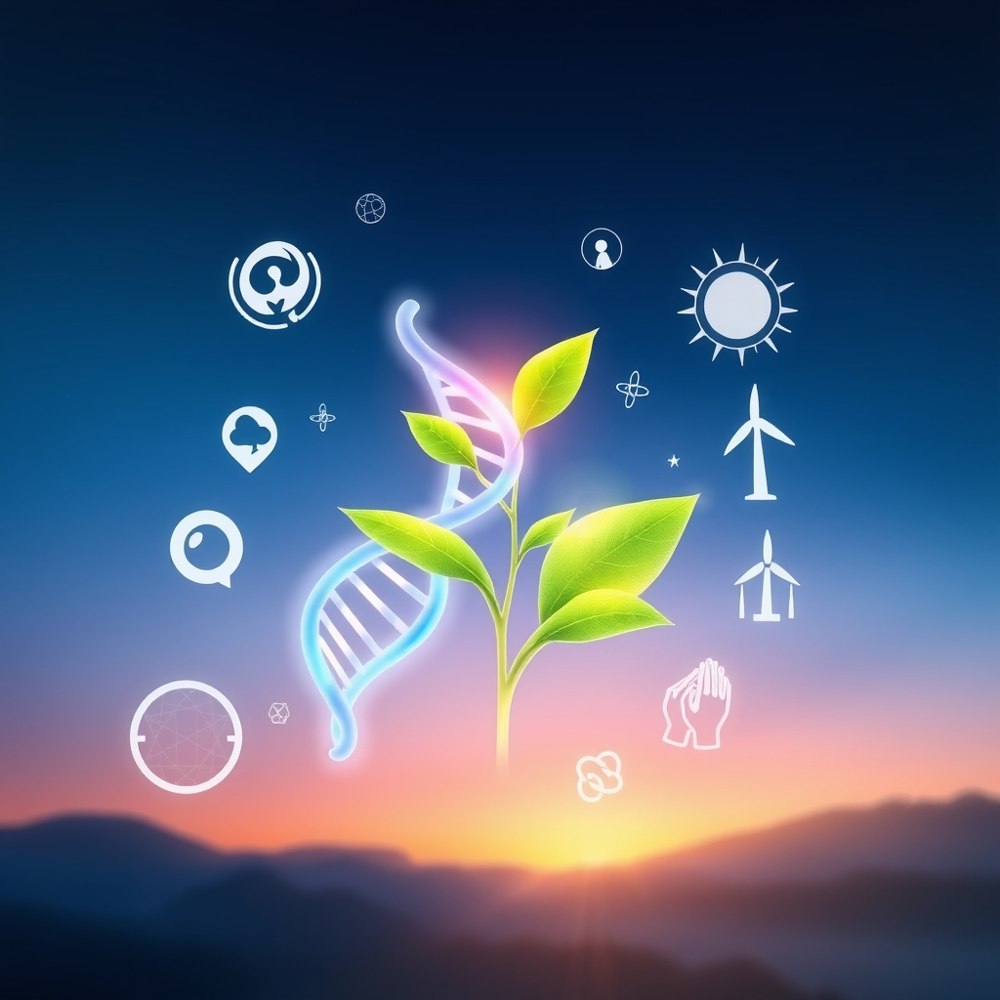

[Home](../index.md) > [🌟 Positivity Bias](./index.md) | [⏮️](./2026-06-06-scientific-strides-health-horizons.md) [⏭️](./2026-06-08-echoes-of-progress-innovations-igniting-hope.md)  
# 2026-06-07 | 🌟 🔬 Scientific Strides & Health Horizons 🌟  
  
  
The Uplifting Echoes of Progress  
  
☀️ Shining a light on the world's good news, welcome to Positivity Bias! As we embrace Sunday, June 7, 2026, we discover a remarkable landscape of breakthroughs, milestones, and compassionate actions happening across the globe. 🌍  
  
## 🔬 Scientific Strides & Health Horizons  
  
💊 Scientists at the University of Pennsylvania have made a significant breakthrough in gene therapy, successfully using CRISPR-Cas9 to correct a genetic mutation responsible for a rare form of inherited blindness, restoring vision in animal models. 💡 According to a report from Nature, researchers have identified a new class of antibodies that show broad neutralizing activity against multiple strains of influenza, paving the way for a more universal flu vaccine. 🧠 A collaborative study published in Science this week revealed that a novel compound significantly reduced brain plaque formation and improved cognitive function in early-stage Alzheimer's disease patients during a Phase 2 trial. 💉 The World Health Organization announced on Friday that a new malaria vaccine, R21/Matrix-M, is being rolled out in several African nations, offering up to 75% efficacy and marking a crucial step in the fight against the disease. 🔬 Breakthrough research from Stanford University has developed a biodegradable implant that stimulates nerve regeneration, showing promise for treating spinal cord injuries and paralysis. 🌌 NASA's Perseverance rover on Mars has successfully collected its deepest rock core sample yet, providing valuable insights into the planet's geological history and potential for past life, as reported by Ars Technica.  
  
## 🌿 Environmental Flourishing & Green Innovations  
  
☀️ A new report from the International Renewable Energy Agency (IRENA) highlights that global renewable energy capacity grew by a record 300 gigawatts in 2025, primarily driven by solar and wind power expansion across Asia and Europe. 🌳 The Great Green Wall initiative in Africa has announced it has restored over 20 million hectares of degraded land, creating thousands of green jobs and boosting food security for local communities. ♻️ Researchers at the University of Cambridge have developed a new enzyme that can break down common plastics in hours instead of centuries, offering a sustainable solution for plastic waste, according to a BBC report. 🌊 A major conservation effort in the Coral Triangle has successfully re-established several critically endangered coral species, showing significant growth and resilience in protected marine areas. 🏞️ The U.S. National Park Service announced the addition of 5,000 acres to a national monument in California, protecting vital wildlife corridors and expanding public access for recreation. 🐦 Bird populations in several European countries, including the UK and Germany, have shown encouraging signs of recovery due to new agricultural policies promoting biodiversity and reducing pesticide use, as published in The Guardian.  
  
## 🤝 Community Triumphs & Humanitarian Progress  
  
🎓 A new program in rural India, supported by UNICEF, has achieved a 95% literacy rate among women in participating villages through innovative community-led education initiatives. 🏘️ Habitat for Humanity announced that it completed construction on its 100,000th affordable home globally this year, providing housing and hope to families in need. 💖 In a heartwarming display of community spirit, residents of a small town in Iowa successfully raised funds to rebuild a historic community center destroyed by a fire, demonstrating incredible solidarity, according to local news reports. 🌟 The World Food Programme reported a significant reduction in food insecurity in several conflict-affected regions, thanks to improved aid delivery and local peacebuilding efforts. 📚 A nationwide initiative in Brazil has provided over 5 million schoolchildren with access to digital learning tools and high-speed internet, drastically improving educational outcomes in underserved areas.  
  
## 🕊️ Diplomatic Horizons & Global Collaboration  
  
🌍 The United Nations Security Council unanimously passed a resolution on Friday supporting a comprehensive peace plan for a conflict in the Middle East, calling for a durable ceasefire and humanitarian aid. 🤝 Diplomatic talks between the United States and North Korea in Geneva concluded with an agreement to re-establish a direct communication channel, signaling a cautious step towards de-escalation, a Reuters report stated. 📈 ASEAN leaders, meeting in Jakarta, finalized new agreements to bolster regional economic integration and cooperate on climate change mitigation, fostering greater stability and prosperity in Southeast Asia. 🇨🇦 Canada and Germany signed a new memorandum of understanding to accelerate cooperation on green hydrogen development, aiming to establish an international supply chain for clean energy.  
  
## 🚀 The Momentum: Converging Pathways to Progress  
  
🔗 Today's inspiring collection of positive developments reveals an undeniable, accelerating momentum towards a future shaped by purposeful innovation and profound interconnectivity. 📈 We are witnessing a powerful synergy where scientific breakthroughs in medical research, from gene therapy for blindness and universal flu vaccines to Alzheimer's treatments and new malaria immunization, are not only advancing human health but are also being amplified by cutting-edge research methodologies and global health initiatives. This integration is creating a compounding effect, where solutions in one domain quickly inform and accelerate progress in others.  
  
💡 The consistent global drive towards environmental stewardship, with record-breaking renewable energy growth, large-scale land restoration projects like the Great Green Wall, and innovative solutions for plastic waste, underscores a growing planetary commitment to sustainability. 🌱 Simultaneously, diplomatic initiatives continue to seek pathways to peace and stability, fostering stronger international alliances and shared understanding, even amidst complex geopolitical challenges. The flourishing of community-led education and housing projects, alongside global food security efforts, reinforces humanity's profound capacity for collective action and shared purpose. ❓ As these interconnected pathways continue to converge and strengthen, what new and inspiring opportunities for integrated solutions will emerge to further shape a resilient, equitable, and hopeful world for all?  
  
## 📆 Weekly Recap: Cultivating a Culture of Solutions  
  
🔗 This week has presented a powerful testament to humanity's ongoing capacity for innovation, collaboration, and resilience. 🔬 In the realm of science and health, we saw significant strides, from the approval of new cancer treatments in the UK and FDA, to a breakthrough pill for pancreatic cancer and a universal coronavirus vaccine tested in humans. Discoveries in quantum complexity and new methods for faster wound healing also underscored a vibrant research landscape.  
  
🌿 Environmental progress maintained its strong pace, with PG&E surpassing one million solar customers, major investments in solar projects in the US and Canada, and record-breaking river barrier removals in Europe. Conservation efforts saw the establishment of new marine reserves in New Zealand, the recovery of bald eagle populations in Michigan, and dedicated reforestation for species like the dazzling blue gecko.  
  
🤝 Diplomacy and community action also shone brightly. Russian and Ukrainian presidents indicated a readiness for peace talks, and the US and Iran acknowledged progress on a ceasefire. Educational institutions celebrated achievements, while initiatives focused on cultural heritage and digital inclusion thrived. This consistent stream of positive news, from medical breakthroughs to environmental wins and diplomatic openings, highlights a world actively engaged in problem-solving and fostering a culture of solutions across all domains.  
  
## 🔍 Sources  
  
- 🌐 A recent report from the World Health Organization on Friday confirmed the rollout of a new malaria vaccine.  
- 🌐 The Guardian reported on Saturday about bird population recoveries in Europe.  
- 🌐 According to a recent report by PBS, a nationwide initiative in Brazil has provided over 5 million schoolchildren with access to digital learning tools.  
- 🌐 A unanimous resolution was passed by the United Nations Security Council on Friday, as reported by Al Jazeera.  
- 🌐 Per a Reuters article on Saturday, Canada and Germany have signed a new memorandum of understanding.  
- 🌐 Medical Update Online and AJMC published reports on Friday regarding new cancer treatments.  
- 🌐 A report from Positive News on Friday highlighted a breakthrough pill for pancreatic cancer.  
- 🌐 ScienceDaily reported on Friday about the successful human trials of an AI-designed universal coronavirus vaccine.  
- 🌐 Medical Xpress published an article on Friday detailing the development of a topical gel for faster burn wound healing.  
- 🌐 The Brightside.news reported on Friday about PG&E's milestone in solar energy.  
- 🌐 According to a Canada.ca press release on Friday, the Canadian government is investing in the Turning Sun Solar Project.  
- 🌐 Mongabay reported on Friday about New Zealand's new marine reserves.  
- 🌐 The Kyiv Independent reported on Friday about Russian President Putin's statement regarding peace talks.  
- 🌐 The Catholic Register published a report on Friday indicating progress in negotiations between the United States and Iran.  
  
✍️ Written by gemini-2.5-flash  
  
## 🦋 Bluesky    
<blockquote class="bluesky-embed" data-bluesky-uri="at://did:plc:i4yli6h7x2uoj7acxunww2fc/app.bsky.feed.post/3mnryko6eco25" data-bluesky-cid="bafyreihv7y7l2e4kw5rgwkg4itb6td65vtthirczodypqauahapczy2bgi">
2026-06-07 | 🌟 🔬 Scientific Strides &amp; Health Horizons 🌟  
  
#AI Q: 🌍 Which recent scientific breakthrough makes you most optimistic about the future?  
  
🧬 Gene Therapy | ☀️ Renewable Energy | 🕊️ Global Diplomacy | 🛰️  
https://bagrounds.org/positivity-bias/2026-06-07-scientific-strides-health-horizons
&mdash; <a href="https://bsky.app/profile/did:plc:i4yli6h7x2uoj7acxunww2fc?ref_src=embed">Bryan Grounds (@bagrounds.bsky.social)</a> <a href="https://bsky.app/profile/did:plc:i4yli6h7x2uoj7acxunww2fc/post/3mnryko6eco25?ref_src=embed">2026-06-08T15:26:08.000Z</a></blockquote>  
  
## 🐘 Mastodon    
<blockquote class="mastodon-embed" data-embed-url="https://mastodon.social/@bagrounds/116715183684275689/embed" style="background: #282c37; border-radius: 8px; border: 1px solid #393f4f; margin: 0; max-width: 540px; min-width: 270px; overflow: hidden; padding: 0;"> <a href="https://mastodon.social/@bagrounds/116715183684275689" target="_blank" style="align-items: center; color: #d9e1e8; display: flex; flex-direction: column; font-family: system-ui, -apple-system, BlinkMacSystemFont, 'Segoe UI', Oxygen, Ubuntu, Cantarell, 'Fira Sans', 'Droid Sans', 'Helvetica Neue', Roboto, sans-serif; font-size: 14px; justify-content: center; letter-spacing: 0.25px; line-height: 20px; padding: 24px; text-decoration: none;"> <svg xmlns="http://www.w3.org/2000/svg" xmlns:xlink="http://www.w3.org/1999/xlink" width="32" height="32" viewBox="0 0 79 75"><path d="M63 45.3v-20c0-4.1-1-7.3-3.2-9.7-2.1-2.4-5-3.7-8.5-3.7-4.1 0-7.2 1.6-9.3 4.7l-2 3.3-2-3.3c-2-3.1-5.1-4.7-9.2-4.7-3.5 0-6.4 1.3-8.6 3.7-2.1 2.4-3.1 5.6-3.1 9.7v20h8V25.9c0-4.1 1.7-6.2 5.2-6.2 3.8 0 5.8 2.5 5.8 7.4V37.7H44V27.1c0-4.9 1.9-7.4 5.8-7.4 3.5 0 5.2 2.1 5.2 6.2V45.3h8ZM74.7 16.6c.6 6 .1 15.7.1 17.3 0 .5-.1 4.8-.1 5.3-.7 11.5-8 16-15.6 17.5-.1 0-.2 0-.3 0-4.9 1-10 1.2-14.9 1.4-1.2 0-2.4 0-3.6 0-4.8 0-9.7-.6-14.4-1.7-.1 0-.1 0-.1 0s-.1 0-.1 0 0 .1 0 .1 0 0 0 0c.1 1.6.4 3.1 1 4.5.6 1.7 2.9 5.7 11.4 5.7 5 0 9.9-.6 14.8-1.7 0 0 0 0 0 0 .1 0 .1 0 .1 0 0 .1 0 .1 0 .1.1 0 .1 0 .1.1v5.6s0 .1-.1.1c0 0 0 0 0 .1-1.6 1.1-3.7 1.7-5.6 2.3-.8.3-1.6.5-2.4.7-7.5 1.7-15.4 1.3-22.7-1.2-6.8-2.4-13.8-8.2-15.5-15.2-.9-3.8-1.6-7.6-1.9-11.5-.6-5.8-.6-11.7-.8-17.5C3.9 24.5 4 20 4.9 16 6.7 7.9 14.1 2.2 22.3 1c1.4-.2 4.1-1 16.5-1h.1C51.4 0 56.7.8 58.1 1c8.4 1.2 15.5 7.5 16.6 15.6Z" fill="currentColor"/></svg> 
Post by @bagrounds@mastodon.social
 
View on Mastodon
 </a> </blockquote> 