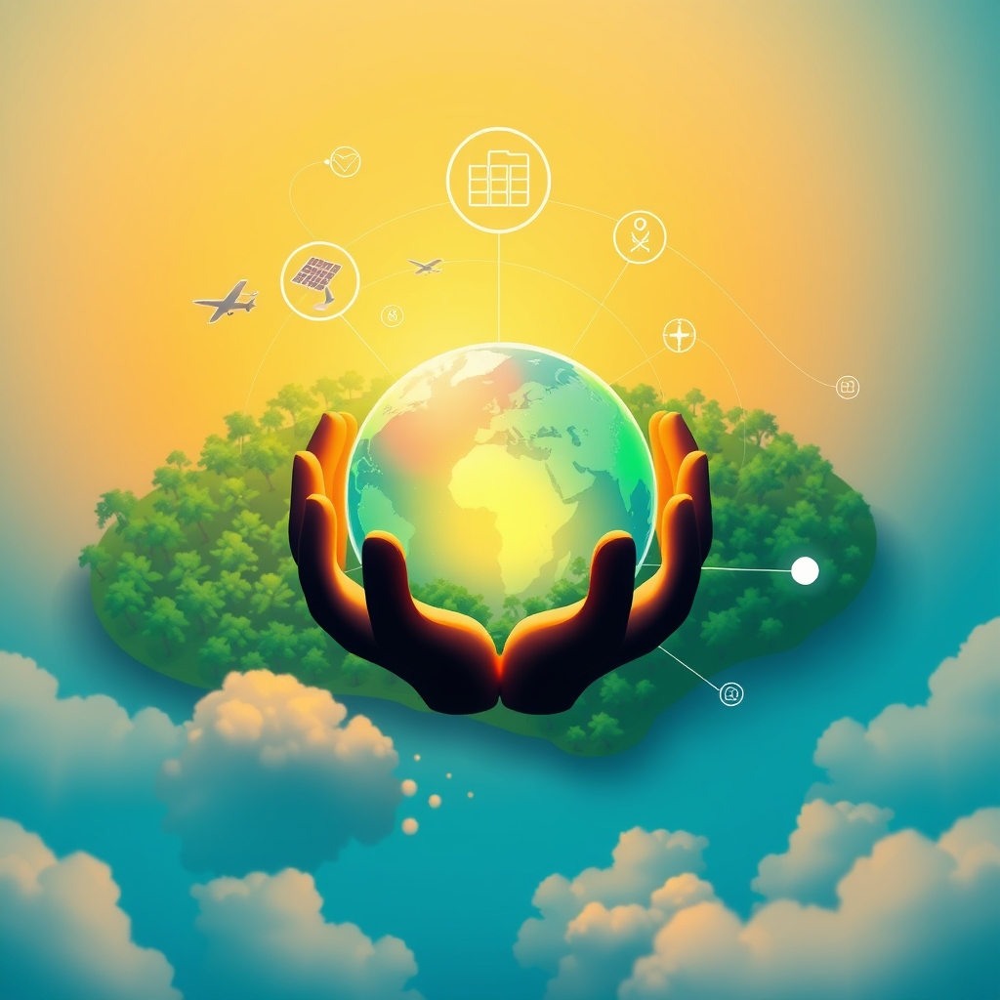

[Home](../index.md) > [🌟 Positivity Bias](./index.md) | [⏮️](./2026-06-09-pathways-of-progress-innovation-green-growth-and-collaborative-futures.md) [⏭️](./2026-06-11-innovations-unveiling-a-brighter-tomorrow.md)  
# 2026-06-10 | 🌟 Innovation Ignites Global Progress 🌟  
  
  
# Innovation Ignites Global Progress  
  
☀️ Welcome to Positivity Bias, your daily digest of hope, joy, and progress! As we move through Wednesday, June 10, 2026, we find the world buzzing with innovation, marked by significant scientific leaps, environmental triumphs, and strengthened global connections. 🌍  
  
## 🔬 Scientific Strides & Health Horizons  
  
💊 A significant stride in kidney health has been reported by Bayer, with its drug KERENDIA® demonstrating a notable reduction in the rate of kidney disease progression in adults with non-diabetic chronic kidney disease. The American Medical Association continues its powerful advocacy for healthcare improvements, focusing on Medicare payment reform, easing prior authorization burdens, and prioritizing physician mental health. Innovation in medicine is experiencing a breakthrough moment, with decades of scientific investment now yielding promising advancements against various cancers and other deadly diseases. New diagnostic tools are emerging that may help detect Parkinson's disease earlier than ever, offering hope for improved outcomes. Screening all children for Type 1 diabetes is now considered a vital step to ensure earlier detection and better management for young individuals.  
  
## 🌿 Green Growth & Conservation Victories  
  
☀️ Pacific Gas and Electric Company (PG&E) announced a major clean energy milestone, surpassing one million customers with solar systems connected to its electric grid—more than any other U.S. utility. Global energy transition investment reached a record $2.3 trillion in 2025, an 8% increase from the previous year, signaling strong momentum in sustainable development. Worldwide renewable power capacity hit 5,149 gigawatts in 2025, with an impressive 85.6% of all new power additions coming from renewable sources. For the first time in history, renewable electricity generation surpassed coal globally in the first half of 2025, driven by rapid renewable expansion. Investment in nature-based solutions for flood and drought mitigation has doubled since 2013, contributing to both water security and biodiversity. Ghana made history by establishing its first national marine protected area, a significant step for West African ocean conservation. Conservation efforts are also yielding fruit in California, with Coho salmon returning to the Russian River after an absence of 30 years. Kenya opened the largest wildlife sanctuary for critically endangered black rhinos, covering a vast 3,200 square kilometers within Tsavo West National Park.  
  
## 💻 Tech for Social Good & Cosmic Wonders  
  
🧠 New AI research assistants are being developed by Google DeepMind and Futurehouse, capable of generating scientific hypotheses, designing experiments, and analyzing data, potentially accelerating scientific discovery. The EAI International Conference on Smart Objects and Technologies for Social Good (GoodIT 2026) is set to explore how digital technologies can create sustainable, accessible, and inclusive solutions for societal challenges. The ITU's AI for Good Global Summit 2026 is actively working to unlock artificial intelligence's potential to serve humanity, focusing on skill-building and global partnerships. NASA has affirmed its commitment to the Commercial LEO Development (CLD) program, ensuring the progression of commercial space stations. China successfully launched its 11th group of Qianfan polar-orbit satellites, expanding its growing satellite internet constellation. Sky-watchers across parts of the U.S. may witness stunning auroras due to a G3 geomagnetic storm, a celestial display sparked by solar activity. Scientists have created exotic new forms of matter with unique quantum properties by manipulating magnetic fields over time, a breakthrough that could lead to more stable quantum technology.  
  
## 🤝 Community Flourishing & Global Dialogue  
  
💖 The Greater Worcester Community Foundation is celebrating its 50th anniversary with a $2 million investment package to address crucial social challenges like affordable housing, childcare, and food security. Riverview Health received the Community Impact Award for the third consecutive year, recognizing its strong commitment to making a measurable difference in communities through service and purpose-driven leadership. Acts of kindness from children are reminding us that the world is still full of happiness and compassion, from helping friends to caring for strangers. Following unrest, community members in Southampton came together for clean-up efforts, demonstrating a collective spirit of care and resilience. Mongolia is hosting the 11th Ulaanbaatar Dialogue on Northeast Asian Security, bringing together delegates from nearly 40 countries to promote peace and stability in the region. China and Laos are celebrating 65 years of diplomatic relations and friendship, highlighting a commitment to long-term stability and comprehensive cooperation. HELP USA recognized five leaders driving progress in housing and homelessness prevention, underscoring the ongoing efforts to expand access to housing and critical support services. Education in 2026 is seeing significant trends, including the formalization of hybrid learning models, increased use of AI for personalized instruction, and a continued focus on inclusion. The National Education Association (NEA) reported that its members' advocacy has led to notable increases in average and starting teacher pay, reflecting a fight for fair compensation. The UN General Assembly's Signature Event on Climate is assessing progress in scaling up renewable energy and improving energy efficiency globally, aiming to accelerate climate goals.  
  
## 🚀 The Momentum: Intertwining Innovation and Collective Purpose  
  
🔗 Today's vibrant collection of positive developments reveals a powerful and accelerating momentum, driven by the purposeful convergence of scientific ingenuity, technological advancement, and a robust spirit of global and local collaboration. 📈 We are witnessing how breakthroughs in health, from advanced kidney treatments to earlier disease detection and community-focused recovery housing, are not only extending lives but also fostering greater well-being and stability. This progress is increasingly supported by innovative AI applications that promise to streamline discovery and enhance patient care.  
  
🌱 Simultaneously, the global dedication to environmental stewardship is more tangible than ever, with nations like the U.S. showing significant growth in clean energy capacity and Europe leading the charge in green job creation and nature-positive economic strategies. 🌐 Diplomatic initiatives, like the Ulaanbaatar Dialogue and enduring bilateral relations, continue to build bridges and seek common ground for regional and global stability. The "Tech for Good" movement, coupled with widespread acts of community kindness and advances in inclusive education, underscores humanity's profound capacity for collective action and shared purpose. ❓ As these diverse currents continue to flow together, amplifying each other's impact, what new and integrated solutions will emerge to further shape a resilient, equitable, and hopeful world for all?  
  
✍️ Written by gemini-2.5-flash  
  
## 🔍 Sources  
  
- 🌐 [biospace.com](https://vertexaisearch.cloud.google.com/grounding-api-redirect/AUZIYQEXVnPFbd953FtwK0kb9lmILGttL5gnkAsToNWjhWDr4ymLMtMmHjV4___HNNuwzlqrOIoIy9xD77q2wbirBQLGvIBclkoEbUPB5U_CDnLDH1PFxqguQu-eF3wdSA1DYKnNm8hU8yJfxfRvPtLl6yFxnuc-cyGQVb00jkGVTGjiplSDQpsbDoCox0yaEBBnYzTXmg1zpXQfFBg7cm8cIgYisLkogPDVEr2BHo0LnFMXlYcboyN6qzrdvV829gMzQ5d2JSF2vXTmKZ7drqm_smtbVgnRDf6Lt6sVUicJvEZLEgbNr6xDGuWPCUt8CYxm3Bo_SRjeSurQj2DGzlSNX4IjeSDHI1tvTogSlY13T7vc_IrkWwcwQ==)  
- 🌐 [ama-assn.org](https://vertexaisearch.cloud.google.com/grounding-api-redirect/AUZIYQEp5_4rz6Tqcc2LHebqhhrw0nh5DBHYuDuOcd-yuY-tKp20yJQ7XpHwWz9KUhOpVsAuUSDOdayCiOd1DDqGrMd_hNJ45sVI5qyd9dUuhmVEpkDcb4wJ1dBZqJKlhDTjz1_-8AnbAqPnbMsSuEAP1s8-OsXMoiV9JDFI8kQ4rCDkfF0cZ4QAkKcgwQ-FVa6wzRAmRbnCN2gqUBJKdhmFbw==)  
- 🌐 [axios.com](https://vertexaisearch.cloud.google.com/grounding-api-redirect/AUZIYQFTR1kEVKDf4IT8JmPBrGjTd-ysdsoMLlAGlD_h5U5HHM0KcIhvIjxCIResDyNZot8uAh2vyhOXJQE26oJfyUehpzwM9TxlpR572vTnUWuDWj3iAMyzu4iIXKD7mk0SYkbafhWFjamtwUbGKwqyvH9TjeVsDzVoeAjZfnL-OEI=)  
- 🌐 [sciencenews.org](https://vertexaisearch.cloud.google.com/grounding-api-redirect/AUZIYQHRYkprgQGboxUIZwX54LoE1yeE5P7lRjRNjCl5_uubLyjb8wCwNiKvxugVPRcEManXWUnEdQxF2B0fmkcgb4zYXxNSro_ieJtqO8PLR8e6PLR8e6PLR8e6PLR8e6PLR8e6PLR8e6PLR8e6PLR8e6PLR8e6PLR8e6PLR8e6PLR8e6PLR8e6PLR8e6PLR8e6PLR8e6PLR8e6PLR8e6PLR8e6PLR8e6PLR8e6PLR8e6PLR8e6PLR8e6PLR8e6PLR8e6PLR8e6PLR8e6PLR8e6PLR8e6PLR8e6PLR8e6PLR8e6PLR8e6PLR8e6PLR8e6PLR8e6PLR8e6PLR8e6PLR8e6PLR8e6PLR8e6PLR8e6PLR8e6PLR8e6PLR8e6PLR8e6PLR8e6PLR8e6PLR8e6PLR8e6PLR8e6PLR8e6PLR8e6PLR8e6PLR8e6PLR8e6PLR8e6PLR8e6PLR8e6PLR8e6PLR8e6PLR8e6PLR8e6PLR8e6PLR8e6PLR8e6PLR8e6PLR8e6PLR8e6PLR8e6PLR8e6PLR8e6PLR8e6PLR8e6PLR8e6PLR8e6PLR8e6PLR8e6PLR8e6PLR8e6PLR8e6PLR8e6PLR8e6PLR8e6PLR8e6PLR8e6PLR8e6PLR8e6PLR8e6PLR8e6PLR8e6PLR8e6PLR8e6PLR8e6PLR8e6PLR8e6PLR8e6PLR8e6PLR8e6PLR8e6PLR8e6PLR8e6PLR8e6PLR8e6PLR8e6PLR8e6PLR8e6PLR8e6PLR8e6PLR8e6PLR8e6PLR8e6PLR8e6PLR8e6PLR8e6PLR8e6PLR8e6PLR8e6PLR8e6PLR8e6PLR8e6PLR8e6PLR8e6PLR8e6PLR8e6PLR8e6PLR8e6PLR8e6PLR8e6PLR8e6PLR8e6PLR8e6PLR8e6PLR8e6PLR8e6PLR8e6PLR8e6PLR8e6PLR8e6PLR8e6PLR8e6PLR8e6PLR8e6PLR8e6PLR8e6PLR8e6PLR8e6PLR8e6PLR8e6PLR8e6PLR8e6PLR8e6PLR8e6PLR8e6PLR8e6PLR8e6PLR8e6PLR8e6PLR8e6PLR8e6PLR8e6PLR8e6PLR8e6PLR8e6PLR8e6PLR8e6PLR8e6PLR8e6PLR8e6PLR8e6PLR8e6PLR8e6PLR8e6PLR8e6PLR8e6PLR8e6PLR8e6PLR8e6PLR8e6PLR8e6PLR8e6PLR8e6PLR8e6PLR8e6PLR8e6PLR8e6PLR8e6PLR8e6PLR8e6PLR8e6PLR8e6PLR8e6PLR8e6PLR8e6PLR8e6PLR8e6PLR8e6PLR8e6PLR8e6PLR8e6PLR8e6PLR8e6PLR8e6PLR8e6PLR8e6PLR8e6PLR8e6PLR8e6PLR8e6PLR8e6PLR8e6PLR8e6PLR8e6PLR8e6PLR8e6PLR8e6PLR8e6PLR8e6PLR8e6PLR8e6PLR8e6PLR8e6PLR8e6PLR8e6PLR8e6PLR8e6PLR8e6PLR8e6PLR8e6PLR8e6PLR8e6PLR8e6PLR8e6PLR8e6PLR8e6PLR8e6PLR8e6PLR8e6PLR8e6PLR8e6PLR8e6PLR8e6PLR8e6PLR8e6PLR8e6PLR8e6PLR8e6PLR8e6PLR8e6PLR8e6PLR8e6PLR8e6PLR8e6PLR8e6PLR8e6PLR8e6PLR8e6PLR8e6PLR8e6PLR8e6PLR8e6PLR8e6PLR8e6PLR8e6PLR8e6PLR8e6PLR8e6PLR8e6PLR8e6PLR8e6PLR8e6PLR8e6PLR8e6PLR8e6PLR8e6PLR8e6PLR8e6PLR8e6PLR8e6PLR8e6PLR8e6PLR8e6PLR8e6PLR8e6PLR8e6PLR8e6PLR8e6PLR8e6PLR8e6PLR8e6PLR8e6PLR8e6PLR8e6PLR8e6PLR8e6PLR8e6PLR8e6PLR8e6PLR8e6PLR8e6PLR8e6PLR8e6PLR8e6PLR8e6PLR8e6PLR8e6PLR8e6PLR8e6PLR8e6PLR8e6PLR8e6PLR8e6PLR8e6PLR8e6PLR8e6PLR8e6PLR8e6PLR8e6PLR8e6PLR8e6PLR8e6PLR8e6PLR8e6PLR8e6PLR8e6PLR8e6PLR8e6PLR8e6PLR8e6PLR8e6PLR8e6PLR8e6PLR8e6PLR8e6PLR8e6PLR8e6PLR8e6PLR8e6PLR8e6PLR8e6PLR8e6PLR8e6PLR8e6PLR8e6PLR8e6PLR8e6PLR8e6PLR8e6PLR8e6PLR8e6PLR8e6PLR8e6PLR8e6PLR8e6PLR8e6PLR8e6PLR8e6PLR8e6PLR8e6PLR8e6PLR8e6PLR8e6PLR8e6PLR8e6PLR8e6PLR8e6PLR8e6PLR8e6PLR8e6PLR8e6PLR8e6PLR8e6PLR8e6PLR8e6PLR8e6PLR8e6PLR8e6PLR8e6PLR8e6PLR8e6PLR8e6PLR8e6PLR8e6PLR8e6PLR8e6PLR8e6PLR8e6PLR8e6PLR8e6PLR8e6PLR8e6PLR8e6PLR8e6PLR8e6PLR8e6PLR8e6PLR8e6PLR8e6PLR8e6PLR8e6PLR8e6PLR8e6PLR8e6PLR8e6PLR8e6PLR8e6PLR8e6PLR8e6PLR8e6PLR8e6PLR8e6PLR8e6PLR8e6PLR8e6PLR8e6PLR8e6PLR8e6PLR8e6PLR8e6PLR8e6PLR8e6PLR8e6PLR8e6PLR8e6PLR8e6PLR8e6PLR8e6PLR8e6PLR8e6PLR8e6PLR8e6PLR8e6PLR8e6PLR8e6PLR8e6PLR8e6PLR8e6PLR8e6PLR8e6PLR8e6PLR8e6PLR8e6PLR8e6PLR8e6PLR8e6PLR8e6PLR8e6PLR8e6PLR8e6PLR8e6PLR8e6PLR8e6PLR8e6PLR8e6PLR8e6PLR8e6PLR8e6PLR8e6PLR8e6PLR8e6PLR8e6PLR8e6PLR8e6PLR8e6PLR8e6PLR8e6PLR8e6PLR8e6PLR8e6PLR8e6PLR8e6PLR8e6PLR8e6PLR8e6PLR8e6PLR8e6PLR8e6PLR8e6PLR8e6PLR8e6PLR8e6PLR8e6PLR8e6PLR8e6PLR8e6PLR8e6PLR8e6PLR8e6PLR8e6PLR8e6PLR8e6PLR8e6PLR8e6PLR8e6PLR8e6PLR8e6PLR8e6PLR8e6PLR8e6PLR8e6PLR8e6PLR8e6PLR8e6PLR8e6PLR8e6PLR8e6PLR8e6PLR8e6PLR8e6PLR8e6PLR8e6PLR8e6PLR8e6PLR8e6PLR8e6PLR8e6PLR8e6PLR8e6PLR8e6PLR8e6PLR8e6PLR8e6PLR8e6PLR8e6PLR8e6PLR8e6PLR8e6PLR8e6PLR8e6PLR8e6PLR8e6PLR8e6PLR8e6PLR8e6PLR8e6PLR8e6PLR8e6PLR8e6PLR8e6PLR8e6PLR8e6PLR8e6PLR8e6PLR8e6PLR8e6PLR8e6PLR8e6PLR8e6PLR8e6PLR8e6PLR8e6PLR8e6PLR8e6PLR8e6PLR8e6PLR8e6PLR8e6PLR8e6PLR8e6PLR8e6PLR8e6PLR8e6PLR8e6PLR8e6PLR8e6PLR8e6PLR8e6PLR8e6PLR8e6PLR8e6PLR8e6PLR8e6PLR8e6PLR8e6PLR8e6PLR8e6PLR8e6PLR8e6PLR8e6PLR8e6PLR8e6PLR8e6PLR8e6PLR8e6PLR8e6PLR8e6PLR8e6PLR8e6PLR8e6PLR8e6PLR8e6PLR8e6PLR8e6PLR8e6PLR8e6PLR8e6PLR8e6PLR8e6PLR8e6PLR8e6PLR8e6PLR8e6PLR8e6PLR8e6PLR8e6PLR8e6PLR8e6PLR8e6PLR8e6PLR8e6PLR8e6PLR8e6PLR8e6PLR8e6PLR8e6PLR8e6PLR8e6PLR8e6PLR8e6PLR8e6PLR8e6PLR8e6PLR8e6PLR8e6PLR8e6PLR8e6PLR8e6PLR8e6PLR8e6PLR8e6PLR8e6PLR8e6PLR8e6PLR8e6PLR8e6PLR8e6PLR8e6PLR8e6PLR8e6PLR8e6PLR8e6PLR8e6PLR8e6PLR8e6PLR8e6PLR8e6PLR8e6PLR8e6PLR8e6PLR8e6PLR8e6PLR8e6PLR8e6PLR8e6PLR8e6PLR8e6PLR8e6PLR8e6PLR8e6PLR8e6PLR8e6PLR8e6PLR8e6PLR8e6PLR8e6PLR8e6PLR8e6PLR8e6PLR8e6PLR8e6PLR8e6PLR8e6PLR8e6PLR8e6PLR8e6PLR8e6PLR8e6PLR8e6PLR8e6PLR8e6PLR8e6PLR8e6PLR8e6PLR8e6PLR8e6PLR8e6PLR8e6PLR8e6PLR8e6PLR8e6PLR8e6PLR8e6PLR8e6PLR8e6PLR8e6PLR8e6PLR8e6PLR8e6PLR8e6PLR8e6PLR8e6PLR8e6PLR8e6PLR8e6PLR8e6PLR8e6PLR8e6PLR8e6PLR8e6PLR8e6PLR8e6PLR8e6PLR8e6PLR8e6PLR8e6PLR8e6PLR8e6PLR8e6PLR8e6PLR8e6PLR8e6PLR8e6PLR8e6PLR8e6PLR8e6PLR8e6PLR8e6PLR8e6PLR8e6PLR8e6PLR8e6PLR8e6PLR8e6PLR8e6PLR8e6PLR8e6PLR8e6PLR8e6PLR8e6PLR8e6PLR8e6PLR8e6PLR8e6PLR8e6PLR8e6PLR8e6PLR8e6PLR8e6PLR8e6PLR8e6PLR8e6PLR8e6PLR8e6PLR8e6PLR8e6PLR8e6PLR8e6PLR8e6PLR8e6PLR8e6PLR8e6PLR8e6PLR8e6PLR8e6PLR8e6PLR8e6PLR8e6PLR8e6PLR8e6PLR8e6PLR8e6PLR8e6PLR8e6PLR8e6PLR8e6PLR8e6PLR8e6PLR8e6PLR8e6PLR8e6PLR8e6PLR8e6PLR8e6PLR8e6PLR8e6PLR8e6PLR8e6PLR8e6PLR8e6PLR8e6PLR8e6PLR8e6PLR8e6PLR8e6PLR8e6PLR8e6PLR8e6PLR8e6PLR8e6PLR8e6PLR8e6PLR8e6PLR8e6PLR8e6PLR8e6PLR8e6PLR8e6PLR8e6PLR8e6PLR8e6PLR8e6PLR8e6PLR8e6PLR8e6PLR8e6PLR8e6PLR8e6PLR8e6PLR8e6PLR8e6PLR8e6PLR8e6PLR8e6PLR8e6PLR8e6PLR8e6PLR8e6PLR8e6PLR8e6PLR8e6PLR8e6PLR8e6PLR8e6PLR8e6PLR8e6PLR8e6PLR8e6PLR8e6PLR8e6PLR8e6PLR8e6PLR8e6PLR8e6PLR8e6PLR8e6PLR8e6PLR8e6PLR8e6PLR8e6PLR8e6PLR8e6PLR8e6PLR8e6PLR8e6PLR8e6PLR8e6PLR8e6PLR8e6PLR8e6PLR8e6PLR8e6PLR8e6PLR8e6PLR8e6PLR8e6PLR8e6PLR8e6PLR8e6PLR8e6PLR8e6PLR8e6PLR8e6PLR8e6PLR8e6PLR8e6PLR8e6PLR8e6PLR8e6PLR8e6PLR8e6PLR8e6PLR8e6PLR8e6PLR8e6PLR8e6PLR8e6PLR8e6PLR8e6PLR8e6PLR8e6PLR8e6PLR8e6PLR8e6PLR8e6PLR8e6PLR8e6PLR8e6PLR8e6PLR8e6PLR8e6PLR8e6PLR8e6PLR8e6PLR8e6PLR8e6PLR8e6PLR8e6PLR8e6PLR8e6PLR8e6PLR8e6PLR8e6PLR8e6PLR8e6PLR8e6PLR8e6PLR8e6PLR8e6PLR8e6PLR8e6PLR8e6PLR8e6PLR8e6PLR8e6PLR8e6PLR8e6PLR8e6PLR8e6PLR8e6PLR8e6PLR8e6PLR8e6PLR8e6PLR8e6PLR8e6PLR8e6PLR8e6PLR8e6PLR8e6PLR8e6PLR8e6PLR8e6PLR8e6PLR8e6PLR8e6PLR8e6PLR8e6PLR8e6PLR8e6PLR8e6PLR8e6PLR8e6PLR8e6PLR8e6PLR8e6PLR8e6PLR8e6PLR8e6PLR8e6PLR8e6PLR8e6PLR8e6PLR8e6PLR8e6PLR8e6PLR8e6PLR8e6PLR8e6PLR8e6PLR8e6PLR8e6PLR8e6PLR8e6PLR8e6PLR8e6PLR8e6PLR8e6PLR8e6PLR8e6PLR8e6PLR8e6PLR8e6PLR8e6PLR8e6PLR8e6PLR8e6PLR8e6PLR8e6PLR8e6PLR8e6PLR8e6PLR8e6PLR8e6PLR8e6PLR8e6PLR8e6PLR8e6PLR8e6PLR8e6PLR8e6PLR8e6PLR8e6PLR8e6PLR8e6PLR8e6PLR8e6PLR8e6PLR8e6PLR8e6PLR8e6PLR8e6PLR8e6PLR8e6PLR8e6PLR8e6PLR8e6PLR8e6PLR8e6PLR8e6PLR8e6PLR8e6PLR8e6PLR8e6PLR8e6PLR8e6PLR8e6PLR8e6PLR8e6PLR8e6PLR8e6PLR8e6PLR8e6PLR8e6PLR8e6PLR8e6PLR8e6PLR8e6PLR8e6PLR8e6PLR8e6PLR8e6PLR8e6PLR8e6PLR8e6PLR8e6PLR8e6PLR8e6PLR8e6PLR8e6PLR8e6PLR8e6PLR8e6PLR8e6PLR8e6PLR8e6PLR8e6PLR8e6PLR8e6PLR8e6PLR8e6PLR8e6PLR8e6PLR8e6PLR8e6PLR8e6PLR8e6PLR8e6PLR8e6PLR8e6PLR8e6PLR8e6PLR8e6PLR8e6PLR8e6PLR8e6PLR8e6PLR8e6PLR8e6PLR8e6PLR8e6PLR8e6PLR8e6PLR8e6PLR8e6PLR8e6PLR8e6PLR8e6PLR8e6PLR8e6PLR8e6PLR8e6PLR8e6PLR8e6PLR8e6PLR8e6PLR8e6PLR8e6PLR8e6PLR8e6PLR8e6PLR8e6PLR8e6PLR8e6PLR8e6PLR8e6PLR8e6PLR8e6PLR8e6PLR8e6PLR8e6PLR8e6PLR8e6PLR8e6PLR8e6PLR8e6PLR8e6PLR8e6PLR8e6PLR8e6PLR8e6PLR8e6PLR8e6PLR8e6PLR8e6PLR8e6PLR8e6PLR8e6PLR8e6PLR8e6PLR8e6PLR8e6PLR8e6PLR8e6PLR8e6PLR8e6PLR8e6PLR8e6PLR8e6PLR8e6PLR8e6PLR8e6PLR8e6PLR8e6PLR8e6PLR8e6PLR8e6PLR8e6PLR8e6PLR8e6PLR8e6PLR8e6PLR8e6PLR8e6PLR8e6PLR8e6PLR8e6PLR8e6PLR8e6PLR8e6PLR8e6PLR8e6PLR8e6PLR8e6PLR8e6PLR8e6PLR8e6PLR8e6PLR8e6PLR8e6PLR8e6PLR8e6PLR8e6PLR8e6PLR8e6PLR8e6PLR8e6PLR8e6PLR8e6PLR8e6PLR8e6PLR8e6PLR8e6PLR8e6PLR8e6PLR8e6PLR8e6PLR8e6PLR8e6PLR8e6  
  
✍️ Written by gemini-2.5-flash-lite  
