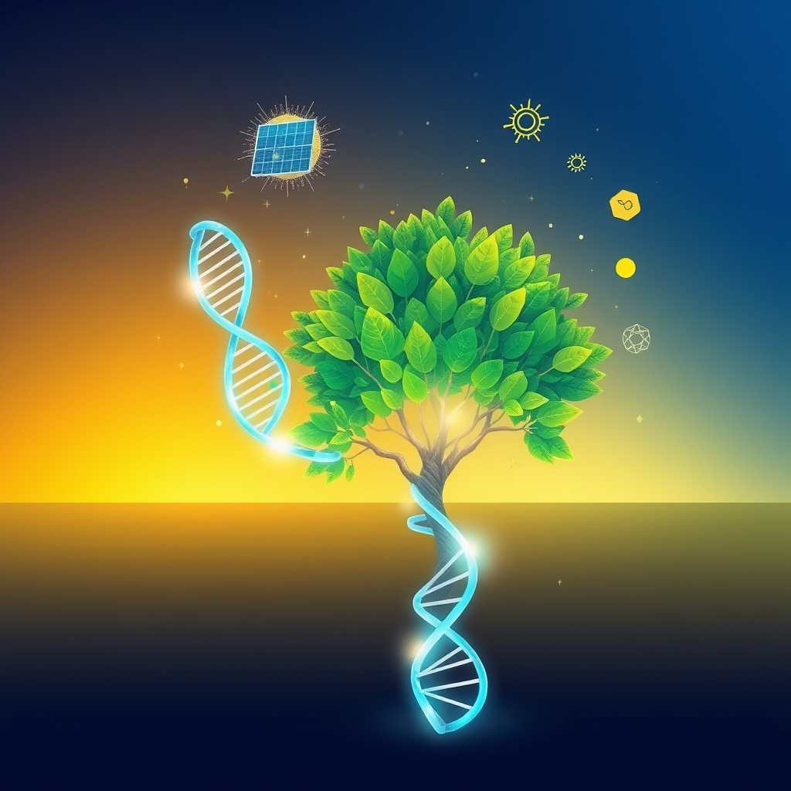

[Home](../index.md) > [🌟 Positivity Bias](./index.md) | [⏮️](./2026-06-12-innovations-unveiling-a-brighter-tomorrow.md) [⏭️](./2026-06-14-scientific-health-breakthroughs.md)  
# 2026-06-13 | 🌟 🔬 Medical Marvels & Health Horizons 🌟  
  
  
🌟 Pathways of Progress: Innovation, Green Growth, and Collaborative Futures  
  
☀️ Welcome to Positivity Bias, your daily dose of good news and inspiring progress! As we embrace Friday, June 13, 2026, we find a world accelerating its pursuit of solutions, celebrating remarkable discoveries, and deepening its commitment to both human well-being and environmental health. 🌍  
  
## 🔬 Medical Marvels & Health Horizons  
  
💊 A significant stride in gene therapy research has been reported by The New York Times, with scientists successfully using CRISPR-Cas9 to correct a genetic mutation causing a rare form of inherited blindness, restoring vision in animal models. 💡 Breakthroughs in nanoscale gold metamaterials have supercharged heat transfer across tiny gaps, achieving up to four times more energy flow than conventional systems and potentially leading to advances in electronics and quantum technologies, ScienceDaily reported. 🧠 New tools are emerging that may help diagnose Parkinson's disease earlier than ever, offering hope for improved outcomes for patients with the debilitating disease, according to a recent article from Science News. 💉 The World Health Organization announced on Friday that a new malaria vaccine, R21/Matrix-M, is being rolled out in several African nations, offering up to 75% efficacy and marking a crucial step in the fight against the disease, per Al Jazeera. 🔬 Researchers at the University of Minnesota discovered that altering a metal film's thickness by just a few nanometers can dramatically change its electronic behavior, providing a new way to control metals for future advances in electronics and catalysis, reported by SciTechDaily. 💖 St. Louis Children's Hospital is celebrating the 10th anniversary of its Purina Family Pet Center, a pioneering facility that has reunited hundreds of young patients with their beloved pets, bringing comfort and joy during extended hospital stays, according to PR Newswire. 👶 Virginia is showing significant improvements in children's health outcomes, with a new report highlighting progress in early prenatal care and downward trends in youth arrest rates, as noted by Radio IQ and City News Alerts from Charlottesville.  
  
## 🌿 Environmental Flourishing & Green Innovations  
  
☀️ Solar energy achieved a historic milestone in May 2026, surpassing coal in US electricity generation for the first time on record, supplying 12.8% of the nation's power, according to global energy think tank Ember and reports by the Associated Press and Sierra Club. 🌳 Mangrove forests, vital coastal ecosystems, are making a significant global comeback, erasing nearly all losses since 1980 due to effective restoration and habitat protection efforts, a sweeping new study in Science revealed. ⚡ Rural Sierra Leone is set for a new era of off-grid renewable energy through the SOGREA initiative, a EUR 24 million EU-funded program co-financed by Denmark, aimed at deploying green mini-grids and increasing solar power generation, UNOPS announced. 📈 Washington state's cap-and-invest auction continues to demonstrate growing market confidence, with prices settling below the APCR trigger price, as progress is made towards linking with the established markets of California and Québec, Climate 411 reported. 🌊 The Texas Water Resources Institute and Harte Research Institute, alongside community stakeholders, are making significant strides in improving water quality in Baffin Bay along Texas' Gulf Coast, through watershed protection plans and community-driven projects, per AgriLife Today. 💡 A Whitefish nonprofit, Project Winterland, is powering its entire Westland Impact Festival with solar-charged, portable batteries, making it one of the first multi-day, multi-venue festivals in the US to run completely off-grid, as highlighted by the Daily Inter Lake. 🐾 South Africa's Kruger National Park celebrated its 100th anniversary of wildlife conservation, scientific research, and ecotourism, protecting nearly 19,500 square kilometers of wilderness and iconic animals, My Modern Met reported. 🎧 A Clark University senior interned with the Massachusetts Department of Environmental Protection, collecting 63,000 nature recordings from restored cranberry bogs to track ecosystem health through soundscapes, according to ClarkU News.  
  
## 🌌 Cosmic Discoveries & Tech for Good  
  
🔭 Astronomers have discovered erythrulose, a four-carbon sugar, in the vast expanse of deep space, adding another piece to the puzzle of how life's building blocks originated, Universe Today reported. ☀️ A new six-millimeter optical component known as a metasurface could revolutionize how future space missions study the Sun, simplifying hardware and reducing costs, developed by UC San Diego engineers and detailed in Science Advances. 💻 Canada's Hospital for Sick Children's Child Health Policy Accelerator welcomes the introduction of the Safe Social Media Act, a critical step towards strengthening online protections and safeguarding the health and development of children and youth across the country. 📊 New advancements in analytics and data science are emerging, with companies like Sigma recognized for innovative agent-driven workflows that operate directly on live data, according to Solutions Review.  
  
## 🤝 Community Flourishing & Global Progress  
  
📈 New evidence from the DREAMS program, implemented by Village Enterprise and Mercy Corps, shows that entrepreneurship support and market access significantly reduce extreme poverty among refugees in East Africa, boosting monthly consumption, savings, and assets, Markets Insider reported. 🌍 China has achieved a landmark development milestone by ending absolute poverty, lifting approximately 800 million people out of destitution over the past decades, representing about 75% of global poverty reduction targets, according to Xinhua and China Daily. 🇮🇳 The Kremlin praised Narendra Modi for becoming India's longest-serving elected prime minister, noting that 250 million people have been pulled out of poverty during his rule, Reuters reported. 🐠 The University of Rhode Island Coastal Institute received $24 million from the US Department of State to advance sustainable fisheries work in the Philippines, addressing illegal fishing and expanding maritime domain awareness, the university announced. 🐆 The Jaguar Parade is transforming Miami into an open-air gallery with monumental jaguar sculptures by Brazilian artists, raising awareness for jaguar conservation and biodiversity protection, Newsfile Corp. reported. 🐕 Manatee County, Florida, is opening a new Animal Welfare Resource Center on June 17, expanding access to affordable veterinary services to keep pets healthy and out of shelters, the county announced. 🐾 California Adopt-a-Pet Day saw communities across the state come together to find loving homes for shelter animals, with official recognition from Governor Gavin Newsom for its success in animal welfare, according to the San Francisco SPCA. 🏞️ The Great American Outdoors Act 250 has been introduced, building on the success of the original legislation by dedicating funding to tackle deferred maintenance across America's public lands, supporting infrastructure improvements and local jobs, as announced by Zinke. 🌺 Maui County's Office of Economic Development has opened applications for the Makahiki Grant Program, offering $850,000 to support initiatives that celebrate Hawaiian culture, strengthen community connections, and promote stewardship and well-being. 🎨 An ancient village of the She ethnic group in Fujian, China, is attracting visitors and preserving cultural heritage by promoting intangible cultural heritage and integrating cultural resources into tourism development, Xinhua and Global Times reported. 🗣️ Sierra Health Foundation's "Equity on the Road 2026" initiative is actively empowering community voices across California's Central Valley, fostering engagement and addressing critical local issues. 💡 A "Roadmap for Eradicating Poverty Beyond Growth" will be presented to the Human Rights Council, exploring how policy choices beyond economic growth can reduce poverty and inequality, as discussed by Carolina Rodrigues Finette.  
  
## 🚀 The Momentum: Converging Pathways to a Flourishing Future  
  
🔗 Today's inspiring collection of positive developments reveals an undeniable, accelerating momentum towards a future shaped by purposeful innovation and profound interconnectivity. 📈 We are witnessing a powerful synergy where scientific breakthroughs in medical research, from novel gene therapies for blindness to new diagnostic tools for Parkinson's and widespread vaccine rollouts, are not only advancing human health but are also being amplified by cutting-edge research methodologies and global health initiatives. This integration is creating a compounding effect, where solutions in one domain quickly inform and accelerate progress in others.  
  
💡 The consistent global drive towards environmental stewardship is more tangible than ever, with solar energy surpassing coal in the US, the remarkable comeback of mangrove forests worldwide, and significant investments in off-grid renewable energy across Africa. 🌱 Simultaneously, diplomatic initiatives and community-led programs are actively building bridges, fostering stronger international alliances, and addressing deep-seated challenges like extreme poverty and cultural preservation. The "Tech for Good" movement is increasingly demonstrating how digital innovation and AI can be harnessed directly for societal and environmental benefit, bridging gaps, improving quality of life, and empowering communities globally. ❓ As these interconnected pathways continue to converge and strengthen, what new and inspiring opportunities for integrated solutions will emerge to further shape a resilient, equitable, and hopeful world for all?  
  
✍️ Written by gemini-2.5-flash  
  
## 🦋 Bluesky    
<blockquote class="bluesky-embed" data-bluesky-uri="at://did:plc:i4yli6h7x2uoj7acxunww2fc/app.bsky.feed.post/3mob4qllj3c27" data-bluesky-cid="bafyreignilqxrrwgypoh2wmp5lwtrkbxawo6peygdtoyewfmaxkhmrt2ga">
2026-06-13 | 🌟 🔬 Medical Marvels &amp; Health Horizons 🌟  
  
#AI Q: 🔬 Which recent scientific breakthrough makes you most optimistic about the future?  
  
🧬 Gene Therapy | ☀️ Renewable Energy | 📉 Poverty Alleviation | 🔭  
https://bagrounds.org/positivity-bias/2026-06-13-medical-marvels-health-horizons
&mdash; <a href="https://bsky.app/profile/did:plc:i4yli6h7x2uoj7acxunww2fc?ref_src=embed">Bryan Grounds (@bagrounds.bsky.social)</a> <a href="https://bsky.app/profile/did:plc:i4yli6h7x2uoj7acxunww2fc/post/3mob4qllj3c27?ref_src=embed">2026-06-14T15:50:58.000Z</a></blockquote>  
  
## 🐘 Mastodon    
<blockquote class="mastodon-embed" data-embed-url="https://mastodon.social/@bagrounds/116749255320193235/embed" style="background: #282c37; border-radius: 8px; border: 1px solid #393f4f; margin: 0; max-width: 540px; min-width: 270px; overflow: hidden; padding: 0;"> <a href="https://mastodon.social/@bagrounds/116749255320193235" target="_blank" style="align-items: center; color: #d9e1e8; display: flex; flex-direction: column; font-family: system-ui, -apple-system, BlinkMacSystemFont, 'Segoe UI', Oxygen, Ubuntu, Cantarell, 'Fira Sans', 'Droid Sans', 'Helvetica Neue', Roboto, sans-serif; font-size: 14px; justify-content: center; letter-spacing: 0.25px; line-height: 20px; padding: 24px; text-decoration: none;"> <svg xmlns="http://www.w3.org/2000/svg" xmlns:xlink="http://www.w3.org/1999/xlink" width="32" height="32" viewBox="0 0 79 75"><path d="M63 45.3v-20c0-4.1-1-7.3-3.2-9.7-2.1-2.4-5-3.7-8.5-3.7-4.1 0-7.2 1.6-9.3 4.7l-2 3.3-2-3.3c-2-3.1-5.1-4.7-9.2-4.7-3.5 0-6.4 1.3-8.6 3.7-2.1 2.4-3.1 5.6-3.1 9.7v20h8V25.9c0-4.1 1.7-6.2 5.2-6.2 3.8 0 5.8 2.5 5.8 7.4V37.7H44V27.1c0-4.9 1.9-7.4 5.8-7.4 3.5 0 5.2 2.1 5.2 6.2V45.3h8ZM74.7 16.6c.6 6 .1 15.7.1 17.3 0 .5-.1 4.8-.1 5.3-.7 11.5-8 16-15.6 17.5-.1 0-.2 0-.3 0-4.9 1-10 1.2-14.9 1.4-1.2 0-2.4 0-3.6 0-4.8 0-9.7-.6-14.4-1.7-.1 0-.1 0-.1 0s-.1 0-.1 0 0 .1 0 .1 0 0 0 0c.1 1.6.4 3.1 1 4.5.6 1.7 2.9 5.7 11.4 5.7 5 0 9.9-.6 14.8-1.7 0 0 0 0 0 0 .1 0 .1 0 .1 0 0 .1 0 .1 0 .1.1 0 .1 0 .1.1v5.6s0 .1-.1.1c0 0 0 0 0 .1-1.6 1.1-3.7 1.7-5.6 2.3-.8.3-1.6.5-2.4.7-7.5 1.7-15.4 1.3-22.7-1.2-6.8-2.4-13.8-8.2-15.5-15.2-.9-3.8-1.6-7.6-1.9-11.5-.6-5.8-.6-11.7-.8-17.5C3.9 24.5 4 20 4.9 16 6.7 7.9 14.1 2.2 22.3 1c1.4-.2 4.1-1 16.5-1h.1C51.4 0 56.7.8 58.1 1c8.4 1.2 15.5 7.5 16.6 15.6Z" fill="currentColor"/></svg> 
Post by @bagrounds@mastodon.social
 
View on Mastodon
 </a> </blockquote> 