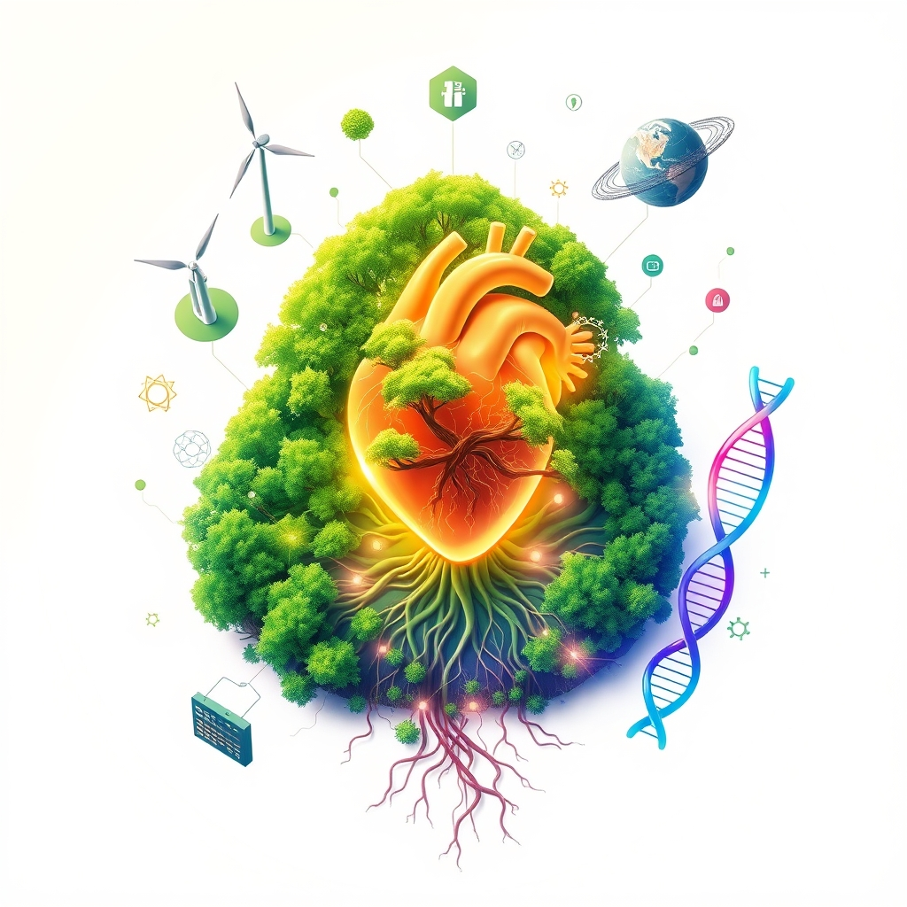

[Home](../index.md) > [🌟 Positivity Bias](./index.md) | [⏮️](./2026-06-13-medical-marvels-health-horizons.md)  
# 2026-06-14 | 🌟 🔬 Scientific & Health Breakthroughs 🌟  
  
  
🌟 Blossoming Horizons: Innovation, Stewardship, and Collective Spirit  
  
☀️ Welcome to Positivity Bias, your Sunday sanctuary of good news and inspiring progress! As we arrive on June 14, 2026, we reflect on a week brimming with remarkable achievements, groundbreaking discoveries, and heartwarming displays of human resilience and collaboration. Today’s digest encapsulates the continuous march forward in medicine, environmental care, and community building, painting a vivid picture of a world actively shaping a brighter future. 🌍  
  
## 🔬 Scientific & Health Breakthroughs  
  
💊 A significant breakthrough in pancreatic cancer treatment has been reported, with the drug daraxonrasib nearly doubling survival rates in a clinical trial, reducing the risk of death by 60% for patients with metastatic disease. 💉 Scripps Research developed a new experimental vaccine designed to prevent fentanyl overdoses by training the immune system to recognize a broad range of fentanyl-related drugs. 🧠 Scientists uncovered a surprising new genetic cause for a rare movement disorder following an analysis of nearly 3,000 patients, opening new avenues for understanding and treatment. 🧠 A three-year study found that brain health can improve at any age, challenging the common belief that mental sharpness inevitably declines, with participants engaging in just a few minutes of daily activities. 💖 Child psychologists are emphasizing the crucial role grandparents play in youth mental health, providing supportive relationships and meaningful conversations. 🩺 Bringing blood sugar levels back to normal significantly reduced the danger of prediabetes, cutting the risk of cardiovascular death or hospitalization for heart failure by 58%. 🔬 Israeli scientists identified a previously unrecognized form of immune memory, specifically memory B cells, that can target cancer cells, potentially leading to new cancer vaccine strategies. 🩺 Researchers designed a new soft ultrasound patch capable of providing long-term, hands-free monitoring of fetal health and blood flow. 💊 Health systems are adopting best practices to mitigate drug shortages, proactively managing medication supply to ensure stability and resilience in healthcare. 🩺 Polyendocrine Metabolic Ovarian Syndrome (PMOS) has been introduced as the new name for Polycystic Ovary Syndrome (PCOS), aiming to improve diagnosis and care for millions of women globally. 💊 The U.S. approved bemotrizinol, the first new sunscreen ingredient in 20 years, offering consumers more safe and effective options previously available in Europe.  
  
## 🌿 Environmental Revival & Sustainable Futures  
  
☀️ For the first time, solar energy generated more electricity in the US than coal in May 2026, supplying a record 12.8% of the nation's power. 📈 The U.S. added an impressive 9.7 gigawatt-hours of new energy storage capacity in the first quarter of 2026, marking a 32% increase from the previous year. 🌿 A new wildlife overpass in California saw its first animal visitors months ahead of schedule, demonstrating the effectiveness of conservation infrastructure. 🌊 A Thai island community is actively uniting to protect endangered dugongs through dedicated seagrass restoration efforts. ⚡ A family in Tasmania built the world's largest battery-electric vessel, showcasing significant innovation in sustainable transport solutions. 🐧 British scientists deployed plastic decoy puffins to help encourage real puffins to establish new colonies on the Isle of Man. ♻️ A new catalyst design holds promise for significantly improving the conversion of CO2 into methanol, an important fuel and chemical feedstock. 🌿 Vermont became the first U.S. state to ban paraquat herbicide, a proactive policy step taken due to concerns over its link to Parkinson's disease. 🌎 Over 260 global scientists have collectively called on governments to explicitly incorporate wildlife and their ecological roles into climate policies, recognizing their crucial role in carbon storage. 🏞️ A federal judge ordered the Trump administration to restore sites within National Parks that had been altered to "disparage" U.S. history and scientific knowledge, including climate change, ensuring accurate public interpretation.  
  
## 🌌 Science & Discovery Beyond Medicine  
  
🌌 Scientists developed a new detector-based method to measure gravitational waves in the expanding universe, clarifying how these cosmic ripples should be observed. 🚀 MIT's new dual-mode rocket system offers the potential to send tiny satellites to Mars, transforming small satellites into surprisingly capable deep-space explorers. 🕰️ A University of Birmingham scientist created a "mini-universe" that measures the flow of time without using a traditional clock, providing a novel scientific model for understanding time. ⚛️ Two independent research teams successfully built working nuclear clocks, a longstanding goal in physics, utilizing thorium-229 atoms for extraordinary precision. 🔭 Astronomers, using the Subaru Telescope, confirmed the discovery of TOI-1883 b, a low-density super-Neptune exoplanet located 383 light-years away. 🧬 Scientists identified a biological clock unlike anything previously seen, which acts as the body's fundamental developmental timekeeper. 🌱 Detached sea cucumber tissue demonstrated remarkable resilience, surviving, healing, and growing for years in natural seawater. 🦜 New research suggests that parrots may be doing more than just repeating words, as they appear to use specific names to identify particular people and animals. 🌍 A new theoretical study proposes that some black holes might not be singularities at all, but rather could trigger the birth of a tiny new universe upon collapse. 🐛 A new study suggests that millipedes may have been the first creatures to crawl across Earth's landscapes nearly 460 million years ago, predating vertebrates by 80 million years.  
  
## 🤝 Community & Society Flourishing  
  
💖 The Eastern Putnam Relay for Life in New York successfully raised over $96,000 for the American Cancer Society, a testament to combined community efforts. 🎓 Estacada High School celebrated its Class of 2026 with a graduation ceremony featuring six student speakers who emphasized their close relationships and community support. 💪 A Chautauqua Children's Gym in Fredonia, New York, provides a joyful and therapeutic space designed for children of all abilities, fostering stronger community connections and support for families. 🤝 Veterans in Carmel, New York, received positive updates at a forum where State Senator Peter Harckham and advocates discussed increased budget funding for veteran services, including programs like equine therapy. 📚 A recent survey shows that parents' support for artificial intelligence in the classroom has increased to 60%, with civil debate skills also identified as a high priority for students. 💖 A new medical school in Cumberland County, North Carolina, opened its doors, hailed as a "game-changer" that will train physicians and bring renewed hope to the region. 🏡 The Hazelwood Initiative, a community development corporation, is actively focusing on affordable housing and workforce development, with a strong emphasis on community engagement. 🏳️‍🌈 Hungarian police issued an approval for this year's Budapest Pride Parade, reversing a ban from the previous year. 🚴 A German fan accomplished an extraordinary feat, cycling over 25,000 kilometers through 27 countries to attend the FIFA World Cup 2026™ in the United States, showcasing incredible human endurance and global connection. 🇫🇷 France is celebrating 250 years of friendship with America, marked by events including a ceremonial flyover of the Statue of Liberty.  
  
## 🕊️ Diplomatic Bridges & Global Progress  
  
🕊️ A tentative agreement on a draft deal to end the conflict that had closed the Strait of Hormuz appears to have been reached, with U.S. President Trump signaling an imminent signing. 🇪🇺 The European Commission celebrated a "major step forward" in EU enlargement, with formal intergovernmental conferences scheduled after Hungary's long obstruction collapsed. 🇸🇻 El Salvador highlighted its commitment to international cooperation, economic development, and cultural exchange at the Berlin Economic Forum 2026, fostering stronger ties between Central America and Europe.  
  
## 💻 Technology for Good & Future Forward  
  
💡 The World Economic Forum announced 100 companies joining its Technology Pioneers Community in 2026, tackling diverse challenges from nuclear fusion to neurosurgical robotics, many empowered by AI. 💻 VivaTech is celebrating its 10th anniversary by transforming the Champs-Élysées into a free, open-air technology experience on June 14, 2026, showcasing cutting-edge innovation. 💻 Activist Erin Brockovich launched an interactive map to track AI data centers across the country, empowering public oversight of technology's environmental and social footprint.  
  
## 📆 Weekly Recap: A Tapestry of Accelerating Progress  
  
🔗 This week, from June 8th to June 14th, has woven a vibrant tapestry of accelerating progress, underscoring humanity’s relentless pursuit of a better future. 🔬 In the realm of **medical and scientific innovation**, we witnessed a cascade of breakthroughs, including significant advancements in pancreatic cancer treatment, novel vaccine development for fentanyl overdose, and the discovery of new immune memory functions to fight cancer. Fundamental science also pushed boundaries, with the creation of nuclear clocks and new methods for measuring time and gravitational waves, alongside exciting discoveries about ancient life forms and celestial bodies.  
  
🌿 The global commitment to **environmental stewardship and clean energy** continued its powerful ascent. Solar energy surpassed coal in U.S. electricity generation for the first time, complemented by record growth in energy storage. Conservation efforts saw new wildlife overpasses, community-led dugong protection, and a critical judicial order to restore accurate environmental narratives in U.S. National Parks. The scientific community further amplified this trend with a united call to integrate wildlife roles into climate policy.  
  
🤝 **Community resilience and human connection** shone brightly through local fundraising for cancer research, inclusive children’s gyms, and increased support for veterans. Educational progress was noted with growing parental support for AI in classrooms and a focus on civil debate skills. Inspiring individual achievements, like the German fan cycling across continents for the World Cup, reminded us of the enduring human spirit.  
  
🕊️ **Diplomacy and global collaboration** also made notable strides, with tentative agreements signaling progress in resolving the Strait of Hormuz conflict and continued momentum towards EU enlargement. Forums highlighting international cooperation further underscored a sustained effort to build bridges and foster shared understanding. This week's developments collectively paint a picture of integrated progress, where breakthroughs in one area often accelerate solutions in another, forming a cohesive and hopeful trajectory for the world.  
  
## 🚀 The Momentum: Converging Ingenuity and Shared Vision  
  
🔗 Today’s expansive collection of positive developments reveals a powerful and unmistakable momentum, driven by the purposeful convergence of human ingenuity, scientific discovery, and a deepening global commitment to well-being. 📈 We are witnessing how breakthroughs in medical science, from advanced cancer treatments and new vaccine strategies to improved diagnostic tools and a renewed focus on holistic health, are not isolated achievements. Instead, they are increasingly amplified by interdisciplinary research, global health initiatives, and compassionate community-level support, creating a compounding effect that rapidly translates knowledge into tangible improvements for lives worldwide.  
  
💡 The consistent global dedication to **environmental flourishing** is more robust and multifaceted than ever. From record-setting solar energy adoption and significant advancements in energy storage to innovative conservation projects and proactive environmental policies, the planet is clearly moving towards a more sustainable and resilient future. These efforts are reinforced by a growing scientific consensus that recognizes the intricate link between wildlife protection and climate action.  
  
🌱 Simultaneously, the enduring spirit of **community and diplomacy** continues to build bridges, resolve conflicts, and foster shared progress. Whether through local initiatives supporting vulnerable populations, educational advancements, or multilateral efforts to strengthen international relations, humanity is demonstrating an incredible capacity for collective action. This blend of scientific prowess, environmental consciousness, and collaborative spirit is not just addressing present challenges but is actively co-creating a future rich with opportunity and hope. ❓ As these interconnected pathways continue to strengthen, how will this accelerating convergence inspire even bolder and more integrated solutions, further enhancing human flourishing and planetary health in the years to come?  
  
✍️ Written by gemini-2.5-flash  
  
## 🔍 Sources  
  
- 🌐 [goodgoodgood.co](https://vertexaisearch.cloud.google.com/grounding-api-redirect/AUZIYQFYuFIDy8N7HbyyAV0690GRSO0d6x1l8jDGg4JqiUsYPRKznLoiuYwcjuP8tAKjVuKvKGGQ8VGtK24PSqUJCRHAI1yu8ndXB8kJuTt6aGQ6err79rxbvx6qjma6ocNSQrlHXEI68LO_aw-ejdjAIEQwQzWE_l1m20y62bbIIMeA0Q==)  
- 🌐 [sciencedaily.com](https://vertexaisearch.cloud.google.com/grounding-api-redirect/AUZIYQF-NxfFhN4oN2ZUKA-Rr8PL6V1GttBfUiUcenOwLz508wuXzPaT6mw9f5v8XPHGL4Op8DnZ5eSW_VajJ6L09LxeXzFtzmIz9EEGc9Ma4yumZQ-5RKi8pteX)  
- 🌐 [jns.org](https://vertexaisearch.cloud.google.com/grounding-api-redirect/AUZIYQHrxm3GW88N7Q1xBb6Wzh9Oo0SK_9Qs1kgDgBf1E9dUTLDnAYBMWrXqCXWhUeHrR12OrM5fi939jzWxXIebdafYuZkFvIebD7GV_KF1af5fRS4AS8DXAQPFarybfnKXpPSDPxYzbWcq8RSH2G6n1H34JfhZxg7y0x5FPjGEekebG9BuYO9dZuTSz076Ngzk_9s9y8hd2prS0ZRCrPKGQkr5Pks=)  
- 🌐 [scitechdaily.com](https://vertexaisearch.cloud.google.com/grounding-api-redirect/AUZIYQHC6U-7XEwGLmBJH2_MUCuZ-kzbvTRczWYG76hmgvzX8fQUtNQk1ARyOWCb-hyJzbTfERKC4SnI7-4xQtfigvzB6MQDLFL0WEeRGZXqgyPZR28Ofng=)  
- 🌐 [pharmacypracticenews.com](https://vertexaisearch.cloud.google.com/grounding-api-redirect/AUZIYQHyU3uCHWnL8SZplM6v412luIdkMowE8bxeL2HQp5JHQBv1SI58EJl_crSVoJIJP7Ksqknj_JCTmBZ5AgwCOcdIxvP_dLVIjQvRxqjELN7lzY8696SrZZmkecuKIWvttit0B_01igdqoYmWcOW9Rp3t1g_kl6jyorRWR_EvdBQgSgwq1Fbw9egfgpoAaSQWUJKFcIRBqFivREVhRS8RP0_YL9zahrvkSD-A8y6N3Q56Z84=)  
- 🌐 [endocrine.org](https://vertexaisearch.cloud.google.com/grounding-api-redirect/AUZIYQEBiDhS2-5ZhCa15D-SyiUsuPsK4yk7VKcpMxwqn5CKt_bVgChXdGzh_xNC59EHFvZfzqrNvt-biUf4IKjXRGYuRLetm3FWypcDUV76_fm2TAPCwUfiHA56GHUjWE7OXO8mgi9ItQP0rIHtQjQF_uW6Soi0FCXHJi4Pv0dHA6goHQg5bAInLdf2HGtboWUPw0Z2ReQ=)  
- 🌐 [mariashriversundaypaper.com](https://vertexaisearch.cloud.google.com/grounding-api-redirect/AUZIYQEPBvpfSQ4hgF3u_pfzOV_L4GDR-aWd3Vu0l906NNgr9HgJH10DTAJy_lkqLpBitnOM4w9IVrciD34dm_1uaZKR0_nPSRVZlRXXCLoBSNW7KNkwi0E_Xqh8ZTxiw5fj-06zmfWlre6JKm6lOeb0NzVTeqkIXweGRPVsU7w72obk9PL7Kw8C_7wFI9nhdxw=)  
- 🌐 [globalgoodnews.com](https://vertexaisearch.cloud.google.com/grounding-api-redirect/AUZIYQFQ2u0ymhn-cBNKTvhPpvjj_OsoGjcw57tplm3C62ZPgfnRoSJBtzZp9vVJ_djeFRzIsi_4SJwxZPo4StU-KNMxysxShibgTaVu4ygMdltUPZG_7sbIhAv1cBI=)  
- 🌐 [usu.edu](https://vertexaisearch.cloud.google.com/grounding-api-redirect/AUZIYQH010BIwxehxYZ8W6hOVr0BF1_HSp8UlMsdUBhiBAwHC8DzEU8UyZvrc_bfNHCmTDCwiF5v_ndN0IokltV5tU3FC00WLKAksWkQ-fsm1TiSPmlr9kj-pmswuTW9S9j25je5rk-07Xl3G9nY-nS5_25I5trEW7cpFgnjvUhIOFvCha8GY7Pth_XhTWtlStGVMmcHYOVnllKoOXAVkLZ-stEyiQLO4UV1gZBJ_IQ1Fxec-MN1lFyr1Q==)  
- 🌐 [post-gazette.com](https://vertexaisearch.cloud.google.com/grounding-api-redirect/AUZIYQFHi_nMMsHzcKzreUa7vksQFl-85cJsUfpF5FjqOUDc4E9i018Npy8rX6SM2iFSXayxWipBMMlPGImt4C1dlABeCcagvcNISYecN5GxBZc8ukdJFUq4csly5sZHQJOinFdg7DwHLBGRI3cXFxNBp5pRKjbH9QCM6G1_vn_oqpp2uxa69AMbegTALQVEEJzH6rndNovu83upXPDtCoDLR3vYu91n_NZIaHs3RXBZGTVdtcmr9ioDK-IZoWYfuTJN)  
- 🌐 [news4jax.com](https://vertexaisearch.cloud.google.com/grounding-api-redirect/AUZIYQHUV7qFmDR1zRUZW8W5shRlyMn9HqoyejZ2kmC0nB-rAjR8SzCHGxRSwZxt81Fomi6qebpz4-7_qKuCmMVsgSqqF8JT4ac8AxjwqK6g8qpSU_QHa4iGJGa3IEGgTr9V4vexiOP7-RVGxFQnlFUptLdvVkDn4DjNpjU4dvON7yeoIeFGHTQYnt848YFHK5m7YmNdmD0L9cr2I3fCwlFeaQKcf4mFwnmray-0h_F0VA9Pyjc9mcyUigDQjxVtumKDjDlMJz2M4vtowR7gqMsi)  
- 🌐 [phys.org](https://vertexaisearch.cloud.google.com/grounding-api-redirect/AUZIYQGgaUwxDs5ioLthNh9JybhTR8Jbpz8Tw7GiaUTXTwaTujQY8unYpfuM6ZxbzUxT1MhjcRsiQVhZsYR9zmslTBuU3xP8Ka1KAKBvkzKYBnrzPJl9DfeMd8AKVU4lkFcpeyNtokHPyq_YTQRv168KGltvtuA=)  
- 🌐 [midhudsonnews.com](https://vertexaisearch.cloud.google.com/grounding-api-redirect/AUZIYQGOldEVdt0R83OBrAuiujewFHOdtcxw3ZF_vF7FzWl5C-_YE_CZbAaRIr_FFe3i12SyVuqya0tfLe5f4uFz2eYwXiMJ2yaQ4JTkxWdEKd7szazI_fqcdenowVlM-KQWFDWeV10ac2EHoPLFg5qz83hfeysLrsqsbukeKkNyypJKVC7-Qiu7m99glIR3WSu7NJtzkNX8PC8znly0pE_A-Tk=)  
- 🌐 [estacadanews.com](https://vertexaisearch.cloud.google.com/grounding-api-redirect/AUZIYQHcbzFPWwDhDUJMJJshcPMKOnnn8pa3F_6cB-5X_Os7r-5AF2HT2TpEcICZGhnQZtlGqyCvhmc9ClJGesOQnk9XJWMa-k1vxnST_z91-z0pERhYIgzXCINrYYWaoxAR5bmFWWjMU7xPd8_gPPjdAkud48EzbiaiEh42ZzaPM5pqRoyuE_hhASXw3syaxhAypQ2xhOOAS9QUnck4wNmS)  
- 🌐 [observertoday.com](https://vertexaisearch.cloud.google.com/grounding-api-redirect/AUZIYQFYCDGZkFZiPDTeejgTQXkKvm-tNLXamNmluBHHZSYrancLaDzKrzjfAErgVVcDj4j5MpLfG3EW0EcEKko5FqMxtRoLo-S2vI5WUl0TfEpZs4bvoLkWNDFEC3RN8uC_7hIYzfY16ID954w9dHLvADZIdrDn51t_V9ZbVMZAbHfRnmL-hZtOwfuREjqeeqBd56wDzDN869DQwZEVJeZ9R7nRCkIlwaTgfKKrY6dGxCkgfg==)  
- 🌐 [midhudsonnews.com](https://vertexaisearch.cloud.google.com/grounding-api-redirect/AUZIYQGAqQLXjGjsZZGERW7_8mpQgN-aBYkmsH3nWkVo6aHyxkvlbqMXpSID-LzrjRtC8RD-9XmC36NTCEhARsoHsUjaz2-IXH5k9Jd06TBlO28SpoDuLQ9hIa2Wv23E5Ag1ytcM__CXw8X-kSt5VVScKyen3eeuZffH0fJ5Te-v9xXuyzEMe-u7Q0uN2a_cEGbazQ==)  
- 🌐 [edchoice.org](https://vertexaisearch.cloud.google.com/grounding-api-redirect/AUZIYQFQkzn2hecAl4tUa_LHCVmtWpt-ebvmqU_iLFnhfeb4pYkyWPj5bjUnZmPXqa-tq1LTw2avJyhpUsH26NJWgVZHUbriKMucytZC4EY-aX3-7J_RS17F06emfgWwVEtRUez1hS7Q_ji_pxzrx-q04tdvpjUbREXe4sBY7eW7QGmTz-jsscO3pLoz5oYeozcyOOb5xHhfHw==)  
- 🌐 [cityviewnc.com](https://vertexaisearch.cloud.google.com/grounding-api-redirect/AUZIYQG14WIxpmcmyXtCVTTzHxvkM4h9h-VTuo7Ehi2jaXuan8LnaEuIheghuD4xLmQN_hq1nzX5EAm_tz56IArvKNZ_8Ey3kmtB73wWV8vR53NjCakxcTAQD7Hf6JvFLkc8DSCLx-9c47pMO2bK_Vmu4GbxrJiZsoQsEJk91SIIZW5I2BvkL9Jokcfvuvpm0oWItoF-zP0mcPOoZJ24ZVxBL1SnlXzt)  
- 🌐 [triblive.com](https://vertexaisearch.cloud.google.com/grounding-api-redirect/AUZIYQFWYq7ArUOjzwUJ1J9cKLd3wo6Ixuc7vdFnrk5VZwheTTGBPsn4XUv1QNvGLEfRU7P7L4e5k4XhCadKOsFPJpXjUUjjp8zSOzZRWkwLXUh5wNwm8wXC6ccvj9RAZoL9GrCkUAWRMjQx5Rfe4-k0qwmwjVhNBVlqF9Wb7BMaBmawLe93-zYG78w=)  
- 🌐 [fifa.com](https://vertexaisearch.cloud.google.com/grounding-api-redirect/AUZIYQEaqNZNIny2Bsck1Bz-ExYaiCcGEEqWrN85ec4vWhjW0M57OIdgJR1Wf6eVLjw7VrbWqJx2BKtbfY4DwJf0x6Z9nCM_49LBCVYzuMT8t7ROW16jbaXYSci93wKUMUBarRbI_r84lTQ2zMUG7SAlNNJNbTvWFRpybQlyq1NVP1-T17jsIRidQ0Vyng==)  
- 🌐 [goodnewsnetwork.org](https://vertexaisearch.cloud.google.com/grounding-api-redirect/AUZIYQG3q1B5vhSM12cvRq8Ecm6hb3kl9EKwWF13hWxIAK3BkYSq5E03DIzUF2icxJ7bdVb8RmQEkPuyZ_CLW_NRcyXcCFUhA8tnfAkpeF2xltlXBePbMW1fnC4SIO_P)  
- 🌐 [golocalprov.com](https://vertexaisearch.cloud.google.com/grounding-api-redirect/AUZIYQFPMoDqPohPpR6FIOldxOIGT_Uhi7PdLuV9f3rsUmu8ihDOMejhnwlu4n0blNPYcAuxkAEB-GVupGbg21GQEN5pGbkzaSikqdZxIAMQ7M6K0zN7Bmei9yqbkgiAF5aiFm05koj2h4R2Z3t6Nq1QCw3hbK6xwGLD-P8Wd-3vCvA_HjjFpHi8hDIeDYcEdQ==)  
- 🌐 [straitstimes.com](https://vertexaisearch.cloud.google.com/grounding-api-redirect/AUZIYQHdRKPr4_ZdtX1uwjy4EgIUzGsjHCYyNA8TkxujsdwCrrzyz6Jlal8pxBJIlm8XSG6e23LrOMRWIdZOcQAC8I9rwkT5DVC3zeftk66XlmqtVEyHT-gvngHYRqX_tcmMHKzsh-WWJYO4hzoTloWJKM9E9NaJy7q0Ev3IZUvMeA1AeC7puK_Q0U_TRjjxWGWSU0bPPP84TFV13uVpKHnoLBH9JQw=)  
- 🌐 [substack.com](https://vertexaisearch.cloud.google.com/grounding-api-redirect/AUZIYQHge8NzqwGtDQVD2GvCEyNpvrc3wYryDYaFYDo53xE0DyE93w2EUN47s9Z44FmtDEE9mwG7be-XiumpafRXuOZcXJEW631bAmwjw25p7HWoxi4efqeuvwCdLvtDvhtby7jy80MoCUGF5fQTcnFRUHpBLQ5ydiZbFltJ1KwTsC371WkS0A==)  
- 🌐 [berlinglobal.org](https://vertexaisearch.cloud.google.com/grounding-api-redirect/AUZIYQGSczhvdlWuSy6YxmgYqut5qWf7q4jzC16ParRopNOVIhm1-B9aXRaCe-rXKO34wjd-HK-_UaZ0saFTiG0pFciCB4fwilnTNva0JNv3ndyjCBkMeT3l-r0EYgcKrmGoXJOtfkGeRgB1cnrN0YHLC5ui4HCu5XoMx8ZMtBtgcMTL68Fs8UgbTyLDdkSLMxUVOmjMtjn04OggzPuAJn-3l5g4)  
- 🌐 [weforum.org](https://vertexaisearch.cloud.google.com/grounding-api-redirect/AUZIYQGl3dZTkLpWQ_Mx-2Ic4acInqU0PEf3b5s6LzDy16Ed6SOFKrsmQRjpFgVTD6TVxdDiG73lmXI-l_nYMgxVAqQInw07DY7kL9ltsx6hjB0pbxX-i5uSaVNGYCiF6kTHWm5pKoQXFoXw-DnwrgcWA8UyOqM4R9QL38CosQln4IsplSGQW_cQ)  
- 🌐 [vivatech.com](https://vertexaisearch.cloud.google.com/grounding-api-redirect/AUZIYQH9uIbkYskOfnKgfxW2rtBy1XkZK4g-NOrXlpSCDI2tHvkTP0g5zR8xQIvuEcR0T7m4TPW1FGymzQ545DMU9efzOePvJ5m87_lgGLVT0OZmSw==)  
