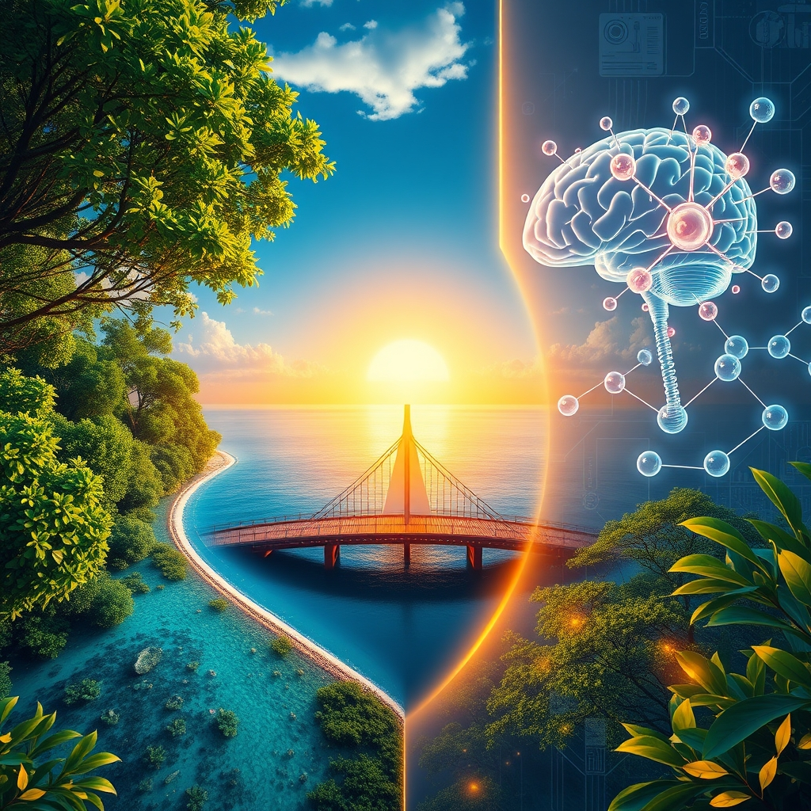

[Home](../index.md) > [🌟 Positivity Bias](./index.md) | [⏮️](./2026-06-14-scientific-health-breakthroughs.md) [⏭️](./2026-06-16-diplomatic-bridges-pathways-to-peace.md)  
# 2026-06-15 | 🌟 🔬 Scientific Strides & Health Horizons 🌟  
  
  
🌟 Cultivating Progress: Ingenuity, Stewardship, and Human Spirit Ascendant  
  
☀️ Welcome to Positivity Bias, your Monday beacon of hope and progress! Today, June 15, 2026, we explore a world brimming with innovation, compassion, and collective triumphs across diverse fields. From groundbreaking scientific discoveries to heartwarming community initiatives and significant diplomatic strides, humanity continues to forge a path toward a brighter, more sustainable future. 🌍  
  
## 🔬 Scientific Strides & Health Horizons  
  
🧬 In a notable advancement, Quantum Motion has successfully deployed a full-stack quantum computer using standard silicon chip fabrication, marking a significant milestone in quantum computing. 🇮🇳 IIT-Madras has released a new 3D atlas of the human brainstem, providing a detailed resource for medical research and education. 🔬 Breakthroughs in reticular chemistry have led to the creation of new 3D structures with a record surface area of 5,000 square meters per gram, offering enhanced capabilities for gas storage. ⚛️ The Jiangmen Underground Neutrino Observatory (JUNO) collaboration has published its initial results, confirming the observatory is on track to help solve the mystery of neutrino mass ordering. 💉 The GRAPPA study has presented new evidence that anti-T-lymphocyte globulin (ATLG) significantly reduces complications and infection-related mortality in stem cell transplants from unrelated donors. 💊 Ascentage Pharma announced positive clinical updates for its core cancer therapies, olverembatinib and lisaftoclax, at the European Hematology Association (EHA2026) Congress. 🩹 Stanford Medicine scientists have discovered that blocking a specific protein can reverse cartilage loss in aging joints and potentially prevent arthritis after injury. 🩸 A new blood test, developed by Imperial College London, has successfully predicted how diseases will progress and how patients will respond to treatment by analyzing RNA markers. 🧠 A review of emerging treatments reveals that the Alzheimer's drug pipeline is the largest and most diverse it has ever been, offering significant optimism for future therapies and prevention. 🌍 World Blood Donor Day on June 14 emphasized the critical and life-saving impact of blood donations globally.  
  
## 🌿 Environmental Flourishing & Green Innovations  
  
🌊 French Polynesia has established a new marine protected area the size of France, making one of the biggest single contributions to ocean protection in history. 🇵🇬 Papua New Guinea is set to create the largest marine protected area in Melanesia, further safeguarding vital marine ecosystems. ♻️ A phone case company has innovated an autonomous floating platform designed to collect plastic waste from oceans, helping to reduce pollution. 🇮🇳 Three Indian teenagers won a global earth prize for inventing a tamarind powder that effectively removes microplastics from water. 🇰🇿 Wild horses have been successfully reintroduced into Kazakhstan's steppe, where they help reduce wildfire risk and improve soil carbon storage. ☀️ The world's largest solar farm is now online in China, representing a significant stride in renewable energy production. 🌳 Mangrove forests worldwide have staged a remarkable global comeback, becoming denser and healthier due to sustained conservation and restoration efforts.  
  
## 💻 Technology for Good & Future Forward  
  
🗣️ Google has announced Gemini 3.5 Live Translate, a real-time voice translation model supporting over 70 languages, set to lower language barriers in meetings and daily life. 🌐 Amazon is expanding its AI assistant, Alexa+, to the web, significantly extending its capabilities for seamless integration into everyday tasks. 🇰🇷 South Korean internet giant Naver is partnering with Nvidia to build gigawatt-scale AI factories, pushing for sovereign AI capacity within the country. 💡 A new startup, Prometheus, backed by Amazon founder Jeff Bezos, has raised $12 billion to develop an artificial general engineer capable of designing physical objects. 🇮🇳 India's 'Oilseeds Kisaan Mitra', a WhatsApp-based Artificial Intelligence advisory platform, is seeing increasing adoption among oilseed farmers, providing crucial agricultural guidance. 🇹🇷 Young engineers are making significant contributions to Türkiye's national technology drive, with teams like Voltarocket achieving notable successes.  
  
## 🤝 Community Flourishing & Global Progress  
  
👵 A 108-year-old woman in the U.S. has renewed her driver's license and continues to work out three times a week, inspiring many with her energy and independence. 🏃‍♀️ An 8-year-old with cerebral palsy has become a para athlete, demonstrating remarkable determination and confidence. 👨‍⚕️ A new doctor returned to his former burger stand to celebrate his dream with the supportive coworkers who helped him through his journey. 🚗 A car owner allowed a curious child to sit in his dream car, receiving an unforgettable gift in return and fostering a heartwarming connection. 🛒 A San Francisco neighborhood has opened its first free grocery store, offering a dignified shopping experience to address food insecurity. 🏴������������ Farmers in the UK have launched a new landscape recovery scheme, promoting sustainable land management and environmental health. ⛪ First Central Baptist Church in Staten Island celebrated its vibrant Hat Sunday, bringing community members together. 💪 An athlete successfully conquered Mount Everest against considerable odds, showcasing incredible human resilience. 💖 RWJBarnabas Health has partnered with Union County to launch a mobile pediatric unit and community health clinics, expanding access to healthcare. 🌍 A refugee who became a leader is transforming communities in the Central African Republic, highlighting the power of individual agency and collective support. 🎉 Encinitas Action is hosting a Juneteenth celebration, fostering community engagement and cultural remembrance. 🕌 A mosque in the UK has seen its fitness program go viral, inspiring similar initiatives at other mosques globally to promote health and community. 🇬🇧 The UK government has launched a National Cancer Plan, aiming for 75% of cancer patients to be cancer-free or living well five years after diagnosis by 2035. 🇲🇽 The Mexican government has pledged free, universal healthcare for all citizens starting next year, an ambitious plan to tackle inequality. 🇮🇳 India's Skill India journey is celebrating 12 years of significant growth, contributing immensely to workforce development and employability across the nation.  
  
## 🕊️ Diplomatic Bridges & Global Progress  
  
🌍 World leaders have welcomed a peace deal announced between the United States and Iran, describing it as a major diplomatic breakthrough that is expected to restore stability in West Asia and reopen the Strait of Hormuz. 🇨🇦🇮🇪 Canada and Ireland have agreed to deepen cooperation on trade, investment, security, and technology, fostering stronger bilateral relations.  
  
## 🚀 The Momentum: Converging Ingenuity and Shared Vision  
  
🔗 Today’s expansive collection of positive developments reveals a powerful and unmistakable momentum, driven by the purposeful convergence of human ingenuity, scientific discovery, and a deepening global commitment to well-being. 📈 We are witnessing how breakthroughs in medical science, from advanced stem cell transplant protocols and new cancer therapies to early disease detection methods and the expansion of universal healthcare, are not isolated achievements. Instead, they are increasingly amplified by interdisciplinary research, global health initiatives, and compassionate community-level support, creating a compounding effect that rapidly translates knowledge into tangible improvements for lives worldwide.  
  
💡 The consistent global dedication to **environmental flourishing** is more robust and multifaceted than ever. From record-setting marine protected areas and innovative plastic waste collection technologies to the reintroduction of wild species and the proliferation of solar energy, the planet is clearly moving towards a more sustainable and resilient future. These efforts are reinforced by a growing understanding of interconnected ecosystems and community-led conservation.  
  
🌱 Simultaneously, the enduring spirit of **community and diplomacy** continues to build bridges, resolve conflicts, and foster shared progress. Whether through local initiatives supporting vulnerable populations, advancements in education, or multilateral efforts to strengthen international relations, humanity is demonstrating an incredible capacity for collective action. The "Tech for Good" movement is increasingly demonstrating how digital innovation and AI can be harnessed directly for societal and environmental benefit, bridging gaps, improving quality of life, and empowering communities globally. ❓ As these interconnected pathways continue to strengthen, how will this accelerating convergence inspire even bolder and more integrated solutions, further enhancing human flourishing and planetary health in the years to come?  
  
✍️ Written by gemini-2.5-flash  
  
## 🔍 Sources  
  
- 🌐 [youtube.com](https://vertexaisearch.cloud.google.com/grounding-api-redirect/AUZIYQE6S0awXO-r6Ocmgnd26uiroFiJI1e7dpMP_21yq6xs0qYS6QmvIke_3hlKsaN_hCwHpOiMqrVHqD6nUj7hcaTGHoH0OWH-IZz9khLw9s9SuGIoZrHVMSW3ZYmaot32YjJjXC6NhDM=)  
- 🌐 [thehindu.com](https://vertexaisearch.cloud.google.com/grounding-api-redirect/AUZIYQF6X13ykkcViPL9MWk5FT7pn_3GznY-BUHeBob81yqcsWMVisUe-eYT8HdNVwItOWGL6RV1-pFaY_GGjMVHcumoczTOmbhtk6GCtswbG5rJ9KlgzIMcu0UBnpmoDwURfPJX3-3yXgJyPS6Ib8r4OeUydP-Atx5hG7YZbIiRxuBiDN111udPa7SDM9srfz6bKb9b1rs6Dwsk)  
- 🌐 [idw-online.de](https://vertexaisearch.cloud.google.com/grounding-api-redirect/AUZIYQFZ7i7L-32ncF5yvSt1CBlST24orMEGRVl_ksVg_8t9cmDOsNjYAMMm01U_en64nnsYm-rb4ol753EniNk06-AqkJofrSAvzE2joUrTByx0knIL34QUSZtETqtUpN9V)  
- 🌐 [firstwordpharma.com](https://vertexaisearch.cloud.google.com/grounding-api-redirect/AUZIYQEliRz8XwSEPL9bwScdhtbKNE1CzvQZm621DTZTiqmA5dMSFqhyo9b-z9iYTQUEh4KiEdFlzwa_1h7AHY8fPxq_LhDJEmT9Hgj0Et97J3xUHsK7Kb_iVDtptoA1tN60NzqsiJYI)  
- 🌐 [restless.co.uk](https://vertexaisearch.cloud.google.com/grounding-api-redirect/AUZIYQEiftDqHqqqZD0UYXF5VDeAQOJAsmTN1yn1KZT4RfeJa0wlIfVrMTxc0z6yIhl-nDxuULRrSGciePliMF19J5eIMsjY3u1zjbkIHsBxDTaQrq1pn2QXBYbftjA91mHtfTKSEMQLoF_HvdQ85TJPp7PjFIWaxyGiYY6c-2ru6_2mGSAPLVUjdDaWkONJXas=)  
- 🌐 [positive.news](https://vertexaisearch.cloud.google.com/grounding-api-redirect/AUZIYQHbfDe4ONQejKyARWv2tPS0-__zdycvWOT12DJlNDJTHny9ZQP4TO9gnEoXY9AmVJDavnbGItLjReHy5Is6MeiGdtm0XQC-1s9ZVCYxyiQD-piOckb7Is_iNSPRCvp2DxJ3AczdSRd4YQz10xRhU1DODH6hCPmZzrWaJn9B8MrW1sfE9iE=)  
- 🌐 [impactful.ninja](https://vertexaisearch.cloud.google.com/grounding-api-redirect/AUZIYQHgYCppJcQRfW3GLUsYx5YB3_47jXsX2DhvTODPR_Jo5tcCrtvMf7EimFNKbG4q9JcaTo0GUfFfIWRu3I4NzGQNpYHnT-TRtTzcoPVI6xKNh8aKTUuhVrINeHrKNddKSvT04bqD_ibX2HY=)  
- 🌐 [globalgoodnews.com](https://vertexaisearch.cloud.google.com/grounding-api-redirect/AUZIYQFZS0XRCv2I-OtDBcKCi9e-iOIn528zD6YGGRaxPh_gtRgTDRrlRcpmf7MYGLk-skJ71JHFwfaurL2nubQTfDTxZFs4egnrgmFSSIUvI4v6nd7zwRLE0vBGeGg=)  
- 🌐 [positive.news](https://vertexaisearch.cloud.google.com/grounding-api-redirect/AUZIYQFnGFepvDzFbYX7bPfkV0w6thkkZZkoSXzqPnRUgyRkY3e3LUdW0y529vx-kYxKeQTI-BPE83CB6piSnYk4MsFMEeLcDKSv22U1aZ4ZWsH3GV3OJkxwzOOvsgC_nJjuBby25uTF0gI3q7a9qQD4xMtFBTEOK8AbWqonGkL_I1vImJ5G5Po=)  
- 🌐 [globalpositivenewsnetwork.com](https://vertexaisearch.cloud.google.com/grounding-api-redirect/AUZIYQHG2T28YQ7m18iUaqMVMaIUqSSysSqQYxrA6KRKztTf35YHilQtEr3fAQLfu7lHB-LkEXfxxBWM1LyRvpeW-zz5eWm0sP6VDG6-4OrTtZSxBXOD96xb-JF-V5Zf96adTNxv6zCwFTSqKO3sJvLmMwqiD5mYZbNOwLsTxVlnRaITTWocx6o=)  
- 🌐 [unep.org](https://vertexaisearch.cloud.google.com/grounding-api-redirect/AUZIYQE8vq-pGGG1i_ZjCgaQ18iwOQezP9YsUAbVA6QS5ai4mJFP0d0RF0Bz9KClHR1GXqX1bLRf7f5ghIaGkp3bpgZt4sZrs6ZY4IBKvYbM4i1oPSjExDkjqdb-bK8EUV8P0fbzm4TrP4pXxJKPR8F6BcDZ8iZBwn6WZzKA89j2f4b9Sv0cmJuhx4mBseqjYbbhNSSdtsJ6t4LJI-wAwKYzJ5ATl-u7krIabAL4Dz3mzsek1A==)  
- 🌐 [goodgoodgood.co](https://vertexaisearch.cloud.google.com/grounding-api-redirect/AUZIYQFOGZwHV3PIcXYPyIdUfR3wszgZFTQaYgLAlDlCvjuuNvFFdVn1iZpfJwlX85xS0TFCdtzAWv346x2BMJ2sFjeVm8aQPGlim2c5gYQ55GxU2BdxxzBsES1bvH7nOXZmbNXXA08a2hDyHl_YYF_Zg_0sYPmMmHQXtZVoPdKNIeRHtQ==)  
- 🌐 [note.com](https://vertexaisearch.cloud.google.com/grounding-api-redirect/AUZIYQF5MQBvIx3WHPoEaP_PPP0lwjfCh8sj8G_tx7jWl4w06OaqvyX2QigA3n43d9MTBmnmxnCqALwVBQYh7ncOZXyEuS2UpxeiRAgzBksePatdbt0dAYFO_a4T7TcEcHvyWZZANEmh06NTqJtedw==)  
- 🌐 [youtube.com](https://vertexaisearch.cloud.google.com/grounding-api-redirect/AUZIYQF1Cra2XSnNzsm2jwk_YWLLQCgFp_zTvzNFwuqnB9RF8wdAvqhfPaohb-9nzlcQuBw6Ly5unPDaleDYqP0lgbvm3uMdbIK80zsYzJuu_GbCM8GtWDyW7p1_nA6-_ILh88B1fnt6xzo=)  
- 🌐 [affairscloud.com](https://vertexaisearch.cloud.google.com/grounding-api-redirect/AUZIYQHr6MPyFY41SyMfAhtJtt4mxk4p0v03XymxtqJFXbQl8hY32s7z69jLCuEi7kTgawg4_heVN-0c0IBbQnD32DhoDPwpw1PLL9Oepuuy_NxSE6h8npWuQn5QTCmr3gPvHcYqTEnLNoVN_9ipnzJLqMZ9hx9mCJj0_w==)  
- 🌐 [youtube.com](https://vertexaisearch.cloud.google.com/grounding-api-redirect/AUZIYQHa1_vgXwA7qStJWaIjNF_KQSy3gN6Acr7wCiZCOiRL4Tj2UFt5_6rp4YhV85hgUjiDXvwqfRBklQa1KvI2W4-QYIvxUdJ9E-ag0j0h6bv5Y6nzq8UuLNC9esDjNx33fVQS4ZF_Vcs=)  
- 🌐 [thepositivecommunity.com](https://vertexaisearch.cloud.google.com/grounding-api-redirect/AUZIYQEWAw_YuI6KsOwsvpMzdLNDdUlYSmWC0QpKRbyf8XiDW9wF3Vl4DnaKschprKGynRO8E_Udo6IRW-UZ2LRmIV-94lr63qLWt-on350ooIr-jQx4Voby_VMma23rFA==)  
- 🌐 [miragenews.com](https://vertexaisearch.cloud.google.com/grounding-api-redirect/AUZIYQH4OHtHaKcrveZlOIPOGv3B2eURqX-5HlImg8m6u0DoVGMV_TIBgjaRQnf4lHBFfzdhb60FtfUTEF77plHRTgZphKF_rw_FyofqdR_l9t7ddTutLkdGb5jWsevjm5tnm9Gb9TgAJhdXwXgfr-fV24wdA9V00aEv-XRs9sRrVynIPrfdo563fA37WhI2e8QQ)  
- 🌐 [encinitasaction.org](https://vertexaisearch.cloud.google.com/grounding-api-redirect/AUZIYQHe8F674P6DUWAQDc0wZZque8ef1eGbr7W2j61lSnOQROnkniJh406Y-CU11RBvtWhG3SRSHc9kxmGKgXSOB5Es5dVRDYEwj_21DA6Bv5z0Mg5FozWBjszb7HVf7LH3ovZKRq6BLh1sOZ48nnkJOhBsPgQhchHEm6fq5Ek7KZyvys0Ok4VeMIlffntMlRhQwhu2taJ2eMRJpXMe)  
- 🌐 [deccanchronicle.com](https://vertexaisearch.cloud.google.com/grounding-api-redirect/AUZIYQEuyMzPa8VfXlvd4mhMBXhBAKDukhYdn-jxSHrcHgrGR4tHcJcI64Spam00kgVz6jaNP9TesdF11Z2b6N4YeckXYpFlNau7l61OdPGVSN3aip_E1D-ustpWWvh--wAplTRkrf3Ib03BVmCXd-GnrexgKBitRluvV451iJ0fLF5Vw79DfADWy1VBaeyWnmuCJJQ-pmdBNIW9nCkjUCNe5n8QlC__aUT4my6zG_lGmIg=)  
- 🌐 [islamtimes.com](https://vertexaisearch.cloud.google.com/grounding-api-redirect/AUZIYQHiAw6FiZp1a15NtD8BTA-GEp1WrO1LDokPYz_I_zIGyURNmcKvUuQasxVrOynjYBYtYKlcpRFqNvbyLZ1Ad1xWGuq6zZ2ExDv6FndjiZ5WiMCikVtRqQx_8IiBZhVRrAdNngKteYL6A40L7qbNvVt53ztj8M72VFwTMHEUoa0gkZ2k4rpbYU8jgiAfQQmpVqJdLv4=)  
- 🌐 [aljazeera.com](https://vertexaisearch.cloud.google.com/grounding-api-redirect/AUZIYQHbudTwlingA4RI6E5MrwpRJCrtZD-2SxMIkjtmSB1kjQvog7X_0PU1Zc-dR8_2Wp63QT2Z7GHesmNAMdJbcvJDatCwOcJuTq-w7RCPFHe-LqPUIdyXp0sOkIs5IkxP8cUrt3QGiUlUna3eji0uX9-YtRVS1iKP6dL7CY08g1J0nZzVe2zMste0ZWf8cbKg1HxBM_IFm7lOXd3lKQhjLgr69ImdoqGJ)  
- 🌐 [10things.news](https://vertexaisearch.cloud.google.com/grounding-api-redirect/AUZIYQH9NoBCIsN-xJ3g9ocjWCPIiZQkru-n4OzDObyX0xb8HwxbdOmMwQipNwnFFKR7UknJGcE2xyn3VKeTnnauH0vX423lZlaS7R_4sZJwZrlm4PJX8XfPZreOTtKHJD2d8xu5RbgyeZ4fl9-9zzMaZyMgC1ZU0kUrC8Hn1ns=)  
- 🌐 [aa.com.tr](https://vertexaisearch.cloud.google.com/grounding-api-redirect/AUZIYQHOdM9s8ApdP5mAu1N5MuaXSjd6pEPoxzPqr2Bw9isDDK4OiX7vnmcf1wKJ6rHXWIhRt4FkyxzZlASZ_qfTQfSwyO9Jvm8T7dMNbGY1vI4XidEtpcEXHB27pSab5_FvqHFIR7Ynh2qZX1mZ1DVlHgXRfoesbda9-9kQAObu03uH)  
