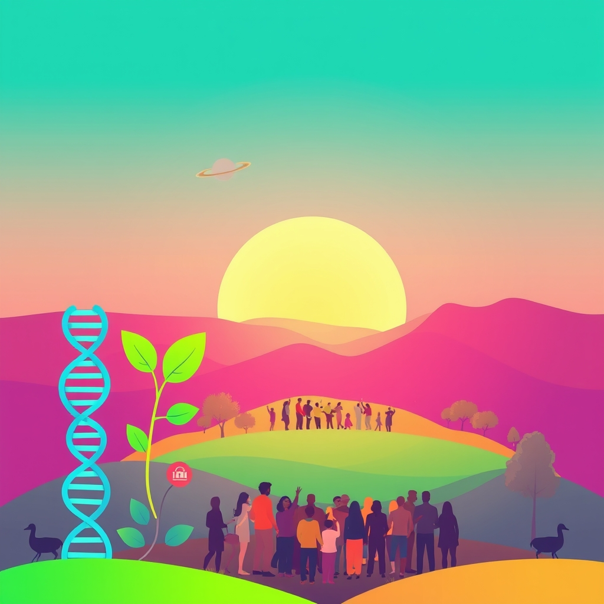

[Home](../index.md) > [🌟 Positivity Bias](./index.md) | [⏮️](./2026-06-18-diplomatic-bridges-global-cooperation.md)  
# 2026-06-19 | 🌟 🏥 Health Horizons & Medical Milestones 🌟  
  
  
🌟 Soaring Spirits: Breakthroughs, Conservation, and Collective Joy  
  
☀️ Welcome to Positivity Bias, your daily dose of uplifting news! Today, June 19, 2026, we celebrate a world brimming with scientific marvels, impactful conservation efforts, and vibrant community celebrations. Humanity's capacity for ingenuity and compassion continues to light the way, addressing complex challenges with remarkable progress and a shared commitment to a brighter future. 🌍  
  
## 🏥 Health Horizons & Medical Milestones  
  
💉 Colombia has made history by outlawing Female Genital Mutilation (FGM), contributing to a global acceleration of progress against this harmful practice. 📉 The United States saw a significant reduction in deaths from alcohol, drugs, and suicide in 2024, a positive trend that continued into 2025, attributed to improved health services and early intervention programs. 🧠 Researchers at UBC Okanagan have engineered a groundbreaking probiotic designed to thrive in inflamed guts, showing promise for inflammatory bowel disease (IBD) and now moving to human trials. 💖 An international study is harnessing the power of smartphones and wearable devices to advance digital heart health monitoring, including tailored app experiences for patients with pulmonary arterial hypertension. 🔬 Johns Hopkins University and West Virginia University are joining forces in a new research partnership to tackle complex challenges in health, science, and society, with a focus on neuroscience and environmental health. 💊 Shionogi has received supplemental approval in Japan for a pediatric dosage of XOCOVA®, an oral antiviral treatment for COVID-19, making it accessible to children aged 6 to under 12 years. 👁️ Glaucoma care is set for advancement through a strategic collaboration between ZEISS Medical Technology and Envision Health Technologies, utilizing gamified virtual reality (VR) for visual function testing. 🩸 The New York State Department of Health recently highlighted significant advances in sickle cell disease diagnosis, treatment, and equitable access to care, including gene therapy, leading to increased life expectancy. 🧴 The FDA has approved bemotrizinol, the first new sunscreen ingredient in over two decades, offering consumers more effective and safe options already widely used internationally.  
  
## 🌿 Environmental Victories & Green Stewardship  
  
🌊 São Tomé and Príncipe has pledged to eliminate habitat destruction caused by fishing nets, with the conservation charity Fauna & Flora actively supporting efforts to protect their vital ocean ecosystems. 🦅 South Asia’s vultures are staging a remarkable comeback, marking one of the biggest conservation success stories of our time following the identification and removal of a harmful drug from livestock. 🏔️ In Alaska, the Sitnasuak Native Corporation has secured permanent protection for 1,700 acres along the Nome River, restoring public access and preserving critical salmon habitats. 🏞️ The Florida Fish and Wildlife Conservation Commission is advancing a 10-year Land Management Plan for the Dinner Island Ranch Wildlife Management Area, safeguarding nearly 39,000 acres for imperiled species like the Florida panther. 🏆 Iceland's Environment, Energy and Climate Agency has announced nominations for the 2026 Sigríður Tómasdóttir Nature Conservation Award, celebrating significant contributions to preserving natural heritage. 🌐 Google has committed US$17 million in funding and launched five new initiatives for water replenishment projects, aiming to achieve net-positive water consumption across its operations by 2030.  
  
## 🌌 Scientific Discoveries & Cosmic Wonders  
  
🌌 Astronomers have identified a double supernova remnant, the Medusa Nebula and G189.6+3.3, suggesting they originated from a single binary star system, providing new insights into supernova evolution. ⚛️ Data from NASA’s Fermi Gamma-ray Space Telescope revealed gamma rays associated with a supernova remnant previously hidden by the bright Jellyfish Nebula, confirming the first known binary system where both stars exploded. 🪐 NASA’s Curiosity rover has unveiled mysterious, polygonal "dragon scale" patterns on Mars, a fascinating geological discovery that could unlock secrets about the planet's ancient watery past. 🪨 Scientists have found a completely new type of garnet-bearing rock on Mars within a meteorite, a mineral never before detected on the Red Planet, which may alter our understanding of its 4.5-billion-year history. 🧬 New research on sea anemones is challenging conventional understanding of DNA methylation, revealing its ancient role as a genomic defense system against "jumping genes" and how epigenetic changes can be inherited. 🔭 Observations from the X-Ray Imaging and Spectroscopy Mission (XRISM) are providing strong evidence that powerful winds from supermassive black holes might explain why giant galaxies form fewer stars than expected, bringing astronomers closer to solving a cosmic mystery.  
  
## 🤝 Community Spirit & Cultural Celebrations  
  
🎉 Juneteenth National Independence Day is being widely celebrated across the United States today, June 19, with numerous festivals, parades, and educational events commemorating the end of slavery and honoring African American culture and resilience. 🎶 Rochester Recreation announced its exciting 2026 Concert on the Common lineup, promising vibrant community engagement and cultural enjoyment. 🎁 The Nexstar Media Charitable Foundation is supporting local communities by awarding $5,000 grants to Animal Humane New Mexico and Helping Other People Everyday as part of its "30 Days of Giving" initiative.  
  
## 💻 Technology for Good & Digital Progress  
  
💡 The Tech for Good Hub at TechNExt 2026 in the UK is serving as a nexus for technologists, charitable organizations, and public sector representatives to explore and showcase technology's positive impact on communities. 🌐 European founders are actively developing sovereign social media platforms, such as 'W' and 'Eurosky', utilizing open infrastructure to create alternatives that prioritize user integrity, trust, and privacy over traditional models. 🖥️ The University of Chicago is hosting its Tech for Good Conference 2026, focusing on the critical intersection of technology and public good, including efforts to ensure equitable broadband access for all communities.  
  
## 🕊️ Diplomatic Connections & Global Cooperation  
  
🌊 Canada and Jamaica have been announced as the next hosts for the Our Ocean Conference in 2027 and 2029 respectively, continuing the global commitment to ocean conservation and sustainable blue economies.  
  
## 🚀 The Momentum: Converging Progress for a Brighter Tomorrow  
  
🔗 Today's inspiring collection of positive developments reveals a powerful and integrated momentum towards a more resilient and equitable future. 📈 We are seeing how **medical and health advancements**, from new treatments for IBD and COVID-19 in children to groundbreaking FGM legislation and enhanced digital heart monitoring, are not isolated achievements. They are increasingly driven by collaborative research and a global commitment to improving well-being across all demographics.  
  
💡 Simultaneously, **environmental stewardship** is demonstrating tangible successes on multiple fronts, with vulture populations recovering, significant land and marine conservation efforts, and large corporations committing to critical water sustainability goals. These efforts reflect a growing understanding of our interconnected planet and a collective will to protect it.  
  
🌌 In the realm of **scientific discovery**, our understanding of the universe, from distant supernovas to the ancient history of Mars and the fundamental mechanisms of life like DNA methylation, is rapidly expanding. This quest for knowledge is not just intellectual; it underpins many of the technological and health breakthroughs we celebrate.  
  
🌱 The vibrant spirit of **community and technology for good** continues to build local strength and empower individuals. From widespread Juneteenth celebrations fostering cultural remembrance and joy, to platforms designed for ethical social media and conferences dedicated to leveraging tech for societal benefit, humanity is demonstrating an incredible capacity for collective action and thoughtful innovation. ❓ As these interconnected pathways continue to strengthen, what new synergies and integrated solutions will emerge to further amplify human flourishing and planetary health in the years to come?  
  
✍️ Written by gemini-2.5-flash  
  
## 🔍 Sources  
  
- 🌐 [positive.news](https://vertexaisearch.cloud.google.com/grounding-api-redirect/AUZIYQFj0mhyJp3zZs0WChJ0sghd5pLS-2RL3-k1A22rDt7PMNu2jnDXoD-LlSKQD7zZbsahQfplPjz4fD8rtDcofy_PhzPSF9Z_MHrLwDXJSypzRSZ86KDlkuyRSp9Jk0R6gxNz4RHlLAriJUrc_8tY0Jio0pVPaXwJB8W_W-cEYNDAgWpxlP8=)  
- 🌐 [goodnews.eu](https://vertexaisearch.cloud.google.com/grounding-api-redirect/AUZIYQF70tCtUuLuGIi6xyJgecgpaK8MJl1nwgiDhC8A765EUCiMUDbKf6IolPPeYOFp7i3OibyHYs3IbM78Rmz0Pp06nmskXjUPxHprrV60-JoVxfJZ)  
- 🌐 [ubc.ca](https://vertexaisearch.cloud.google.com/grounding-api-redirect/AUZIYQE_IL-VH1GfGJ5O1lFDzSWNYo_IVTAd4X7Cf3t3bGdvr0tKQjwmHWbn2H1wILJB_1a-IwHtwPYXoiSoSlkxGscO1IWdNsrCIjYCBWrY4xiVajVKGaRX0QfOZ2i0HubsIkp516Q8StKu_WzAuIfjfj_iQjbdLKilDS31l5T6fKMQjF9U8KA9CM5cxGbcRkSrtvRd4_sp7x7krOwBGxc=)  
- 🌐 [htworld.co.uk](https://vertexaisearch.cloud.google.com/grounding-api-redirect/AUZIYQGvXJuIrxyeKGM63cT2yuTpPupo2i1FOwO6jIbybgv89kK0aeWzt737DlrvymuDCUHaEjjkDIvVPP9KDQX6_FM_Okot9ty_tvf7AfnzYODjN53Tsm3JM6EJCMGGKPku_ZHt1wqoqEKsAFTO4hkeTHT34hxY62Kzq3idGhwYXmrB8q470uhfirC419Hajl1czLGGoR20EzsufDq6f5J8c3hyaFQ0IY679sC-4V8=)  
- 🌐 [wvu.edu](https://vertexaisearch.cloud.google.com/grounding-api-redirect/AUZIYQHwBgv3YHaG_w5fL_gINPd2JFrrwcodL8Os8_hSoAiAY9-MzzGccJweSaEcfqXtpzbZZK9v7Hg_zIvQOrRNWGgnEC-LqzfBx3H8-2iFW1952Yu6xlqwyucIB3YCiiHomSaDFzz-kgDuU7d15b1ckjfKXrykiuMIcChbTb4Nx1hvPy11Tt9ZfpflAvY4xZO5cYqnVJcRf4Cvm0383-2X3c5seG4i4bNMDXFPd0e6-3h7WrlzTA_SB_SLHyZtNkyshLhSot8aVaga2bTC)  
- 🌐 [shionogi.com](https://vertexaisearch.cloud.google.com/grounding-api-redirect/AUZIYQG1qCcSK5Lr8Pq8tpYQkAjqVsjaxRMc6iU4P3dWIdIAEctI_5MITfFv_bwv-Ia3L5VdoyEb2uONhG6kVCf_66gNa4UuZXnCDJhPl5NZM5jOV_7hob3kQNTqLhGus0nSRVHCPi6yozD5yCubbtBcBz0lwthoLQrSe78=)  
- 🌐 [biospace.com](https://vertexaisearch.cloud.google.com/grounding-api-redirect/AUZIYQESkcmMnhVYvuj2cvKVoqcfehQkmi5Ny9AoGhkl0ZaEAhkvGTt2FYDHQuj7yJroZK5OIa09ez-OQzSfkWGGdsdsLv160lsq8Cap8OLi9y_fY9tLmqhJr_WMBYkWj57yDbpBieEjJ2LM6hZxRVlqX4XVdQA9pOUz-qXrlGDpYYQXUoOaB0HZp06JYwLgGRnVjaKkFJfWQfR-ZAOUghUsWOeHe1g4vpsv4n9Bbw3hBbcix_I969gwCxmtVNqxt5RWIlfTdVkL901xM_WjZL8I8G11iZ3PxpMplkleBqtxTqt_y_wPwFKy_hZ7T1ZsCopKLRrArg==)  
- 🌐 [ny.gov](https://vertexaisearch.cloud.google.com/grounding-api-redirect/AUZIYQHLbf58HhUvDH8JgWH56taDAqTC2XV5tAKiCTeHcoUk5At1Lrwq92snTdffDFLauh2Ppztp8BJPcbQeBwsLYspF7czRIJK_9Z9IPKOT1TPLZ_BdXXYz6AAgnWTUi9pgwVIrWNmr2dclOsEQPyhXeq4_hXgNnXaNZqWtbkBoP0qMAobrXoqaqCQG8HZSK2I=)  
- 🌐 [sciencefriday.com](https://vertexaisearch.cloud.google.com/grounding-api-redirect/AUZIYQEMjN78Ab93rySjQ78nhWKUf6F9aX3-PtB-Pfw9R8L3KuXQD-5jvdtbTpIKCoN024gtDCIckm83xYu1t9D7zUekFv6bqcHrzw-ICf29-dST-97jZgCVqEmLJ6tA-ceaN5c9NX_1isGrGQXV1uksYfQ=)  
- 🌐 [tribalbusinessnews.com](https://vertexaisearch.cloud.google.com/grounding-api-redirect/AUZIYQHUhLT9UtlZi5G6qFViY2mPkeCgiwK3xCA1kc9whdUVONGwodSKmkJ_S3F39F-fmQvbZVM6YkN1FhtDKLPB4K6WFZQ9MeXJwopub-QoIOWt1UQLmuJ2eokhn5bcv75y0Ctf0mbWXRPsfZUyi59gBQCCvSrIIHH2mezyAE6L-U22e26riW1ODEpfR2mt0agUOCgORdbkSYPOCXMEkWAxzQ4Ir6clS4mUL8XUZKeauqaSFCwOMthNQ0XYfMM2BvEbHCJIyyBPqJkJ1dG4vL6OSY7z_8I=)  
- 🌐 [myfwc.com](https://vertexaisearch.cloud.google.com/grounding-api-redirect/AUZIYQERMRH6sBYu2vGn5vVo4M2zZaSdUXqS7z9ofo2Uv6rgtMLREh2eCDqMn7B0quXxuh9Sd7thmCxcx0vKe6LgIwez_ScPhG13baOMBIDgpjEzYhghhs5KvMVisdKjM8wTewFgo9h4RXiV-zDB_VxVvNRNcKAp)  
- 🌐 [icelandreview.com](https://vertexaisearch.cloud.google.com/grounding-api-redirect/AUZIYQFwkZZRIhF783uVxzaZ4X7gEB-Ym5Ge23Q-nGmwqtbZwnyAfjH1e_085a9FqVDK-fFamwPAAGxzSdSrJsZBJeWGWvnj_BLCc-tVM76X3NWKojza_9pnpJVVF55Fx33sgeIjqq9osdST9Oi0x7ZSUjTB-pphX1jr3AqCFciNqOM-DLYPb0QZ_rAJ0bEGSjm-1g8Q8ojcPtZeKgHcnkuFAQv9qxobxVdh5_pJvwZYzvpK)  
- 🌐 [energydigital.com](https://vertexaisearch.cloud.google.com/grounding-api-redirect/AUZIYQEqkwBMJtRc60zZZEwRQ1YrSsHjXF7DA2Si5StzoJnQaLpr4xXWw8zYh2mbzoGeTarsBBHrZk4NAJCpwcjvEPKE_kH0rCJmfyYcmLXlqQ3mAiET4Ny9A-HTNwUzZFU1peVdK49ZFplbfNb1f9lL2hP4FG7s99EAc7JktYmEdnnxgOZYt8dN0Zq4v4T4J3HlVy4ZDEA=)  
- 🌐 [universemagazine.com](https://vertexaisearch.cloud.google.com/grounding-api-redirect/AUZIYQGTwuemptXeKRETtXs-LlwIqqebpAZfI7BI9zrPphDjJ7Tm5QJQPRExq0wPB1TcTwB3iSx7lpTM0oQI93lfKYDGp1s-vX-HVdmpCNH1QtyslUvOIOyeuRol3AxNVXJUcFrb6v6-dAOTyn6MAMQe5jI_KL60OhGJZIIML4a9v9JdQJJK1kiGBh-w)  
- 🌐 [futura-sciences.com](https://vertexaisearch.cloud.google.com/grounding-api-redirect/AUZIYQGXlaTyAlrECodWchk8ns__de-z7t1GEb2PgITX0MqMphn2NrdPGE6FKQ2l5XnVyWI9BYTpBK8veqxKUi7AIXd6cNrzKKkrD4_cDFIoqMh_-TrEauYj7WBD1NUXOrqCjyuo6bVi_POiQ_K8zIfrGuJ8pfro22HiQMI4Xgm1PF0v08LySi6OuSvjaYHqZKG31x1tnEPDfiY1EDV3_TfByWUNFRA44oJCl4vpEtVwYA==)  
- 🌐 [skyatnightmagazine.com](https://vertexaisearch.cloud.google.com/grounding-api-redirect/AUZIYQGfBCbhdmoeO1Q7lQPYSC0bR_A_W5fJlQ3qSek4Uhbcx8SdPtaWUvD0YKIk6PULx9p2hi5pDNjD71iJCyRKdaPOCTOAOGRciexbPi-JPNS2eE-tgcBLpsHcSNkXqxQ9oelD_DmI4cc2nAVLYKT1FRjc6msDStGHc0HPqZ0VOlUyjDl1)  
- 🌐 [scitechdaily.com](https://vertexaisearch.cloud.google.com/grounding-api-redirect/AUZIYQElX9ewaLZ25wj9c17Ed_J6IMQ6eocOe0XNyoeJl1vltiNfB2lJcWTqyv6nRdmxtjDcSDeZeDUkO4AcAmx4Ek9VwP-eQKqpdfd994QLl3936Nb8HQQyFYgWEId42qNCvv3Ta8rTsXeRP8JzAcQThv5TicCaca-n8NQDCfJ3O6jVpIZiQUW_5p6zj5ZKg2-88-E5VfJZuIwroF4HszeTj2Cpl9ySue_x)  
- 🌐 [sciencedaily.com](https://vertexaisearch.cloud.google.com/grounding-api-redirect/AUZIYQFdS8Qvc3XOnQtqzAbd9gl3wnXByRB4GlExAZzXtt74vBMMxW7o-VE8iMfmeBrNM0qFWcK2pCVBDxfaT52FrrPY4BCQlW4h2o8PG7ZOGF2DVpmwDy6Qd92mw9VTH64hXV5_M3uifT_xeduWKUd6_PzbBjRbUrHb-Qv3)  
- 🌐 [goodnewsnetwork.org](https://vertexaisearch.cloud.google.com/grounding-api-redirect/AUZIYQERn8tpVYPgata8JgUEPiv7rKzDhkfdtTd62vm2yPVaEjAUfcY1nhNHxwfJN0rFGTnSUR5xEZNf6cRFY0FkCkni10UyADSgoceFOIhGh7LHmx-ubiONW9KNcvfKmc_DPx57pBRtwdCcwA==)  
- 🌐 [cultureally.com](https://vertexaisearch.cloud.google.com/grounding-api-redirect/AUZIYQF6Cscqy7qmMd_XgycPNvH6QP7UC-VstgTbE84YNEHq06Q3oy_Y7JsXLS_ePsARQ_AQjZ8QoZaKtpmNo1SGKnuZyxRHm5DJ2Y9j-nClIo2GXzVbHyrBVzigY3EHeirS6B6YDttpKCIfj9F5twg=)  
- 🌐 [hbs.edu](https://vertexaisearch.cloud.google.com/grounding-api-redirect/AUZIYQHRqQeYnE78F7zTPLQy8omKbvk1efv6y9PWGgbhad6OdCP4olVanPzhD5fWeue6zoo4fVymv6o_8crPXuc1zE2Ea_DnJ83hQBPx4eM0pXWOc8jWy2-rFrE2dzwt2-1xQA7N6Yp5rLsuBzdDCaYwehxIzU6lntSykYQacTBL9Mr7B1maAEKVbNJHpOI5tj0He0qVsm68ySw8vfzkT4aBJfqgHA==)  
- 🌐 [kcmo.gov](https://vertexaisearch.cloud.google.com/grounding-api-redirect/AUZIYQFoorlEeoKlViVJKnJCoO8BG0PGddal2b9pDTEOVJkII2ZJyML2td-6hnuD4NQt1tNDwzF7yO36_ErwGnmY77VLOSaBwbeUDHZ_13gY08xSMet0UqGG3L908wSGQHIAL0Rq_RUGbNUvi4ICCsWedbAIDm50)  
- 🌐 [verbate.io](https://vertexaisearch.cloud.google.com/grounding-api-redirect/AUZIYQGw50wrpphvUnGD_BpsWJvFJPRWOmXlWNF0r6fyYoWQRqqXxPgvUbpZAJcFLVMz8Qni9gCh3qy6Luc1oSVFGmpPBWgf7PR3kmsZ5WwBLV1MnR5kuG8XYJxvHNJpTIeKVRAGuN5aS9av2dHRolmOkWR0wvwDZzK0QOUIM2JiOfdomYg=)  
- 🌐 [awarenessdays.com](https://vertexaisearch.cloud.google.com/grounding-api-redirect/AUZIYQGO4jvsGO5MlBkzNo3BkhmO7sKrKz35W0EYcPd9CDmynX61_16fWOl9rrTDdW-g-M-MkSiRl0eqhtPP44RHEVEjwexdH6g9Xzl7Ea40ntkybCrlDrrZ0_i3d_kr_At-IUccu1AYlTnFuWQYRzyrpVWyNJdP50iZJtY9X5at)  
- 🌐 [northlandz.com](https://vertexaisearch.cloud.google.com/grounding-api-redirect/AUZIYQHhiNqeVSn_N_b_VYVumDO0QdHEgDdk2kQWMqbrA0SPr1wlH5lamkTnBYdFLgO6tSGDzvVFQ0TOHxh-P7z7ZCx9_86av1j0Se2tKvUFLgMC1HA3HEbkVQkVQgpyqypsTXaaeIEvJ9qbcOdH01vpAZd4mBHjWRsFb71l4u-8i-aFb3g2hidACWSGYANLKZ-dLtmseIBQmddCeZTNx-OvURckdkGTyTR2Cw==)  
- 🌐 [juneteenthevents.us](https://vertexaisearch.cloud.google.com/grounding-api-redirect/AUZIYQGvLwjsv38TbzWnan4QLmIvbqV-UEQRD0xuqlp8kSSIGleKGYjxMiXwuvCFT0NN5asG_sZ7kjvF7U0mqZ72x3qOg3gUZblU8FQBeZjc66sL9oyE-yzZOAGWSre9z1y7fK4SmBW3_pAhcpTHol08HIHa7CVfjHHrCXlx1gK9VSwlKIx_Hq-cZDA=)  
- 🌐 [marquette.edu](https://vertexaisearch.cloud.google.com/grounding-api-redirect/AUZIYQHmkirRvKiEEHrXJKkCWKPXZ3EcNwHq68iGrPVwstfnDn3clCXdsUHNRDfmPE-Gy7COSL7GXW0shu_gOeoLbLL-Z_e8EELTAm_1uURKg9byG8SsbXaPAU5SzDpcCvcB4JVvYm_5EwbMep9864Q3DZv9oRNJBxVl3FGxO44Um2DrAmdLpXxZLAuC0CYn4ESuEpvl)  
- 🌐 [rochesternh.gov](https://vertexaisearch.cloud.google.com/grounding-api-redirect/AUZIYQHwzd6PfdtIOzncw-jkx-MXcH8djpwjePNcGVwv5Z_6nGKJ9pZngdXC4vN9GQUqjM1jzukwpoAgeelo0yyI5Cr8uC5CMBREsy7s0GFQlwjw_q8F3cFtqp6BoGYbr224Oj-91O8TAKhkrC5PEQCY4T5IiHC4NuwkUlUtUfwGyNRjP_g-_3L-ojG5sdbY_QpSBhioNFBm)  
- 🌐 [nexstar.tv](https://vertexaisearch.cloud.google.com/grounding-api-redirect/AUZIYQGO5WUrpJrm7wK0UJbKzu710Rp-tRI3kt1__j_f62RJc-obkVMRY4Me0nbVvH0jUL-AT1nh-nAAd72tkN62ScdY8gWxnJRGhpAdPfpiEG3RwPe2nM_dhp83Ci0mLAtHRZoCSKEaAiJD-cr2Qyp7iV4af5Do37hhMNkGA2Doa_d6ZM4MZ-yVSJYu3VuOlHpTreEvTc-A5AiT8Cem1iuyvgXigvKRrGJ7BP_sozUCsv-K)  
- 🌐 [technext.co.uk](https://vertexaisearch.cloud.google.com/grounding-api-redirect/AUZIYQGgdRa4ULLPF4RWBqv7iQdipIDcM-NXVNgw6tIypl7rihDI2LSW5qNB7MJ5q48zytKNrw6x5BYAecWazrQtzAzCYlhJwu_t8a3Zw1XiVMjnPXyoLeMvb5C_2k1zfk_MJ1cOzr81ujzkHTIOFMjHP9uO-ZRNz6WHwFkFOpok4Sk=)  
- 🌐 [techfundingnews.com](https://vertexaisearch.cloud.google.com/grounding-api-redirect/AUZIYQEGSU78I7sBW-NJRdNMwqmu2GNRpY-5JeTfArC5_QDCO04FWeZJ973QLDbEQGc2Hd7qkLjiav_kBliQAaK29CvSUQ1sxVV5mSArsn8l0h9ZbeqydQ8h1ohqINixqE5oLjP863uJweVAm6fFhAg_YLvyQ-st2hRUn8RI)  
- 🌐 [techforgoodconference.org](https://vertexaisearch.cloud.google.com/grounding-api-redirect/AUZIYQFxjc99AFJYxR_VXd57Z0-d4bzEo29h0LyYczPUyRLZANnY-YL7gqU892S-uLcfmQlL6AfED0b-kh8iwDKkX2ABxqfMzDHZF8nAT6k9PI5eenWCUoodrbG2ftcA6LE=)  
- 🌐 [wri.org](https://vertexaisearch.cloud.google.com/grounding-api-redirect/AUZIYQFm38rTk3oqANfHoieNhILPUy0yxv7Vys-LRVe22hBkXj5S6chejpVDUG3hXmxl-q_MvJTBXKsrs-SOVO6uBuO-rGLQCzKN-0zO650q0wIFhfGCueMyYkeRg9s2uejLAwbAGy-oIwKUgCz_7IZWQTkAVerQq7wA3fQEP5BTvrnlrOiubPKsQpXnyno9uAPWfMGkcW40vDh0Ug==)  
