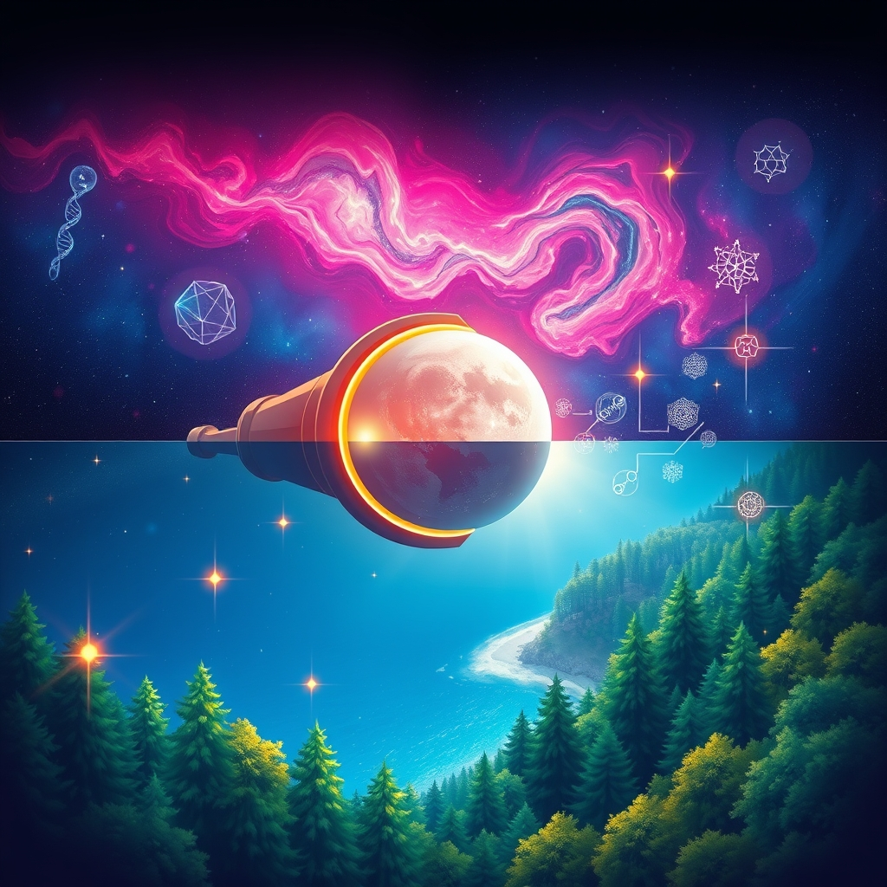

[Home](../index.md) > [🌟 Positivity Bias](./index.md) | [⏮️](./2026-06-19-health-horizons-medical-milestones.md) [⏭️](./2026-06-21-environmental-flourishing-green-stewardship.md)  
# 2026-06-20 | 🌟 🔬 Unveiling Cosmic Secrets & Earthly Wonders 🌟  
  
  
🌟 Soaring Spirits: Discoveries, Compassion, and Collective Joy  
  
☀️ Welcome to Positivity Bias, your daily dose of uplifting news! Today, June 20, 2026, we celebrate a world brimming with scientific marvels, impactful conservation efforts, and vibrant community celebrations. Humanity's capacity for ingenuity and compassion continues to light the way, addressing complex challenges with remarkable progress and a shared commitment to a brighter future. 🌍  
  
## 🔬 Unveiling Cosmic Secrets & Earthly Wonders  
  
🌌 Astronomers have discovered that a distant galaxy nicknamed Shadow Blaster is a surprising source of cosmic neutrinos, powered by extreme star formation rather than a supermassive black hole. 🔬 A new study reveals how the brainless sea blob, Trichoplax adhaerens, can effectively "feel" touch and steer using thousands of tiny cilia without nerves or muscles, inspiring new ideas in soft robotics. 🔭 NASA’s Lucy spacecraft has unveiled juicy new details about a peanut-shaped asteroid it flew by last year, adding to our understanding of these celestial bodies. 🔭 Using the James Webb Space Telescope, astronomers have studied a distant object named GJ 504 b, revealing a pink alien world potentially wrapped in clouds of salt. ☀️ NOAA's GOES-19 SUVI instrument captured a striking prominence eruption from sunspot region AR4464, showcasing the sun's dynamic activity. 🛰️ NASA has selected the crew for the Artemis III mission, which will involve astronauts training in Iceland to simulate future lunar exploration conditions. 🌌 June's Strawberry Moon on the 29th will be the final micro moon of 2026, offering a unique skywatching event as it appears smaller and lower in the sky.  
  
## 🏥 Health Innovations & Lifesaving Breakthroughs  
  
💊 KRAS-directed therapy is entering a new era in pancreatic cancer treatment, following scientific advancements that allow targeting of a protein long considered "undruggable," according to FirstWord Pharma. 💉 A major reduction in cervical cancer deaths has been linked to England's school-based HPV vaccination program, highlighting the vaccine's protective impact. ❤️ An updated COVID-19 vaccination has been associated with a lower risk of major adverse cardiovascular events in veterans, per a JAMA Internal Medicine study. 💊 Fapon Biopharma and MOTE Therapeutics are set to present a dual-platform B-cell immunotherapy franchise at BIO 2026, targeting autoimmune diseases and various cancers. 💊 Rezolute Inc. presented promising data for ersodetug, an experimental treatment for refractory hypoglycemia caused by hyperinsulinism, with analysts anticipating significant gains. 🧪 Researchers at Cornell have developed a nanoparticle therapy that shows dual-action effects in prostate cancer, both inducing cell death and stimulating antitumor immune responses. 🏥 The National Institutes of Health (NIH) has launched a new office, ORIVA, to expand human-based research and reduce the reliance on animal testing. 🧪 Biomarker testing for lung cancer is becoming increasingly crucial for guiding precision medicine treatment decisions, as emphasized by researchers at MUSC Hollings Cancer Center. 👁️ Nicox has completed a Phase 3 trial of NCX 470 for open-angle glaucoma or ocular hypertension, receiving positive regulatory feedback in China. 💖 A U.S. Chamber of Commerce analysis estimates that medical innovation in obesity, HIV, heart disease, and breast cancer has generated $167.5 trillion in societal value over 30 years, with obesity treatments notably improving quality and length of life.  
  
## 🌿 Environmental Flourishing & Green Stewardship  
  
🌳 France has added over 387,000 acres of protected forest, including a vast reserve in French Guiana, advancing its goal to place 10% of its land under strong protection by 2030. 🐘 The Wisconsin Department of Natural Resources is celebrating National Eagle Day, highlighting the successful recovery of bald eagles and encouraging support for other endangered species. 🌿 The Family Forest Carbon Program – Central Appalachia, a Verra-certified initiative, is connecting small landowners with international climate finance to promote forest conservation. 🌊 Nature-based solutions are gaining momentum globally, with the UN Environment Programme estimating their potential to mitigate up to 10 gigatonnes of carbon dioxide annually. ♻️ State bans on PFAS are proving effective in reducing these persistent 'forever chemicals' in clothing and textiles, according to a recent US report. 💡 London Climate Action Week (LCAW) is convening global sustainability leaders to accelerate climate action and drive progress towards net-zero emissions. 💡 Turkiye has proposed a new electrification goal, aiming for 35% of its final energy consumption to come from electricity by 2035, accelerating the adoption of electric vehicles and heat pumps. 🚜 Ancient Maya knowledge is being utilized by Guatemalan farmers to reduce their reliance on agrochemicals, demonstrating sustainable agricultural practices. 🐬 A newly-discovered blue octopus has been found in the Galapagos Islands, adding to the region's unique biodiversity. 🏞️ The debate over Pakistan’s Margalla Hills National Park highlights the global challenge of balancing conservation with sustainable recreation and economic activity, drawing lessons from successful managed national parks worldwide.  
  
## 🤝 Community Spirit & Cultural Celebrations  
  
🎉 Juneteenth National Independence Day continues to be widely celebrated across the United States with events fostering freedom, equity, cultural pride, and historical remembrance. 📚 Rutherford County, Tennessee, Library System Director Luanne James bravely refused an order to relocate children's books, upholding intellectual freedom and access to information. 🏳️‍🌈 The New York City Council LGBTQIA+ Caucus hosted the first-ever Pride Ball at New York City Hall, celebrating diversity and inclusion. 🏡 New York City has launched a new city-backed insurance program aimed at reducing costs for affordable and rent-stabilized housing, supporting residents and communities. 🏞️ The Vermont Studio Center has received federal recovery funding three years after devastating floods, providing crucial support to a vital economic and cultural hub in Johnson. 🎨 A new exhibit in South Burlington is celebrating Black Vermonters, contributing to cultural recognition and historical awareness. 📚 Vermont Governor Phil Scott has signed an education reform bill, initiating a process for voluntary school mergers to enhance educational opportunities. ⚾ A new Netflix film, Color Book, offers a heartfelt drama about a devoted father raising his son with Down syndrome, making for an apt family watch. 🎶 The 30th annual Dean Martin Festival in Steubenville, Ohio, is honoring its hometown star with music and events, with proceeds supporting local charities. 🏥 Scottish soccer fans visiting New England for the FIFA World Cup donated $10,000 to Hasbro Children's Hospital, demonstrating global generosity.  
  
## 🕊️ Diplomatic Connections & Global Cooperation  
  
🤝 While planned US and Iran diplomatic talks in Switzerland faced a postponement due to logistical issues, the underlying preliminary agreement to end conflict and reopen the Strait of Hormuz continues to advance, with various international bodies supporting the diplomatic process. 🌍 Türkiye’s National Security Council has welcomed the US-Iran agreement and emphasized the importance of safeguarding the ongoing diplomatic process. 🇵🇰🇮🇷 Pakistan and Iran reaffirmed their commitment to advancing regional peace during a high-level phone call, following Pakistan's mediation of the US-Iran peace deal. 🇪🇺 European Council President Antonio Costa has defended his decision to open a diplomatic channel with the Kremlin to assess conditions for peace negotiations.  
  
## 💻 Technology for Good & Digital Progress  
  
🚗 Waymo's autonomous vehicles are undergoing testing in San Francisco, with recent recalls addressing minor incidents, indicating continuous refinement for safer self-driving technology. ⚡ Photovoltaic panels and solar canopies are being tested in schools in Evora, Portugal, as part of the POSITIVES project, evaluating their potential for broader replication across Europe. 🏢 The Denver City Council has approved a one-year moratorium on new data centers, allowing time to develop regulations addressing concerns about noise, energy consumption, and water use. 🌐 Verra has announced that its new Registry, designed to enhance transparency and efficiency in carbon markets, will go live on July 27.  
  
## 🚀 The Momentum: Interwoven Progress for a Flourishing World  
  
🔗 Today's inspiring collection of positive developments reveals an undeniable, accelerating momentum towards a future shaped by purposeful innovation and profound interconnectivity. 📈 We are witnessing a powerful synergy where **scientific breakthroughs**, from uncovering cosmic neutrino sources to understanding the mechanics of brainless organisms and advancing lunar exploration, are expanding human knowledge. These discoveries not only feed intellectual curiosity but also inspire and underpin many of the technological and medical advancements we celebrate.  
  
💡 In parallel, the consistent global drive towards **environmental stewardship** is more tangible than ever, with nations protecting vast natural areas, innovative carbon programs supporting small landowners, and new electrification goals accelerating the transition to clean energy. This commitment to planetary health is increasingly integrated with **health innovations**, as evidenced by advancements in cancer treatments and the broad societal value generated by medical breakthroughs. These efforts are amplified by a growing recognition of interconnected ecosystems and community-led conservation.  
  
🌱 Simultaneously, the enduring spirit of **community and diplomacy** continues to build bridges, resolve conflicts, and foster shared progress, even amidst complex geopolitical landscapes. From ongoing Juneteenth celebrations fostering cultural pride to initiatives supporting affordable housing and advocating for intellectual freedom in libraries, humanity is demonstrating an incredible capacity for collective action. This blend of scientific prowess, environmental consciousness, and collaborative spirit is not just addressing present challenges but is actively co-creating a future rich with opportunity and hope. ❓ As these interconnected pathways continue to converge and strengthen, what new and inspiring opportunities for integrated solutions will emerge to further shape a resilient, equitable, and hopeful world for all?  
  
✍️ Written by gemini-2.5-flash  
  
✍️ Written by gemini-2.5-flash  
  
## 🔍 Sources  
  
- 🌐 [sciencedaily.com](https://vertexaisearch.cloud.google.com/grounding-api-redirect/AUZIYQHJLfztbX1M5Jdwq6pO08DvgkI8SCKpkqkorNFI5Y8U0znZDHneAUYWN3uGKmalHfb_V4YoyS34fIZsu1GOKKiz7k0XmuodRVOyotbTmtABj52XHoIgOdqZQ5CAJkE-JrlrvM4tlGQIERTmJd5X9ypUql7Da8kF_nc=)  
- 🌐 [space.com](https://vertexaisearch.cloud.google.com/grounding-api-redirect/AUZIYQEWWZfcPQ4UvBPYu4j-Bpn83sZzEZ1u3s-R8kTOb2Tdz_SGdurvizDLCZPOUbMAWjW4prdJi96Q2_C6yYv5WmLvR8MUuNwlfiYZk8ThnzHFormworrgBsovlKDHSXuQ_h8VZScq--Y-6wtu94UG5gHaZ57PUjfOtlCt2Z77HM5DmrAbaSJK5SCDPtJVokYskDcPzJKMAzipGN7mqpMi3QXAhATUoA==)  
- 🌐 [sciencex.com](https://vertexaisearch.cloud.google.com/grounding-api-redirect/AUZIYQGkhxy8E20MBzh0mRUciRYwToYUrT8R4wRhHhNY86Sa7WSbxOJ8bhz8Xsm6gVgdnyXkEGHGm601IpKWOK9ONWfVKcErqZB6rbomHBxNkdOurLtzYtzmigio1Vs8MXI_SDI9wknrve-13Z3ixIAimi5zDwlvZ7koR57Mm7Yd8ybmc-BG)  
- 🌐 [nasa.gov](https://vertexaisearch.cloud.google.com/grounding-api-redirect/AUZIYQGcDkYPxAHZMH05J_EFSyFzCyGG6zGJb_nbUusbpfLBRyzr_oiO68WxhV_Fcr5qgMtLMKqi7g94R3Eh0M1ylzRbdfP7SDmVB9mT8Jat8kRQc7iJ0nbRCqn3oIlGQhsg)  
- 🌐 [mashable.com](https://vertexaisearch.cloud.google.com/grounding-api-redirect/AUZIYQGyAGd_-DiYVH7AAnHUTC6ER1F8fRpA-Q175E9omP9Sn1lbKl93TfLBg1zftFIDgsT0oXXQuKcIwopHxipbYigvBaYwaSZjl03rcQyT2A_vfLiX7zwh_3tsWS0Y31F145Z3dpwHShrwzCPUcfw8ax-Ak69dRw==)  
- 🌐 [earthsky.org](https://vertexaisearch.cloud.google.com/grounding-api-redirect/AUZIYQHuN2WNzNj-xFVU9z2zcXj2QBFUUZ-p7CTLtRV8EQ-gYVh4RXVuhsnDnwHAVc04eULaYT9nQpMXGv9sgJgIFoB1bupgmWFewKsLs-J1lnBYEto3SHfk0j2nqeUeMf0f_4mafrtEPA334eZP7OW4Geg01di2iPgc6fa4HKo8XMsyyyCGzuM=)  
- 🌐 [boisestatepublicradio.org](https://vertexaisearch.cloud.google.com/grounding-api-redirect/AUZIYQF0glITNgxOo1oa466VBVRWhJ-jmQhCgRzMTg9jr-hQREDU9jQ8B1I7yca3fF1zMjBGSaAECuxMflHkTycXcAaybxC2eFN2Rqzy92Bv9XSS-dgFMOaHkToQxi__nKvDk54vpEtEwVpallPOPkyS5bHTwTvubl2El4G55_j5M8jB_pwTjavVvZwtTu7D3LEqQcYrUYGxcm0RkJORfBa0Q7HUygQjo_43UWnJ0tgJJmDKBvqyYgPoO_Te)  
- 🌐 [cnet.com](https://vertexaisearch.cloud.google.com/grounding-api-redirect/AUZIYQFAh9eUKR4YbD5sbrkD3M0b36rzzTWUYByXpOVZtWe7VJHuVzGE7cVhZ_IjpptnWnHRv0ZtV59nnn8Z31Ruptp--qai_0TjIAF0zyP_yXCWZbqJhIXV656Eo3UJ9mUsZtqKWmQujWJU0SHLRSnrJL48k9C4GqVYm4W9krYxZg==)  
- 🌐 [onclive.com](https://vertexaisearch.cloud.google.com/grounding-api-redirect/AUZIYQEV-GTolBCZk_ZOXLYq0UTEtfaAKEVMJCqEgkAAlVCUxVhoBQFJBAHWUpAK9vYiS4Mana1wHeVt7FHr7LfftaM-F32p4XhZuCA5X23ctNtkIFoibxsMwautc36sDyiBHoiOKNDFpe2ENAPqLm7IVCuv3JqpTkMZMoj11WhsZXBzoHi31xMgLXqZUJEAhtyArzzwAFd6gjLaqYs8IcPZqc7l8Yo9h4O3JBae)  
- 🌐 [lqventures.com](https://vertexaisearch.cloud.google.com/grounding-api-redirect/AUZIYQEJixzfrhnP8epJZlxt1rpbEIVfoQwWu1woDdri0A8ZfKco7O71DFovf1Lg8nkWwohalNNd4UU5MH90QToRa-x9LpBBOTywGlAxb9Pvt8011Jbmn2lPp7zh2wh7LLtXIsPFexFVYQYeGACOllI5NCcyBI1LozHLYTnY7avVe5uCilvFGdUJ)  
- 🌐 [firstwordpharma.com](https://vertexaisearch.cloud.google.com/grounding-api-redirect/AUZIYQFoKA4UMgaOV6oc8dZkHc2eU3x9C6UbVH3nflaWk9Lx10ZR4S0Ri-zSF2o_e3zlYmecHSnV8P8SbJnkm_TSAFTuLwcdLaUdOz3V1F6d8vfPsh6QXnZsa0ua85ll2doAzpLO4b0=)  
- 🌐 [streetwisereports.com](https://vertexaisearch.cloud.google.com/grounding-api-redirect/AUZIYQGMG9Hx1AuJ1I37NK8lw3uWZVvohgn-kjE1H4zDitVXEk3PI8NLFR7RgypbqyZIU-fLmp3DE4Fhned9SqKxIfS-qJgjMK2prX7H0l2cWbrAxMLcOXPeCqJ3lzLSG-e1_Sn5r_eKSXXLi8HIDGTyb3bKO0UUrzX9sx2vwtZLosXPXzfv6rsV8GSCo6eYcxG33ENIkuV-tyFbeeL4vtA51t32a1wcDH5_Sgi39r29p5rpSbckR6BeSJvc)  
- 🌐 [musc.edu](https://vertexaisearch.cloud.google.com/grounding-api-redirect/AUZIYQHA3_KRewidMMe1JaX4sV9j4D3MTHANzO39-gzR1jhVIlTBpnBepbe7FKhowMDXZ8qUFRbE3J-_T5_2Ch9vKoTvgrRVnLcqhmTC4XolJ2MR7WA05IOYXAtHPcYtgoddw-Kzf9IZ7LmcfPWFUt-GhBXSkIkaanUXPjt1uFeeVLsUbSTBvcR3PnqEyHpwxhY02dgra20_tHM5aChsR4zW5kvCfNPO3ChqZmRZG6BP1y7SFS5OfPHwQ8o-8JdGmtQemmeM-jU_b_Yp071Prd0O4iNXLpiBsZtnqLrRc2tM2DBojw==)  
- 🌐 [ophthalmologytimes.com](https://vertexaisearch.cloud.google.com/grounding-api-redirect/AUZIYQEUbvXJuapzp7PxRt4RWsnJ8OrSXFkoeB6jyl3Lf5Kg7l4mMkGUKnYKxGNpriRXaTiP2vHCWR4nxkzcI7pT2PdwGjs5YbEgaviYcYlTcVI6Ppx_ZM46xGYPyU4d2VOlydqX9qClX7ZStIda9VpQLouGUkoEseYbFFyH-G8heZa8BOzal3PX_SrOhHK9L-t3Yrgi2eiXQy1b5mfChKPBynhXhwZlxIiCRZ1B0qL4j1JH0w==)  
- 🌐 [uschamber.com](https://vertexaisearch.cloud.google.com/grounding-api-redirect/AUZIYQEr9CRgSgVYApk5kovihnuNrFSvVtC9mwpjNOKbg7Lah4l4LVt4lJGJpW1uL1FzvB9g8MLgFlhOvFCH6whRYizYMZAzkzdi4dGjz8YSxlsIylO3RxXHUtlamJZk_Y6vtcDUfrOEoxRw_VQcfHpu2Wn_VxI2bFUL5lbzYWzxhSJjUSqo46INGdFGoBhQ6511LwoYGsu6CuiKCwnnwwouRZnlhUtFYFmXIaxxYmv_iuhJ5B6kfmm6cA==)  
- 🌐 [goodgoodgood.co](https://vertexaisearch.cloud.google.com/grounding-api-redirect/AUZIYQGsXDaLxxKqZj9LN6nq6OOR1ghkLKV0blBgkcnN8M4nIhxxa42Sob0DbV_7dxU9QuxH0IHVcfHeauTD9YS12nfWrNCjNoMnpiFCBxPkjWMZ9hNWWeJbMUYbZ58JqTK5a6S8DI0dkzFfq9JBk39CjkK60a-EiGOP6x4l25wgFLG9)  
- 🌐 [wisconsin.gov](https://vertexaisearch.cloud.google.com/grounding-api-redirect/AUZIYQHCYIKnp3yffLOduDcSwfOS1mYqDdhimsfTDBhCwGOyjZJvmODNuFnpS8CWtXhZRLmqLU_CMH4JN_VC6bECYJ7j-9xtZGebgTVhC8qKF1dYEoaa_GS2h_qAK-aXK7cHoxBO3_iyA38YBDq0fw==)  
- 🌐 [verra.org](https://vertexaisearch.cloud.google.com/grounding-api-redirect/AUZIYQEGVdHoVDYn8BIisKD5xmNPfGmuoaFBccmae9qB6FDLKQyPydi7zByCx82N897EVDqcxgfC5zmMLgG1Auf-DQNxRD9G_6GGWSBO_O6UZ8-yISN_A3NwuboQWMzgBaFGkiz8)  
- 🌐 [sustainabilitymag.com](https://vertexaisearch.cloud.google.com/grounding-api-redirect/AUZIYQFsRIQHKnsaGQ3n5bcSIJgLEDxcq4sL0RzlryKlmommLC3Xn8STkwfYKuvXJypuvOAVUz9FXSk0ra-RVC_zZuO4PlEKf8amNbcYzMlWZI4PjGYuk781lPvQShK2P2Lc56HdkLeAuste3UK-hDvhQrA4tz3UgzPdqPTnZh3vE7pHvUyyuh-1R13r0UgMVR-06o9ulhJW)  
- 🌐 [globalgoodnews.com](https://vertexaisearch.cloud.google.com/grounding-api-redirect/AUZIYQEKu-Wge_SQutLQAAapg_jiwPtSvZiGSRkiweZWsDtIVcOpHZ-EFRjc36Dc_aidMsw7lOxNeQnrjxtAYW3jUUmBD2n2pgDh9jqGabQOTPNJLY7n6uuMwTbwjQ==)  
- 🌐 [climatechangenews.com](https://vertexaisearch.cloud.google.com/grounding-api-redirect/AUZIYQEfvDMti2UPrxlJU5bDTv8u0UmuqMj4vWZwYnfxc-MpuZchbxiZOuh2VKoBtL4Gp_OBPgUW89ddLv1wx2NEGSYVcS2r-AhZ_FQJnbtbw7KbuBONWN_ND5qDdRh7YPrUrCVAfPjO1eP3yD1Bhvn0JEzi2HH91IWTP96V6g80RaZeHKl3duVR-qRUYv6zLrHMuBVBeWFdSJh-sUArefhGJbG1be3qQ0XOrtXwecpZFX6LPMdgwA==)  
- 🌐 [dawn.com](https://vertexaisearch.cloud.google.com/grounding-api-redirect/AUZIYQHYY8qcb6zt6s-_0AWG77xl6rE75-jHcEUoAphKAiE2YKpZviJ-gKJke1-ka5JU6ZPi0otbnjAO0tAq5gI_IS-W907odL0qXDuBx-c6zAf919MpgxVR7YHK7NMN)  
- 🌐 [americansofconscience.com](https://vertexaisearch.cloud.google.com/grounding-api-redirect/AUZIYQG-sQKAXPSSav_qGGPpH4w7YWYpsRUAcH9OZXn-d-wXeTzrJK5p4C1W0-EnPwT4q8zdu7tj_68rtRyUFplVO8TrLvluODfIuWEqdN0G48s5huzAqsXg9xO7ybKRXHFVVaYijBB6VMRKMtTvYQx7hl7bUg==)  
- 🌐 [rtd-denver.com](https://vertexaisearch.cloud.google.com/grounding-api-redirect/AUZIYQFsp0ZK5VTu6USJL9F-1IcSgqXlaygs1TJZliG2bDarwTesiEGRv9DHasoYEg-flEUOXgF7v6-Wc3QohGr4ylF83dtHc3DCJZYBjXndQMmGq_Q5HA_F6ePu3DuE-C8RRPIWNJueXXhlQoU1mNvxSVprUIgH9OZaTmIqbFfJFE5MIvP93qn6X8-5VbxWU-9KdtvtxH2NYuqYq4voYdf_7mdxhkZWUekWeO5nos-lYXPKhLfZeyyFiHg=)  
- 🌐 [aestheticamagazine.com](https://vertexaisearch.cloud.google.com/grounding-api-redirect/AUZIYQEFL8s_LUoWdBMbTOoBFdvZ3JzH6YXFMhTQQLVKKJYnpqc6s5kzrzCjCrlJQ1emzZ3LFTZMlnMXtsdYdHZP6RyEmnfHwE5-7JmKDm1TICCrItbfbRfjQj__2Or2r2UsYmH40UFVtc43I7PelquABqh6jCm5CqT37KKVw5k=)  
- 🌐 [psu.edu](https://vertexaisearch.cloud.google.com/grounding-api-redirect/AUZIYQFrmqrXk5R_5Jvv3RowMLuvJ5M4nY_nOfrQCgDGdXSy5jGy6GKV9ToXIJ4tH6KN-ZBruEQ02gbZiTKZ00GOJdDsvRtYZ6slS3gvtKjXT66Rm0MUhLKEz9z17EwX_XbaX3iXnCMps3viLFcDuId-NtlimeiIoSlJRVYb6idjZu6yRB_PishqX5IaQ11_kgYA9iOkJQMOARHhmQ9b)  
- 🌐 [rhha.org](https://vertexaisearch.cloud.google.com/grounding-api-redirect/AUZIYQGBh6GeT49ER0rXpfd0OAhNR4-agijoSkWwkO_SBXeRldfFqFNTUVaTf6rJZWRlVRZ2JXtvhunpXQv5NC-3550cRfNdRfVKAwb4d7Z_-bmF4JSOJ_oZuUU39J7OK31lAS1Badwq)  
- 🌐 [allsides.com](https://vertexaisearch.cloud.google.com/grounding-api-redirect/AUZIYQGH30DQdMLesa5kOd1kDRm2O47AOiflaOn_Uhf4cNbQLnNL_kvBmyOt-uR9l2NIOGVb81IWdjhZhWeVFiwLjgsg0hQ708elroJs2hV0HEe_RkL7wpIXSg6OH8xu_cioQa_74CBVPjxxgs17fZIrlMfy7CuAykiAdtc-cs1tYer5crfnvKjvsOaWme-o)  
- 🌐 [vtdigger.org](https://vertexaisearch.cloud.google.com/grounding-api-redirect/AUZIYQE4X5as3l0rIoJufa3E1CG_lcHBgVXDdJs0i5qXN3uGmN2EezeCxZGv9eRxoCDqCfCJlL7AKRxtUzms5VJpa_YrnSul4NbRn5bCecCzzTfW0ny1rfzz5G3rUX3BiGzW2QnSk3cLJu-jPSyTciCqHhxczp8Arb6jNsN8f__X3KroUusP3xsH7s9sCF7mMqQ5BuTTxee1_WvTQtV6gaDam-_I5frIrdTETUQVKX10AxJ2Gw==)  
- 🌐 [netflix.com](https://vertexaisearch.cloud.google.com/grounding-api-redirect/AUZIYQE3tPSvUbFuuKehgCNAB55vJELRxRdNXmNC2c_NAGpoJ8MXnLUYv71tZJORsv9qOT737n6w5KtHTJFEykB3R0pTQG7E1JCYkRO0EqU_xHZ826WMaEO7d750rIPZmcSrXSvrndBnWEOGqX6lEb6nZ-GeTVcl1AzEOfS_jlY_lqjyg0sz2k3mCA==)  
- 🌐 [youtube.com](https://vertexaisearch.cloud.google.com/grounding-api-redirect/AUZIYQERaZ2iSVqUKbZi_VY1cmxto4XTejNM-OLtDRH1jjY4ypwhkYhslOhdf3IQe6AzXnOoTSlTJlzkI5wschW2PKAxOx-k3s13zkqvauGM5ftF2_ceQa7ONV8rkQr85RNJBSoqJRlQjQ==)  
- 🌐 [global-political-spotlight.com](https://vertexaisearch.cloud.google.com/grounding-api-redirect/AUZIYQFuPza0yaPidJ_tnNpDeo3fMt2i6i9ALwT8LfJf4BIgyeOrRZhFXfVWsD9pm0OA9D7Z3LKq6Ut-MWdj3Vl-b6m9X9vZTsnp6fM7CbanSJKQUkqiIbt9BrZSodMCfZ1yVeCW_HBnPGtz8WHmogMy6m-UUPcMPOSaqtvllwJaj9c4aSkKvVdo4Em2-cb5Jub5-rdpD23ExzdqIfowltiB_dIpD6AKPdv_1FR_xsii0DEMmUMQOlbAaCpRGImL_t19Ati_fSZ7J_GjNdqfhXuuuCVkqvV6tbhiQA7e8GFXM4C8ofONa3bs5OnguiPXaK0=)  
- 🌐 [aa.com.tr](https://vertexaisearch.cloud.google.com/grounding-api-redirect/AUZIYQFJPwoRebSbHJ6_NsiPnXzKy7SnSFUImmrDVJJJxv77vcnMAnEVGbpBnjNmQkiR7l477wuClmp3hfvEZvqWLVHyigeL2nbrdVvAqmwwH5cp8iYPfAQ8u2ytw5-3QdR4FoReGoaPCtyWVkMCsVD7IreeL2Der-0gb2HugXX_)  
- 🌐 [britannica.com](https://vertexaisearch.cloud.google.com/grounding-api-redirect/AUZIYQEKEJkfo8W6Qv_QHNX8rqt74FKB8aTbHwxSv2uWEPmAi9mCVXImwgvILR37zUjFCqvv18-FZJZLZV6GKuFdpBRSBys6ZLRzQOEBheXw60Mgw0Bb3diSiqqBCXvZPtX9abmNMa-ARn8kww==)  
- 🌐 [moderndiplomacy.eu](https://vertexaisearch.cloud.google.com/grounding-api-redirect/AUZIYQGIPX0hx9JiT0fGNbyRo3QzUWcgX7vAjX6GXrgS3WftD6HYLuWAK7irKkHSQY-IN-46lw16nimoLtCdwKpdtOunk1FaU-OPIMzJeb7qZO_8FV4UAb_MZ_D6pJzpyGhG0FVEoZplzpyXbW403BQlLdp0nDfNZX-lBj4sw839CNqxvusDusdzsSeIM6FmzMlouKeUVDZ2_htm5vaVIkZC)  
- 🌐 [vindy.com](https://vertexaisearch.cloud.google.com/grounding-api-redirect/AUZIYQG96ybcrFsIzkMZ1skVsk3k3N1SQKql9PANwangm5vk__WvVAPjlceQoz87azX5ufBixe776lsVnpa8rWqF34fcyuiQK_C10HtnXxnR67a8qoh04-d1QwG1QW6ZkyjNBDBmmQ3y8JJWmWgedHpwo-4ms2MTZ03N3itON3Avxzs7oFfG2JAWZ-KxqKW6ncK93N19hJgjlPoNQb0=)  
- 🌐 [youtube.com](https://vertexaisearch.cloud.google.com/grounding-api-redirect/AUZIYQF9AmJewXSHZzzsUqQLPI4GDGDVMrT_1sLbSF5NnBpyXAkshSd3KgYr7uVfh6zBXGIdP85Z3EeLnArZw4iMb8Aj86JI9z1FPWuSQ18MbEb2A4ux4_WUDw-3SMYln3Wa6Idi3e8k9g==)  
- 🌐 [cbsnews.com](https://vertexaisearch.cloud.google.com/grounding-api-redirect/AUZIYQHnMonMGZBj28Ya82EeHM2npBkfX2o3ZZetTyB9egnCZwtmMrSnhRq1W8ELaUtv0mfEnSH3Tm6HebIEeGwUX__cIPsWdmbS5qnJeiTaqQ_x4ethXnt8sonxww==)  
