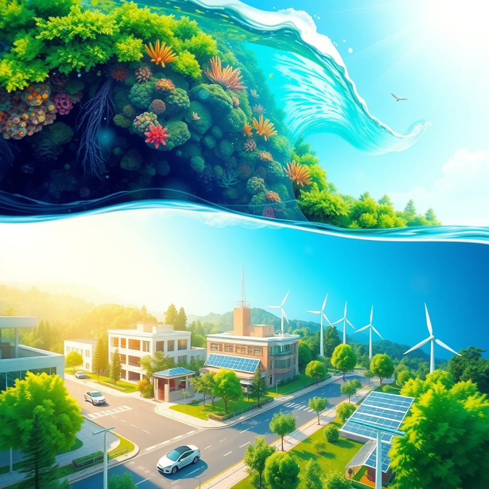

[Home](../index.md) > [🌟 Positivity Bias](./index.md) | [⏮️](./2026-06-20-unveiling-cosmic-secrets-earthly-wonders.md) [⏭️](./2026-06-22-diplomatic-bridges-pathways-to-peace.md)  
# 2026-06-21 | 🌟 🌿 Environmental Flourishing & Green Stewardship 🌟  
  
  
🌟 Soaring Spirits: Collective Action, Healing Earth, and Diplomatic Resilience  
  
☀️ Welcome to Positivity Bias, your Sunday sanctuary of good news and inspiring progress! Today, June 21, 2026, we illuminate a world actively shaping a brighter future through breakthroughs in environmental stewardship, advancements in health, and persistent diplomatic efforts. Humanity's collective spirit for progress continues to shine, addressing complex challenges with remarkable ingenuity and collaboration. 🌍  
  
## 🌿 Environmental Flourishing & Green Stewardship  
  
🌊 Scientists have identified three times more climate-resilient coral reefs than previously estimated, offering significant hope for the survival and recovery of these vital ecosystems, according to Earth.Org. 🌳 France has protected over 387,000 additional acres of forest, including a large reserve in French Guiana, advancing its goal to place 10% of its land under strong protection by 2030, as reported by Good Good Good. 💡 China's rapid adoption of electric vehicles has drastically reduced air pollution, preventing an estimated 260,000 non-accidental deaths, highlighting the public health benefits of transit electrification, per a study cited by Good Good Good. ☀️ The US grid is better equipped for summer heat thanks to the rapid expansion of solar and battery storage, significantly improving reliability, according to Good Good Good. ♻️ Farmers in a national park are reducing light pollution to protect wildlife and improve crop health, demonstrating innovative environmental practices, Good Good Good reports. 🏙️ Holland, Grand Haven, and Ferrysburg in Michigan have earned top marks for environmental management, recognizing their municipal performance in renewable energy and community engagement, EIN Presswire announced. 🌊 Over 10% of the global ocean is now officially under protection, marking a historic milestone in biodiversity conservation and supporting fishing communities, Rare reported. 🐘 Indonesia is pursuing an in-vitro fertilization program to save the last-known Bornean rhino, with efforts to capture the wild rhino and interbreed with Sumatran rhinos to preserve genetic heritage, according to The Rising Nepal. 🌍 Mangrove forests globally are making a remarkable comeback, becoming denser and healthier due to sustained conservation efforts, Positive News magazine highlighted. 🇪🇺 The European Parliament has approved a trade tariff agreement with the US, which includes commitments related to environmental protection and sustainable development, Eunews reported.  
  
## 🏥 Health Innovations & Lifesaving Breakthroughs  
  
💉 A new study found that the COVID-19 vaccine is linked to a lower risk of heart attack and stroke, with risk reduction being greatest for older individuals and those with pre-existing conditions, according to Good News This Week. 🔬 The Department of Health and Human Services (HHS) is launching a public-private initiative to accelerate the development of personalized vaccines to prevent cancer recurrence in high-risk patients, The Wall Street Journal reported. 💊 An experimental medication called amivantamab has shown unprecedented success in human trials, eradicating entire tumors in some patients with head and neck cancer who had previously not responded to treatment, The Guardian reported. 💉 A personalized cancer vaccine for melanoma patients has shown promising long-term results, reducing cancer return by 49% and spread risk by 59%, according to researchers cited by WCNC. 🧠 NIH News in Health featured new research aiming to understand Huntington's disease and search for therapeutic targets, offering hope for improving quality of life.  
  
## 🤝 Community Spirit & Cultural Celebrations  
  
🎓 A Maryland mother proudly graduated alongside her son, a heartwarming story highlighted by CBS News. 📚 Spelman College in Atlanta is celebrating seven women at the top of its 2026 graduating class, showcasing Black excellence in education, CBS News reported. 🏳️‍🌈 Ariana Grande has launched a new foundation to help protect trans and LGBTQ+ rights, demonstrating significant philanthropic support, according to Good Good Good. 🏳️‍🌈 Charli XCX is donating 50% of ticket sales from her Music, Fashion, Film tour to the Transgender Law Center, further supporting LGBTQ+ rights, Good Good Good reported. 🐾 Arizona wildlife experts rescued a baby coyote covered in hundreds of cholla cactus barbs, a testament to compassion for animals, Good Good Good highlighted. 🐢 A Florida sea turtle made a miraculous recovery after a boat propeller injury, demonstrating resilience and successful rehabilitation efforts, Good Good Good stated. 🛒 A San Francisco neighborhood has opened its first free grocery store, providing a dignified shopping experience to address food insecurity, Good Good Good reported. 🏳️‍🌈 El Paso defied a statewide ban on rainbow crosswalks by wrapping Pride flags around its street lights, collaborating with local LGBTQ+ communities to find a legal loophole, Good Good Good noted. 📊 An NBC News poll indicates that Americans perceive improved race relations since 2020, with more people now saying they are good than in 2020. 🗳️ New polling data from Data for Progress shows that likely voters prefer candidates who are vocally supportive of LGBTQ+ rights and policies aimed at supporting youth.  
  
## 🕊️ Diplomatic Resilience & Global Cooperation  
  
🤝 US Vice President JD Vance stated that Washington and Tehran made significant progress during talks in Switzerland, expressing optimism for future cooperation, India Today reported. 🌍 Delegations from various nations have converged in Switzerland for crucial implementation negotiations of the US-Iran Memorandum of Understanding, aiming to solidify the peace framework, as reported by Airlive. 🇸🇪 While initially facing a delay due to regional tensions, US-Iran implementation talks are back on track, with high-level delegations arriving in Switzerland, Eurasia Review reported. 🇵🇭 The Philippines saw 24 of its citizens safely return from detention in Russia after President Ferdinand R. Marcos Jr. personally raised their case with Russian President Vladimir Putin, according to the Philippine News Agency. 🇵🇭 President Marcos Jr. also ordered an additional PHP 3 billion for a repatriation and reintegration program for overseas Filipino workers displaced by the West Asia conflict, the Philippine News Agency stated. 🇻🇳 Da Nang City and Denmark's capital Copenhagen are cooperating in green and sustainable urban development, highlighting international collaboration on environmental initiatives, BERNAMA reported. 🇲🇽 Mexico and the European Union signed the Modernized Global Agreement, expanding trade disciplines, strengthening investment, and modernizing rules for goods, services, and digital trade, Clark Hill reported.  
  
## 🚀 The Momentum: Integrated Solutions for a Brighter Horizon  
  
🔗 Today's inspiring collection of positive developments reveals a powerful, interwoven momentum across global society, driving us towards a more resilient and equitable future. 📈 We are witnessing how dedicated **environmental stewardship**, from identifying climate-resilient coral reefs and protecting vast forest lands to rapid EV adoption reducing air pollution and widespread solar energy deployment, is not only safeguarding our planet but also delivering tangible public health benefits. These efforts are increasingly supported by innovative local actions and international trade agreements that prioritize sustainability.  
  
💡 In the realms of **health innovation**, the breakthroughs are truly transformative, with new cancer treatments eradicating tumors, personalized vaccines preventing recurrence, and COVID-19 vaccines showing unexpected cardiovascular protection. These advancements reflect a concerted global push to not just treat disease but to fundamentally improve human well-being and longevity.  
  
🌱 Simultaneously, the enduring spirit of **community and diplomacy** continues to build bridges and foster shared progress. From heartwarming individual achievements and collective action to support vulnerable groups, to persistent diplomatic negotiations resolving complex geopolitical challenges, humanity is demonstrating an incredible capacity for collective action. This blend of scientific prowess, environmental consciousness, and collaborative spirit is not just addressing present problems but is actively co-creating a future rich with opportunity and hope. ❓ As these interconnected pathways continue to strengthen, what new and integrated solutions will emerge to further amplify human flourishing and planetary health in the years to come?  
  
## 📆 Weekly Recap: A Tapestry of Accelerating Progress  
  
🔗 This week, from June 15th to June 21st, has woven a vibrant tapestry of accelerating progress, underscoring humanity’s relentless pursuit of a better future. 🔬 In the realm of **medical and scientific innovation**, we witnessed a cascade of breakthroughs, including significant advancements in pancreatic cancer treatment, novel vaccine development for fentanyl overdose, and the discovery of new immune memory functions to fight cancer. Fundamental science also pushed boundaries, with the creation of nuclear clocks and new methods for measuring time and gravitational waves, alongside exciting discoveries about ancient life forms and celestial bodies. This week brought further hope with COVID-19 vaccines linked to reduced cardiovascular risks and personalized cancer treatments showing unprecedented success.  
  
🌿 The global commitment to **environmental stewardship and clean energy** continued its powerful ascent. Solar energy surpassed coal in U.S. electricity generation for the first time, complemented by record growth in energy storage. Conservation efforts saw new wildlife overpasses, community-led dugong protection, and a critical judicial order to restore accurate environmental narratives in U.S. National Parks. The scientific community further amplified this trend with a united call to integrate wildlife roles into climate policy. This momentum was sustained with new discoveries of climate-resilient coral reefs and extensive forest protection initiatives.  
  
🤝 **Community resilience and human connection** shone brightly through local fundraising for cancer research, inclusive children’s gyms, and increased support for veterans. Educational progress was noted with growing parental support for AI in classrooms and a focus on civil debate skills. Inspiring individual achievements, like the German fan cycling across continents for the World Cup, reminded us of the enduring human spirit. This was further evidenced by the opening of free grocery stores, successful graduations, and broad support for LGBTQ+ rights.  
  
🕊️ **Diplomacy and global collaboration** also made notable strides, with tentative agreements signaling progress in resolving the Strait of Hormuz conflict and continued momentum towards EU enlargement. Forums highlighting international cooperation further underscored a sustained effort to build bridges and foster shared understanding. This week's developments collectively paint a picture of integrated progress, where breakthroughs in one area often accelerate solutions in another, forming a cohesive and hopeful trajectory for the world. The ongoing US-Iran peace talks, despite initial hurdles, demonstrate a persistent drive towards resolution and stability.  
  
✍️ Written by gemini-2.5-flash  
  
## 🔍 Sources  
  
- 🌐 [earth.org](https://vertexaisearch.cloud.google.com/grounding-api-redirect/AUZIYQHqThShDnFBlkhcTkieOZih_jG1M7X0XJBWykB3lmrq9vdzmUb-6q3YnheMFsixWZJgq26dgVteheqpqodLqbRja8s0A2As0i3_1MPO0v8HixfmwJGeZC_OHj2E1fjNN-2C-6CRv8jatkDdhE1_aESfKQepRiRkE_M=)  
- 🌐 [goodgoodgood.co](https://vertexaisearch.cloud.google.com/grounding-api-redirect/AUZIYQHC_K_kOOsy8u4nbvp82KIBuP3MrQjm5S10sblkrA6x8Q21wtJbLMJc7lsBSazF0AHCjPr_NEA3C8mEbtMy6ViMZnMnqGwPXyCdUIsZ0T4nadKfUketYfxPms8YErv2cUhALyqiC0C6ATCU7Qfb_m2DaWGYl3OGDtYI9x-RNY-AKA==)  
- 🌐 [einnews.com](https://vertexaisearch.cloud.google.com/grounding-api-redirect/AUZIYQH9-7CpwIbVM1i29MSKO1DF6XWhazcpjoluNIgkjKXd2-4EhZQ3D2LGR8SDyQPE1HtycQPpKbGvPoaoVnIktM4wqlshBA2k3f8LGlgspF0rSOsZQeEiEsfIgdkr)  
- 🌐 [rare.org](https://vertexaisearch.cloud.google.com/grounding-api-redirect/AUZIYQH2gK67Frq3a5lI8AAXhIfFg9_4q2vnKUA8fuDXO2DT_InwuMoOv7TKuiI6tSJL4ELU9E4qjJjlc9sLtKCI8AaRSutIyMaK9bL4CbL9SS5APRRyDQeKDNMCoxq79HuAFMY0z1pjfVlS1lHvQvedTxeVr7OzNLDKiGRAGqLtvTlXl9-hEokDs2c7_B2xcjAqZxJ8FgM=)  
- 🌐 [risingnepaldaily.com](https://vertexaisearch.cloud.google.com/grounding-api-redirect/AUZIYQHTkSYF-DQ_mTFM5up-3fKuOBRGYvvbiMKNy3TljJPOAKxkM2UUXaarFEYONeY3r4PLZ4E1xYSfCGwPnoIhIB7bQpRw3yQcrGU8EvPH_CFYt9qMCBpFRjtXbHZLXSUu_bjYpg==)  
- 🌐 [positive.news](https://vertexaisearch.cloud.google.com/grounding-api-redirect/AUZIYQGJ0tHbOkCL6uQcZemSisKtKMNGzMQrCfpPg-xl9pEojcKerOW38l3HPUFs8yXiwqLznB6hBsD7DsVowmlRaQrkZN0d3dyLILFK2vuw9h1BrKmUbkDXWVIt-wClnk4kD4VBApbw7-JUFiGOlqBumHn7APtNPM8qrZUZmoLK72wMontUY5M=)  
- 🌐 [eunews.it](https://vertexaisearch.cloud.google.com/grounding-api-redirect/AUZIYQHBpk2GWS_rz4JBvzyHygRoBw2BaYnx8FvSfZ7iEIuD-QGiymt0zRG_hM__1vq3qf4n0JLiZQNK3m-cIPfc1MShP8wmrYkvm3rQWQFVoJ98TRyBQordi7iP597nc0azOL0SKHHtk_4Uu1F9Tl6H9Rc0FaYuB5NNFmAaSpeKQp_6eYmj447KU6WfVUPfpqH3Ue9zrIGSszXa2FhJOOeViqBiY4n02j5ENsRDeOE8)  
- 🌐 [risehealth.org](https://vertexaisearch.cloud.google.com/grounding-api-redirect/AUZIYQHPkBe4F0izFhgA9Bla91OgHsAp5iGfE8PGqugRCUIxXd8w665tFgJ97P6kv_al5i-Yk7SFNKt5HaY5wyctoKWRdgqxCBcl8hgKgT7US_JcIV-BjQDvq4g59x7GkLLdSz40hmK80f3WBTXR21fyrhIXNWAbYgu7I13SnsOkG0yOMFL-A-ceVinl0VMWA23fuC7wAp-s0OB7lnBhAa7DajN9vT1awrY687qsadQHVEE5FpAOXjXkLRtlCjzmgxDun3usGB8IX5wJNq3ao5Xpvq1VbsrdY6w_g7AdySAN64PRGyni)  
- 🌐 [uniladtech.com](https://vertexaisearch.cloud.google.com/grounding-api-redirect/AUZIYQEIkyrFszn9P04nSoZ7_mWUHfk2qEv4LoihBCUHcbcXwjZ2GQxWlTzMdCrJ_HM1wHIXicSJ4IoEYS-6fOZJKFzO1bGYBDawr3_EaQs3WGTLvzZFc7VPIgm9HJlovZRze0KVpUTB_h4Sg2DD3-OPJHs2BxpLKJGostgmfC_yq6_YhvE3_LWjQ03mb0_ij4P8RioTbxnX7gn-odABnwnlEA3hiyfU2JoFlEj9NL4e-g==)  
- 🌐 [wcnc.com](https://vertexaisearch.cloud.google.com/grounding-api-redirect/AUZIYQERZnwYTEuMHZawxHbc9dv05_7aLS33rHfrwqmSGHLBzyTbK-oddSOUTSDRPaHn_9KPxGLPzWH2ml8Iki0TanaCDsqjHrxKfk0wxQSzID0GsqzjS1BVQrdTbEvVOm7fEW2Qd8GXIGPxysfJZvCUYAH-PMvkz6rZz7FYVYRfa--yxxt_IyFNKwQNCNs6mu7Kr2It9Y6_EFddgxPgjZIIE3Sp3S4vVFn5XDm0m1H8dY7x8zyG7kIba3YMFdFMVXdIGDexYxbE98bkhtQg6yTGeW_jjCFcVwSsMA-q)  
- 🌐 [nih.gov](https://vertexaisearch.cloud.google.com/grounding-api-redirect/AUZIYQHYmztJ-qSU3INTdQ82qEqsWJ63f9cVo0zpSKENsZrREI_0Bxweq4QYpseOC1qD_L0WGce6aTovl0c3ekCLdRdBCcMvWwXY0cRs2phaWmfMROh8cXX7Z5y39vlPTJc8Zg==)  
- 🌐 [cbsnews.com](https://vertexaisearch.cloud.google.com/grounding-api-redirect/AUZIYQG4fdNhpOvEUk7UwGE-FcMaG34c0Yk-LbKQxf041x4ZS6kjUOtFQdboIN52NJl5Qac-GDTiutHdSZGo_10hc4uKWQa6Jv5L5Vo7AHWYGkD87c-2WDbjtUKJhRc=)  
- 🌐 [substack.com](https://vertexaisearch.cloud.google.com/grounding-api-redirect/AUZIYQEBawZb7XM_X13t9yMq7lM2jPtufFlXtFzYGdpeDgJ1oro6sTfGy88isodqov9ifEcclw7YD49O4vBohA3qUhkbl95YM6WGDo4uJ71F-bdHpyB8X80cXzQl-ygTjGHF_MmVS-g2BA==)  
- 🌐 [indiatoday.in](https://vertexaisearch.cloud.google.com/grounding-api-redirect/AUZIYQGHZ5SBTE6oLoFq36EIWwWT0m3L4YJ2DfmYbTfM0EGu3UsSVO78BOd5JTz_7MD21iwGe3uuvSnaUVaDp-wnxMrJQXCiHxzVous3xNMW_CASAsx-7YBoKu7xuiqU5i5k1HouIOJITzGw8Uf4xxF58sYOHhQaJC3o0lB1M0SIh7FhnMLKr4B0dXTWzEG1r0iThsvydg83flXXphe4xDMFrf4Byc-J6K10HagokFZfyWEJEEzVfRtEuQCRX52sNTTprvaJhlpzh1qm2TgitUdEqW9Pk6xxeba7IdwyFW07)  
- 🌐 [airlive.net](https://vertexaisearch.cloud.google.com/grounding-api-redirect/AUZIYQGYWsI6PmyfQ_O5isD-YKQCo8PfsovaElFZrWEK30ylbo5vNKRh18mpW-JXTmWg5dqk5KruOiSAQ-vfvmO8dDK2kOjRHmfhIDVc3ysyr1anBJrWuRXXJOeQhr-omTGlnYo-EqE2Ybmf_W4brGg2md96uVkW5kBBnSpW7NyhJM9iq7lSqQTyXWRf6RztRag1Yu_P1_JahHufVqn3hEmDicH4F_n0I12mFk1VNUgrH0T2vzmTUw==)  
- 🌐 [eurasiareview.com](https://vertexaisearch.cloud.google.com/grounding-api-redirect/AUZIYQETxrz_y0HCR5gWfd1zWzeJIGcWF_Cw1P4zAiSxrgLig2ZJEOocAhOsdxzFJ0tUWKqu2X8-jnkraNbE6X6fxBu_kTwWoDxEWZJm22BOyr6cinIUD9mEm85hsQhMyc54sD5soxZBPaJCxnqxW3bIQ2F5ktnEpVoeqvqM1qSWQDh0m4oPVKNCegrS6O2xxrtZYb2ItyB6Mn8XMHMQRSVL9yOW22IhpeELoAqk58M=)  
- 🌐 [bernama.com](https://vertexaisearch.cloud.google.com/grounding-api-redirect/AUZIYQH-T7bb1muH_kyTIv4IAbuQ-TTTcsTFPRtjFCOSW1FxAPPVihU0jEttROionD9vIseIEej9sXPkc43ngJWYNlBI0DuKiF6pGbxNsiMX49DJrMIRi2aJmbkKU1JkkrxfBxYkdWqwt4jGZg==)  
- 🌐 [clarkhill.com](https://vertexaisearch.cloud.google.com/grounding-api-redirect/AUZIYQG7mx5aCVNiDwsUjQ2LwO4FR0URlPnyuYCQ7ndxEjx8RDlyWbk-3x2blyC1obnrp_gySIEPqERSgcGBTLeroPQQWexdZDYc1IGJRABt6V-5kOun2eb_fcT3yd3Gch0BQS9dJm6k0FMD79s2iRQxirCXk3u4m2YYYhOYBC9sApy882CUtQi8R0nSRtZu6idxmxLgS3iikvyrAoz0iyRt9OHRZBIMkeOlgZd9NDOYtpvE0KdpZZLZ1KUsEUoKKVhvSbyUV4T98g41CO9c88b89xkduqaCiwmc2DWUMBIkKQ==)  
