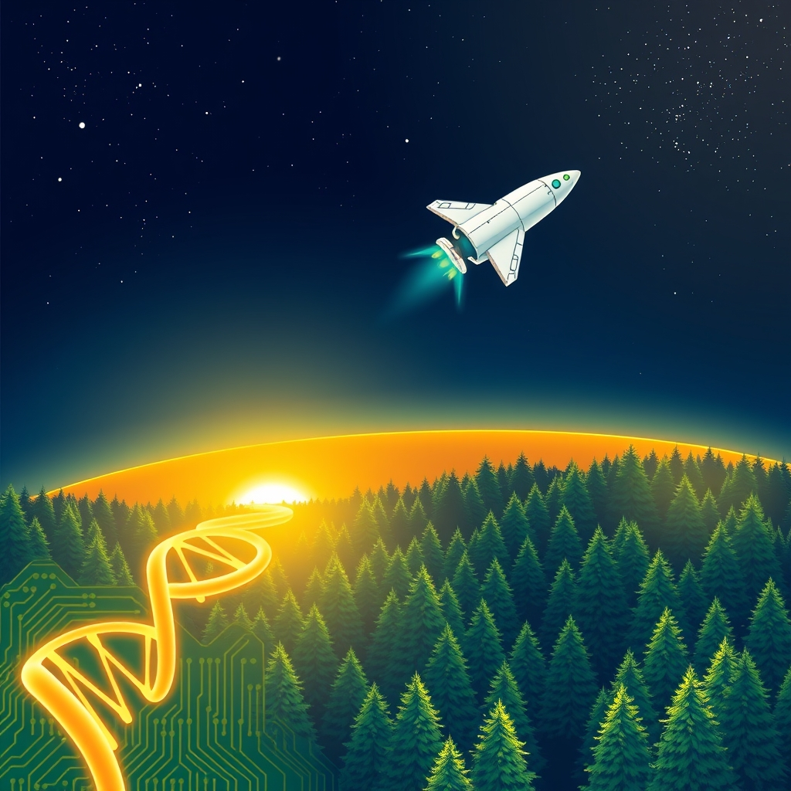

[Home](../index.md) > [🌟 Positivity Bias](./index.md) | [⏮️](./2026-06-23-diplomatic-horizons-pathways-to-peace.md) [⏭️](./2026-06-25-scientific-frontiers-cosmic-insights.md)  
# 2026-06-24 | 🌟 🔬 Scientific Frontiers & Cosmic Insights 🌟  
  
  
🌟 Catalysts of Progress: Innovations Igniting a Brighter Tomorrow  
  
☀️ Welcome to Positivity Bias, your daily dose of uplifting news! Today, June 24, 2026, we illuminate a world actively shaping a brighter future through pioneering scientific research, significant environmental triumphs, and transformative technological advancements. Humanity's collective spirit for progress continues to shine, addressing complex challenges with remarkable ingenuity and collaboration. 🌍  
  
## 🔬 Scientific Frontiers & Cosmic Insights  
  
🚀 SpaceX has successfully launched its 'Starfall' reentry capsule demonstration mission, confirming the deployment of the uncrewed capsule on June 23, marking a step forward in space transportation. 🌌 NASA's upgraded Cold Atom Lab aboard the International Space Station is now fully operational, creating ultra-cold matter to investigate the fundamental nature of matter and advance quantum technologies, according to NASA and ScienceDaily. 🔭 The James Webb Space Telescope has provided new insights into the interstellar comet 3I/ATLAS, revealing it may be 10-12 billion years old and contains unique chemical components not found in our solar system's comets, as reported by EarthSky. 🛰️ A striking photo from the International Space Station captured a SpaceX Cargo Dragon capsule departing after delivering supplies and science experiments, highlighting the impressive transport system supporting orbital research.  
  
## 🏥 Health Horizons & Medical Milestones  
  
🧬 UniXell Biotechnology has secured FDA IND clearance for UX-DA003, an allogeneic induced pluripotent stem cell (iPSC)-derived therapy for Parkinson's disease, enabling concurrent clinical development in both China and the United States. 💊 A new oral GLP-1 drug, aleniglipron, has shown promise in promoting weight loss in patients with obesity, achieving up to a 12 percent reduction in body weight in a Phase II clinical trial, as published in Nature Medicine and reported by Northwestern University. 🔬 New research led by Sylvester Comprehensive Cancer Center has identified a way to disrupt the tumor-driven inflammatory network in pancreatic cancer by blocking IL1RAP, advancing towards a first-of-its-kind clinical trial. 💉 The European Commission has approved Trodelvy as a first-line treatment for metastatic triple-negative breast cancer in patients not candidates for PD(l)1 inhibitors, providing a meaningful advance for those with this aggressive cancer, Gilead Sciences announced. 🧠 BostonGene is showcasing its AI innovations at the BIO International Convention 2026, demonstrating how advanced AI models are transforming clinical development and accelerating precision medicine in oncology and immune-mediated diseases.  
  
## 🌿 Environmental Resilience & Green Innovation  
  
🌳 California's Surface Mining and Reclamation Act (SMARA) is celebrating its 50th anniversary, recognized by the State Assembly for five decades of environmental stewardship and successful land reclamation projects that restore habitats and convert mined lands to agricultural use. 💧 South Orange Village in New Jersey has received a Sustainable Jersey grant to support the construction of rain gardens on private property, aiming to improve water quality and strengthen flood resilience in the community. ⚡ The Smarter E Europe 2026 event is highlighting the reliability of renewable energy with its Renewables 24/7 exhibit, reinforced by a Fraunhofer ISE study asserting that a renewable energy system is reliable, cost-effective, and promotes growth. 🌍 Governments and businesses have launched the "Electrify Now" initiative, led by the European Commission, to accelerate clean electrification across industry, transport, and building sectors, reducing fossil fuel dependence and enhancing energy security. 💰 A new study published in Management Science indicates that voluntary corporate carbon goal announcements positively impact stock returns, reflecting investor confidence in the benefits of corporate climate action, according to UConn Business researchers. 🔋 The global battery storage market has grown by 48 percent, with total installed capacity surpassing 100 GWh for the first time, signaling significant momentum in clean energy infrastructure, Clean Energy Wire reported. 🦃 Delaware's wild turkey reintroduction is hailed as a major conservation success story, with the Department of Natural Resources and Environmental Control (DNREC) continuing to monitor population trends. ♻️ Experts at the World Economic Forum and Frontiers highlighted the destruction of PFAS forever chemicals as an emerging technology, offering hope for communities with polluted water, soil, and air.  
  
## 💻 Technology for Good & Digital Progress  
  
🤖 Computer scientists are increasingly focusing on "world models" to teach AI systems how to react in physical environments, moving beyond chatbots to create more intelligent robots and interactive systems, as reported by the Associated Press. 💡 A new chip developed by MIT researchers could enable tiny, low-power autonomous robots to construct detailed 3D maps of their environments in real-time using minimal power, improving navigation for tasks like inspecting industrial systems. 💰 Alberta Innovates has invested over $14 million into commercialization infrastructure, generating nearly $48 million in additional investment from partners to support businesses developing new hardware and defense technologies, Taproot Edmonton reported. 🏛️ The U.S. Department of the Treasury concluded its Artificial Intelligence Innovation Series, highlighting AI's potential to support financial stability, drive economic growth, and combat cyber-attacks, emphasizing the need for evolving governance frameworks. 🌌 Advancements in computing technology and machine learning are significantly improving space exploration and the search for extraterrestrial life, enhancing data integration and adaptive strategies for sampling environments, according to Astrobiology. 🇨🇳 China's Premier Li Qiang has defended the country's technological advancements, including EVs, solar panels, chips, batteries, AI, and robotics, as an "opportunity for the world" by offering affordable options to global markets, the Associated Press reported.  
  
## 🎓 Education & Community Triumphs  
  
📚 A study on AI in the classroom stresses that thoughtful pedagogy can make AI a "genuine amplifier of human cognitive capacity" for learning, rather than just a shortcut, emphasizing its potential for problem-solving. 🏞️ Volunteers are being sought for a gopher tortoise preserve restoration event in Boca Raton, Florida, focusing on installing native plants and removing invasive species to restore local biodiversity. 🤝 Olympians, including cross-country skier Jessie Diggins, visited Capitol Hill to advocate for climate change solutions, pushing for clean air, clean water, and a healthy planet, as reported by the Associated Press.  
  
## 🕊️ Diplomatic Connections & Global Cooperation  
  
🤝 Technical talks between Iran and the United States in Switzerland have concluded, with both sides agreeing to establish four working groups on nuclear issues, sanctions, reconstruction, and implementation, according to Iran's state media. 💬 Oman and Iran have agreed to establish a "joint working group" to negotiate the future management of navigation in the Strait of Hormuz, affirming their commitment to safe passage through the waterway, Anadolu Ajansı reported. 🇺🇳 The UN Secretary-General, speaking at the London Climate Week, urged supercharging the clean energy transition through increased investment in modern energy systems and stronger international cooperation, noting that renewables are now the cheapest and fastest source of new electricity globally.  
  
## 🚀 The Momentum: Integrated Innovations for a Flourishing World  
  
🔗 Today's inspiring collection of positive developments reveals a powerful, interwoven momentum across global society, driving us towards a more resilient and equitable future. 📈 We are witnessing how **scientific breakthroughs**, from quantum research in space to iPSC therapies for Parkinson's and targeted pancreatic cancer treatments, are fundamentally expanding human understanding and improving health outcomes. These medical advances are increasingly supported by sophisticated **AI innovations** that promise to accelerate drug discovery and clinical development.  
  
💡 In parallel, the global push for **environmental resilience** is gaining significant ground, with landmark legislation like California's SMARA, community-led rain garden initiatives, and the rapid expansion of renewable energy infrastructure. The "Electrify Now" initiative and increasing corporate commitment to carbon goals underscore a collective shift towards sustainable practices. The ongoing success in wildlife reintroduction, like Delaware's wild turkeys, further highlights nature's capacity for recovery with dedicated human effort.  
  
🌱 Simultaneously, **technological advancements** are not just theoretical; they are rapidly translating into tangible tools for good, from chips enabling smarter robots to AI applications supporting financial stability and space exploration. This blend of scientific prowess, environmental consciousness, and collaborative spirit is not just addressing present problems but is actively co-creating a future rich with opportunity and hope. ❓ As these interconnected pathways continue to strengthen, fostering integrated solutions, what new and inspiring opportunities will emerge to further amplify human flourishing and planetary health in the years to come?  
  
✍️ Written by gemini-2.5-flash  
  
## 🔍 Sources  
  
- 🌐 [spaceflightnow.com](https://vertexaisearch.cloud.google.com/grounding-api-redirect/AUZIYQGL3b_5n59M-WmFzMbskqyrs2YgbuvzjwQN4IbMQDG2l0bMpZku35tg8FVkoJ9upzJ5Ap42B7UTjx91b3J_S3KcT_eB258zn8sDrUTbodP7qZcBOfelXd5zPooJRnwlm9QY7O3DsQg31lTcb6NH5EM4LvF2GUDHzzDU7Rr8AJEBUINyW8gt_TsJh3xPtx9--fck3tfmyPY5sSGVgawj3wa3n7YNc1bQuCSb9QfIFA==)  
- 🌐 [sciencedaily.com](https://vertexaisearch.cloud.google.com/grounding-api-redirect/AUZIYQEnd895Io-v8ABaGLbmi7RP1tNyoi_KbfpfBoatMPrG-SKRRWeupOB4kRcY5hXmTQxZrxV58Se0RBH45_LVDKLkqs44yjBD9GkCjlsmAdc2Nc-e0-Hc5P5VjuvYuFqvZxrQiOCh77Ui7GmFpR1K5v8dJLfrpolA9Nbd)  
- 🌐 [earthsky.org](https://vertexaisearch.cloud.google.com/grounding-api-redirect/AUZIYQFD0bfB4rkodftrzaChA1hKMo9vBRbZqE-_94N4Ef7ioS8P9oTXcZwuBi6NSgy4gCf6ifNFLE5KSe-LwfSMqCwirvRRd3rCLAvxYzQmlWXf-Pz3Jow-6SI4Lf6xA0Wfq3xaibjySjnWdi5Zw-rYkZr1q38_mLJvrYKg6pxTbs1PiiSsisy4vZdwabfRydhZjhN4lkZZuQ==)  
- 🌐 [space.com](https://vertexaisearch.cloud.google.com/grounding-api-redirect/AUZIYQH9HwsrmdH1e8sUMxatIg7xs8Tex1ohROLsobetlxQ2in_29vlrdQAOnOeGx9txFFVNCW0hI0UlPADNyZdP40UEIartXoAOPbGUfdyu0agclouSMDFCT_LRYDfGWLUSz3JBKt160XXEp2hUsM1jrgWWiXCcM9KfxfE9syyVDhlwBWU8a3bf1US_j9mDs47XbNxwfmstSZDXxllwHxz9WOf0fpqsfFCo0ggOsFD_xVAR0RzJo61TN41XsaZgdneGXQgOypPgjCB6RnS9951y)  
- 🌐 [biospace.com](https://vertexaisearch.cloud.google.com/grounding-api-redirect/AUZIYQGVbpXDtcV8wHXr4dJhNRYVj5TXlWlrXpUDPU-dNMIF9cO3DussSBAYxsXD_-29wiuIoeDXo0oSxJb-lknrs27GvIQZhhqwVeneqFpvefYafTon6w1whAvoh4_dhTrOaKG4M0tTKGnwALCkGY8DAe4xC5vWN_6OYZfoTOHDPzlR5srWEH242rJtOAJUnWaD56ACd3l4Z_W1qxfr6TtZsbUXuFmRaFnastSRRGe8Xrk9mORY0uvmhCWpQcq-RPl7DOp6TCEG9V9kXBzK7yxuQr7YtJWGfDgDNi7mQPKspndthcE=)  
- 🌐 [northwestern.edu](https://vertexaisearch.cloud.google.com/grounding-api-redirect/AUZIYQE6YKtw1dL0wcJq5YeRWvcMoKh-Jjfo-CB3rF_YGnTer6pXyTCBrefGHfShT7bFpwLoC64Agc4K1KFBdUIOU7hZbX505Q8nTIYALCcdXYgAanxOA66p6Qaj57ltTLNcxgnKKYSUjpxlVFKnz4a7DwyCGA-mwJd3Rv99g4Mm5j486WOko0C9vEh0bnlFLraP6mpyPQdRssZOctF73Fg=)  
- 🌐 [southfloridahospitalnews.com](https://vertexaisearch.cloud.google.com/grounding-api-redirect/AUZIYQEj9MzNNslxtxsWS_E6Yv05v_sM59_d1doF_RwF8ED_VTdBLBdqtAU-K71tRiafUheYTVIQovhltNzxSwGXpyJ2OPnrwtl3Gr8fEQx5QV7ERRCbxSVe4WBKWWcikIUHdT6GvP2OeZsrYTsD7oQymjewRztbSsPwWvrtgHx3Z3fRLQf_4EBBfSqT0F7Gwkxk3ZVb49Hl-r2d-9J53CMfe_VKfrMJlVmg8tp5LXBVwQ==)  
- 🌐 [gilead.com](https://vertexaisearch.cloud.google.com/grounding-api-redirect/AUZIYQFD1-Gke_7icQIOeHlA6haIpWxJiSYyy2TC1pH_yisHTfap0hVDe_SVKRMD568HCYgksvP3D8jTBUemBmIcNEUZLr7G1scRzu0ze2Ch2LeJhEaHM9GL7rvRwi0OYylScSdne3Ts1lyKF49wow29ixhlX8Ry4bs_rEoU5xR6CN0j7zX4I5QS9aG-pRUuAS2UDCgm0RoYaxxW6zvIGvuietmoRzqpQsn0xvPyAhrCwy2c5ovnFASKEvrC9yfo-6GIL745RaTLz6-QbibJ6diEYK2mPVSqHb1w9CykYyBPIfuMZymMrTxhswCahsGk6z1QcL-lS9HhDgGR05zFxr86zDUeX-31)  
- 🌐 [biospace.com](https://vertexaisearch.cloud.google.com/grounding-api-redirect/AUZIYQG9EscV903qg2Kiy1COVJm3SqrF0D5-sKZKUnFRmUgH88T3UrH81erCM9m7f53UmVbHIA691XaHG7agvHCoInET17WHfqbzJp2j-4uz1OMx5antkTmuXfJHTAz5m9G3IZZzPnlZbbn3gPqH5qryZ2OhlJntmgH0JRaA4kIhIkyl1lZ61Ykx3eS_H4dVaN2dDvscSRI=)  
- 🌐 [lasvegassun.com](https://vertexaisearch.cloud.google.com/grounding-api-redirect/AUZIYQE49CPLsH_6TNOWto4zuZzJk2H8sIAg18-2ZczEdF9_KW-nNPPm6EFJlKCyf3Qo4TzJ0_aD5oP-2D_wCtNjB15c-bnDYem3AnXuT84HFQH7gUv5P3LcXYop2qN_yEN7V6t68P1uoh78eWEdahjg49XtFtOXJcjj6axar5Fjtav12tOPiqzNUq8QPmeC7gKKoh7eEuB31qeF)  
- 🌐 [villagegreennj.com](https://vertexaisearch.cloud.google.com/grounding-api-redirect/AUZIYQHHEj6sRjafjye8NifMyVC7LhwXWyOSeL3Y-S8IGDPcgBUuctVyYmOqfyttNieYwXtBoUkax9lJUQWEVKKVNDuTlRzDy-XOIqjNBhP-ZBY10_FhLMtwoouWye_F0JAKCrWnxi2E9__xMjopdi_jgRtEL6lP1xDyArYH7iCyJh70PGym7qFGP1B6_olbja0ZJkgJm7yuzWzBtRZcmweSkIEUNhb9klPprgJysJPLpxfdNJPebFs9XksXExDo0QfoB0vld1hhHDk=)  
- 🌐 [scanx.trade](https://vertexaisearch.cloud.google.com/grounding-api-redirect/AUZIYQH3-q8IZx2mJS7wv2DW8DoY838kF4zxCCY_8Z4i_QTesAqURDAmyYoY9ehijXIHN_AeV9Wo4jNH42qDdnIi_RPn3JevqRVLAGXmr9-VmtoURHsvI1zI5XTqVpvK4Gt5NK91xBpAOhHmlmL2p9C1Jh85l4u0QMTb6n-MeZpo0P7VKvTeBuMmZaEA74MUweoW0qHC-Hop9Ve5PlzuLwmJLsZy4s68NKkpPPWul6iYJjA=)  
- 🌐 [europa.eu](https://vertexaisearch.cloud.google.com/grounding-api-redirect/AUZIYQHnznRCJgm2XH8guPLTzeXviApJMk2ryPGVb4gtZCDnoeY_KEYYxgMIlJ8xwSdOUnvZRb7H-SuqD9naPoDoZ_UTmJq0MhDCNDXtZFbDg7eskDQoHCeLQS9quKwweojIHh-TayuFW8ahtytQdJwOHVybgxtmUnjRqvMjJzOXhleBJZsfEF0IL2ipYGfFlpuDQHY=)  
- 🌐 [uconn.edu](https://vertexaisearch.cloud.google.com/grounding-api-redirect/AUZIYQEFLBH82YyHHR50Sz1occZK_jHWbPBlZPApILzqFCRg4vuhYe_lRG4VwEih_Eqr-dq1evu5rp8G2uVsXs90tUcBQlUbt00Fe-SWiZ2K1xxdYVASWpvW3tOgnz_boPcb867-ch5i9LgFNqkVDbrntw4mQhe90iWH_Gy5rpfNN-PHjGIaoqogctAPd_1ALtysPXbMA9pURoLSW7AgGe8XGe7ntd3u4UJpBdcVaF0Blo_wJXERnIpaSVZ4nIPtHzwupauPd5kz)  
- 🌐 [cleanenergywire.org](https://vertexaisearch.cloud.google.com/grounding-api-redirect/AUZIYQFFMHzedLjbVziejtXINgY6178WSrzq5PlhGZzuEETQoU0BsC7SBFh0Mi61rzoW60kBqbIDXcLvwdhW0Yozi99lJndn2LE3A1eKVMhUqnCIciHulwlqHJqnjKwOWhaBWXyv1h3BzAtjRDKKuLPL-EJy)  
- 🌐 [delaware.gov](https://vertexaisearch.cloud.google.com/grounding-api-redirect/AUZIYQFDYER6LOE94-V-vf3s9gyNBXlqVLlKhdPTVX6vE7kuVFIPoz0DxvDmRgDJirTSZmksIbAFvfjU27-RRu66bVYrDoaVkXd_t_lf8JfFXyQXyw0DVmbnBkl58XlEQ95HDWreXWcedtGIP0oUf4Bnh-pxJ0vYYV0v5ErRZ3Qzczlj_6BggGkFrXgCYFoHANATxC_vTKF89_xGByaBDsFW7TvRaoHUkxz79mBSgCA=)  
- 🌐 [youtube.com](https://vertexaisearch.cloud.google.com/grounding-api-redirect/AUZIYQGmlqDBnmN1dL_KJBPGSTiQONwarp62eJLH0fAU5PsAaeRrYsp3EuPK9vWXNGCzyz_CieOOI1ggwoUMi7sSe15pf6OoQ1lrvBcJX_PlzTYgTVdFgcW70f-dpeILg_GxrVXtPGY3vpk=)  
- 🌐 [wsls.com](https://vertexaisearch.cloud.google.com/grounding-api-redirect/AUZIYQGbPOV0KP_w0Z9BnAh8unYVu-DCXtamC0jhnCArW7zVYq79yMQ31yVm_s0UxQYR7nNnl-wrF0UaitwYUXtJglaJYdzgmDU5Zkc6IviI5EQPyNMyKoN7ybP_fTj9Y36Wb2M9LvQmE4gvTorrHXfZe1gHdzQmfnik0_g1oJ6jOojuLBWDbqt7GK9UvCK7f3D-3tURIpEbIMeQqADPGPxV3TDOVQ1A--rGEjXv-csHkDOTAc1T)  
- 🌐 [mit.edu](https://vertexaisearch.cloud.google.com/grounding-api-redirect/AUZIYQFv_YE3DjDShucMUVB_i2hOJ31StXqxJrejmKwNaihh8a9cwzsROsGKj7GNIhB7ZYzZ0Q0JqdSiJ79nBWbUAFJ-_o6Gc3C419Vy9CjqUkPJiDK7AQYODHqzWl_oEhd0vg12sd9nM4XcdMBrheg6mBYH3Uzpz8NpN7CaNzP595waTvDkufUjZHQoJkvWbJbVZ8yFr_SSIz23)  
- 🌐 [taproot.news](https://vertexaisearch.cloud.google.com/grounding-api-redirect/AUZIYQG-d6FiRYQsklQ2Vhq0kH8YvKp9HA2-fRU9apVUzTRBpqF8MRxwYikGTVMCpG-o08PP6nfvMT0z_1jnYT5I7F2OaOM5D3Nd0NeKTe8b0RJmazwpYaSF-7L-cX4_5mR-8cpU7OCTO36tx45b1DxnTyhdMg==)  
- 🌐 [treasury.gov](https://vertexaisearch.cloud.google.com/grounding-api-redirect/AUZIYQHF00NsIf8-m2gnd3mbUkjW4BbGfkkOoUS849CVdntmdWD9TVsPXMN85SGOjcibXyKcbJ1NgQVCvJ6VQaHKPj_YKxlsoVcOP0jh8F8nfl3mh9-B94SOTJDtlejoM9RMRurDu03YdMMmhjqbD-60AbI=)  
- 🌐 [astrobiology.com](https://vertexaisearch.cloud.google.com/grounding-api-redirect/AUZIYQHJYrsZx9izjU0802wPHmGhLsItw-dA4U4AtR36nfNKho9TtoqQcNKFcwS6ClJYs7fw2Xaj2n9WxKoYI-w9qi0UQY40CjukwKEhYdUQtOEtkHABQ3eDpLtdcB5dMlllKak9Vm9BfTH7KpdZUPenuhCaqgFxDqeNwACf6dIQnME_rbpg6-GU9utJBnIie87K42-lnyX8)  
- 🌐 [ksat.com](https://vertexaisearch.cloud.google.com/grounding-api-redirect/AUZIYQFZcuSIMmbmnYT_CLgakt1V645oh79fJgCtvHsj9EtycxjiqTCz_2EXuJ5jbh74ZzuK51t7pKuAq1j49B7qZpRhPRo2j9PUgM9l_ANrXFqk8rcsYq7kPDYuIHz5a75kyILORzZ8t12kHoxaW1bxMAcfYx-lcNEgPfJIaUCY4e1Uj98CGpn4XrO8cTKxbuBt6KeYquMx4BE0O_pSeKNw7S-Kit7Y-cosDzOyLSw77rghiSabdgo=)  
- 🌐 [sciencex.com](https://vertexaisearch.cloud.google.com/grounding-api-redirect/AUZIYQG3PzQ1vzBk_-OH9VV05k6A2pf7w3KhzkizS2GEJB9QujD9e1nW8inZYvpDvBPyOpMFVH3TR4Xy8MVsG0PU-YgemfGqbUrwPqgnQqc0HmmMbdPTcS0etfVHY0BEuMcHo_PerPdBRDS_FOvwk1ll6RmHb3XpRxJQCudGWnM1tyTDLBQ=)  
- 🌐 [bocapost.com](https://vertexaisearch.cloud.google.com/grounding-api-redirect/AUZIYQH0Psk3HxodkbCzNXPIaNolAy2itUburkHX988fuanFI_c-0ACiInrINuy3LVDKyMLXHkw6ho0ejdFNLSLpuGJhAh9_dGZrMbpygV3mZhDYlnprZsFsZ89VfQo4_O03cfqPZDBHO7c3OJ7gALJ5FDiA-zQ0LcTQMZCOQy0sN9QVne0IJqdbtiYWYnIG-5p4r4M=)  
- 🌐 [clickondetroit.com](https://vertexaisearch.cloud.google.com/grounding-api-redirect/AUZIYQGs_Z6V5Fl1k3jpFnB4IsSX9YCuh-DbCQfEpQeIUteihxxJOJMJU5hYlq4-a0sXWlAMl2QCmIqBmbmBtKELqI38QRoh9DPOjyrLzE79RBM8e4VnOldSiVseVsMigKgpJNHcDm9Tr-YRiaFFSBzR3wEE38Cq_3v0r2kgiXGADLcuTcg41oc_Yyi_y65qFdozJQPDZMCDJbB2TAFrNpjK7dlMqRzZR5s5qLOBy3TNjodIk9cflHqqenVEaGwzga8eZxI_sfGsKBFLvwo60DDI)  
- 🌐 [thehindu.com](https://vertexaisearch.cloud.google.com/grounding-api-redirect/AUZIYQEcQ_RGsmODIHufAgeaiIuOAiVlOkeZUSCNNPZzYV4jcIne_zSUUHgv4v19k4x0hMwfdeVAjDHcSRfLjQXhhS4VLYghwj2UXkmD8LHHnV5sxYwcC1uBxlZUFEeeXTIAbFQh6fHpjbdb7L6LMv6gv93wVlJpb3-mtshBkqK7pX4s-c9WFPbgT77jzPrdiBSyNGo1_CLZ99uJ4ZqW-UcTgEo4vhEztDtdFg9-J4sJmKJ1JiJfQbhGZE-uf0rcVHkos_4s650i6fR4qeVADei2O1TGimTTvb6bqSiw2yGa73z9m6t_D2IWyGbfaXYpZupXM2cvLp-I-elJZykQ)  
- 🌐 [aa.com.tr](https://vertexaisearch.cloud.google.com/grounding-api-redirect/AUZIYQEqY91xm2b3mnLLI-LDQQlaj0t00Pw-zsspCZaDf15W3SjvhgERMsSqaqpUMm1wLSMeyKWWU534JSXCmad7MhhDJfmk0UaQWN4fzs-Tj-rA_2lYZb_yta11LGUQ9AjfFYbdzM4PBWK6Affq3ZQ5p2cpXp_pDTu3juBhRgdtz4ri)  
- 🌐 [un.org](https://vertexaisearch.cloud.google.com/grounding-api-redirect/AUZIYQFhVvoEbff7qsx4fQbceW2s9SO-J-mUruvsqZ7j64Ciwe_7gwiR89bG5DOyfpWLN8N6mdWWiSKLA6RNW_AIjoI6CuR_c0vif6MGqMOrk22vXDiM7qBd3ZN7nyqFyICthhTO5AC_Ont4U00=)  
