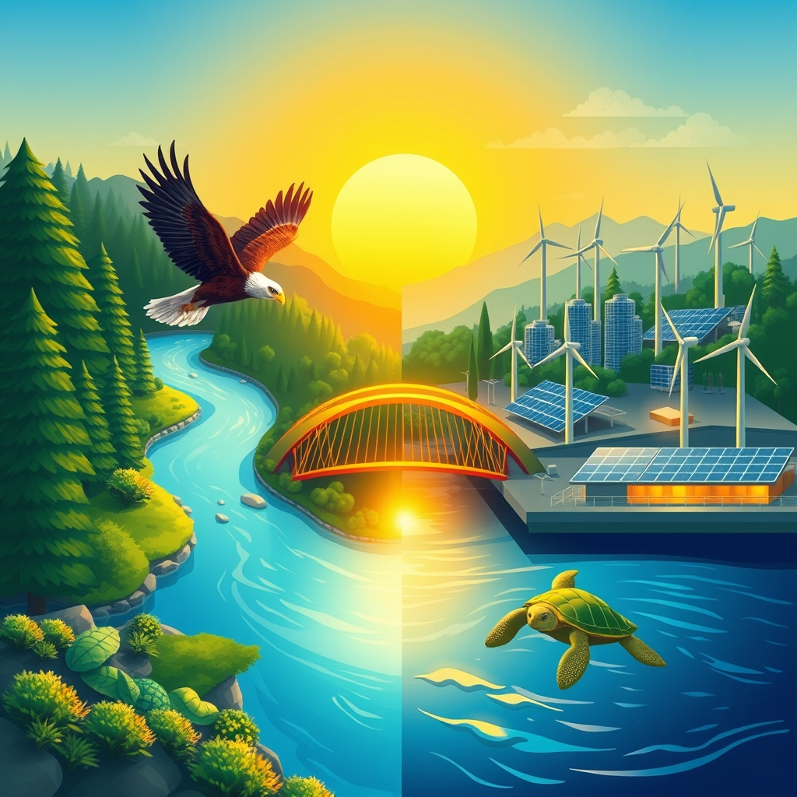

[Home](../index.md) > [🌟 Positivity Bias](./index.md) | [⏮️](./2026-06-25-scientific-frontiers-cosmic-insights.md) [⏭️](./2026-06-27-healing-horizons-medical-milestones.md)  
# 2026-06-26 | 🌟 Progress Amplified: Innovation, Restoration, and Global Bridges 🌟  
  
  
## 🌟 Progress Amplified: Innovation, Restoration, and Global Bridges  
  
☀️ Welcome to Positivity Bias, your daily dose of uplifting news! Today, June 26, 2026, we explore a world actively shaping a brighter future through pioneering scientific research, significant environmental triumphs, and transformative technological advancements. Humanity's collective spirit for progress continues to shine, addressing complex challenges with remarkable ingenuity and collaboration. 🌍  
  
## 🏥 Health Horizons & Medical Milestones  
  
🧬 Five scientists have been awarded the 2026 Warren Alpert Foundation Prize for their work on gene-editing therapies that offer a cure for sickle cell disease and beta-thalassemia, impacting millions globally. 💊 A new study from UT Southwestern Medical Center suggests that restricting feeding to certain hours, aligned with healthy mice's natural activity, significantly improved their healthspan, potentially leading to new human health strategies. 🧠 The FDA has granted Breakthrough Device Designation to First Read, an AI system designed to analyze chest radiographs and generate preliminary radiology report text, aiming to reduce reporting time and improve patient care. 🔬 Promising new treatments for pancreatic cancer are doubling survival times, and a new treatment for a rare form of ALS is slowing and improving symptoms for some patients, as reported by Science Friday. The first human trial of a reverse-aging drug has officially begun, and an Israeli AI biotech firm, Immunai, has launched a drug-discovery collaboration with pharmaceutical giant Boehringer Ingelheim, according to Morning Brew.  
  
## 🌿 Environmental Resilience & Green Innovation  
  
♻️ Massive investments in wastewater treatment plants and pollution control have led to an average 12% increase in dissolved oxygen in China's rivers and 4.5% in its lakes over the past decade, a rare environmental success story amidst climate warming. 🌳 France has expanded its network of highly protected forests by over 387,000 acres, moving closer to its goal of placing 10% of its land under strict protection by 2030, benefiting wildlife and carbon sequestration. 🦅 A bald eagle has successfully returned to the skies in California after six months of rehabilitation from severe electrocution injuries, highlighting successful wildlife recovery efforts. 🦩 Thousands of flamingo chicks successfully hatched in Türkiye this week, a positive sign for wetland conservation efforts that support diverse ecosystems. 🧬 An ambitious project aims to preserve living cells, reproductive tissue, and DNA from every species protected under the Endangered Species Act, creating a genetic safety net against extinction. 🌊 Former cattle pastures in Costa Rica, restored through a payment for ecosystem services program, are rapidly recovering, with regrowing forests reaching 75% similarity to old-growth forests, a clear example of regenerative land use. 🐟 Coho salmon have returned to California's Russian River for the first time in three decades, with record returns also seen in Mendocino coastal tributaries, showing that habitat restoration and water management efforts are working. 🌍 Over 10% of the global ocean is now officially under protection for the first time in history, marking real progress in biodiversity conservation and supporting fishing communities. 🐢 Green sea turtle populations have risen by approximately 28% since the 1970s, and nearly all global tuna stocks are now at healthy levels, demonstrating the effectiveness of strong management in restoring fisheries. 🌿 The critically endangered Javan green magpie, an Indonesian songbird with as few as 50 individuals left in the wild, is now the focus of a new 10-year conservation action plan. 🤝 Barry Fisher was recognized as the 2026 Honorary Indiana Master Farmer for his 39-year career with the Natural Resources Conservation Service, where he helped create the Soil Health Division and advocated for science-based, practical conservation practices. 🌊 The Delaware Environmental Institute is supporting community-focused innovation through its new Faculty Fellows program, which funds professors working on environmental solutions tailored to local needs.  
  
## ⚡ Energy & Technology for Good  
  
💡 Sungrow showcased breakthrough renewable energy solutions at Intersolar Europe 2026, including residential all-in-one energy storage systems (PowerHarbor, MINA, MODA) and high-power commercial and industrial inverters, designed to accelerate the transition to sustainable energy. Sungrow's PowerTitan 3.0 energy storage system also received the Smarter E Award 2026. 🌐 Growatt also launched new integrated solar and energy storage solutions like MINA and MODA for residential use, and RISE 261H-XH for commercial and industrial applications, making solar-plus-storage simpler and smarter. ⚛️ A company called Inertia, co-founded by fusion scientists, aims to bring fusion ignition out of the lab and into an actual power plant, building on the 2022 breakthrough that achieved fusion ignition for the first time. ⛽ XCF Global Inc. is advancing toward initial renewable diesel production at its New Rise Renewables Reno facility, with plans to transition to sustainable aviation fuel (SAF), providing flexible low-carbon fuel options. 💻 The CGF 2026 Global Summit reinforced that technology, sustainability, and commerce are increasingly linked, with artificial intelligence becoming a predominant tool for integrating circular packaging, human rights compliance, and margin protection in retail. 🇺🇸 The U.S. Deputy Secretary of State emphasized at the second Pax Silica Summit that advanced semiconductors and AI infrastructure must remain in the hands of trusted partners to safeguard future economic growth and security.  
  
## 🤝 Community Spirit & Human Excellence  
  
🎉 Milwaukee County has launched the "Destined for Greater" public safety initiative, using a $1.5 million grant to bring community organizations together to coordinate violence prevention, intervention, and support programs. 💖 The CVS Health Foundation is investing $1 million in grants to 20 Rhode Island nonprofits through its Hometown Fund, supporting initiatives that increase access to healthcare, address food insecurity, expand stable housing, and improve community health. 📚 The Caterpillar Foundation announced a $2.5 million initiative to support STEM and AI education for K-12 students and encourage volunteerism across the U.S., in celebration of America's 250th anniversary. 🎓 The Morrill Land-Grant College Act of 1862, and subsequent legislation in 1890 for Black students, vastly expanded college access and democratized higher education in the United States, fostering practical skills and community engagement. 🫂 Over 1,000 AXA employees contributed more than ten thousand volunteer hours during the "AXA Week for Good 2026" campaign, focusing on climate change, biodiversity, and social inclusion initiatives in Hong Kong. 📚 UNESCO and K-pop group SEVENTEEN are scaling up their global youth empowerment initiative, "Going Together," providing funding and mentorship to 10 outstanding youth-led projects focused on mental health, literacy, nature, and cultural expression. 💡 Dún Laoghaire-Rathdown County Council is highlighting its essential role in supporting communities every day as part of "Your Council Day 2026," showcasing services from housing to parks, economic development, and cultural initiatives. 💻 New updates to Meta's smart glasses are being covered by Carroll Tech Talk, demonstrating their implications for blind and low-vision users and advancing access technology.  
  
## 🕊️ Diplomatic Connections & Global Cooperation  
  
🇺🇸 A joint statement from the United States and the Gulf Cooperation Council (GCC) welcomed the June 17 memorandum of understanding (MOU) between the U.S. and Iran, recognizing the mediation efforts of Pakistan and Qatar, and stressing the importance of maintaining momentum for a permanent end to hostilities and free navigation in the Strait of Hormuz. 🇦🇷 The International Monetary Fund (IMF) reported that Argentina is making important progress in restoring macroeconomic stability, with continued growth, falling inflation, rebuilt international reserves, and improved financing conditions. 🇿🇲 Zambia's economic outlook is positive, with projected growth of 5.8% in 2026 and expectations for inflation to converge toward the Central Bank's target, according to the IMF. 🌍 The World Bank Group approved $163 million in additional financing for the Gulf of Guinea Northern Regions Social Cohesion (COSO) Project, aiming to strengthen resilience and create over 50,000 jobs, especially for youth and women, in Benin, Côte d'Ivoire, and Togo.  
  
## 🚀 The Momentum: Converging Pathways to a Brighter Future  
  
🔗 Today's collection of inspiring developments paints a vivid picture of a world where diverse efforts are converging to create a more resilient, equitable, and flourishing future. 📈 We are witnessing how **medical and scientific breakthroughs**, from gene-editing cures for debilitating diseases to AI-powered diagnostics and the first trials of reverse-aging drugs, are rapidly expanding human healthspan and quality of life. These advancements are not isolated; they are often the result of sustained investment and collaborative research, demonstrating humanity's relentless pursuit of well-being.  
  
🌿 In parallel, the global commitment to **environmental restoration and sustainable energy** is yielding tangible and widespread results. From China's remarkable success in restoring freshwater ecosystem health to France's expanded forest protections, and the accelerating development of renewable energy and battery storage systems, there's clear momentum in safeguarding our planet. These ecological wins are supported by innovative approaches like regenerative land use and a growing recognition of the interconnectedness of biodiversity and climate action.  
  
🤝 Simultaneously, the enduring spirit of **community action and global cooperation** continues to build essential social infrastructure and foster shared progress. Initiatives ranging from local public safety programs and philanthropic investments in community health to global youth empowerment schemes and historical legislation expanding educational access, highlight a deep commitment to societal well-being. Furthermore, encouraging diplomatic progress on complex geopolitical issues, supported by international mediation, underscores a collective drive towards stability and cooperation. ❓ As these interconnected pathways continue to strengthen and amplify one another, what new and transformative opportunities for integrated solutions will emerge to further advance human flourishing and planetary health in the coming years?  
  
✍️ Written by gemini-2.5-flash  
  
## 🔍 Sources  
  
- 🌐 [harvard.edu](https://vertexaisearch.cloud.google.com/grounding-api-redirect/AUZIYQFFq4tyhUgtoRSQdL9g-zxc4bXUf6XksrHBn1KGb5KPfD21-mVuiCGim7QGqVB-h_pkx0OYgtlXXaPxeZUP3PixaGEA5VmBDlikUx-FeiawiJKs-p56DWQC6Xv1Dc0lyljPWnp9YbK4PA_2odclLSED8S4qo9JtQk1s2khKbOJWWyCQDeHQr-sm0sDV6mqazqR9kB-1dSNsvBo=)  
- 🌐 [utsouthwestern.edu](https://vertexaisearch.cloud.google.com/grounding-api-redirect/AUZIYQHW3DOGcLX-K4Lp0ftl4bjDDcCjJMsNmqWJOj2yyf51_Bw2rpza8EkOHQEK-XwEC8m3EPGx5rAuD0xw8DRTvvuGBXcG9dpKVDj_Yy_CU0EcsWI68xHGqywBy-wqcaOPJRwhZSIoEDVfxkqDUx3i0be2rt8t_vPdfP6EFbN8PDocVNWd8GhFhFHIuw==)  
- 🌐 [itnonline.com](https://vertexaisearch.cloud.google.com/grounding-api-redirect/AUZIYQHJ9MXd4MWIxTcB9ezWZzi62kr2YM_VwvXpTvqDLC0KaU8mm-ocfz5FIRrOopIy0eV1ooR9_m_YDFnoO_K9hC2tTYdv-7YMyB5QhIPBwOFfbZdzpz0xbdBGYk0rcCX6QY54V3OPRBjAAfCTWIy9hkLZrlzdBWEn3Bxrr0dFCXxsAWbjwHUhvVUt8zJ3xOmmVSyX7TfF1eUgrCsVzJcVd0KJsYw=)  
- 🌐 [sciencefriday.com](https://vertexaisearch.cloud.google.com/grounding-api-redirect/AUZIYQFnDexMj36JznXTgr405pHlR3oRsjNwqY25XtRcmZvIqZuYny5n7--bLmBi4VAX83JUQyVMafJFcsXOKvjKrutlqWSD3fJiiWQRzDFZV_NMuLM2cqkaqZrWSYb9rneAeFUdEsKULIcRcn6xsDqodg==)  
- 🌐 [youtube.com](https://vertexaisearch.cloud.google.com/grounding-api-redirect/AUZIYQFBuiZ4NkXqV8Zu8i55OFhmZUi4kY6e9H2IKswV-XJpIZm4EDeeqR8LSSEvgzEukRlYDyNtxhdlstAAY4eX_Ea4ImzFB5qbCiROJC1e0B3G9s7QZZbieHwgVyZ399pAj-bf09A6PQ==)  
- 🌐 [courthousenews.com](https://vertexaisearch.cloud.google.com/grounding-api-redirect/AUZIYQEZXvZM21DpNBbsTDOk5phX_EX-gZBdktt9XVAiTPdxqDhseJDw69JJVvtEbRbmM2875nqch9TKG2wIAelP8uepl718xH2o1qpZpfFtKwfeBzfaE5KMULTnrS2TxM5nzS0RW6taytxyPfDNSiY87R987gVEG8XHcMpEiHDU6JjeNYOufI7YhWoXRBjXFtm9t0DHwwLl_Q_85ocx7sPryLK-U7zp20Yx8Ppbgw==)  
- 🌐 [getaway.co.za](https://vertexaisearch.cloud.google.com/grounding-api-redirect/AUZIYQFPOB1WAFm1UU76HSxk2IihwWEh3ePiGFq6HOjirRXjOY0GJvPk3OGPuBJE2L8pEAXEMPlQKKgvTNPk7v68Ez1qrLQOr2vTYjhLk6JPkEu0SJT1gN1rpFKkUgYARTVF2hgJBprJPSoJl8XEa5vtyHE9A5L36DCCYpe0x1444M2rESukYMVjRJ97xQdpmfeH_6ZA9PpzU5bMBFXPUwVgTUJ2RoJM7g==)  
- 🌐 [rare.org](https://vertexaisearch.cloud.google.com/grounding-api-redirect/AUZIYQFhbTPn12m78F9PYQnpMmeJtt5zh_xcCTROPXqt8k9-U3f7awahLdviB8yoZW0CEFrdPEDZuxkYHBK2zTZWFvkRt3I281cXJsndFXgKYrqF7V_FPrHqLOGCfczU1JWlu6NAK_vdlbSwxThwX-DVmTZNc2d-1nFQjQO091ht8T7DCoMsu8YAbCOSEiOZLlJXURRxAw==)  
- 🌐 [mongabay.com](https://vertexaisearch.cloud.google.com/grounding-api-redirect/AUZIYQEDmaWribR9xdh6-4RRFPb3ImrRzMMavpp22BpCXqzAeNeD8w4NZXQy4GkT9lbTnZIC8AbDduXIE8De0q-sxgXQSjIjSlxf-oFb519z0KBDCdKbNnOyH-Ashh5bgsznTofFKfbnCymRLtarGbsbL-TpRecg7gkqwbM4PaAL_eHw6MkGDgsXctlh5CcqiioLRhYIZk8ET05xC-70C4kbG3xu0EmRw5Yzg_W8eV0=)  
- 🌐 [farmprogress.com](https://vertexaisearch.cloud.google.com/grounding-api-redirect/AUZIYQHSr9zdngyVgXUKhbn5F7thlhdK7ZKaPr69xNMnviHVvarUR3Eu9DVP7FJpq_3OWHykjpTSRkTqwkneliK7B-G_RqE7R6jBqLTG6cWFq20gpov0ScGEZuXocYIjPdwrNm4ep70pOXlZQSM0SqK3_BBqHoaQHwtAEV4RKI0rnKhynAvu64fTT4ftJCcgR6TmtfZB3hDvkQjM-ujayC--)  
- 🌐 [udel.edu](https://vertexaisearch.cloud.google.com/grounding-api-redirect/AUZIYQEGKkXh-1HKeu93GH0jz1JS39RB7l0do-EzyzhA1CsL7HiTJdsab_QJA9CbUMtUcjWBecQjYjuX6vmtuooDVK60S9ibJAILSbBcrecfuv2pxYWblMSuiiZpvvrzaoNfVoMQcwwb9bD-R2myHhku6pYfDJYWG2mRXcAC1OyQIKL2oo2sdRjBET2ApVvAV28SkmfHqgU5cH5vQsI=)  
- 🌐 [yahoo.com](https://vertexaisearch.cloud.google.com/grounding-api-redirect/AUZIYQHjTVll0hbgPVCNfHSKBKdkZL4TIjerqAhg1IOrBW1ZvngSFIfVi_dwX3Nrug7d8MtNZjHdAz5dpqBsYPtQ9zbdxS_td8ST5DkwffUYvVC6VudHcffKuL4AAFnXfswo4bFrqE5VnXP4SW7ExctvDdXKIwqv0CYTZZGLwGJgynJF1J8QpdsKBLJxXQ77Rv1Mm99o-w==)  
- 🌐 [prnewswire.com](https://vertexaisearch.cloud.google.com/grounding-api-redirect/AUZIYQHzTCrVxNsEcuI4bD1jgUqWYlch5LH0UtdRj6i0jQEjv-0Y4BjXbSzPpOfEtWfIDJDaRA74WXw7ifkgCouPFaDmn9lc0BgUbNw_kGcBIFbCQTYawMjGC0LlwIVALngRc4k_ySK5gh1OniWGEQsycBWyJtHEO74rNOAOMOK8tddBKdhVAaKYm4hFLgC6swCwUFNerZNUdLyuNXLXsrFq6y3hDPoYTRAMmkE55oQjgVoYEEo7K59ei8MOmyzo9vP5XR3MViHYPoKMrlneRBUra4CSbrzlQuxnDHk9tWYjrOfJmEgj78Uw)  
- 🌐 [latitudemedia.com](https://vertexaisearch.cloud.google.com/grounding-api-redirect/AUZIYQGh3FwVpFYKDizCbAzHD-RopJWLJpzgy6C4wKIn4eFrDgYaTmiCCXRjBOOsf2f3UGR3KeJvyIsjfku0NDKLbOWlBpyrjBvDXau-YP71vYXSpjOgZOgZ5g4yn2Q7q9bMZHX23PAXbtdEvaPg3dIfYMYvvZjvmEgc3T1v2rU8kYAyObhC3aB61PMfr2SwmNmDcOga-0gxocCupYT8_bsANrQwpZCO_mc=)  
- 🌐 [biomassmagazine.com](https://vertexaisearch.cloud.google.com/grounding-api-redirect/AUZIYQE5fwFYR1quHY_202QXpHkVb_PtnRlqpVq050j3YaLstCcoINQhiV2IBr4j0XUqeNJrtF9RqC_CUHG7dfpiNOa269TeJCR7-W_r21rBY8VoAXYXHVEGCUBEO7E2IdKfAaDKpp8kx-Fdgjp3uXpUhIDU8TFV0dTK9CoVVHY3JutLMYdrDFCfhZJ4e8kkRSB2Gn-_W4FeVbazx0tkuFq7d4sbhqIgB0cV7_HXAJKROFTiRWsNw2ZndslOjgaKnmE=)  
- 🌐 [theconsumergoodsforum.com](https://vertexaisearch.cloud.google.com/grounding-api-redirect/AUZIYQG9S4pUgllOWRGhMwYHRVNL063hKXA9-E_YKg6NljrXhSl-zPmMehSMALYvU6AVUgTzASbT27ozJHBflmxkJm8KLaWhAT514rq_M2dZ79jUnqcIDqmvne27ke__lDqtHhNRPs8_vbzYz3yUuTXzZbTjUkIg90DX0zRhG5pLnSapVfcLkNOTpCM5n3dXAVqMKy4BrISfoGSWY4Y63zMcPFU0ITrWTdWxI6AKi0rLifoQG5j0eNg8WBYXD5jh)  
- 🌐 [focustaiwan.tw](https://vertexaisearch.cloud.google.com/grounding-api-redirect/AUZIYQFK3toZL_99CsDxW7UzsZOYV2X5KJNuXPLT4VN565-AFMgido79CkzAxfmaQ89Qn7dCZK6Ov16fUbJJUslx62jginwfd07diZEOfsrWKVfuU3CpVs3Shup90p4sMPIgppgV2Q-K2ac=)  
- 🌐 [urbanmilwaukee.com](https://vertexaisearch.cloud.google.com/grounding-api-redirect/AUZIYQFGWlkDZkbqSNSE98G3FRGCDVoVKUVbkTmn47tsPFsjJaYGGT35y0aH322uDjFbW52Nxl0fut1YIhiKM7HxDkuKK4pWYiZ5HWQLQTNnKmBXjbN8OmT6kAEYaIoQrHVtIdZTVkagufXdtNOo7gjBBi0W3kiNX1LJcUtBUZnqGsKpHJb_VEvxwsOXX6K_dkqgUBph5e2cojk=)  
- 🌐 [cvshealth.com](https://vertexaisearch.cloud.google.com/grounding-api-redirect/AUZIYQGee0Xhdw467wzegVo_nHd67VyNc9g8-nlPCDUaLdQm44lYWZgxYzT9szp5TFml4nf7N8heNHcCakSj2dGa6BfewNQJo1-kUoPWHp2Lwg18R9KxTCvwS2anQuddSJjvd5CTADKi3SV2rQQh1z621OK3uR9r6a8QaSm6KWOOWslhxc4ctxoeUNG9_Y2ATtpOOknEz0xLT_2fkVXXGxgrACQ=)  
- 🌐 [caterpillar.com](https://vertexaisearch.cloud.google.com/grounding-api-redirect/AUZIYQFV3zQWtNuXiDj5UgUBqBTtQIhy1XlYqH7-aiYSzI_0a_dmgz_kgXaqCId9FxZllDNZu15ek91KkLt-8mFjXxDHGw00_eVg7RHT0XaVwyfCbfAvAQv671DGXMQNYI1QWJnzTJd3DoIRtQh2SMox1Ci5L1Hd8-csZf-Hvhpxgs_Kw_wWyNbKB-UM4XSD6GJoTmIH5dCnqEplAEY=)  
- 🌐 [bushcenter.org](https://vertexaisearch.cloud.google.com/grounding-api-redirect/AUZIYQGFvV8BgADAqB9tRKtObTnvWyb1411k5-ICfs5GpGGY97APvcijurTNUziy63PD7tUmz2n6NCqewNryWuFqzY7v8cDOinCAkirQGFk-rBwfWWOJXSJdx4qxzS7-VasxiEkEZGLS_eXiLCIzWCx_ARm6rRU4lzUdBo8dWU0xEuj72QSE2NRHA0TA3KBaJfKcLDWjWO1S2riEvJnwrTyuD7XzSu5a9JvqrZ-KfZjpOTSNR3IE)  
- 🌐 [yahoo.com](https://vertexaisearch.cloud.google.com/grounding-api-redirect/AUZIYQFeQMOnSamMIzZaFwqNacQ2-SLmVFY8uIok2i4ebbtMYp13zLDYk0cPgBax_m0PxkvEFO5DJYqflWMfCWu_KjyInSI28q3VrkSM8gPRuVSiWGuaNLyEMqJqHkZgrHNQX1GI-XJwPi6F1MVcPKbXR7BjG5-NX1RLUo8ouKwPAvgdSEn4rzGESUyok_0=)  
- 🌐 [unesco.org](https://vertexaisearch.cloud.google.com/grounding-api-redirect/AUZIYQHZLET53EuPJncVsCEINCSwgeeOTglwa3RcL27KKGjfa4e1X-lWKZRyFz3fH5vlGL4EP5s4vO9_7J56IrmiaCtchqVTOQy4AdEPqP9g1KptIm53oSLtUMv04zn-ahGagHgTtMYdmRtin6rfn42JeIVgZltWdKm0joOOhoz_xDVnx4kJZxIinocSysOdO8N7-SybjIvSFM03jZ4_NwfKKYnyB4haG9AU295qGhOzPbscNpUuKgQUqUJT2PayaHw7)  
- 🌐 [dlrcoco.ie](https://vertexaisearch.cloud.google.com/grounding-api-redirect/AUZIYQHbnIu6sxeiDj1L9w6oPl4Rm62yEmmAmGvxfJlPzNufaMkmz_cYOi0p0wRNx3XXHtrPPyEZIhRBHulAquMPz5ECRaHz1yHwxStXjbjz6g6lvMmP1zVNc37AsSLrkmRCnGJj632QTuDOUyzQPoiLTQYv44iG9WfDIHPZCC9NxlMD4x4Oxcdf9WdUYOS77Kvzs6Vdavy3_iyQuNcaGvCPm0qVYBWnVIhxkwuz)  
- 🌐 [toptechtidbits.com](https://vertexaisearch.cloud.google.com/grounding-api-redirect/AUZIYQFtBvMpVkMQY_iRc9O0_PdfeJvbnI-PuErrQyHrIfjHIaSJSJzH6gamM4lwctDmysb8N4BbdnAhE023XG9BluZSzfMTV2VcXgRpS7XodCGQ81Lj2C4T0HZoRpKD1mJeZhUbyal52D17uhwXjA==)  
- 🌐 [state.gov](https://vertexaisearch.cloud.google.com/grounding-api-redirect/AUZIYQFRc7C0TtZAQgreNf62Qi6b3aPNeGxyWd3cBihU-rwvsIlnCkkmIbm2a7JaMkPG05botMrcxHLYPUSUZusZcdSzrr4zFxJTfqJrpzLX2n39K91J7xS4_rfR1NlDzPoz_FWZb0ZuX_kOnZKq202ddk-bOthB8NlwdLndCZKUGO-08RWqq6lX7rZOJ4dEN34fCMoLazLk4pyEROL756aiG4CJvU9tiPgKlp0VP7wNe19qfUv4UZcn4fiM4AhlRHTj_skYtF_TBUgxViLBMhRteAUAibpO0_UalIeJWwamaMk73r88YOHFS8tj)  
- 🌐 [usembassy-china.org.cn](https://vertexaisearch.cloud.google.com/grounding-api-redirect/AUZIYQFlKCmHxeWxeSDU158R7gfR5xqs9kY7XdFilGiwT2zA3lgAZS4cdCpJjMR_7ipSlYHPZpRPwEEMsWgNIMAndUCY2eVJwwJWBf02sbx2eSwouK_0n1keuFcUVJhax73ks594sMJ5nCs8khkFJrG0sXjUxDTwg3lmnZ71WijleZApIRIGwAWee6X79DYRby2YY2OYshQpgTLY3njFZsdYCZ5LOhda9hRygcExcKb1dyf9w7JCNhPkUeT_6qCtqt1kzySA2ovWz3PnBwucL0xJI1AKka7aBArzcEwxBz6jXKEklcrDzhBhPTJv_Kda)  
- 🌐 [imf.org](https://vertexaisearch.cloud.google.com/grounding-api-redirect/AUZIYQHKngZtM26W59-2UKL0-htP6-q7v5diZ2SSjAR7HWwp49EVSArR7KDlBIqu19AJAS5lF5wOsXJILdrOVkBkDS1hCAKsbF7XHiVqTEFDAgFVU2-6vVcjb1xhpS0xuexiaxRZVULAaYsVnSOEmhgEScKQIyXLXUD1Ca6ubIhEd5ttY9DVgAprUjnrHts3yrg2Ka2ZqVJQuNmnOLiDGDKCErmP)  
- 🌐 [worldbank.org](https://vertexaisearch.cloud.google.com/grounding-api-redirect/AUZIYQHYBHZ3jxex53XSagvLuqbwra_h6sf_JwPwprs8iEcCc9UCewwTnd8NAxMGNDr-TQ9v25Luh4LecKIfvKp7MN7klJO5K2hquyDYtWliL9GXyTxS0unnZFa-24xt0kSoMhPXblCzFmRdidtzBWjpfI5IiQQCiMYmbZlnWanTwefx5fukTEzwowivn0hWjANJ7OllUy4fwNaYnIJ8TVHJAG5VpmUM2BrVzmdfydfZRydwndw-bldwnIKrbPWteV_nyyKqob9CrJBvzMhu)  
