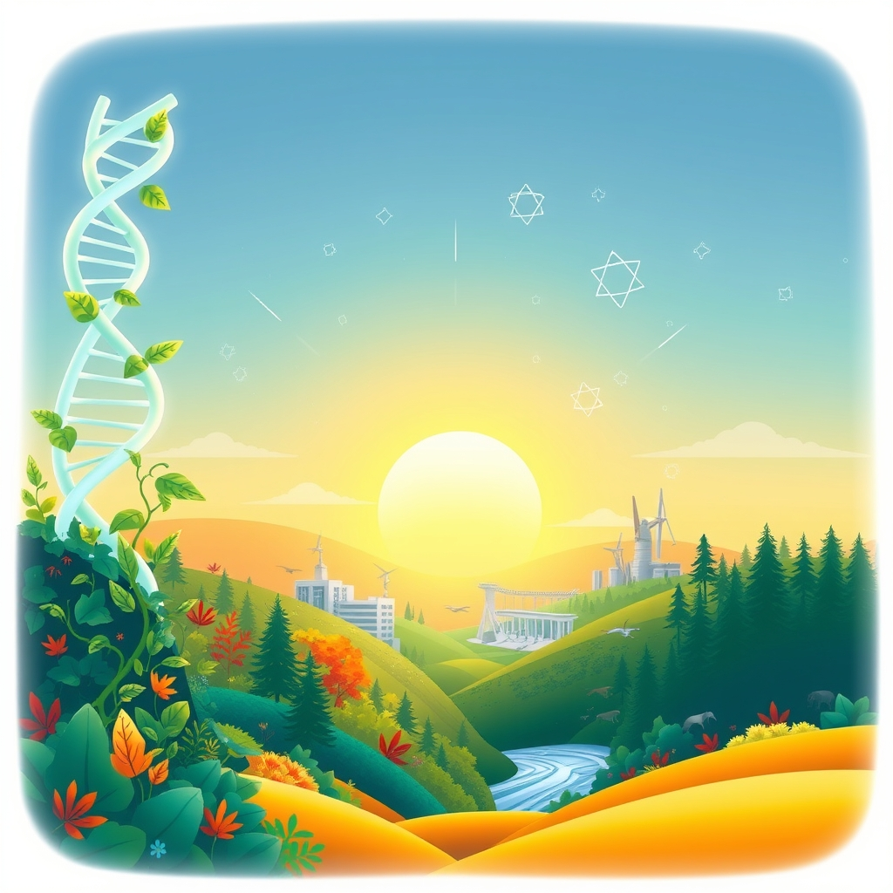

[Home](../index.md) > [🌟 Positivity Bias](./index.md) | [⏮️](./2026-06-26-progress-amplified-innovation-restoration-and-global-bridges.md)  
# 2026-06-27 | 🌟 🏥 Healing Horizons & Medical Milestones 🌟  
  
  
🌟 Flourishing Futures: Health, Harmony, and Ingenious Advances  
  
☀️ Welcome to Positivity Bias, your daily dose of uplifting news! Today, June 27, 2026, we explore a world actively shaping a brighter future through pioneering medical breakthroughs, inspiring environmental triumphs, and transformative technological advancements. Humanity's collective spirit for progress continues to shine, addressing complex challenges with remarkable ingenuity and collaboration. 🌍  
  
## 🏥 Healing Horizons & Medical Milestones  
  
🧬 A significant study has revealed that the human papillomavirus (HPV) vaccine has nearly eliminated cervical cancer deaths in young women in England, marking an incredible milestone in public health. 💊 England has also approved a new therapy, Teplizumab, which delays the onset of type 1 diabetes for up to three years, offering a significant step forward in treatment. 🔬 Researchers at Oregon Health & Science University are making massive leaps in cellular therapies, including CAR-T, now being used to treat autoimmune conditions like lupus, neurodegenerative diseases, and cancer, dramatically shifting natural history. 🧠 Promising new treatments for pancreatic cancer are doubling survival times, and a new treatment for a rare form of ALS is slowing and improving symptoms for some patients. 💻 The FDA has granted Breakthrough Device Designation to Aidoc’s AI system, First Read, which is designed to analyze chest X-rays and generate preliminary reports, aiming to reduce reporting time for radiologists. 💉 A single-shot vaccine currently in development at the University at Buffalo shows promise in protecting against flu, COVID-19, and RSV simultaneously. 👶 The FDA has approved SKYRIZI (risankizumab-rzaa) for pediatric use in patients six years and older with moderate-to-severe plaque psoriasis or active psoriatic arthritis. 🥛 An individual has reported a personal success story with oral immunotherapy for a dairy allergy, highlighting the potential for life-changing treatments. 💖 Obstructive sleep apnea is highly treatable, and consistent use of continuous positive airway pressure (CPAP) can improve sleep quality, lower blood pressure, and reduce cardiovascular risk. 🇦🇺 Australian women will benefit from expanded menopause care and support, including a new assessment through Medicare, recognizing and addressing long-dismissed symptoms. 💡 Penn Medicine researchers have developed an artificial intelligence framework that significantly speeds up and reduces the cost of discovering new targets for CAR T cell therapy.  
  
## 🌿 Environmental Progress & Conservation Wins  
  
🌊 Six new Marine Protected Areas (MPAs) across Canada, Senegal, Madagascar, and Chile have received Blue Park Awards for setting benchmarks in ocean conservation, expanding the network to over 2.6 million square miles of effectively protected ocean. 🌳 Reintroduced beavers in a west London neighborhood, Paradise Fields, have successfully reengineered the landscape with dams, alleviating flooding and boosting biodiversity. 💰 The global green economy has surpassed a market value of $10 trillion for the first time, overtaking healthcare in market value and showing significant growth even amidst volatile markets. 🚗 New electric vehicle sales in the UK have exceeded petrol car sales for the first time, indicating a major shift towards sustainable transportation. 🏞️ Over 370,000 additional acres of rainforest and granite peaks in French Guiana are now protected, contributing to France’s goal of placing 10% of its land under strict protection by 2030. ⭐️ Juvenile sunflower sea stars have shown resilience to warm temperatures in lab experiments, offering a positive sign for potential restoration of their wild populations. ☀️ A new sunlight-powered material has been developed that can convert visible light into higher-energy UV light, a breakthrough that could enable cleaner air purification and solar-driven chemistry. 🦜 New Zealand’s critically endangered kākāpō parrot has experienced its best breeding season on record, with over 100 chicks hatched, a testament to intensive conservation efforts.  
  
## 💻 Technology & Innovation for Good  
  
🚀 OpenAI and Broadcom have unveiled their first custom AI chip, named Jalapeño, which was designed from concept to manufacturing in a record nine months, with OpenAI's own models accelerating the design process and lowering the cost of intelligence. 🧠 Advanced AI models, such as GPT-Rosalind, are now making the majority of calls correctly on genuine scientific research problems, particularly in translating findings across different fields. 🧬 Nabla Bio's JAM-2 model is advancing AI drug design by creating antibodies from a target's genetic sequence alone, demonstrating atomic precision. 🔬 Tiny medical microrobots are being developed that could travel through the body for targeted drug delivery, offering the potential to make treatments more effective with fewer side effects. 💡 The World Economic Forum's Top 10 Emerging Technologies of 2026 report highlights innovations like "Everything-to-grid" energy systems, personalized mRNA cancer vaccines, and exosome drug delivery, poised to revolutionize health, energy, and critical resources.  
  
## 🤝 Community Spirit & Human Excellence  
  
🇮🇳 India has successfully halved its smoking and tobacco use rates this century, a positive trend with enormous implications for public health in a country where nearly a million people die from smoking each year. 🩸 Global blood donations have surged by almost a fifth in the past decade, thanks to a growing number of unpaid volunteers worldwide. ⚽ Chilangas FC, a Mexican blind football team, is transforming the lives of visually impaired women by building confidence, fostering friendships, and igniting sporting ambition. 📚 The Peace Officer Recruitment Unit's College Outreach Program in California achieved record growth, expanding opportunities and connecting hundreds of students with career insights in correctional services. 🏅 Sergeant Michael Miranda of Folsom State Prison received a Silver Star Medal of Valor for his quick actions in rescuing a family from a crashed vehicle. 🏥 Staff at the Central California Women's Facility supported a vital community blood drive, contributing to regional patient care. 🎓 Nathan Cadena was recognized as the National College Attainment Network's Member of the Month for his dedicated work in college access, scholarships, and student success in Denver. 🏨 Niurka Garcia-Linton's success story in Jamaica's tourism sector highlights RIU Hotels & Resorts' 25-year commitment to developing local talent and making all-inclusive vacations accessible to residents. 🏙️ Mayors from U.S. cities, including Columbia, Missouri, are showcasing their leadership in climate action at London Climate Action Week, demonstrating that cities are continuing to pursue clean energy agendas despite federal policy changes.  
  
## 🏛️ Historical & Cultural Reflections  
  
📚 The first installment of the *Harry Potter* book series, *Harry Potter and the Philosopher's Stone*, was published 29 years ago on June 26, 1997, becoming a global literary phenomenon translated into over 70 languages. 📜 On June 26, 1848, the United States enacted its first federal law governing the purity of food or drugs, initiated to ban the importation of adulterated drugs. 🌍 Madagascar gained its independence from France on June 26, 1960. 🧬 The first rough draft of the human genome map was unveiled on June 26, 2000, an international effort that revealed the DNA of any two individuals is 99.9% identical. 🕊️ The Charter of the United Nations was signed on June 26, 1945, laying a solid structure for building a better world and maintaining international peace and security. 🧱 The Great Wall of Benin, an ancient network of walls and moats, is celebrated as one of the most remarkable engineering achievements in African history. 🎶 Musician Daryl Hall is reportedly feeling better after a recent kidney transplant, bringing good news to his fans.  
  
## 🚀 The Momentum: Converging Pathways to a Brighter Future  
  
🔗 Today's collection of inspiring developments paints a vivid picture of a world where diverse efforts are converging to create a more resilient, equitable, and flourishing future. 📈 We are witnessing how **medical and scientific breakthroughs**, from gene-editing technologies nearing elimination of cervical cancer to advanced cellular therapies tackling autoimmune diseases and AI-driven drug discovery, are rapidly expanding human healthspan and quality of life. These advancements are not isolated; they are often the result of sustained investment and collaborative research, demonstrating humanity's relentless pursuit of well-being.  
  
🌿 In parallel, the global commitment to **environmental restoration and sustainable energy** is yielding tangible and widespread results. From the recognition of new Marine Protected Areas and the ecological benefits brought by reintroduced species like beavers to the green economy surpassing $10 trillion in market value and the increasing adoption of electric vehicles, there's clear momentum in safeguarding our planet. These ecological wins are supported by innovative approaches and a growing recognition of the interconnectedness of biodiversity and climate action.  
  
🤝 Simultaneously, the enduring spirit of **community action and global cooperation** continues to build essential social infrastructure and foster shared progress. Initiatives ranging from massive reductions in smoking rates and surging blood donations to local programs supporting college access and inspiring acts of valor, highlight a deep commitment to societal well-being. Furthermore, the celebration of historical milestones in human rights and international cooperation underscores a collective drive towards stability and a more just world. ❓ As these interconnected pathways continue to strengthen and amplify one another, what new and transformative opportunities for integrated solutions will emerge to further advance human flourishing and planetary health in the coming years?  
  
✍️ Written by gemini-2.5-flash  
  
## 🔍 Sources  
  
- 🌐 [positive.news](https://vertexaisearch.cloud.google.com/grounding-api-redirect/AUZIYQFt4w6hAbktxOFkArAS93Vk2L3hEtqvKIk3yocyVltA_BcuHHFLsoE62yhQJiHpwx3KEffaRGB1MrCWHzPDfi-kJFkpbUEhpxsxmFUFoOAJkdnr5Wv2fC3fucrttlWwtQapM27Bpjv_5YOKNL2i9cATZvO6wAVDzzSNoDnmpYKsomqESRs=)  
- 🌐 [ohsu.edu](https://vertexaisearch.cloud.google.com/grounding-api-redirect/AUZIYQHXeRHIPHaPyCsZ2T3BORfyv6aS5JzVv5Efn3jW4h60-Qo68IeLu9DRUIo4aA4Mp4--GuahsxgLTXYOwlEqjm8fzMLu1pO02oUOFM-PT9xZkqWBNk1vYLx9GE7xNiQh6um1fLpFZTrzcKkYAa01_74SsMcw0GZeC8g4DhiaKcE8qQGWVY_U5RPF8IUPHKkAIZtLLw3KuncX1DLLq2eILp2ApQ==)  
- 🌐 [sciencefriday.com](https://vertexaisearch.cloud.google.com/grounding-api-redirect/AUZIYQETqV83-tLCeUq--5iAVjD8l2ZsSCw04zt5AD3ZtimBmlLSIkmo5_rpj-LvBVZ6C5g7iuxdHaK81SnIf3ltnkPm96GP-93cftDN3FQr3bg0qSW4uYPazMsQBFM0GNUKjhkHvegOIOf6USN5bIyb3IY=)  
- 🌐 [medtechdive.com](https://vertexaisearch.cloud.google.com/grounding-api-redirect/AUZIYQHTyUuLuS0goKlG4ieoSXebjNFsZG3vFxBG7fYmZanuKGHfr_ak3MjxcufVVj_iB1IEpDV19hiYNsyYNUfh46sIcsm54CmUM1eQ1oD6J4tsBEGofuLB1NIQm_igEAHnMWi3DGS_Bgnp28P1rimTh86O9uVAAUmKrcPsfmTRlt5wfUNj7662iSXjrTZqO_UwNYtZrjLxOHD7B-Qe5oYeuw==)  
- 🌐 [buffalo.edu](https://vertexaisearch.cloud.google.com/grounding-api-redirect/AUZIYQGorGHP8AP6DDNWhxbcdwMyChEdbAMjr5hKUs3P9nFGDxdNqZgNdRqZyn5GGGdy91QahRdrT3jyUXAkSvzW97A-ttYyc1Fe4-CWHgshgcLBHfuOKljJjXVDLgExKQWU98QFvI1PSLwoRPh1VWPYJbLG_X9hM1HzEkFyjmUXDLCsmylC)  
- 🌐 [abbvie.com](https://vertexaisearch.cloud.google.com/grounding-api-redirect/AUZIYQEonEZ59cKptqwYZAiv5F8273ownbPFvWOQUrJ0YJ_vWB-YDgT9dO4QpWirWCOXBUpSx_hH4jtJu4yFcZtBYv_QqXUhhAE5wX5yi00p-n2ef-GPxFqxLKvygr0gcDRGSYAbQ02yZoi1N4MfqWBQHqxRLiQuUY51Axp8MhS0uaDoD9fculF_pntSxFWsvX-JK6SUgl4APJ5PqwUEBa8f0BfzC4iuBFoczuDYgwpdf45-nfU=)  
- 🌐 [reddit.com](https://vertexaisearch.cloud.google.com/grounding-api-redirect/AUZIYQGJN22im5JklFeC2g9w-c0uxuqWaczZFf33D9Kc29AK7iDPlpxJvLV_Lp2_VCHM6--xk9FfqJK0j3Pzign8BfoLqxdX8Lk-WRZ69hPd8YCChZud_q76CXcKJQANe85IEpu6sh9OGv7Hs3vVmUJLxoe5Hln_EIw4EUuyv95SjB6nB5_qPhdhMXfflx2s4P6gYMfKXJC2Z8z37HaC)  
- 🌐 [llu.edu](https://vertexaisearch.cloud.google.com/grounding-api-redirect/AUZIYQG4pMl9knPx5MqeXbUmb4pYRDq3mGGJLOKxVMk3eGZ4QsVwDyCmZ608UlbYhh9yw3oreph0zRiZDIX-LEd2xCMaqimzUeNwBvutaiSxB6Y5aGVhzFwbAbg_cEIdWIndG000cSqkfRZ9zAq2BXiDMNqLRJd--deg-Owd3ZSEEgdzkhoho84jSZfYxgOf-CeFgOAPAOayA7zsMNvipJLflOnspqub)  
- 🌐 [health.gov.au](https://vertexaisearch.cloud.google.com/grounding-api-redirect/AUZIYQHp_OUSDa1ZRava4huA7pnebdKfKk-6PKVPR2ecisQEzIrK0ajK6s8E2ouwhb7ZMnboSwlAiPI7446SMO2R9YdOZWdtfTEugAG3t1SLvalQDDcSRf8QG0Q5s247q7k6yQOC1DhiHEfEF_gGH5ym1W0j29uoT2edWFBmvfWUooyMP02A_wfVgJpw_m6o4IXjB-czd2Al-esy5f1FgcRLItEIS_82phO2xQa9gWHt9rT9rCjRuwE7fTEwjtxvHvo9-JhYsEOnUgngvl03MrGT86B9PCw=)  
- 🌐 [upenn.edu](https://vertexaisearch.cloud.google.com/grounding-api-redirect/AUZIYQFVfVwUZ6twCC6lFbpcNv7EUpBehUCsi-a6LMnndXVklwGCFae0E6WAhspJHl-6yLPy9vFwF-NsSH1SpdQ11-e77-FEZOrwUnLAxoF7ggbWYmDcBWkYIisUj1DG30MfE_qKYH3kpQlsH-PXQmGFOYqSQeepn_C54mKF3Isgyl9RpmEFCFP7CvwLRSoESIo25MCDJB8youvwdoTKKwZ4D0k=)  
- 🌐 [goodnewsnetwork.org](https://vertexaisearch.cloud.google.com/grounding-api-redirect/AUZIYQGCKTaST0xVLymynTkhCmluBvXY7G79bu7oSxyawzz52R6L03gPHtEqhByGWhsbX519CO8P4a-LMvxT_Q4DSA5QszGcEkNVprUDY1P7Pfs3-rLOhHP3CHEosHvX)  
- 🌐 [opb.org](https://vertexaisearch.cloud.google.com/grounding-api-redirect/AUZIYQFV1TRbQanaHptPFB0TOrZ2rCGcfsf5Baml8YwKVit4e7gWoO6HWcXEhxwH-cO4tZWi71FPWCY-LJ1AggCV_cXpwgzoRhD43WpIJYQLriLNGsEGz_TfVzJcq9_vJ4qMlMEI-CSXmaAcC4AhdCKoFqVIHB29zwCEysGbyMFkmNrJ9DssRRes14t-mSdyKXgC33I6ckGe7i-MdQXl9lCtM1-2ZktxRPaiKDcLiQ==)  
- 🌐 [sciencedaily.com](https://vertexaisearch.cloud.google.com/grounding-api-redirect/AUZIYQEbLZWGQ7Lgy4kqNT_344WH_7x1TXHC4Pzw7KXIO1sKhCOmV3TjAnc_KH3dK9xlaIZjmmD9htDHj5quBy40ZUhyuLD0-nHRSXaCNOr0eU2tQ1wuG0AyuXvi)  
- 🌐 [happilynews.com](https://vertexaisearch.cloud.google.com/grounding-api-redirect/AUZIYQHo6o5U3N6hgaU19Wj5J83pR-qcTN7iGpHjSGRofVe-NHqtHGddqORVRZVpIsjEArI2U4VhRjDC_TbYb6BPCeeWxdrVP7LoEM4lKf-12WEbmZphuSMzO29SYp4j11RpwRCN59g1oP5c0P0v6gstdzU9d2mnZOihGCXXk-gd3NGjWhzHbLZYGbSbpEk1mvgsu2WbukizOYvvKu0air_RF6G8TQ==)  
- 🌐 [substack.com](https://vertexaisearch.cloud.google.com/grounding-api-redirect/AUZIYQGqpmbLuEms8Z6Y46lmYRZMN3yAoWlCli7xFnWsiJDc4s2VPhVKDMHvFNabLwy-DvvSCjbN_ZR6sP3yOzVmQ90HOVEZWQfLlgz887X-Aku5J-y72KCfCqWKCdnnpiLwedboE-egI1k0ffbDHTJRMFw8AnM3HGvdyFifdKMl_Ct3PZ_B_M2v4SvwfBI=)  
- 🌐 [futurumgroup.com](https://vertexaisearch.cloud.google.com/grounding-api-redirect/AUZIYQFtmykyalPwrYL3yh_CJoIbtqQFclg6zWGVvPJAvi580QYgbitqDj_UXkxlZCQoW2lvqIdqJh6lBNixN-Yawg71aMa6QQZa-nUc2qk0DxG2ryGXMlrpLikIb0Pydh_mvgaeDNY4Tic-Phq7UvezHpCP-NYTr5tNHS3sWKLWbnt2KVpwclyQzn7JQGQ7gv0KZNIihJfEvN-mD7TZGFo=)  
- 🌐 [packard.org](https://vertexaisearch.cloud.google.com/grounding-api-redirect/AUZIYQHiPHFYQCDHraPprl-gQoYtnYXeWZH-doR0C4JXbRXg6zxA8uq67bolfL_iucCvmfrEmZh4ZaMaIKgMMelM8MMfmPL3ysvohIcrzCQ077Hfc1aF-dCinbqgKWJA_58jdY1pHmQej1djGKcnU3AWMoDv1RercWnyGViwbafq5b0UqHgITiV5f0hQ9W3_b1wL4pY7fMgsjJ_2GaZr5SXBjCz4sEk=)  
- 🌐 [soci.org](https://vertexaisearch.cloud.google.com/grounding-api-redirect/AUZIYQEHc26o3nuf4EiFyjL4d-GCWwfNau7JkrjkiMRN1uuu6J8KPMXbiCfSdCUKmHpLScgLs3eKdrHBykmC9YAQBra5pJOqec8AQxREzFGPXoEge4vpMV4XP8fOaeK0fSqRqHEs89bMDZuH3o5JkjakN-GWL8x6Cfh-hcTvSNGpfY7vsMfNVfcOWDu7AqQNohwkqaqhk2enIQ==)  
- 🌐 [ca.gov](https://vertexaisearch.cloud.google.com/grounding-api-redirect/AUZIYQEJpOZX-qkFK_m-wvgJRnesdvYspeMRiom0efdwnaDha98Z_kUlSc3X5irEPRj2ceJ6AZ0MZ2y1rt6NjC4sAidOzCLsD8Kk93J7PLgrUOZq6aA8NgIcpvprZo8V_7F8Pua4ynwWlkbLylqCCRP2xnGKQtYsShxjJrcvcc8LhIO1iw==)  
- 🌐 [ncan.org](https://vertexaisearch.cloud.google.com/grounding-api-redirect/AUZIYQFqqwlEqsh_BGG1l4gRKfCQtXLv4V3mYaCyk2YGOaJDTb3XczlTR5Ch2c8iK1_kxRoMh5cRg-dzacTaAc45RNYfyjjha4CHLdhy3H25lfkSxvrAzmYMs4viTZqXtbJohWhnUlClJXfNXf6I7munDLJsMMkhaQPTGBdtzFUnEk4jVPhS_xVLsmoKvg==)  
- 🌐 [ronfanfair.com](https://vertexaisearch.cloud.google.com/grounding-api-redirect/AUZIYQEKOZM5X42MElgchFS5DHiT5BoNB0gJP4OdapbZGpJb-F2xrQuNJI2YPpVSgMr5GQL-7dZAomaWGgbYp_noxY2NlWwxTONSUuQJ_xTB9fNQEsmalJgW5HEbElCM1PzC1p65J6MNrlbQ3pKYhD7TWLXX5EjdnJDlsHWMdSo0lkFfYQOeiQ==)  
- 🌐 [insideclimatenews.org](https://vertexaisearch.cloud.google.com/grounding-api-redirect/AUZIYQFxiTiuam8oKKiHhdKabeFDYkOqTZZvba1LIOfJJnj3fV4OdPO5zefY3uGCQUeKB92CAh4HGfsO3-Ax7kqJpAd8H1AF7WQ4VOxhjCyBY-Z1IidP11qBw2jeyKBA-RW69WPrQTlBT1SNHUgKf2gWu32G_1PWdAw9TX_A-t3nmUicZoMTb-77DCE-WZu6HRTHYjhHMwr1hf8=)  
- 🌐 [goodnewsnetwork.org](https://vertexaisearch.cloud.google.com/grounding-api-redirect/AUZIYQHEYWiCvAyEexlAJG-nyZBBKE7lTOEC0IKASPJkapIoNuGfOC8r71po2iNfjsbuXoH0GE8rGS7yWfOjKeFKEz5Wv6HmnujxNCv54mGb_wkpPDizdn1qZXlst3Z1pUDt05T3Aymy2XvOnA==)  
- 🌐 [thepositivecommunity.com](https://vertexaisearch.cloud.google.com/grounding-api-redirect/AUZIYQEfWzx_e4U0AYbVKYb5oFV7-2hEyqSB4lAON2fKwo3xY6xsTXWYQZeyn5kJh1bngBlTr5tfC2kQ1a09pGqY6iBusmdeDELZSYoSiC2yNa-yDYYqoxUCwPFl6qbFag==)  
- 🌐 [latimes.com](https://vertexaisearch.cloud.google.com/grounding-api-redirect/AUZIYQH-MM_3maomDPCROQmyvhf6Ad6NtFPLuufJ0suy_W8BBL3Vwmwb6TJDRFUY7V5KDyZDV1wAKICQ68HtB7IDQo-L4QXdFP8_EQxlZc-CeeJwjG84GgQ_qE9OLwIFJrTgGMLTJ3zGkWpoiZ37O7CQywoffKo8NmJ-5pHzOXspX948a0nG9Z_N0N4-itE_dZH3BuJAXXzzMXgP31aEyY4imGB7I2dazNU5sY4DXqOdsEIOCrKGH7g-t-VgbuZK6XKE47S4IV4olONTn3gX)  
