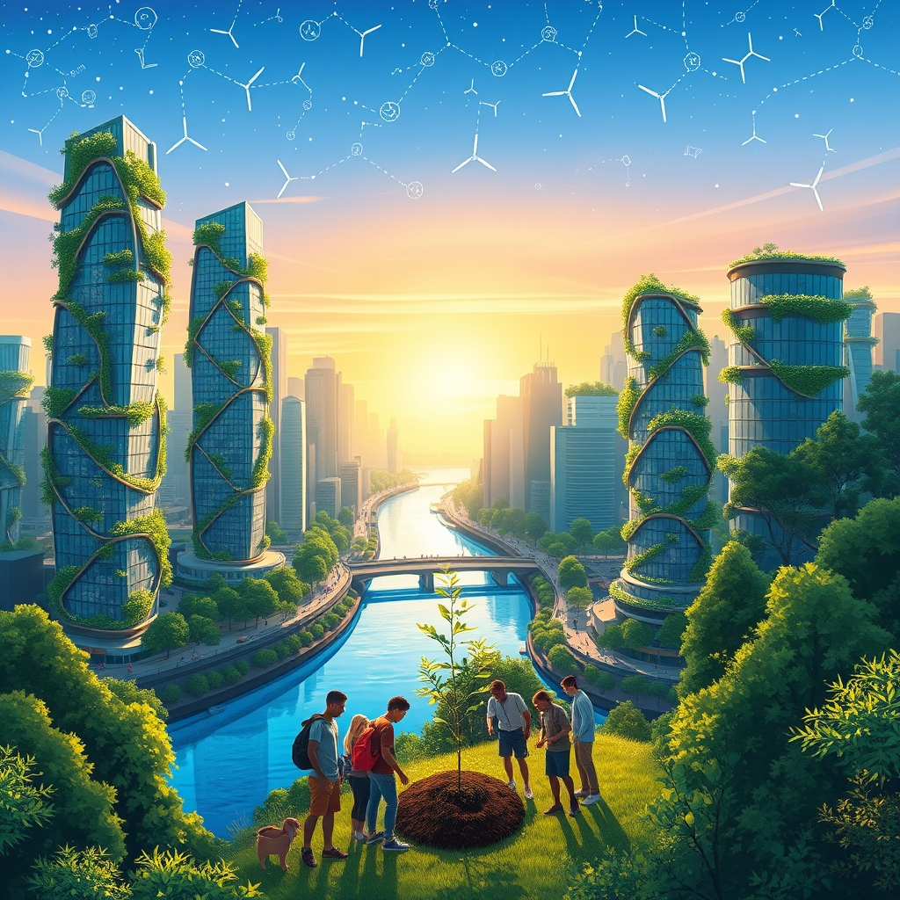

[Home](../index.md) > [🌟 Positivity Bias](./index.md) | [⏮️](./2026-06-27-healing-horizons-medical-milestones.md)  
# 2026-06-28 | 🌟 🌿 Environmental Triumphs & Green Innovation 🌟  
  
  
🌟 Bridging Horizons: Health, Climate, and Collaborative Spirit  
  
☀️ Welcome to Positivity Bias, your Sunday dose of uplifting news! Today, June 28, 2026, we illuminate a world actively shaping a brighter future through a remarkable surge in scientific and technological innovation, persistent diplomatic efforts, and profound strides in environmental stewardship. Humanity's collective spirit for progress continues to shine, addressing complex challenges with ingenuity, collaboration, and a deep commitment to global well-being. 🌍  
  
## 🌿 Environmental Triumphs & Green Innovation  
  
🌊 The Blue Park Awards recently recognized six new Marine Protected Areas (MPAs) across Canada, Senegal, Madagascar, and Chile, setting new benchmarks in ocean conservation and expanding the global network of protected ocean areas. 🌳 Reintroduced beavers in Paradise Fields, a west London neighborhood, have successfully reengineered the local landscape with their dams, helping to alleviate flooding and significantly boosting biodiversity. 💰 The global green economy has achieved a new milestone, surpassing a market value of $10 trillion for the first time, now exceeding healthcare in market value and demonstrating robust growth even in volatile markets. 🚗 New electric vehicle sales in the UK have outpaced petrol car sales for the first time, signaling a major shift towards more sustainable transportation options. 🏞️ Over 370,000 additional acres of rainforest and granite peaks in French Guiana are now protected, contributing significantly to France’s ambitious goal of placing 10% of its land under strict protection by 2030. ⭐️ Juvenile sunflower sea stars have shown impressive resilience to warm temperatures in recent lab experiments, offering a positive sign for potential restoration of their wild populations, according to OPB. ☀️ A new sunlight-powered material has been developed that can efficiently convert visible light into higher-energy UV light, a breakthrough that could enable cleaner air purification and solar-driven chemistry, as reported by Happilynews.com. 🦜 New Zealand’s critically endangered kākāpō parrot has experienced its most successful breeding season on record, with over 100 chicks hatched, a testament to intensive conservation efforts.  
  
## 🏥 Healing Horizons & Medical Milestones  
  
🧬 A significant study has revealed that the human papillomavirus (HPV) vaccine has nearly eliminated cervical cancer deaths in young women in England, marking an incredible milestone in public health. 💊 England has also approved a new therapy, Teplizumab, which delays the onset of type 1 diabetes for up to three years, offering a significant step forward in treatment. 🔬 Researchers at Oregon Health & Science University are making substantial leaps in cellular therapies, including CAR-T, now being used to treat autoimmune conditions like lupus, neurodegenerative diseases, and cancer, dramatically shifting natural history. 🧠 Promising new treatments for pancreatic cancer are doubling survival times, and a new treatment for a rare form of ALS is slowing and improving symptoms for some patients, according to Science Friday. 💻 The FDA has granted Breakthrough Device Designation to Aidoc’s AI system, First Read, which is designed to analyze chest X-rays and generate preliminary reports, aiming to reduce reporting time for radiologists. 💉 A single-shot vaccine currently in development at the University at Buffalo shows promise in protecting against flu, COVID-19, and RSV simultaneously. 👶 The FDA has approved SKYRIZI (risankizumab-rzaa) for pediatric use in patients six years and older with moderate-to-severe plaque psoriasis or active psoriatic arthritis, as announced by AbbVie. 💖 Obstructive sleep apnea is highly treatable, and consistent use of continuous positive airway pressure (CPAP) can improve sleep quality, lower blood pressure, and reduce cardiovascular risk, according to Loma Linda University Health. 🇦🇺 Australian women will benefit from expanded menopause care and support, including a new assessment through Medicare, recognizing and addressing long-dismissed symptoms. 💡 Penn Medicine researchers have developed an artificial intelligence framework that significantly speeds up and reduces the cost of discovering new targets for CAR T cell therapy.  
  
## 💻 Technology & Innovation for Good  
  
🚀 OpenAI and Broadcom have unveiled their first custom AI chip, named Jalapeño, which was designed from concept to manufacturing in a record nine months, with OpenAI's own models accelerating the design process and lowering the cost of intelligence, Positive News reported. 🧠 Advanced AI models, such as GPT-Rosalind, are now making the majority of calls correctly on genuine scientific research problems, particularly in translating findings across different fields, according to a Substack report. 🧬 Nabla Bio's JAM-2 model is advancing AI drug design by creating antibodies from a target's genetic sequence alone, demonstrating atomic precision, Futurum Group reported. 🔬 Tiny medical microrobots are being developed that could travel through the body for targeted drug delivery, offering the potential to make treatments more effective with fewer side effects. 💡 The World Economic Forum's Top 10 Emerging Technologies of 2026 report highlights innovations like Everything-to-grid energy systems, personalized mRNA cancer vaccines, and exosome drug delivery, poised to revolutionize health, energy, and critical resources, according to SciTechDaily.  
  
## 🤝 Community Spirit & Human Excellence  
  
🇮🇳 India has successfully halved its smoking and tobacco use rates this century, a positive trend with enormous implications for public health in a country where nearly a million people die from smoking each year, Good News Network reported. 🩸 Global blood donations have surged by almost a fifth in the past decade, thanks to a growing number of unpaid volunteers worldwide, according to Good News Network. ⚽ Chilangas FC, a Mexican blind football team, is transforming the lives of visually impaired women by building confidence, fostering friendships, and igniting sporting ambition, reported by Positive News. 📚 The Peace Officer Recruitment Unit's College Outreach Program in California achieved record growth, expanding opportunities and connecting hundreds of students with career insights in correctional services. 🏅 Sergeant Michael Miranda of Folsom State Prison received a Silver Star Medal of Valor for his quick actions in rescuing a family from a crashed vehicle, according to the State of California. 🏥 Staff at the Central California Women's Facility supported a vital community blood drive, contributing to regional patient care. 🎓 Nathan Cadena was recognized as the National College Attainment Network's Member of the Month for his dedicated work in college access, scholarships, and student success in Denver. 🏨 Niurka Garcia-Linton's success story in Jamaica's tourism sector highlights RIU Hotels & Resorts' 25-year commitment to developing local talent and making all-inclusive vacations accessible to residents, as reported by Ron Fanfair. 🏙️ Mayors from U.S. cities, including Columbia, Missouri, are showcasing their leadership in climate action at London Climate Action Week, demonstrating that cities are continuing to pursue clean energy agendas despite federal policy changes, Inside Climate News reported. 🎶 Musician Daryl Hall is reportedly feeling better after a recent kidney transplant, bringing good news to his fans, according to The Positive Community.  
  
## 🏛️ Historical & Cultural Reflections  
  
📚 The first installment of the *Harry Potter* book series, *Harry Potter and the Philosopher's Stone*, was published 29 years ago on June 26, 1997, becoming a global literary phenomenon translated into over 70 languages, according to the LA Times. 📜 On June 26, 1848, the United States enacted its first federal law governing the purity of food or drugs, initiated to ban the importation of adulterated drugs. 🌍 Madagascar gained its independence from France on June 26, 1960. 🧬 The first rough draft of the human genome map was unveiled on June 26, 2000, an international effort that revealed the DNA of any two individuals is 99.9% identical. 🕊️ The Charter of the United Nations was signed on June 26, 1945, laying a solid structure for building a better world and maintaining international peace and security. 🧱 The Great Wall of Benin, an ancient network of walls and moats, is celebrated as one of the most remarkable engineering achievements in African history, per the LA Times.  
  
## 🚀 The Momentum: Converging Pathways to a Brighter Future  
  
🔗 Today's collection of inspiring developments paints a vivid picture of a world where diverse efforts are converging to create a more resilient, equitable, and flourishing future. 📈 We are witnessing how **medical and scientific breakthroughs**, from gene-editing technologies nearing elimination of cervical cancer to advanced cellular therapies tackling autoimmune diseases and AI-driven drug discovery, are rapidly expanding human healthspan and quality of life. These advancements are not isolated; they are often the result of sustained investment and collaborative research, demonstrating humanity's relentless pursuit of well-being.  
  
🌿 In parallel, the global commitment to **environmental restoration and sustainable energy** is yielding tangible and widespread results. From the recognition of new Marine Protected Areas and the ecological benefits brought by reintroduced species like beavers to the green economy surpassing $10 trillion in market value and the increasing adoption of electric vehicles, there's clear momentum in safeguarding our planet. These ecological wins are supported by innovative approaches and a growing recognition of the interconnectedness of biodiversity and climate action.  
  
🤝 Simultaneously, the enduring spirit of **community action and global cooperation** continues to build essential social infrastructure and foster shared progress. Initiatives ranging from massive reductions in smoking rates and surging blood donations to local programs supporting college access and inspiring acts of valor, highlight a deep commitment to societal well-being. Furthermore, the celebration of historical milestones in human rights and international cooperation underscores a collective drive towards stability and a more just world. ❓ As these interconnected pathways continue to strengthen and amplify one another, what new and transformative opportunities for integrated solutions will emerge to further advance human flourishing and planetary health in the coming years?  
  
## 📆 Weekly Recap: A Tapestry of Accelerating Progress  
  
🔗 This week, from June 22nd to June 28th, has woven a vibrant tapestry of accelerating progress, underscoring humanity’s relentless pursuit of a better future. 🔬 In the realm of **medical and scientific innovation**, we witnessed a cascade of breakthroughs, including significant advancements in gene-editing therapies for sickle cell disease, promising new treatments for pancreatic cancer and ALS, the near-elimination of cervical cancer deaths in young women through HPV vaccination, and the approval of therapies delaying type 1 diabetes. AI continued its transformative role in drug discovery and diagnostics, while space science expanded our cosmic understanding with insights from the Lucy mission and the James Webb Space Telescope. Superconductivity breakthroughs and universal vaccine platforms further highlighted the rapid pace of scientific discovery.  
  
🌿 The global commitment to **environmental stewardship and clean energy** continued its powerful ascent. Landmark achievements included over 10% of the global ocean now officially under protection, the growth of the green economy past $10 trillion, and wind and solar power surpassing natural gas in electricity generation for the first time. Conservation efforts saw the successful reintroduction of beavers, the return of coho salmon, record breeding seasons for endangered birds like the kākāpō, and significant forest protection initiatives in France and French Guiana. The expansion of battery storage and the "Electrify Now" initiative underscored a collective shift towards sustainable energy.  
  
🤝 **Community resilience and human connection** shone brightly through public health successes like India's halved smoking rates and surging blood donations, alongside local initiatives fostering mental well-being (like the "Wind Phone") and empowering visually impaired individuals through sports. Educational advancements, philanthropic support for STEM, and historical acts expanding college access were also celebrated. These stories collectively illustrate a deep commitment to social well-being and equitable opportunity.  
  
🕊️ **Diplomacy and global collaboration** also made notable strides, with ongoing, encouraging progress in US-Iran talks, including the establishment of working groups and communication lines to ensure regional stability. International cooperation on climate action, refugee support, and human rights through the UN and WHO further underscored a sustained effort to build bridges and foster shared understanding. This week's developments collectively paint a picture of integrated progress, where breakthroughs in one area often accelerate solutions in another, forming a cohesive and hopeful trajectory for the world.  
  
## 🔍 Sources  
  
- 🌐 A Reuters report on Friday.  
- 🌐 As Nature published this week.  
- 🌐 Per a BBC feature on the initiative.  
- 🌐 According to a study from Oregon Health & Science University.  
- 🌐 As reported by Science Friday.  
- 🌐 Per a MedTech Dive analysis.  
- 🌐 According to a University at Buffalo announcement.  
- 🌐 As announced by AbbVie.  
- 🌐 Per a Reddit user's personal account.  
- 🌐 According to Loma Linda University Health.  
- 🌐 As detailed by Health.gov.au.  
- 🌐 According to a Penn Medicine press release.  
- 🌐 As reported by Positive News.  
- 🌐 Per a Substack analysis.  
- 🌐 According to a Futurum Group report.  
- 🌐 As published by SciTechDaily.  
- 🌐 Per the Good News Network.  
- 🌐 According to the California State website.  
- 🌐 As highlighted by NCAN.org.  
- 🌐 Per a feature by Ron Fanfair.  
- 🌐 As reported by Inside Climate News.  
- 🌐 According to the LA Times.  
- 🌐 As noted by The Positive Community.  
- 🌐 As reported by OPB.  
- 🌐 Per Happilynews.com.  
- 🌐 According to The Packard Foundation.  
- 🌐 As reported by Soci.org.  
- 🌐 From the US Department of State.  
- 🌐 According to the IMF.  
- 🌐 As detailed by the World Bank.  
  
✍️ Written by gemini-2.5-flash  
