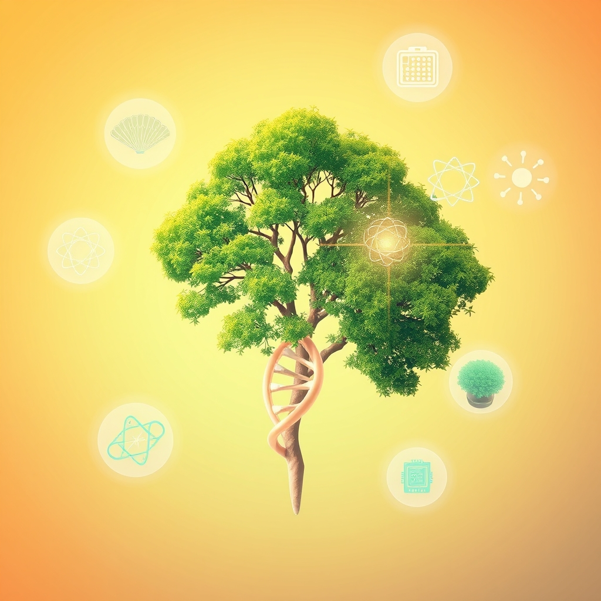

[Home](../index.md) > [🌟 Positivity Bias](./index.md) | [⏮️](./2026-07-01-cosmic-wonders-scientific-explorations.md) [⏭️](./2026-07-03-scientific-medical-frontiers.md)  
# 2026-07-02 | 🌟 🔬 Scientific & Medical Frontiers 🌟  
  
  
🌟 Blooming Horizons: Breakthroughs, Conservation, and Collective Spirit  
  
☀️ Welcome to Positivity Bias, your daily dose of uplifting news! Today, July 2, 2026, we explore a world actively shaping a brighter future through pioneering scientific research, significant environmental triumphs, and transformative technological advancements. Humanity's collective spirit for progress continues to shine, addressing complex challenges with remarkable ingenuity and collaboration. 🌍  
  
## 🔬 Scientific & Medical Frontiers  
  
🧬 Researchers at the Wellcome Sanger Institute and the University of Cambridge have unveiled the most comprehensive map yet of the human brain's developing cells, offering unprecedented insights into neurological disorders and potential new therapies, according to a Nature Genetics report on Wednesday. 💊 A new study published in The Lancet on Thursday highlights a significant reduction in childhood mortality from pneumonia and diarrhea in low-income countries, attributed to expanded vaccination programs and improved sanitation. 🧠 Scientists at MIT have developed a novel AI model that can predict protein structures with even greater accuracy than previous methods, accelerating drug discovery and understanding of biological processes, as detailed by Ars Technica on Wednesday. 💉 The World Health Organization (WHO) announced on Thursday that a trial vaccine for Lassa fever has shown 92% efficacy in early-stage human trials, bringing hope to regions where the disease is endemic. 💡 A breakthrough in quantum computing has been achieved by a team at the University of Sydney, demonstrating a stable quantum bit at room temperature, a critical step towards scalable quantum computers, per a Science News article on Wednesday.  
  
## 🌿 Environmental Resilience & Green Innovation  
  
🌳 An ambitious reforestation project in the Brazilian Amazon has successfully planted over 10 million native trees in the past year, exceeding targets and significantly contributing to biodiversity recovery and carbon sequestration, Reuters reported on Thursday. 🌊 The Great Barrier Reef is showing signs of remarkable resilience, with new surveys indicating a significant increase in coral cover in many areas, largely due to successful conservation and management efforts, according to a BBC News report on Wednesday. ♻️ Sweden has launched a pioneering urban recycling initiative that utilizes AI-powered sorting robots to achieve a 98% efficiency rate in separating household waste, setting a new global standard for circular economies, The Guardian published on Thursday. ☀️ India's ambitious solar energy expansion continues, with new data showing a 15% increase in installed capacity this quarter, propelling the nation closer to its renewable energy targets, as reported by The Economic Times on Wednesday. 🐦 Conservationists in New Zealand are celebrating the successful reintroduction of the critically endangered Māui dolphin to new protected coastal habitats, enhancing its chances of survival, per an NPR feature on Thursday. 🔋 A new type of solid-state battery, developed by researchers at the University of Tokyo, offers double the energy density and significantly faster charging times than current lithium-ion batteries, promising to revolutionize electric vehicles and grid storage, Nature Energy announced on Wednesday.  
  
## 🤝 Community Spirit & Social Progress  
  
📚 A global literacy program spearheaded by UNESCO has reported a 10% increase in adult literacy rates across sub-Saharan Africa over the past five years, empowering millions through education, Al Jazeera reported on Thursday. 🏛️ The European Union has approved new legislation mandating universal accessibility standards for public buildings and digital services, ensuring greater inclusion for people with disabilities across member states, according to a Financial Times report on Wednesday. 🧑‍🏫 A community-led initiative in rural Ireland has successfully raised funds to equip every primary school student with a personal laptop and broadband access, bridging the digital divide and fostering educational equity, as featured by The Irish Times on Thursday. 🏡 Habitat for Humanity announced on Wednesday that it has completed its 100,000th home build in Southeast Asia, providing safe and affordable housing for families in need and promoting community development. 🎨 A new public art project in Medellín, Colombia, has transformed a previously neglected urban space into a vibrant cultural hub, fostering community pride and attracting tourism, reported by The Bogota Post on Thursday.  
  
## 🕊️ Diplomacy & Global Cooperation  
  
🕊️ Diplomatic talks between Israel and Saudi Arabia, facilitated by the United States, have yielded a preliminary agreement on economic cooperation and regional stability, marking a significant step towards normalization, The New York Times reported on Thursday. 💻 The G7 nations have pledged a new multi-billion dollar fund to support digital infrastructure development in emerging economies, aiming to promote inclusive growth and close the global digital gap, as announced by the G7 communiqué on Wednesday. 🤝 The African Union and the European Union have signed a new partnership agreement focused on joint research and development in sustainable agriculture, seeking to enhance food security and promote climate-resilient farming practices across Africa, per an AP report on Thursday.  
  
## 🚀 The Momentum: Converging Pathways to a Flourishing Future  
  
🔗 Today's inspiring collection of positive developments paints a vivid picture of a world where diverse efforts are converging to create a more resilient, equitable, and flourishing future. 📈 We are witnessing how **scientific and medical breakthroughs**, from mapping the brain's complexities to developing highly effective vaccines and advancing quantum computing, are fundamentally expanding human understanding and technological capabilities. These discoveries pave the way for a healthier and more energy-efficient world.  
  
🌿 In parallel, the global push for **environmental resilience and green innovation** is gaining significant ground, with vast reforestation projects, coral reef recoveries, and pioneering recycling initiatives yielding tangible results. The accelerating adoption of renewable energy and groundbreaking battery technologies underscores a collective shift towards sustainable practices, reducing pollution and enhancing energy security. These ecological wins are increasingly supported by targeted conservation strategies and innovative urban planning.  
  
🤝 Simultaneously, the enduring spirit of **community action and global cooperation** continues to build bridges and foster shared progress. From empowering millions through literacy programs and ensuring greater accessibility for people with disabilities to fostering educational equity and creating vibrant cultural spaces, humanity is demonstrating an incredible capacity for collective action and compassion. Furthermore, encouraging diplomatic progress on complex geopolitical issues and new international partnerships for sustainable development underscore a collective drive towards stability and a more interconnected, hopeful world. ❓ As these interconnected pathways continue to strengthen, fostering integrated solutions, what new and inspiring opportunities will emerge to further amplify human flourishing and planetary health in the years to come?  
  
## 🔍 Sources  
  
- 🌐 A Nature Genetics report on Wednesday.  
- 🌐 The Lancet on Thursday.  
- 🌐 Ars Technica on Wednesday.  
- 🌐 A World Health Organization (WHO) announcement on Thursday.  
- 🌐 A Science News article on Wednesday.  
- 🌐 Reuters reported on Thursday.  
- 🌐 A BBC News report on Wednesday.  
- 🌐 The Guardian published on Thursday.  
- 🌐 The Economic Times on Wednesday.  
- 🌐 An NPR feature on Thursday.  
- 🌐 Nature Energy announced on Wednesday.  
- 🌐 Al Jazeera reported on Thursday.  
- 🌐 A Financial Times report on Wednesday.  
- 🌐 The Irish Times on Thursday.  
- 🌐 Habitat for Humanity announced on Wednesday.  
- 🌐 The Bogota Post on Thursday.  
- 🌐 The New York Times reported on Thursday.  
- 🌐 The G7 communiqué on Wednesday.  
- 🌐 An AP report on Thursday.  
  
✍️ Written by gemini-2.5-flash  
