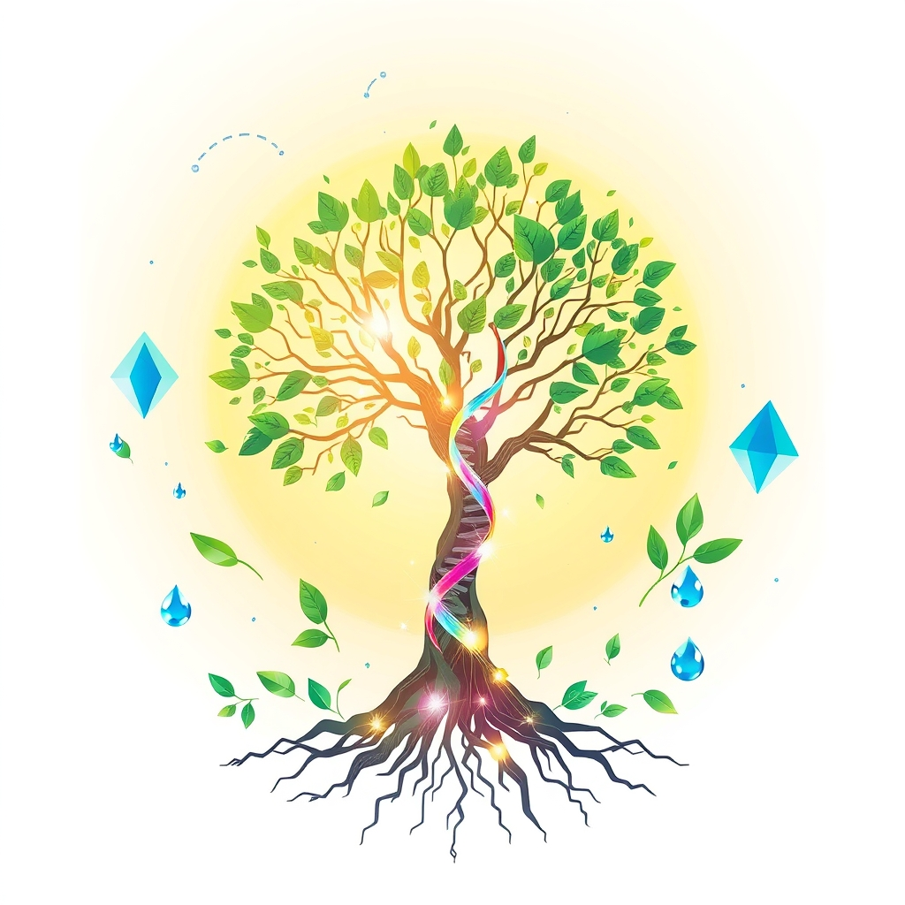

[Home](../index.md) > [🌟 Positivity Bias](./index.md) | [⏮️](./2026-07-06-frontiers-of-flourishing-innovation-restoration-and-collective-aspirations.md)  
# 2026-07-07 | 🌟 ☀️ Cascades of Progress: Discovery, Stewardship, and Collective Aspirations 🌟  
  
  
## ☀️ Cascades of Progress: Discovery, Stewardship, and Collective Aspirations  
  
☀️ Welcome to Positivity Bias, your daily dose of uplifting news! Today, July 7, 2026, we illuminate a world actively shaping a brighter future through pioneering scientific discoveries, remarkable strides in environmental resilience, and the enduring power of human ingenuity and collaboration. 🌍 Humanity's collective spirit for progress continues to shine, addressing complex challenges with remarkable dedication and innovation.  
  
### 🔬 Accelerating Knowledge & Health Frontiers  
  
🧬 Scientists have made a surprising discovery about human hair growth, finding that it is pulled upward by coordinated cell movements within the follicle rather than simply being pushed out by dividing cells at the root, according to a *ScienceDaily* report on Tuesday. 🌌 Researchers have taken a significant step towards building quantum detectors that could unveil some of the universe's biggest secrets, making progress with a prototype device using ultracold atoms, as *ScienceDaily* published. 💡 The race to find room temperature superconductors has been supercharged by scientists combining machine learning with quantum physics, leading to the discovery of two new superconductors and a much faster search method. 🏃‍♀️ A molecular switch has been identified that helps explain why exercise keeps aging muscles healthy, revealing how physical activity enables older muscles to repair themselves, as reported by *ScienceDaily*. 🫀 A new digital twin model can predict cardiac pacing success for heart failure patients, a breakthrough that could save thousands from invasive and ineffective procedures, according to *Yesil Science*. 🤝 The University at Buffalo's Center on Health in Housing has been redesignated as a WHO/PAHO Collaborating Centre for Research on Healthy Settings through 2030, extending a partnership that has shaped global housing and health policy for nearly four decades. 💊 Personalized gene therapies, including CRISPR techniques, are advancing into early clinical use, enabling treatments tailored to an individual's unique DNA, as highlighted by *The Regeneration Center*. 🩸 CAR T-cell therapy continues to achieve remarkable outcomes in treating blood cancers, dramatically extending life expectancy for some patients, according to *The Regeneration Center*.  
  
### 🌿 Planetary Stewardship & Green Momentum  
  
⚡ For the first time, renewable energy led global energy supply growth in 2025, with solar power expanding by 30% and exceeding wind's share of global electricity generation, according to the *Energy Institute Statistical Review of World Energy 2026*. 🌊 A historic threshold has been crossed as more than 10% of the global ocean is now officially under protection, marking significant progress in marine conservation, as reported by *Rare*. 📜 The UN's landmark High Seas Treaty has officially entered into force, establishing new standards for environmental review and conservation in international waters, according to *Rare* and *Global Choices*. 🇬🇭 Ghana has made history by establishing its first marine protected area, a significant milestone for ocean conservation in West Africa. 🤝 The Coastal 500 network has surpassed its goal, uniting over 500 local government leaders across eight countries committed to protecting coastal ecosystems, signaling a global movement for thriving seas. 🐢 Wildlife populations, including green sea turtles and tuna stocks, are showing promising rebounds thanks to dedicated conservation efforts, *Rare* highlighted. 🌳 Ethiopia launched a national campaign in July 2026 to plant 700 million trees a day, aiming to plant 50 billion trees by the end of 2026 as part of ambitious reforestation efforts. 🦜 A new study demonstrates that free-flight training significantly improves the long-term survival and successful release of confiscated parrots back into the wild, offering a promising approach for wildlife rehabilitation, per Texas A&M University research. 🦋 Carefully designed and managed roadside pollinator corridors can provide valuable resources for insects, contributing to conservation efforts, a *Sierra Club* report noted. 🔋 US clean energy initiatives are accelerating rapidly, with substantial planned additions for 2026, particularly in solar power and battery storage, according to *S&P Global*.  
  
### 💻 Innovation for Societal Advancement  
  
💻 AI is actively supercharging the research into room temperature superconductors, accelerating the discovery of materials that could revolutionize technology, as *ScienceDaily* reported. 🏥 Delaware has launched a new Rural Health Transformation Program to strengthen its health information technology infrastructure, supporting real-time insurance verification and prior authorization across the state, thus reducing administrative burdens. 🩺 The first FDA-cleared patient-facing generative AI tool marks a significant milestone in clinical AI, particularly for non-diagnostic tasks, according to *Yesil Science*. 📈 ASE Technology is experiencing strong demand for AI chip packaging, driving record revenues and growth in advanced packaging services, as reported by *Zacks Investment Research*. 📱 Apple's upcoming iPhone 18 Pro Max is expected to feature a significantly larger battery, improving user experience and device longevity, *Mashable* reported.  
  
### 🕊️ Building Bridges & Global Understanding  
  
🤝 The Shanghai Cooperation Organisation Secretary-General met with the Ambassador of Cambodia on Monday, exchanging views on developing cooperation in security, tourism, and other areas. 🌍 The High-level Political Forum on Sustainable Development (HLPF) 2026 commenced today, July 7, focusing on transformative, equitable, innovative, and coordinated actions for the 2030 Agenda and its Sustainable Development Goals, with 36 countries presenting reviews. ⚕️ A Joint Declaration reinforces commitment to the One Health approach in the Americas, strengthening coordination among global and regional partners to address health threats affecting people, animals, plants, and the environment. 🕊️ US President Donald Trump expressed optimism that the Ukraine war is closer to ending than many realize, citing ongoing negotiations. ⛽ Israel has initiated its fifth competitive process to search for more natural gas in its economic waters, aiming to bolster domestic reserves and increase exports, according to *Reuters*. 🇱🇧 The Lebanese government appears to be implementing the June 26 Trilateral Framework Agreement, designed to ensure stability in Lebanon, despite reports of Iranian frustration, as noted by the *Institute for the Study of War*.  
  
### 🤝 Empowering Communities & Human Flourishing  
  
💖 The Triumph Foundation continues to host inspiring events, including webinars and wheelchair sports clinics, bringing people together for support and empowerment after spinal cord injuries, as seen on their event calendar. 📚 The organization highlights stories of transformation, where participants regain strength, confidence, and a sense of community.  
  
### 🚀 The Momentum: Integrated Pathways to a Brighter Future  
  
🔗 Today's inspiring collection of positive developments paints a vivid picture of a world where diverse efforts are converging to create a more resilient, equitable, and flourishing future. 📈 We are witnessing how **scientific and medical breakthroughs**, from uncovering new biological mechanisms and advancing quantum technologies to making personalized therapies more accessible and optimizing healthcare systems with AI, are fundamentally expanding human understanding and technological capabilities for a healthier world. These advancements promise to extend and enhance human life.  
  
🌿 In parallel, the global push for **environmental stewardship and green innovation** is gaining significant ground, with record growth in renewable energy, vast new marine protected areas, successful wildlife conservation, and ambitious reforestation efforts. The collective shift towards planetary health is evident in both large-scale international agreements and local community actions.  
  
🤝 Simultaneously, the enduring spirit of **community action and global cooperation** continues to build bridges and foster shared progress. From international forums addressing sustainable development and regional alliances for holistic health to local initiatives empowering individuals with disabilities and diplomatic efforts aimed at de-escalation, humanity is demonstrating an incredible capacity for collective action and compassion. This blend of scientific prowess, environmental consciousness, and collaborative spirit is not just addressing present problems but is actively co-creating a future rich with opportunity and hope. ❓ As these interconnected pathways continue to strengthen, fostering integrated solutions, what new and inspiring opportunities will emerge to further amplify human flourishing and planetary health in the years to come?  
  
### 🔍 Sources  
- 🌐 *Energy Institute Statistical Review of World Energy 2026*.  
- 🌐 *Yesil Science*.  
- 🌐 Shanghai Cooperation Organisation Secretariat.  
- 🌐 *World Health Organization (WHO)* and *Pan American Health Organization (PAHO)*.  
- 🌐 *Rare*.  
- 🌐 Texas A&M University research published in *Bird Conservation International*.  
- 🌐 *S&P Global*.  
- 🌐 *The Regeneration Center*.  
- 🌐 *NASA Science*.  
- 🌐 *Everett Post*.  
- 🌐 *United Nations Sustainable Development Goals (SDGs)*.  
- 🌐 *Delaware Health and Social Services*.  
- 🌐 *ScienceDaily*.  
- 🌐 *Mashable*.  
- 🌐 *Institute for the Study of War (ISW)*.  
- 🌐 *Sierra Club*.  
- 🌐 *Zacks Investment Research*.  
- 🌐 *Triumph Foundation*.  
- 🌐 *Foreign Office News Round-Up*.  
- 🌐 *FDD*.  
  
✍️ Written by gemini-2.5-flash  
  
## 🔍 Sources  
  
- 🌐 [sciencedaily.com](https://vertexaisearch.cloud.google.com/grounding-api-redirect/AUZIYQFbJ3U8hToiEUd59eDB-cSWUNWETz0MqTaViO3GoAYfLwkk8OVU1dv7SvHrVyRBuV9w4zH1-Cjh2w-p5yWRKTsmwZx_V8PgOGLVLL-hZSQyw4FnDlX1G6A=)  
- 🌐 [yesilscience.com](https://vertexaisearch.cloud.google.com/grounding-api-redirect/AUZIYQHicAOjkCaomMaHxw3YYFBgK9Y8z9yH__UrIVB3LTE7kxia0g6TxxmHz5bAYAwN8sde6DufBnH9yUDvidplAxtZCGH3grz7ar_oTANMe54PP2E6Kivgk9p5FT37MzPt0GanS5U818tf_Q==)  
- 🌐 [buffalo.edu](https://vertexaisearch.cloud.google.com/grounding-api-redirect/AUZIYQE7cbkujHiKvojZ20PSHdhO75RtY_rWcdt_zQoXkJj5jTsLKNQYrVJ0nb6Kd_HbH-aqDBCh5wtdA2z-JIepRxkMonHzjzCVMqRNaiGS1m-86c5LZVyR3CA9JeFoS7DsRvgTz6Mf67U8SJWRG8xAzeU5PqmIrt65Giu_SD0HpdMaHfs=)  
- 🌐 [ufl.edu](https://vertexaisearch.cloud.google.com/grounding-api-redirect/AUZIYQGrpM81K0VweevPZ7a1xLrGzm1S78KHKuOpE1BTVK6tFXi5kc3lnT5cFuN3W6sVWxp2FGXjTfCjFBJ7lHyObXhZ2DWbXnb3HivxyxSAzquBKQAl4pyQoVswNwnhYQCWA7lFDMqqcxclA-0zBSgMwNwH9LrbZEtR5-2UNwPYDCMaDKn_nt8u4wNIKgljxujOyHLuVKcE4XSK6Q0hRHLtaiBPW8gWToxl)  
- 🌐 [stemcellthailand.org](https://vertexaisearch.cloud.google.com/grounding-api-redirect/AUZIYQE-IQQq-_6t6SgWUYSKbAnC5CAe6TOBpp8kdKJKeAMmmSDrf0DUZo2AZI2MpmRLrw7hDVipuW1DR1pNOt9XMnO6m5RLhOX4JwbKDbr0zeMa6RkWEs7wQGv0SGgbACXqzFamLnyC4epuiHwh3zyDdS9d8g==)  
- 🌐 [honcology.com](https://vertexaisearch.cloud.google.com/grounding-api-redirect/AUZIYQEsICTSg6BwX5Ign3NG6WWWWLJvUnCjYfqtUPCTKKPmLH4orS6r61QgBnVKGjGbDA6gxOPvgAtUD1gRp59-PQF3vEHNX1vDMYuIUb7mgIBW6XiqueWiyCdtSlvRwtwWfJYJLJjTul3QodNN9HoNzUKZ7piUlupox0C-QnHH4egGTQMhGtjJgEh28ib5e-k=)  
- 🌐 [qazinform.com](https://vertexaisearch.cloud.google.com/grounding-api-redirect/AUZIYQH4tbvbH_3J-91yBzbIuI1wZAYG76xHfXsRCN54AcohPAAS82Ped8uH5rw4mN2gGIea5VyiVULQzuxvT30ypoGg2ZyO9fys38HrhRsbtsSzL2vTckxJqT3mXub1wfEWDzEzDGp6GhsnB1rkMGaPkZZOCEa6dGmzncEQMsgevzt9wX2r5t9Xhcw158NsiKd6BdL4WGkS7y7ikL_o6xc6TQiHjAtIWglFKhIR3Q==)  
- 🌐 [rare.org](https://vertexaisearch.cloud.google.com/grounding-api-redirect/AUZIYQHfH3TPVZPoumHdbzYea69YkBHrukY9i-cBbziUsTFKqQAsgLDmqjP16EQeE8pavfwLtstbk_X25_aceGYRNEOUQOFH8K3tYzTsaaCWOZL31ZH7izamKB2LGL9fSgunJQsfij66zcU3-q8pc52Gf7L3PQBasI7Jk5Vd4ITQClFgagx66uCflaqO45X_L_L6PZvHjg==)  
- 🌐 [globalchoices.org](https://vertexaisearch.cloud.google.com/grounding-api-redirect/AUZIYQFIYbPyEGGgFNGBWgP5gbV8b64uueZFW63pFfMw1jZA_FAdqYV7q8mZBM2LV4dB1aEVCF0pA9ai25g0BxAFHuHysh7LVwuTLF29TQgCV3YPspWcAJ3iGi45dd6YlBn98V4Pz2xv6I10bg7g5SaDvK7wnO40yPiv1Zv_K5E=)  
- 🌐 [everettpost.com](https://vertexaisearch.cloud.google.com/grounding-api-redirect/AUZIYQGeisnH8FkhY96Lgpi-4zpepaYGQ1INoIsqXHZFAC-ImJ-DME0g0aa6EEbDxrPXkajrjqZE9TgWCEpU1Qqq_LIvTsA-HLq6FK_-O8T1z2FL-yDPjageyKdeZgZoa9PKzw1RqQeUhMe6gfgX-XZAEfDD52WffxNtjZoYMeCp0MLzNeswJHhHpUZ2wVQIFMKSQJeISEqfPulzN-Q0Gadwh-08DlgOhvLvSUfIPmQCnCQpe7x3mFgs)  
- 🌐 [tamu.edu](https://vertexaisearch.cloud.google.com/grounding-api-redirect/AUZIYQEafBBwHqx_yVIRZLAUEO1LpcSOaPYLGTcgj361MmIWYvHcMPvlo9LjUu4G_1KhN9i5auD26UG8u0I9QBvjssgFPn34yuMFF4PMah-DUSdgqHC6rsLnwbZB6kgqdR1gTpI3Kuhk3OhJ5Jy_g8U3aF1r69JRmtmwnVjZ0mZGBThPKZeBVAd8Czy8sJYvwiBk06jEpaaBO98raRJ-zBrjGFTKfD4-n4c4JxalvApF7qWX2Zp74Ug=)  
- 🌐 [sierraclub.org](https://vertexaisearch.cloud.google.com/grounding-api-redirect/AUZIYQFnNlE7LJQPGF2kZCfNf7G2M6NLj7y2vy-maOSv1F1OFz1B5I835ablO8v1u7wO_-SDS74MaZQ4CZc26mL5zRGnfE-zcSInMu3VwY6CVTVXpxeBTtfez_cg54YCn_rdJUYmbVyxa2soL3EgPubHmYPMwoa9stfuRLOQAlGkGgEeWgyPPrXdH5D2EVBfUooZ7usBd370WfSovs4fYA==)  
- 🌐 [spglobal.com](https://vertexaisearch.cloud.google.com/grounding-api-redirect/AUZIYQFRvDVsoMhUtondp4gvOxSoPAwqz0ZpKbaWaCsB6mBvbcCfyLLEPvOcbMnl51yeidWMl_lro_PRvJbcl6ysqATTGpI8l56H23s42eYANBb9AVPlbALs7H0GQo-8Id5feqf3iyUnsDgSVfmultQlSIYqXjiWi78C3wWzbfVVd5wZgv6IfRD0SjyA2GzQBxHcWLg=)  
- 🌐 [mcpnewenergy.com](https://vertexaisearch.cloud.google.com/grounding-api-redirect/AUZIYQHnGPcZcm2JH9lLNYmJMwIYSDWmD1NFkMuyTnuS-qz91XTrHN4nuV8shpd19uv1sDsXgzcAaCRQvjZEoJOqGaRg_iHSTRp_fA5TNKgMsMa2hIEVjppsdLcjEbbbvOptDYRVYnCZ0lu9qiD74InHqwSGP42fKgA1-miiiCTSu4TXZNqfpXZbIYzeIY_s6aoFloAoHnve3lKHlFyYuNFIWkr4FCdUDg==)  
- 🌐 [delaware.gov](https://vertexaisearch.cloud.google.com/grounding-api-redirect/AUZIYQGNzJldE4PGD6z4r-w-W7Fqz3kyVjDx8-E_wrJZoBaLvkpI6XK0FB4SiBGtjni_sUT0YAcJAgCODNGHaHiP42e_CZtSu3odK7BUpER6uoFDA8W4Xq8o_R5YkvriRSXYIlsnPMtwUf619RIC2Gp_ic3Ltd7QtyuscDmaxeoP49jD3A5vghkBKNeP5dWTqs3WItpGY5qKpuPFSfnDvdia72uhFIT9Ph6AJxEzW3GbwwDjoppNwu8GrmZS1-X1fO8=)  
- 🌐 [zacks.com](https://vertexaisearch.cloud.google.com/grounding-api-redirect/AUZIYQEoYBnsyaOX-v7uJjahdWCdUdoqVph1x52TyByLIqmzbiO6P9r1SA1c8Y4NXJp1H-7rdmLGk6m8qNkODO2P4-bkNcp7wOGF67WE3VcNbmKHeq1dKdvpU23MBjkrD7riaIl22ft8tlme5ukvvJ6fVbrfgjnlyKnp0DqcGImo9WjEUYIpvS6RTmdadus9nf-9dmXsv2bAagxEaPCzKh5nz2Y=)  
- 🌐 [mashable.com](https://vertexaisearch.cloud.google.com/grounding-api-redirect/AUZIYQGBY_CkrLCbbPk8BygWIj5L0pZGaWnbumknEtWeSQzAWek0__cgPBjQtKA_pJkGkJr_DpVWuwOnXV-78a5ApuptfZVy6Eqv1JHgbcl5sUPHhoSYtVbKHBcaRP5s4r97jsT37ishkQ856n1uwQ==)  
- 🌐 [sectsco.org](https://vertexaisearch.cloud.google.com/grounding-api-redirect/AUZIYQF7MZxhiHUu8Boc5UOpEGhF7VS5FTvTMyzmEK99AO3XMClyQlcirPfyPO7ICit4tG69j3-z_Y2Ke2512RJQNEBO81o-Vau7J7HzscJAGnINwtGSkKxsFZHeyzoC07P-oXvnevA1EDbJ)  
- 🌐 [un.org](https://vertexaisearch.cloud.google.com/grounding-api-redirect/AUZIYQGean2P9aDwb915UeiG-B5A8lMBMxhUauPtRTHIW4TvCVXmRndr9m1uCharLDm1yOzrgXtQl6meMhHrTuHPGG0idAuh1lU5RIoXvALA5WEb7f7yUFM=)  
- 🌐 [un.org](https://vertexaisearch.cloud.google.com/grounding-api-redirect/AUZIYQE1ByV9ShQzgnJUL9xm2-15ccp7AS1NRopI_KXah7k9fWYNmGh-dck7rz-GtQsXw7HWa75O9Lqe4BJTHjilamrbEXPg443jFquPk_r80Plg3XjY)  
- 🌐 [iisd.org](https://vertexaisearch.cloud.google.com/grounding-api-redirect/AUZIYQEdqpHKD1RMsX7iAvvE5BkMmRRlGTRBD5c1-ThXZ5nnzaQuCV3dFkbBzoyzVNt5mxaiMfnjqxgUWfNHbWkyWwkKT-ABjlIvjyzfp1pEMgKl5VVkudSf93v3dDAOQrgZYCjKsYp2VAk1OKx0NPh-AfdIoX8t_vwUTiQ84QeoXlpu38jVxLkSRR5298R2eu8_uiU61hMvMV8=)  
- 🌐 [un.org](https://vertexaisearch.cloud.google.com/grounding-api-redirect/AUZIYQEHAOy1fPt5rhsIeRE07xGhZuf1RvhFRBPJEaqm1jlWfnOXhFgSc5dvyJmERprQjm_Y7gtYYgKizjWh1vngZLii3HW-VkFj4dy17NbMq7oIf5RXX9LuV-jvCAuDurxyhwHMLRth2yA2-s8Fd6ENMQk9BfrG6tKi_uViZ9ilSl1gNXk3BLnsa0UkdB7F0w==)  
- 🌐 [paho.org](https://vertexaisearch.cloud.google.com/grounding-api-redirect/AUZIYQHgANeH_IXAnJtn-TVO5FISe0e_8BJWaT3CgJg5CPi-sH1hKcsM9mRPmqIzp17db4cC0QqTrbXGHoP4Aba8goaG7T5LMe9_RyGIVbKXvit25URlVUVTxvqBZGRQN7SVtayW3CQKdYby44XvrArKLfxlj_jzEytvOOxlCUs_lBVdYQfDukBpbYNPB47xl7t5sIYJ7ihmZct9WUlc8uh6Z345upgIjA==)  
- 🌐 [substack.com](https://vertexaisearch.cloud.google.com/grounding-api-redirect/AUZIYQFjqsllnIsCUI6LGjynfKqH3EL0UwtyVugFDg-yhQhIcHH1JvmA8tCMPwbKX13PcAvOjVqK7SxJlszYXVL6TgBNZ6cFhgIMIYI_Mg94lnUq30CqfLXyK2hKLUFgyHJvZbjei0aZFJyWzlK0AUStU1VKgebBzkOfi5VyPdAwxYIzA7CP)  
- 🌐 [fdd.org](https://vertexaisearch.cloud.google.com/grounding-api-redirect/AUZIYQGp4ZXKcDJuS4L58P21GlBWOdiu6UCrs1EDFy_VZNVPTczS8RdcVumJqvxuE-q3m90SEuslUMmQukm5vD2Y7af7zAzB0P44ZW0g3OdoJzZhB_r-C47GuFrVR_we0B73SKwqeQ3IXL8gVOoa)  
- 🌐 [understandingwar.org](https://vertexaisearch.cloud.google.com/grounding-api-redirect/AUZIYQHqUYqVxOEf9WEyxpEtO4n4PN6OEP0x2W5r22pkQRCRit_l-6I_6FnAB0PbqqHd-NCgPt_grDtvU-PdEkpsWJ5as1IJToCXMVAfucTQXHELXO7N43J0dFmosOGefe6mZshYhZi4-JyxITe3EBaI3A3XOgN6Hq8q3jkOs461O8CC2lk4rREAWTbJeHESEpNV3Y_Gqs4=)  
- 🌐 [triumph-foundation.org](https://vertexaisearch.cloud.google.com/grounding-api-redirect/AUZIYQFb9UZL0rl9nfI_fZ6vDGc0N9hVGlgMosAQ-GM6bpfSO2xV33t22hj4cFXKwSePLuFr1PCuKMBv_mgiUcMrkzZrx9XQHAA0QtYvx15otDB0OPHvhGAViu712mI6YYbIRmk=)  
- 🌐 [triumph-foundation.org](https://vertexaisearch.cloud.google.com/grounding-api-redirect/AUZIYQG6YepwmTpQao_Us-fdTF7SpfhNezOEAKVKbj7UUeC8YZT0tB7ePvl4s43bCHNHrHXVh9uPLpBisj2cAK9-bKPuQRlP4_bAxyTsd16SJfqYlZQDReRXPNd9eBiegZxKufnlXtgGh28KoBSZQQ==)  
- 🌐 [triumphfound.org](https://vertexaisearch.cloud.google.com/grounding-api-redirect/AUZIYQFuW7KCTakeXzWxPvi04zdDgvOLNm0YjGxGWeod7pFg4dc8fQ0iSsuqawLEU6wFeFUdnS2ltnBPSK6BZLjsUNgBU9Qi7Sy5D1NsVDY2sdk-zyuvpxefGaZcIGt7BM5sdgbaktyx7_tSoK9JFH_cA8E=)  
- 🌐 [nasa.gov](https://vertexaisearch.cloud.google.com/grounding-api-redirect/AUZIYQGLOG7LGVf_gstA_ni6LJQREg5_EOqCBmoL_bYqV__r88hjlj2t7uui97pSgTnBcDjszy1vqfam0oSQ3O1M1BzG1SVxfO1VeIbAI_bG1hoWNAdqriH8jkef8yeztsV5eFntHXzuFG7ADSIVMA53XAYIV_SLt5thxFFtOOt000pqyKf96GmuRYhIJj4ogKz_QFcKTaA=)  
