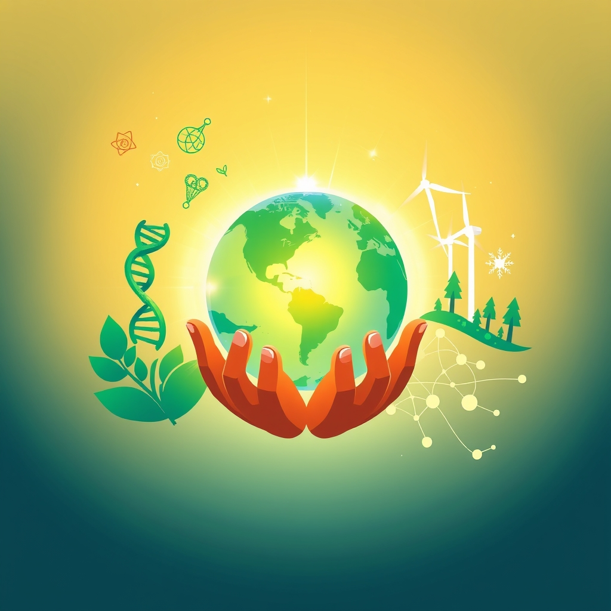

[Home](../index.md) > [🌟 Positivity Bias](./index.md) | [⏮️](./2026-07-09-illuminating-pathways-breakthroughs-collaborative-action-and-enduring-spirit.md) [⏭️](./2026-07-11-illuminating-progress-science-collaboration-and-green-horizons.md)  
# 2026-07-10 | 🌟 Pathways of Progress: Innovation, Collaboration, and Enduring Spirit 🌟  
  
  
## 🌟 Pathways of Progress: Innovation, Collaboration, and Enduring Spirit  
  
☀️ Welcome to Positivity Bias, your daily dose of uplifting news! Today, July 10, 2026, we explore a world actively shaping a brighter future through pioneering scientific discoveries, remarkable strides in environmental resilience, and the enduring power of human ingenuity and collaboration. Humanity's collective spirit for progress continues to shine, addressing complex challenges with remarkable dedication and innovation. 🌍  
  
### 🔬 Scientific & Health Advancements  
  
🧬 The FDA greenlit 26 novel therapies in the first half of 2026, including four for cancer and six for orphan indications, marking significant progress in medical innovation. 💊 AstraZeneca and Johnson & Johnson received a combined 11 of the FDA's 79 total approvals, including supplemental nods, highlighting their contributions to new treatments. 🔬 Researchers have cracked the code behind bacteria's ability to naturally manufacture multiple versions of powerful anti-cancer drugs, which could make it easier to engineer new nature-inspired cancer treatments. 💉 An innovative hidden immune backup system was found to supercharge mRNA cancer vaccines, overturning a long-held assumption about how these vaccines work and potentially leading to more effective treatments. 🧠 Scientists discovered a modified Mediterranean-style diet, low in protein and with precise methionine levels, helped mice live healthier lives while reducing body fat and frailty, with human data also linking lower animal protein intake to reduced obesity rates. ⚕️ Regeneron's gene therapy Otarmeni became the first treatment to target an underlying cause of deafness, and also the company's first gene therapy to reach the market. 🫀 A non-surgical procedure successfully halved knee pain in a 12-month trial, offering significant relief for many patients. 👶 Non-invasive fetal DNA tests, NIPD and NIPT DNA sampling, have been developed to replace invasive prenatal paternity tests like CVS and amniocentesis, which carried a small but significant chance of miscarriage. 💻 AI-driven drug discovery is accelerating, with companies like Insilico Medicine showcasing breakthroughs and clinical developments at international summits.  
  
### 🌿 Environmental Stewardship & Green Momentum  
  
🌊 The Seine River in Paris has remained clean enough for bathers for a second summer, marking the first time in over a century the river has been swimmable due to a years-long clean-up and a major upgrade to the city's sewage system. 🌳 Ethiopia launched a national campaign in July 2026 to plant 700 million trees a day, aiming to plant 50 billion trees by the end of 2026 as part of ambitious reforestation efforts. ⚡ Global electricity consumption rose by 3% in 2025, an increase met entirely by renewables, with solar power expanding by 30% and battery capacity rising by 66%, according to the Energy Institute. ☀️ Wind and solar energy combined generated 22% of global electricity in April 2026, surpassing gas at 20% for the first time ever, signaling a structural shift in energy production. 🌍 European nations are leading the world in environmental protection due to their embrace of renewables and efforts to cut pollution, according to the Environmental Performance Index by Yale and Columbia Universities. 🏞️ More than 10% of the global ocean is now officially under protection for the first time in history, marking real progress in biodiversity conservation and supporting fishing communities. 🇬🇭 Ghana made history by establishing its first national marine protected area, a significant milestone for West African ocean conservation. 🐢 Wildlife populations, including coho salmon in California and various species on land and at sea, are showing promising rebounds thanks to dedicated conservation efforts. 🚂 Switzerland has innovatively turned its train tracks into solar power plants, using existing unused space to generate clean electricity without impeding trains.  
  
### 💻 Technology & AI for Societal Good  
  
🤖 The AI for Good Global Summit 2026, organized by the International Telecommunication Union (ITU) in partnership with 50 UN sister agencies, is taking place in Geneva to identify practical AI applications for Sustainable Development Goals. 💡 This summit features live demonstrations of advanced robotics, brain-computer interfaces, and mobility innovations, showcasing a shift from AI innovation to real-world integration. 🧬 Scientists have created a silicon chip that can write dozens of DNA sequences simultaneously using electricity and water-based enzymes, offering a cleaner alternative to conventional DNA manufacturing. 🌠 Researchers have created an AI-based simulation that makes it much faster to model how neutron star mergers produce many of the universe's heaviest elements, improving predictions in astrophysics. 🎓 D2L Fusion, a conference in Phoenix, is exploring how AI, virtual reality, and augmented reality are advancing teaching and learning, with practical implementations for improving learner success.  
  
### 🕊️ Diplomacy & Global Understanding  
  
🤝 China is actively welcoming more Americans for visits and cultural exchanges, with recent youth sports and cultural initiatives demonstrating deep emotional connections between the two peoples. 🌍 The Prime Ministers of Canada and Saudi Arabia committed to deepening bilateral engagement and economic cooperation across trade, investment, innovation, multilateral forums, and regional security during a visit from July 8-10, 2026. 🌐 The 2026 United Nations Water Conference, co-hosted by the UAE and Senegal in Abu Dhabi, aims to accelerate investment and innovation to strengthen water resilience for all, with a focus on practical solutions. 🗣️ A China-France Cultural Dialogue in Paris discussed strengthening cross-cultural communication and exploring future cooperation in cultural communities, including using digital technologies and AI to expand engagement. 🇦🇺🇮🇳 Australia and India reaffirmed their commitment to consolidate and expand their Comprehensive Strategic Partnership from July 8-10, focusing on defence, maritime security, energy, climate, space, and technology collaboration.  
  
### 🤝 Empowering Communities & Human Flourishing  
  
💰 A new report outlines the UK Government's Child Poverty Strategy, which includes scrapping the two-child limit and expanding free school meals, measures expected to lift around 550,000 children out of poverty by the end of this Parliament. 💡 The International Conference on Economic Development, Growth, and Poverty Reduction in Austin, Texas, from July 8-9, aims to foster collaboration among experts to discuss strategies for poverty alleviation. 🗺️ The Roadmap for Eradicating Poverty Beyond Growth, co-constructed by UN agencies and NGOs, will be formally presented to the Human Rights Council in summer 2026, offering proposals for social progress without relying on perpetual economic growth. 🫂 Strategic funding opportunities are opening in July 2026 for poverty alleviation initiatives, including grants for locally led organizations, social enterprises, and community-driven solutions worldwide. 🏥 A major philanthropic investment was announced by the University of Maryland Medical Center in Annapolis, one of the hospital's largest in its nearly 125-year history, aimed at bolstering healthcare.  
  
### 🚀 The Momentum: Converging Visions for a Brighter Tomorrow  
  
🔗 Today's collection of positive news reveals a powerful, interconnected momentum, illustrating how global society is actively building a more resilient, equitable, and flourishing future. 📈 We are witnessing how **scientific and medical breakthroughs**, from a surge in FDA-approved novel therapies for cancer and rare diseases to advancements in gene therapy for deafness and AI-accelerated drug discovery, are profoundly expanding human potential and well-being. These innovations are not isolated but are part of a larger push to translate complex research into tangible health outcomes.  
  
🌿 In parallel, the global commitment to **environmental stewardship and green innovation** is yielding remarkable, measurable results. The return of swimmable rivers, ambitious reforestation campaigns, and the historic dominance of renewables in global electricity supply signify a collective turning point in our relationship with the planet. From protecting vast oceanic areas to pioneering sustainable energy solutions like solar train tracks, these efforts highlight a shift towards integrated ecological solutions.  
  
🤝 Simultaneously, the enduring spirit of **diplomacy and global understanding** continues to build bridges and foster shared progress. Expanded cultural exchanges, high-level bilateral and multilateral commitments on economic cooperation, climate, and water resilience demonstrate a persistent drive towards collaboration over conflict. These diplomatic achievements are crucial for creating the stable platforms upon which scientific and environmental progress can thrive.  
  
❓ As these converging pathways continue to strengthen, fostering integrated solutions and amplifying the impact of individual efforts, what new and inspiring opportunities will emerge to further accelerate human flourishing and planetary health in the years to come?  
  
### 🔍 Sources  
- 🌐 BioSpace.  
- 🌐 ScienceDaily.  
- 🌐 RealClearScience.  
- 🌐 The Regeneration Center.  
- 🌐 EurekAlert!  
- 🌐 Positive News.  
- 🌐 Everett Post.  
- 🌐 Ecologi.  
- 🌐 Rare.  
- 🌐 Tech & Innovation Good News.  
- 🌐 Swiss Robotics Association.  
- 🌐 SDG Knowledge Hub.  
- 🌐 Relve.  
- 🌐 Digital Watch Observatory.  
- 🌐 ITU.  
- 🌐 D2L Fusion.  
- 🌐 Gate News.  
- 🌐 Gate US.  
- 🌐 People's Daily Online.  
- 🌐 english.scio.gov.cn.  
- 🌐 Prime Minister of Canada.  
- 🌐 TATOLI Agência Noticiosa de Timor-Leste.  
- 🌐 TradingView.  
- 🌐 Australia Department of the Prime Minister and Cabinet.  
- 🌐 Mirage News.  
- 🌐 International Conference on Economic Development, Growth, and Poverty Reduction.  
- 🌐 Development Studies Association.  
- 🌐 fundsforNGOs.  
- 🌐 KFF Health News.  
  
✍️ Written by gemini-2.5-flash  
  
## 🔍 Sources  
  
- 🌐 [biospace.com](https://vertexaisearch.cloud.google.com/grounding-api-redirect/AUZIYQGMT7ZcajwcoCsWy84ZJKdisLzOjF92xmapeP1xmV3_X2JZknHXSlQFs9M57LXQUHvwCD4bcn66DARfSixd5gV5Bp2qQh8XPvsOt1Lz-8xOCy5jFqEKP_R6ew0y3JrckPGJB_vJ5-ISyYDUn88_o6sX4WY8xRNW44qqhWkySO8IV_WWuXYtrUrinnaPhhBpd5B9En-oXXHsUnQD-OKq1KCjYu3nMJbbO2jQ)  
- 🌐 [sciencedaily.com](https://vertexaisearch.cloud.google.com/grounding-api-redirect/AUZIYQH9qpLPV9VrS-XtoLaaVIrwosB5CrdyDc0zDDJzfEXec3E3OBndfmvFM-en2JUemoHPpWojmbb-kSf8kwsJ7ziNnDNpCTrk0JAmcBCoRnEkvxFqgrDpKtEtl78e2Re0RG4Ubz8INJ_RexM=)  
- 🌐 [realclearscience.com](https://vertexaisearch.cloud.google.com/grounding-api-redirect/AUZIYQH-jkaaDSiqTjSV-DR-0vQ0nPMwTGAcP97OgR_C-fwI7GQJlYBxdTHGKwg2EVKoHnJteeZouiAwUYULmRKaxlgsvXU3y_r1mQJmGpHY5Nda8H1RvBVdtczhsN3L2gQjUcKU89ROq5Q=)  
- 🌐 [stemcellthailand.org](https://vertexaisearch.cloud.google.com/grounding-api-redirect/AUZIYQH5llULTLvH9UMnMgmBChuAaPsaXWUT9byIvBrc-YxzaHXQ1GTFXRtBXe9kvypndMOV0gZSSG9PT0aWSOmkF4E-hLzsYtka83sF1TB4tjLOEOcJPWP5ClkBTIOldUstabLALJ5rI6FwXcO5Wwdb4f9CqKk=)  
- 🌐 [eurekalert.org](https://vertexaisearch.cloud.google.com/grounding-api-redirect/AUZIYQG7nAqCQ2qBRLSZWodcGhTUyKVzOVZaV8IiaShxERr2IYCzzo59fCSYy51stUR1ilGn1yeFJNLErJ3YeWab_w9E2tFXPaCOwC9UCHrxLmaQ3DIVwVkY2Rf-l_3u_8vpFrEGAAAEnYq29M1WLQ==)  
- 🌐 [positive.news](https://vertexaisearch.cloud.google.com/grounding-api-redirect/AUZIYQGyHkMG8feFeVShCwvTPMPJIs8mGua1hFsrB6O4Tk7YVXgCBEiPvVb7yyIQsY2X1I7zOdOQ4ouxUgtOHg2YNZeO87Qajrmh-WRAJLPUQdZUgaaz_CmttaakqU42O40Fa_cmFqxekW35pFyRCaYO0Yi2hulUYLwXSOX4hBsH8Iqz6Qp-NIc=)  
- 🌐 [everettpost.com](https://vertexaisearch.cloud.google.com/grounding-api-redirect/AUZIYQFYejpwLMgeftzOF5ahyCDGyG3gJQEqoVzYuU_xdyMnsGeHlE9eOe2exPC5XJgiB1fwqf8Y5lxxKN-nIH9_uhcOxGHk2wchrxl1QiLXZJ_GkLtcmZu-_9oQLtmDr75lm7Yei9S2u9Cc7t-iFPUMPC4htPMHXFMqy4ZPw4tfyseCXw2uedTFm-gYw1QRHkslQDr7o__zVLvMU6n0uPlDwdv49e4Xkf5uSamu3oPcrecOhFUiyxJ2mg==)  
- 🌐 [ecologi.com](https://vertexaisearch.cloud.google.com/grounding-api-redirect/AUZIYQG8FMfFkW6m-GuexSye0InSGcwkWqJqoPFdTjXKB2_DbWbQe2UCGB_g-L7Qa_7mQyKM0gjV6lMAJu8zqx6pUy37CuLI1wVCHa4iH24xnAv--HSn7ipCDH4gf0t0U0j2M6LeHuDS1MjAtSayz5PmjA==)  
- 🌐 [rare.org](https://vertexaisearch.cloud.google.com/grounding-api-redirect/AUZIYQF-fFZfa9CsCSvwmSYsIPGPZAAjjRRbP7QX_gWuBie6d_7ojN3KBrwfV9SmhTwRTiaJb4hV-ly_nZqBZ4erYjuo1LKvCnwPjSnwSUNJixFwyxjfAIYN4N1UbV1dlkwQT8kYo6OFZ7XqOilur3KgXKfncYfBm4WPkH6QAqzdEZ2nSdagO-8omJU8PcUdl9teiqk4FYM=)  
- 🌐 [goodgoodgood.co](https://vertexaisearch.cloud.google.com/grounding-api-redirect/AUZIYQHumOVUL1Vvq3Z8Ag8_GiQWlaSVedUeg08VGIbHS4ZQWwtwyXGPZXhfpWUdAxr519pem7KbL1tYsu_HT1Fxp_a74lI8fFLJ-J5hUQisdfG7CUEQw1q6dRQvo0U4LwDN1XXd9GCMN_tHp8IsNvjFn5SGZb7E)  
- 🌐 [iisd.org](https://vertexaisearch.cloud.google.com/grounding-api-redirect/AUZIYQGHCVUzoUzgWFlzGcEBbu8f_Mox9NMoChSWpCErkyOuAzLoz3Lzzvlkc_l09CuYQDDIXP3hua4Cs4r9QOmt43ByMMDRnnxPBk6cqF22L67NA6vKdgYmG3hrIKcQUNT_iazXSH5e5tJtUoWKRDMjrqpw1_920HL3)  
- 🌐 [relvehq.com](https://vertexaisearch.cloud.google.com/grounding-api-redirect/AUZIYQFlyNUSZ_WodQA1NWRtps9oYtgcd3-fuM0iCz5SnWl1cpO9GurPGU_hi5uQcXimNKS0cq3RLxkcwqF8w_qfVSgVEtar8RHAvOaEo77YXUwbxn7Q4bYXWvxTLwIEyS8_CDrWyXfVDR_PNQcj8CqUeT8=)  
- 🌐 [dig.watch](https://vertexaisearch.cloud.google.com/grounding-api-redirect/AUZIYQFeOMv1qRO72EL5OEsr0sVFLV5sY9rg3eIjPA67Coxw2fe95Xfe88IR_oyXqA2O32-vbk4ccdiHHeszMrrQjt-DFoe9UjI8-K94MUl-jaj9zXpGN3k1tVw3BCWhF4OfakayyIGJyd_JRhBAZ8ipPKQtoA==)  
- 🌐 [itu.int](https://vertexaisearch.cloud.google.com/grounding-api-redirect/AUZIYQENrwHVGeuF7HYqcj6BsWnmiGbSTUF4jP5gyDpJ0NCf6_XlgQUIBf40vdyoNKkuVTuTmbtU8PH9ttwjasKwPH1I7iQg3mnHKuqvxyTVkMYnAsfKN4Qpv4UHZOoL6A==)  
- 🌐 [itu.int](https://vertexaisearch.cloud.google.com/grounding-api-redirect/AUZIYQGYdFt4gfxt5RbrgjvH36Olepayky1VIsacwvdwFc9GIcMmAioM0OlXCs80zmwRXWDnHU2Qf3cx0GGJUyu70qxi2pXugHwo5n7p4LSmVoG_zKUPDfQpIaqvwz6VYqg1v6rmwviwHWkjHPqymrN8_jzED2z9l4zh62AxIg_TDUfVXreaSXPgYQcakGWaVQMtteHdq7iXtRr9nYkHZkad)  
- 🌐 [d2l.com](https://vertexaisearch.cloud.google.com/grounding-api-redirect/AUZIYQHGxuiluLf6ow0T7QBhbhM2mHJwMXMnqYMfcdVZlJ_M2lkOzMqDR1r8N7xvhkz3cx5sM7JPY4RbxVXsx79MXob-aC04IlscliooGGjW78EQokKVV317H01plqUWoW3NGA==)  
- 🌐 [gate.com](https://vertexaisearch.cloud.google.com/grounding-api-redirect/AUZIYQGBiCmRxgddSIU7NvPKPaZe9QZZ1rW4_3br3OBTYeuLsCPkFe8XLf4ZZzByl1Fmy3YCrjrgcS2IGfKY1ngK5OmSzOEL8pXdqpbGT_jPwKuebYSZvpoCQdN3jPcFnaxn8p7tw8xdvHgp_MhKaalvmSdFqOlkpzAh7EMk-kTzvDIfDUULcsHsVHYp0U6MVmZpKY10k7w8WIrhXDowqnDePr3_k-dS3A==)  
- 🌐 [gate.com](https://vertexaisearch.cloud.google.com/grounding-api-redirect/AUZIYQH9h46eKlyqMLHKijHfsiATMwbPSvWTZ3zBNMa736EMkpg9SWUqdJNmj0330P5Qa_La-tF4nRUU3cnuS2YerZyO6aQ6CwMsQ3g1gVxQfYYBsh_8Cqjz3mF4US6ZPLxuSEaRmA0lFXqdJgon26JIPRzzYTTCd90vlVOT4jpZdv5MgjFcLUkBNqgebmsN463C9h3PlVt4bWrgObnOSuDiaoJOPconlPbmPxhepg==)  
- 🌐 [people.cn](https://vertexaisearch.cloud.google.com/grounding-api-redirect/AUZIYQGfBVtcor8ByRxxzl5rPmSPobbYAv3oF5fY8rV7Kle2XMr5Zh6deSDsSapI8v3vQM8XR4zjXRr6DjFTAL4aL8zqiVGysCuIqL_5PLO_b7S8SUuILwrPMmT03exl9K2KaSN-66wegIHkC2L0J3EWiQTJGA==)  
- 🌐 [scio.gov.cn](https://vertexaisearch.cloud.google.com/grounding-api-redirect/AUZIYQFYK1UTtWdr5SEPCnYJTyuJFtLdF-ux4c4o9HPjt11TF-zq12EC5_hm83Uix7MEZJkhXkmCzVTiyMYy5KcmeFYpnz29085zwFa_zs3flkBsipM2yvn5lcI6BTDKXNzPbwAoMuu3v7KyfPlwdMNJKC_3K984bUo0tVRTK0NLF8JXLZU=)  
- 🌐 [pm.gc.ca](https://vertexaisearch.cloud.google.com/grounding-api-redirect/AUZIYQEHOGJg2WZW44kYR0asavk5-wtUUI0EVmPWqjzu8vFTrcR9OUpJAiVQfHme8EpnP53ffdibJlXbizl2VaoGxLFLXF9fCBn3310Lt-X2Ah7JU3V-hb1C7l7DRNRMZ4OXFigRAJWeAK3Le5onOoPf_MwpvqD0_8Izb0WUc4RLTmg2Iy-3Dd3qGVBwr8mBj7emnF9dzJrYKHlS-bNQSy20AehvICq1ZAFOFpSuQ_ZHhKfkLv9rRw==)  
- 🌐 [tatoli.tl](https://vertexaisearch.cloud.google.com/grounding-api-redirect/AUZIYQGrzMsyYNNsGBSDUo9YO38NEcRSSKGSh-MN45XfrzmhzTxIMYkRGXa-OinAdjnV7ktqBoiII5-kLG1QejRG6tVrriaNgDhnPdutzHcfPzOaGazwGPQROR7hPgHcOHNU-7j-Z-iTlvSH4j3gWpsJvIe4FbY-OEIN3S58_gNq7HkA8jYDm8AjPAXLfZdz99Ey845dHbhCQQ7Do8L67zs9ZnUtezYvZ4V2Tz-Evp26-7Yh1suY3fg=)  
- 🌐 [tradingview.com](https://vertexaisearch.cloud.google.com/grounding-api-redirect/AUZIYQEMA6OjzB6IyKtWOBInHnGsvnVHLGk-wng6S-jD5JyCKDuTrSC9SjZ47GQff3sghacyrHFV5m5PYdE8ZD5VjTguCiInSK616IXp2gZ6u7_GD_VyE5UujqHb0_2zm3p4Xhb9Jsub9qxvGPGM4RWvqFNrAvgEzhBdPKvNGvkmJOlh_TG7t5hq9f6rU824TXAUiBcOp49hMSKkLj_fDUGhaqlkBwQ_ZvR45ENPOWUDbhyR72Is-nejfeQ0KSdxuvgMqst9X2BYh6KsCI3LBFxFkRcp3H3_BRRde3G-Pvs01_EpZRdCaQIJ4kxgO17Iu9bV6uspim22UHKxNveYxnXDHPM=)  
- 🌐 [pm.gov.au](https://vertexaisearch.cloud.google.com/grounding-api-redirect/AUZIYQGSFC-hPFrBzM0JMW3ZOnpRkeVl-zt3YHvo0X2MsDhQqK2QPFXFrK_RvARcoe7qpSJnGp3bGOoSokwGNHIrGCUQmCK7PxH3norVH4gJ6AYtE4XY7JLVElJ4VlbCfrbFbSK3GvOySGK0iLDaBaQ_6Od3oUKLBA0X)  
- 🌐 [miragenews.com](https://vertexaisearch.cloud.google.com/grounding-api-redirect/AUZIYQFG5Re2X3lnRc199QmlxYCRGibbE3xluVDRitsFWSZADfJHjgTHIKlFzQxtFiqhXd1Ya4ILkRh4lwHN2tjXPfdeUqhfdMxYPmWwbHRgygsHeaxXeUeYqQH4Zu1icjw5g2M6lNEmzV78E7UPrGvTxkSk4whuTBukgQgJhRR8VbU6N_d9b0EdZkiJv4ABEP4s8Q==)  
- 🌐 [internationalconferencealerts.com](https://vertexaisearch.cloud.google.com/grounding-api-redirect/AUZIYQGTZoSCnLfP5AmJjn6c2O1Es50p9BIasoRE0KaN4k_c7nJunGczs5BSAqtxNitEg9jynzIQ_KWC0Pw1vtz9TCIUcLFQ6-6PiKBfBeQ7_Npo3rQeBrQOy97cQaV9_m5jh24WQIqx5TQgKxnpPe4RdIMu911k9rK6UPG26KdTeHoWFDvQeWwDHt0r_E_Q8KY=)  
- 🌐 [neep-poverty.org](https://vertexaisearch.cloud.google.com/grounding-api-redirect/AUZIYQH51vdQo66LZqF1yyzrwgdcEvULyiAFvobR-MyhvVywV_ZJoZRHpMXBBm3dn4o6dqJyDTWBr25B9Ixc078VDpKwG14JB2Rb7IUP6URlXEUwBGxbJtUqHqSpAZuFjnjEnof9h-tRMs3GpDT4E-Zr7SPNmv-1V-oaOUp_J4osgNKtDavlrhp7bXayw8C6ghd7hEY8u_2TuHC5KuxQmEyQuaoeCEqn)  
- 🌐 [fundsforngos.org](https://vertexaisearch.cloud.google.com/grounding-api-redirect/AUZIYQGjVlnbXNj6GnigONj_D4RZz-W7WZBBiP7Miof8nWIfHcxpBbS1p4Uh58Lp6auis-KZ0lAtauUWt0kKeyJ6r9GsK2xEhayMirSA4r4rffVfbGvTRMWMe0ZQiHrC5Nh9w8LUIacY89OBo8xfHvn3XRujuxBpNv5nd-OhOBz_cO7qQfUmV2KB_UfW_YX3Qgccybk470LMUyE2oM5dwxUkNSqu8Q97QQ0=)  
- 🌐 [kffhealthnews.org](https://vertexaisearch.cloud.google.com/grounding-api-redirect/AUZIYQEGkJBZ75u1aefSQZvN6bHHFKflrLkaB-Wk5miZRS1gJkLzliOHQ2QaYy9OVlg-tKBi-vULPvhsCeU5FXW27mE2FLR8Bc28pOqJbEKCAj3sobmhtIrco-TGSYCSRY7x1lae3oDUXrY4Svl5P4-l-cQV0IBM3M-UBAxJzA==)  
- 🌐 [swiss-robotics.org](https://vertexaisearch.cloud.google.com/grounding-api-redirect/AUZIYQEQ3c-yxDgaFnX0hHBSO6NJzqapS4NIqWMsMPmiROgH9oC5n1hFp86WdOMf09iRVYggZpCC8kuqOPn8DiVOwM1fbBiD8hJoBanbkRYk8Q0F1M4k6L01Z6b8w9u8sfIUTwLn5IrkxhP-GuObnWGuIqOkMD65oWj_erueJ2g=)  
- 🌐 [devstud.org.uk](https://vertexaisearch.cloud.google.com/grounding-api-redirect/AUZIYQEliuAocNL-T8e0ORJn7jH9bE0g434HHym4-w03LJIAZrsaGtjXRgZlearRs1nCZTYEMnunV469KkVKgRNCd6_knGjjAVa168kaSHl83PiI9jfNHC8cVXY4oZyoIDHqOYFMAvgIIaai6wfnp4FHwNfeR7aAbyZirfjeYtg=)  
