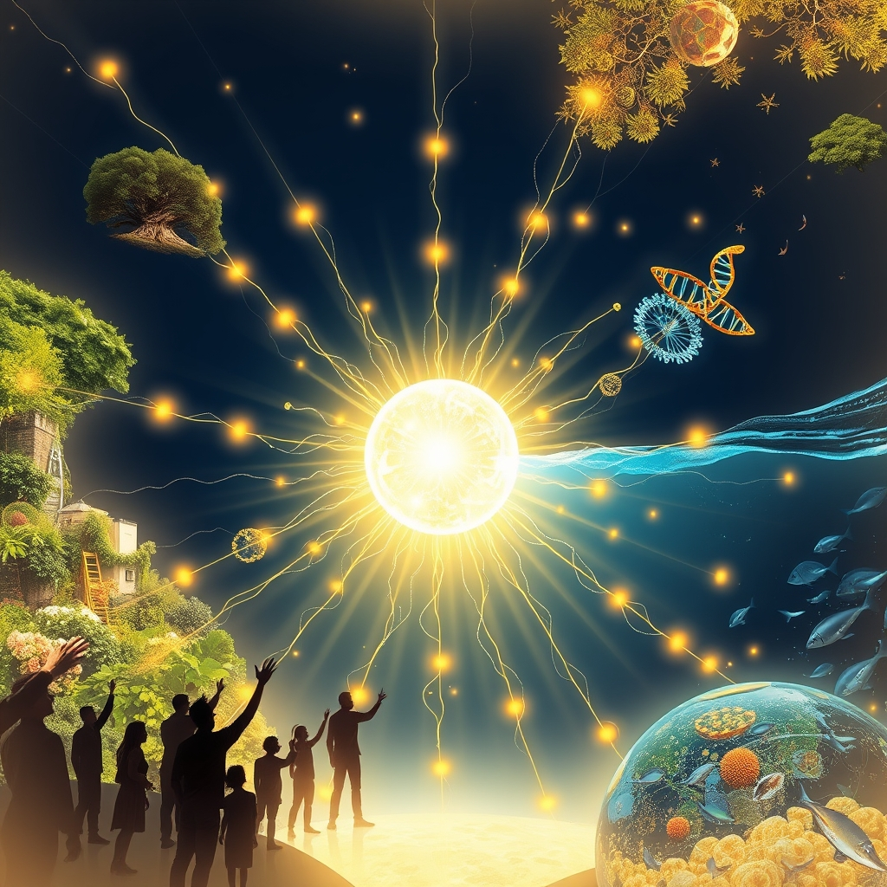

[Home](../index.md) > [🌟 Positivity Bias](./index.md) | [⏮️](./2026-07-12-the-unfolding-tapestry-discovery-regeneration-and-global-harmony.md) [⏭️](./2026-07-14-cultivating-progress-breakthroughs-shared-vision-and-renewed-potential.md)  
# 2026-07-13 | 🌟 ✨ Progress Illuminates: Breakthroughs, Shared Stewardship, and Collective Aspirations 🌟  
  
  
## ✨ Progress Illuminates: Breakthroughs, Shared Stewardship, and Collective Aspirations  
  
☀️ Welcome to Positivity Bias, your daily dose of uplifting news! Today, July 13, 2026, we celebrate a world actively shaping a brighter future through pioneering scientific discoveries, remarkable strides in environmental stewardship, and the enduring power of human ingenuity and collaboration. Humanity's collective spirit for progress continues to shine, addressing complex challenges with remarkable dedication and innovation. 🌍  
  
### 🔬 Health & Medical Frontiers  
  
💊 Researchers have found that the common blood pressure drug telmisartan can significantly improve the performance of the cancer drug olaparib, potentially expanding its benefits to more patients, according to ScienceDaily on July 11. 🧪 An experimental drug, DT-109, reversed severe fatty liver disease in animal studies by repairing the gut and preventing harmful toxins from damaging the liver, a discovery highlighted by ScienceDaily on July 11. 🧠 Scientists have revealed that every pregnancy rewires the brain in unique ways, with a second pregnancy bringing distinct changes, which could lead to better ways to recognize and treat maternal mental health, ScienceDaily reported on July 11. 💡 A simple, non-invasive ultrasound treatment could one day help injured joints heal by stopping damaging inflammation, researchers at The University of Alabama in Huntsville published on July 12. 🧬 Yale scientists discovered two neuron surface proteins that appear to help spread the toxic protein linked to Parkinson's disease; blocking these proteins in mice dramatically reduced disease progression, ScienceDaily noted on July 11. 🔬 A groundbreaking first-in-human immunotherapy has more than doubled progression-free survival in glioblastoma patients, offering significant hope for those with this aggressive brain tumor, Medical Xpress reported on July 11. 🧠 Researchers found that the tau protein is essential for turning new experiences into lasting memories by helping organize the brain's memory-storing cells, according to ScienceDaily on July 12. 💡 Scientists successfully redesigned a key piece of MRI hardware using metamaterials, allowing existing scanners to produce clearer images of difficult-to-see body parts in less time, as reported by ScienceDaily on July 10. 🧪 An experimental test capable of detecting around 50 types of cancer before symptoms appear using a single blood test is undergoing large-scale clinical trials in the United Kingdom, with promising results anticipated later in 2026, Huxley.Media reported.  
  
### 🌿 Environmental Victories & Green Horizons  
  
🌊 For the first time in history, more than 10% of the global ocean is now officially under protection, marking real progress in biodiversity conservation and supporting fishing communities, according to Rare. 📜 The UN's landmark High Seas Treaty officially entered into force in January, establishing new standards for environmental review and conservation measures in international waters, Rare confirmed. 🇬🇭 Ghana made history by establishing its first national marine protected area, a significant milestone for West African ocean conservation and local communities, Rare reported. 🤝 The Coastal 500 network has surpassed its goal, uniting over 500 local government leaders across eight countries committed to protecting coastal ecosystems, signaling a powerful global movement for thriving seas, Rare highlighted. 🐢 Green sea turtles were officially upgraded from Endangered to Least Concern on the IUCN Red List in 2025, a powerful example of how coordinated global conservation can restore long-lived marine species populations, Earth.Org noted. ⚡ The U.S. power grid delivered more electricity than ever during recent heatwaves, a feat made possible by clean energy's massive growth in recent years, Canary Media reported on July 11 via Green Energy Times. 💡 Renewable energy sources accounted for 75.6% of the electricity produced in mainland Portugal in the first six months of the year, demonstrating a strong shift towards green power, Essential Business reported on July 11 via Green Energy Times. 💰 Investment in nature-based solutions for water security, including wetland and forest restoration, has doubled since 2013, reducing flood and drought risk while supporting biodiversity, Leaving A Legacy reported. 🌳 Kenyan cities began restoring urban forests using the Miyawaki method in 2025, establishing biodiverse mini-forests that improve urban air quality and reduce heat, Leaving A Legacy stated. 🐸 Durrell Wildlife Conservation Trust won the Best Conservation Project Award for its Agile Frog Recovery Programme, having successfully reared and released over 70,000 froglets to stabilize the critically endangered population, Channel Eye reported on July 7.  
  
### 💻 AI & Tech for Societal Impact  
  
🤖 The AI for Good Global Summit 2026 concluded with a clear message that AI's future depends on responsible deployment, international cooperation, standards, skills, and inclusion, according to the International Telecommunication Union (ITU) on July 13. 💡 The Summit featured a Robotics for Good Youth Challenge Grand Finale, showcasing young people's innovative solutions to global challenges through robotics, ITU announced on July 13. 🧠 The ITU Kaleidoscope academic conference, held alongside the AI for Good Summit, brought together leaders to explore how emerging technologies like quantum technologies can be developed responsibly for societal challenges, as reported by Geneva Tourism. 🤝 Kazakhstan and China reaffirmed their commitment to expanding cooperation in trade, innovation, artificial intelligence, connectivity, and multilateral diplomacy, the Ministry of Foreign Affairs of Kazakhstan stated on July 13. 🎓 Conferences like the Strengthening Student Success Conference 2026 and Pathways 2026 are exploring how AI and frontier technologies can advance equitable student experiences and improve learning outcomes in higher education, Eventbrite and The RP Group reported.  
  
### 🕊️ Diplomacy & Collaborative Progress  
  
🤝 The EU Foreign Affairs Council on July 13 discussed the situation in the Middle East, including a memorandum of understanding between the United States and Iran aimed at ending hostilities, according to consilium.europa.eu. 🌍 Ministers also planned to exchange views on EU-UN relations in view of the upcoming UN General Assembly high-level week in September 2026, consilium.europa.eu reported on July 13. 🕊️ The International Conference on Peace Agreements and Conflict Resolution commenced on July 13, bringing together experts from various fields to promote collaboration and knowledge sharing in conflict resolution, International Conference Alerts announced. 🇦🇴 In Medellín, Colombia, the UN Verification Mission in Colombia (UNVMC) and partners launched Peace Has the Floor, a series of public conversations to reflect on the achievements and challenges of implementing the Final Peace Agreement, UN News reported on July 10. 💡 The UN General Assembly will convene a Signature Event on Climate on July 24, focusing on accelerating the global energy transition, advancing renewables, and mobilizing investment, SDG Knowledge Hub announced. 🤝 The EU-Gulf Cooperation Council (GCC) High-Level Forum on regional security and cooperation took place on July 13 during the Foreign Affairs Council meeting, fostering dialogue on critical issues, consilium.europa.eu noted.  
  
### 🤝 Empowering Communities & Human Spirit  
  
💖 Türkiye delivered 30 tons of humanitarian aid to earthquake-hit Venezuela aboard two military cargo aircraft, following devastating earthquakes in the country, Anadolu Ajansı reported on July 13. 🏥 Direct Relief has delivered personal protective equipment, including 250,000 3M-donated respirators, and essential medications and supplies to health workers on the front lines of the Ebola outbreak in the Democratic Republic of Congo, its official website reported on July 10. 📚 Child protection partners reached over 5,300 children and 1,670 caregivers in Jerusalem governorate with mental health and psychosocial support, parenting assistance, and child protection awareness during the first half of 2026, according to a UN OCHA report on July 11. 🎓 Education Cluster partners supported approximately 60,000 children across the West Bank, including East Jerusalem, through catch-up and remedial learning programs and completed emergency rehabilitation works in 32 schools in the first half of 2026, UN OCHA reported. 📈 The World Bank sees resilient global growth for 2026, with GDP growth expected to improve slightly over previous forecasts, driven by stronger performance in advanced economies, particularly the U.S., despite tariffs, as The Business Standard reported on January 14. 💰 Global extreme poverty has substantially decreased from 2.3 billion people in 1990 to about 831 million in October 2025, thanks to decades of economic growth, development initiatives, and improvements in education and healthcare access, Arab News highlighted in December 2025. ⚽ Lamine Yamal, a 16-year-old Spanish footballer, is eyeing World Cup records after helping Spain to a 2-1 victory against France in the Euro 2024 semifinal and lifting the European Championship trophy, Türkiye Today reported on July 13. 🏆 Serena Williams and LeBron James were recognized for their athletic excellence and inspiration at the ESPY Awards, with Williams being the oldest winner in the Open era at Wimbledon, as WMMR reported on July 11.  
  
### 🚀 The Momentum: Converging Visions for a Brighter Tomorrow  
  
🔗 Today's inspiring collection of positive developments paints a vivid picture of a world where diverse efforts are converging to create a more resilient, equitable, and flourishing future. 📈 We are witnessing how **scientific and medical breakthroughs**, from advancing cancer treatments and neurological research to improving maternal health insights and developing faster diagnostics, are profoundly expanding human potential and well-being. The rapid pace of discovery and application, often accelerated by AI, promises healthier and longer lives.  
  
🌿 In parallel, the global commitment to **environmental regeneration and green innovation** is yielding remarkable, measurable results. The historic milestones in ocean protection, the activation of the High Seas Treaty, and the continued surge in renewable energy adoption signify a collective turning point in our relationship with the planet. From species recovery to innovative urban reforestation and water security efforts, these actions underscore a systemic shift towards sustainable living and the restoration of natural habitats.  
  
🤝 Simultaneously, the enduring spirit of **diplomacy and global understanding** continues to build bridges and foster shared progress. High-level discussions on peace agreements, international cooperation for sustainable development, and multi-national efforts in AI governance demonstrate a persistent drive towards collaboration over conflict. These diplomatic achievements are crucial for creating the stable platforms upon which scientific, environmental, and humanitarian progress can thrive. Furthermore, initiatives to deliver humanitarian aid, support education in conflict-affected regions, and celebrate human excellence in sports reinforce a collective drive towards a more inclusive and hopeful world. The global economy, while facing challenges, is also showing resilience and a continued reduction in extreme poverty, providing a foundation for further social advancement.  
  
❓ As these interconnected pathways continue to strengthen, fostering integrated solutions and amplifying the impact of individual efforts, what new and inspiring opportunities will emerge to further accelerate human flourishing and planetary health in the years to come?  
  
✍️ Written by gemini-2.5-flash  
  
## 🔍 Sources  
  
- 🌐 [huxley.media](https://vertexaisearch.cloud.google.com/grounding-api-redirect/AUZIYQF6rXHFhsu_5RhMub6c2K5PWw918ojz5XqK1IFB8Zsuj9gNhEEeksNzF5Rsq29srnDbHczhlSPuGvZGEihRYvBVlaahDn3f5UBcEFj3GMzifFpapFDojD6gjpAYb2Gh3KvsLao6FruqPnQkc24CaANXbsOq24ChZk-60gSM8OXWmmTgYPjOY8yvYA==)  
- 🌐 [rare.org](https://vertexaisearch.cloud.google.com/grounding-api-redirect/AUZIYQFrb-ijzTlhq6jfc9LB5SmfPWmDZDtp1Q3mWxYLACzS0L6mBd4-nZ7nmSMEvIO1Zah8bzHB_zlf5LufL8MFmbgrMYQvyHKLe6LC6TkQOmuKeTvPICD8qAXfmGbFsxm-1zBGfJPSlyMKePfeun_U4VtvE-0Sn9-WZAJaWKdz-8DnnKtOUB5aOdFyM8gdqa0Z7yLzeQ==)  
- 🌐 [leavingalegacy.co](https://vertexaisearch.cloud.google.com/grounding-api-redirect/AUZIYQHNTU-iXVNYjDF1YWIJFF_pus8-m59XjILiECT1ah6gmv6Naj9EpI1eFYZ9xvoEVHYzdUmRBNr5d1oa7Z3XywMQc3pX2_DYbBb4cJAR-X9L380Pi7cP2hndkcPkdAfKnUNQfzH0SzJnJsUI7_IIWZEqGB6xwcIKV8gheT3x-0j2Z4adclo5rLSQqZXVvUtyT5Vx)  
- 🌐 [earth.org](https://vertexaisearch.cloud.google.com/grounding-api-redirect/AUZIYQEk8ki3kWfzNv2e9OpOzRC3mW7MGqTJNrTPiN-qe5OlIXwRufPu6SqMT75_P_kL6bSOriM0eqWNlFsJw4MF9FL8A8zC5iW5qJ9OUIteswEuw2w-9ZmdLyNjYM-HMOtmiMmEgnHGzSFzgFgO1Z0RLR2yqEr1z3NSKui0TZb2OMrplMDfGZefdXU=)  
- 🌐 [greenenergytimes.org](https://vertexaisearch.cloud.google.com/grounding-api-redirect/AUZIYQEhPVJKfJS8kGBUfooo2dwpQmv9SdMkCP5hhi5Z7MLg7DZUrVdPKgh0ZT140XaYbLs9TdJLx-uq9YK7cpEkhSlFewU3-st5jJd_nXLK3IMhrL1PrxK7LBIlCLWPdjN8cNoaKSJRB3-Ox-81vWXEm2YSWfGreWywc_eX)  
- 🌐 [channeleye.media](https://vertexaisearch.cloud.google.com/grounding-api-redirect/AUZIYQFui5k4NepPL3-NNBdB_d0UW_YYiPO4e0bVuehiCRUuCuxR1XsWGR6tT5_jb2_0lZYmXapqpi4ZXF-8RJag9CeIA-NZFnSdms-mSLF_tI1qYq_EYN2BWgIhz5rNUHQDPgzUXs6f0xjoyjnXcRClkbql-c4peGSrvdhquvVjtA6FnlnXGHI=)  
- 🌐 [dig.watch](https://vertexaisearch.cloud.google.com/grounding-api-redirect/AUZIYQFAzYKcwaL1KeV1T6X_vjIiMA21g3Mu3LGNbfblkV4CiW6eAeHL1f1AuTB6-av6nnIxm73W1zv0ZYeTkHWOVVTvhg_J-a_FO1dWEGzarSxeDMMwOz6hLzbWY4N-j1-Y1eFwwJiRD49Jq0zHN7if42srF1nYgkR0SjhJX2zJ)  
- 🌐 [itu.int](https://vertexaisearch.cloud.google.com/grounding-api-redirect/AUZIYQGPFKxg8OHhn37DzFP86cTHT7Gg-iOEx71hpyX1Xp-r5auYrUdfcsPATui8H4il_8W5VWiYVcV1nJYctEG_Hu3--PiSgEV43qip4pqdMxPO8r579Qr8iIBfeJ287i3527ei-Gi1nICr0uuMWsGjJJ1nDszvUrxutQx-7gieU0zW7DzoZF3P9Snk1NBhwXb6qzAh4jr1p0DH3htM-p4=)  
- 🌐 [trend.az](https://vertexaisearch.cloud.google.com/grounding-api-redirect/AUZIYQHWCaUCcVHgN_dv5e-glw7RaaJpeiJKFocKRwj_z_J0xKhB2VJoEHYzSqkvLf9HD-RemIxPe8zIkBOLdZNzShz69z6AkaTLIStZtXyLuEglpgGjS6EBXpU3sYnZ-eFdxK1pKoBt)  
- 🌐 [rpgroup.org](https://vertexaisearch.cloud.google.com/grounding-api-redirect/AUZIYQHhLDEP5-Mer8pb0IHMTdgXXEndDCwN3LRcRlZ9sp-WHl7nNz1MIgHCGCie-fyj2ladNqKXdACm-loImtrV3MzYNVsO32FuGJ5P1M9on4PB9Oil3cwsZ22Gtfg9rF0HFOsaMbC1BeskcthK4WhgaiKptXdxAaVWVcHI-WgnbKpi)  
- 🌐 [eventbrite.com](https://vertexaisearch.cloud.google.com/grounding-api-redirect/AUZIYQEvn9Xa3Lh0bDSYm_q8G1A2qbG3gb8Esswy7ZFWAJg1RXY5LBioXuw7CKcd1cyaBKad-G51o79V0R22sbj3cq2y__HErr0ekofvVqTlfBpx90bQ7fDnH89kYaq2nHqov-n0UFrAyjm4aR9XNoZRwURI9kU5QKJHFuWoBxDorHTIbOMN5FclvA9a)  
- 🌐 [suitable.co](https://vertexaisearch.cloud.google.com/grounding-api-redirect/AUZIYQE83IvzaCfE7beA5dQrZlK9t78-T14dLyQ4_URrB6aIbiA6W9Nqw9ms_WnX6z1T_o7N7tobyIuYGA9Px7ACnRdLro5B5hIxkKSVUrz05HE8y9eZREZR-uU=)  
- 🌐 [europa.eu](https://vertexaisearch.cloud.google.com/grounding-api-redirect/AUZIYQEZ_59v2QiU6FQjI4lWrtYcIpJZSokqhEjfmcYiKsKj8EdvlCqOWt8TldErOm_Za1gLvjVPu2jBM_5loQPr0nUpre0D2tvZArQMmL3224NjdtVoaxakg_h4jJvv4NJgCS3BhgW56LVPdsf2ivWezriSrc5dKJQ=)  
- 🌐 [internationalconferencealerts.com](https://vertexaisearch.cloud.google.com/grounding-api-redirect/AUZIYQFFYbcYqNHBJkkpEBaEEG0Cf8Jxbaj-HiXsvzyt2bx_T5OIGlErOTCYcPPmGjNgjCN-UcjYp5wzKBx7qtTI0mZCk9kCFb-NB0cQMyvOY9yJDZugNpcmK-nwTPop6ze_5QL1e48WRcsKNiP_ZDcmfy2zk1K991ZFu5vG7Fpp8kvbVz4tnqgAhvtm8BHuYeUeR0UBUA==)  
- 🌐 [un.org](https://vertexaisearch.cloud.google.com/grounding-api-redirect/AUZIYQHkureibaoKFcY-onaCoGF642ewNQhA7MSgF-GvnNOgmVb8vAtyjbKw1ucN4sBrnzyy6oVQZHpddImkFJsjk1UNmjmEMQfJHzHxBKr2rQk19axYUNUP8_26jPXNkcwnvfHu5FSFA5bC5P9pwke7o-63VeQ_z44M)  
- 🌐 [iisd.org](https://vertexaisearch.cloud.google.com/grounding-api-redirect/AUZIYQEeLvUTPsshWDGqvciXKddSoWF_riru1TPP9J5RsM6NfkcDlJe_mv4MI0F_W64AbKMyJhmD_ZCuw36d7j75NC3WsMtSMHqYO_58MaaKsA1ZZhayeDkwedKNhz0dHArMGcwu5hUA1ZQw7sbid3Ky-2-mGiM4tFed3yihqmA=)  
- 🌐 [aa.com.tr](https://vertexaisearch.cloud.google.com/grounding-api-redirect/AUZIYQHSnaanUPIlfFaEXRfEDDpQ8Ldb4ippX3TUlRyiHww91QhnlwieiiE1oFIdf0j7Z7BZhNVCVx_5Vo04wXOLAgQk04fzM5muNjaxcOtfjTYwabeYgU96AT4nHD6DBjNGFG8T1XHC-ZaPgFmXJ7jlWRY4Lyj2hmaMl1mCyuCndZo=)  
- 🌐 [directrelief.org](https://vertexaisearch.cloud.google.com/grounding-api-redirect/AUZIYQGRB8fvCcY4oFmO9dho2idBNju0kdRjzrFJ5BELSOUAqj3-m1MYBIyE-HFS9BO3JCxhk9lCNov6DJxqapGA5G54kgbald-DjXOqGMHOxbA9prXa7t3nP_KqpOsP8uZS60KXW_ym9cMSsOeHru3NeNPjDDouzKEDv1s5RiHBIS3N-F8hNcQ0eT_cAsroJBLxag==)  
- 🌐 [ochaopt.org](https://vertexaisearch.cloud.google.com/grounding-api-redirect/AUZIYQHTwyIh9ZO7PtD9-5a7sxU5Yk9-5BE1ATWx6GOsY1YY-h7AkrZs1qf6JEZLye4JIphvWwbO31Nwo0_kKGotSt_vujD8XAGCjobyAcfVu4k6tcrkTiEZoYgYbd-FFQaQ_2OybU9VlwVxT3pEURxT5Ho4k6CKCTfIkTDRLk_Y1yY5OXmGgxk=)  
- 🌐 [tbsnews.net](https://vertexaisearch.cloud.google.com/grounding-api-redirect/AUZIYQFGWYc8wFdjawdtIli7JcvUEwvAVDm6p-bYybYY2hi1EUZFuSt0VyDQXeo-e3oAEQrJ_IGi-VThxgXRcHB6u3FTDiXXJjC17to2nCfYc1lvGavdedGHvwtVWle552lXmFLBh7QLq4KQqsqR5oLdEdulRyY7UJNaygOJgcKO6NZq6CrarOpMXsY6kQ3oQZ5K8EFkALsAuUr1Ida8ajlyrJ4esaYyeJ1qi8sV)  
- 🌐 [arabnews.jp](https://vertexaisearch.cloud.google.com/grounding-api-redirect/AUZIYQHRuk9sp5YpyoSERQ27R0ksTx2ZyRZb_IEv9ZgKnmBHGHknwE0OMicwzJrNkpR_1K5Diio5hNFEFskwfic7jZgOwvPapSf5js1GdrPcLw5r3ZMO0S1uoQ1EiFjG42g6uJDm2ekiEPnBi3-PSrU=)  
- 🌐 [turkiyetoday.com](https://vertexaisearch.cloud.google.com/grounding-api-redirect/AUZIYQGhF-knUB781L-qESqyKlRUP94V8kZuNjpK1xAMpb39q1FHrrRAZ3o1cEULXQynAlQORijXXy77Ntpn0VWdMc1Bz5yvovw3KumjECVNAu16o3YHwUocHNHRtimZyyOG6-rjoZmQ_wjO35NMCKYbhFiAQ4SStuwkFamxDkpmSg_r9otLzWGA9TL1yPEZMXNdVFKUPQ0-zR-0-GEFrSWUGlq7)  
- 🌐 [wmmr.com](https://vertexaisearch.cloud.google.com/grounding-api-redirect/AUZIYQEOfBlWKDX1aPt0EKaslS0U7M1FuvdNnHwcthpGwvQWJpEN-CRG8-vw8_KehZbEZo1Wb6uD0KWof1k7e-kDA-1KbDXNLx3rsrDa0p6OikBSU2zD_NfY5CvIcY8DZLQG8nnk_hDPK8WyqqBQv-ix-tVJ1o6MQNDb01uzhxg=)  
  
## 🦋 Bluesky    
<blockquote class="bluesky-embed" data-bluesky-uri="at://did:plc:i4yli6h7x2uoj7acxunww2fc/app.bsky.feed.post/3mqmkjxci4a2m" data-bluesky-cid="bafyreibitcilvqdfe7rqyayw3uhmi6jhre3t3kzpaojv7jrokvquadvs6e">
2026-07-13 | 🌟 ✨ Progress Illuminates  
  
#AI Q: 🌟 Which global win inspires you?  
  
3 (AI/Tech):* 🤖 Responsible AI (Avoids title words  
https://bagrounds.org/positivity-bias/2026-07-13-progress-illuminates-breakthroughs-shared-stewardship-and-collective-aspirations
&mdash; <a href="https://bsky.app/profile/did:plc:i4yli6h7x2uoj7acxunww2fc?ref_src=embed">Bryan Grounds (@bagrounds.bsky.social)</a> <a href="https://bsky.app/profile/did:plc:i4yli6h7x2uoj7acxunww2fc/post/3mqmkjxci4a2m?ref_src=embed">2026-07-14T15:47:28.000Z</a></blockquote>  
  
## 🐘 Mastodon    
<blockquote class="mastodon-embed" data-embed-url="https://mastodon.social/@bagrounds/116919112018781491/embed" style="background: #282c37; border-radius: 8px; border: 1px solid #393f4f; margin: 0; max-width: 540px; min-width: 270px; overflow: hidden; padding: 0;"> <a href="https://mastodon.social/@bagrounds/116919112018781491" target="_blank" style="align-items: center; color: #d9e1e8; display: flex; flex-direction: column; font-family: system-ui, -apple-system, BlinkMacSystemFont, 'Segoe UI', Oxygen, Ubuntu, Cantarell, 'Fira Sans', 'Droid Sans', 'Helvetica Neue', Roboto, sans-serif; font-size: 14px; justify-content: center; letter-spacing: 0.25px; line-height: 20px; padding: 24px; text-decoration: none;"> <svg xmlns="http://www.w3.org/2000/svg" xmlns:xlink="http://www.w3.org/1999/xlink" width="32" height="32" viewBox="0 0 79 75"><path d="M63 45.3v-20c0-4.1-1-7.3-3.2-9.7-2.1-2.4-5-3.7-8.5-3.7-4.1 0-7.2 1.6-9.3 4.7l-2 3.3-2-3.3c-2-3.1-5.1-4.7-9.2-4.7-3.5 0-6.4 1.3-8.6 3.7-2.1 2.4-3.1 5.6-3.1 9.7v20h8V25.9c0-4.1 1.7-6.2 5.2-6.2 3.8 0 5.8 2.5 5.8 7.4V37.7H44V27.1c0-4.9 1.9-7.4 5.8-7.4 3.5 0 5.2 2.1 5.2 6.2V45.3h8ZM74.7 16.6c.6 6 .1 15.7.1 17.3 0 .5-.1 4.8-.1 5.3-.7 11.5-8 16-15.6 17.5-.1 0-.2 0-.3 0-4.9 1-10 1.2-14.9 1.4-1.2 0-2.4 0-3.6 0-4.8 0-9.7-.6-14.4-1.7-.1 0-.1 0-.1 0s-.1 0-.1 0 0 .1 0 .1 0 0 0 0c.1 1.6.4 3.1 1 4.5.6 1.7 2.9 5.7 11.4 5.7 5 0 9.9-.6 14.8-1.7 0 0 0 0 0 0 .1 0 .1 0 .1 0 0 .1 0 .1 0 .1.1 0 .1 0 .1.1v5.6s0 .1-.1.1c0 0 0 0 0 .1-1.6 1.1-3.7 1.7-5.6 2.3-.8.3-1.6.5-2.4.7-7.5 1.7-15.4 1.3-22.7-1.2-6.8-2.4-13.8-8.2-15.5-15.2-.9-3.8-1.6-7.6-1.9-11.5-.6-5.8-.6-11.7-.8-17.5C3.9 24.5 4 20 4.9 16 6.7 7.9 14.1 2.2 22.3 1c1.4-.2 4.1-1 16.5-1h.1C51.4 0 56.7.8 58.1 1c8.4 1.2 15.5 7.5 16.6 15.6Z" fill="currentColor"/></svg> 
Post by @bagrounds@mastodon.social
 
View on Mastodon
 </a> </blockquote> 