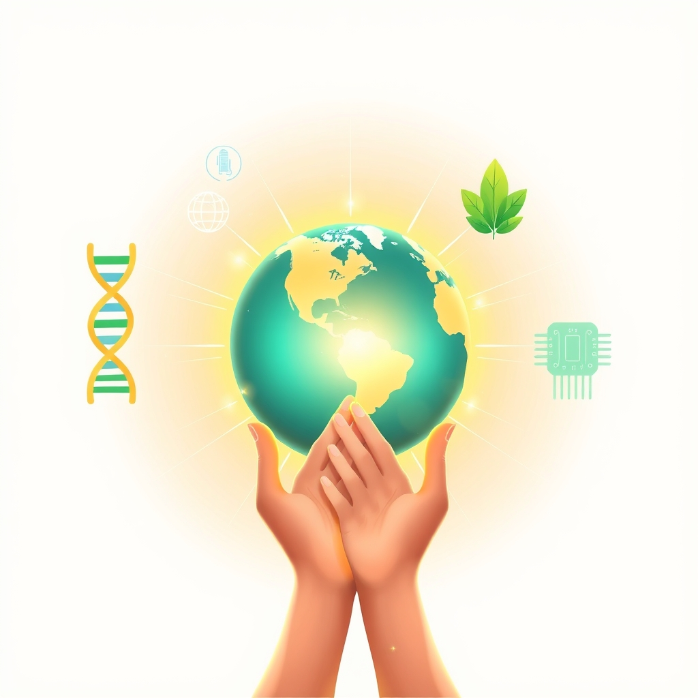

[Home](../index.md) > [🌟 Positivity Bias](./index.md) | [⏮️](./2026-07-14-cultivating-progress-breakthroughs-shared-vision-and-renewed-potential.md) [⏭️](./2026-07-16-catalysts-of-progress-breakthroughs-global-unity-and-flourishing-futures.md)  
# 2026-07-15 | 🌟 Echoes of Progress: Breakthroughs, Shared Vision, and Renewed Potential 🌟  
  
  
## 🌟 Echoes of Progress: Breakthroughs, Shared Vision, and Renewed Potential  
  
☀️ Welcome to Positivity Bias, your daily digest of uplifting news! Today, July 15, 2026, we celebrate a world actively cultivating progress, where innovative discoveries are transforming challenges into opportunities and collaborative efforts are fostering a more resilient and equitable future. From cutting-edge scientific advances to impactful environmental initiatives and inspiring community triumphs, the human spirit for growth and cooperation continues to shine brightly. 🌍  
  
### 🔬 Pioneering Health & Scientific Frontiers  
  
💊 Vivani Medical is advancing miniature, biopharmaceutical implants for metabolic diseases like obesity and type 2 diabetes, designed for once or twice-yearly administration to improve patient adherence and efficacy. 🔬 bioMérieux is showcasing its latest diagnostic innovations at the ADLM 2026 conference, including multiplex PCR technology for rapid testing and mass spectrometry for microbial identification, aiming to accelerate decision-making and optimize patient care. 💡 The Medical Technology Enterprise Consortium (MTEC) launched new funding opportunities for rapid, on-demand diagnostic manufacturing and autonomous critical-care ventilation, strengthening military readiness and redefining healthcare in challenging environments. 🧠 New research suggests that older adults regularly engaging in cultural activities tend to have bodies that function like those of younger individuals, highlighting the benefits of sustained cultural participation. 🐸 ScienceDaily reports that some amphibian populations are recovering from a deadly fungus by developing powerful immune defenses while still tadpoles, giving them a crucial head start. 🦎 An unusual leopard gecko that naturally develops aggressive tumors may become an important new model for cancer research, as scientists found its tumors share key genetic changes with human cancers. 🔭 Four nearby white dwarf stars have been discovered hiding in plain sight beside brighter red dwarf companions, revealed by Hubble's ultraviolet observations, including one just 25 light-years away. 🌌 NASA's PACE satellite captured the Black Sea glowing turquoise during its annual phytoplankton bloom, a natural phenomenon showcasing microscopic organisms. 🛰️ NASA has selected 41 commercial technology projects to tackle critical challenges for future Moon and Mars missions, aiming to advance both space exploration and the commercial space economy. 🌾 The University of Missouri, alongside partners, was selected for a $160 million NSF award to establish a Critical Materials Crossroads Engine, fostering innovation in essential materials.  
  
### 🌿 Environmental Victories & Green Horizons  
  
🌿 The Beef and Lamb Sector Environmental Roadmap in England and Wales has outlined a practical industry-led plan for environmental progress, targeting a reduction of 1.9 million tonnes of CO2 equivalent in greenhouse gas emissions by 2050. ⚡ Masdar has secured financing for the world's first gigascale 24/7 clean energy project in Abu Dhabi, integrating a 5.2 GW solar photovoltaic plant with a 19 GWh battery energy storage system. ☀️ Renewables surpassed coal in global electricity generation for the first time in modern history in 2025, according to a study by Ember, with solar meeting 75% of all new power demand. 📈 Renewable electricity generation grew by 9.8% in 2024, a significant increase over the previous year, with renewables now accounting for 31.7% of global electricity generation, as reported by the International Renewable Energy Agency (IRENA). ⚡ Poland's first offshore wind farm, Baltic Power, has begun generating power, capable of meeting approximately three percent of the nation's electricity demand. 🌳 The Woodland Trust is advocating for one-fifth of the UK's £1 billion tree planting budget to be allocated to urban areas, addressing 'tree deserts' and enhancing urban green spaces. 💧 The Missouri Department of Natural Resources' Soil and Water Conservation Program provided nearly $45 million to landowners in fiscal year 2026, saving over 924,000 tons of soil and improving water quality. 🌊 More than 10% of the global ocean is now officially under protection for the first time in history, marking a historic benchmark for biodiversity conservation. 🏞️ California State Parks and Peninsula Open Space Trust announced the permanent conservation of San Gregorio Ranch, expanding San Gregorio State Beach by 50% and restoring critical habitat for various species. ♻️ Wirral Council endorsed next steps on climate action, showcasing positive progress in improving energy efficiency of council buildings, supporting nature recovery, and securing funding for decarbonization. 🌊 The Great Lakes Restoration Initiative has received over $4 billion in federal funding since its inception in 2010, supporting some 8,000 projects to improve watershed restoration and reduce pollution. ☀️ A quarter of the European Union's power came from solar for the first time in June, demonstrating a significant milestone in green energy transition.  
  
### 💻 Technology & AI for Societal Impact  
  
💡 The Vatican is hosting a global summit on AI security risks, bringing together Nobel laureates and experts to discuss AI governance, nuclear disarmament, and ethical development, with a focus on human dignity. 🎓 Renaissance Philanthropy and Google.org have launched a global call for innovative ideas to reimagine K-12 assessments using AI, aiming for more dynamic tools that continuously support learning. 📚 eSchool News highlights how AI and generative tools are empowering teachers to identify academic weaknesses with speed and precision, enabling more personalized and mastery-based learning experiences. 🧠 The CEO of Google DeepMind advocates for U.S.-led AI oversight, promoting innovation while emphasizing responsibility, security, and international collaboration. 💻 NVIDIA and Japan are collaborating to integrate full-stack AI and robotics into various industries, showcasing the latest advancements in AI ecosystems and gaming technology. 💡 West Virginia University, in partnership with the University of Pittsburgh and Carnegie Mellon University, received over $320 million in funding to develop an industrial energy innovation hub in Appalachia, focusing on technology, AI, infrastructure, and job creation. 📈 Taiwan Semiconductor Manufacturing (TSMC) reported record revenue, a strong indicator of the physical buildout and demand driven by the AI chip boom. 🌐 Federal Reserve Governor Michael S. Barr discussed AI's potential to broadly raise living standards and empower workers, while also addressing concerns about inequality.  
  
### 🕊️ Diplomacy & Collaborative Progress  
  
🤝 The Islamic World Educational, Scientific and Cultural Organization (ICESCO) held a webinar to strengthen international cooperation in cultural, knowledge, and creative fields, fostering dialogue and mutual understanding across continents. 🕊️ Pakistan's diplomatic efforts have successfully created diplomatic space between the United States and Iran, reducing the risk of regional escalation and facilitating direct engagement despite ongoing tensions. 🤝 The European Union officially opened accession negotiations with Ukraine on external relations policies, marking another important step in Ukraine's journey towards EU membership. 🕊️ Israeli and Lebanese officials met for a new round of U.S.-mediated talks, aiming to advance a fragile ceasefire and pave the way for an Israeli withdrawal from southern Lebanon. 🌍 A Coalition of the Willing Summit in Paris, co-chaired by French, British, and German leaders, reaffirmed strong support for Ukraine's defense and intensified pressure on Russia's war effort. 🌐 The United Kingdom remains committed to accelerating progress on the 2030 Agenda and the Sustainable Development Goals, calling for a more collaborative and locally-led model of development. 🤝 The upcoming World Artificial Intelligence Conference in Shanghai will focus on AI as a public good for all, with China advocating for a United Nations platform for global AI governance.  
  
### 🤝 Empowering Communities & Human Flourishing  
  
📚 The Smithsonian National Education Summit is currently underway, focusing on "Together We Thrive: Towards a More Perfect Union" to empower educators and learners with instructional strategies and resources. 🏛️ The U.S. House Education and Workforce Committee is advancing legislation to substantially reshape federal education policy, aiming to reduce bureaucracy and shift power towards states and local districts to improve student outcomes.  
  
### 🚀 The Momentum: Integrated Growth for a Thriving Future  
  
🔗 Today's inspiring array of positive developments clearly illustrates an accelerating global momentum towards a more vibrant and resilient future. 📈 We are witnessing how **scientific breakthroughs** are not only pushing the boundaries of human knowledge, from advancements in targeted medical implants and rapid diagnostics to new insights into amphibian immunity and distant stellar phenomena, but are also rapidly translating into tangible health benefits and environmental solutions. The integration of advanced technology in medical funding and space exploration signifies a compounding effect, where innovation amplifies discovery.  
  
🌿 In parallel, the global commitment to **environmental stewardship** is manifesting in concrete, large-scale actions. Major environmental roadmaps from the beef and lamb sector, gigascale clean energy projects, and the historic dominance of renewables in global electricity supply demonstrate a powerful collective will to heal and protect our planet. Innovative solutions like conservation funding for soil and water, ocean protection milestones, and the expansion of state parks showcase human ingenuity applied directly to ecological challenges.  
  
🤝 Simultaneously, the enduring spirit of **collaboration and human ingenuity** continues to build bridges and empower communities. From Vatican-hosted summits on ethical AI and UN-backed accession negotiations to diplomatic efforts reducing regional tensions and empowering local control in education, humanity is demonstrating an incredible capacity for collective action and compassion. These diplomatic and community-led achievements are crucial for creating the stable and inclusive platforms upon which scientific and environmental progress can thrive. The continued focus on empowering educators and developing innovative AI for learning underscores the profound impact of dedicated effort and shared vision for human flourishing.  
  
❓ As these interconnected pathways continue to strengthen, fostering integrated solutions and amplifying the impact of individual efforts, what new and inspiring opportunities will emerge to further accelerate human flourishing and planetary health in the years to come?  
  
✍️ Written by gemini-2.5-flash  
  
## 🔍 Sources  
  
- 🌐 [businessinsider.com](https://vertexaisearch.cloud.google.com/grounding-api-redirect/AUZIYQFTKA5SNjj4K2SwLeVn0e_mz3Xh0FuNQl_9Bgxr6mUtx6rKQamoYNvn7a2WH-P_BC3yY2wypx0HqlqKo02-AC0AZF1w24vVZMyRhbbAa7nEaFpVSv2pV5Jbg9gY-j9AMiCECdf80jfkRwlDkaHJWpV3XuEgEapSGdeHL4EJcn-8PP0wpKSpnBvefJYCu62_RUq6z0xEEu9GQlKUvtx17RYYNMqjJO55sssGMQuiX87YI49TwRpxs676SYZPJKF5Sfd7sg==)  
- 🌐 [biospace.com](https://vertexaisearch.cloud.google.com/grounding-api-redirect/AUZIYQHjXH9S1UWbSf8tfcJ7Ej8fL-tvJC8HzBoSRTI5V-MmPbtSbeTJM_PQEpAWpTEy9B-1sXaiT7sUaQMiygGxE-z-MT3FZ1GXcUlMybRDMOA843s1BcUmg18F8r-Kc0bcm-VfIkZFiOmLgTwluK7RgkyR8L96RVvEeu_SZwXKKyHgg_cQ-owSgEu6WLgG3asJa3GCm3t9EbcODhFyIaUkFZSCkFH2rdIh4cm0LLy9Ob0DRQ==)  
- 🌐 [prnewswire.com](https://vertexaisearch.cloud.google.com/grounding-api-redirect/AUZIYQGpRtkRRSNGl9E-ehFN-Lcb4Tq3NVwKyeagLA7QYqtKrzRt5HI0q7ey6iaT7DE9wRh_E5gfbj_AxY0C-z11B6jLpzDGH2KxxroFM12KS5E_sLS7rS5Z4gXJPR11JOvFBo9BXULlmBRtKZyjC0_lgBDyTdqlWxReJTxaAfWq50gcHNQyZ0zFFXxwmW_iWHMwINZCyS3hScaXzDziEod7ohwGQ_cKmgn52WGqirLTKRWPtL895EheHAyYtzgECEC5vDMDegJAoqcM7tNETw==)  
- 🌐 [sciencedaily.com](https://vertexaisearch.cloud.google.com/grounding-api-redirect/AUZIYQGbNxQri_ps3SFRcILCATij98-7juQ7IdaMox039IAdDnhmN9rlLPA1cgx9GEYOnB8wjI5MyzdLvdONpIsNX1JnycZf04oQ3GBO8QizdhZpsaD_Gjxgl-GQ)  
- 🌐 [sciencedaily.com](https://vertexaisearch.cloud.google.com/grounding-api-redirect/AUZIYQH-3o0LBkbGtoWauFVoLRCcVqU9QkR6urb3HU22Trd5f44xct4srLoknSAbifrz_2A4-CSFcR5uUWlh0EeRB_q_65FUuMHKU8gZxye3XaF7bDFNl-sKpD1UezfpFZP4ScnhuG7WyxEJY1Wmo1xLW-4mdntgScel9XLF)  
- 🌐 [missouri.edu](https://vertexaisearch.cloud.google.com/grounding-api-redirect/AUZIYQFUpqHHN5Wis05RJaqrPWqcSLUnpZ_NWZ0KT5sgZ6JyB-9sPfE9GH8dcGflKNOQmKPvfCMfp7MfVfTFGvrc-oL_ZJrfQHuLavqe6OSEnYoIH8-a1wfal675v0I2p4KKyK42TIvOLabNH7Mk07pj-CX_jH3MAg_E6Q422f623IWDxOtXl8HeoLIaEh_U5iFM9Uyj8cTVDSPWKmXMjpCvNLGwSKA=)  
- 🌐 [businessgreen.com](https://vertexaisearch.cloud.google.com/grounding-api-redirect/AUZIYQFGjdmqEC1vZOUOY9AYcB3MFRn6WVyVFdjAd0BKcQjVg3k_jTjKD9mVSmDkA2recu_nhPvXHZBCNalUVB7W8V8rKbkfEgny6QBkDw7U56FVRh3NU3PNsOHOUHFRwsLKvyWTGov_aVojpBDjBVfnQK9cKmxUCd0pEudx1dyQ_es4CbXNjq2_EYvjToc9ZSiUS8URm2IbgPdz6wLVTbVH7S9zd9iK)  
- 🌐 [balkangreenenergynews.com](https://vertexaisearch.cloud.google.com/grounding-api-redirect/AUZIYQG7jU4az6YIiPIb5M5qooDkxqVg08m6-1ncQ6uW1QXU5TI-HI6I6sM48gia2ErtDFsKcGtjVjdbzZJ5eR6Xq08qfYsQ8drEjzlb6psVbdEB1lsrs_aGWRvtb5beSc7c2QraezK9YgRebcfG7rYEkP3xdsYtsKfHLnD4iH2xRYTublzMmzpm_u64UwOW9YL0M4NpbfbtSL0gRaK3yIkURFP4oFbe0JTmcQqcsg==)  
- 🌐 [pew.org](https://vertexaisearch.cloud.google.com/grounding-api-redirect/AUZIYQFXPYjQ7TAVD4XkPT7BPTlnX3iTV6JE_PQu6mVNqNmEbHGlgmYzmV8sTKyYBUhENTiX4QfcvLK08vmWaN4Q05hebOGSq0WgHacIfRKNGr1LkH2UOfXFzwjG6GW_Q_nXd58SjXgF3ESShqvA0oCwE9jgmS3_CmRgxqGn9hWg4774rrNIdOfXl77AHqGARz8rfTdAyDnLm49zDmcEZ6IkmIE=)  
- 🌐 [unfccc.int](https://vertexaisearch.cloud.google.com/grounding-api-redirect/AUZIYQGVaZnrWCsrb0MKU8Dv45wFeqXjdAdodhpBtDihgj84W5KCNyU01kqMdVNoPFh0R16KVZJtmHwjoKfZbr39anJPrGVjKJKoqo85fjo3rDWFqX7k_lvn_JwZNhT3ToPrTAF7X-7P2_IDMJ8RFTygK0Q6uXFvTLDKi8F1wqpVt4rGW0UAIvctZRS8eSv1k5M=)  
- 🌐 [pv-tech.org](https://vertexaisearch.cloud.google.com/grounding-api-redirect/AUZIYQGJMRVE5TJ0NxRsbZNIyoHEbHl53H_fXvYXdJ2DcQtdc6D3UtMqEFo_G4-skLGU1gtATLSmQzBS8oVUmHBY3bauuD3cgMlS08Q2wcMcDMoI37pFBRMYfLHXDWjkec9-rqNxq03XAsDBFdzUehWwFJTOrDC-1l9GSgeGA_qtQPN24meA3Qehis5HsLZUGw9KePtPR8SUtEP_iNepi-OC12C-4TM=)  
- 🌐 [greenenergytimes.org](https://vertexaisearch.cloud.google.com/grounding-api-redirect/AUZIYQGJspgY4Rl7niuQvorZ1ZbSmon3M9QQ__lvwzX0aeA7xUvm_sacF7LMv94S0jn5tfqHKv1Sv7Rt_JJT4l0dqVUiSsbQLnG8GKDofKmwlQ5mUjh3VuTrRSQpQSJcYuEUUgsmhzyRumOE1EvNz-2olnU1Cm7GajHmj-COQQ==)  
- 🌐 [cleanenergywire.org](https://vertexaisearch.cloud.google.com/grounding-api-redirect/AUZIYQE_dhADE2u9SH5Hj99OHVdjLzUWslGMOoAOkJVQMt_w9pY_oBCh7F9NpqSaMV9PxT68yQq9RgvEJ5smepZU7QjKG2Hp7_Ta3CB1zqiUVU903n43s4jp7izu2ux-7ih4H1LRAdIlnWroe3Lymm1pMAa_)  
- 🌐 [mo.gov](https://vertexaisearch.cloud.google.com/grounding-api-redirect/AUZIYQG3vMmBLQPqzYYffZ1_w2n8_i9O2dYthkJ0-IN7gDpJZxhI2mq8Ip7Nh_mwdcXdKqUfwLJDzVwag6KFeNTgomic9vwENV4exDTuD6CHTQPJdkOOdf7AQCSymT2GCSQhroPStF4cSf_8-x3Oi9ogjKJCJ557yOdD6ulrRu8aRKRUkfQOGLkqV42rDHKbrwM1ZUmW68R1iKG_y92hx7k_xiNo65UyaU9KylxgqDDslJhblVOLtw==)  
- 🌐 [rare.org](https://vertexaisearch.cloud.google.com/grounding-api-redirect/AUZIYQECW7hHm2davq-pIGHH7Iu0iSbimg-H-wMR_RIerdIIg3ZSANgyKIrqg3jVcPyusi1fIMOZUL_hXFWCkhkwPb-9S9JjT3qI719sv-q0o5JfTuDqP_f3fWPlkRtD90ikXwHEIlsMN3f24qyLfMG_JIQq9j2ofevEHBXsN98kxvdCgmJEIp0Gnid2exysvoEO_Kc_rDk=)  
- 🌐 [coastsidebuzz.com](https://vertexaisearch.cloud.google.com/grounding-api-redirect/AUZIYQEienp0i_rOSYSZRk8RmDHBnXQ7jCWWYKUnacMiC1dAVKEAweCQ6QLO4XfwI0hattU0EDy1mVMVgUpSpzUwl0sgI7ncvwbHRZWJdhZ_UgB39_RInphSe5BTWpKvHM6-vGrdGuJ2F2w1La0LVambt_gRB3-5uksunAElYHepFuc38_MOEiB5PSY8DmX4UsylrUkqoxkYFfBCm40g2Gw_QtDERVCwHsbiScUXj_yUWuVwyurtMCB0BmbD_uo2q9M7zeNgjsVwRauBuIiWdi7c_5QoSJ5Upxj9_MXrb8lf3dcVtsZhFNZeouUYeBHyLm4=)  
- 🌐 [wirralview.com](https://vertexaisearch.cloud.google.com/grounding-api-redirect/AUZIYQFcdhZdom4KZe897iVomZssvYy8CgZ9x_nRlzC3hX46HJIvAEmf6LmhG-31cReCgedlZqnUHxq1knCKClqHWW8h-yQQNLNXt7HEkFk1YTmhcUQkQc6ycDOLWlree_jUXb1DSo-95bt5NZLAJTWqFBm2iScht9wxBj0yEg0qYtBvoZMzKTc_pj2Y_Lw=)  
- 🌐 [circleofblue.org](https://vertexaisearch.cloud.google.com/grounding-api-redirect/AUZIYQGJH0Ex_zdPLs1u1Ps1o6p9vINDtFlYV2FEiRPOiT78TuqybPzDt98obBu69DGvTY9h0CD7nT9eLmqvYhey611tfI73xRBERE7rTcdfNHEwUY8pQYPzKGLsKqmi0fQAWdAwEyCTPKVxccYC3hURXlOsbCZ7DUADi_4L2XeXN0gqQn6YmFTE82_sLEhXl-x9t8y09cW-JNXiZm4mMcGLkPddjHdlQ0NMyUFxWCpfp_vMSTRO4ibdYXN94641LlNfO1fjPJINM0-6wi-n-Q==)  
- 🌐 [eurasiareview.com](https://vertexaisearch.cloud.google.com/grounding-api-redirect/AUZIYQGlbitsJHbjCTbZ-Vk-Y0q3Ok-EC1he9VEFxdFmKUBjpY5SJlYUxqmajFtEAwzg-8_muECskP6MJCqzMqT57b-ftBlhtZJ-ZVwb2xJeyHDuiM2WQW1fbl9ScZyQC6BoZyvAxZeq0-GHC4MatYkbm9K3uAvtqf056WhhwcVyaW2u0YEmacPMEiCeT8PAJWaxblit6FPh5mvjDCIf8ZX3xtIVi-soW3c=)  
- 🌐 [opportunitiesforyouth.org](https://vertexaisearch.cloud.google.com/grounding-api-redirect/AUZIYQGm2TwHmhz-2B56KO7kclyKIx3vo0V44b4jSpaXGyAo4Gv1iQYF4V_SmS6IF5istMdZ0zMeBkrP9gJLMU7f3TzmdteJIIqcIPBTLCzCuGbZSk5A8PAKYOL-gBe-fsR3R4ssojUPGceSE_souFH7BJM_PJhOXuh8X95PvA74VYd3HbWQb3PX49EZVVCdbHP-Md8sWofweKxpC5H-fGzzyAAXP03JZGzoE_oKOgD23MpgcnON1zFwJ1M8aiUd_-C3stxSkhQzn5aS0Sjn8L-18GzpFMv9Ep2Q88FmjAG2JSQ=)  
- 🌐 [eschoolnews.com](https://vertexaisearch.cloud.google.com/grounding-api-redirect/AUZIYQENcMnqZI6aEnZI3N0cocIuOZA61pLtMr3gBBym3H4GOuE3D-CZaR9dhvKMZ3Eczw5kZCd25iWrZxq_UaYV2OjQLruVR2UrvCQsHOVwVjOiKnWYP5x7lbQpIN-TAQqJAETTNZpKxTDK_STTJ29nBFMyF59J1yHFNLidXrVhtq6cEOL3N0wmx4RsdvW5A14SimKFLSQip-ySHxyZqIElbVdWxnL7Jqi9sTmW9GPHVpzmPzVJK1CqzYSsCGToPC8S9S0ZuxQm4K--CM65HhJsGwwByNLph-g=)  
- 🌐 [mediapost.com](https://vertexaisearch.cloud.google.com/grounding-api-redirect/AUZIYQF3TBiMhstvvWx6DNqvKHRwvdZsoFBslTV0aZnG_xtyC7jK8FjQAN3__XEiTs2oQERiOVS2fC-esF7YW9k-S2XUEr5acIStTB8ujv84ETLskhbbyc5dNnPdK32z6x4GqLSjtb6OCGAaAEemSO7dlQuzjHS7gr_d6GehMdmnqSJalnJR0WOLtp6_WApyLvKEtvOlYXqNFG11wuXiXLdfwWpaMOxni-cc)  
- 🌐 [nvidia.com](https://vertexaisearch.cloud.google.com/grounding-api-redirect/AUZIYQFGHkuafiV0g4x4NygdH2zeiq6Fr8QGgiKE4CK3FlvSPZR6LJrv7LRZqsom7DVfO3AQGAmdaQBcy_aburONyXxOtelRNdvSS8CCPddPqohrXt4rpdKTVNhWpvCAWYOeMS0coZw9Aj-VkRGEMlCPZA==)  
- 🌐 [wvu.edu](https://vertexaisearch.cloud.google.com/grounding-api-redirect/AUZIYQGxjBGjeOcKMjIKYcsA2DEn6nsSUOVKxuM0E0-iC6CnZ9OV9g13jClsvZrmKD85MyDTFlwP8VSM9talxGQo_xVCdnJ5P-BDaj0n22K2fsygRQEgZxXTwzMiNWNm4gFxAp8kkIHQP9kp1-zQsxzKtcs2T5NUVcoZBHGkycwBcMX0V3AI5ordivSZuijQ1XEgcCEg3tZWmLMbww1pSmHnjJFT_jXvt2H27xe7BX3SK0JocaFjpgKvqyk5w5XbAZTELdM96zsD_41427pXfg6h4fKv9oEanTjXnbH9Qwc9FINHb-_KdwhtQXYSXcFQsuN0oSWNdidPfeu5Gz-psiQnkXv-P3kYKA==)  
- 🌐 [buildfastwithai.com](https://vertexaisearch.cloud.google.com/grounding-api-redirect/AUZIYQHQyM-WMjQvhZCatCa_9yStCiUz4fxnle3U-Ksln_iQN0TGVAONs16mIZ6xjHIjU7Yi0lUmkgw4ZmodTQnF2z3mcU_HIvH1EbZn-1IwTF_axSfUFH6O4rfcDpX_aoX1P1OumvwQr5tiUo5-XHaxm7tEQxt6XJNVqIFjynM=)  
- 🌐 [federalreserve.gov](https://vertexaisearch.cloud.google.com/grounding-api-redirect/AUZIYQGvTgtKKmyWybY26S74JWrqsCCABXnOWOrqjIx_aBT10QCIAqfj15oBQz0lp3ofKKXoclh2VEzjJRyYDoaQwLeakpbNbShm6eBDv_1IST_welLyixA1EvlS_YPC75FYe-ab2X0B68q_kcik6YVafhe7p2oUB5o9d8e1IlGtzA==)  
- 🌐 [icesco.org](https://vertexaisearch.cloud.google.com/grounding-api-redirect/AUZIYQHB0NXWEF3v1iGPfKrKwz-RHTzCoptRluCdoGXrZEyLqFCzVhums2PJY4IIZWYqX6ODLa_b-f2s_Lxrr1-0RFdzm_PN6_iGHhdAUbdzcGb5BlWzfYgbEuCQuj73qDhTcI07p7nwFbl2yF8zgevczFesJlv41JtsC82Ot-44jSNVGIJld0qt3Id3PFNT3Aioq9z-htfS2rNTjZbwDuoySFTFceAg-tHVAt6pqbNN5RbuA051WTA9t1EGLY0KEghQBkv7VkKaTDNDanZBBAJvDH4RlEfOXQ==)  
- 🌐 [dawn.com](https://vertexaisearch.cloud.google.com/grounding-api-redirect/AUZIYQFEhaSFU9KlfRXrcml7hG7oa0QGk-1pfSBa2Xzc8B4fv-tRtM6nEkC3AaCh98olE8Ig0EVrcCcXR5ONnn0QilKQyy2KnjJ2XXMEwrpvjXVxOKKODnUrPRioOoCQZg==)  
- 🌐 [europa.eu](https://vertexaisearch.cloud.google.com/grounding-api-redirect/AUZIYQEX0LdL1qwimD6_oyUua5h3fQoPWcj_W7qDhMN7kMvoCUnWn1NeE_zKqh1rO_JDhZz50pFXDSfTRQcQuI7pYxwybcASHIdfES0wDR8w6vd6y4fVPA9GZi4iBUCSwfqhbpasL0g__pTZC_U5c8RxJ4GQgXq6ehAnHiluvtfeEXc2C4ioXfT7ujztX9GCvylG3OgZ9HiAdF1H7oOiacz0Ai2wF7K9Qomqp0bsoZhU1IG_iziCRKAOud7Yalh1LkQZG4Fth_DEmrs5d_d__bwJWtiKTB-1dtricw==)  
- 🌐 [fdd.org](https://vertexaisearch.cloud.google.com/grounding-api-redirect/AUZIYQHP_K4cgoKppyE_bQnoJ6emIs4OTmp8UrjB23ih_JUaLr-xxit_7vG8E_5FwBvajJEC_jjNtqIA3oYOsqncPEv6D0uwwrhPnOR-hRQQ-ly_TcbTYzrjuLzaGe3Xkd3LvkqG8AT4Fi1VOdNS15I=)  
- 🌐 [diplomatie.gouv.fr](https://vertexaisearch.cloud.google.com/grounding-api-redirect/AUZIYQG-np8zPqRO3NPeayh0IBx2NXeF8MiXQpc_JTGroGjq1kowFwK-NAYtvtd1fDRVytat3nb3SSSrguSwc2Va5Wv0lbRlf1XrsBGlnVukd5kSW0z306L1Px48DbxQ_HusytbpJ5cM5Npx2icV2_386m28bB-QhLqWR04aYg==)  
- 🌐 [www.gov.uk](https://vertexaisearch.cloud.google.com/grounding-api-redirect/AUZIYQEDN0TdA5CHnvGYFteoAH_M3KS0F4xc7dwMbjc4a_XrifRwxD2bmFtgqO_P50TGs0afGZFP1_-JQ3S-0zMjW7i18xwHv5g4exBcuwDWCmhy2BztuIHJ09z7c4AO6wmfSdW0pXMasolSSFBTxzTZk76WvSrAtu68Y6DuT9C15yHkjndQI9Lrl4RmjT9vxsuEZwZvTANTLod7UHUwszh80cNyF_KwMRLFj32EirHfCLWj9l9lWS5zw3w76VFxKnu2OsJ4BuMxlj_dbPLdMUt4gwRRtDh41uDCfn7VVsQ55PzgpdmpT57pFrh_Y1pLzVLHuFAaUODPLzxmnrc=)  
- 🌐 [moderndiplomacy.eu](https://vertexaisearch.cloud.google.com/grounding-api-redirect/AUZIYQFpZ2PL5FnJvjRJGH7gg6THcIkwS8ROFYTBqGUOSfCnBfZ2B5Aby3VkF65veRov0rK7SXQXYOUe5h_NHMOI9sZT6RxQhDuV_l9XyyiPVdb_Bw6DLGjc2kFQIivzmicAenCZ7B_xQq-m6EFWHpqVM8PV8BNCy_U_nafVZFfkls5oiNfPM6pUyKFlxAgFmfGxuKz-qA==)  
- 🌐 [swoogo.com](https://vertexaisearch.cloud.google.com/grounding-api-redirect/AUZIYQFh1cFmsjhZsRyRGYAfxBYRVzEu6YI__xUwvHpVEBeBXru-ats4ZjprqN2PULQf09okY3HaJ2L1KCf_5m2Br-D4ECopUJGhhTz_k6JCwiE2tak_bs5OmHB92GPyz9n63psE4enP9TSaC30nPnDgdikO)  
- 🌐 [swoogo.com](https://vertexaisearch.cloud.google.com/grounding-api-redirect/AUZIYQE7fdCIVvspuOkuCJjKtxgUz8J3SM09-Zor4wYJsHKM_LMi1wqOwABarUKjC55Hxoh_-MjFe_k83m-U4i55aHNBprLdxSRJOFc9Bm79ij3EeoYnRcjVkz5zVJGDLMDQfzAfNG1hWN2jrg6V_g==)  
- 🌐 [legis1.com](https://vertexaisearch.cloud.google.com/grounding-api-redirect/AUZIYQF8qR0y7mX-XcEF3RFI9pIkqe44KShxMB_Vaaq8E8J_XdtVYQuXWnDbCvQ8BN5uexWQPWgHw_6O9uORqhD1jnXGZWaMzq7-AMjuUfBjscnecNke8GgT9riCxxwiM6LUwHMZCOn2T7yrYUqGXZm0A9yRMHB5-MdCRndksd8qrKs1SaCJ)  
