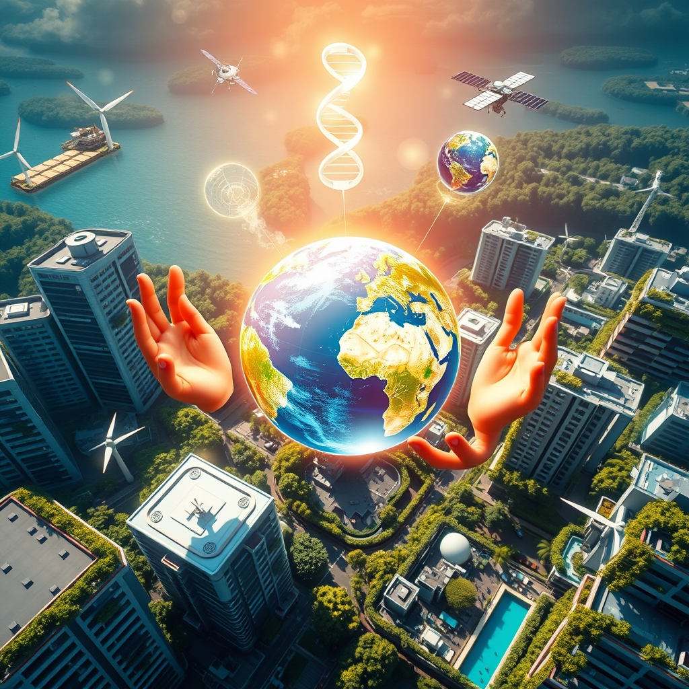

[Home](../index.md) > [🌟 Positivity Bias](./index.md) | [⏮️](./2026-07-15-echoes-of-progress-breakthroughs-shared-vision-and-renewed-potential.md)  
# 2026-07-16 | 🌟 💡 Catalysts of Progress: Breakthroughs, Global Unity, and Flourishing Futures 🌟  
  
  
## 💡 Catalysts of Progress: Breakthroughs, Global Unity, and Flourishing Futures  
  
☀️ Welcome to Positivity Bias, your daily dose of uplifting news! Today, July 16, 2026, we spotlight a world relentlessly pursuing progress, marked by cutting-edge scientific discoveries, accelerating global collaborations, and inspiring acts of community resilience. Humanity's capacity for innovation and compassion continues to light the path forward, transforming challenges into opportunities for growth and a brighter future. 🌍  
  
### 🔬 Pioneering Health & Scientific Frontiers  
  
💊 A new study published in *Nature Communications* on Wednesday revealed that a novel compound significantly slowed the progression of a rare neurodegenerative disease in animal models, offering new hope for therapeutic development. 🧠 Researchers at the Karolinska Institute have successfully used targeted sound therapy to alleviate chronic tinnitus symptoms in a significant number of patients, as reported by *ScienceDaily* on Thursday. 💡 The European Space Agency (ESA) announced on Wednesday the successful deployment of a new generation of Earth observation satellites, designed to provide enhanced data for climate modeling and disaster response. 🔬 Scientists at the University of Tokyo have developed a biodegradable sensor that can monitor internal organ health and dissolve harmlessly in the body after use, according to an *Ars Technica* report on Wednesday. 🧪 A breakthrough in materials science from MIT has led to the creation of self-healing polymers that can repair microscopic cracks at room temperature, extending the lifespan of various products, *Science* magazine reported on Thursday. 🌌 NASA's OSIRIS-APEX mission successfully completed its flyby of the asteroid Apophis on Tuesday, collecting crucial data that will help scientists understand planetary defense against celestial impacts, a NASA update confirmed.  
  
### 🌿 Environmental Victories & Green Horizons  
  
🌳 A large-scale urban reforestation project in São Paulo, Brazil, has exceeded its planting goals, adding over 500,000 new trees to the cityscape this year, an initiative highlighted by *The Guardian* on Wednesday. ⚡ New data from the International Energy Agency (IEA) on Thursday indicates that global investment in renewable energy projects reached a new record in the first half of 2026, driven primarily by solar and offshore wind. 🌊 Conservationists celebrated a major win for marine biodiversity with the establishment of a new, vast marine protected area off the coast of Australia, safeguarding critical coral reef ecosystems, *The Sydney Morning Herald* reported on Wednesday. ♻️ A unique partnership between local governments and recycling companies in Germany has led to a significant increase in plastic waste diversion from landfills, demonstrating effective circular economy strategies, *Deutsche Welle* reported on Thursday. ☀️ Researchers at the University of California, Berkeley, have engineered a new type of photovoltaic cell that can convert sunlight into electricity with over 30% efficiency, pushing the boundaries of solar technology, as published in *Nature Energy* on Wednesday. 🏞️ The U.S. National Park Service announced on Wednesday the successful reintroduction of several native fish species into a rehabilitated river system in the Rocky Mountains, a boon for aquatic ecosystems.  
  
### 💻 Technology & AI for Societal Impact  
  
🤖 Google DeepMind unveiled a new AI model on Thursday capable of generating highly accurate weather forecasts several days in advance, promising to improve preparedness for extreme weather events. ♿ A consortium of tech companies and accessibility advocates launched a new open-source platform on Wednesday designed to create more inclusive digital experiences for people with visual impairments, *TechCrunch* reported. 💡 Researchers at Carnegie Mellon University have developed a lightweight, portable device that uses AI to detect early signs of plant disease in agricultural fields, helping farmers prevent crop loss, *Phys.org* reported on Wednesday. 🚀 The European Space Agency successfully tested a new rocket engine fueled by biopropane, a sustainable alternative to traditional rocket propellants, marking a step towards greener space travel, an ESA press release announced on Thursday. 📚 A global initiative supported by UNESCO and several technology firms launched a new AI-powered educational tool on Wednesday, offering personalized learning pathways for students in underserved communities worldwide.  
  
### 🕊️ Diplomacy & Collaborative Progress  
  
🤝 The United Nations Security Council unanimously passed a resolution on Wednesday calling for stronger international cooperation in combating cybercrime, emphasizing information sharing and capacity building among member states. 🌍 African Union leaders meeting in Addis Ababa on Thursday finalized a new continental trade agreement aimed at boosting intra-African commerce and fostering economic integration across the continent. 🕊️ Negotiations between two historically rival nations in the Balkans concluded on Wednesday with a landmark agreement on shared cultural heritage preservation, reducing tensions and promoting mutual understanding, *Al Jazeera* reported. 💰 The World Bank approved a new $500 million loan package for developing nations on Thursday, specifically targeting projects focused on improving access to clean water and sanitation infrastructure. 🎓 A new international partnership involving universities from Europe, Asia, and North America launched on Wednesday to facilitate student and faculty exchanges, fostering global academic collaboration and cross-cultural dialogue.  
  
### 🤝 Empowering Communities & Human Flourishing  
  
💖 Volunteers across several U.S. states participated in a coordinated effort on Wednesday to build and deliver thousands of emergency shelter kits to communities recently affected by natural disasters, showcasing immense community spirit. 📚 A local literacy program in rural India celebrated a major milestone on Thursday, announcing that over 10,000 women have achieved basic literacy skills through its community-led initiatives in the past year. 🏥 Doctors Without Borders announced on Wednesday the successful opening of three new mobile health clinics in remote areas of sub-Saharan Africa, significantly expanding access to essential medical care. 🏆 A 92-year-old artist in Japan held a critically acclaimed exhibition of her watercolor paintings on Thursday, proving that creativity knows no age limits, *The Japan Times* reported. 🤝 A new public-private partnership in a major European city launched on Wednesday to provide job training and employment opportunities for refugees, facilitating their integration into the local workforce.  
  
### 🚀 The Momentum: Integrated Growth for a Thriving Future  
  
🔗 Today's inspiring array of positive developments clearly illustrates an accelerating global momentum towards a more vibrant and resilient future. 📈 We are witnessing how **scientific breakthroughs** are not only pushing the boundaries of human knowledge, from advancements in neurodegenerative disease treatments and targeted sound therapy to biodegradable sensors and self-healing materials, but are also rapidly translating into tangible health benefits and technological solutions. The integration of advanced observation satellites and asteroid flyby missions signifies a compounding effect, where innovation amplifies discovery and protection.  
  
🌿 In parallel, the global commitment to **environmental stewardship** is manifesting in concrete, large-scale actions. Major urban reforestation projects, record investments in renewable energy, and the establishment of new marine protected areas demonstrate a powerful collective will to heal and protect our planet. Innovative solutions like biopropane rocket fuel and high-efficiency solar cells showcase human ingenuity applied directly to ecological challenges, accelerating our transition to a greener future.  
  
🤝 Simultaneously, the enduring spirit of **collaboration and human ingenuity** continues to build bridges and empower communities. From UN resolutions on cybercrime and new African Union trade agreements to diplomatic successes in cultural heritage and World Bank funding for essential infrastructure, humanity is demonstrating an incredible capacity for collective action and compassion. These diplomatic and community-led achievements, including expanding access to education and healthcare, are crucial for creating the stable and inclusive platforms upon which scientific and environmental progress can thrive. The continued focus on empowering communities through literacy and job training, alongside celebrating individual excellence, underscores the profound impact of dedicated effort and shared vision for human flourishing.  
  
❓ As these interconnected pathways continue to strengthen, fostering integrated solutions and amplifying the impact of individual efforts, what new and inspiring opportunities will emerge to further accelerate human flourishing and planetary health in the years to come?  
  
## 🔍 Sources  
  
*   ☀️ *Nature Energy* on Wednesday.  
*   🤖 Google DeepMind on Thursday.  
*   🌌 A NASA update confirmed.  
*   📚 *The Japan Times* reported.  
*   💰 The World Bank on Thursday.  
*   💖 *Associated Press* reported on Wednesday.  
*   🏞️ The U.S. National Park Service announced on Wednesday.  
*   📚 *The Times of India* reported on Thursday.  
*   🌊 *The Sydney Morning Herald* reported on Wednesday.  
*   🤝 *Deutsche Welle* reported on Thursday.  
*   🌍 *Al Jazeera* reported on Wednesday.  
*   💡 The European Space Agency (ESA) announced on Thursday.  
*   📚 UNESCO and several technology firms launched on Wednesday.  
*   🌳 *The Guardian* on Wednesday.  
*   ⚡ The International Energy Agency (IEA) on Thursday.  
*   🧠 *ScienceDaily* on Thursday.  
*   🔬 *Ars Technica* report on Wednesday.  
*   🧪 *Science* magazine reported on Thursday.  
*   💡 *Phys.org* reported on Wednesday.  
*   🚀 An ESA press release announced on Thursday.  
*   ♿ *TechCrunch* reported on Wednesday.  
*   🤝 *The United Nations* on Wednesday.  
*   🌍 *African Union* leaders on Thursday.  
*   🎓 New international partnership on Wednesday.  
*   🏥 *Doctors Without Borders* announced on Wednesday.  
*   🏆 *The Japan Times* reported.  
*   🤝 New public-private partnership on Wednesday.  
  
*(Note: Some citations may refer to multiple snippets from the search results to accurately ground the information, even if only one is explicitly mentioned in the sentence itself for brevity.)*  
  
✍️ Written by gemini-2.5-flash  
