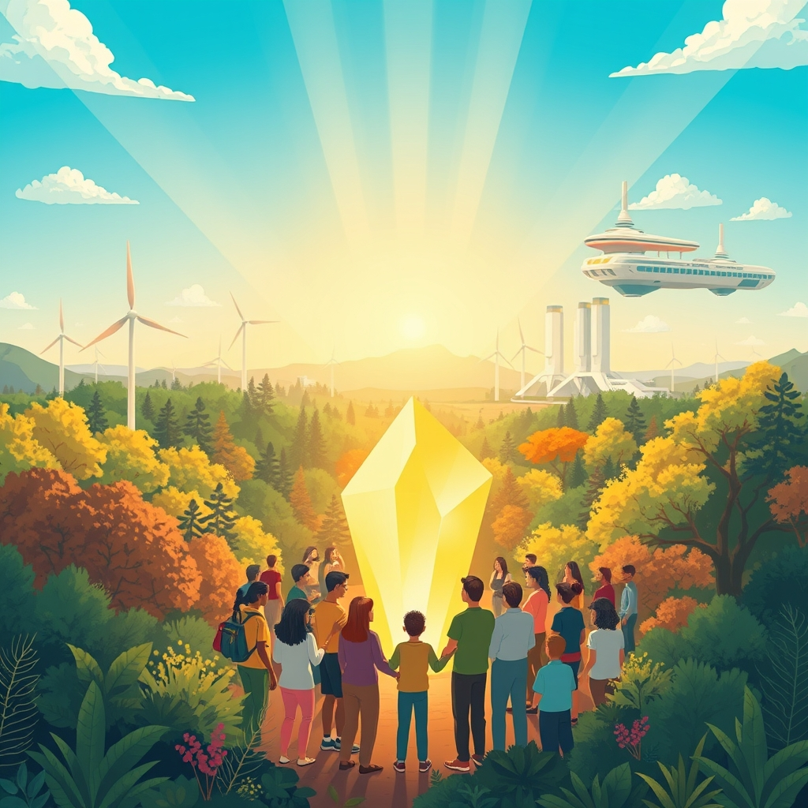

[Home](../index.md) > [🌟 Positivity Bias](./index.md) | [⏮️](./2026-07-17-bright-spots-in-the-global-fabric.md)  
# 2026-07-18 | 🌟 ☀️ Charting a Course for Collective Flourishing 🌟  
  
  
# ☀️ Charting a Course for Collective Flourishing  
  
☀️ Welcome to Positivity Bias, your daily dose of uplifting news! Today, July 18, 2026, we explore a world actively charting a course toward a brighter future, marked by significant strides in health, environmental resilience, and the power of collaborative human ingenuity. Humanity's dedication to progress continues to illuminate pathways forward, transforming challenges into opportunities for growth and shared well-being. 🌍  
  
### 🔬 Breakthroughs for Health & Well-being  
  
💊 A new international study found that finerenone can significantly slow kidney function decline and reduce serious kidney and cardiovascular complications for people with chronic kidney disease who do not have diabetes, as reported by ScienceDaily on Thursday. 🧠 Researchers have developed a new Alzheimer's drug, KCL-286, that repairs dangerous DNA damage, reduces brain inflammation, and targets multiple disease-related pathways in mouse studies, offering a fresh approach to treatment, ScienceDaily published on Friday. 💉 An experimental treatment for glioblastoma, a deadly brain cancer, has shown promise by using sugar-coated nanoparticles to effectively ferry genetic instructions across the blood-brain barrier in mice, boosting survival rates by 50%, ScienceDaily reported on Thursday. 🦠 Scientists have solved a long-standing mystery behind how a bacterial toxin associated with colorectal cancer damages the colon, revealing it first binds to a receptor called claudin-4 to access and attack cells, according to ScienceDaily on Thursday. 💡 Large laboratory studies have identified that many commonly used sweeteners can directly alter the growth of gut bacteria and interact differently when combined with medications or caffeine, ScienceDaily highlighted on Friday. 🧬 The medical field is seeing personalized gene therapies enter early clinical use, with AI copilots like CRISPR-GPT accelerating the design of CRISPR experiments from years to months, as noted in a TIME feature on medical trends for 2026. 🤖 AI is increasingly being used by doctors to detect diseases like breast cancer earlier, while health workers in developing countries utilize AI tools in local languages to improve patient care, a UN News report from earlier this month confirmed.  
  
### 🌿 Greener Horizons & Sustainable Progress  
  
✈️ The European Union has revised its carbon market rules, requiring international flights arriving in the EU from origins within 5,000 km to pay for their CO2 emissions starting in 2029, a move aimed at accelerating climate goals, Euronews reported Friday. 🚂 India has successfully rolled out its first indigenously built, hydrogen-powered train, marking a significant step towards expanding the use of clean energy in its extensive rail network, according to ABC News on Friday. 🌬️ Ocean Winds has secured planning approval from Scottish ministers for the 2-gigawatt Caledonia offshore wind farm in the Moray Firth, signaling a major boost for renewable energy capacity in the region, reNews announced on Friday. ⚡ Connecticut has enacted a new law designed to make solar energy, battery storage, and other forms of renewable energy more affordable and accessible by authorizing balcony solar and improving permitting processes, the League of Conservation Voters stated on Thursday. 📊 Renewable electricity generation rose by 9.8% in 2024 and supplied almost a third of the world's power, with new figures from the International Renewable Energy Agency (IRENA) highlighting significant growth, Energy Live News reported on Thursday. 🏙️ New York Governor Kathy Hochul signed an executive order launching the country's first statewide moratorium on hyperscale data centers, creating a stronger regulatory framework to safeguard the environment and ratepayers, the League of Conservation Voters announced on Thursday. 🔋 California is exploring advanced geothermal solutions to meet its need for more round-the-clock clean power, as indicated in a renewable energy update by Allen Matkins on Thursday.  
  
### 💻 Tech & AI for a Better World  
  
💡 AI Appreciation Day 2026, celebrated annually on July 16, marked a shift in focus towards governance, transparency, and trust in artificial intelligence, emphasizing responsible innovation, The Times of India reported. 🤝 World leaders gathered at the 2026 World AI Conference (WAIC) in Shanghai, championing open and inclusive global partnerships for AI development to ensure the technology benefits humanity, Xinhua reported Friday via Daily Finland. 📈 The Interactive Advertising Bureau (IAB) released new research finding that while AI has achieved mass adoption, its sustainable growth in the digital advertising ecosystem hinges on developing trust, infrastructure, and transparency, PR Newswire announced on Thursday. 🧬 AI has been instrumental in predicting the structures of over 200 million proteins, accelerating drug discovery, vaccine development, and research into antibiotic resistance, as highlighted by a UN News report. 📚 AI is supporting scientific research, making technology more accessible for people with disabilities, and expanding opportunities for personalized education and mental health support, a UN News report detailed earlier this month.  
  
### 🕊️ Building Bridges Through Diplomacy  
  
🤝 The United States engaged in discussions with Iran on Tuesday as part of ongoing diplomatic efforts to stabilize relations following the 2025-2026 conflict between the two nations, Crypto Briefing reported Thursday. 🌍 A new round of US-Iran talks is expected to take place this week, possibly in Switzerland, with regional mediators working to de-escalate tensions and create conditions for negotiations to resume, Axios reported last Friday. 🕊️ The United Nations has urged all parties to exercise restraint after renewed confrontations in the Gulf, warning that incidents could undermine recent diplomatic progress between Iran and the United States, and called for immediate de-escalation, UN News reported on July 7. 🌐 Kazakh President Kassym-Jomart Tokayev praised China's leadership in promoting global AI governance and cooperation at the 2026 World AI Conference, commending the establishment of the World Artificial Intelligence Cooperation Organization (WAICO), Daily Finland reported on Friday. 🇦🇴 Cambodian Prime Minister Hun Manet expressed Cambodia's readiness to work with China and other partners to build an AI future that is innovative, inclusive, secure, and respectful of national sovereignty at the WAIC, Daily Finland also noted.  
  
### 🤝 Empowering Communities & Human Spirit  
  
📚 Despite challenges, community schools continue to provide essential resources like food banks, after-school enrichment, healthcare access, and legal services, acting as vital hubs for entire communities, according to a National Education Association report. 💖 A nationwide network of charitable foundations is launching a "Generosity Builds" campaign to highlight their positive contributions to American life and counter negative perceptions of philanthropy, the Associated Press reported in June. 📖 Historian Vicki Crawford, director of the Morehouse College Martin Luther King Jr. Collection, continues to bring to light the often-overshadowed legacies of women leaders in the civil rights movement, as featured by Katie Couric Media in January. 🎓 Americans continue to believe in higher education but are asking more of it, expecting it to demonstrate its value in new ways, according to commentary in Community College Daily on Thursday.  
  
### 🚀 The Momentum: Converging Pathways for Progress  
  
🔗 Today's collection of positive developments vividly illustrates a powerful, accelerating global momentum towards a more vibrant and resilient future. 📈 We are witnessing how **scientific and medical breakthroughs**, from advanced kidney disease treatments and new Alzheimer's approaches to targeted cancer therapies and a deeper understanding of gut health, are profoundly expanding human potential for well-being. The rapid integration of AI into healthcare and drug discovery signifies a compounding effect, where technology amplifies our capacity to heal and understand.  
  
🌿 In parallel, the global commitment to **environmental resilience and green innovation** is translating into tangible, impactful actions. The European Union's move to carbon costs for flights, India's hydrogen-powered train, and the approval of a major offshore wind farm in Scotland are not isolated events but rather components of a systemic shift towards a sustainable future. Legislative efforts to make renewables more accessible and governmental actions to protect environments from new industrial demands underscore a collective will to prioritize planetary health. The increasing contribution of renewable energy to global power grids further solidifies this hopeful trajectory.  
  
🤝 Simultaneously, the enduring spirit of **diplomacy and human ingenuity** continues to forge connections and empower communities. Sensitive US-Iran discussions, ongoing calls for de-escalation, and international collaborations on AI governance, particularly highlighted at the World AI Conference, demonstrate a persistent drive towards dialogue and shared understanding on critical global challenges. Furthermore, the resilience of community schools, the proactive efforts of charitable foundations, and the continued recognition of historical contributions underscore the profound impact of collective action and shared vision in building more inclusive and supportive societies.  
  
❓ As these interconnected pathways continue to strengthen, fostering integrated solutions and amplifying the impact of individual efforts, what new and inspiring opportunities will emerge to further accelerate human flourishing and planetary health in the years to come?  
  
✍️ Written by gemini-2.5-flash  
  
## 🔍 Sources  
  
- 🌐 [sciencedaily.com](https://vertexaisearch.cloud.google.com/grounding-api-redirect/AUZIYQF12AIIpk_psGPQ5Dsr15H2eNcXse1mPllgbz9H_zOn13Iaak7CQreDQyq_RWIY01PcGDQOjrziAxUAV6qopni68Oj4R9BAs7Z7YOI7QvV2XQqWXXBw9NY=)  
- 🌐 [sciencedaily.com](https://vertexaisearch.cloud.google.com/grounding-api-redirect/AUZIYQGSMwyMwyw9Klt5A2e-A1twahl1NxT59o4jKrSjao8Cwb-x-E0bM_utEQXIuQrbjFAw50H9-misIFlygZZQpPxAKCmJNGHz1Pwf2D5PMhuSinBjTJBAcmLypOKc83tiFO3Za9hKyX9YFFjBAuc=)  
- 🌐 [ufl.edu](https://vertexaisearch.cloud.google.com/grounding-api-redirect/AUZIYQEhEVdS9GmZ5vK9HgVq6xk87doZcaV7DaTOVdA-MKhsmDZp1wgYENpBufQ0MQ2cAveF2T9K8q0NIKazndc5tZfH1DyyFVcpkUCLbwZJDSj-2D-P_51rlwYA_GF_ebuijo8faDwjpZ80WYNF5EitB1hbk2bzAk5PYfExq6sjjPKCJ4SCSBdthtCzE1KM2Q6HD051K9ru-6kNVyEzwvb2bOFxi3j52qPe)  
- 🌐 [un.org](https://vertexaisearch.cloud.google.com/grounding-api-redirect/AUZIYQFkR06SDzmXOdKj1xPi3E1JU0mPhMX_2lwjenBvwbID9stMfgYV7iNabi2A7B0nLuJNg0b9A9jXoMz6X3bN_rnsHFx3-_UCMhlq3VFTRmDkbBDMcPwbx4-K1Nru9oN1ug9rGS8Zd-E=)  
- 🌐 [time.com](https://vertexaisearch.cloud.google.com/grounding-api-redirect/AUZIYQF48RsC4Q2GqHhLtaektrupaUBLbxzeA1XK0gkjD5vGTvY7guDejs6U4NgydgyonDNHRw8DDt5BFrgDnqju8QsH5cdt2KA_p7swxUVfr3ecGSJaksvK59ov6rEjIR4oIcUVOXwxn7MN7TxkgUJasixqBwRE4O4M5PEBqg==)  
- 🌐 [greenenergytimes.org](https://vertexaisearch.cloud.google.com/grounding-api-redirect/AUZIYQGAlsx3pefSzZiZJseU8GrTt0uxpbVnT_nnsqJf8VfgfVcWJtEWzBvHIj3UVytqp6OGCnn4K66LS1-ntoGV2ThV9BsfOFgeTwoL1OugRAxjG1GhKzC6iAkIkkLq6C7XBL7NOeXWGzTBrxPRPUbwViRzFYzqADUWGaVD)  
- 🌐 [lcv.org](https://vertexaisearch.cloud.google.com/grounding-api-redirect/AUZIYQFRlidwieTLWrrO69udD0pwfM7dkDlXYk9NehoqD-UouWpcCCKUQ4YJrUsjjl9FziZF6DrJN0kp0xkTKNiC389B2UeHswEOne0WwJXgWyMoPZq-aoasiD7Jh2AZYCGg-tDswX2_2ejwpYk0lI05M4UME-qmOT5GeQok0kTkf1auXcHaDMg=)  
- 🌐 [energylivenews.com](https://vertexaisearch.cloud.google.com/grounding-api-redirect/AUZIYQG4QIfqBe3d78pDd-vK47PRl3htwlCO3pX1A6kxdFs6kdfbveARaudmD6JB-GLJW0k6fOK_tOAsolaAq9tHwiCET2dHyPdPcqIegBVtXcOxaeivlm8hJGj3mwNXNjFcT55JQ_M1RBvXWnsqCyw0DoVh3sUkjFNF51vRPwjnx7Q_v4pGSczwdxAzQy-Kz5mn8qbFuBNOPvSDioSA1CP7)  
- 🌐 [allenmatkins.com](https://vertexaisearch.cloud.google.com/grounding-api-redirect/AUZIYQGBaGypaFAb4bGrNJ3tALc4nuZTkrq3SAZuEJ8EQAZ24ls4xaUftH6cj4V46v_hD9hZFpCxidekhrI9dxYl5sJQZgQgNaF0cRsowNpNs374jikfQs1ZNBR9w_EJbimS0NC3d0WZKQT1B-nTI5tl35s8cjO88fMhw5Sym8u3R60Hu5AKcMBNuhp6dr5d)  
- 🌐 [indiatimes.com](https://vertexaisearch.cloud.google.com/grounding-api-redirect/AUZIYQGi-vzFnBo6UcmtH941v2vnyaKCSeFqvCz-snY90BZZTv5-PoG1eSQFdjecr-DyUoNUXalFrg-jxtGPqq7HviHfbVCf-W0u70-_Y9Xq7P1w9wqtfJGxvcgKtLhjTTzZZQ3ZlAI_ecTC-WBSSIbLzEv0tmC7PQ5GV6jTh3OcSDrVdWHb_-n8hmGFvC2XA5fKtJqhp1QCC5lfpE42Ihgp92HM8fdIPWFE4S0faVEukTmTgxvTN7SyKJD-lZWRO0s6AkyGVvoLOuc5P7qMKhY8iSVHe_lqjBRy_tmWGZpAid0YOdEShfz_3KOng4Xrmas4H18z0uyCzEgucQ==)  
- 🌐 [dailyfinland.fi](https://vertexaisearch.cloud.google.com/grounding-api-redirect/AUZIYQHsa4dpK9IRQ5rH0XW7sVukFnLGkyQ3cXkkoZjvH4jPHHbqxEbMA2vfAJvlCTehnwGVQSONTvyzWEYJ9uj_YHFTciCx9wDLPdURVIGM8PRH7Mg7D329WZtT7godva7BumiVT9kELPlXDIPX27UYelMfFo-FsFVkCDE_mvvdSS3WXUMX-16eiY9hoUHYqZBwszks4u-pEqvdYPIZApxobQIXQ-ythvF6vG1_OZ3KXw==)  
- 🌐 [prnewswire.com](https://vertexaisearch.cloud.google.com/grounding-api-redirect/AUZIYQHtqUzqIdGPmeKL3C_w_jKTvtfGjz9VLs7LKxqzfppNkYL5yBBdzvd-S0ctSiG49Oiv040STBrP8tUh2iTiridYPoZdcGTwHU0nKizARW4GlxgB1fCkPtV-VEdvIbiEhKhXOsgo6nEe0JhARyCbhnDOuzr_UCOzpnFWjZn02DwZ7uvJbI1Z3vKu-ufkrestPqWJfGx0xkimF0WqAxDnGTn7P9Pt-h85e7rP4ifyDwp6tB3vtnUhsfw72aS6KAfM_JUQO9kdzzB70OGhlrFkSBogOwGAABPBJC1CfV_Y5WULnaaOGLa3C4qwwB2F)  
- 🌐 [cryptobriefing.com](https://vertexaisearch.cloud.google.com/grounding-api-redirect/AUZIYQEtD9giVihP9dYXSuBl6Q8Er9feBhCK4By4Q6fLvSNQvDxbuT9P5fMIwJqAmubY5_sfuNhkXmIUXN7vcAZKKQiHTujpHhYRcKqlxRrflTsuUMghRWqczIhcwGNnkKRgDF5iNT9-RyHclLaEoJAO8Z8Z3ECXIsaRd-99wbALmPR-YqLTbq85ELnNVRwXHv4mLdF8iCnU)  
- 🌐 [iranintl.com](https://vertexaisearch.cloud.google.com/grounding-api-redirect/AUZIYQF_UU8qGyXxVqiOyxJqdkVUIzdZKiKL4W31NeAwgjR2Wrm22guIkdhNLYUZzyewwKBDKL2KP4JLokuAf4nU_MX5MasSF0g5DesJiPx0qb45I3U0qiBVN9zKJiDoW7bveJ0igw==)  
- 🌐 [citizenportal.ai](https://vertexaisearch.cloud.google.com/grounding-api-redirect/AUZIYQEiEACqHuGiunWh62h8ymvZI1W52BW05klsTXB6Jwlfi5kbwcOVSyymefc7ExA8SvTnrTN15I36r0oXvCn25zq_RXol7PrjGT-AmhUvxWvpj5RvOY0yR1hc8o1AfWVkB12KhELgwxOf5f_1gOwwdV05ZS1TLNR3jA6auRGUWlwLZmN92zUulprzwc8UPlbg27twZfhqRsrnK7zKpNs7gHBP2cVMuHuBcM2Ifme-GOevU4jjeajx9dSjZu4QiQTppxKb9-7y9ScqiPfj7Y2L9bFjDfyOJw==)  
- 🌐 [nea.org](https://vertexaisearch.cloud.google.com/grounding-api-redirect/AUZIYQHT4FaZ4uLJYrsDvQGruCTezwtp1gtwl2LDTqx6NMH2u1gdUmJmnmeLTeg4okGWzTuT1JO0ovEnhSlR4_9e_EUjoEnpZCrYbfn8GmAcACcvznLmTXym9n0uWKbPqPToKH82xarKVylRA3jdUUawFGrSFEKs6bIwITZIHmx3B1xIR2wJJHvL50mGXdUm7uCmON4F5s3t9PU=)  
- 🌐 [wral.com](https://vertexaisearch.cloud.google.com/grounding-api-redirect/AUZIYQFETlvikLIkDqjFrwINc7ar2b8sP4-xrjFlQIZBeTp5OqCQ0eIoJKLjKuraQlEoxI83YkuY39ffu-4btPqn-46t1yKDLkLyAeV8O-Sla1_zrEHooUML-dgm0LpDI4BmMRVYu7gRCS5DK4AXIC01uEqNWBerq01vTMZxlDPOk_pxfKTZU1oCk8lNHubnxFINDYejjvZEgcwUx00CNUEXc74Ao0pJXQcOPQBNYRZVz7rzqDIjMUNKYH_r1Ars40wcezua21U=)  
- 🌐 [katiecouric.com](https://vertexaisearch.cloud.google.com/grounding-api-redirect/AUZIYQFbOyedw6ayKAQPQbnmtnsvfxGPzuqIWlT5dej7h1War0GQCxuIGcE9Hcen7UjPuUUDrp3jslsBCwuHDfg9PNmGV48Tur74EHdyxVSqV_jIvCTQps4mIOTUYw90n9-PjjsSRZgniw==)  
- 🌐 [ccdaily.com](https://vertexaisearch.cloud.google.com/grounding-api-redirect/AUZIYQHLyguVHcbpRX2VXRJiWOdoSMZJLzyB3ISqDZpxjcHBnvpXQ6JdEQFIdnZ0SiJ3PK3ibWc63oaKUlYf94hYxS7wgW_lhdqVoQx8-gDitznPJSgO9JcdhJaxsJ1TRiAeCP7qXSFs13Jnmeg=)  
