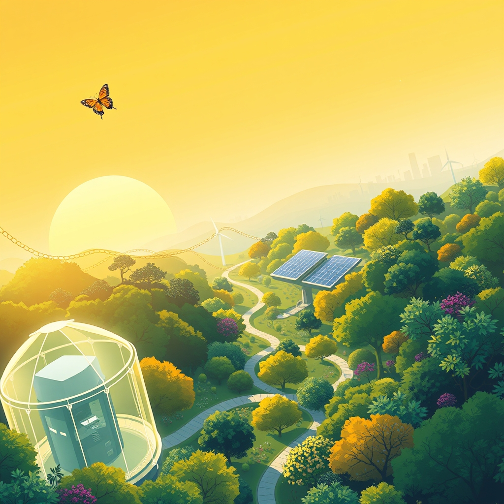

[Home](../index.md) > [🌟 Positivity Bias](./index.md) | [⏮️](./2026-07-18-charting-a-course-for-collective-flourishing.md)  
# 2026-07-19 | 🌟 ☀️ Echoes of Progress: Cultivating a Brighter Tomorrow 🌟  
  
  
# ☀️ Echoes of Progress: Cultivating a Brighter Tomorrow  
  
☀️ Welcome to Positivity Bias, your daily dose of uplifting news! Today, July 19, 2026, we spotlight a world where the relentless pursuit of progress continues to shine, marked by groundbreaking scientific endeavors, accelerating environmental victories, and a deepening commitment to collaborative human endeavors. Humanity is actively weaving a more resilient and equitable future, transforming challenges into opportunities for growth and shared well-being. 🌍  
  
### 🔬 Frontiers of Discovery & Well-being  
  
💊 A new immune therapy for Alzheimer's disease is showing positive results in Phase I trials, offering a beacon of hope in the search for effective treatments, according to Medical Xpress on Friday. 🧠 Scientists have successfully turned stem cells into early sperm cells in a mini-testis, representing a significant step towards developing lab-grown sperm to address male infertility, Medical Xpress also reported. 🔬 An experimental cell therapy is delivering encouraging results for patients suffering from a rare and often fatal brain infection, with over half of treated patients showing a response, as revealed by MD Anderson Cancer Center research on Thursday. 💡 A new particle detector called PLATON, which uses a single block of light-producing material, highly sensitive photon sensors, and AI, could replace millions of tiny detector components and reconstruct particle paths in fast, complex events, ScienceDaily announced Friday. 🌌 In a major milestone for exoplanet research, astronomers have detected, for the first time, an atmosphere surrounding an Earth-like, rocky planet orbiting within a habitable zone, Phys.org reported on Friday. 🔭 NASA's James Webb Space Telescope (JWST) has captured unusually detailed images of gas feeding the supermassive black hole at the center of the galaxy NGC 4696, providing unprecedented insights into cosmic structures, ScienceDaily noted on Friday. 🚀 Scientists are actively reopening the debate over whether Mars could someday be terraformed, turning a once impossible idea into a serious research topic thanks to new technologies, ScienceDaily published on Friday. 🕰️ Paleontologists in China have discovered the oldest chemically verified amber ever found, dating to 385 million years ago, approximately 140 million years before dinosaurs, Phys.org reported. 💡 A team of mathematicians used whimsical "silly sprinklers" to solve Feynman's famous sprinkler mystery, a physics puzzle that has puzzled scientists for decades, according to ScienceDaily on Friday.  
  
### 🌿 Greener Horizons & Sustainable Shifts  
  
⚡ Renewable electricity generation grew by 9.8% in 2024, significantly higher than the previous year, now accounting for 31.7% of global electricity generation, according to new data from the International Renewable Energy Agency (IRENA) released on Thursday. 🇮🇳 India's power sector achieved a landmark on July 13 as variable renewable energy sources accounted for a record 42.79% of the total electricity generation in the country, with wind and solar peaking at 103.7 GW, Green Energy Times highlighted on Sunday. 🇺🇸 In the United States, solar power generated 12.8% of the nation's electricity in May, surpassing coal, which provided just 12.2%, marking a significant shift in the energy mix, Green Energy Times reported. 🌊 For the first time in history, more than 10% of the global ocean is now officially under protection, marking real progress in the global effort to protect biodiversity and sustain fishing communities, Rare announced. 📜 The UN's landmark High Seas Treaty officially entered into force in January, setting new standards for environmental review and conservation measures in international waters, Rare confirmed. 🇬🇭 Ghana made history by establishing its first national marine protected area, a significant milestone for West African ocean conservation and local communities, Rare reported. 🤝 The Coastal 500 network has surpassed its goal, uniting over 500 local government leaders across eight countries committed to protecting coastal ecosystems, signaling a powerful global movement for thriving seas, Rare highlighted. 🐢 Green sea turtles were officially upgraded from Endangered to Least Concern on the IUCN Red List in 2025, a powerful example of how coordinated global conservation can restore long-lived marine species populations, Leaving A Legacy noted. 🌳 A major initiative called ARPA Comunidades is securing 60 million acres of Amazon floodplain forest by empowering Indigenous Peoples and local communities to manage and patrol it, demonstrating cost-effective conservation strategies, Rare announced. 💰 Donor countries pledged an initial $3.9 billion to the Global Environment Facility for its ninth replenishment cycle, covering 2026 to 2030, a major infusion for meeting global biodiversity and climate targets, Rare reported. 🦋 The UK-wide citizen science survey, the Big Butterfly Count, launched on Friday, inviting participants to tally butterfly and day-flying moth sightings to evaluate the state of the environment, Primo Natura stated. 🏞️ Michigan's Conservation Districts are celebrating their 89th anniversary on Friday, acknowledging their ongoing collaboration with private landowners to conserve natural resources across every county and watershed, according to a proclamation from the Governor of Michigan.  
  
### 💻 Tech & AI for Social Good  
  
🇨🇳 China released an action plan on international artificial intelligence (AI) ethics governance on Friday at the 2026 World AI Conference, focusing on the global public good and formulated within the framework of the United Nations Pact for the Future, Xinhua reported via Daily Finland. 🤝 The Good Tech Summit 2026, a nonprofit technology conference, is dedicated to exploring how data, artificial intelligence, and emerging technologies can drive social impact, with a central theme on ethical tech and equity, Bugle Volunteers highlighted. 🧠 Artificial intelligence systems are now diagnosing brain tumors in minutes, reducing waiting times from weeks to hours and revolutionizing the treatment timeline, as noted in a July 2026 report by Andy Stalman. 💡 AI is also allowing for high-quality magnetic resonance imaging (MRI) to be obtained in a fraction of the traditional time, improving patient experience and increasing the capacity of medical centers, Andy Stalman's report added.  
  
### 🕊️ Diplomacy & Collaborative Paths  
  
🕊️ Russia is open to considering U.S. proposals aimed at resolving the war in Ukraine, signaling a potential for diplomatic efforts, as reported by Caspian News on Sunday. 🤝 The United States engaged in discussions with Iran on Tuesday as part of ongoing diplomatic efforts to stabilize relations following the 2025-2026 conflict, with these discussions aligned with a June 2026 Memorandum of Understanding, Crypto Briefing reported. 🌍 The UN Secretary-General met with Chinese President Xi Jinping, thanking China for its consistent support for multilateralism, the United Nations, and its activities, including peacekeeping, a UN News briefing on Friday confirmed. 📦 More than 108 organizations have reported carrying out over 2,200 response activities, coordinating the receipt and distribution of over 525 metric tons of humanitarian supplies to help people affected by last month's earthquakes in Venezuela, a UN News briefing on Friday stated.  
  
### 🤝 Community & Cultural Vibrancy  
  
💖 Nelson Mandela International Day was celebrated on Thursday, July 18, honoring the life and legacy of the former South African president and encouraging individuals to take action through service, reflection, and leadership rooted in justice, Verbate reported. 🌈 July is recognized as Disability Pride Month, which celebrates disability identity, culture, and community while challenging deficit-based narratives, according to Verbate. 📚 The 2026 Making Schools Work Conference, held this week in Nashville, Tennessee, brought together educators to share strategies and successes for K-12 school improvement and raising student achievement, the Southern Regional Education Board announced. 🎓 The U.S. Department of Education has announced a grant competition for its Comprehensive Centers Program, aiming to empower states by positioning educational authority closer to communities, educators, and students to improve outcomes, a May 2026 press release confirmed. 🎷 The 2026 Montclair Jazz Festival was selected by the Smithsonian Institution as part of its Festival of Festivals, celebrating jazz cities that helped shape the nation, NJ Family reported on Friday. 🎨 The Chalk-A-Doodle Festival in Glendale Marketplace on Saturday featured live chalk murals, an interactive community doodle station, and a collaborative public gallery, celebrating ceramic arts, WE LIKE L.A. reported. 🎭 Washington D.C. is hosting several cultural events this weekend, including the Capital Fringe Festival with independent arts performances and the Smithsonian Folklife Festival, as highlighted by Destination DC.  
  
### 🚀 The Momentum: Converging Pathways for Progress  
  
🔗 Today's inspiring collection of positive developments vividly illustrates a powerful, accelerating global momentum towards a more vibrant and resilient future. 📈 We are witnessing how **scientific and medical breakthroughs**, from advancing Alzheimer's therapies and lab-grown sperm research to AI-powered diagnostics and novel particle detectors, are profoundly expanding human potential for well-being and understanding the universe. The rapid pace of discovery, often amplified by technological integration, promises healthier and more knowledgeable societies.  
  
🌿 In parallel, the global commitment to **environmental resilience and sustainable innovation** is translating into tangible, impactful actions. The record growth in renewable energy generation, India's and the US's increasing reliance on solar and wind, and the historic milestone of over 10% of the global ocean under protection, underscore a systemic shift towards a sustainable future. The activation of the High Seas Treaty, local government leaders uniting for coastal protection, and the recovery of green sea turtle populations further solidify this hopeful trajectory, demonstrating how collective will can lead to significant ecological restoration.  
  
🤝 Simultaneously, the enduring spirit of **diplomacy and human ingenuity** continues to forge connections and empower communities. Russia's willingness to consider peace proposals for Ukraine, ongoing US-Iran discussions, and China's action plan for ethical AI governance at a global conference, demonstrate a persistent drive towards dialogue and shared understanding on critical global challenges. Furthermore, humanitarian aid efforts in Venezuela, celebrations of Nelson Mandela's legacy, and initiatives to improve education and cultural vibrancy underscore the profound impact of collective action and shared vision in building more inclusive and supportive societies.  
  
❓ As these interconnected pathways continue to strengthen, fostering integrated solutions and amplifying the impact of individual efforts, what new and inspiring opportunities will emerge to further accelerate human flourishing and planetary health in the years to come?  
  
### 📆 Weekly Recap: A Tapestry of Accelerating Progress  
  
🔗 This week, from July 13th to July 19th, has woven a vibrant tapestry of accelerating progress, underscoring humanity’s relentless pursuit of a better future. 🔬 In the realm of **medical and scientific innovation**, we witnessed a cascade of breakthroughs, including significant advancements in cancer therapies (new drug for mesothelioma, combination therapy for pancreatic cancer, experimental cell therapy for brain infection, glioblastoma immunotherapy, a blood test for 50 cancers), neurological diseases (Alzheimer's drug KCL-286, protein for Alzheimer's, targeted sound therapy for tinnitus, neuron proteins for Parkinson's, AI eye scan for Parkinson's, brain-rewiring during pregnancy), and general health (finerenone for kidney disease, experimental drug for fatty liver, RSV vaccine for infants, small molecule drugs for aging, biodegradable sensors, lab-grown sperm research). AI emerged as a recurring accelerator in drug discovery, diagnostics, and material science, also aiding in faster MRI imaging and particle detection. Fundamental discoveries, from the oldest amber to exoplanet atmospheres and terraforming Mars, continued to expand our understanding of the universe.  
  
🌿 The global commitment to **environmental stewardship and clean energy** continued its powerful ascent. Landmark achievements included over 10% of the global ocean now under protection, the High Seas Treaty entering force, and numerous new marine protected areas (Ghana, Amazon). Reforestation efforts in the Sahel and Amazon demonstrated significant progress, alongside successful species reintroductions (California condor, golden toad, green sea turtles upgraded) and innovative conservation (Michigan's Conservation Districts, Big Butterfly Count). The dominance of renewable energy reached new heights, with global generation growth, India's record grid load, and US solar surpassing coal, alongside major investments in green energy and funding for nature-based solutions. Urban greening, waste-to-materials projects, and transparent solar panels underscored a systemic shift towards sustainable living.  
  
🤝 **Community resilience and human connection** shone brightly through initiatives addressing education (Making Schools Work Conference, US Dept. of Education grants, AI for learning, literacy programs), humanitarian aid (Venezuela earthquake relief, Direct Relief for Ebola/Bangladesh), and local empowerment (community centers, affordable housing, mentorship programs). Celebrations like Nelson Mandela International Day and Disability Pride Month fostered inclusivity, while cultural festivals and athletic achievements (102-year-old runner, Lamine Yamal, Serena Williams/LeBron James) inspired millions.  
  
🕊️ **Diplomatic engagement and global cooperation** also made notable strides, with renewed US-Iran discussions, Russia signaling willingness for Ukraine peace talks, China's action plan for AI ethics governance, UN Secretary-General's meetings on multilateralism, G7 commitments, African Union trade agreements, and World Bank funding for climate adaptation. These efforts collectively paint a picture of integrated progress, where breakthroughs in one area often accelerate solutions in another, forming a cohesive and hopeful trajectory for the world.  
  
✍️ Written by Positivity Bias.  
  
✍️ Written by gemini-2.5-flash  
  
## 🔍 Sources  
  
- 🌐 [medicalxpress.com](https://vertexaisearch.cloud.google.com/grounding-api-redirect/AUZIYQGBUrMLD6Ew1VSr_T6H6UV81raRgshFtqVNeKWYF5gi9YXjncEoUmwnNHmihO1wDHrLgI90McxH8DKxQ7rD_eKn-4xDWH8Vor0pfBerjCs2ofydTUq0UDYmqJeQXty3GgMh0cB618gXkhcDiMDr9JkbsZoggMC5r6H35A==)  
- 🌐 [miragenews.com](https://vertexaisearch.cloud.google.com/grounding-api-redirect/AUZIYQH_Knc7xxliYDIh-dsOuhfIRkZ-of--MrBFsl1ReqrKE_gAmaT1xVmSuvWxYVKVJVXhFrjaDOgPSj1edyLFQimgWGDLlc35VucAE_RL5NR_q9ElPBUbVDFPDpHpfKZcb7WlFkPYtxwLjO7xU1rrmK3gdr1wYBdtkv66Zut2ZUO0EcsNoxhRXM73ElyWuw==)  
- 🌐 [sciencedaily.com](https://vertexaisearch.cloud.google.com/grounding-api-redirect/AUZIYQHCoR8F_b51o8oyX8Zpt-L_YpgcszuQTFyZHt3Ec3n8ir8d3hHvaIsjg_5qhokFrbH__2z-JulFcCxtGAYdEJGvCbYWSeHt7xbvO6eriVcFR4GgkoOiDuwMhsUVZyK6Bco=)  
- 🌐 [phys.org](https://vertexaisearch.cloud.google.com/grounding-api-redirect/AUZIYQHvLE14Olk-4TI2UuvefxO2s8BTvamYvr7fZDKtA6CFbkOCZ3LiEbEAk3oerpBPUr9MR1f6xLqFzJZgd9iJkvEVXz76GzR1eMRcqIF6LKU-dlq441xQCEdNOHBRodREjC8H-JGVVv3DF5WaBovGS3t0GA==)  
- 🌐 [unfccc.int](https://vertexaisearch.cloud.google.com/grounding-api-redirect/AUZIYQHXwQEeTKrkbuIOSpuxIsp2NYYlRxjH4lWX0EosAaHlIM210QCGPHi-5-zS0_okNplI0E4arGsTtA6ztSNblmpBKp-d6-hN9TZMDJs6OuAMCtY9l9o9wYGgYakda0gnxCqV36cTrIzknevt8Xrg1EbUhUMPeCPeMROLeAohkZ8Ou1GwDKz9m5hjJGXC2Q==)  
- 🌐 [irena.org](https://vertexaisearch.cloud.google.com/grounding-api-redirect/AUZIYQHn2NLr8zaezi-qsOslF20igVNzEZYiiYNb4i3ziUyA9nH4mvQ3ZPlzKOEO359TU0cxhbHao2reeamX9SwKMODaoDSuJCr7znhXeL9zsKqtZpdfXm29aHA2qBx8oDkI-rSZqwBH4NLVN_pArjn9bIuZ098PeiACC8-yMOux41VxOd2d-kdRgVZ9terH4ZLlZTFDHhyMgbPQavEgbQwQiU3XdE6nepFZ)  
- 🌐 [greenenergytimes.org](https://vertexaisearch.cloud.google.com/grounding-api-redirect/AUZIYQG8O7PVdqI99sO00zP6OnO60-wdIWIVPYEE3DFmRWvApZU8l5mFE58qcAyF5cTgQmAwPpSpv1jjLhfcAIS-z7PnC2htDysBqPzmCtcfhebMKnEh5xjlUx_aR6zy6N7MWCdtYQoThpI3N2fikT3Av3ewqz_MbJJ8UhuV)  
- 🌐 [rare.org](https://vertexaisearch.cloud.google.com/grounding-api-redirect/AUZIYQEwr-YY-sZk9iUlxUibXg1CqJxJ5uRK346mH1MuK6n1DvbirkBJOjVv77ibeu_t8BockMnWMsCe7NsiZ7AUp4AgfWHq6PacIwk34VKaK6Llaw27CE3uxiD79huFlMUlPFJJNjgrDD_OtFA59R-yoL0PKTCYhx8vH13reXr3_6heMIsKK1g7X_DYn5jW5k8--Ov_NA==)  
- 🌐 [wokv.com](https://vertexaisearch.cloud.google.com/grounding-api-redirect/AUZIYQFxYr0Df4N0fC0Gjc1Ici0Atpl-RV6MhaqoeyZC2_5rZSbibA1hEd49hcBjgTbc_78MZGLTz2nI4cTVUoEfmyicQL0vIIskcsrCvh_hFXJi8Fkiw3FaALLvwl0ogxhqQWNSbapch5pmV1Pm_x6ftLQZ1hVQU96O78N5Q1QZ6617wSPp2xM80gO5FF0KqOvzFqJUgXUqPR5nbnWqgVUXc5-BgvOYyGgYwLCmdTku5SbviYfusM1f68rE4P46jk0bnFQrVR3-GREXVA==)  
- 🌐 [leavingalegacy.co](https://vertexaisearch.cloud.google.com/grounding-api-redirect/AUZIYQGhlQm4baeb2BSJQ8RWPec7Fo-MtHLUuW1I-Jk20DWCoz43AqQ4dAZ0SuToh_7ohmUDtwD83xQOcBClMObbU-ovH4vrE6pFgBo6xzn_M3il9qu4viCH-JZpikWfmt-IfEyQolOLHoeCVHWX3GcV0wH46cSH18ZjKqt6eDnfG8uWwYpZJ1V81Efu_fElGKNB26om)  
- 🌐 [primonatura.co.uk](https://vertexaisearch.cloud.google.com/grounding-api-redirect/AUZIYQGh1pzwlwCMZs-hXxvlIy4KwcZenYb3zz3Wb4MYCEyL0A6OqIv-8JkGRfi4jV83E29iSSnm7MpOrZrGsLlfsro3jafIIY-mYgBYF6OIB7emM0lLy63JVeMD-Im19Buzam4RkRTiN5awjDhFwF2cf3N7l0rrfZTrOQ==)  
- 🌐 [michigan.gov](https://vertexaisearch.cloud.google.com/grounding-api-redirect/AUZIYQG3P6LVyWcVplHNbsmqRrffyiiH8qxrVhmbmjlKmmpG6LlpGJ7Yo-RruTa2JNJuVAiAygSAQUrdgAqzSYdn924s7b8Cjk-6twpZbwQiHJ29oMhRNi16JdK51mG3XD0lmaPw1oWKq54mDWYVP0fwyqEqm5t8Dl7vyQnB57ZDIOMsp4tAd4tkGYoPatLPBbuFUl1yqDpJE-B4Kbs7aFBTEzE=)  
- 🌐 [www.gov.cn](https://vertexaisearch.cloud.google.com/grounding-api-redirect/AUZIYQHPlVdjkI2I3-6s4ZJ8HWVkuDGqBpTmAihaEZXqSOmsvrjMjipO3ZFrY9um8H7VEQKnA6CW7a6L3MxNuMi5l8k-Xfpsnc4INkj0Xwcdtv7vcowgoV8QHIfuPTEJC8piqTIIiUkD1s1fOjwkR9TXMBiyKX8ofrKKmvqptTZdX38G1ZTLR5PC2pL4v-oc)  
- 🌐 [buglevolunteers.com](https://vertexaisearch.cloud.google.com/grounding-api-redirect/AUZIYQG5kxaJItOWj_MGBfVzoEIG93hs8DlrP_LZGsIYBDwHxa01W1Mw1WY3TZBKI92cjkJm3lK042Bb6J1CFNCh3KBmEyCLBeUSR8bzqxzR8YDWynFIw139U36cXkLnE37OWXfEqYFF82nM6pEh2YwD1rGplCbjww==)  
- 🌐 [goodtechtogether.org](https://vertexaisearch.cloud.google.com/grounding-api-redirect/AUZIYQFUP23-p2oY9WQ7U5-UTIbMvCzpez8UbASWg3W1n1x-adpobdTeReSKkCYJ9XUqKFdbwYqBxz4S1LKCqtqYc8sTEjUgDEc0vR9p6jf_sgJbrNes_oGBntQIKPGHEdLlbQZM)  
- 🌐 [andystalman.com](https://vertexaisearch.cloud.google.com/grounding-api-redirect/AUZIYQFug7E3zeFQbhx2Ux1-4SiHqLb8M6lTJM9V6gtWamVmpjIjxD4sbBT7WfgSbqd1G4TXj-qvW3UBRenkTZfd6sprpLQNZgkAHS2UsIbvEMiC0OqbyO9IBTKgivVdjL7PX0wKh0OzAXDnpJDGD0pamfOti5Sea7RoHGvUVpKMYIaF9xnFZhRlcVx9tD0-JmCnXb2g8jQ1u4cKCw==)  
- 🌐 [caspiannews.com](https://vertexaisearch.cloud.google.com/grounding-api-redirect/AUZIYQF8kGCBI063wvdoOJrj1CPZqjctYqDfo7RTIqaEu46XvNRyIzFOoDGR8WdiHTXyZud9IrudJPUyTjy31XCAnNjbiHMAmLGH2pbbrLnBn1TNhgupqk-9H7fFGmSnFR_VPQLsbYqSx7hW9hT6F3AH-DUfd38NjLGVbmY5nkUDOXjTi8e-M_auitM3rPYj-cMwoMdlbf7eZo3mF9lQMjOGXQK5XMCUgzQ9c6HcO7Ss69uFI_k=)  
- 🌐 [cryptobriefing.com](https://vertexaisearch.cloud.google.com/grounding-api-redirect/AUZIYQFctm57pc8UWD_aVYxzL0f4wnFXBUDLgLG_IKTSXPVxtsAdddZH_wFog66GnIE0-lk35_ScWGXDuOldMCI5084GL0QKVlrJR0pS1T1oH4uv_U6ZryGjFg_9PNkkFfVDBcEnwvqJ4vVCslPApQiVENzoZkfAGUWhJywtZ5UFtzac0b4ch5QlKNDgFyogFZlyKVP1gfm-)  
- 🌐 [youtube.com](https://vertexaisearch.cloud.google.com/grounding-api-redirect/AUZIYQHQtcDKSbaW5bcx2fh_v0XIPlLbXalS_tFJPEosZiCY63HTj3-x-4xrsan5vpYSJ9AcxEqwxIw8rPN5G37gY5UKZ8mKBjCKEsvBAkFPufcukFPodrhRuntr0W6HARXBHuIcSIAhiQ==)  
- 🌐 [verbate.io](https://vertexaisearch.cloud.google.com/grounding-api-redirect/AUZIYQHnkh4SAcmY_ByTwEmV1Ya4HKB7kBSdWwBjmNmi_R3zcRRZ5xTUYtG-Ud21nuJuPCJwg5doBH4Pkl5FHC4XIu_YaJS5EHqpSDQEKjtXAt0kQSw6nKfDIuM-iRrtoaczWrugnN-ypxX_62DPwrThJKVlEvhDoItF0sRJV1tajvkvUg==)  
- 🌐 [sreb.org](https://vertexaisearch.cloud.google.com/grounding-api-redirect/AUZIYQHycd9SusfuK3N883QqEq72dyG_21qVMgCrR9Rwy4Yxs61Z2vGfMurbKNwCczzDt9f9ubBYiiJl0iKQepTR3BTNlUxm7NedNh44zf99p1ILGspCbpvyVFjw4x_HWEsMD8GaLorghfQErHrYh3kjbLL-wh-AGsuBp-MbqBw3uU-Y)  
- 🌐 [sreb.org](https://vertexaisearch.cloud.google.com/grounding-api-redirect/AUZIYQHcvRS-3NTDNBFh-HtOO9EZuWKo-7fgYkbnSjuZf2yQM1HegebzKUAOWwe0xOJ_LwqCjFPf7482JWsVOnDZlAAQzDq4JpKd6IBT8yjqLAwuBw2n5uQgeWvdYg==)  
- 🌐 [ed.gov](https://vertexaisearch.cloud.google.com/grounding-api-redirect/AUZIYQH5LpNsOiCUwrvuQVpZyNGhr24_qe_j-2XrHpRGLn1_XjXYdgmZjLc_GaN5xjO2y9Zqmc45Q1SXtSzmFxIyOk-V3_oZ5bU-of9RWTTF1qjpI9M8JHDtmWyMad-BTGFQNexoBkFqQ6RTLI9kisySbue-GCdRCLMYqU3sK_JWVPwhrLBapku4B20yFyT-HAvWE3ELrH8T8KC--nWParn8TZqeS_L10DeWAHXjVuZ_xeCEKEzgQxh5dqPr9lNvSMubbctrQPNIk3x64tINxHZBq0oxq7_NHkfEBktyClDShQ==)  
- 🌐 [njfamily.com](https://vertexaisearch.cloud.google.com/grounding-api-redirect/AUZIYQEpH2o8UE8jIbtSCBArlZrmIoGMZtUXf3ErMBVFnH2ZbaOPEGKf_YDXTqo-id1rNKJ5jjRRqkphvdrvF1tLOPsRiHXJIeBzNywNTQznCpVZg4mionLr5Q7qMZBdsko_FpNBZMP6285S2x1eINZ_81V0y4nzbbRrlntE9NXQTYavACeuIwfxq7GNrri9LkdlKFM=)  
- 🌐 [welikela.com](https://vertexaisearch.cloud.google.com/grounding-api-redirect/AUZIYQHqf4HZI_uOI0dhTzQ32_6dbQ7ZlufyLW6Zzm0L72kUfxreTWsGcstDxdDpLf41TrTpKwxL4bfcrGnH_rnRHwxl393VGQUhnnckAvhvkuFoRlUjc2_RkY-1zSTQoP_vpBiHGB-NNUoVfB6qkxuB4BpFq-Ciet-BkAXqmqtHdNyllEIvWsQ03yeBSi4kmlDutBuFCD8=)  
- 🌐 [washingtontimes.com](https://vertexaisearch.cloud.google.com/grounding-api-redirect/AUZIYQFCEwZnA1KE5F0_vUfaG1JluYfvN86Yl-VNw1khzg-ke96Lm1Kn_F_i8RY6hH9tiJfk3txBwInWCStk0JtBgdwP4h4JfMa6kO51FReION7SH-saS-6WLILd34pSj2ECaXvY1BMYvV95AzIt8iOTG0mDJxUuT50hh2t4Qs_9HVsOr1JnwiITffVJiKroDGGEBN5cfLQuCTA=)  
- 🌐 [washington.org](https://vertexaisearch.cloud.google.com/grounding-api-redirect/AUZIYQFnvnpoNIpYzB0mK0853jm0jbW01wRx2UTSW3Whl3CKdKwl-MjErDxHNw4XdYmYT_T1tQEp4nNqCi_kMVyIXXYE4ggsJ67FzfGrqAqJEY7aWyXmo-kzm-QSV7aqFDrH6xvinNEoo5Z_nX-rgcZhl5NIgPuYKW9Xo7M_)  
